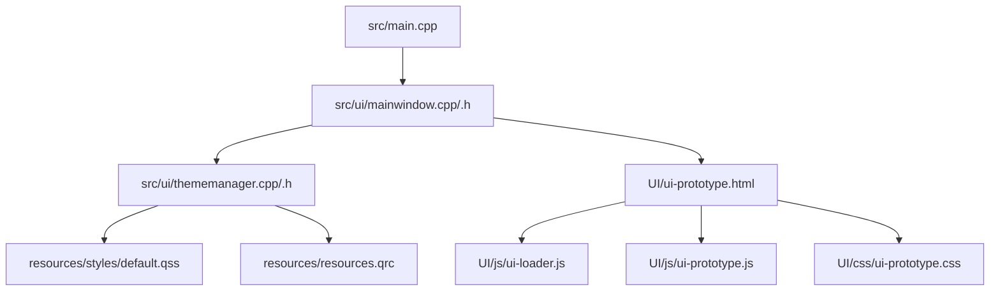
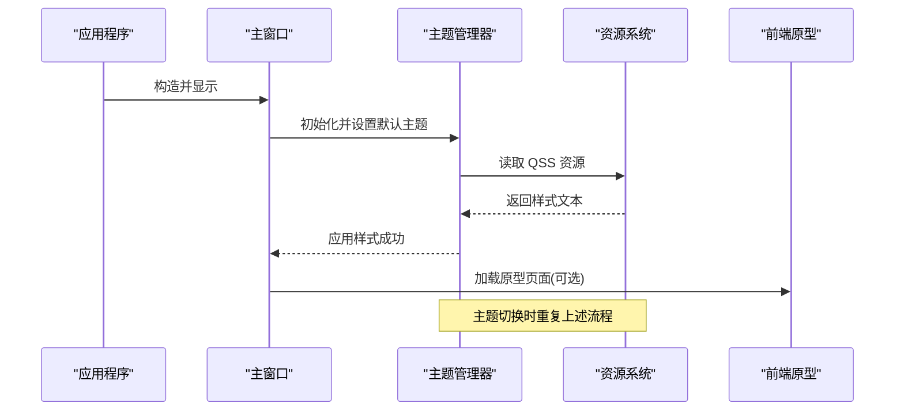
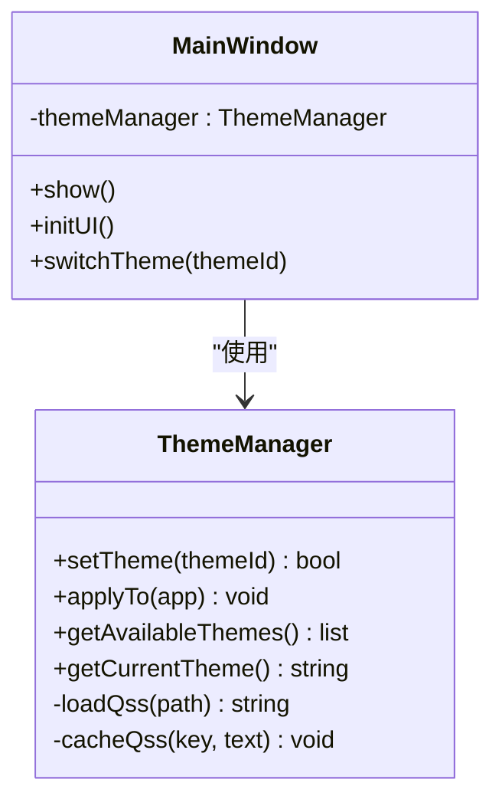
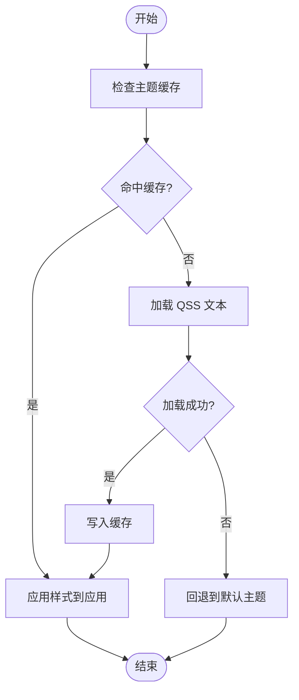
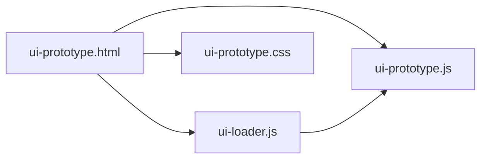
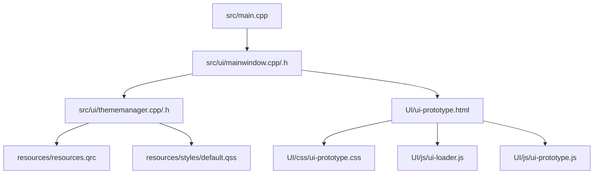

# 主题管理系统

<cite>
**本文引用的文件**
- [CMakeLists.txt](file://CMakeLists.txt)
- [src/main.cpp](file://src/main.cpp)
- [src/ui/mainwindow.h](file://src/ui/mainwindow.h)
- [src/ui/mainwindow.cpp](file://src/ui/mainwindow.cpp)
- [src/ui/thememanager.h](file://src/ui/thememanager.h)
- [src/ui/thememanager.cpp](file://src/ui/thememanager.cpp)
- [resources/styles/default.qss](file://resources/styles/default.qss)
- [resources/resources.qrc](file://resources/resources.qrc)
- [UI/ui-prototype.html](file://UI/ui-prototype.html)
- [UI/js/ui-loader.js](file://UI/js/ui-loader.js)
- [UI/js/ui-prototype.js](file://UI/js/ui-prototype.js)
- [UI/css/ui-prototype.css](file://UI/css/ui-prototype.css)
</cite>

## 目录
1. [简介](#简介)
2. [项目结构](#项目结构)
3. [核心组件](#核心组件)
4. [架构总览](#架构总览)
5. [详细组件分析](#详细组件分析)
6. [依赖关系分析](#依赖关系分析)
7. [性能考虑](#性能考虑)
8. [故障排查指南](#故障排查指南)
9. [结论](#结论)
10. [附录](#附录)

## 简介
本文件面向“主题管理系统”的代码库，聚焦于 Qt/C++ 应用中的主题加载、样式切换与 UI 资源管理。系统通过统一的主题管理器对 QSS 样式进行加载与应用，结合 Qt 资源系统与前端原型（HTML/JS/CSS）共同实现可插拔的界面外观能力。文档从架构、数据流、关键类职责、错误处理与性能优化等维度展开，帮助读者快速理解并扩展主题管理能力。

## 项目结构
仓库采用分层组织：
- src：C++ 核心与 UI 逻辑（Qt 工程）
- resources：QSS 样式与 Qt 资源清单
- UI：前端原型页面与脚本（用于预览或嵌入 WebEngine）
- scripts：构建脚本
- third_party：第三方库（如 dbcppp）

图表来源
- [src/main.cpp](file://src/main.cpp)
- [src/ui/mainwindow.cpp](file://src/ui/mainwindow.cpp)
- [src/ui/mainwindow.h](file://src/ui/mainwindow.h)
- [src/ui/thememanager.cpp](file://src/ui/thememanager.cpp)
- [src/ui/thememanager.h](file://src/ui/thememanager.h)
- [resources/styles/default.qss](file://resources/styles/default.qss)
- [resources/resources.qrc](file://resources/resources.qrc)
- [UI/ui-prototype.html](file://UI/ui-prototype.html)
- [UI/js/ui-loader.js](file://UI/js/ui-loader.js)
- [UI/js/ui-prototype.js](file://UI/js/ui-prototype.js)
- [UI/css/ui-prototype.css](file://UI/css/ui-prototype.css)

章节来源
- [CMakeLists.txt](file://CMakeLists.txt)
- [src/main.cpp](file://src/main.cpp)
- [src/ui/mainwindow.h](file://src/ui/mainwindow.h)
- [src/ui/mainwindow.cpp](file://src/ui/mainwindow.cpp)
- [src/ui/thememanager.h](file://src/ui/thememanager.h)
- [src/ui/thememanager.cpp](file://src/ui/thememanager.cpp)
- [resources/styles/default.qss](file://resources/styles/default.qss)
- [resources/resources.qrc](file://resources/resources.qrc)
- [UI/ui-prototype.html](file://UI/ui-prototype.html)
- [UI/js/ui-loader.js](file://UI/js/ui-loader.js)
- [UI/js/ui-prototype.js](file://UI/js/ui-prototype.js)
- [UI/css/ui-prototype.css](file://UI/css/ui-prototype.css)

## 核心组件
- 主窗口（MainWindow）：负责应用生命周期、UI 初始化、菜单/面板装配，以及触发主题切换。
- 主题管理器（ThemeManager）：封装 QSS 加载、缓存、应用与回退策略；提供主题枚举与当前主题查询。
- 资源系统（resources.qrc + default.qss）：集中管理样式资源路径，确保跨平台一致访问。
- 前端原型（UI/*）：提供 HTML/JS/CSS 原型，便于在 WebEngine 中渲染或作为主题预览。

章节来源
- [src/ui/mainwindow.h](file://src/ui/mainwindow.h)
- [src/ui/mainwindow.cpp](file://src/ui/mainwindow.cpp)
- [src/ui/thememanager.h](file://src/ui/thememanager.h)
- [src/ui/thememanager.cpp](file://src/ui/thememanager.cpp)
- [resources/resources.qrc](file://resources/resources.qrc)
- [resources/styles/default.qss](file://resources/styles/default.qss)
- [UI/ui-prototype.html](file://UI/ui-prototype.html)
- [UI/js/ui-loader.js](file://UI/js/ui-loader.js)
- [UI/js/ui-prototype.js](file://UI/js/ui-prototype.js)
- [UI/css/ui-prototype.css](file://UI/css/ui-prototype.css)

## 架构总览
主题管理的整体流程如下：
- 应用启动时创建主窗口并注册主题管理器。
- 主窗口根据配置或用户选择调用主题管理器加载对应 QSS。
- 主题管理器将样式应用到 QApplication/QMainWindow，并缓存结果。
- 若切换主题失败，自动回退到默认主题。
- 前端原型可通过 WebEngine 集成，受同一主题上下文影响。

图表来源
- [src/main.cpp](file://src/main.cpp)
- [src/ui/mainwindow.cpp](file://src/ui/mainwindow.cpp)
- [src/ui/thememanager.cpp](file://src/ui/thememanager.cpp)
- [resources/resources.qrc](file://resources/resources.qrc)
- [UI/ui-prototype.html](file://UI/ui-prototype.html)

## 详细组件分析

### 主窗口（MainWindow）
- 职责：应用入口后的 UI 装配、事件分发、主题切换入口。
- 关键点：
  - 在构造函数或初始化函数中创建并持有 ThemeManager 实例。
  - 暴露切换主题的接口，内部委托给 ThemeManager。
  - 处理用户交互（菜单/工具栏）触发主题变更。

图表来源
- [src/ui/mainwindow.h](file://src/ui/mainwindow.h)
- [src/ui/mainwindow.cpp](file://src/ui/mainwindow.cpp)
- [src/ui/thememanager.h](file://src/ui/thememanager.h)
- [src/ui/thememanager.cpp](file://src/ui/thememanager.cpp)

章节来源
- [src/ui/mainwindow.h](file://src/ui/mainwindow.h)
- [src/ui/mainwindow.cpp](file://src/ui/mainwindow.cpp)

### 主题管理器（ThemeManager）
- 职责：统一管理主题资源、加载与缓存 QSS、应用样式、错误回退。
- 关键点：
  - 主题标识与映射表：维护 themeId 到资源路径的映射。
  - QSS 加载：优先从资源系统读取，支持本地文件扩展。
  - 缓存机制：避免重复 IO，提升切换速度。
  - 错误处理：加载失败时记录日志并回退到默认主题。

图表来源
- [src/ui/thememanager.cpp](file://src/ui/thememanager.cpp)
- [src/ui/thememanager.h](file://src/ui/thememanager.h)
- [resources/resources.qrc](file://resources/resources.qrc)
- [resources/styles/default.qss](file://resources/styles/default.qss)

章节来源
- [src/ui/thememanager.h](file://src/ui/thememanager.h)
- [src/ui/thememanager.cpp](file://src/ui/thememanager.cpp)
- [resources/resources.qrc](file://resources/resources.qrc)
- [resources/styles/default.qss](file://resources/styles/default.qss)

### 资源系统（resources.qrc + default.qss）
- 职责：集中管理样式资源路径，保证跨平台一致性。
- 关键点：
  - qrc 清单定义资源别名与路径。
  - default.qss 作为默认主题样式，确保无可用主题时的稳定外观。

章节来源
- [resources/resources.qrc](file://resources/resources.qrc)
- [resources/styles/default.qss](file://resources/styles/default.qss)

### 前端原型（UI/*）
- 职责：提供 HTML/JS/CSS 原型，便于在 WebEngine 中渲染或作为主题预览。
- 关键点：
  - ui-prototype.html：页面骨架与脚本引用。
  - ui-loader.js：动态加载模块与资源。
  - ui-prototype.js：原型行为逻辑。
  - ui-prototype.css：原型样式，可与 QSS 主题保持一致性。

图表来源
- [UI/ui-prototype.html](file://UI/ui-prototype.html)
- [UI/js/ui-loader.js](file://UI/js/ui-loader.js)
- [UI/js/ui-prototype.js](file://UI/js/ui-prototype.js)
- [UI/css/ui-prototype.css](file://UI/css/ui-prototype.css)

章节来源
- [UI/ui-prototype.html](file://UI/ui-prototype.html)
- [UI/js/ui-loader.js](file://UI/js/ui-loader.js)
- [UI/js/ui-prototype.js](file://UI/js/ui-prototype.js)
- [UI/css/ui-prototype.css](file://UI/css/ui-prototype.css)

## 依赖关系分析
- 主窗口依赖主题管理器完成样式切换。
- 主题管理器依赖资源系统获取 QSS 文本。
- 前端原型与 Qt 应用解耦，可通过 WebEngine 集成，受主题上下文影响。

图表来源
- [src/main.cpp](file://src/main.cpp)
- [src/ui/mainwindow.cpp](file://src/ui/mainwindow.cpp)
- [src/ui/mainwindow.h](file://src/ui/mainwindow.h)
- [src/ui/thememanager.cpp](file://src/ui/thememanager.cpp)
- [src/ui/thememanager.h](file://src/ui/thememanager.h)
- [resources/resources.qrc](file://resources/resources.qrc)
- [resources/styles/default.qss](file://resources/styles/default.qss)
- [UI/ui-prototype.html](file://UI/ui-prototype.html)
- [UI/js/ui-loader.js](file://UI/js/ui-loader.js)
- [UI/js/ui-prototype.js](file://UI/js/ui-prototype.js)
- [UI/css/ui-prototype.css](file://UI/css/ui-prototype.css)

章节来源
- [src/main.cpp](file://src/main.cpp)
- [src/ui/mainwindow.h](file://src/ui/mainwindow.h)
- [src/ui/mainwindow.cpp](file://src/ui/mainwindow.cpp)
- [src/ui/thememanager.h](file://src/ui/thememanager.h)
- [src/ui/thememanager.cpp](file://src/ui/thememanager.cpp)
- [resources/resources.qrc](file://resources/resources.qrc)
- [resources/styles/default.qss](file://resources/styles/default.qss)
- [UI/ui-prototype.html](file://UI/ui-prototype.html)
- [UI/js/ui-loader.js](file://UI/js/ui-loader.js)
- [UI/js/ui-prototype.js](file://UI/js/ui-prototype.js)
- [UI/css/ui-prototype.css](file://UI/css/ui-prototype.css)

## 性能考虑
- 缓存 QSS 文本：避免重复 IO，减少主题切换延迟。
- 增量更新：仅对变化部分重新应用样式（若框架支持）。
- 资源预加载：启动时按需预加载常用主题，降低首次切换开销。
- 样式复杂度控制：避免过深的选择器与大量规则，提升渲染性能。

[本节为通用指导，不直接分析具体文件]

## 故障排查指南
- 主题未生效：
  - 检查 qrc 清单是否正确包含 QSS 路径。
  - 确认主题管理器加载路径与资源别名一致。
  - 查看是否触发了回退到默认主题。
- 切换卡顿：
  - 检查是否存在重复加载与未命中缓存的情况。
  - 评估 QSS 规则复杂度与数量。
- 前端样式不一致：
  - 核对 UI 原型 CSS 与 QSS 主题变量是否对齐。
  - 确认 WebEngine 上下文是否继承应用主题。

章节来源
- [src/ui/thememanager.cpp](file://src/ui/thememanager.cpp)
- [resources/resources.qrc](file://resources/resources.qrc)
- [resources/styles/default.qss](file://resources/styles/default.qss)
- [UI/ui-prototype.html](file://UI/ui-prototype.html)
- [UI/css/ui-prototype.css](file://UI/css/ui-prototype.css)

## 结论
主题管理系统以 ThemeManager 为核心，结合 Qt 资源系统与前端原型，实现了可扩展、可回退、高性能的样式管理能力。通过清晰的职责划分与缓存策略，系统在保持 UI 一致性的同时提供了良好的用户体验。后续可在主题注册、动态加载与样式调试方面进一步增强。

[本节为总结，不直接分析具体文件]

## 附录
- 构建与运行：参考根目录 CMakeLists.txt 与 scripts/build.py。
- 扩展新主题：在 qrc 中添加新 QSS，并在主题管理器中注册映射。
- 前端集成：在 UI 原型中遵循与 QSS 一致的命名约定，确保视觉一致性。

章节来源
- [CMakeLists.txt](file://CMakeLists.txt)
- [scripts/build.py](file://scripts/build.py)
- [resources/resources.qrc](file://resources/resources.qrc)
- [src/ui/thememanager.h](file://src/ui/thememanager.h)
- [src/ui/thememanager.cpp](file://src/ui/thememanager.cpp)
- [UI/ui-prototype.html](file://UI/ui-prototype.html)