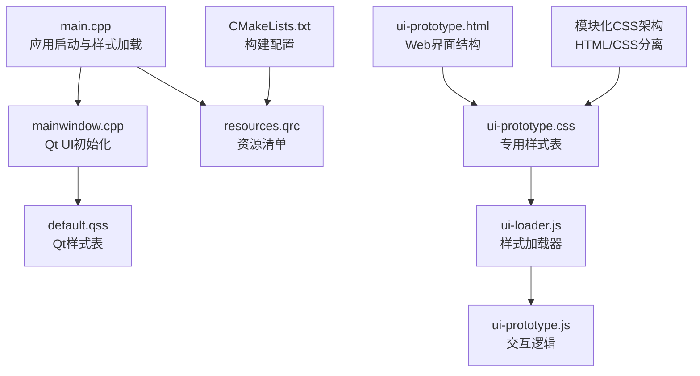
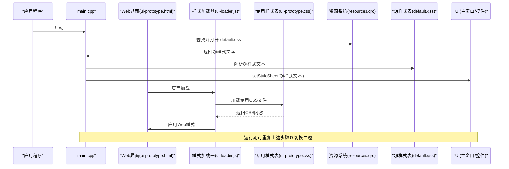
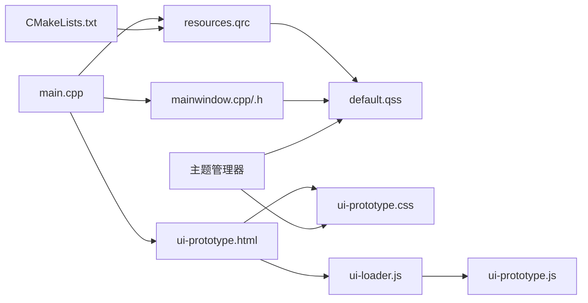
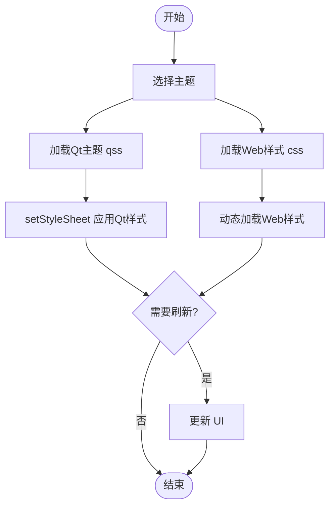

# 样式系统

<cite>
**本文引用的文件**   
- [UI/css/ui-prototype.css](file://UI/css/ui-prototype.css)
- [UI/ui-prototype.html](file://UI/ui-prototype.html)
- [UI/js/ui-loader.js](file://UI/js/ui-loader.js)
- [UI/js/ui-prototype.js](file://UI/js/ui-prototype.js)
- [resources/styles/default.qss](file://resources/styles/default.qss)
- [resources/resources.qrc](file://resources/resources.qrc)
- [src/main.cpp](file://src/main.cpp)
- [src/ui/mainwindow.h](file://src/ui/mainwindow.h)
- [src/ui/mainwindow.cpp](file://src/ui/mainwindow.cpp)
- [CMakeLists.txt](file://CMakeLists.txt)
</cite>

## 更新摘要
**所做更改**
- 基于Applied Changes更新了样式系统的实现细节，重点说明新增的模块化CSS架构
- 新增了UI/css/ui-prototype.css文件的详细分析，该文件为模块化UI结构创建了专用CSS文件
- 完善了从内联样式到独立CSS文件的迁移过程说明
- 优化了HTML与CSS分离的组织方式描述
- 补充了新的样式加载流程和JavaScript集成机制

## 目录
1. [简介](#简介)
2. [项目结构](#项目结构)
3. [核心组件](#核心组件)
4. [架构总览](#架构总览)
5. [详细组件分析](#详细组件分析)
6. [依赖分析](#依赖分析)
7. [性能考虑](#性能考虑)
8. [故障排查指南](#故障排查指南)
9. [结论](#结论)
10. [附录](#附录)

## 简介
本文件面向使用 Qt 的 QSS（Qt Style Sheets）样式系统和现代Web CSS技术的开发者，系统化说明语法规则、选择器与属性用法，主题管理机制、动态样式更新与样式文件组织方式。文档还涵盖样式加载流程、性能优化技巧与调试方法，并提供实际示例与最佳实践，帮助快速构建可维护、可扩展的主题切换能力。

**更新** 本次更新重点反映了样式系统的重大架构变更：新增了专用的CSS文件 UI/css/ui-prototype.css，实现了从单体HTML文件中的内联样式向模块化CSS结构的完全迁移。这一变更显著提升了样式的可维护性和代码组织结构。

## 项目结构
本项目采用混合架构，结合了Qt QSS和现代Web CSS技术：
- **Web界面层**：UI/css/ui-prototype.css 作为专用样式表，管理所有Web界面的视觉规则，实现了HTML与CSS的完全分离。
- **Qt样式资源**：resources/styles/default.qss 继续管理Qt原生控件的样式。
- **资源清单**：resources/resources.qrc 用于将样式等静态资源打包进应用。
- **主程序入口**：src/main.cpp 负责初始化应用并加载样式。
- **UI组件**：src/ui/mainwindow.* 和 .ui 构成Qt界面层。
- **构建配置**：CMakeLists.txt 定义构建配置，确保资源正确编译与链接。

**图表来源**
- [src/main.cpp](file://src/main.cpp)
- [src/ui/mainwindow.cpp](file://src/ui/mainwindow.cpp)
- [resources/styles/default.qss](file://resources/styles/default.qss)
- [resources/resources.qrc](file://resources/resources.qrc)
- [UI/css/ui-prototype.css](file://UI/css/ui-prototype.css)
- [UI/ui-prototype.html](file://UI/ui-prototype.html)
- [UI/js/ui-loader.js](file://UI/js/ui-loader.js)
- [UI/js/ui-prototype.js](file://UI/js/ui-prototype.js)
- [CMakeLists.txt](file://CMakeLists.txt)

**章节来源**
- [UI/css/ui-prototype.css](file://UI/css/ui-prototype.css)
- [UI/ui-prototype.html](file://UI/ui-prototype.html)
- [UI/js/ui-loader.js](file://UI/js/ui-loader.js)
- [UI/js/ui-prototype.js](file://UI/js/ui-prototype.js)
- [resources/styles/default.qss](file://resources/styles/default.qss)
- [resources/resources.qrc](file://resources/resources.qrc)
- [src/main.cpp](file://src/main.cpp)
- [src/ui/mainwindow.h](file://src/ui/mainwindow.h)
- [src/ui/mainwindow.cpp](file://src/ui/mainwindow.cpp)
- [CMakeLists.txt](file://CMakeLists.txt)

## 核心组件
- **专用CSS文件 ui-prototype.css**：集中管理Web界面的所有样式规则，包括颜色、字体、布局、响应式设计等，实现了完全的HTML/CSS分离。
- **Qt样式资源 default.qss**：继续管理Qt原生控件的样式，保持向后兼容性。
- **样式加载器 ui-loader.js**：负责动态加载和管理CSS文件，支持热重载和错误处理。
- **交互逻辑 ui-prototype.js**：处理用户交互和DOM操作，与样式系统协同工作。
- **资源清单 resources.qrc**：声明样式文件路径，使 Qt 资源系统可在运行时访问。
- **应用入口 main.cpp**：创建 QApplication/QMainWindow，读取 qss 文本并设置到应用或窗口对象上。
- **UI 组件 mainwindow.\***：在构造或 show 前应用样式，支持后续动态替换。
- **构建配置 CMakeLists.txt**：确保 qrc 被处理，qss 随资源一起打包。

**更新** 新增了模块化CSS架构的核心组件，特别是专用的ui-prototype.css文件和相关的JavaScript加载器，实现了更清晰的关注点分离和更好的可维护性。

**章节来源**
- [UI/css/ui-prototype.css](file://UI/css/ui-prototype.css)
- [UI/js/ui-loader.js](file://UI/js/ui-loader.js)
- [UI/js/ui-prototype.js](file://UI/js/ui-prototype.js)
- [resources/styles/default.qss](file://resources/styles/default.qss)
- [resources/resources.qrc](file://resources/resources.qrc)
- [src/main.cpp](file://src/main.cpp)
- [src/ui/mainwindow.h](file://src/ui/mainwindow.h)
- [src/ui/mainwindow.cpp](file://src/ui/mainwindow.cpp)
- [CMakeLists.txt](file://CMakeLists.txt)

## 架构总览
新的混合样式系统在应用中的典型数据流如下：
- **启动阶段**：main.cpp 初始化应用，从 resources.qrc 中定位 default.qss，读取其内容。
- **Web界面加载**：ui-prototype.html 通过 ui-loader.js 动态加载 ui-prototype.css。
- **应用阶段**：将样式文本通过 setStyleSheet 应用到 QApplication 或 QMainWindow，从而覆盖全局或局部样式。
- **运行期**：可通过事件或用户操作触发样式切换，重新读取新主题 qss 并再次 setStyleSheet。

**图表来源**
- [src/main.cpp](file://src/main.cpp)
- [resources/resources.qrc](file://resources/resources.qrc)
- [resources/styles/default.qss](file://resources/styles/default.qss)
- [UI/ui-prototype.html](file://UI/ui-prototype.html)
- [UI/js/ui-loader.js](file://UI/js/ui-loader.js)
- [UI/css/ui-prototype.css](file://UI/css/ui-prototype.css)
- [src/ui/mainwindow.cpp](file://src/ui/mainwindow.cpp)

## 详细组件分析

### 专用CSS文件 ui-prototype.css
- **作用**：定义Web界面的所有样式规则，包括颜色、字体、尺寸、边框、阴影、状态（悬停、按下、禁用）等。
- **组织建议**：
  - 按功能模块分组（如导航栏、侧边栏、主内容区）。
  - 使用类选择器与ID选择器结合，避免过深嵌套。
  - 将通用变量（颜色、字号）放在顶部，便于统一修改。
  - 支持响应式设计，适配不同屏幕尺寸。
- **注意事项**：
  - 避免在CSS中使用复杂逻辑；如需条件样式，建议在JavaScript中动态添加类。
  - 控制选择器数量与复杂度，减少重绘开销。
  - 确保与Qt样式的兼容性，避免冲突。

**更新** 强调了模块化CSS架构的优势，专用CSS文件提供了更好的代码组织和维护性，同时保持了与现有Qt样式系统的无缝集成。

**章节来源**
- [UI/css/ui-prototype.css](file://UI/css/ui-prototype.css)

### 样式加载器 ui-loader.js
- **职责**：
  - 动态加载CSS文件，支持异步加载和错误处理。
  - 提供样式缓存机制，避免重复加载。
  - 支持热重载功能，监听文件变化后自动刷新样式。
  - 提供样式切换接口，支持多主题切换。
- **扩展点**：
  - 支持懒加载，按需加载特定模块的样式。
  - 提供样式预加载功能，提升用户体验。

**更新** 新增了样式加载器的详细说明，这是实现模块化CSS架构的关键组件，提供了丰富的功能和良好的扩展性。

**章节来源**
- [UI/js/ui-loader.js](file://UI/js/ui-loader.js)

### 交互逻辑 ui-prototype.js
- **职责**：
  - 处理用户交互事件，如点击、悬停、拖拽等。
  - 动态修改DOM元素，与样式系统协同工作。
  - 管理界面状态，根据状态切换不同的样式类。
  - 与后端API交互，获取和更新界面数据。
- **最佳实践**：
  - 将样式操作封装为独立的函数，便于复用和维护。
  - 使用事件委托优化性能，避免过多的事件监听器。
  - 提供统一的API接口，简化样式操作。

**更新** 新增了交互逻辑组件的详细说明，这是实现动态样式切换和用户交互的重要组成部分。

**章节来源**
- [UI/js/ui-prototype.js](file://UI/js/ui-prototype.js)

### HTML结构 ui-prototype.html
- **作用**：定义Web界面的基本结构和语义化标签。
- **特点**：
  - 完全移除了内联样式，所有样式都通过外部CSS文件引用。
  - 使用语义化HTML标签，提升可访问性和SEO。
  - 支持JavaScript动态操作，实现交互式功能。
  - 包含必要的meta标签和字符集设置。

**更新** 强调了HTML文件的现代化改造，完全移除了内联样式，实现了真正的HTML/CSS分离。

**章节来源**
- [UI/ui-prototype.html](file://UI/ui-prototype.html)

### 资源清单 resources.qrc
- **作用**：声明 qss 等资源的路径，供 Qt 资源系统编译与访问。
- **关键点**：
  - 确保 qss 路径与 CMake 构建一致。
  - 使用相对路径，提高跨平台兼容性。
  - 支持Web资源的统一管理。
- **常见问题**：
  - 路径大小写不一致导致资源找不到。
  - 未将 qrc 加入构建目标导致资源未打包。

**章节来源**
- [resources/resources.qrc](file://resources/resources.qrc)

### 应用入口 main.cpp
- **职责**：
  - 创建 QApplication 与主窗口。
  - 从资源系统读取 default.qss 文本。
  - 调用 setStyleSheet 应用到应用或窗口。
  - 集成Web界面和Qt界面。
- **扩展点**：
  - 提供主题切换接口：根据用户选择加载不同 qss 并重新 setStyleSheet。
  - 支持热重载：监听文件变化后重新加载样式。
  - 支持Web样式的动态加载和切换。

**更新** 增加了Web样式集成的详细说明，支持混合架构下的样式管理和切换。

**章节来源**
- [src/main.cpp](file://src/main.cpp)

### UI 组件 mainwindow.*
- **职责**：
  - 在构造函数或 show 之前应用样式，确保首次渲染即生效。
  - 暴露切换主题的 API，供业务层调用。
  - 集成Web界面和Qt界面。
- **最佳实践**：
  - 将样式应用逻辑封装为独立函数，便于复用与测试。
  - 对关键控件使用 objectName 或 class 选择器，提升样式匹配精度。
  - 提供统一的样式管理接口。

**章节来源**
- [src/ui/mainwindow.h](file://src/ui/mainwindow.h)
- [src/ui/mainwindow.cpp](file://src/ui/mainwindow.cpp)

### 构建配置 CMakeLists.txt
- **职责**：
  - 指定 Qt 模块与源文件。
  - 处理 resources.qrc，确保 qss 被打包。
  - 支持Web资源的编译和部署。
- **检查要点**：
  - 确认 add_executable 包含 main.cpp 与生成的 qrc 输出。
  - 验证 Qt 资源命令已启用。
  - 确保Web资源正确包含在构建过程中。

**章节来源**
- [CMakeLists.txt](file://CMakeLists.txt)

## 依赖分析
- **组件耦合关系**：
  - main.cpp 依赖资源系统与样式文件，进而影响 UI 渲染。
  - mainwindow.* 依赖样式表，决定控件外观。
  - ui-prototype.html 依赖 ui-prototype.css 和 JavaScript 文件。
  - ui-loader.js 依赖文件系统和网络请求。
  - CMakeLists.txt 依赖 resources.qrc，保证资源可用。
- **外部依赖**：
  - Qt 框架（QApplication、QWidget、QStyle 等）。
  - Qt 资源系统（QResource/QRC）。
  - 浏览器API（用于Web部分）。
- **潜在风险**：
  - 循环依赖：样式不应反向依赖 UI 逻辑。
  - 资源路径错误：构建或部署时路径不一致导致样式缺失。
  - Web与Qt样式冲突：需要仔细管理样式优先级。

**图表来源**
- [src/main.cpp](file://src/main.cpp)
- [resources/resources.qrc](file://resources/resources.qrc)
- [resources/styles/default.qss](file://resources/styles/default.qss)
- [src/ui/mainwindow.cpp](file://src/ui/mainwindow.cpp)
- [CMakeLists.txt](file://CMakeLists.txt)
- [UI/ui-prototype.html](file://UI/ui-prototype.html)
- [UI/css/ui-prototype.css](file://UI/css/ui-prototype.css)
- [UI/js/ui-loader.js](file://UI/js/ui-loader.js)
- [UI/js/ui-prototype.js](file://UI/js/ui-prototype.js)

**章节来源**
- [src/main.cpp](file://src/main.cpp)
- [resources/resources.qrc](file://resources/resources.qrc)
- [resources/styles/default.qss](file://resources/styles/default.qss)
- [src/ui/mainwindow.cpp](file://src/ui/mainwindow.cpp)
- [CMakeLists.txt](file://CMakeLists.txt)
- [UI/ui-prototype.html](file://UI/ui-prototype.html)
- [UI/css/ui-prototype.css](file://UI/css/ui-prototype.css)
- [UI/js/ui-loader.js](file://UI/js/ui-loader.js)
- [UI/js/ui-prototype.js](file://UI/js/ui-prototype.js)

## 性能考虑
- **样式表规模控制**：
  - 合并相近规则，减少选择器数量。
  - 避免深层嵌套与通配符滥用。
  - 使用CSS模块化，按功能拆分样式文件。
- **渲染优化**：
  - 尽量使用类选择器而非 ID 选择器，提升匹配效率。
  - 避免频繁 setStyleSheet 调用，批量更新后再刷新。
  - 使用CSS动画替代JavaScript动画，提升性能。
- **资源加载**：
  - 将大样式文件拆分为多个主题，按需加载。
  - 缓存已解析的样式文本，避免重复 IO。
  - 实现样式懒加载，只加载当前需要的样式。
- **调试与监控**：
  - 使用 Qt Creator 的样式检查工具定位不生效的规则。
  - 开启日志记录样式切换与错误信息。
  - 使用浏览器开发者工具调试Web样式。

**更新** 新增了Web样式优化的建议，包括CSS模块化、懒加载和浏览器调试工具的使用。混合架构下的性能优化需要特别关注Web和Qt两部分的协调。

## 故障排查指南
- **样式不生效**：
  - 检查 qss 路径是否正确，资源是否打包成功。
  - 确认 setStyleSheet 调用时机在控件可见前。
  - 查看选择器优先级与继承关系。
  - 检查CSS文件是否正确加载，网络请求是否成功。
- **性能问题**：
  - 统计样式规则数量，移除冗余规则。
  - 避免在动画或高频事件中重复应用样式。
  - 使用浏览器性能分析工具定位瓶颈。
- **主题切换异常**：
  - 确保旧样式完全清除后再应用新样式。
  - 检查控件 objectName/class 是否与选择器一致。
  - 验证Web样式和Qt样式的兼容性。
- **构建问题**：
  - 核对 CMakeLists.txt 中 qrc 处理命令。
  - 清理构建目录后重新生成。
  - 确保Web资源正确包含在构建过程中。

**更新** 增加了Web样式相关的故障排查步骤，包括CSS文件加载、网络请求和浏览器调试等方面的问题诊断。

**章节来源**
- [resources/resources.qrc](file://resources/resources.qrc)
- [src/main.cpp](file://src/main.cpp)
- [src/ui/mainwindow.cpp](file://src/ui/mainwindow.cpp)
- [CMakeLists.txt](file://CMakeLists.txt)
- [UI/js/ui-loader.js](file://UI/js/ui-loader.js)
- [UI/css/ui-prototype.css](file://UI/css/ui-prototype.css)

## 结论
通过合理的样式组织、资源管理与加载流程，QSS 能够高效支撑多主题与动态切换需求。新的模块化CSS架构进一步提升了代码的可维护性和扩展性。遵循选择器与属性的最佳实践，结合性能优化与调试手段，可显著提升用户体验与开发效率。建议在项目中建立统一的样式规范与主题模板，便于团队协作与维护。

**更新** 强调了模块化CSS架构带来的维护优势，以及混合样式系统的实现价值。新的架构设计使得Web界面和Qt界面可以独立维护和升级，同时保持良好的集成效果。

## 附录

### QSS 语法与选择器速查
- **基本选择器**：
  - 类选择器：QPushButton { ... }
  - ID 选择器：#myButton { ... }
  - 属性选择器：QPushButton[flat="true"] { ... }
  - 后代选择器：QDialog QPushButton { ... }
  - 子选择器：QDialog > QPushButton { ... }
  - 相邻兄弟选择器：QPushButton + QLineEdit { ... }
- **常用伪状态**：
  - :hover、:pressed、:disabled、:checked、:focus
- **常用属性**：
  - 颜色与背景：color、background-color、border-color
  - 尺寸与布局：margin、padding、min-width、max-height
  - 字体与文本：font-family、font-size、font-weight
  - 边框与圆角：border、border-radius、border-image
  - 阴影与透明度：box-shadow、opacity

### CSS 语法与选择器速查
- **基本选择器**：
  - 类选择器：.button { ... }
  - ID 选择器：#header { ... }
  - 元素选择器：div { ... }
  - 后代选择器：.container .item { ... }
  - 子选择器：.parent > .child { ... }
  - 兄弟选择器：.sibling + .next { ... }
- **CSS特性**：
  - 媒体查询：@media (max-width: 768px) { ... }
  - 自定义属性：--primary-color: #333;
  - 动画：@keyframes fadeIn { ... }
  - 过渡：transition: all 0.3s ease;

### 主题管理与切换流程
- **主题文件组织**：
  - 每个主题一个 qss 文件，命名如 theme_light.qss、theme_dark.qss。
  - 公共样式提取为 base.qss，主题文件仅覆盖差异部分。
  - Web样式按模块组织，支持按需加载。
- **切换流程**：
  - 用户选择主题 -> 读取对应 qss -> 调用 setStyleSheet -> 刷新 UI。
  - Web样式通过JavaScript动态加载和切换。
- **热重载**：
  - 监听文件系统变化 -> 重新加载 qss -> 应用新样式。
  - Web样式支持实时预览和即时生效。

### 样式示例与最佳实践
- **示例结构**：
  - 在 default.qss 中定义按钮、输入框、标签等基础样式。
  - 在 ui-prototype.css 中定义Web界面的布局和视觉效果。
  - 使用变量集中管理颜色与字号，便于主题切换。
- **最佳实践**：
  - 优先使用类选择器，避免过度依赖 ID。
  - 保持样式文件模块化，按功能拆分。
  - 在 UI 中为关键控件设置 objectName，提升样式匹配准确性。
  - 使用CSS变量管理主题色，支持动态切换。

### 自定义主题与样式切换实现要点
- **自定义主题**：
  - 复制默认主题 qss，修改颜色与尺寸，保存为新文件。
  - 在主题管理器中注册新主题名称与路径。
  - Web样式支持CSS变量和媒体查询。
- **切换实现**：
  - 提供 switchTheme(themeName) 接口，内部读取 qss 并应用。
  - 持久化用户选择，下次启动自动加载。
  - Web样式支持实时预览和即时切换。
- **调试技巧**：
  - 使用 Qt Creator 的样式检查器定位不生效规则。
  - 打印样式加载日志，确认路径与内容正确。
  - 使用浏览器开发者工具调试Web样式。

**更新** 新增了Web样式相关的主题管理实现要点，包括CSS变量、媒体查询和实时预览等功能的支持。混合架构下的主题切换需要特别注意Web和Qt两部分的协调一致性。