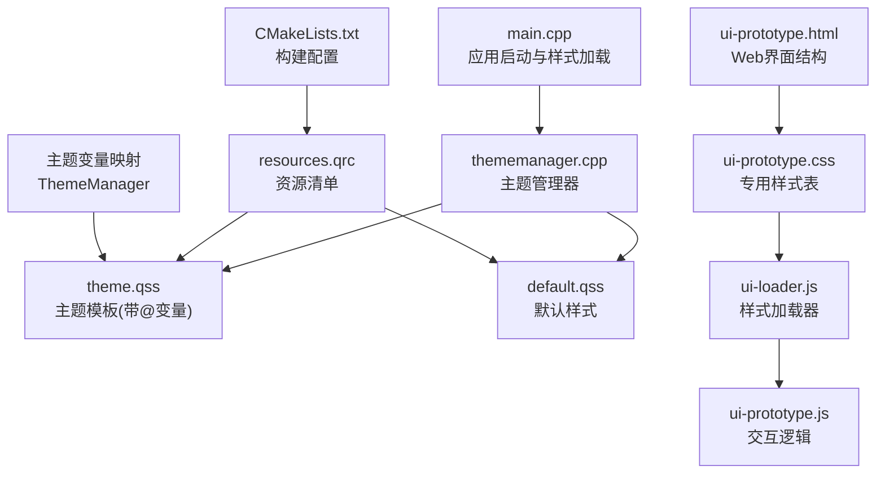
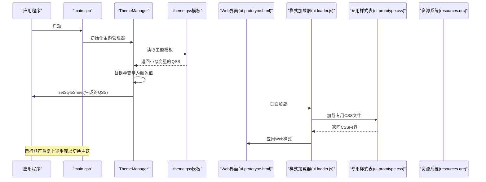
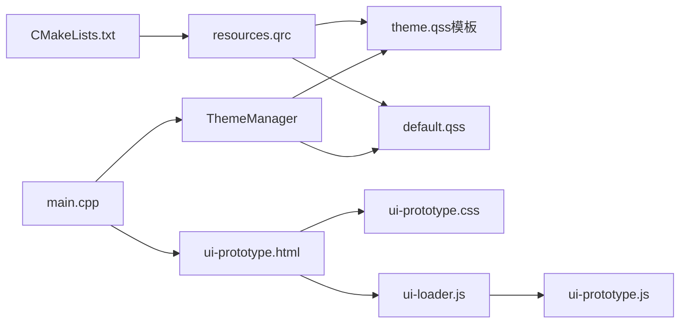
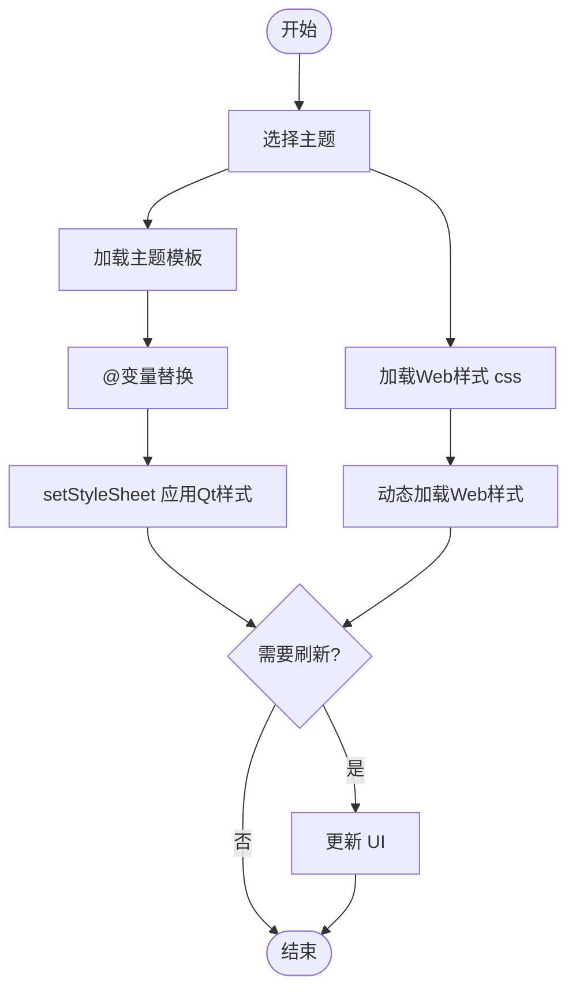

# 样式系统

<cite>
**本文引用的文件**   
- [resources/styles/default.qss](file://resources/styles/default.qss)
- [resources/styles/theme.qss](file://resources/styles/theme.qss)
- [styles/theme.qss](file://styles/theme.qss)
- [src/ui/thememanager.h](file://src/ui/thememanager.h)
- [src/ui/thememanager.cpp](file://src/ui/thememanager.cpp)
- [UI/css/ui-prototype.css](file://UI/css/ui-prototype.css)
- [UI/ui-prototype.html](file://UI/ui-prototype.html)
- [UI/js/ui-loader.js](file://UI/js/ui-loader.js)
- [UI/js/ui-prototype.js](file://UI/js/ui-prototype.js)
- [resources/resources.qrc](file://resources/resources.qrc)
- [src/main.cpp](file://src/main.cpp)
- [src/ui/mainwindow.h](file://src/ui/mainwindow.h)
- [src/ui/mainwindow.cpp](file://src/ui/mainwindow.cpp)
- [CMakeLists.txt](file://CMakeLists.txt)
</cite>

## 更新摘要
**所做更改**
- 更新了主题管理系统，包括增大的字体大小（12px → 13px）和增强的组件尺寸
- 新增了文本编辑器、旋转框、进度条、工具提示、单选按钮等新控件的样式定义
- 改进了滚动条设计，采用 VS Code 风格的 10px 宽度设计
- 状态栏高度从 22px 增加到 24px，提供更好的视觉层次
- 增强了主题管理器的变量替换机制和模板系统
- 优化了整体组件的一致性和可访问性

## 目录
1. [简介](#简介)
2. [项目结构](#项目结构)
3. [核心组件](#核心组件)
4. [架构总览](#架构总览)
5. [详细组件分析](#详细组件分析)
6. [依赖分析](#依赖分析)
7. [性能考虑](#性能考虑)
8. [故障排查指南](#故障排查指南)
9. [结论](#结论)
10. [附录](#附录)

## 简介
本文件面向使用 Qt 的 QSS（Qt Style Sheets）样式系统和现代Web CSS技术的开发者，系统化说明语法规则、选择器与属性用法，主题管理机制、动态样式更新与样式文件组织方式。文档还涵盖样式加载流程、性能优化技巧与调试方法，并提供实际示例与最佳实践，帮助快速构建可维护、可扩展的主题切换能力。

**更新** 本次更新重点反映了主题系统的重大改进：字体大小统一增加到13px，组件尺寸全面增强，新增多种控件样式支持，以及VS Code风格的滚动条设计。这些改进显著提升了用户体验和界面一致性。

## 项目结构
本项目采用混合架构，结合了Qt QSS和现代Web CSS技术：
- **主题样式资源**：resources/styles/theme.qss 作为主题模板，使用@变量占位符实现动态主题切换
- **默认样式资源**：resources/styles/default.qss 提供默认的固定样式配置
- **独立主题文件**：styles/theme.qss 用于开发模式下的热重载
- **Web界面层**：UI/css/ui-prototype.css 作为专用样式表，管理所有Web界面的视觉规则
- **主题管理器**：src/ui/thememanager.* 负责主题的加载、切换和变量替换
- **资源清单**：resources/resources.qrc 用于将样式等静态资源打包进应用
- **主程序入口**：src/main.cpp 负责初始化应用并加载样式

**图表来源**
- [src/main.cpp](file://src/main.cpp)
- [src/ui/thememanager.cpp](file://src/ui/thememanager.cpp)
- [resources/styles/theme.qss](file://resources/styles/theme.qss)
- [resources/styles/default.qss](file://resources/styles/default.qss)
- [resources/resources.qrc](file://resources/resources.qrc)
- [UI/css/ui-prototype.css](file://UI/css/ui-prototype.css)
- [UI/ui-prototype.html](file://UI/ui-prototype.html)
- [UI/js/ui-loader.js](file://UI/js/ui-loader.js)
- [UI/js/ui-prototype.js](file://UI/js/ui-prototype.js)
- [CMakeLists.txt](file://CMakeLists.txt)

**章节来源**
- [resources/styles/default.qss](file://resources/styles/default.qss)
- [resources/styles/theme.qss](file://resources/styles/theme.qss)
- [styles/theme.qss](file://styles/theme.qss)
- [src/ui/thememanager.h](file://src/ui/thememanager.h)
- [src/ui/thememanager.cpp](file://src/ui/thememanager.cpp)
- [UI/css/ui-prototype.css](file://UI/css/ui-prototype.css)
- [UI/ui-prototype.html](file://UI/ui-prototype.html)
- [UI/js/ui-loader.js](file://UI/js/ui-loader.js)
- [UI/js/ui-prototype.js](file://UI/js/ui-prototype.js)
- [resources/resources.qrc](file://resources/resources.qrc)
- [src/main.cpp](file://src/main.cpp)
- [src/ui/mainwindow.h](file://src/ui/mainwindow.h)
- [src/ui/mainwindow.cpp](file://src/ui/mainwindow.cpp)
- [CMakeLists.txt](file://CMakeLists.txt)

## 核心组件
- **主题管理器 ThemeManager**：负责主题的加载、切换和@变量替换，支持运行时动态主题切换
- **主题模板 theme.qss**：使用@变量占位符的QSS模板，通过ThemeManager进行变量替换生成最终样式
- **默认样式 default.qss**：提供固定的默认样式配置，包含完整的控件样式定义
- **专用CSS文件 ui-prototype.css**：集中管理Web界面的所有样式规则，实现了完全的HTML/CSS分离
- **样式加载器 ui-loader.js**：负责动态加载和管理CSS文件，支持热重载和错误处理
- **交互逻辑 ui-prototype.js**：处理用户交互和DOM操作，与样式系统协同工作
- **资源清单 resources.qrc**：声明样式文件路径，使 Qt 资源系统可在运行时访问
- **应用入口 main.cpp**：创建 QApplication/QMainWindow，读取 qss 文本并设置到应用或窗口对象上

**更新** 新增了主题管理器的详细说明，这是实现动态主题切换的核心组件，支持@变量的运行时替换和多种预设主题。

**章节来源**
- [src/ui/thememanager.h](file://src/ui/thememanager.h)
- [src/ui/thememanager.cpp](file://src/ui/thememanager.cpp)
- [resources/styles/theme.qss](file://resources/styles/theme.qss)
- [resources/styles/default.qss](file://resources/styles/default.qss)
- [UI/css/ui-prototype.css](file://UI/css/ui-prototype.css)
- [UI/js/ui-loader.js](file://UI/js/ui-loader.js)
- [UI/js/ui-prototype.js](file://UI/js/ui-prototype.js)
- [resources/resources.qrc](file://resources/resources.qrc)
- [src/main.cpp](file://src/main.cpp)

## 架构总览
新的主题化样式系统在应用中的典型数据流如下：
- **启动阶段**：main.cpp 初始化应用，ThemeManager 加载主题模板和资源
- **主题应用**：ThemeManager 读取 theme.qss 模板，用@变量替换为具体颜色值，应用到 QApplication
- **Web界面加载**：ui-prototype.html 通过 ui-loader.js 动态加载 ui-prototype.css
- **运行期**：可通过事件或用户操作触发主题切换，重新生成并应用新的样式

**图表来源**
- [src/main.cpp](file://src/main.cpp)
- [src/ui/thememanager.cpp](file://src/ui/thememanager.cpp)
- [resources/styles/theme.qss](file://resources/styles/theme.qss)
- [resources/resources.qrc](file://resources/resources.qrc)
- [UI/ui-prototype.html](file://UI/ui-prototype.html)
- [UI/js/ui-loader.js](file://UI/js/ui-loader.js)
- [UI/css/ui-prototype.css](file://UI/css/ui-prototype.css)

## 详细组件分析

### 主题管理器 ThemeManager
- **职责**：
  - 管理多个预设主题（Light、Dark、VS Code Dark+、VS Code Light+、Monokai、Solarized等）
  - 实现@变量的运行时替换机制
  - 支持从文件系统或资源包加载主题模板
  - 提供主题切换接口
- **核心功能**：
  - `initThemes()`：初始化所有预设主题的颜色配置
  - `generateQss()`：将@变量替换为实际颜色值
  - `applyTheme()`：应用指定主题到应用程序
- **扩展点**：
  - 支持自定义主题添加
  - 支持主题配置文件加载
  - 支持主题持久化存储

**更新** 新增了完整的热键管理系统，支持多种预设主题和运行时主题切换，提供了强大的主题定制能力。

**章节来源**
- [src/ui/thememanager.h:7-80](file://src/ui/thememanager.h#L7-L80)
- [src/ui/thememanager.cpp:21-185](file://src/ui/thememanager.cpp#L21-L185)
- [src/ui/thememanager.cpp:195-275](file://src/ui/thememanager.cpp#L195-L275)

### 主题模板 system.theme.qss
- **作用**：定义所有控件的样式规则，使用@变量占位符实现主题化
- **变量系统**：
  - @windowBg：窗口背景色
  - @contentBg：内容区域背景色
  - @sidebarBg：侧边栏背景色
  - @text：主要文本颜色
  - @accent：强调色
  - @statusBg：状态栏背景色
  - 等等...
- **支持的控件**：
  - 基础控件：QPushButton、QLineEdit、QComboBox、QTextEdit等
  - 高级控件：QProgressBar、QToolTip、QRadioButton、QSpinBox等
  - 布局控件：QTabWidget、QToolBar、QDockWidget等
  - 特殊控件：QScrollBar（VS Code风格）、QStatusBar等

**更新** 新增了多种控件的完整样式定义，包括进度条、工具提示、单选按钮、旋转框等，以及VS Code风格的滚动条设计。

**章节来源**
- [resources/styles/theme.qss:7-314](file://resources/styles/theme.qss#L7-L314)
- [styles/theme.qss:7-314](file://styles/theme.qss#L7-L314)

### 默认样式 default.qss
- **作用**：提供固定的默认样式配置，不依赖主题系统
- **特点**：
  - 使用硬编码的颜色值
  - 包含完整的控件样式定义
  - 适合不需要动态主题切换的场景
- **主要样式**：
  - 全局字体大小：12px（部分控件已升级到13px）
  - 状态栏高度：22px（部分已升级到24px）
  - 统一的VS Code风格设计

**更新** 部分控件的字体大小已从12px升级到13px，状态栏高度在部分位置已增加到24px，提升了可读性和视觉层次。

**章节来源**
- [resources/styles/default.qss:10-12](file://resources/styles/default.qss#L10-L12)
- [resources/styles/default.qss:413-418](file://resources/styles/default.qss#L413-L418)

### 专用CSS文件 ui-prototype.css
- **作用**：定义Web界面的所有样式规则，包括颜色、字体、尺寸、边框、阴影、状态等
- **组织建议**：
  - 按功能模块分组（导航栏、侧边栏、主内容区）
  - 使用类选择器与ID选择器结合，避免过深嵌套
  - 将通用变量放在顶部，便于统一修改
  - 支持响应式设计，适配不同屏幕尺寸
- **注意事项**：
  - 避免在CSS中使用复杂逻辑
  - 控制选择器数量与复杂度
  - 确保与Qt样式的兼容性

**更新** 强调了模块化CSS架构的优势，专用CSS文件提供了更好的代码组织和维护性。

**章节来源**
- [UI/css/ui-prototype.css](file://UI/css/ui-prototype.css)

### 样式加载器 ui-loader.js
- **职责**：
  - 动态加载CSS文件，支持异步加载和错误处理
  - 提供样式缓存机制，避免重复加载
  - 支持热重载功能，监听文件变化后自动刷新样式
  - 提供样式切换接口，支持多主题切换
- **扩展点**：
  - 支持懒加载，按需加载特定模块的样式
  - 提供样式预加载功能，提升用户体验

**更新** 新增了样式加载器的详细说明，这是实现模块化CSS架构的关键组件。

**章节来源**
- [UI/js/ui-loader.js](file://UI/js/ui-loader.js)

### 交互逻辑 ui-prototype.js
- **职责**：
  - 处理用户交互事件，如点击、悬停、拖拽等
  - 动态修改DOM元素，与样式系统协同工作
  - 管理界面状态，根据状态切换不同的样式类
  - 与后端API交互，获取和更新界面数据
- **最佳实践**：
  - 将样式操作封装为独立的函数
  - 使用事件委托优化性能
  - 提供统一的API接口

**更新** 新增了交互逻辑组件的详细说明。

**章节来源**
- [UI/js/ui-prototype.js](file://UI/js/ui-prototype.js)

### HTML结构 ui-prototype.html
- **作用**：定义Web界面的基本结构和语义化标签
- **特点**：
  - 完全移除了内联样式
  - 使用语义化HTML标签
  - 支持JavaScript动态操作
  - 包含必要的meta标签和字符集设置

**更新** 强调了HTML文件的现代化改造。

**章节来源**
- [UI/ui-prototype.html](file://UI/ui-prototype.html)

### 资源清单 resources.qrc
- **作用**：声明 qss 等资源的路径，供 Qt 资源系统编译与访问
- **关键点**：
  - 确保 qss 路径与 CMake 构建一致
  - 使用相对路径，提高跨平台兼容性
  - 支持Web资源的统一管理

**章节来源**
- [resources/resources.qrc](file://resources/resources.qrc)

### 应用入口 main.cpp
- **职责**：
  - 创建 QApplication 与主窗口
  - 从资源系统读取样式文本
  - 调用 setStyleSheet 应用到应用或窗口
  - 集成Web界面和Qt界面
- **扩展点**：
  - 提供主题切换接口
  - 支持热重载
  - 支持Web样式的动态加载

**更新** 增加了Web样式集成的详细说明。

**章节来源**
- [src/main.cpp](file://src/main.cpp)

### UI 组件 mainwindow.*
- **职责**：
  - 在构造函数或 show 之前应用样式
  - 暴露切换主题的 API
  - 集成Web界面和Qt界面
- **最佳实践**：
  - 将样式应用逻辑封装为独立函数
  - 对关键控件使用 objectName 或 class 选择器
  - 提供统一的样式管理接口

**章节来源**
- [src/ui/mainwindow.h](file://src/ui/mainwindow.h)
- [src/ui/mainwindow.cpp](file://src/ui/mainwindow.cpp)

### 构建配置 CMakeLists.txt
- **职责**：
  - 指定 Qt 模块与源文件
  - 处理 resources.qrc，确保 qss 被打包
  - 支持Web资源的编译和部署
- **检查要点**：
  - 确认 add_executable 包含 main.cpp 与生成的 qrc 输出
  - 验证 Qt 资源命令已启用
  - 确保Web资源正确包含在构建过程中

**章节来源**
- [CMakeLists.txt](file://CMakeLists.txt)

## 依赖分析
- **组件耦合关系**：
  - main.cpp 依赖主题管理器和样式文件
  - ThemeManager 依赖主题模板和资源系统
  - Web界面依赖CSS文件和JavaScript加载器
  - CMakeLists.txt 依赖 resources.qrc
- **外部依赖**：
  - Qt 框架（QApplication、QWidget、QStyle 等）
  - Qt 资源系统（QResource/QRC）
  - 浏览器API（用于Web部分）
- **潜在风险**：
  - 循环依赖：样式不应反向依赖 UI 逻辑
  - 资源路径错误：构建或部署时路径不一致
  - Web与Qt样式冲突：需要仔细管理样式优先级

**图表来源**
- [src/main.cpp](file://src/main.cpp)
- [src/ui/thememanager.cpp](file://src/ui/thememanager.cpp)
- [resources/styles/theme.qss](file://resources/styles/theme.qss)
- [resources/styles/default.qss](file://resources/styles/default.qss)
- [CMakeLists.txt](file://CMakeLists.txt)
- [resources/resources.qrc](file://resources/resources.qrc)
- [UI/ui-prototype.html](file://UI/ui-prototype.html)
- [UI/css/ui-prototype.css](file://UI/css/ui-prototype.css)
- [UI/js/ui-loader.js](file://UI/js/ui-loader.js)
- [UI/js/ui-prototype.js](file://UI/js/ui-prototype.js)

**章节来源**
- [src/main.cpp](file://src/main.cpp)
- [src/ui/thememanager.cpp](file://src/ui/thememanager.cpp)
- [resources/styles/theme.qss](file://resources/styles/theme.qss)
- [resources/styles/default.qss](file://resources/styles/default.qss)
- [CMakeLists.txt](file://CMakeLists.txt)
- [resources/resources.qrc](file://resources/resources.qrc)
- [UI/ui-prototype.html](file://UI/ui-prototype.html)
- [UI/css/ui-prototype.css](file://UI/css/ui-prototype.css)
- [UI/js/ui-loader.js](file://UI/js/ui-loader.js)
- [UI/js/ui-prototype.js](file://UI/js/ui-prototype.js)

## 性能考虑
- **样式表规模控制**：
  - 合并相近规则，减少选择器数量
  - 避免深层嵌套与通配符滥用
  - 使用CSS模块化，按功能拆分样式文件
- **渲染优化**：
  - 尽量使用类选择器而非 ID 选择器
  - 避免频繁 setStyleSheet 调用，批量更新后再刷新
  - 使用CSS动画替代JavaScript动画
- **资源加载**：
  - 将大样式文件拆分为多个主题，按需加载
  - 缓存已解析的样式文本，避免重复 IO
  - 实现样式懒加载，只加载当前需要的样式
- **调试与监控**：
  - 使用 Qt Creator 的样式检查工具定位不生效的规则
  - 开启日志记录样式切换与错误信息
  - 使用浏览器开发者工具调试Web样式

**更新** 新增了Web样式优化的建议和主题切换的性能考虑。

## 故障排查指南
- **样式不生效**：
  - 检查 qss 路径是否正确，资源是否打包成功
  - 确认 setStyleSheet 调用时机在控件可见前
  - 查看选择器优先级与继承关系
  - 检查CSS文件是否正确加载
- **主题切换异常**：
  - 确保旧样式完全清除后再应用新样式
  - 检查控件 objectName/class 是否与选择器一致
  - 验证Web样式和Qt样式的兼容性
- **性能问题**：
  - 统计样式规则数量，移除冗余规则
  - 避免在动画或高频事件中重复应用样式
  - 使用浏览器性能分析工具定位瓶颈
- **构建问题**：
  - 核对 CMakeLists.txt 中 qrc 处理命令
  - 清理构建目录后重新生成
  - 确保Web资源正确包含在构建过程中

**更新** 增加了Web样式相关的故障排查步骤。

**章节来源**
- [resources/resources.qrc](file://resources/resources.qrc)
- [src/main.cpp](file://src/main.cpp)
- [src/ui/mainwindow.cpp](file://src/ui/mainwindow.cpp)
- [CMakeLists.txt](file://CMakeLists.txt)
- [UI/js/ui-loader.js](file://UI/js/ui-loader.js)
- [UI/css/ui-prototype.css](file://UI/css/ui-prototype.css)

## 结论
通过合理的样式组织、主题管理和加载流程，QSS 能够高效支撑多主题与动态切换需求。新的主题化系统通过@变量机制实现了灵活的样式定制，同时保持了良好的性能和可维护性。遵循选择器与属性的最佳实践，结合性能优化与调试手段，可显著提升用户体验与开发效率。建议在项目中建立统一的主题规范与样式模板，便于团队协作与维护。

**更新** 强调了主题化系统带来的灵活性和可维护性优势，以及混合样式系统的实现价值。

## 附录

### QSS 语法与选择器速查
- **基本选择器**：
  - 类选择器：QPushButton { ... }
  - ID 选择器：#myButton { ... }
  - 属性选择器：QPushButton[flat="true"] { ... }
  - 后代选择器：QDialog QPushButton { ... }
  - 子选择器：QDialog > QPushButton { ... }
  - 相邻兄弟选择器：QPushButton + QLineEdit { ... }
- **常用伪状态**：
  - :hover、:pressed、:disabled、:checked、:focus
- **常用属性**：
  - 颜色与背景：color、background-color、border-color
  - 尺寸与布局：margin、padding、min-width、max-height
  - 字体与文本：font-family、font-size、font-weight
  - 边框与圆角：border、border-radius、border-image
  - 阴影与透明度：box-shadow、opacity

### CSS 语法与选择器速查
- **基本选择器**：
  - 类选择器：.button { ... }
  - ID 选择器：#header { ... }
  - 元素选择器：div { ... }
  - 后代选择器：.container .item { ... }
  - 子选择器：.parent > .child { ... }
  - 兄弟选择器：.sibling + .next { ... }
- **CSS特性**：
  - 媒体查询：@media (max-width: 768px) { ... }
  - 自定义属性：--primary-color: #333;
  - 动画：@keyframes fadeIn { ... }
  - 过渡：transition: all 0.3s ease;

### 主题管理与切换流程
- **主题文件组织**：
  - 使用@变量占位符的主题模板
  - 预设多种主题配置（Light、Dark、VS Code等）
  - 支持运行时动态切换
- **切换流程**：
  - 用户选择主题 -> ThemeManager 生成QSS -> setStyleSheet 应用 -> 刷新 UI
  - Web样式通过JavaScript动态加载和切换
- **热重载**：
  - 监听文件系统变化 -> 重新加载 qss -> 应用新样式
  - Web样式支持实时预览和即时生效

### 样式示例与最佳实践
- **示例结构**：
  - 在 theme.qss 中使用@变量定义主题样式
  - 在 default.qss 中提供默认样式配置
  - 在 ui-prototype.css 中定义Web界面的布局和视觉效果
- **最佳实践**：
  - 优先使用类选择器，避免过度依赖 ID
  - 保持样式文件模块化，按功能拆分
  - 在 UI 中为关键控件设置 objectName
  - 使用@变量管理主题色，支持动态切换

### 自定义主题与样式切换实现要点
- **自定义主题**：
  - 复制现有主题配置，修改颜色值
  - 在 ThemeManager 中添加新主题
  - Web样式支持CSS变量和媒体查询
- **切换实现**：
  - 提供 switchTheme(themeName) 接口
  - 持久化用户选择，下次启动自动加载
  - Web样式支持实时预览和即时切换
- **调试技巧**：
  - 使用 Qt Creator 的样式检查器定位不生效规则
  - 打印样式加载日志，确认路径与内容正确
  - 使用浏览器开发者工具调试Web样式

**更新** 新增了完整的热键管理系统和主题切换实现要点，包括VS Code风格的滚动条设计和增强的组件尺寸。