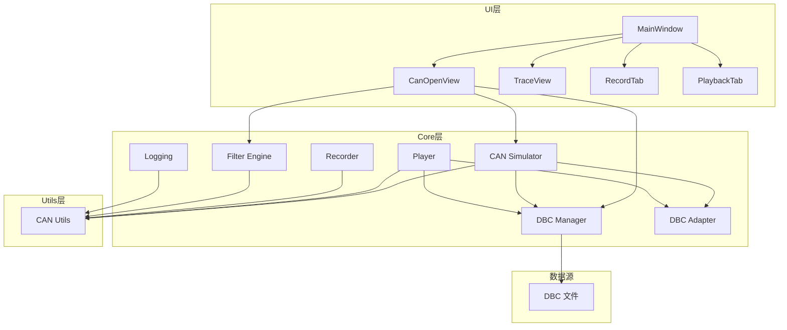
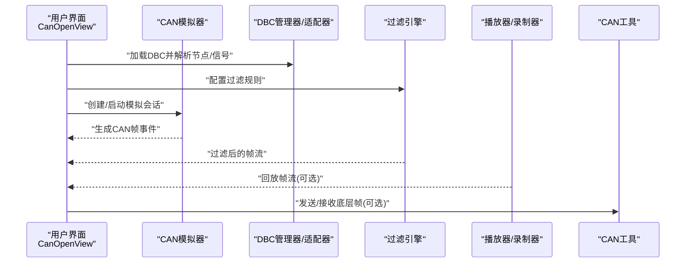
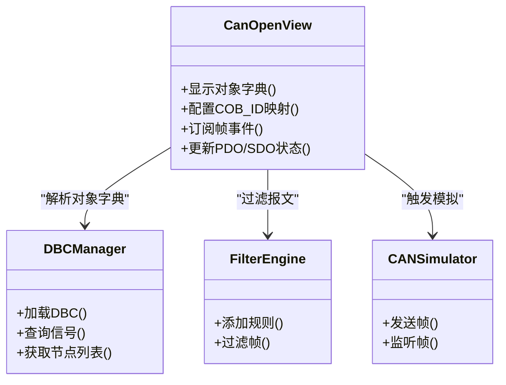
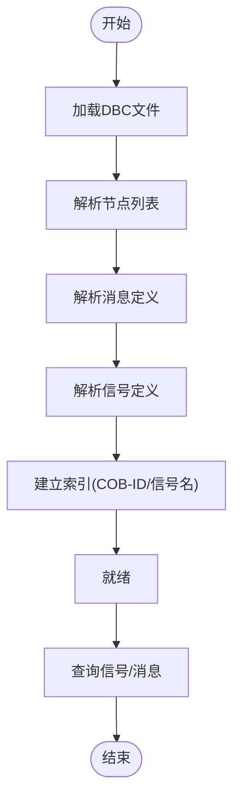
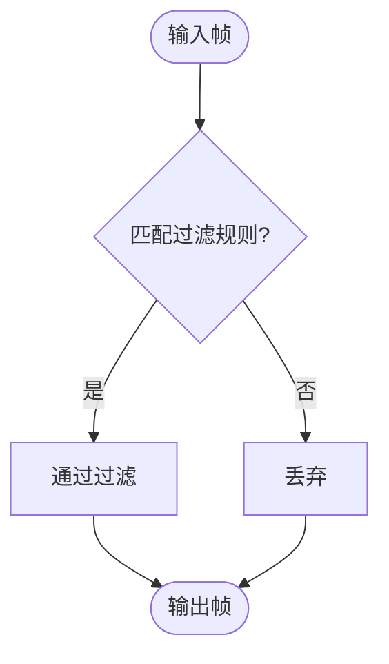
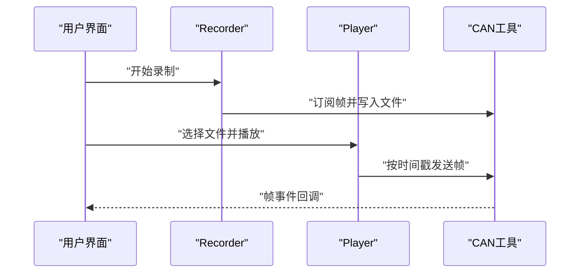
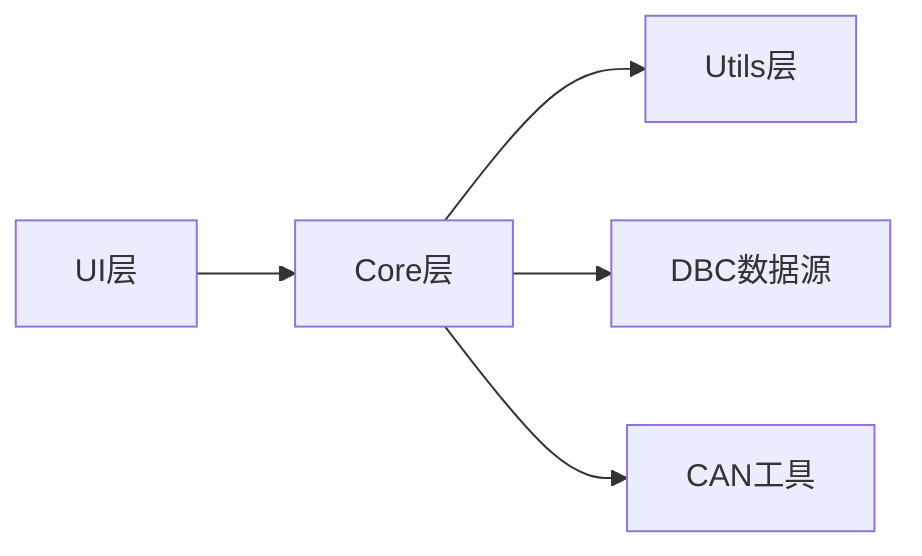

# CAN Open协议支持

<cite>
**本文引用的文件**   
- [src/main.cpp](file://src/main.cpp)
- [src/core/cansimulator.h](file://src/core/cansimulator.h)
- [src/core/cansimulator.cpp](file://src/core/cansimulator.cpp)
- [src/core/dbcmanager.h](file://src/core/dbcmanager.h)
- [src/core/dbcmanager.cpp](file://src/core/dbcmanager.cpp)
- [src/core/dbc_adapter.h](file://src/core/dbc_adapter.h)
- [src/core/dbc_adapter.cpp](file://src/core/dbc_adapter.cpp)
- [src/core/filter_engine.h](file://src/core/filter_engine.h)
- [src/core/filter_engine.cpp](file://src/core/filter_engine.cpp)
- [src/core/player.h](file://src/core/player.h)
- [src/core/player.cpp](file://src/core/player.cpp)
- [src/core/recorder.h](file://src/core/recorder.h)
- [src/core/recorder.cpp](file://src/core/recorder.cpp)
- [src/core/logging.h](file://src/core/logging.h)
- [src/core/logging.cpp](file://src/core/logging.cpp)
- [src/utils/canutils.h](file://src/utils/canutils.h)
- [src/utils/canutils.cpp](file://src/utils/canutils.cpp)
- [src/ui/canopenview.h](file://src/ui/canopenview.h)
- [src/ui/canopenview.cpp](file://src/ui/canopenview.cpp)
- [src/ui/mainwindow.h](file://src/ui/mainwindow.h)
- [src/ui/mainwindow.cpp](file://src/ui/mainwindow.cpp)
- [scripts/V5.4.0_20260605_INFO_CAN.dbc](file://scripts/V5.4.0_20260605_INFO_CAN.dbc)
</cite>

## 目录
1. [简介](#简介)
2. [项目结构](#项目结构)
3. [核心组件](#核心组件)
4. [架构总览](#架构总览)
5. [详细组件分析](#详细组件分析)
6. [依赖关系分析](#依赖关系分析)
7. [性能考量](#性能考量)
8. [故障排查指南](#故障排查指南)
9. [结论](#结论)
10. [附录](#附录)

## 简介
本项目是一个基于Qt的CAN总线工具，提供DBC解析、信号收发、录制与回放、过滤与可视化等功能。当前仓库未包含专门的“CAN Open”协议栈实现，但通过DBC驱动的信号建模与UI展示，已具备对CAN Open节点通信行为的仿真与分析能力。本文档聚焦于如何在现有架构下扩展并集成CAN Open协议支持，包括：
- 使用DBC描述CAN Open对象字典（PDO/SDO）映射
- 在模拟器与播放器中注入标准COB-ID与报文格式
- 在UI层提供CAN Open视图与交互
- 保持与现有CAN工具链（日志、过滤、录制/回放）的兼容

## 项目结构
项目采用分层组织：UI层负责交互与可视化；core层提供CAN仿真、DBC管理、过滤引擎、记录/回放等核心能力；utils层提供通用工具；third_party为第三方库；scripts包含构建脚本与DBC样例。

图表来源
- [src/ui/mainwindow.h](file://src/ui/mainwindow.h)
- [src/ui/canopenview.h](file://src/ui/canopenview.h)
- [src/core/cansimulator.h](file://src/core/cansimulator.h)
- [src/core/dbcmanager.h](file://src/core/dbcmanager.h)
- [src/core/filter_engine.h](file://src/core/filter_engine.h)
- [src/core/player.h](file://src/core/player.h)
- [src/core/recorder.h](file://src/core/recorder.h)
- [src/utils/canutils.h](file://src/utils/canutils.h)

章节来源
- [src/main.cpp](file://src/main.cpp)
- [src/ui/mainwindow.h](file://src/ui/mainwindow.h)
- [src/ui/mainwindow.cpp](file://src/ui/mainwindow.cpp)
- [src/ui/canopenview.h](file://src/ui/canopenview.h)
- [src/ui/canopenview.cpp](file://src/ui/canopenview.cpp)
- [src/core/cansimulator.h](file://src/core/cansimulator.h)
- [src/core/cansimulator.cpp](file://src/core/cansimulator.cpp)
- [src/core/dbcmanager.h](file://src/core/dbcmanager.h)
- [src/core/dbcmanager.cpp](file://src/core/dbcmanager.cpp)
- [src/core/dbc_adapter.h](file://src/core/dbc_adapter.h)
- [src/core/dbc_adapter.cpp](file://src/core/dbc_adapter.cpp)
- [src/core/filter_engine.h](file://src/core/filter_engine.h)
- [src/core/filter_engine.cpp](file://src/core/filter_engine.cpp)
- [src/core/player.h](file://src/core/player.h)
- [src/core/player.cpp](file://src/core/player.cpp)
- [src/core/recorder.h](file://src/core/recorder.h)
- [src/core/recorder.cpp](file://src/core/recorder.cpp)
- [src/utils/canutils.h](file://src/utils/canutils.h)
- [src/utils/canutils.cpp](file://src/utils/canutils.cpp)
- [scripts/V5.4.0_20260605_INFO_CAN.dbc](file://scripts/V5.4.0_20260605_INFO_CAN.dbc)

## 核心组件
- CAN模拟器：生成与发送模拟CAN帧，支撑协议行为演示与测试
- DBC管理器与适配器：加载DBC、解析节点/信号/消息，提供查询与转换接口
- 过滤引擎：按ID、信号、时间窗口等条件筛选报文流
- 播放器与录制器：从文件或实时流读取/写入CAN帧，支持回放与录制
- 日志系统：统一输出调试与运行信息
- CAN工具：封装底层CAN操作与常用处理函数
- UI视图：主窗口、Trace视图、以及可扩展的CAN Open视图

章节来源
- [src/core/cansimulator.h](file://src/core/cansimulator.h)
- [src/core/cansimulator.cpp](file://src/core/cansimulator.cpp)
- [src/core/dbcmanager.h](file://src/core/dbcmanager.h)
- [src/core/dbcmanager.cpp](file://src/core/dbcmanager.cpp)
- [src/core/dbc_adapter.h](file://src/core/dbc_adapter.h)
- [src/core/dbc_adapter.cpp](file://src/core/dbc_adapter.cpp)
- [src/core/filter_engine.h](file://src/core/filter_engine.h)
- [src/core/filter_engine.cpp](file://src/core/filter_engine.cpp)
- [src/core/player.h](file://src/core/player.h)
- [src/core/player.cpp](file://src/core/player.cpp)
- [src/core/recorder.h](file://src/core/recorder.h)
- [src/core/recorder.cpp](file://src/core/recorder.cpp)
- [src/utils/canutils.h](file://src/utils/canutils.h)
- [src/utils/canutils.cpp](file://src/utils/canutils.cpp)
- [src/ui/canopenview.h](file://src/ui/canopenview.h)
- [src/ui/canopenview.cpp](file://src/ui/canopenview.cpp)

## 架构总览
下图展示了从UI到核心模块的数据与控制流向，强调CAN Open相关扩展点：
- CanOpenView作为入口，协调DBC解析、过滤器与模拟器
- 播放器/录制器与CAN工具对接底层总线或文件
- DBC适配器将DBC语义转换为可操作的信号模型

图表来源
- [src/ui/canopenview.h](file://src/ui/canopenview.h)
- [src/core/cansimulator.h](file://src/core/cansimulator.h)
- [src/core/dbcmanager.h](file://src/core/dbcmanager.h)
- [src/core/dbc_adapter.h](file://src/core/dbc_adapter.h)
- [src/core/filter_engine.h](file://src/core/filter_engine.h)
- [src/core/player.h](file://src/core/player.h)
- [src/core/recorder.h](file://src/core/recorder.h)
- [src/utils/canutils.h](file://src/utils/canutils.h)

## 详细组件分析

### CAN Open视图（CanOpenView）
- 职责：提供CAN Open相关的UI面板，展示对象字典、PDO/SDO状态、设备拓扑等
- 扩展建议：
  - 增加COB-ID映射表，自动识别NMT、TPDO、RPDO、SDO等报文
  - 与DBC信号绑定，将对象字典条目映射为可视化的信号项
  - 提供手动触发SDO读写、PDO同步控制等交互

图表来源
- [src/ui/canopenview.h](file://src/ui/canopenview.h)
- [src/core/dbcmanager.h](file://src/core/dbcmanager.h)
- [src/core/filter_engine.h](file://src/core/filter_engine.h)
- [src/core/cansimulator.h](file://src/core/cansimulator.h)

章节来源
- [src/ui/canopenview.h](file://src/ui/canopenview.h)
- [src/ui/canopenview.cpp](file://src/ui/canopenview.cpp)

### DBC管理与适配（DBCManager & DBCAdapter）
- 职责：加载DBC文件，解析节点、消息、信号定义，提供查询与转换能力
- 与CAN Open结合：
  - 将对象字典条目映射为DBC信号，便于可视化与编辑
  - 根据COB-ID快速定位对应消息，提升解析效率

图表来源
- [src/core/dbcmanager.h](file://src/core/dbcmanager.h)
- [src/core/dbcmanager.cpp](file://src/core/dbcmanager.cpp)
- [src/core/dbc_adapter.h](file://src/core/dbc_adapter.h)
- [src/core/dbc_adapter.cpp](file://src/core/dbc_adapter.cpp)
- [scripts/V5.4.0_20260605_INFO_CAN.dbc](file://scripts/V5.4.0_20260605_INFO_CAN.dbc)

章节来源
- [src/core/dbcmanager.h](file://src/core/dbcmanager.h)
- [src/core/dbcmanager.cpp](file://src/core/dbcmanager.cpp)
- [src/core/dbc_adapter.h](file://src/core/dbc_adapter.h)
- [src/core/dbc_adapter.cpp](file://src/core/dbc_adapter.cpp)

### 过滤引擎（FilterEngine）
- 职责：按COB-ID、信号、时间范围等条件过滤帧流
- 与CAN Open结合：
  - 预设过滤模板（如仅显示特定节点的TPDO/RPDO）
  - 动态切换过滤策略以观察不同对象字典条目

图表来源
- [src/core/filter_engine.h](file://src/core/filter_engine.h)
- [src/core/filter_engine.cpp](file://src/core/filter_engine.cpp)

章节来源
- [src/core/filter_engine.h](file://src/core/filter_engine.h)
- [src/core/filter_engine.cpp](file://src/core/filter_engine.cpp)

### 播放器与录制器（Player & Recorder）
- 职责：从文件或实时流读取/写入CAN帧，支持回放与录制
- 与CAN Open结合：
  - 回放包含NMT/SDO/PDO的完整会话，用于复现设备行为
  - 录制时标注COB-ID类别，便于后续分析

图表来源
- [src/core/recorder.h](file://src/core/recorder.h)
- [src/core/recorder.cpp](file://src/core/recorder.cpp)
- [src/core/player.h](file://src/core/player.h)
- [src/core/player.cpp](file://src/core/player.cpp)
- [src/utils/canutils.h](file://src/utils/canutils.h)

章节来源
- [src/core/recorder.h](file://src/core/recorder.h)
- [src/core/recorder.cpp](file://src/core/recorder.cpp)
- [src/core/player.h](file://src/core/player.h)
- [src/core/player.cpp](file://src/core/player.cpp)

### CAN工具（CANUtils）
- 职责：封装底层CAN操作与常用处理函数
- 与CAN Open结合：
  - 提供COB-ID分类与校验辅助方法
  - 统一错误码与异常处理

章节来源
- [src/utils/canutils.h](file://src/utils/canutils.h)
- [src/utils/canutils.cpp](file://src/utils/canutils.cpp)

### 日志系统（Logging）
- 职责：统一输出调试与运行信息
- 与CAN Open结合：
  - 记录NMT状态机变化、SDO传输错误、PDO同步异常等关键事件

章节来源
- [src/core/logging.h](file://src/core/logging.h)
- [src/core/logging.cpp](file://src/core/logging.cpp)

## 依赖关系分析
- UI层依赖core层提供的仿真、解析与过滤能力
- core层依赖utils层的工具函数
- DBC文件作为外部数据源，被DBC管理器加载
- 播放器/录制器与CAN工具协作完成I/O

图表来源
- [src/ui/mainwindow.h](file://src/ui/mainwindow.h)
- [src/core/cansimulator.h](file://src/core/cansimulator.h)
- [src/core/dbcmanager.h](file://src/core/dbcmanager.h)
- [src/utils/canutils.h](file://src/utils/canutils.h)

章节来源
- [src/ui/mainwindow.h](file://src/ui/mainwindow.h)
- [src/core/cansimulator.h](file://src/core/cansimulator.h)
- [src/core/dbcmanager.h](file://src/core/dbcmanager.h)
- [src/utils/canutils.h](file://src/utils/canutils.h)

## 性能考量
- 过滤引擎应在高频帧场景下优先执行，减少下游处理压力
- DBC索引应缓存COB-ID与信号映射，避免重复解析
- 播放器回放需按时间戳平滑调度，避免突发导致丢帧
- 日志输出应异步化，避免阻塞主循环

[本节为通用指导，不直接分析具体文件]

## 故障排查指南
- DBC加载失败：检查文件路径与编码，确认节点/消息/信号完整性
- COB-ID冲突：确保同一总线内唯一，必要时重映射
- 过滤无结果：核对过滤规则与目标COB-ID/信号名
- 回放卡顿：检查时间戳连续性与发送速率设置
- 日志缺失：确认日志级别与输出目标配置

章节来源
- [src/core/dbcmanager.h](file://src/core/dbcmanager.h)
- [src/core/filter_engine.h](file://src/core/filter_engine.h)
- [src/core/player.h](file://src/core/player.h)
- [src/core/logging.h](file://src/core/logging.h)

## 结论
当前仓库未内置专用CAN Open协议栈，但通过DBC驱动的信号建模与完善的CAN工具链，已具备扩展为CAN Open支持的基础。建议在CanOpenView中引入COB-ID映射与对象字典视图，结合滤波器与播放器/录制器，形成完整的CAN Open分析与仿真环境。

[本节为总结性内容，不直接分析具体文件]

## 附录
- 示例DBC文件位于scripts目录，可用于验证对象字典映射与信号解析流程

[本节为补充说明，不直接分析具体文件]