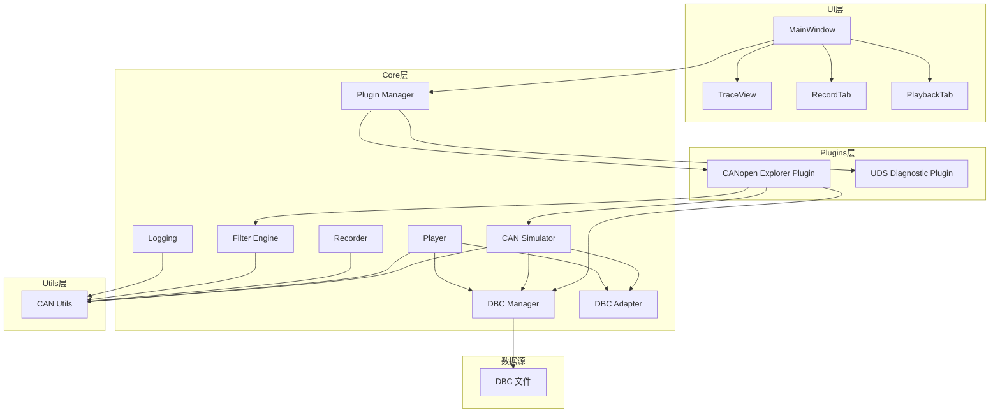
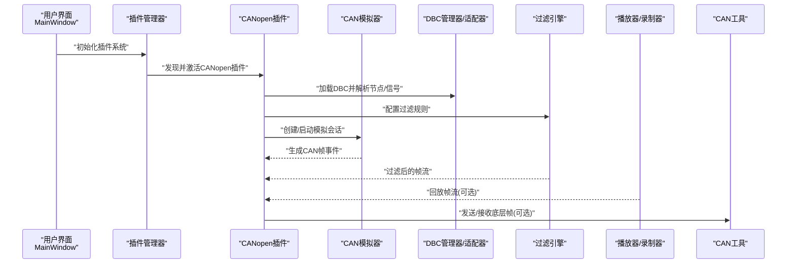
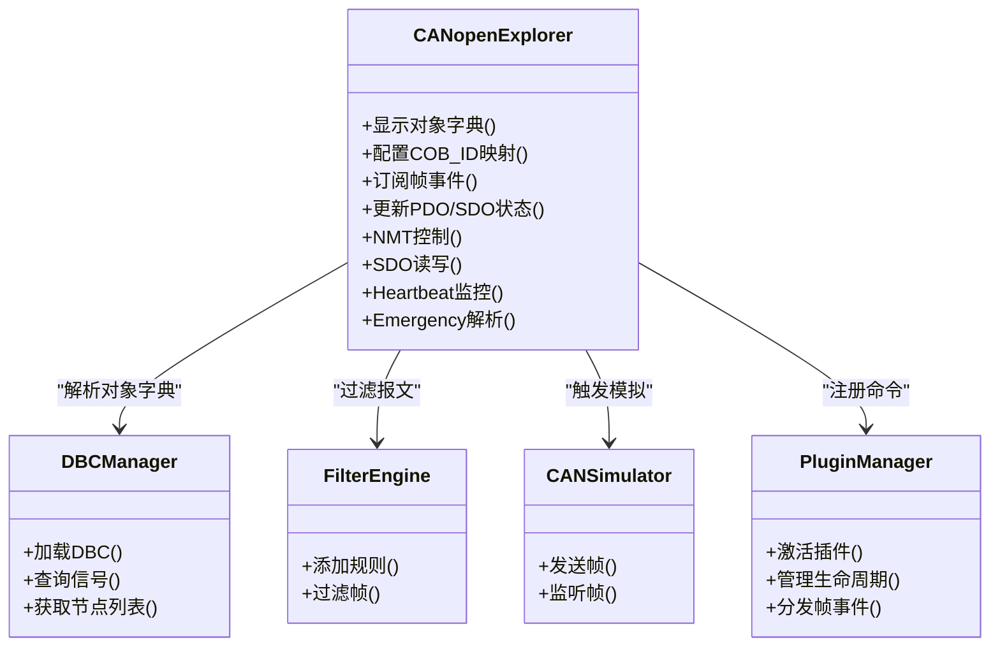
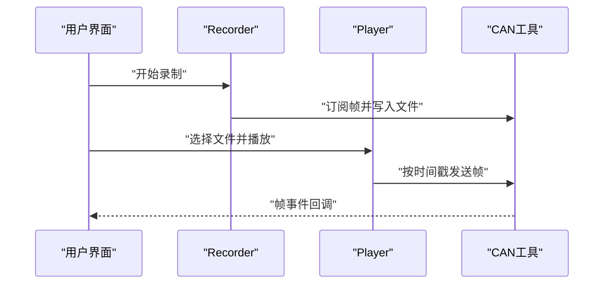
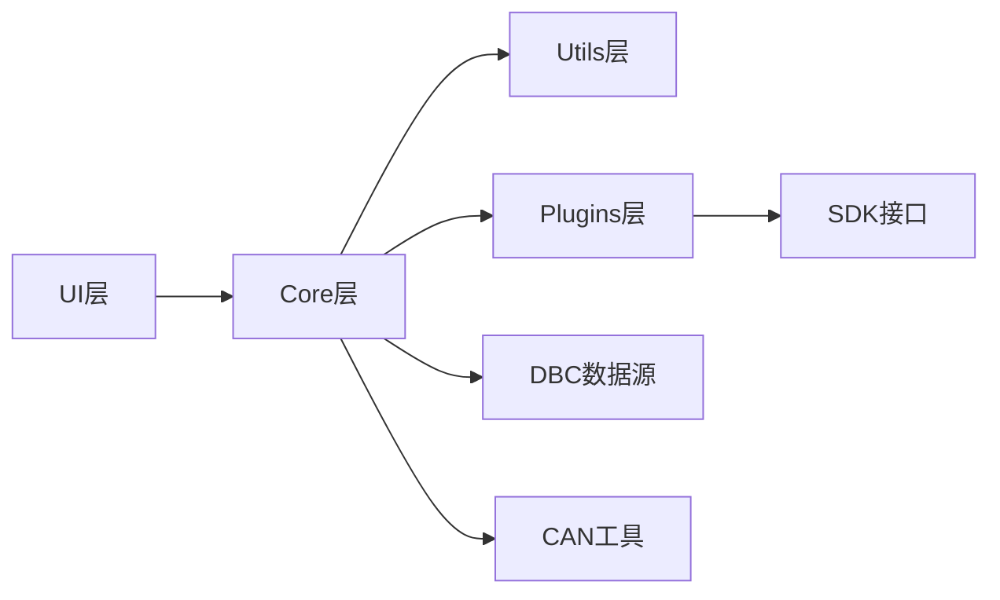

# CAN Open协议支持

<cite>
**本文引用的文件**   
- [src/main.cpp](file://src/main.cpp)
- [src/core/cansimulator.h](file://src/core/cansimulator.h)
- [src/core/cansimulator.cpp](file://src/core/cansimulator.cpp)
- [src/core/dbcmanager.h](file://src/core/dbcmanager.h)
- [src/core/dbcmanager.cpp](file://src/core/dbcmanager.cpp)
- [src/core/dbc_adapter.h](file://src/core/dbc_adapter.h)
- [src/core/dbc_adapter.cpp](file://src/core/dbc_adapter.cpp)
- [src/core/filter_engine.h](file://src/core/filter_engine.h)
- [src/core/filter_engine.cpp](file://src/core/filter_engine.cpp)
- [src/core/player.h](file://src/core/player.h)
- [src/core/player.cpp](file://src/core/player.cpp)
- [src/core/recorder.h](file://src/core/recorder.h)
- [src/core/recorder.cpp](file://src/core/recorder.cpp)
- [src/core/logging.h](file://src/core/logging.h)
- [src/core/logging.cpp](file://src/core/logging.cpp)
- [src/utils/canutils.h](file://src/utils/canutils.h)
- [src/utils/canutils.cpp](file://src/utils/canutils.cpp)
- [src/ui/mainwindow.h](file://src/ui/mainwindow.h)
- [src/ui/mainwindow.cpp](file://src/ui/mainwindow.cpp)
- [plugins/canopen-explorer/main.py](file://plugins/canopen-explorer/main.py)
- [plugins/canopen-explorer/plugin.json](file://plugins/canopen-explorer/plugin.json)
- [sdk/sin/__init__.py](file://sdk/sin/__init__.py)
- [sdk/sin/frames.py](file://sdk/sin/frames.py)
- [scripts/V5.4.0_20260605_INFO_CAN.dbc](file://scripts/V5.4.0_20260605_INFO_CAN.dbc)
</cite>

## 更新摘要
**变更内容**   
- 移除了核心应用中的专用CANopen视图（src/ui/canopenview.cpp/.h）
- 将CANopen网络探索和设备配置功能迁移到独立插件（plugins/canopen-explorer/）
- 更新了插件架构说明，反映通过插件系统提供CANopen功能的新方式
- 更新了架构图和组件关系，体现插件与核心系统的交互模式

## 目录
1. [简介](#简介)
2. [项目结构](#项目结构)
3. [核心组件](#核心组件)
4. [架构总览](#架构总览)
5. [详细组件分析](#详细组件分析)
6. [依赖关系分析](#依赖关系分析)
7. [性能考量](#性能考量)
8. [故障排查指南](#故障排查指南)
9. [结论](#结论)
10. [附录](#附录)

## 简介
本项目是一个基于Qt的CAN总线工具，提供DBC解析、信号收发、录制与回放、过滤与可视化等功能。当前仓库采用插件化架构，将CANopen协议支持从核心应用中移除并迁移到独立插件中。通过插件系统，用户可以获得完整的CANopen网络探索和设备配置能力，包括：
- 使用DBC描述CAN Open对象字典（PDO/SDO）映射
- 在模拟器与播放器中注入标准COB-ID与报文格式
- 通过插件界面提供CAN Open视图与交互
- 保持与现有CAN工具链（日志、过滤、录制/回放）的兼容

## 项目结构
项目采用分层组织：UI层负责交互与可视化；core层提供CAN仿真、DBC管理、过滤引擎、记录/回放等核心能力；plugins层包含可插拔的功能模块；utils层提供通用工具；third_party为第三方库；scripts包含构建脚本与DBC样例。

图表来源
- [src/ui/mainwindow.h](file://src/ui/mainwindow.h)
- [src/core/cansimulator.h](file://src/core/cansimulator.h)
- [src/core/dbcmanager.h](file://src/core/dbcmanager.h)
- [src/core/filter_engine.h](file://src/core/filter_engine.h)
- [src/core/player.h](file://src/core/player.h)
- [src/core/recorder.h](file://src/core/recorder.h)
- [src/utils/canutils.h](file://src/utils/canutils.h)
- [plugins/canopen-explorer/main.py](file://plugins/canopen-explorer/main.py)

章节来源
- [src/main.cpp](file://src/main.cpp)
- [src/ui/mainwindow.h](file://src/ui/mainwindow.h)
- [src/ui/mainwindow.cpp](file://src/ui/mainwindow.cpp)
- [src/core/cansimulator.h](file://src/core/cansimulator.h)
- [src/core/cansimulator.cpp](file://src/core/cansimulator.cpp)
- [src/core/dbcmanager.h](file://src/core/dbcmanager.cpp)
- [src/core/dbc_adapter.h](file://src/core/dbc_adapter.cpp)
- [src/core/filter_engine.h](file://src/core/filter_engine.cpp)
- [src/core/player.h](file://src/core/player.cpp)
- [src/core/recorder.h](file://src/core/recorder.cpp)
- [src/utils/canutils.h](file://src/utils/canutils.cpp)
- [plugins/canopen-explorer/main.py](file://plugins/canopen-explorer/main.py)
- [plugins/canopen-explorer/plugin.json](file://plugins/canopen-explorer/plugin.json)
- [scripts/V5.4.0_20260605_INFO_CAN.dbc](file://scripts/V5.4.0_20260605_INFO_CAN.dbc)

## 核心组件
- CAN模拟器：生成与发送模拟CAN帧，支撑协议行为演示与测试
- DBC管理器与适配器：加载DBC、解析节点/信号/消息，提供查询与转换接口
- 过滤引擎：按ID、信号、时间窗口等条件筛选报文流
- 播放器与录制器：从文件或实时流读取/写入CAN帧，支持回放与录制
- 日志系统：统一输出调试与运行信息
- CAN工具：封装底层CAN操作与常用处理函数
- 插件管理器：发现、激活和管理插件生命周期
- 插件系统：提供可扩展的协议支持，如CANopen、UDS等

章节来源
- [src/core/cansimulator.h](file://src/core/cansimulator.h)
- [src/core/cansimulator.cpp](file://src/core/cansimulator.cpp)
- [src/core/dbcmanager.h](file://src/core/dbcmanager.cpp)
- [src/core/dbc_adapter.h](file://src/core/dbc_adapter.cpp)
- [src/core/filter_engine.h](file://src/core/filter_engine.cpp)
- [src/core/player.h](file://src/core/player.cpp)
- [src/core/recorder.h](file://src/core/recorder.cpp)
- [src/utils/canutils.h](file://src/utils/canutils.cpp)
- [src/core/plugin/pluginmanager.h](file://src/core/plugin/pluginmanager.h)
- [plugins/canopen-explorer/main.py](file://plugins/canopen-explorer/main.py)

## 架构总览
下图展示了从UI到核心模块的数据与控制流向，强调插件化架构下的CANopen支持：
- 插件管理器协调插件的发现、激活和通信
- CANopen插件通过SDK与核心系统进行帧收发和状态同步
- 播放器/录制器与CAN工具对接底层总线或文件
- DBC适配器将DBC语义转换为可操作的信号模型

图表来源
- [src/ui/mainwindow.cpp](file://src/ui/mainwindow.cpp)
- [src/core/plugin/pluginmanager.h](file://src/core/plugin/pluginmanager.h)
- [plugins/canopen-explorer/main.py](file://plugins/canopen-explorer/main.py)
- [src/core/cansimulator.h](file://src/core/cansimulator.h)
- [src/core/dbcmanager.h](file://src/core/dbcmanager.h)
- [src/core/filter_engine.h](file://src/core/filter_engine.h)
- [src/core/player.h](file://src/core/player.h)
- [src/core/recorder.h](file://src/core/recorder.h)
- [src/utils/canutils.h](file://src/utils/canutils.h)

## 详细组件分析

### CANopen插件（CANopen Explorer）
- 职责：提供CANopen协议相关的UI面板，展示对象字典、PDO/SDO状态、设备拓扑等
- 实现方式：通过Python插件形式实现，替代原有的C++ CanOpenView
- 主要功能：
  - NMT主站命令：Start/Stop/Pre-Operational/Reset/Reset Communication
  - SDO客户端：expedited读/写（快速传输，1-4字节），Index/Subindex/节点可配
  - Heartbeat监控：节点状态表（Boot-up/Stopped/Operational/Pre-Op），超时提示
  - Emergency (0x80+ID) 解析：错误代码 + 错误寄存器
  - 事务日志

图表来源
- [plugins/canopen-explorer/main.py](file://plugins/canopen-explorer/main.py)
- [src/core/dbcmanager.h](file://src/core/dbcmanager.h)
- [src/core/filter_engine.h](file://src/core/filter_engine.h)
- [src/core/cansimulator.h](file://src/core/cansimulator.h)
- [src/core/plugin/pluginmanager.h](file://src/core/plugin/pluginmanager.h)

章节来源
- [plugins/canopen-explorer/main.py](file://plugins/canopen-explorer/main.py)
- [plugins/canopen-explorer/plugin.json](file://plugins/canopen-explorer/plugin.json)

### 插件管理系统
- 职责：发现、加载、激活和管理插件生命周期
- 集成方式：通过命令行接口与插件通信，支持动态启用/禁用
- 主要特性：
  - 自动扫描plugins目录发现插件
  - 支持插件包安装/卸载（.opk格式）
  - 提供统一的API供插件与核心系统交互
  - 管理插件间的通信和数据共享

章节来源
- [src/core/plugin/pluginmanager.h](file://src/core/plugin/pluginmanager.h)
- [src/ui/mainwindow.cpp](file://src/ui/mainwindow.cpp)

### DBC管理与适配（DBCManager & DBCAdapter）
- 职责：加载DBC文件，解析节点、消息、信号定义，提供查询与转换能力
- 与CAN Open结合：
  - 将对象字典条目映射为DBC信号，便于可视化与编辑
  - 根据COB-ID快速定位对应消息，提升解析效率

图表来源
- [src/core/dbcmanager.h](file://src/core/dbcmanager.h)
- [src/core/dbcmanager.cpp](file://src/core/dbcmanager.cpp)
- [src/core/dbc_adapter.h](file://src/core/dbc_adapter.cpp)
- [src/core/dbc_adapter.cpp](file://src/core/dbc_adapter.cpp)
- [scripts/V5.4.0_20260605_INFO_CAN.dbc](file://scripts/V5.4.0_20260605_INFO_CAN.dbc)

章节来源
- [src/core/dbcmanager.h](file://src/core/dbcmanager.h)
- [src/core/dbcmanager.cpp](file://src/core/dbcmanager.cpp)
- [src/core/dbc_adapter.h](file://src/core/dbc_adapter.cpp)
- [src/core/dbc_adapter.cpp](file://src/core/dbc_adapter.cpp)

### 过滤引擎（FilterEngine）
- 职责：按COB-ID、信号、时间范围等条件过滤帧流
- 与CAN Open结合：
  - 预设过滤模板（如仅显示特定节点的TPDO/RPDO）
  - 动态切换过滤策略以观察不同对象字典条目

图表来源
- [src/core/filter_engine.h](file://src/core/filter_engine.h)
- [src/core/filter_engine.cpp](file://src/core/filter_engine.cpp)

章节来源
- [src/core/filter_engine.h](file://src/core/filter_engine.h)
- [src/core/filter_engine.cpp](file://src/core/filter_engine.cpp)

### 播放器与录制器（Player & Recorder）
- 职责：从文件或实时流读取/写入CAN帧，支持回放与录制
- 与CAN Open结合：
  - 回放包含NMT/SDO/PDO的完整会话，用于复现设备行为
  - 录制时标注COB-ID类别，便于后续分析

图表来源
- [src/core/recorder.h](file://src/core/recorder.h)
- [src/core/recorder.cpp](file://src/core/recorder.cpp)
- [src/core/player.h](file://src/core/player.h)
- [src/core/player.cpp](file://src/core/player.cpp)
- [src/utils/canutils.h](file://src/utils/canutils.h)

章节来源
- [src/core/recorder.h](file://src/core/recorder.h)
- [src/core/recorder.cpp](file://src/core/recorder.cpp)
- [src/core/player.h](file://src/core/player.h)
- [src/core/player.cpp](file://src/core/player.cpp)

### SDK接口（sin框架）
- 职责：为插件提供与核心系统交互的统一API
- 主要功能：
  - frames.send()：发送CAN帧
  - output.append()：输出文本到控制台
  - ui.create_window()：创建插件窗口
  - context.on_frame()：注册帧接收回调
  - commands.register_command()：注册自定义命令

章节来源
- [sdk/sin/__init__.py](file://sdk/sin/__init__.py)
- [sdk/sin/frames.py](file://sdk/sin/frames.py)

### 日志系统（Logging）
- 职责：统一输出调试与运行信息
- 与CAN Open结合：
  - 记录NMT状态机变化、SDO传输错误、PDO同步异常等关键事件

章节来源
- [src/core/logging.h](file://src/core/logging.h)
- [src/core/logging.cpp](file://src/core/logging.cpp)

## 依赖关系分析
- UI层依赖core层提供的仿真、解析与过滤能力
- core层依赖utils层的工具函数
- 插件层通过SDK与core层交互，实现松耦合
- DBC文件作为外部数据源，被DBC管理器加载
- 播放器/录制器与CAN工具协作完成I/O

图表来源
- [src/ui/mainwindow.h](file://src/ui/mainwindow.h)
- [src/core/cansimulator.h](file://src/core/cansimulator.h)
- [src/core/dbcmanager.h](file://src/core/dbcmanager.h)
- [sdk/sin/__init__.py](file://sdk/sin/__init__.py)
- [src/utils/canutils.h](file://src/utils/canutils.h)

章节来源
- [src/ui/mainwindow.h](file://src/ui/mainwindow.h)
- [src/core/cansimulator.h](file://src/core/cansimulator.h)
- [src/core/dbcmanager.h](file://src/core/dbcmanager.h)
- [sdk/sin/__init__.py](file://sdk/sin/__init__.py)
- [src/utils/canutils.h](file://src/utils/canutils.h)

## 性能考量
- 过滤引擎应在高频帧场景下优先执行，减少下游处理压力
- DBC索引应缓存COB-ID与信号映射，避免重复解析
- 播放器回放需按时间戳平滑调度，避免突发导致丢帧
- 日志输出应异步化，避免阻塞主循环
- 插件通信应采用批量处理和事件驱动模式，减少序列化开销

## 故障排查指南
- DBC加载失败：检查文件路径与编码，确认节点/消息/信号完整性
- COB-ID冲突：确保同一总线内唯一，必要时重映射
- 过滤无结果：核对过滤规则与目标COB-ID/信号名
- 回放卡顿：检查时间戳连续性与发送速率设置
- 日志缺失：确认日志级别与输出目标配置
- 插件加载失败：检查Python环境依赖，确认插件包完整性
- CANopen功能不可用：确认插件已正确安装和激活

章节来源
- [src/core/dbcmanager.h](file://src/core/dbcmanager.h)
- [src/core/filter_engine.h](file://src/core/filter_engine.h)
- [src/core/player.h](file://src/core/player.h)
- [src/core/logging.h](file://src/core/logging.h)
- [plugins/canopen-explorer/plugin.json](file://plugins/canopen-explorer/plugin.json)

## 结论
当前仓库采用插件化架构，将CANopen协议支持从核心应用中移除并迁移到独立插件中。通过插件系统，用户可以获得完整的CANopen网络探索和设备配置能力，同时保持了核心应用的简洁性和可扩展性。建议在需要CANopen功能时，通过插件管理器启用canopen-explorer插件，利用其提供的NMT控制、SDO读写、Heartbeat监控和Emergency解析等功能。

## 附录
- 示例DBC文件位于scripts目录，可用于验证对象字典映射与信号解析流程
- CANopen插件位于plugins/canopen-explorer/目录，可通过插件管理器启用
- 插件SDK文档位于sdk/sin/目录，提供插件开发所需的API参考