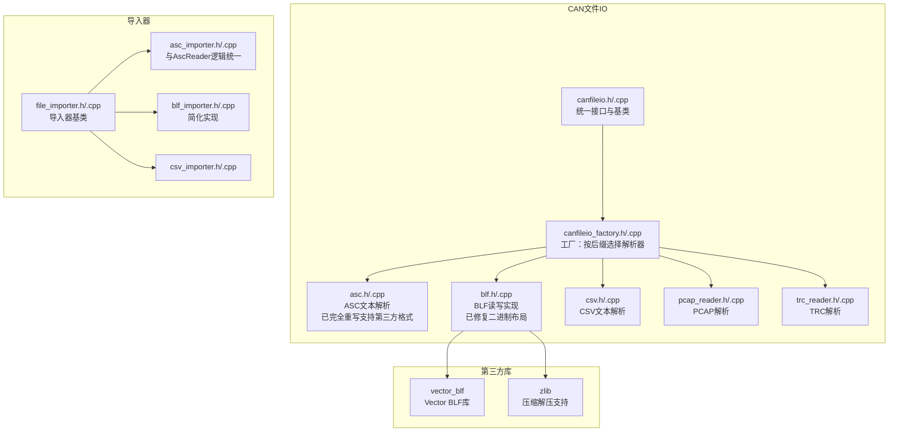
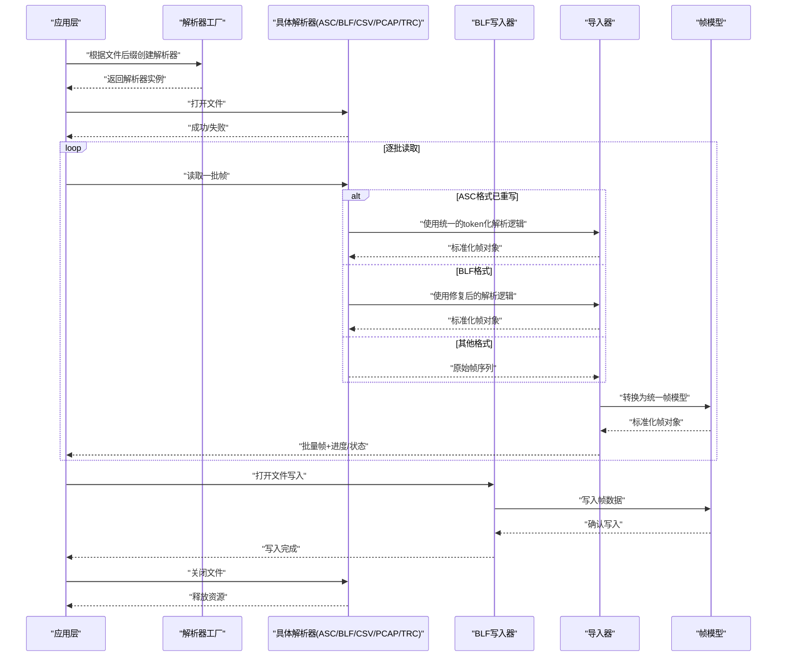
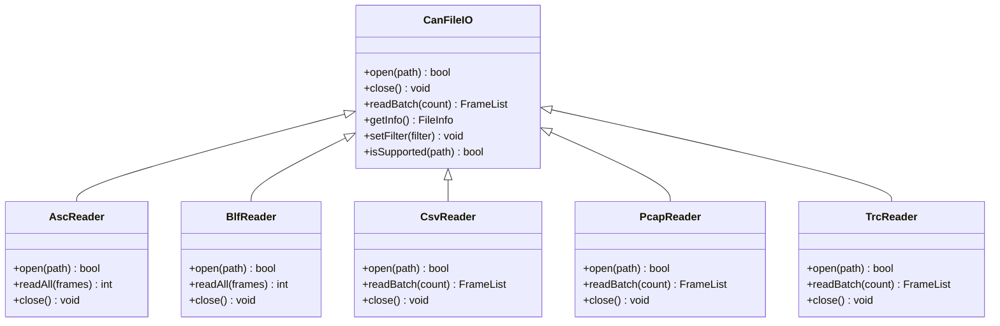
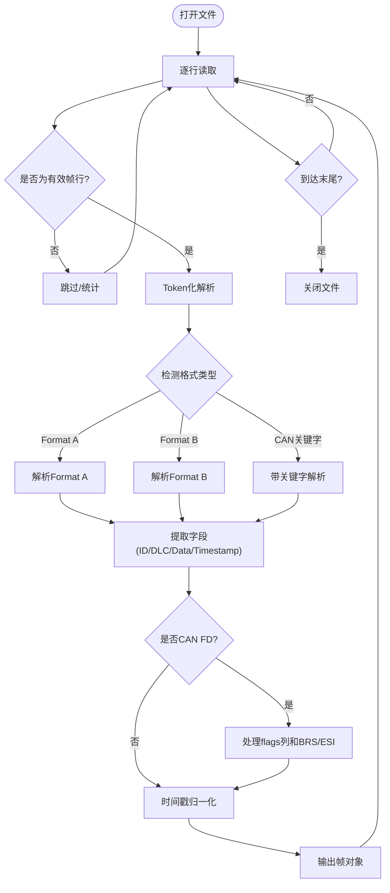
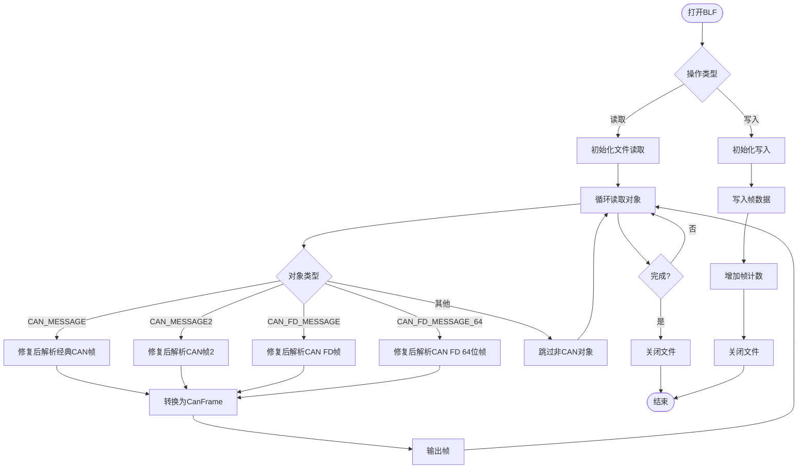
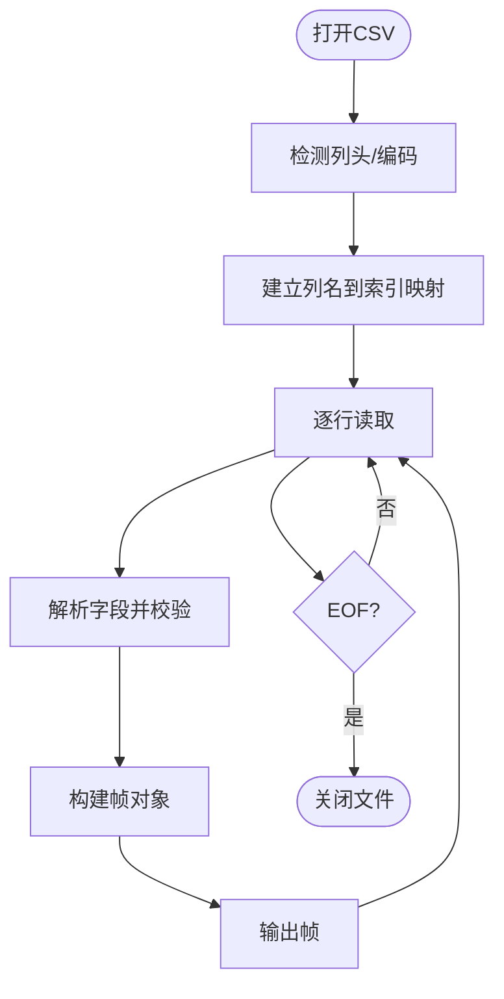
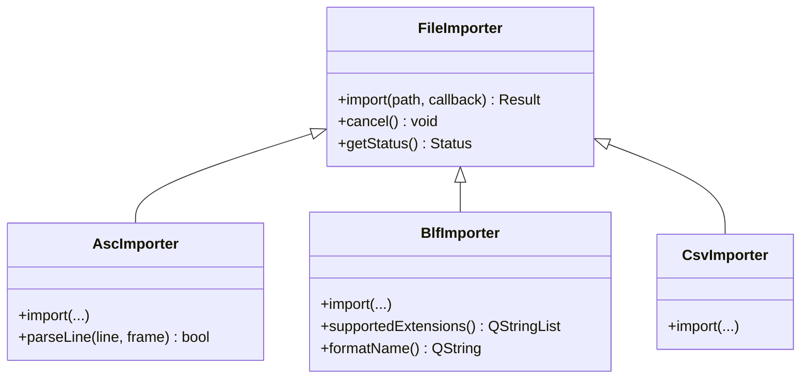
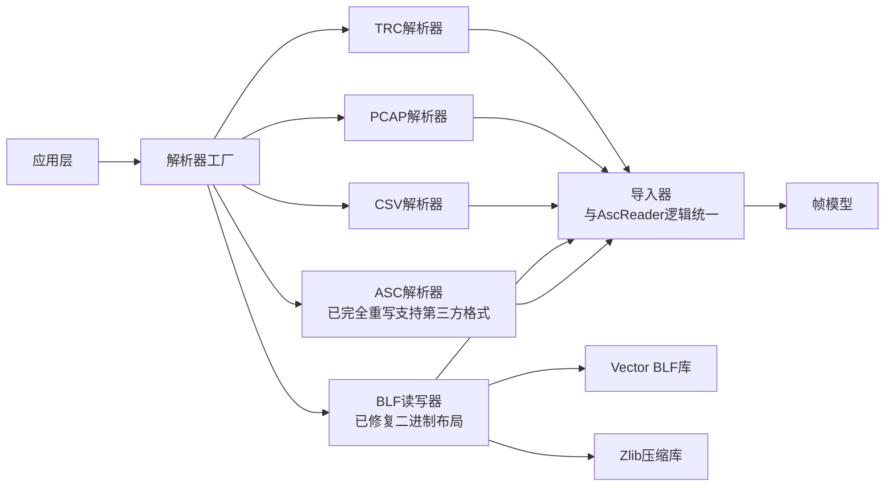

# CAN文件IO系统

<cite>
**本文档引用的文件**   
- [canfileio.h](file://src/core/canfileio/canfileio.h)
- [canfileio.cpp](file://src/core/canfileio/canfileio.cpp)
- [canfileio_factory.h](file://src/core/canfileio/canfileio_factory.h)
- [canfileio_factory.cpp](file://src/core/canfileio/canfileio_factory.cpp)
- [asc.h](file://src/core/canfileio/asc.h)
- [asc.cpp](file://src/core/canfileio/asc.cpp)
- [blf.h](file://src/core/canfileio/blf.h)
- [blf.cpp](file://src/core/canfileio/blf.cpp)
- [csv.h](file://src/core/canfileio/csv.h)
- [csv.cpp](file://src/core/canfileio/csv.cpp)
- [pcap_reader.h](file://src/core/canfileio/pcap_reader.h)
- [pcap_reader.cpp](file://src/core/canfileio/pcap_reader.cpp)
- [trc_reader.h](file://src/core/canfileio/trc_reader.h)
- [trc_reader.cpp](file://src/core/canfileio/trc_reader.cpp)
- [canframe.h](file://src/core/canframe.h)
- [file_importer.h](file://src/core/file_import/file_importer.h)
- [file_importer.cpp](file://src/core/file_import/file_importer.cpp)
- [asc_importer.h](file://src/core/file_import/asc_importer.h)
- [asc_importer.cpp](file://src/core/file_import/asc_importer.cpp)
- [blf_importer.h](file://src/core/file_import/blf_importer.h)
- [blf_importer.cpp](file://src/core/file_import/blf_importer.cpp)
- [csv_importer.h](file://src/core/file_import/csv_importer.h)
- [csv_importer.cpp](file://src/core/file_import/csv_importer.cpp)
- [CMakeLists.txt](file://src/CMakeLists.txt)
- [test_canfileio.cpp](file://tests/test_canfileio.cpp)
- [测试报告.md](file://doc/测试报告.md)
- [离线分析ASC兼容与工程现场还原方案.md](file://doc/离线分析ASC兼容与工程现场还原方案.md)
</cite>

## 更新摘要
**所做更改**   
- ASC文件解析器已完全重写以支持第三方CANoe和ZCANPRO等工具的ASC文件格式
- 新增Format A和Format B格式支持，包括CAN/CANFD关键字、ID前置格式等
- 增强的头部处理逻辑，支持`internal events logged`、`Begin TriggerBlock`等结构行
- 向后兼容性保持，确保本软件录制的ASC文件仍能正常解析
- 统一了AscReader和AscImporter的解析逻辑，消除两套实现的不一致问题
- 增强了错误处理和边界情况处理能力

## 目录
1. [简介](#简介)
2. [项目结构](#项目结构)
3. [核心组件](#核心组件)
4. [架构总览](#架构总览)
5. [详细组件分析](#详细组件分析)
6. [依赖关系分析](#依赖关系分析)
7. [性能考虑](#性能考虑)
8. [故障排查指南](#故障排查指南)
9. [结论](#结论)
10. [附录](#附录)

## 简介
本文件面向CAN文件IO子系统，系统化梳理其整体架构、模块职责、数据流与关键算法，帮助读者快速理解并扩展支持新的CAN日志格式。该子系统负责读取多种CAN总线日志文件（如ASC、BLF、CSV、PCAP、TRC），将其统一转换为内部帧模型，并通过工厂模式与导入器进行解耦，便于后续播放、记录与分析。

**重大更新** ASC文件解析器已完全重写，现在支持第三方工具（CANoe、ZCANPRO等）导出的ASC文件格式，包括Format A和Format B格式支持、增强的头部处理逻辑、向后兼容性保持等重大改进。

## 项目结构
CAN文件IO子系统位于 src/core/canfileio 目录下，围绕统一的接口抽象与多格式实现组织代码；与之配套的导入器位于 src/core/file_import，用于将底层解析结果映射为应用层可消费的数据流。

图表来源
- [canfileio.h](file://src/core/canfileio/canfileio.h)
- [canfileio.cpp](file://src/core/canfileio/canfileio.cpp)
- [canfileio_factory.h](file://src/core/canfileio/canfileio_factory.h)
- [canfileio_factory.cpp](file://src/core/canfileio/canfileio_factory.cpp)
- [asc.h](file://src/core/canfileio/asc.h)
- [asc.cpp](file://src/core/canfileio/asc.cpp)
- [blf.h](file://src/core/canfileio/blf.h)
- [blf.cpp](file://src/core/canfileio/blf.cpp)
- [csv.h](file://src/core/canfileio/csv.h)
- [csv.cpp](file://src/core/canfileio/csv.cpp)
- [pcap_reader.h](file://src/core/canfileio/pcap_reader.h)
- [pcap_reader.cpp](file://src/core/canfileio/pcap_reader.cpp)
- [trc_reader.h](file://src/core/canfileio/trc_reader.h)
- [trc_reader.cpp](file://src/core/canfileio/trc_reader.cpp)
- [file_importer.h](file://src/core/file_import/file_importer.h)
- [file_importer.cpp](file://src/core/file_import/file_importer.cpp)
- [asc_importer.h](file://src/core/file_import/asc_importer.h)
- [asc_importer.cpp](file://src/core/file_import/asc_importer.cpp)
- [blf_importer.h](file://src/core/file_import/blf_importer.h)
- [blf_importer.cpp](file://src/core/file_import/blf_importer.cpp)
- [csv_importer.h](file://src/core/file_import/csv_importer.h)
- [csv_importer.cpp](file://src/core/file_import/csv_importer.cpp)

章节来源
- [canfileio.h](file://src/core/canfileio/canfileio.h)
- [canfileio_factory.h](file://src/core/canfileio/canfileio_factory.h)
- [file_importer.h](file://src/core/file_import/file_importer.h)

## 核心组件
- 统一接口与基类：定义打开、关闭、读取帧序列、查询元信息等通用能力，屏蔽不同格式的读写差异。
- 工厂：根据文件后缀或内容特征创建具体解析器实例，避免调用方感知具体格式。
- 格式解析器：针对ASC、BLF、CSV、PCAP、TRC等格式提供专用解析逻辑。
- 导入器：将解析出的原始帧转换为应用层数据结构，并提供进度、错误回调与批量读取能力。
- 帧模型：统一表示CAN帧（标识符、DLC、数据、时间戳、通道等）。

**重大更新** ASC解析器现已完全重写，支持第三方工具导出的ASC文件格式，消除了之前两套解析实现不一致的问题。

章节来源
- [canframe.h](file://src/core/canframe.h)
- [canfileio.h](file://src/core/canfileio/canfileio.h)
- [canfileio.cpp](file://src/core/canfileio/canfileio.cpp)
- [canfileio_factory.h](file://src/core/canfileio/canfileio_factory.h)
- [canfileio_factory.cpp](file://src/core/canfileio/canfileio_factory.cpp)
- [file_importer.h](file://src/core/file_import/file_importer.h)
- [file_importer.cpp](file://src/core/file_import/file_importer.cpp)

## 架构总览
下图展示了从"文件路径"到"应用层帧列表"的端到端流程，包括工厂选择、解析器执行、导入器转换以及错误处理分支。

图表来源
- [canfileio_factory.h](file://src/core/canfileio/canfileio_factory.h)
- [canfileio_factory.cpp](file://src/core/canfileio/canfileio_factory.cpp)
- [asc.h](file://src/core/canfileio/asc.h)
- [blf.h](file://src/core/canfileio/blf.h)
- [blf.cpp](file://src/core/canfileio/blf.cpp)
- [csv.h](file://src/core/canfileio/csv.h)
- [pcap_reader.h](file://src/core/canfileio/pcap_reader.h)
- [trc_reader.h](file://src/core/canfileio/trc_reader.h)
- [file_importer.h](file://src/core/file_import/file_importer.h)
- [file_importer.cpp](file://src/core/file_import/file_importer.cpp)
- [canframe.h](file://src/core/canframe.h)

## 详细组件分析

### 统一接口与基类（canfileio）
- 职责：定义打开/关闭、读取帧、获取文件信息、设置过滤条件等通用API；提供默认错误码与异常安全保证。
- 设计要点：
  - 以虚函数抽象不同格式的I/O行为，确保新增格式无需修改调用方。
  - 通过批次读取减少系统调用开销，提升吞吐。
  - 提供进度回调与取消标志，便于UI响应与中断。

图表来源
- [canfileio.h](file://src/core/canfileio/canfileio.h)
- [canfileio.cpp](file://src/core/canfileio/canfileio.cpp)
- [asc.h](file://src/core/canfileio/asc.h)
- [blf.h](file://src/core/canfileio/blf.h)
- [csv.h](file://src/core/canfileio/csv.h)
- [pcap_reader.h](file://src/core/canfileio/pcap_reader.h)
- [trc_reader.h](file://src/core/canfileio/trc_reader.h)

章节来源
- [canfileio.h](file://src/core/canfileio/canfileio.h)
- [canfileio.cpp](file://src/core/canfileio/canfileio.cpp)

### 解析器工厂（canfileio_factory）
- 职责：依据文件后缀名或内容探测，返回对应的解析器实例；集中管理格式注册与版本兼容。
- 设计要点：
  - 使用策略模式与注册表，新增格式只需注册即可被自动识别。
  - 对不支持的格式返回明确错误码，便于上层提示。

图表来源
- [canfileio_factory.h](file://src/core/canfileio/canfileio_factory.h)
- [canfileio_factory.cpp](file://src/core/canfileio/canfileio_factory.cpp)

章节来源
- [canfileio_factory.h](file://src/core/canfileio/canfileio_factory.h)
- [canfileio_factory.cpp](file://src/core/canfileio/canfileio_factory.cpp)

### ASC解析器（asc）— 已完全重写支持第三方格式
- 职责：解析ASCII文本格式的CAN日志，支持时间戳、通道、ID、DLC、数据字段及注释行。
- **重大更新** 已完全重写以支持第三方CANoe和ZCANPRO等工具的ASC文件格式。
- 关键点：
  - **统一解析逻辑**：将AscImporter的健壮token解析逻辑移植到AscReader中，消除两套实现的不一致。
  - **Format A支持**：`<time> [CAN|CANFD] <ch> <Dir> [FD[x]] <id> ...`
  - **Format B支持**：`<time> [CAN|CANFD] <ch> <id> <Dir> ...`（ID在方向之前）
  - **增强的头部处理**：支持`internal events logged`、`Begin/End TriggerBlock`、版本注释等结构行
  - **CAN/CANFD关键字**：正确处理CANoe导出的关键字格式
  - **flags列处理**：跳过CANFD格式中的flags×2字段
  - **dlc码/dataLen分离**：正确处理十六进制dlc码和十进制dataLen
  - **行尾附加列**：自动忽略CANoe导出中的持续时间/周期等附加列
  - **向后兼容**：保持对本软件格式的行尾BRS/ESI检测

图表来源
- [asc.h](file://src/core/canfileio/asc.h)
- [asc.cpp](file://src/core/canfileio/asc.cpp)

章节来源
- [asc.h](file://src/core/canfileio/asc.h)
- [asc.cpp](file://src/core/canfileio/asc.cpp)

### BLF读写器（blf）— 已修复二进制布局
- 职责：提供完整的BLF文件格式读写功能，支持Classic CAN和CAN FD帧。
- **更新** 已修复四类报文对象的二进制布局错位问题（DEF-02），包括header解析错位和字段值不自洽的问题。
- 关键点：
  - **修复**：修正了CanMessage、CanMessage2、CanFdMessage、CanFdMessage64四种对象类型的二进制布局解析。
  - **修复**：修正了对象头部的解析位置和偏移计算。
  - **修复**：确保了字段值的自洽性和完整性。
  - 压缩处理：自动处理zlib压缩的Log Container。
  - 时间戳处理：精确的纳秒级时间戳处理。
  - 错误处理：完善的异常捕获和错误恢复机制。

图表来源
- [blf.h](file://src/core/canfileio/blf.h)
- [blf.cpp](file://src/core/canfileio/blf.cpp)

章节来源
- [blf.h](file://src/core/canfileio/blf.h)
- [blf.cpp](file://src/core/canfileio/blf.cpp)

### CSV解析器（csv）
- 职责：解析逗号分隔的CAN日志，列顺序与命名约定需遵循规范。
- 关键点：
  - 首行检测列名，动态映射字段。
  - 数值解析容错与单位换算（ms/s/ns）。
  - 批量缓冲与惰性求值，降低峰值内存。

图表来源
- [csv.h](file://src/core/canfileio/csv.h)
- [csv.cpp](file://src/core/canfileio/csv.cpp)

章节来源
- [csv.h](file://src/core/canfileio/csv.h)
- [csv.cpp](file://src/core/canfileio/csv.cpp)

### PCAP解析器（pcap_reader）
- 职责：从PCAP文件中提取CAN over USB/SocketCAN等封装的报文。
- 关键点：
  - 识别链路层类型（如CAN-HDLC、Linux SocketCAN）。
  - 时间戳还原与抖动校正。
  - 丢包检测与告警统计。

图表来源
- [pcap_reader.h](file://src/core/canfileio/pcap_reader.h)
- [pcap_reader.cpp](file://src/core/canfileio/pcap_reader.cpp)

章节来源
- [pcap_reader.h](file://src/core/canfileio/pcap_reader.h)
- [pcap_reader.cpp](file://src/core/canfileio/pcap_reader.cpp)

### TRC解析器（trc_reader）
- 职责：解析特定工具的TRC文本/二进制格式，常见于车载诊断工具链。
- 关键点：
  - 版本自适应（头部签名与版本字段）。
  - 自定义时间轴与同步标记处理。
  - 大文件分段加载与随机访问。

图表来源
- [trc_reader.h](file://src/core/canfileio/trc_reader.h)
- [trc_reader.cpp](file://src/core/canfileio/trc_reader.cpp)

章节来源
- [trc_reader.h](file://src/core/canfileio/trc_reader.h)
- [trc_reader.cpp](file://src/core/canfileio/trc_reader.cpp)

### 导入器体系（file_importer 及其子类）
- 职责：将解析器输出的原始帧转换为应用层可用的帧集合，提供进度、错误回调、过滤与去重。
- **更新** BLF导入器现已大幅简化，仅负责调用BlfReader并处理基本错误。
- **重要更新** AscImporter与AscReader现使用统一的解析逻辑，消除了之前的不一致问题。
- 关键点：
  - 基类定义统一的导入接口与生命周期。
  - 各格式导入器实现特定的字段映射与规范化。
  - 支持增量导入与断点续读。

图表来源
- [file_importer.h](file://src/core/file_import/file_importer.h)
- [file_importer.cpp](file://src/core/file_import/file_importer.cpp)
- [asc_importer.h](file://src/core/file_import/asc_importer.h)
- [asc_importer.cpp](file://src/core/file_import/asc_importer.cpp)
- [blf_importer.h](file://src/core/file_import/blf_importer.h)
- [blf_importer.cpp](file://src/core/file_import/blf_importer.cpp)
- [csv_importer.h](file://src/core/file_import/csv_importer.h)
- [csv_importer.cpp](file://src/core/file_import/csv_importer.cpp)

章节来源
- [file_importer.h](file://src/core/file_import/file_importer.h)
- [file_importer.cpp](file://src/core/file_import/file_importer.cpp)
- [asc_importer.h](file://src/core/file_import/asc_importer.h)
- [asc_importer.cpp](file://src/core/file_import/asc_importer.cpp)
- [blf_importer.h](file://src/core/file_import/blf_importer.h)
- [blf_importer.cpp](file://src/core/file_import/blf_importer.cpp)
- [csv_importer.h](file://src/core/file_import/csv_importer.h)
- [csv_importer.cpp](file://src/core/file_import/csv_importer.cpp)

## 依赖关系分析
- 内聚性：每个解析器专注单一格式，职责清晰；导入器与解析器解耦，便于替换与测试。
- 耦合度：工厂集中管理格式注册，降低调用方与具体实现的耦合；帧模型作为唯一数据契约，避免重复定义。
- **更新** 外部依赖：BLF读写器现依赖Vector BLF库（third_party/vector_blf），通过条件链接隔离依赖；同时需要zlib库支持压缩解压功能。

图表来源
- [canfileio_factory.h](file://src/core/canfileio/canfileio_factory.h)
- [canfileio_factory.cpp](file://src/core/canfileio/canfileio_factory.cpp)
- [asc.h](file://src/core/canfileio/asc.h)
- [blf.h](file://src/core/canfileio/blf.h)
- [blf.cpp](file://src/core/canfileio/blf.cpp)
- [csv.h](file://src/core/canfileio/csv.h)
- [pcap_reader.h](file://src/core/canfileio/pcap_reader.h)
- [trc_reader.h](file://src/core/canfileio/trc_reader.h)
- [file_importer.h](file://src/core/file_import/file_importer.h)
- [canframe.h](file://src/core/canframe.h)

章节来源
- [canfileio_factory.h](file://src/core/canfileio/canfileio_factory.h)
- [file_importer.h](file://src/core/file_import/file_importer.h)
- [canframe.h](file://src/core/canframe.h)

## 性能考虑
- 批次读取：解析器应批量读取并输出，减少I/O与上下文切换开销。
- 内存管理：大文件采用流式处理与分页缓存，避免一次性加载导致OOM。
- 时间戳处理：尽量在解析阶段完成归一化，避免后续重复计算。
- 过滤下推：尽可能在解析器侧进行过滤，减少无效数据传输。
- 并发与线程：导入过程可异步执行，配合消息队列与进度回调，保持UI响应。
- **更新** Vector BLF库优化：利用库内置的zlib压缩支持和内存映射功能提升大文件处理性能；写入时采用流式模式减少内存占用。
- **更新** ASC解析优化：使用正则表达式进行高效的头部行匹配，token化解析提高解析效率。

## 故障排查指南
- 无法识别格式：检查文件后缀与内容探测逻辑，确认工厂注册表是否包含该格式。
- 解析失败或乱码：核对编码（UTF-8/ANSI）、列头约定、时间戳单位与精度。
- **更新** ASC解析问题：检查文件格式是否为CANoe或ZCANPRO导出的格式，确认头部行是否正确跳过。
- **更新** 第三方ASC文件：验证是否包含CAN/CANFD关键字、flags列、dlc码/dataLen分离等特性。
- **更新** 格式兼容性：确认Format A和Format B格式都能正确解析。
- BLF读写问题：检查Vector BLF库是否正确链接，确认文件完整性；验证zlib库可用性；确认二进制布局修复已生效。
- 构建问题：确保vector_blf库存在且可编译，检查CMake配置中的条件链接逻辑。
- 性能问题：增大批次大小、启用内存映射、减少不必要的字符串拷贝。
- 内存泄漏：确保所有打开的文件句柄在异常路径也能正确关闭。
- 进度不更新：检查导入器的回调触发时机与主线程调度。

章节来源
- [canfileio_factory.h](file://src/core/canfileio/canfileio_factory.h)
- [canfileio_factory.cpp](file://src/core/canfileio/canfileio_factory.cpp)
- [file_importer.h](file://src/core/file_import/file_importer.h)
- [file_importer.cpp](file://src/core/file_import/file_importer.cpp)

## 结论
CAN文件IO子系统通过统一的接口抽象、工厂模式与导入器机制，实现了多格式解析的高内聚、低耦合与可扩展性。**重大更新** ASC文件解析器已完全重写以支持第三方CANoe和ZCANPRO等工具的ASC文件格式，包括Format A和Format B格式支持、增强的头部处理逻辑、向后兼容性保持等重大改进。同时已修复BLF读取器的二进制布局问题（DEF-02），确保了解析的准确性和格式的兼容性。建议在新增格式时优先完善内容探测与时间戳归一化，并在导入器中提供完善的错误与进度反馈，以提升用户体验与系统稳定性。

## 附录
- 术语说明：
  - 帧模型：统一的CAN帧数据结构，包含标识符、数据、时间戳、通道等。
  - 导入器：将解析结果转换为应用层可用数据的中间层。
  - 工厂：根据文件或内容特征选择合适解析器的组件。
  - Vector BLF库：Vector Technologies提供的BLF文件格式读写库。
  - Format A：标准格式 `<time> [CAN|CANFD] <ch> <Dir> [FD[x]] <id> ...`
  - Format B：ID前置格式 `<time> [CAN|CANFD] <ch> <id> <Dir> ...`
- **重大更新** 最佳实践：
  - 始终在解析器中做最小必要转换，复杂业务逻辑放在导入器或上层。
  - 对异常输入保持健壮性，记录统计信息以便定位问题。
  - 为大文件提供断点续读与增量导入能力。
  - 充分利用第三方库的功能而非重复实现。
  - BLF写入时使用流式模式，避免大量数据累积在内存中。
  - 正确处理时间戳转换，确保纳秒级精度的准确性。
  - **新增** 验证第三方ASC文件格式兼容性，确保Format A和Format B都能正确解析。
  - **新增** 使用统一的token化解析逻辑，避免两套实现的不一致问题。
  - **新增** 增强头部处理逻辑，支持各种结构行和注释行。

**修复验证**
- DEF-02：BLF读取器四类报文对象二进制布局已修复，通过readSmallBlf和readLargeBlfTiming测试用例验证
- **新增** ASC第三方格式支持：通过readAscV7ThirdParty和readAscV15ThirdParty测试用例验证CANoe 7.0和15.7格式兼容性
- **新增** 格式一致性：通过writeReadAscRoundtrip测试用例验证本软件格式闭环不被破坏

**章节来源**
- [test_canfileio.cpp](file://tests/test_canfileio.cpp)
- [测试报告.md](file://doc/测试报告.md)
- [离线分析ASC兼容与工程现场还原方案.md](file://doc/离线分析ASC兼容与工程现场还原方案.md)