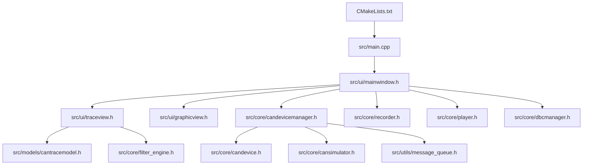
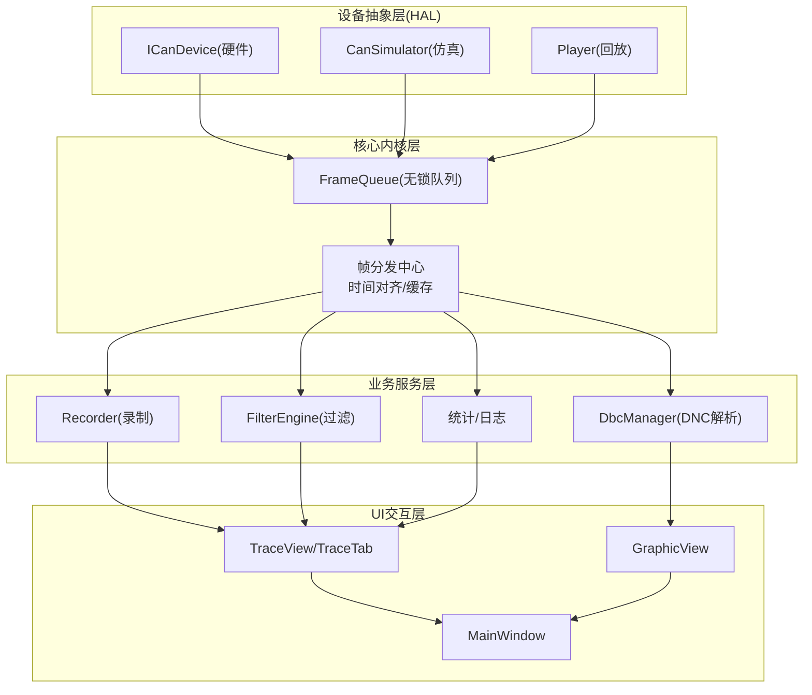
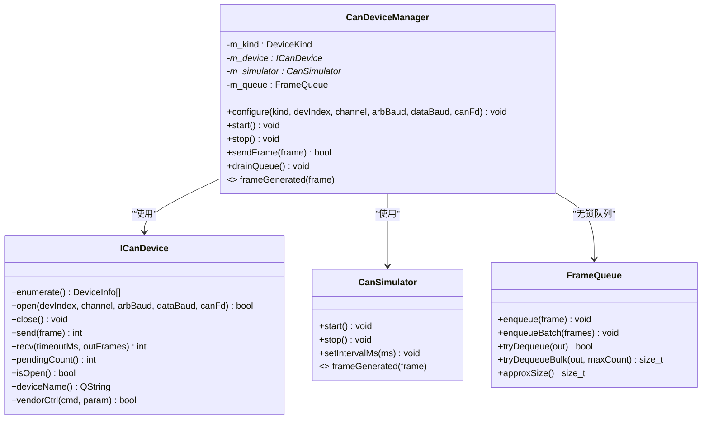
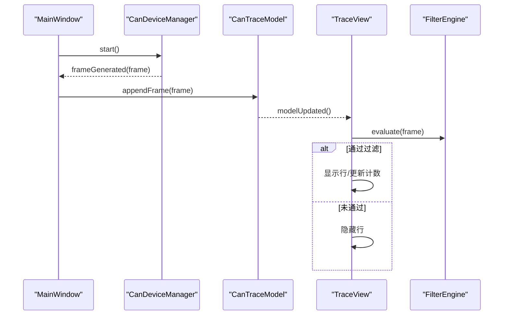
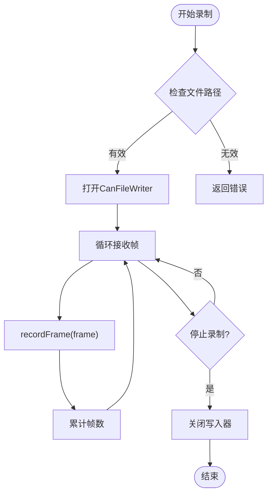
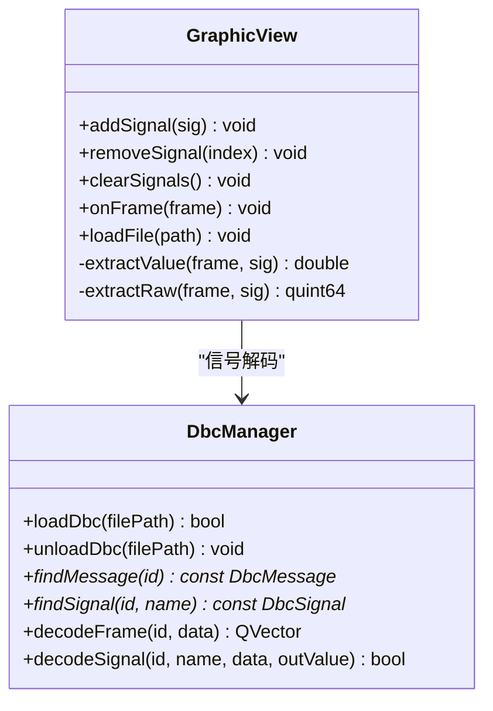
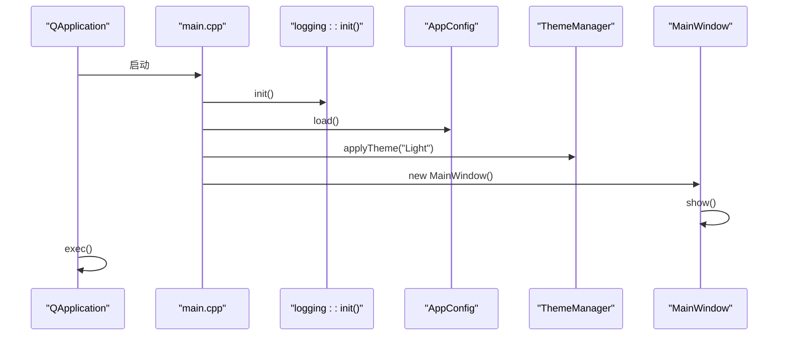
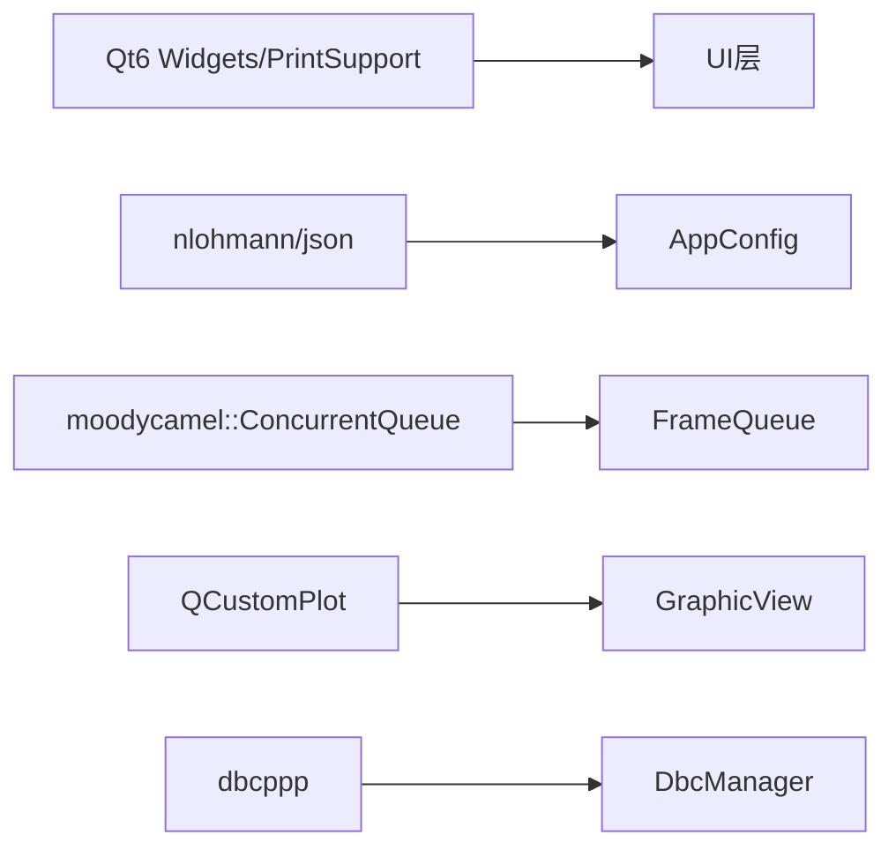

# CAN设备管理系统

<cite>
**本文引用的文件**
- [README.md](file://README.md)
- [CMakeLists.txt](file://CMakeLists.txt)
- [src/main.cpp](file://src/main.cpp)
- [src/core/canframe.h](file://src/core/canframe.h)
- [src/core/candevice.h](file://src/core/candevice.h)
- [src/core/candevicemanager.h](file://src/core/candevicemanager.h)
- [src/core/cansimulator.h](file://src/core/cansimulator.h)
- [src/models/cantracemodel.h](file://src/models/cantracemodel.h)
- [src/ui/traceview.h](file://src/ui/traceview.h)
- [src/core/filter_engine.h](file://src/core/filter_engine.h)
- [src/core/recorder.h](file://src/core/recorder.h)
- [src/core/player.h](file://src/core/player.h)
- [src/ui/graphicview.h](file://src/ui/graphicview.h)
- [src/core/dbcmanager.h](file://src/core/dbcmanager.h)
- [src/utils/message_queue.h](file://src/utils/message_queue.h)
- [src/core/appconfig.h](file://src/core/appconfig.h)
</cite>

## 目录
1. [简介](#简介)
2. [项目结构](#项目结构)
3. [核心组件](#核心组件)
4. [架构总览](#架构总览)
5. [详细组件分析](#详细组件分析)
6. [依赖关系分析](#依赖关系分析)
7. [性能考量](#性能考量)
8. [故障排查指南](#故障排查指南)
9. [结论](#结论)
10. [附录](#附录)

## 简介
本系统是一款面向汽车电子与总线调试的CAN/CAN FD报文分析工具，提供实时录制、文件回放、DBC信号解析、Trace列表展示、Graphic波形视图等能力。整体采用Qt6 + C++17构建，UI风格参考VS Code，支持无边框窗口、可停靠面板与多标签编辑区。系统通过统一的设备抽象层隔离硬件差异，结合无锁消息队列与发布订阅机制，实现高吞吐、低延迟的数据流处理。

## 项目结构
- 顶层CMake工程负责Qt6查找、子模块集成与安装规则
- src为核心代码：core（数据模型与引擎）、models（表格模型）、ui（界面）、utils（工具）
- resources存放样式与资源，scripts为构建脚本
- third_party包含第三方库源码或头文件

**图表来源**
- [CMakeLists.txt:1-63](file://CMakeLists.txt#L1-L63)
- [src/main.cpp:1-35](file://src/main.cpp#L1-L35)
- [src/ui/mainwindow.h:1-226](file://src/ui/mainwindow.h#L1-L226)
- [src/ui/traceview.h:1-189](file://src/ui/traceview.h#L1-L189)
- [src/ui/graphicview.h:1-160](file://src/ui/graphicview.h#L1-L160)
- [src/core/candevicemanager.h:1-120](file://src/core/candevicemanager.h#L1-L120)
- [src/core/candevice.h:1-80](file://src/core/candevice.h#L1-L80)
- [src/core/cansimulator.h:1-69](file://src/core/cansimulator.h#L1-L69)
- [src/models/cantracemodel.h:1-120](file://src/models/cantracemodel.h#L1-L120)
- [src/core/filter_engine.h:1-59](file://src/core/filter_engine.h#L1-L59)
- [src/core/recorder.h:1-48](file://src/core/recorder.h#L1-L48)
- [src/core/player.h:1-74](file://src/core/player.h#L1-L74)
- [src/core/dbcmanager.h:1-73](file://src/core/dbcmanager.h#L1-L73)
- [src/utils/message_queue.h:1-87](file://src/utils/message_queue.h#L1-L87)

**章节来源**
- [CMakeLists.txt:1-63](file://CMakeLists.txt#L1-L63)
- [README.md:235-278](file://README.md#L235-L278)

## 核心组件
- CanFrame：统一帧数据结构，涵盖时间戳、ID、扩展/FD标志、DLC、数据、通道、方向等，并提供序列化接口
- ICanDevice：设备抽象接口，定义枚举、打开/关闭、发送/接收、厂商扩展等
- CanDeviceManager：QObject桥接层，统一管理模拟器与真实设备，对外暴露统一信号
- CanSimulator：后台线程生成模拟流量，通过无锁队列批量投递到主线程
- CanTraceModel：QAbstractTableModel实现，支持追加、覆盖模式、行标记与着色
- TraceView/TraceTab：Wireshark风格Trace列表、过滤栏、帧信息与信号解码面板
- FilterEngine：自写递归下降表达式过滤器，支持变量、逻辑与比较运算符
- Recorder/Player：录制器与播放器，分别负责写入与按时间戳回放
- GraphicView：基于QCustomPlot的信号波形视图，支持多轴、卡尺测量
- DbcManager：DBC加载与索引，提供O(1)报文查找与信号解码
- FrameQueue：基于moodycamel::ConcurrentQueue的无锁队列封装
- AppConfig：基于nlohmann/json的配置管理

**章节来源**
- [src/core/canframe.h:1-117](file://src/core/canframe.h#L1-L117)
- [src/core/candevice.h:1-80](file://src/core/candevice.h#L1-L80)
- [src/core/candevicemanager.h:1-120](file://src/core/candevicemanager.h#L1-L120)
- [src/core/cansimulator.h:1-69](file://src/core/cansimulator.h#L1-L69)
- [src/models/cantracemodel.h:1-120](file://src/models/cantracemodel.h#L1-L120)
- [src/ui/traceview.h:1-189](file://src/ui/traceview.h#L1-L189)
- [src/core/filter_engine.h:1-59](file://src/core/filter_engine.h#L1-L59)
- [src/core/recorder.h:1-48](file://src/core/recorder.h#L1-L48)
- [src/core/player.h:1-74](file://src/core/player.h#L1-L74)
- [src/ui/graphicview.h:1-160](file://src/ui/graphicview.h#L1-L160)
- [src/core/dbcmanager.h:1-73](file://src/core/dbcmanager.h#L1-L73)
- [src/utils/message_queue.h:1-87](file://src/utils/message_queue.h#L1-L87)
- [src/core/appconfig.h:1-73](file://src/core/appconfig.h#L1-L73)

## 架构总览
系统采用“中心化发布订阅”思想：设备抽象层（HAL）将在线采集、离线回放、仿真源统一为标准帧流；核心内核层进行时间对齐与分发；业务服务层订阅数据并执行日志、统计、解析等任务；UI交互层仅消费数据，不直接访问底层。

**图表来源**
- [src/core/candevicemanager.h:1-120](file://src/core/candevicemanager.h#L1-L120)
- [src/core/cansimulator.h:1-69](file://src/core/cansimulator.h#L1-L69)
- [src/core/player.h:1-74](file://src/core/player.h#L1-L74)
- [src/utils/message_queue.h:1-87](file://src/utils/message_queue.h#L1-L87)
- [src/core/recorder.h:1-48](file://src/core/recorder.h#L1-L48)
- [src/core/filter_engine.h:1-59](file://src/core/filter_engine.h#L1-L59)
- [src/core/dbcmanager.h:1-73](file://src/core/dbcmanager.h#L1-L73)
- [src/ui/traceview.h:1-189](file://src/ui/traceview.h#L1-L189)
- [src/ui/graphicview.h:1-160](file://src/ui/graphicview.h#L1-L160)
- [src/ui/mainwindow.h:1-226](file://src/ui/mainwindow.h#L1-L226)

## 详细组件分析

### 设备抽象与设备管理器
- ICanDevice定义统一设备契约，支持枚举、打开/关闭、发送/接收、厂商扩展
- CanDeviceManager作为QObject桥接层，持有ICanDevice或CanSimulator实例，对外发射frameGenerated信号，屏蔽后端差异
- 接收线程通过FrameQueue批量入队，主线程定时drainQueue消费，避免阻塞UI

**图表来源**
- [src/core/candevice.h:1-80](file://src/core/candevice.h#L1-L80)
- [src/core/candevicemanager.h:1-120](file://src/core/candevicemanager.h#L1-L120)
- [src/core/cansimulator.h:1-69](file://src/core/cansimulator.h#L1-L69)
- [src/utils/message_queue.h:1-87](file://src/utils/message_queue.h#L1-L87)

**章节来源**
- [src/core/candevice.h:1-80](file://src/core/candevice.h#L1-L80)
- [src/core/candevicemanager.h:1-120](file://src/core/candevicemanager.h#L1-L120)
- [src/core/cansimulator.h:1-69](file://src/core/cansimulator.h#L1-L69)
- [src/utils/message_queue.h:1-87](file://src/utils/message_queue.h#L1-L87)

### Trace追踪与过滤
- CanTraceModel维护帧序列，支持appendFrame/appendFrames、覆盖模式、行标记与自定义颜色
- TraceView/TraceTab提供列排序、漏斗筛选、表达式过滤、右键快速筛选、书签等功能
- FilterEngine编译表达式并对每帧求值，语法包括id/dlc/ch/time/fd/ext/rx/tx/std等变量与逻辑/比较运算符

**图表来源**
- [src/models/cantracemodel.h:1-120](file://src/models/cantracemodel.h#L1-L120)
- [src/ui/traceview.h:1-189](file://src/ui/traceview.h#L1-L189)
- [src/core/filter_engine.h:1-59](file://src/core/filter_engine.h#L1-L59)
- [src/core/candevicemanager.h:1-120](file://src/core/candevicemanager.h#L1-L120)

**章节来源**
- [src/models/cantracemodel.h:1-120](file://src/models/cantracemodel.h#L1-L120)
- [src/ui/traceview.h:1-189](file://src/ui/traceview.h#L1-L189)
- [src/core/filter_engine.h:1-59](file://src/core/filter_engine.h#L1-L59)

### 录制与回放
- Recorder根据文件扩展名选择写入器，将CanFrame流式写入BLF/ASC/CSV
- Player从文件或帧序列加载，按原始时间戳播放，支持速度控制、暂停、跳转

**图表来源**
- [src/core/recorder.h:1-48](file://src/core/recorder.h#L1-L48)
- [src/core/player.h:1-74](file://src/core/player.h#L1-L74)

**章节来源**
- [src/core/recorder.h:1-48](file://src/core/recorder.h#L1-L48)
- [src/core/player.h:1-74](file://src/core/player.h#L1-L74)

### 图形视图与DBC解析
- GraphicView基于QCustomPlot绘制多信号曲线，支持单/双卡尺、时间窗口缩放、独立Y轴
- DbcManager加载DBC文件，建立ID→Message哈希索引，提供decodeFrame/decodeSignal解码

**图表来源**
- [src/ui/graphicview.h:1-160](file://src/ui/graphicview.h#L1-L160)
- [src/core/dbcmanager.h:1-73](file://src/core/dbcmanager.h#L1-L73)

**章节来源**
- [src/ui/graphicview.h:1-160](file://src/ui/graphicview.h#L1-L160)
- [src/core/dbcmanager.h:1-73](file://src/core/dbcmanager.h#L1-L73)

### 应用入口与配置
- main.cpp注册元类型、初始化日志、加载配置、应用主题、创建主窗口
- AppConfig基于nlohmann/json管理settings.json，提供typed getter/setter与持久化

**图表来源**
- [src/main.cpp:1-35](file://src/main.cpp#L1-L35)
- [src/core/appconfig.h:1-73](file://src/core/appconfig.h#L1-L73)

**章节来源**
- [src/main.cpp:1-35](file://src/main.cpp#L1-L35)
- [src/core/appconfig.h:1-73](file://src/core/appconfig.h#L1-L73)

## 依赖关系分析
- Qt6 Widgets/PrintSupport为UI基础
- nlohmann/json用于配置管理
- moodycamel::ConcurrentQueue用于无锁队列
- QCustomPlot用于波形绘图
- dbcppp用于DBC解析（在README中提及）

**图表来源**
- [CMakeLists.txt:1-63](file://CMakeLists.txt#L1-L63)
- [src/core/appconfig.h:1-73](file://src/core/appconfig.h#L1-L73)
- [src/utils/message_queue.h:1-87](file://src/utils/message_queue.h#L1-L87)
- [src/ui/graphicview.h:1-160](file://src/ui/graphicview.h#L1-L160)
- [src/core/dbcmanager.h:1-73](file://src/core/dbcmanager.h#L1-L73)
- [README.md:377-384](file://README.md#L377-L384)

**章节来源**
- [CMakeLists.txt:1-63](file://CMakeLists.txt#L1-L63)
- [README.md:377-384](file://README.md#L377-L384)

## 性能考量
- 无锁队列：生产者-消费者模型减少线程竞争，适合高频报文场景
- 批量操作：FrameQueue提供批量入队/出队，降低交互开销
- 覆盖模式：同ID只保留最新帧，降低内存占用，提升滚动性能
- 虚拟模型：Trace使用QAbstractTableModel，避免QTableWidget的性能瓶颈
- 视口采样：GraphicView建议对大数据点进行降采样，保证流畅渲染

[本节为通用指导，无需特定文件引用]

## 故障排查指南
- 设备连接失败：检查ICanDevice::open参数与设备序号；确认驱动与权限
- 帧丢失：监控FrameQueue.approxSize与pendingFrames，确保主线程及时drain
- 过滤表达式错误：查看FilterEngine.errorString，修正语法
- 录制失败：确认文件路径与写入器初始化；检查磁盘空间与权限
- 回放卡顿：调整Player.speed与UI刷新频率；启用覆盖模式减少数据量

**章节来源**
- [src/core/candevicemanager.h:1-120](file://src/core/candevicemanager.h#L1-L120)
- [src/utils/message_queue.h:1-87](file://src/utils/message_queue.h#L1-L87)
- [src/core/filter_engine.h:1-59](file://src/core/filter_engine.h#L1-L59)
- [src/core/recorder.h:1-48](file://src/core/recorder.h#L1-L48)
- [src/core/player.h:1-74](file://src/core/player.h#L1-L74)

## 结论
本系统以清晰的层次化架构与松耦合设计，实现了CAN/CAN FD报文的采集、录制、回放与可视化分析。通过设备抽象、无锁队列与表达式过滤，兼顾了易用性与高性能。后续可扩展更多硬件后端、高级统计与脚本能力，满足复杂工程需求。

[本节为总结性内容，无需特定文件引用]

## 附录
- 构建与运行：参考README中的安装教程与CMake配置
- 协议与扩展：预留脚本引擎与AI侧边栏接口，便于未来增强

[本节为补充信息，无需特定文件引用]