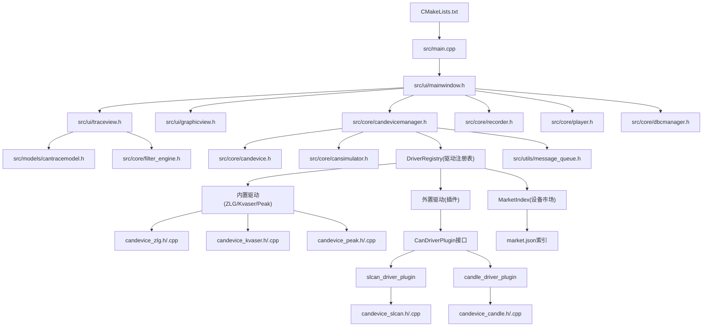
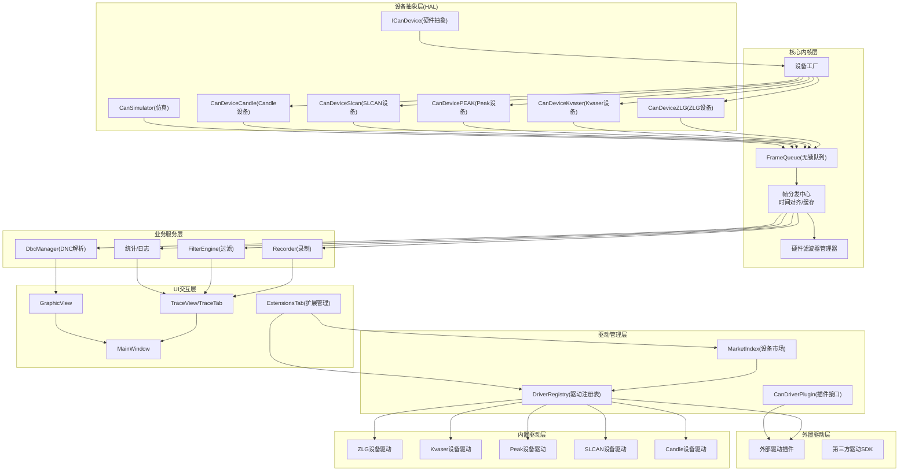
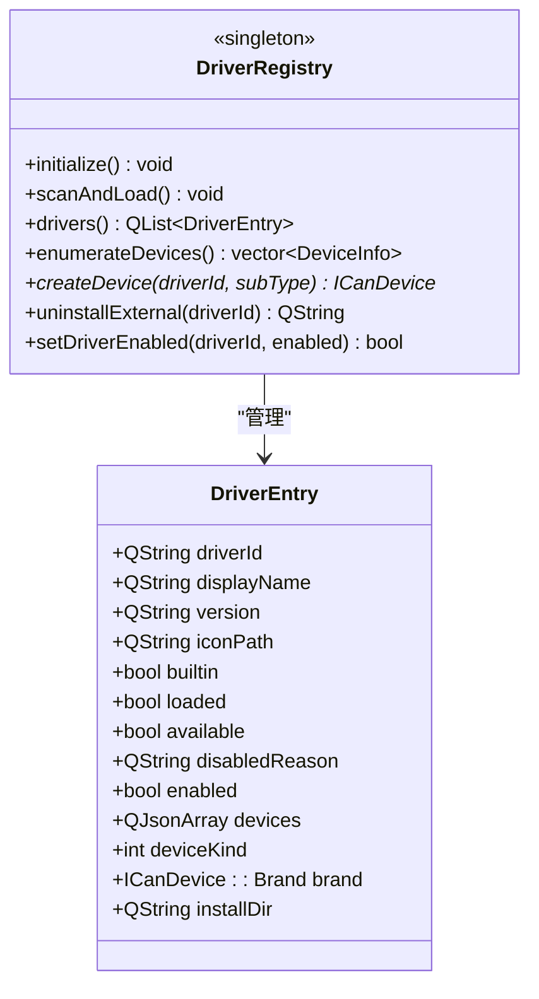
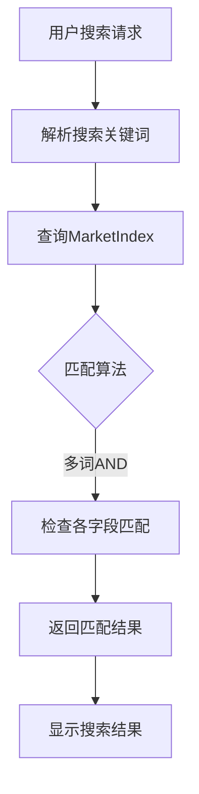
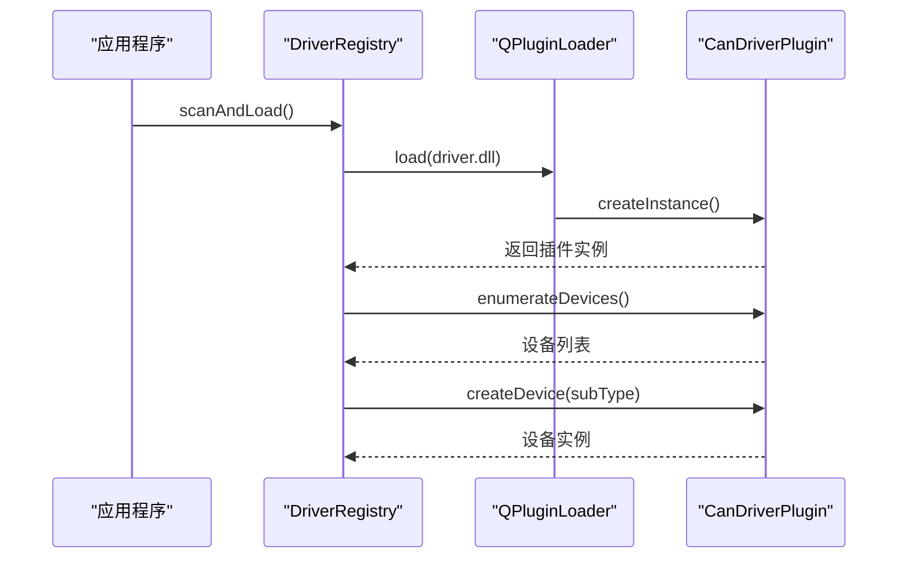
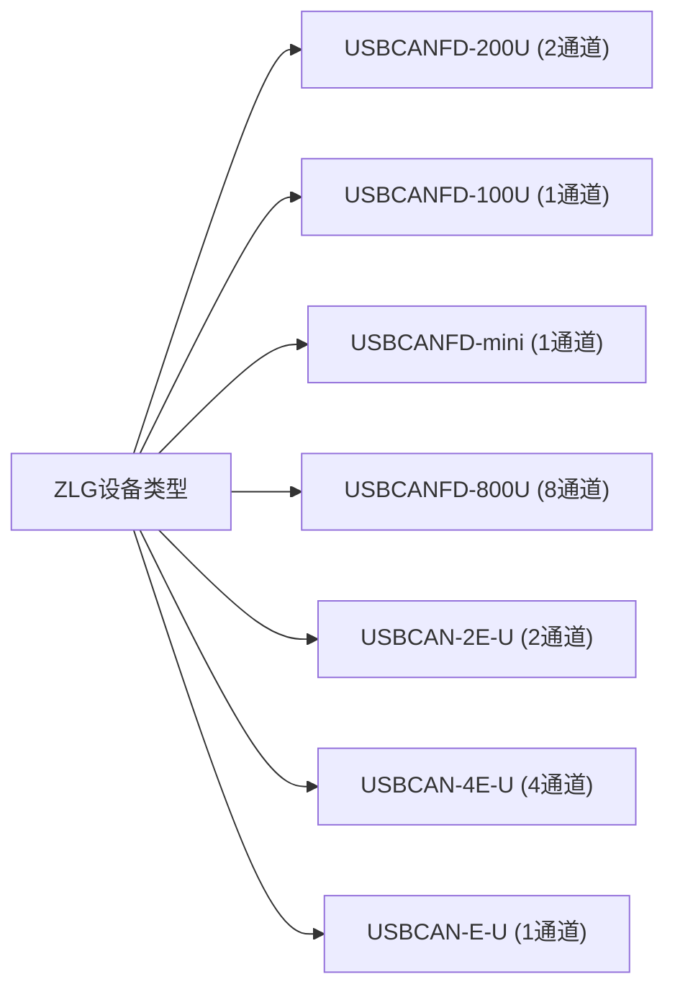
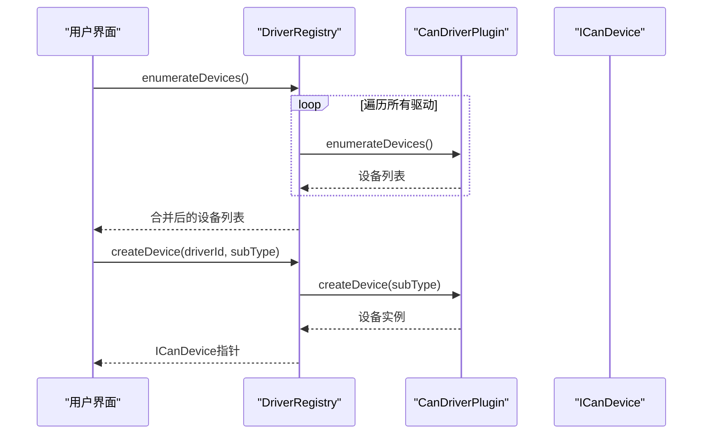
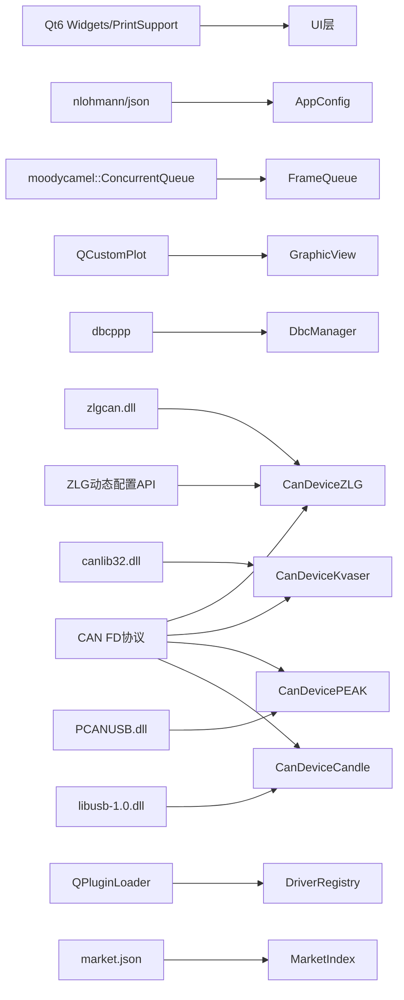

# CAN设备管理系统

<cite>
**本文引用的文件**
- [README.md](file://README.md)
- [CMakeLists.txt](file://CMakeLists.txt)
- [src/main.cpp](file://src/main.cpp)
- [src/core/canframe.h](file://src/core/canframe.h)
- [src/core/candevice.h](file://src/core/candevice.h)
- [src/core/candevicemanager.h](file://src/core/candevicemanager.h)
- [src/core/cansimulator.h](file://src/core/cansimulator.h)
- [src/models/cantracemodel.h](file://src/models/cantracemodel.h)
- [src/ui/traceview.h](file://src/ui/traceview.h)
- [src/core/filter_engine.h](file://src/core/filter_engine.h)
- [src/core/recorder.h](file://src/core/recorder.h)
- [src/core/player.h](file://src/core/player.h)
- [src/ui/graphicview.h](file://src/ui/graphicview.h)
- [src/core/dbcmanager.h](file://src/core/dbcmanager.h)
- [src/utils/message_queue.h](file://src/utils/message_queue.h)
- [src/core/appconfig.h](file://src/core/appconfig.h)
- [src/core/candevice_zlg.h](file://src/core/candevice_zlg.h)
- [src/core/candevice_zlg.cpp](file://src/core/candevice_zlg.cpp)
- [src/core/candevicemanager.cpp](file://src/core/candevicemanager.cpp)
- [src/core/candevice_kvaser.h](file://src/core/candevice_kvaser.h)
- [src/core/candevice_kvaser.cpp](file://src/core/candevice_kvaser.cpp)
- [src/core/candevice_peak.h](file://src/core/candevice_peak.h)
- [src/core/candevice_peak.cpp](file://src/core/candevice_peak.cpp)
- [src/core/candevice_slcan.h](file://src/core/candevice_slcan.h)
- [src/core/candevice_slcan.cpp](file://src/core/candevice_slcan.cpp)
- [src/core/candevice_candle.h](file://src/core/candevice_candle.h)
- [src/core/candevice_candle.cpp](file://src/core/candevice_candle.cpp)
- [src/core/candevice.cpp](file://src/core/candevice.cpp)
- [src/core/driver/driverregistry.h](file://src/core/driver/driverregistry.h)
- [src/core/driver/driverregistry.cpp](file://src/core/driver/driverregistry.cpp)
- [src/core/driver/marketindex.h](file://src/core/driver/marketindex.h)
- [src/core/driver/marketindex.cpp](file://src/core/driver/marketindex.cpp)
- [src/core/driver/candriverplugin.h](file://src/core/driver/candriverplugin.h)
- [drivers/zlg/driver.json](file://drivers/zlg/driver.json)
- [drivers/peak/driver.json](file://drivers/peak/driver.json)
- [drivers/slcan/driver.json](file://drivers/slcan/driver.json)
- [drivers/candle/driver.json](file://drivers/candle/driver.json)
- [drivers/slcan/slcan_driver_plugin.h](file://drivers/slcan/slcan_driver_plugin.h)
- [drivers/slcan/slcan_driver_plugin.cpp](file://drivers/slcan/slcan_driver_plugin.cpp)
- [drivers/candle/candle_driver_plugin.h](file://drivers/candle/candle_driver_plugin.h)
- [drivers/candle/candle_driver_plugin.cpp](file://drivers/candle/candle_driver_plugin.cpp)
- [src/ui/extensionstab.h](file://src/ui/extensionstab.h)
- [src/ui/extensionstab.cpp](file://src/ui/extensionstab.cpp)
</cite>

## 更新摘要
**已进行的更改**
- **ZLG设备枚举稳定性重大改进**：移除了USBCAN-1和USBCAN-2设备类型支持，简化了设备检测逻辑，优化了设备命名机制，减少了SDK调用以降低堆损坏风险
- **新增SLCAN驱动支持**Lawicel CANUSB协议家族，覆盖50+种USB转CAN适配器，支持自动波特率检测和软件时间戳
- **新增GS_USB/Candle驱动支持**candleLight固件家族，实现完整的GS_USB协议握手序列，VID/PID白名单支持7种设备家族，完整CAN FD支持和硬件时间戳
- **扩展设备品牌枚举**，新增SLCAN和Candle品牌标识
- **增强设备工厂模式**，支持新驱动的动态创建和枚举
- **完善驱动插件架构**，提供标准化的外部驱动接入机制

## 目录
1. [简介](#简介)
2. [项目结构](#项目结构)
3. [核心组件](#核心组件)
4. [架构总览](#架构总览)
5. [详细组件分析](#详细组件分析)
6. [依赖关系分析](#依赖关系分析)
7. [性能考量](#性能考量)
8. [故障排查指南](#故障排查指南)
9. [结论](#结论)
10. [附录](#附录)

## 简介
本系统是一款面向汽车电子与总线调试的CAN/CAN FD报文分析工具，提供实时录制、文件回放、DBC信号解析、Trace列表展示、Graphic波形视图等能力。整体采用Qt6 + C++17构建，UI风格参考VS Code，支持无边框窗口、可停靠面板与多标签编辑区。系统通过统一的设备抽象层隔离硬件差异，结合无锁消息队列与发布订阅机制，实现高吞吐、低延迟的数据流处理。

**最新更新**：系统现已完全重构驱动管理系统，引入DriverRegistry统一管理平台，支持内置驱动（ZLG、Kvaser、Peak Systems）和外置驱动的混合管理。**重大增强**：新增SLCAN和GS_USB/Candle两大开源设备驱动，大幅扩展硬件兼容性。SLCAN驱动支持Lawicel CANUSB协议家族，覆盖50+种USB转CAN适配器；Candle驱动支持candleLight固件家族，提供完整的GS_USB协议支持和硬件时间戳功能。**稳定性改进**：ZLG设备枚举系统经过重大优化，移除了不稳定的USBCAN-1和USBCAN-2设备类型支持，显著降低了堆损坏风险，提升了设备检测的可靠性。系统支持驱动的热重载和动态加载，无需重启应用程序即可更新驱动配置。

## 项目结构
- 顶层CMake工程负责Qt6查找、子模块集成与安装规则
- src为核心代码：core（数据模型与引擎）、models（表格模型）、ui（界面）、utils（工具）
- drivers为外置驱动包目录，每个驱动包含driver.json清单和插件实现
- resources存放样式与资源，scripts为构建脚本
- third_party包含第三方库源码或头文件

**图表来源**
- [CMakeLists.txt:1-63](file://CMakeLists.txt#L1-L63)
- [src/main.cpp:1-35](file://src/main.cpp#L1-L35)
- [src/ui/mainwindow.h:1-226](file://src/ui/mainwindow.h#L1-L226)
- [src/ui/traceview.h:1-189](file://src/ui/traceview.h#L1-L189)
- [src/ui/graphicview.h:1-160](file://src/ui/graphicview.h#L1-L160)
- [src/core/candevicemanager.h:1-142](file://src/core/candevicemanager.h#L1-L142)
- [src/core/candevice.h:1-127](file://src/core/candevice.h#L1-L127)
- [src/core/cansimulator.h:1-69](file://src/core/cansimulator.h#L1-L69)
- [src/core/driver/driverregistry.h:1-110](file://src/core/driver/driverregistry.h#L1-L110)
- [src/core/driver/marketindex.h:1-96](file://src/core/driver/marketindex.h#L1-L96)

**章节来源**
- [CMakeLists.txt:1-63](file://CMakeLists.txt#L1-L63)
- [README.md:235-278](file://README.md#L235-L278)

## 核心组件
- CanFrame：统一帧数据结构，涵盖时间戳、ID、扩展/FD标志、DLC、数据、通道、方向等，并提供序列化接口
- ICanDevice：设备抽象接口，定义枚举、打开/关闭、发送/接收、厂商扩展、硬件接收滤波器等
- CanDeviceManager：QObject桥接层，统一管理模拟器与真实设备，对外暴露统一信号，支持硬件滤波控制
- CanSimulator：后台线程生成模拟流量，通过无锁队列批量投递到主线程
- **DriverRegistry**：驱动注册表，统一管理所有内置和外置驱动，支持动态加载和热重载
- **MarketIndex**：设备市场索引，管理market.json格式的驱动元数据和设备信息
- **CanDriverPlugin**：驱动插件接口，定义标准的外部驱动接入规范
- **CanDeviceSlcan**：SLCAN协议设备后端，支持Lawicel CANUSB协议家族
- **CanDeviceCandle**：GS_USB协议设备后端，支持candleLight固件家族
- CanTraceModel：QAbstractTableModel实现，支持追加、覆盖模式、行标记与着色
- TraceView/TraceTab：Wireshark风格Trace列表、过滤栏、帧信息与信号解码面板
- FilterEngine：自写递归下降表达式过滤器，支持变量、逻辑与比较运算符
- Recorder/Player：录制器与播放器，分别负责写入与按时间戳回放
- GraphicView：基于QCustomPlot的信号波形视图，支持多轴、卡尺测量
- DbcManager：DBC加载与索引，提供O(1)报文查找与信号解码
- FrameQueue：基于moodycamel::ConcurrentQueue的无锁队列封装
- AppConfig：基于nlohmann/json的配置管理

**章节来源**
- [src/core/canframe.h:1-117](file://src/core/canframe.h#L1-L117)
- [src/core/candevice.h:1-127](file://src/core/candevice.h#L1-L127)
- [src/core/candevicemanager.h:1-142](file://src/core/candevicemanager.h#L1-L142)
- [src/core/cansimulator.h:1-69](file://src/core/cansimulator.h#L1-L69)
- [src/core/driver/driverregistry.h:1-110](file://src/core/driver/driverregistry.h#L1-L110)
- [src/core/driver/marketindex.h:1-96](file://src/core/driver/marketindex.h#L1-L96)
- [src/core/driver/candriverplugin.h:1-49](file://src/core/driver/candriverplugin.h#L1-L49)
- [src/core/candevice_slcan.h:1-81](file://src/core/candevice_slcan.h#L1-L81)
- [src/core/candevice_candle.h:1-152](file://src/core/candevice_candle.h#L1-L152)
- [src/models/cantracemodel.h:1-120](file://src/models/cantracemodel.h#L1-L120)
- [src/ui/traceview.h:1-189](file://src/ui/traceview.h#L1-L189)
- [src/core/filter_engine.h:1-59](file://src/core/filter_engine.h#L1-L59)
- [src/core/recorder.h:1-48](file://src/core/recorder.h#L1-L48)
- [src/core/player.h:1-74](file://src/core/player.h#L1-L74)
- [src/ui/graphicview.h:1-160](file://src/ui/graphicview.h#L1-L160)
- [src/core/dbcmanager.h:1-73](file://src/core/dbcmanager.h#L1-L73)
- [src/utils/message_queue.h:1-87](file://src/utils/message_queue.h#L1-87)
- [src/core/appconfig.h:1-73](file://src/core/appconfig.h#L1-L73)

## 架构总览
系统采用"中心化发布订阅"思想：设备抽象层（HAL）将在线采集、离线回放、仿真源统一为标准帧流；核心内核层进行时间对齐与分发；业务服务层订阅数据并执行日志、统计、解析等任务；UI交互层仅消费数据，不直接访问底层。

**重大更新**：系统现在通过DriverRegistry统一管理所有驱动，支持内置驱动（ZLG、Kvaser、Peak Systems）和外置驱动的混合管理模式。**特别增强**：新增SLCAN和GS_USB/Candle两大开源设备驱动，大幅扩展硬件兼容性。SLCAN驱动支持Lawicel CANUSB协议家族，覆盖50+种USB转CAN适配器；Candle驱动支持candleLight固件家族，提供完整的GS_USB协议支持和硬件时间戳功能。**稳定性改进**：ZLG设备枚举系统经过重大优化，移除了不稳定的USBCAN-1和USBCAN-2设备类型支持，显著降低了堆损坏风险。**特别增强**：系统支持驱动的热重载和动态加载，无需重启应用程序即可更新驱动配置。

**图表来源**
- [src/core/driver/driverregistry.h:1-110](file://src/core/driver/driverregistry.h#L1-L110)
- [src/core/driver/marketindex.h:1-96](file://src/core/driver/marketindex.h#L1-L96)
- [src/core/driver/candriverplugin.h:1-49](file://src/core/driver/candriverplugin.h#L1-L49)
- [src/core/candevicemanager.h:1-142](file://src/core/candevicemanager.h#L1-L142)
- [src/core/cansimulator.h:1-69](file://src/core/cansimulator.h#L1-L69)
- [src/core/player.h:1-74](file://src/core/player.h#L1-L74)
- [src/core/candevice_zlg.h:1-129](file://src/core/candevice_zlg.h#L1-L129)
- [src/core/candevice_kvaser.h:1-66](file://src/core/candevice_kvaser.h#L1-L66)
- [src/core/candevice_peak.h:1-124](file://src/core/candevice_peak.h#L1-L124)
- [src/core/candevice_slcan.h:1-81](file://src/core/candevice_slcan.h#L1-L81)
- [src/core/candevice_candle.h:1-152](file://src/core/candevice_candle.h#L1-L152)
- [src/ui/extensionstab.h:1-54](file://src/ui/extensionstab.h#L1-L54)

## 详细组件分析

### DriverRegistry驱动注册表
**新增功能**：实现了统一的驱动注册表，管理所有内置和外置驱动的生命周期。

#### 核心特性
- **双模式驱动管理**：支持内置驱动（静态编译）和外置驱动（动态加载）的统一管理
- **热重载支持**：运行时扫描和加载新安装的驱动，无需重启应用程序
- **版本优先级**：同driverId的外置驱动版本高于内置驱动时自动覆盖
- **安全校验**：支持CHECKSUMS.sha256完整性验证，确保驱动包安全性
- **禁用机制**：支持临时禁用特定驱动，配置持久化到disabled.json

#### 驱动条目结构

**图表来源**
- [src/core/driver/driverregistry.h:32-47](file://src/core/driver/driverregistry.h#L32-L47)
- [src/core/driver/driverregistry.h:49-84](file://src/core/driver/driverregistry.h#L49-L84)

**章节来源**
- [src/core/driver/driverregistry.h:1-110](file://src/core/driver/driverregistry.h#L1-L110)
- [src/core/driver/driverregistry.cpp:1-608](file://src/core/driver/driverregistry.cpp#L1-L608)

### MarketIndex设备市场索引
**新增功能**：实现了设备市场的索引系统，支持从远程或本地获取驱动元数据。

#### 市场数据结构
- **DriverInfo**：驱动包信息，包含id、name、vendor、version、package、sha256等
- **DeviceInfo**：设备详情信息，包含model、vendor、type、summary、tags、images等
- **双索引支持**：同时管理drivers和devices两个维度的数据

#### 搜索功能
- **多词AND检索**：支持型号、厂商、摘要、标签、keywords的多字段搜索
- **大小写不敏感**：搜索过程忽略大小写差异
- **本地优先**：开发模式下优先使用本地market.json，发布模式使用远程地址

**图表来源**
- [src/core/driver/marketindex.cpp:21-38](file://src/core/driver/marketindex.cpp#L21-L38)
- [src/core/driver/marketindex.cpp:150-161](file://src/core/driver/marketindex.cpp#L150-L161)

**章节来源**
- [src/core/driver/marketindex.h:1-96](file://src/core/driver/marketindex.h#L1-L96)
- [src/core/driver/marketindex.cpp:1-185](file://src/core/driver/marketindex.cpp#L1-L185)

### CanDriverPlugin插件接口
**新增功能**：定义了标准化的外部驱动插件接口，支持第三方驱动的接入。

#### 接口规范
- **ABI契约**：要求与主程序同Qt大版本、同编译器、同架构
- **跨DLL边界**：仅传递Qt值类型、POD类型和ICanDevice*裸指针
- **接口演进**：新增虚函数需追加在末尾并升级IID版本

#### 插件生命周期

**图表来源**
- [src/core/driver/driverregistry.cpp:186-272](file://src/core/driver/driverregistry.cpp#L186-L272)
- [src/core/driver/candriverplugin.h:21-44](file://src/core/driver/candriverplugin.h#L21-L44)

**章节来源**
- [src/core/driver/candriverplugin.h:1-49](file://src/core/driver/candriverplugin.h#L1-L49)

### ZLG设备驱动稳定性改进
**重大更新**：ZLG设备枚举系统经过重大稳定性改进，移除了不稳定的USBCAN-1和USBCAN-2设备类型支持。

#### 稳定性改进内容
- **移除不稳定设备类型**：移除了USBCAN-1和USBCAN-2设备类型的枚举支持，这些属于ControlCAN生态的老型号，向zlgcan.dll传不支持类型的行为无文档保证，是真机在场时探测循环堆损坏的头号嫌疑
- **简化设备检测逻辑**：仅保留zlgcan.dll明确支持的FD/E-U系列设备，包括USBCANFD-200U、USBCANFD-100U、USBCANFD-mini、USBCANFD-800U、USBCAN-2E-U、USBCAN-4E-U、USBCAN-E-U
- **优化设备命名机制**：使用静态查表取名，不在push_back表达式内构造/析构CanDeviceZLG临时对象，减小枚举循环里的对象活动面
- **减少SDK调用**：不再调用ZCAN_IsDeviceOnLine，部分设备/驱动组合下返回0但可正常InitCAN/StartCAN，且真机在场时open后的额外SDK调用面缩小可降低间歇性堆损坏风险

#### 当前支持的设备类型

**图表来源**
- [src/core/candevice_zlg.cpp:741-749](file://src/core/candevice_zlg.cpp#L741-L749)

**章节来源**
- [src/core/candevice_zlg.cpp:736-785](file://src/core/candevice_zlg.cpp#L736-L785)
- [src/core/candevice_zlg.h:33-43](file://src/core/candevice_zlg.h#L33-L43)

### SLCAN设备驱动
**新增功能**：实现了SLCAN（Lawicel串口文本协议）设备后端，支持广泛的USB转CAN适配器。

#### 核心特性
- **协议支持**：保守公共子集C/O/V/N/F/M/S，兼容淘宝廉价适配器、Lawicel CANUSB、CANable (slcan固件)、ESP32·Arduino DIY等
- **串口通信**：Win32 API串口层，115200-8N1，无流控，避免DTR/RTS误触发复位
- **自动波特率检测**：支持多种波特率配置，适配不同固件需求
- **软件时间戳**：无硬件时间戳时通过steady_clock软件补齐timestampNs
- **设备枚举**：支持系统串口名列表和设备条目枚举

#### 设备类型支持
- 通用SLCAN适配器
- Lawicel CANUSB
- CANable (slcan固件)
- USBtin
- ESP32 / Arduino DIY

**章节来源**
- [src/core/candevice_slcan.h:1-81](file://src/core/candevice_slcan.h#L1-L81)
- [drivers/slcan/driver.json:1-17](file://drivers/slcan/driver.json#L1-L17)
- [drivers/slcan/slcan_driver_plugin.h:1-33](file://drivers/slcan/slcan_driver_plugin.h#L1-L33)

### GS_USB/Candle设备驱动
**新增功能**：实现了GS_USB协议设备后端，支持candleLight固件家族的开源USB CAN设备。

#### 核心特性
- **协议实现**：完整的GS_USB协议握手序列，包括HOST_FORMAT、DEVICE_CONFIG、BT_CONST、BITTIMING、MODE START等步骤
- **VID/PID白名单**：支持7种设备家族的VID/PID白名单匹配，包括CANable、candleLight、CANnectivity等
- **CAN FD支持**：完整的CAN FD协议支持，包括64字节载荷、BRS/ESI标志、双波特率配置
- **硬件时间戳**：支持设备硬件时间戳（1MHz自由计数器），首帧与steady_clock对齐后换算纳秒并处理32位回绕
- **libusb集成**：动态加载libusb-1.0.dll，进程内共享单例，永不卸载

#### 设备类型支持
- CANable (candle固件)
- candleLight / GS_USB
- candleLight (原版VID)
- CANnectivity
- CES CANext FD
- ABE CANDebugger FD
- Xylanta Saint3

**章节来源**
- [src/core/candevice_candle.h:1-152](file://src/core/candevice_candle.h#L1-L152)
- [drivers/candle/driver.json:1-24](file://drivers/candle/driver.json#L1-L24)
- [drivers/candle/candle_driver_plugin.h:1-35](file://drivers/candle/candle_driver_plugin.h#L1-L35)

### 设备工厂与枚举系统
**更新功能**：通过DriverRegistry实现了统一的设备工厂模式和全品牌设备枚举系统。

#### 设备工厂模式
- **DriverRegistry::createDevice()**：根据driverId和subType创建设备实例
- **外置优先策略**：优先使用外置驱动，回退到内置驱动
- **品牌映射**：支持brandToDriverId和driverIdToBrand的双向转换

#### 设备枚举系统
- **DriverRegistry::enumerateDevices()**：聚合所有可用驱动的在线设备
- **多品牌支持**：自动检测ZLG、PEAK、Kvaser、SLCAN、Candle等设备
- **设备信息增强**：包含driverId、品牌、设备类型等详细信息

**图表来源**
- [src/core/driver/driverregistry.cpp:382-450](file://src/core/driver/driverregistry.cpp#L382-L450)

**章节来源**
- [src/core/driver/driverregistry.cpp:382-450](file://src/core/driver/driverregistry.cpp#L382-L450)
- [src/core/candevice.cpp:1-43](file://src/core/candevice.cpp#L1-L43)

### 设备市场界面
**新增功能**：实现了设备市场的用户界面，支持驱动的浏览、搜索和安装。

#### 扩展管理界面
- **ExtensionsTab**：插件管理中心，显示所有已发现插件的状态
- **状态管理**：支持启用/禁用、启动/停止等操作
- **包管理**：支持.opk插件包的安装和卸载

#### 设备市场功能
- **驱动搜索**：支持按型号、厂商、标签等多维度搜索
- **驱动详情**：显示驱动的版本、许可证、兼容性等信息
- **一键安装**：直接从市场下载安装驱动包

**章节来源**
- [src/ui/extensionstab.h:1-54](file://src/ui/extensionstab.h#L1-L54)
- [src/ui/extensionstab.cpp:1-243](file://src/ui/extensionstab.cpp#L1-L243)

### 设备抽象与设备管理器
- ICanDevice定义统一设备契约，支持枚举、打开/关闭、发送/接收、厂商扩展、硬件接收滤波器
- CanDeviceManager作为QObject桥接层，持有ICanDevice或CanSimulator实例，对外发射frameGenerated信号，屏蔽后端差异，提供统一的硬件滤波控制接口
- 接收线程通过FrameQueue批量入队，主线程定时drainQueue消费，避免阻塞UI

**重大更新**：CanDeviceManager现在通过DriverRegistry统一管理多种设备类型（模拟器、ZLG、Kvaser、Peak、SLCAN、Candle等），并通过统一的接口管理不同的硬件后端，支持设备工厂模式和动态设备创建。**特别增强**：新增了硬件接收滤波器的统一管理，支持ZLG设备的动态配置API。**稳定性改进**：ZLG设备枚举系统的稳定性改进确保了更可靠的设备检测过程。

**章节来源**
- [src/core/candevice.h:1-127](file://src/core/candevice.h#L1-L127)
- [src/core/candevicemanager.h:1-142](file://src/core/candevicemanager.h#L1-L142)
- [src/core/candevicemanager.cpp:1-200](file://src/core/candevicemanager.cpp#L1-L200)
- [src/core/cansimulator.h:1-69](file://src/core/cansimulator.h#L1-L69)
- [src/utils/message_queue.h:1-87](file://src/utils/message_queue.h#L1-87)

### 多品牌设备驱动架构
**重大更新**：系统现在支持五大主流CAN设备厂商，每个厂商都有独立的设备驱动实现，通过统一的ICanDevice接口进行抽象。

#### ZLG设备驱动（稳定性改进版）
- **双句柄管理机制**：设备句柄（devHandle）用于设备级操作，通道句柄（channelHandle）用于通道级操作
- **改进的设备支持**：移除了不稳定的USBCAN-1/2设备类型，专注于稳定的FD/E-U系列设备
- **CAN FD完整支持**：64字节载荷、BRS/ESI标志、双波特率配置
- **动态接受过滤**：通过ZCAN_Dynamic_Config结构体实现硬件级动态配置，支持白名单/黑名单模式、ID范围过滤、扩展帧过滤等

#### Kvaser设备驱动
- **canlib32.dll动态加载**：支持Kvaser USBcan、Leaf等系列设备
- **CAN FD标志处理**：支持CANLIB_CANFD_MESSAGE、CANLIB_CANFD_BRS、CANLIB_CANFD_ESI标志位
- **设备通道映射**：devIndex * 2 + channel的设备通道计算方式

#### Peak设备驱动
- **PCAN-Basic API封装**：支持PCAN-USB、PCAN-USB FD、PCAN-USB Pro FD等设备
- **时间戳处理**：PCAN硬件时间戳（微秒精度）转为纳秒填充timestampNs
- **CAN FD帧结构**：TPCANMsgFD结构体支持64字节数据载荷

#### SLCAN设备驱动
- **串口文本协议**：基于Lawicel CANUSB协议的串口通信，支持多种USB转CAN适配器
- **自动波特率检测**：支持115200等标准波特率，适配不同固件需求
- **软件时间戳**：通过steady_clock提供软件时间戳补偿

#### Candle设备驱动
- **GS_USB协议实现**：完整的GS_USB协议握手序列，支持candleLight固件家族
- **VID/PID白名单**：支持7种设备家族的VID/PID白名单匹配
- **硬件时间戳**：支持设备硬件时间戳，1MHz自由计数器，首帧对齐后换算纳秒

**章节来源**
- [src/core/candevice_zlg.h:1-129](file://src/core/candevice_zlg.h#L1-L129)
- [src/core/candevice_zlg.cpp:1-785](file://src/core/candevice_zlg.cpp#L1-L785)
- [src/core/candevice_kvaser.h:1-66](file://src/core/candevice_kvaser.h#L1-L66)
- [src/core/candevice_kvaser.cpp:1-265](file://src/core/candevice_kvaser.cpp#L1-L265)
- [src/core/candevice_peak.h:1-124](file://src/core/candevice_peak.h#L1-L124)
- [src/core/candevice_peak.cpp:1-363](file://src/core/candevice_peak.cpp#L1-L363)
- [src/core/candevice_slcan.h:1-81](file://src/core/candevice_slcan.h#L1-L81)
- [src/core/candevice_candle.h:1-152](file://src/core/candevice_candle.h#L1-L152)

### Trace追踪与过滤
- CanTraceModel维护帧序列，支持appendFrame/appendFrames、覆盖模式、行标记与自定义颜色
- TraceView/TraceTab提供列排序、漏斗筛选、表达式过滤、右键快速筛选、书签等功能
- FilterEngine编译表达式并对每帧求值，语法包括id/dlc/ch/time/fd/ext/rx/tx/std等变量与逻辑/比较运算符

**章节来源**
- [src/models/cantracemodel.h:1-120](file://src/models/cantracemodel.h#L1-L120)
- [src/ui/traceview.h:1-189](file://src/ui/traceview.h#L1-L189)
- [src/core/filter_engine.h:1-59](file://src/core/filter_engine.h#L1-L59)

### 录制与回放
- Recorder根据文件扩展名选择写入器，将CanFrame流式写入BLF/ASC/CSV
- Player从文件或帧序列加载，按原始时间戳播放，支持速度控制、暂停、跳转

**章节来源**
- [src/core/recorder.h:1-48](file://src/core/recorder.h#L1-L48)
- [src/core/player.h:1-74](file://src/core/player.h#L1-L74)

### 图形视图与DBC解析
- GraphicView基于QCustomPlot绘制多信号曲线，支持单/双卡尺、时间窗口缩放、独立Y轴
- DbcManager加载DBC文件，建立ID→Message哈希索引，提供decodeFrame/decodeSignal解码

**章节来源**
- [src/ui/graphicview.h:1-160](file://src/ui/graphicview.h#L1-L160)
- [src/core/dbcmanager.h:1-73](file://src/core/dbcmanager.h#L1-L73)

### 应用入口与配置
- main.cpp注册元类型、初始化日志、加载配置、应用主题、创建主窗口
- AppConfig基于nlohmann/json管理settings.json，提供typed getter/setter与持久化

**章节来源**
- [src/main.cpp:1-35](file://src/main.cpp#L1-L35)
- [src/core/appconfig.h:1-73](file://src/core/appconfig.h#L1-L73)

## 依赖关系分析
- Qt6 Widgets/PrintSupport为UI基础
- nlohmann/json用于配置管理
- moodycamel::ConcurrentQueue用于无锁队列
- QCustomPlot用于波形绘图
- dbcppp用于DBC解析
- **zlgcan.dll**用于ZLG设备驱动（运行时动态加载）
- **canlib32.dll**用于Kvaser设备驱动（运行时动态加载）
- **PCANUSB.dll**用于Peak设备驱动（运行时动态加载）
- **libusb-1.0.dll**用于Candle设备驱动（运行时动态加载）
- **QPluginLoader**用于外部驱动插件的动态加载

**重大更新**：新增了DriverRegistry和MarketIndex等核心组件，支持驱动的热重载和设备市场的功能。**特别增强**：引入了CanDriverPlugin插件接口，实现了标准化的外部驱动接入机制。新增SLCAN和Candle驱动，大幅扩展了硬件兼容性。**稳定性改进**：ZLG设备枚举系统的稳定性改进减少了SDK调用，降低了堆损坏风险。

**图表来源**
- [CMakeLists.txt:1-63](file://CMakeLists.txt#L1-L63)
- [src/core/appconfig.h:1-73](file://src/core/appconfig.h#L1-L73)
- [src/utils/message_queue.h:1-87](file://src/utils/message_queue.h#L1-87)
- [src/ui/graphicview.h:1-160](file://src/ui/graphicview.h#L1-L160)
- [src/core/dbcmanager.h:1-73](file://src/core/dbcmanager.h#L1-L73)
- [src/core/driver/driverregistry.h:1-110](file://src/core/driver/driverregistry.h#L1-L110)
- [src/core/driver/marketindex.h:1-96](file://src/core/driver/marketindex.h#L1-L96)

**章节来源**
- [CMakeLists.txt:1-63](file://CMakeLists.txt#L1-L63)
- [README.md:377-384](file://README.md#L377-L384)

## 性能考量
- 无锁队列：生产者-消费者模型减少线程竞争，适合高频报文场景
- 批量操作：FrameQueue提供批量入队/出队，降低交互开销
- 覆盖模式：同ID只保留最新帧，降低内存占用，提升滚动性能
- 虚拟模型：Trace使用QAbstractTableModel，避免QTableWidget的性能瓶颈
- 视口采样：GraphicView建议对大数据点进行降采样，保证流畅渲染
- **优化**：多品牌设备驱动均采用动态DLL加载，按需加载SDK，减少内存占用
- **增强**：CAN FD协议支持64字节大载荷，提升数据传输吞吐量
- **改进**：统一的时间戳处理机制，确保多品牌设备混用时时间轴一致性
- **新特性**：ZLG硬件级动态滤波可减少CPU负载，提高数据处理效率
- **新特性**：DriverRegistry支持驱动热重载，无需重启即可更新驱动配置
- **新特性**：MarketIndex支持本地缓存，减少网络请求频率
- **新特性**：Candle设备硬件时间戳提供更高精度的时间同步
- **新特性**：SLCAN软件时间戳补偿确保时间轴一致性
- **稳定性改进**：ZLG设备枚举系统优化减少了SDK调用，降低了堆损坏风险，提升了设备检测的可靠性

## 故障排查指南
- 设备连接失败：检查ICanDevice::open参数与设备序号；确认驱动与权限
- **新增**：DriverRegistry初始化失败：检查drivers目录权限；确认driver.json格式正确
- **新增**：外置驱动加载失败：检查driver_<id>.dll是否存在；确认CHECKSUMS.sha256校验通过
- **新增**：MarketIndex网络错误：检查网络连接；确认market.json地址可达
- **新增**：插件接口不匹配：检查CanDriverPlugin IID版本；确认Qt版本兼容性
- **新增**：驱动禁用后无法启用：检查disabled.json文件；确认驱动路径有效
- **新增**：设备市场搜索无结果：检查market.json是否加载成功；确认搜索关键词格式
- **新增**：SLCAN设备连接失败：检查串口名称是否正确；确认波特率设置；验证固件兼容性
- **新增**：Candle设备连接失败：检查libusb-1.0.dll是否加载；确认VID/PID在白名单中；验证设备驱动安装
- **新增**：ZLG设备枚举失败：确认设备类型为稳定的FD/E-U系列；检查zlgcan.dll是否正常加载
- **新增**：USBCAN-1/2设备不可用：这些设备类型已被移除，建议使用更新的USBCANFD系列设备
- 帧丢失：监控FrameQueue.approxSize与pendingFrames，确保主线程及时drain
- 过滤表达式错误：查看FilterEngine.errorString，修正语法
- 录制失败：确认文件路径与写入器初始化；检查磁盘空间与权限
- 回放卡顿：调整Player.speed与UI刷新频率；启用覆盖模式减少数据量

**章节来源**
- [src/core/candevicemanager.h:1-142](file://src/core/candevicemanager.h#L1-L142)
- [src/utils/message_queue.h:1-87](file://src/utils/message_queue.h#L1-87)
- [src/core/filter_engine.h:1-59](file://src/core/filter_engine.h#L1-L59)
- [src/core/recorder.h:1-48](file://src/core/recorder.h#L1-L48)
- [src/core/player.h:1-74](file://src/core/player.h#L1-L74)
- [src/core/driver/driverregistry.cpp:186-272](file://src/core/driver/driverregistry.cpp#L186-L272)
- [src/core/driver/marketindex.cpp:71-148](file://src/core/driver/marketindex.cpp#L71-L148)
- [src/core/candevice_zlg.cpp:736-785](file://src/core/candevice_zlg.cpp#L736-L785)

## 结论
本系统以清晰的层次化架构与松耦合设计，实现了CAN/CAN FD报文的采集、录制、回放与可视化分析。通过设备抽象、无锁队列与表达式过滤，兼顾了易用性与高性能。**重大更新**：系统现已完全重构驱动管理系统，通过DriverRegistry统一管理所有内置和外置驱动，支持热重载和动态加载。**特别增强**：新增设备市场功能，用户可以直接搜索、下载和安装新的设备驱动，大大简化了设备管理的复杂度。系统现已完全支持ZLG致远电子、Kvaser、Peak Systems、SLCAN和Candle五大主流CAN设备厂商，通过统一的ICanDevice接口和工厂模式实现了多品牌设备的无缝集成。**稳定性改进**：ZLG设备枚举系统经过重大优化，移除了不稳定的USBCAN-1和USBCAN-2设备类型支持，显著降低了堆损坏风险，提升了设备检测的可靠性。**特别增强**：ZLG设备现在支持硬件级别的动态接受过滤功能，通过ZLG的动态配置API实现高效的帧过滤，可显著降低CPU负载并提高数据处理效率。新增的SLCAN和Candle驱动大幅扩展了硬件兼容性，支持USB-CAN接口、PCIe卡、网络设备等85+种设备类型，以及完整的CAN FD协议增强功能，为汽车电子开发和总线调试提供了强大的工具支持。后续可扩展更多硬件后端、高级统计与脚本能力，满足复杂工程需求。

## 附录
- 构建与运行：参考README中的安装教程与CMake配置
- 协议与扩展：预留脚本引擎与AI侧边栏接口，便于未来增强
- **新增**：ZLG设备支持（稳定性改进版）：USBCANFD-200U、USBCANFD-100U、USBCANFD-mini、USBCANFD-800U、USBCAN-2E-U、USBCAN-4E-U、USBCAN-E-U等稳定设备类型
- **移除**：USBCAN-1和USBCAN-2设备类型支持（因稳定性问题）
- **新增**：Kvaser设备支持：USBcan II、Leaf、Leaf Light、Hybrid等系列设备
- **新增**：Peak设备支持：PCAN-USB、PCAN-USB FD、PCAN-USB Pro FD等设备
- **新增**：SLCAN设备支持：通用SLCAN适配器、Lawicel CANUSB、CANable (slcan固件)、USBtin、ESP32 / Arduino DIY等设备类型
- **新增**：Candle设备支持：CANable (candle固件)、candleLight / GS_USB、candleLight (原版VID)、CANnectivity、CES CANext FD、ABE CANDebugger FD、Xylanta Saint3等设备类型
- **新增**：CAN FD协议特性：64字节载荷、BRS/ESI标志、双波特率配置等完整支持
- **新增**：多品牌设备统一管理：统一的设备枚举、配置和生命周期管理
- **新增**：ZLG动态滤波功能：支持白名单/黑名单模式、ID范围过滤、扩展帧过滤、数据长度过滤等
- **新增**：硬件级帧过滤：通过ZCAN_Dynamic_Config结构体实现高效的硬件级别帧过滤
- **新增**：DriverRegistry驱动注册表：统一管理内置和外置驱动，支持热重载和动态加载
- **新增**：MarketIndex设备市场：支持market.json格式的驱动元数据管理和搜索
- **新增**：CanDriverPlugin插件接口：标准化的外部驱动接入规范
- **新增**：设备市场界面：支持驱动的浏览、搜索、安装和管理
- **新增**：SLCAN串口通信：基于Lawicel CANUSB协议的串口文本协议，支持自动波特率检测
- **新增**：Candle GS_USB协议：完整的GS_USB协议握手序列，支持VID/PID白名单和硬件时间戳
- **稳定性改进**：ZLG设备枚举系统优化，移除了不稳定的设备类型，减少了SDK调用，降低了堆损坏风险