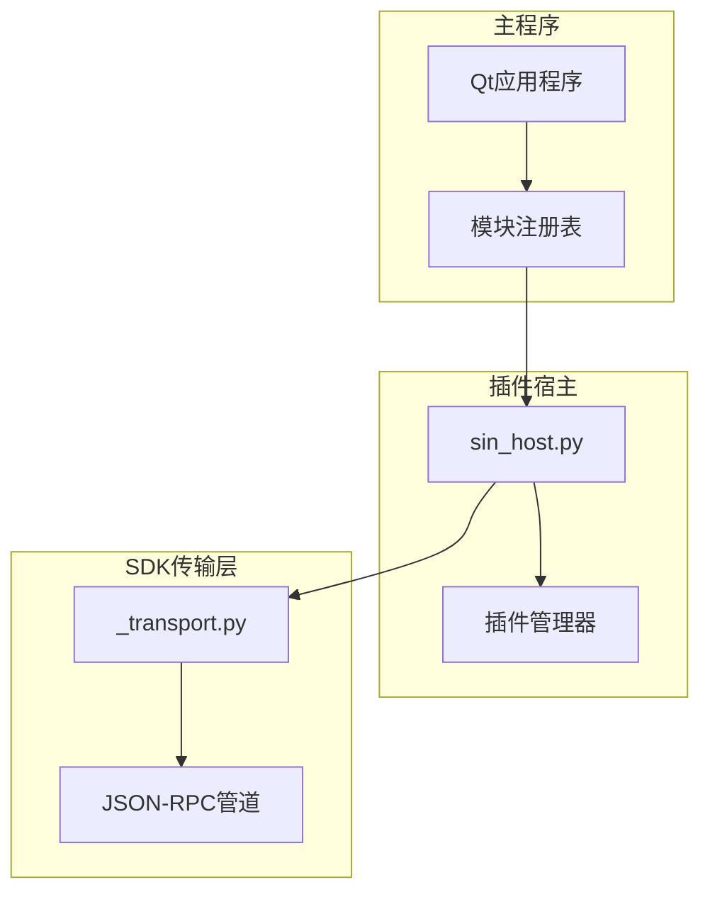

# CLI Shell系统

<cite>
**本文引用的文件**
- [src/main.cpp](file://src/main.cpp)
- [sdk/sin/_transport.py](file://sdk/sin/_transport.py)
- [scripts/sin_host.py](file://scripts/sin_host.py)
- [doc/CLI-SHELL-Specification.md](file://doc/CLI-SHELL-Specification.md)
</cite>

## 更新摘要
**所做更改**
- **重大变更**：CLI Shell系统已从代码库中完全移除，包括src/core/shell/目录及其所有HTTP RPC服务器、命令处理器和相关协议定义
- 标记为已废弃功能，不再提供TCP JSON-RPC 2.0服务器支持
- 移除了端口5555监听和完整的远程访问能力
- 更新了架构说明以反映当前状态，仅保留插件宿主通信机制
- 添加了废弃警告和迁移指南

## 目录
1. [系统概述](#系统概述)
2. [废弃状态说明](#废弃状态说明)
3. [遗留组件](#遗留组件)
4. [替代方案](#替代方案)
5. [迁移指南](#迁移指南)

## 系统概述

**⚠️ 重要提示：CLI Shell系统已完全废弃**

OpenBUS CLI Shell系统（基于JSON-RPC 2.0协议的TCP远程过程调用接口）已在最新版本中完全移除。该系统原本允许通过TCP/IP网络控制OpenBUS的所有功能，但现已不再提供支持。

### 历史特性（已移除）
- ~~**标准化协议**: 基于JSON-RPC 2.0标准协议~~
- ~~**全功能覆盖**: 支持trace、dbc、file、ui、record、playback等核心模块~~
- ~~**多语言支持**: 提供Python SDK客户端，支持任意语言通过TCP连接~~
- ~~**AI Agent友好**: 结构化指令集，支持自动化控制和脚本化操作~~
- ~~**调试工具兼容**: 支持Postman、curl等标准HTTP客户端工具~~

### 当前状态
CLI Shell系统的移除标志着OpenBUS向更加简洁的架构方向发展，专注于核心的CAN总线分析功能，移除了复杂的远程访问层。

**章节来源**
- [src/main.cpp:21-79](file://src/main.cpp#L21-L79)
- [doc/CLI-SHELL-Specification.md:1-50](file://doc/CLI-SHELL-Specification.md#L1-L50)

## 废弃状态说明

### 移除范围
以下组件已从代码库中完全删除：
- `src/core/shell/` 目录及所有内容
- TCP RPC服务器实现
- HTTP RPC服务器
- 命令处理器框架
- Python SDK客户端库（openbus_shell）
- 相关协议定义和配置

### 影响分析
- **API中断**：所有通过端口5555的TCP连接请求将失败
- **SDK不可用**：原有的Python SDK客户端无法正常工作
- **自动化脚本失效**：依赖CLI Shell的自动化测试脚本需要重写
- **第三方集成中断**：与外部工具的集成需要重新设计

### 废弃时间线
- **v0.1.0**：CLI Shell系统完全移除
- **后续版本**：可能提供新的替代方案或完全不同的远程访问机制

**章节来源**
- [src/main.cpp:21-79](file://src/main.cpp#L21-L79)

## 遗留组件

### 插件宿主通信机制
虽然CLI Shell系统已移除，但OpenBUS仍保留了插件宿主通信机制，用于内部模块间通信：



**图表来源**
- [scripts/sin_host.py:1-452](file://scripts/sin_host.py#L1-L452)
- [sdk/sin/_transport.py:1-72](file://sdk/sin/_transport.py#L1-L72)

### 现有通信方式
系统现在使用stdin/stdout管道进行JSON-RPC通信，主要用于：
- 插件与主程序之间的通信
- 内部模块间的消息传递
- 非网络化的本地通信

**章节来源**
- [scripts/sin_host.py:1-452](file://scripts/sin_host.py#L1-L452)
- [sdk/sin/_transport.py:1-72](file://sdk/sin/_transport.py#L1-L72)

## 替代方案

### 推荐替代方法

#### 1. 直接API调用
对于自动化需求，建议直接使用OpenBUS的核心C++ API或通过Python绑定：

```python
# 示例：直接调用核心功能
import subprocess
result = subprocess.run(['openbus', '--analyze', 'trace.blf'], 
                       capture_output=True, text=True)
```

#### 2. 文件交换模式
通过文件格式进行数据交换：
- 输入：BLF/ASC/CSV格式的CAN数据文件
- 输出：分析报告、图表、统计数据

#### 3. 命令行工具
利用现有的命令行选项：
```bash
# 批量处理文件
openbus --batch-process input_files/*.blf

# 生成报告
openbus --generate-report trace.blf output.html
```

#### 4. 插件系统扩展
使用OpenBUS的插件系统扩展功能：
- 开发自定义分析插件
- 集成第三方工具
- 实现特定业务逻辑

**章节来源**
- [src/main.cpp:21-79](file://src/main.cpp#L21-L79)

## 迁移指南

### 从CLI Shell迁移到替代方案

#### 步骤1：评估现有依赖
```python
# 检查哪些功能依赖CLI Shell
import openbus_shell.client as client

# 原代码示例
client = OpenBusClient()
client.connect()
frames = client.trace_list()
```

#### 步骤2：重构为直接API调用
```python
# 新代码示例 - 使用文件处理
import subprocess
import json

def get_trace_data(file_path):
    """通过命令行工具获取帧数据"""
    result = subprocess.run(
        ['openbus', '--export-json', file_path],
        capture_output=True, text=True
    )
    return json.loads(result.stdout)
```

#### 步骤3：实现批处理功能
```python
# 批处理示例
def batch_process_files(file_list):
    """批量处理多个文件"""
    for file_path in file_list:
        # 处理单个文件
        process_single_file(file_path)
```

#### 步骤4：利用插件系统
```python
# 开发自定义插件
class MyAnalyzerPlugin:
    def activate(self, context):
        self.context = context
        
    def on_frame(self, frame):
        # 处理CAN帧
        pass
```

### 常见迁移场景

#### 场景1：自动化测试
**原CLI Shell方式：**
```python
client = OpenBusClient()
client.record.start(device_id)
time.sleep(5)
client.record.stop()
```

**新方式：**
```python
# 使用配置文件驱动
config = {
    "device": "USB-CAN",
    "duration": 5,
    "output": "test_result.blf"
}
subprocess.run(['openbus', '--record', json.dumps(config)])
```

#### 场景2：数据分析
**原CLI Shell方式：**
```python
frames = client.trace_list(limit=1000)
for frame in frames:
    analyze_frame(frame)
```

**新方式：**
```python
# 使用文件导入和分析
from sin import frames as frame_api
frame_data = frame_api.load_from_file('trace.blf')
for frame in frame_data:
    analyze_frame(frame)
```

### 最佳实践建议

1. **渐进式迁移**：逐步替换CLI Shell调用，避免一次性大规模重构
2. **保持兼容性**：在过渡期间同时支持新旧两种方式
3. **文档更新**：更新用户文档和API参考
4. **测试验证**：确保迁移后的功能与原行为一致
5. **性能优化**：利用新的批处理能力提升效率

**章节来源**
- [scripts/sin_host.py:1-452](file://scripts/sin_host.py#L1-L452)
- [sdk/sin/_transport.py:1-72](file://sdk/sin/_transport.py#L1-L72)

## 结论

CLI Shell系统的移除是OpenBUS架构简化的重要一步，虽然短期内可能影响部分用户的工作流程，但长期来看有助于提高系统的稳定性和可维护性。

### 主要变化总结
- **完全移除**：CLI Shell系统及相关组件已从代码库中删除
- **简化架构**：专注于核心CAN总线分析功能
- **替代方案**：提供了更直接的API调用和文件处理方式
- **未来规划**：可能在未来版本中引入新的远程访问机制

### 用户建议
1. **立即行动**：尽快迁移到推荐的替代方案
2. **社区支持**：参与OpenBUS社区讨论，获取迁移帮助
3. **反馈贡献**：向项目团队反馈迁移过程中的问题和改进建议
4. **持续关注**：关注项目更新，了解未来的远程访问功能规划

CLI Shell系统的废弃标志着OpenBUS向更加专业和专注的方向发展，为用户提供了更加稳定和高效的CAN总线分析体验。

**章节来源**
- [src/main.cpp:21-79](file://src/main.cpp#L21-L79)
- [doc/CLI-SHELL-Specification.md:263-291](file://doc/CLI-SHELL-Specification.md#L263-L291)