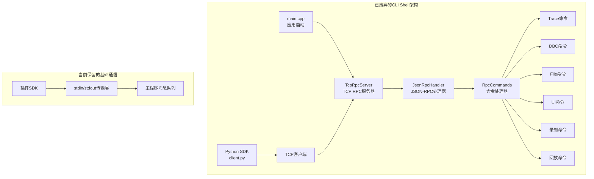

# CLI Shell系统（已废弃）

<cite>
**本文引用的文件**
- [src/main.cpp](file://src/main.cpp)
- [sdk/sin/_transport.py](file://sdk/sin/_transport.py)
- [sdk/sin/commands.py](file://sdk/sin/commands.py)
- [sdk/sin/__init__.py](file://sdk/sin/__init__.py)
- [docs_backup/SHELL.md](file://docs_backup/SHELL.md)
</cite>

## 更新摘要
**所做更改**
- 标记CLI Shell系统为已废弃功能，所有相关代码已从主程序移除
- 移除了TCP RPC服务器、JSON-RPC 2.0通信协议、命令行接口等所有核心组件
- 保留了SDK基础框架用于插件与主程序通信
- 将详细的技术文档移至docs_backup目录作为历史参考
- 更新了架构说明以反映当前仅保留stdin/stdout通信方式

## 目录
1. [状态说明](#状态说明)
2. [历史架构](#历史架构)
3. [当前实现](#当前实现)
4. [迁移指南](#迁移指南)
5. [历史技术文档](#历史技术文档)
6. [结论](#结论)

## 状态说明

**⚠️ 重要提示：CLI Shell系统已被完全移除**

根据最近的代码变更，OpenBUS的CLI Shell子系统（OAI-02）已被完全从项目中移除。以下功能不再可用：

- ❌ TCP RPC服务器（端口5555）
- ❌ JSON-RPC 2.0协议处理
- ❌ HTTP RPC服务器实现
- ❌ 命令行接口和命令处理器
- ❌ Python SDK客户端库

**当前状态：**
- ✅ 主程序不再启动RPC服务器
- ✅ src/core/shell目录已完全删除
- ✅ main.cpp中移除了所有RPC相关代码
- ⚠️ 仅保留基础的stdin/stdout通信框架

## 历史架构

### 原始设计目标
CLI Shell系统旨在为CAN总线分析引擎提供标准化的远程交互接口，支持：
- 自动化测试和脚本控制
- AI Agent集成和工作流自动化
- 跨语言的标准化API访问
- 完整的OpenBUS功能远程调用

### 技术架构概览


**图表来源**
- [docs_backup/SHELL.md:31-65](file://docs_backup/SHELL.md#L31-L65)
- [src/main.cpp:21-79](file://src/main.cpp#L21-L79)

### 核心组件（已移除）
- **TcpRpcServer**: 基于QTcpServer的JSON-RPC服务器，监听端口5555
- **JsonRpcHandler**: JSON-RPC 2.0处理器，维护方法注册表
- **RpcCommands**: 具体命令实现类，包含trace、dbc、file、ui、record、playback等模块
- **OpenBusClient**: Python客户端库，提供完整的API封装

## 当前实现

### 保留的SDK框架
虽然CLI Shell系统已被移除，但项目仍保留了基础的SDK通信框架：

#### stdin/stdout传输层
```python
# sdk/sin/_transport.py - 当前的传输实现
def send_notification(method, params=None):
    """发送通知（无需回复）"""
    _send_message({"jsonrpc": "2.0", "method": method, "params": params or {}})

def send_request(method, params=None, timeout=5.0):
    """发送请求并同步等待回复（阻塞，带超时）"""
    # 通过stdin/stdout进行进程间通信
```

#### 命令执行接口
```python
# sdk/sin/commands.py - 简化的命令接口
class _Commands:
    def execute(self, command_id, *args):
        """执行一个已注册的命令"""
        send_notification("executeCommand", {"id": command_id})
```

### 主程序集成变化
当前main.cpp中不再包含任何RPC服务器相关代码：

**移除的功能：**
- TcpRpcServer实例化
- RPC服务器启动和停止逻辑
- 端口配置和管理
- 连接处理和消息路由

**保留的功能：**
- 应用程序初始化
- 业务模块注册
- UI界面加载
- 日志系统管理

## 迁移指南

### 对于使用CLI Shell的用户
如果您之前依赖CLI Shell系统进行自动化或集成，建议采用以下替代方案：

#### 1. 直接使用Python SDK
```python
# 新的SDK使用方式
import sin

def activate(context):
    # 直接调用SDK API
    sin.output.append("插件已加载")
    context.on_frame(on_frame)
```

#### 2. 使用插件系统
利用OpenBUS的插件架构替代外部CLI工具：
- 开发自定义插件实现特定功能
- 通过信号槽机制与主程序交互
- 利用现有的DBC、Frame、Workspace等API

#### 3. 文件系统接口
对于批量数据处理任务：
- 使用支持的格式（BLF、ASC、CSV、PCAP、TRC）
- 通过文件导入导出功能
- 结合命令行参数进行批处理

### 开发新功能的建议
1. **优先使用现有SDK API**：避免重新实现CLI Shell功能
2. **利用插件架构**：扩展OpenBUS功能而非创建独立服务
3. **遵循标准协议**：如需要外部集成，考虑使用更通用的协议
4. **保持向后兼容**：确保新功能不影响现有用户工作流

## 历史技术文档

详细的CLI Shell技术规范和技术实现已移至备份目录：

### 可用的历史文档
- **SHELL.md**: 完整的CLI Shell规范v3.0
- **CLI-SHELL-Specification.md**: 详细的技术规格
- **CLI-SHELL-New-Design-V2.md**: 新版设计方案
- **OAI-02-OpenBUS-CLI-Shell-Protocol.md**: 协议规范文档

### 历史功能参考
这些文档记录了已移除功能的完整实现细节，包括：
- 完整的API参考手册
- 协议规范和消息格式
- 错误处理和异常管理
- 性能优化策略
- 安全考虑和最佳实践

## 结论

CLI Shell系统的移除标志着OpenBUS项目向更加简洁和专注的方向发展。虽然这减少了外部集成的灵活性，但简化了核心架构并提高了系统的稳定性。

**主要收益：**
- 减少代码复杂度和维护成本
- 消除潜在的安全风险
- 提高主程序的稳定性和性能
- 专注于核心的CAN总线分析功能

**后续发展方向：**
- 强化插件系统作为主要的扩展机制
- 改进Python SDK的功能完整性
- 提供更好的文档和示例
- 考虑未来可能的轻量级集成方案

对于需要外部集成的用户，建议充分利用现有的插件系统和SDK功能，或者考虑将OpenBUS作为库集成到更大的系统中。

**章节来源**
- [src/main.cpp:21-79](file://src/main.cpp#L21-L79)
- [sdk/sin/_transport.py:1-72](file://sdk/sin/_transport.py#L1-L72)
- [sdk/sin/commands.py:1-23](file://sdk/sin/commands.py#L1-L23)
- [sdk/sin/__init__.py:1-33](file://sdk/sin/__init__.py#L1-L33)
- [docs_backup/SHELL.md:1-200](file://docs_backup/SHELL.md#L1-L200)