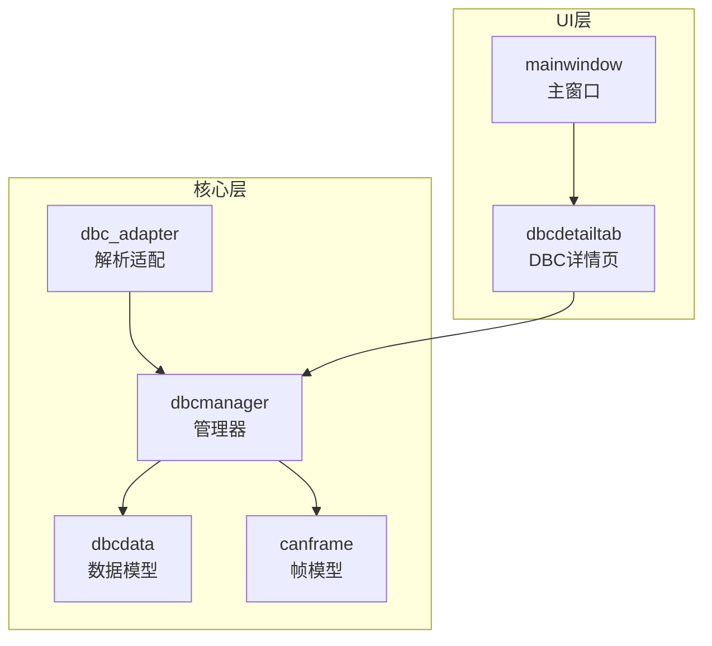
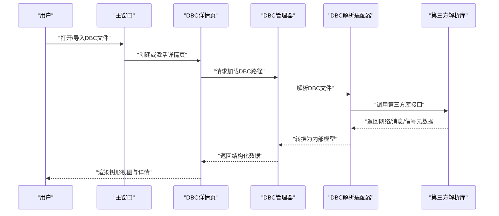
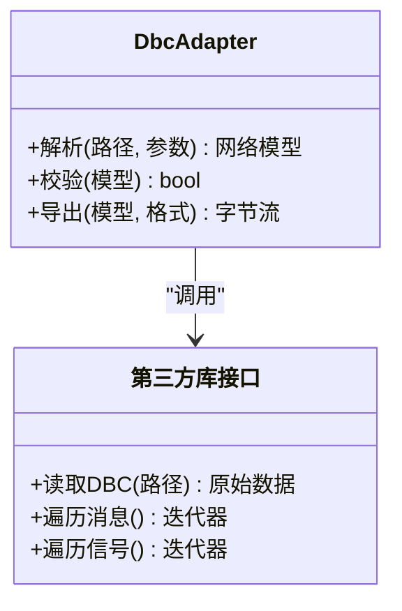
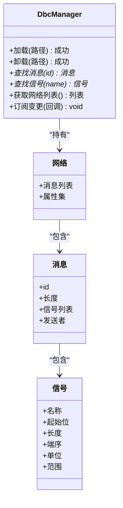
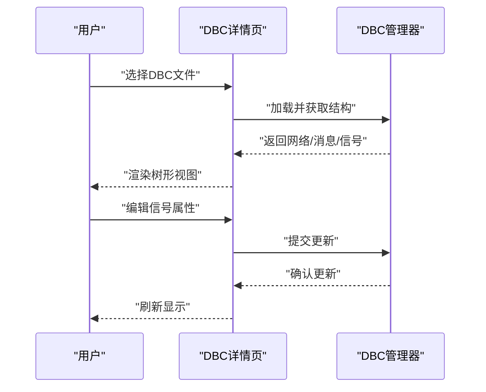
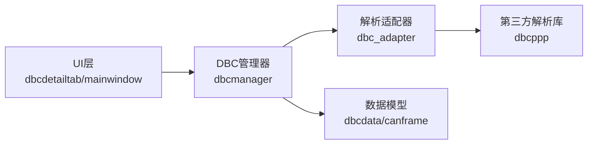

# DBC文件支持

<cite>
**本文引用的文件**   
- [dbc_adapter.h](file://src/core/dbc/dbc_adapter.h)
- [dbc_adapter.cpp](file://src/core/dbc/dbc_adapter.cpp)
- [dbcmanager.h](file://src/core/dbcmanager.h)
- [dbcmanager.cpp](file://src/core/dbcmanager.cpp)
- [dbcdata.h](file://src/core/dbcdata.h)
- [canframe.h](file://src/core/canframe.h)
- [mainwindow.h](file://src/ui/mainwindow.h)
- [dbcdetailtab.h](file://src/ui/dbcdetailtab.h)
- [dbcdetailtab.cpp](file://src/ui/dbcdetailtab.cpp)
- [CMakeLists.txt](file://src/CMakeLists.txt)
- [CMakeLists.txt](file://CMakeLists.txt)
</cite>

## 目录
1. [简介](#简介)
2. [项目结构](#项目结构)
3. [核心组件](#核心组件)
4. [架构总览](#架构总览)
5. [详细组件分析](#详细组件分析)
6. [依赖关系分析](#依赖关系分析)
7. [性能考虑](#性能考虑)
8. [故障排查指南](#故障排查指南)
9. [结论](#结论)
10. [附录](#附录)

## 简介
本文件围绕CAN总线仿真工程中的DBC文件支持进行系统化文档化，涵盖解析、建模、管理与UI展示等关键环节。目标是为开发者与使用者提供从架构到实现细节的完整说明，帮助快速理解并扩展DBC能力。

## 项目结构
与DBC相关的代码主要分布在以下模块：
- 核心层（core）：负责DBC文件的解析、数据模型构建与管理器调度
- UI层（ui）：提供DBC详情查看、信号配置等交互界面
- 构建系统（CMakeLists）：集成第三方库与编译选项

图表来源
- [dbc_adapter.h](file://src/core/dbc/dbc_adapter.h)
- [dbcmanager.h](file://src/core/dbcmanager.h)
- [dbcdata.h](file://src/core/dbcdata.h)
- [canframe.h](file://src/core/canframe.h)
- [mainwindow.h](file://src/ui/mainwindow.h)
- [dbcdetailtab.h](file://src/ui/dbcdetailtab.h)

章节来源
- [CMakeLists.txt](file://src/CMakeLists.txt)
- [CMakeLists.txt](file://CMakeLists.txt)

## 核心组件
- DBC解析适配器（dbc_adapter）：封装对第三方库的调用，完成DBC文件到内部模型的转换
- DBC管理器（dbcmanager）：维护多DBC实例、消息/信号索引、查询与事件分发
- 数据模型（dbcdata）：定义网络、消息、信号、属性等数据结构
- 帧模型（canframe）：统一CAN帧表示，便于与解析结果对接

章节来源
- [dbc_adapter.h](file://src/core/dbc/dbc_adapter.h)
- [dbc_adapter.cpp](file://src/core/dbc/dbc_adapter.cpp)
- [dbcmanager.h](file://src/core/dbcmanager.h)
- [dbcmanager.cpp](file://src/core/dbcmanager.cpp)
- [dbcdata.h](file://src/core/dbcdata.h)
- [canframe.h](file://src/core/canframe.h)

## 架构总览
下图展示了从“加载DBC”到“UI展示”的关键流程，以及核心对象之间的协作关系。

图表来源
- [dbc_adapter.cpp](file://src/core/dbc/dbc_adapter.cpp)
- [dbcmanager.cpp](file://src/core/dbcmanager.cpp)
- [dbcdetailtab.cpp](file://src/ui/dbcdetailtab.cpp)
- [mainwindow.h](file://src/ui/mainwindow.h)

## 详细组件分析

### DBC解析适配器（dbc_adapter）
职责
- 对外暴露统一的解析接口，屏蔽第三方库差异
- 将第三方库的节点、消息、信号、属性映射为内部数据模型
- 处理编码规则、字节序、单位换算等细节

关键设计
- 输入：DBC文件路径与可选参数
- 输出：网络拓扑与信号字典的结构化集合
- 错误：统一异常/错误码，向上抛出可诊断信息

图表来源
- [dbc_adapter.h](file://src/core/dbc/dbc_adapter.h)
- [dbc_adapter.cpp](file://src/core/dbc/dbc_adapter.cpp)

章节来源
- [dbc_adapter.h](file://src/core/dbc/dbc_adapter.h)
- [dbc_adapter.cpp](file://src/core/dbc/dbc_adapter.cpp)

### DBC管理器（dbcmanager）
职责
- 管理多个DBC实例的生命周期
- 维护消息ID到消息对象的索引、信号到消息的映射
- 提供按名称/ID查询、批量更新、事件通知

关键设计
- 单例或集中式注册表模式，保证全局一致性
- 增量更新策略，避免重复解析
- 线程安全访问控制（读多写少场景）

图表来源
- [dbcmanager.h](file://src/core/dbcmanager.h)
- [dbcmanager.cpp](file://src/core/dbcmanager.cpp)
- [dbcdata.h](file://src/core/dbcdata.h)

章节来源
- [dbcmanager.h](file://src/core/dbcmanager.h)
- [dbcmanager.cpp](file://src/core/dbcmanager.cpp)
- [dbcdata.h](file://src/core/dbcdata.h)

### 数据模型（dbcdata）
职责
- 定义网络、消息、信号、属性的标准结构
- 提供基础验证与序列化能力

复杂度与特性
- 线性查询通过索引优化至O(1)
- 大字典场景下采用哈希索引提升查找效率

章节来源
- [dbcdata.h](file://src/core/dbcdata.h)

### 帧模型（canframe）
职责
- 统一表示CAN帧（ID、DLC、数据域、时间戳等）
- 与DBC解析结果对接，用于回放、录制与分析

章节来源
- [canframe.h](file://src/core/canframe.h)

### UI展示（dbcdetailtab / mainwindow）
职责
- 以树形视图展示网络/消息/信号层级
- 提供信号字段编辑、单位/范围校验提示
- 与DBC管理器联动，实时刷新

交互流程
- 主窗口触发加载动作
- 详情页调用管理器获取数据
- 渲染并响应用户编辑操作

图表来源
- [dbcdetailtab.cpp](file://src/ui/dbcdetailtab.cpp)
- [dbcdetailtab.h](file://src/ui/dbcdetailtab.h)
- [mainwindow.h](file://src/ui/mainwindow.h)

章节来源
- [dbcdetailtab.h](file://src/ui/dbcdetailtab.h)
- [dbcdetailtab.cpp](file://src/ui/dbcdetailtab.cpp)
- [mainwindow.h](file://src/ui/mainwindow.h)

## 依赖关系分析
- 外部依赖：第三方DBC解析库（位于third_party/dbcppp或dbcppp_src）
- 内部依赖：UI层依赖管理器；管理器依赖解析适配器与数据模型
- 构建依赖：CMakeLists中需正确链接第三方库与Qt模块

图表来源
- [CMakeLists.txt](file://src/CMakeLists.txt)
- [CMakeLists.txt](file://CMakeLists.txt)
- [dbcmanager.h](file://src/core/dbcmanager.h)
- [dbc_adapter.h](file://src/core/dbc/dbc_adapter.h)
- [dbcdetailtab.h](file://src/ui/dbcdetailtab.h)
- [mainwindow.h](file://src/ui/mainwindow.h)

章节来源
- [CMakeLists.txt](file://src/CMakeLists.txt)
- [CMakeLists.txt](file://CMakeLists.txt)

## 性能考虑
- 解析阶段：建议缓存已解析的DBC，避免重复IO与解析开销
- 索引策略：消息ID与信号名建立哈希索引，降低查询复杂度
- UI渲染：大文件时采用懒加载与分页渲染，减少首屏延迟
- 并发访问：读多写少场景使用读写锁保护共享状态

[本节为通用指导，不直接分析具体文件]

## 故障排查指南
常见问题与定位要点
- 无法加载DBC：检查文件路径、权限与第三方库版本兼容性
- 信号解析异常：核对端序、起始位与长度是否越界
- UI无响应：确认管理器未阻塞在主线程，必要时异步加载
- 内存占用过高：检查是否存在循环引用或未释放的临时对象

章节来源
- [dbc_adapter.cpp](file://src/core/dbc/dbc_adapter.cpp)
- [dbcmanager.cpp](file://src/core/dbcmanager.cpp)
- [dbcdetailtab.cpp](file://src/ui/dbcdetailtab.cpp)

## 结论
本项目通过清晰的层次划分与职责分离，实现了完整的DBC文件支持：从解析适配、模型构建、统一管理到UI展示。建议在后续迭代中强化缓存机制、完善错误诊断与性能监控，以提升用户体验与系统稳定性。

[本节为总结性内容，不直接分析具体文件]

## 附录
- 术语
  - DBC：CAN数据库描述文件，定义网络、消息、信号及属性
  - 帧：CAN总线传输的基本单元，包含ID、数据长度与数据域
- 参考
  - 第三方库：dbcppp（DBC解析）
  - Qt框架：UI与事件循环

[本节为补充信息，不直接分析具体文件]