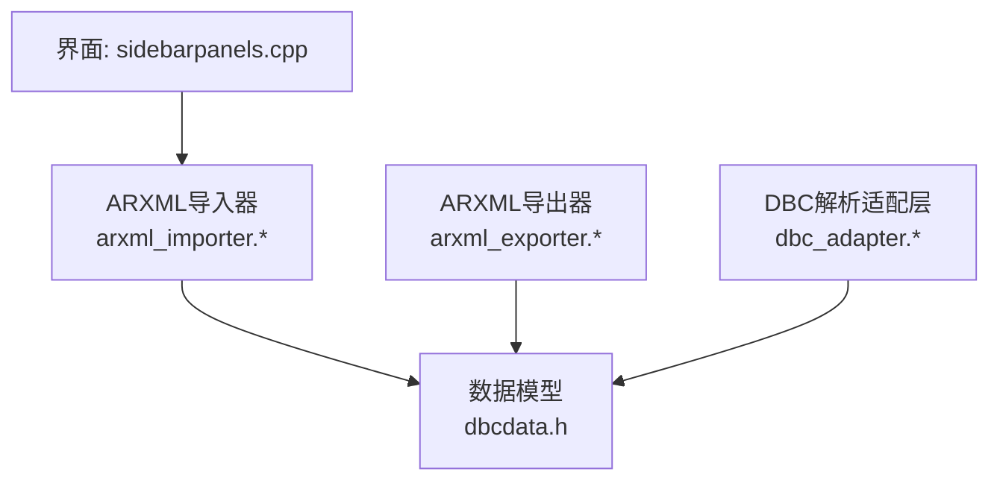
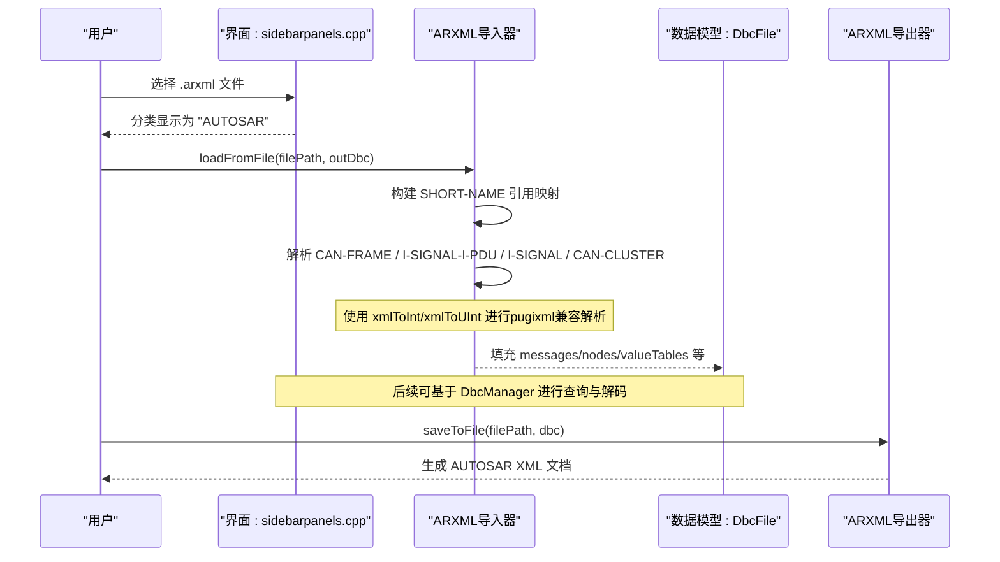
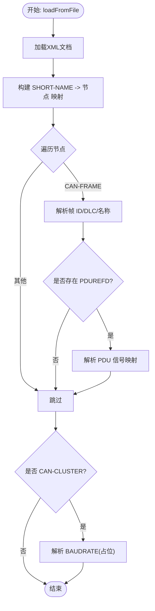
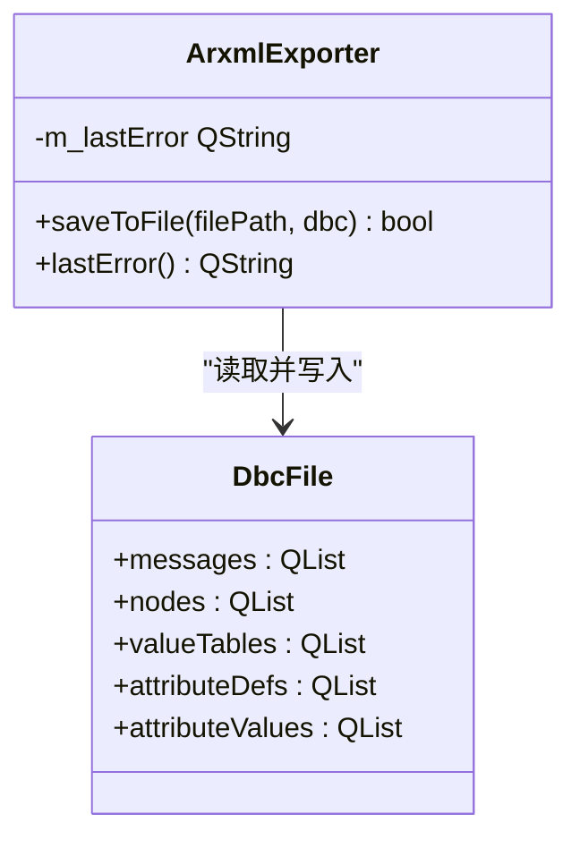
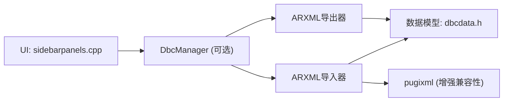

# ARXML支持

<cite>
**本文引用的文件**
- [arxml_importer.h](file://src/core/dbc/arxml_importer.h)
- [arxml_importer.cpp](file://src/core/dbc/arxml_importer.cpp)
- [arxml_exporter.h](file://src/core/dbc/arxml_exporter.h)
- [arxml_exporter.cpp](file://src/core/dbc/arxml_exporter.cpp)
- [dbcdata.h](file://src/core/dbcdata.h)
- [dbc_adapter.h](file://src/core/dbc/dbc_adapter.h)
- [dbc_adapter.cpp](file://src/core/dbc/dbc_adapter.cpp)
- [dbcmanager.h](file://src/core/dbcmanager.h)
- [sidebarpanels.cpp](file://src/ui/panels/sidebarpanels.cpp)
</cite>

## 更新摘要
**所做更改**
- 增强了ARXML导入器的pugixml兼容性，添加了xmlToInt()和xmlToUInt()辅助函数
- 改进了ARXML文件解析的健壮性，支持不同版本的pugixml实现
- 更新了相关章节以反映新的兼容性改进

## 目录
1. [简介](#简介)
2. [项目结构](#项目结构)
3. [核心组件](#核心组件)
4. [架构总览](#架构总览)
5. [详细组件分析](#详细组件分析)
6. [依赖关系分析](#依赖关系分析)
7. [性能考虑](#性能考虑)
8. [故障排查指南](#故障排查指南)
9. [结论](#结论)
10. [附录](#附录)

## 简介
本仓库为一款CAN/CANFD工具，提供对AUTOSAR ARXML格式的导入与导出能力。通过解析ARXML中的I-SIGNAL、I-SIGNAL-I-PDU、CAN-FRAME、CAN-CLUSTER等元素，将AUTOSAR通信描述转换为内部统一的DbcFile模型；同时可将该模型导出为标准ARXML结构，便于在AUTOSAR生态中复用。UI层已集成ARXML文件类型识别与导入入口，形成从"选择文件→解析→展示"的完整链路。

**更新** 最近增强了ARXML导入器对pugixml库的兼容性支持，通过添加专用的XML数值解析辅助函数，确保在不同pugixml版本间的稳定运行。

## 项目结构
围绕ARXML支持的关键代码位于core/dbc与ui/panels：
- core/dbc：实现ARXML导入器与导出器，以及DBC解析适配层与数据模型
- ui/panels：提供ARXML文件类型识别与导入对话框入口
- 数据模型：统一使用DbcFile/DbcMessage/DbcSignal等结构承载解析结果

**图表来源**
- [sidebarpanels.cpp:470-508](file://src/ui/panels/sidebarpanels.cpp#L470-L508)
- [arxml_importer.cpp:29-115](file://src/core/dbc/arxml_importer.cpp#L29-L115)
- [arxml_exporter.cpp:10-84](file://src/core/dbc/arxml_exporter.cpp#L10-L84)
- [dbc_adapter.cpp:169-519](file://src/core/dbc/dbc_adapter.cpp#L169-L519)
- [dbcdata.h:174-230](file://src/core/dbcdata.h#L174-L230)

**章节来源**
- [sidebarpanels.cpp:470-508](file://src/ui/panels/sidebarpanels.cpp#L470-L508)
- [arxml_importer.h:20-48](file://src/core/dbc/arxml_importer.h#L20-L48)
- [arxml_importer.cpp:29-115](file://src/core/dbc/arxml_importer.cpp#L29-L115)
- [arxml_exporter.h:26-37](file://src/core/dbc/arxml_exporter.h#L26-L37)
- [arxml_exporter.cpp:10-84](file://src/core/dbc/arxml_exporter.cpp#L10-L84)
- [dbcdata.h:174-230](file://src/core/dbcdata.h#L174-L230)

## 核心组件
- ARXML导入器（ArxmlImporter）
  - 负责加载ARXML文件，构建SHORT-NAME到节点的引用映射，遍历并解析CAN-FRAME、I-SIGNAL-I-PDU、I-SIGNAL、CAN-CLUSTER等元素，填充DbcFile
  - **新增** 包含pugixml兼容性辅助函数xmlToInt()和xmlToUInt()，确保在不同pugixml版本间的一致行为
- ARXML导出器（ArxmlExporter）
  - 将DbcFile写回标准ARXML结构，包含I-SIGNAL、I-SIGNAL-I-PDU、CAN-FRAME、CAN-CLUSTER等节点
- DBC解析适配层（dbc::parse/postProcess）
  - 提供与ARXML共享的DbcFile模型，确保两种格式的数据结构一致
- 数据模型（DbcFile/DbcMessage/DbcSignal等）
  - 统一表示报文、信号、节点、属性、值表等元信息
- UI集成（sidebarpanels）
  - 识别.arxml扩展名，归类至"AUTOSAR"，并提供导入入口

**章节来源**
- [arxml_importer.h:20-48](file://src/core/dbc/arxml_importer.h#L20-L48)
- [arxml_importer.cpp:9-23](file://src/core/dbc/arxml_importer.cpp#L9-L23)
- [arxml_importer.cpp:29-115](file://src/core/dbc/arxml_importer.cpp#L29-L115)
- [arxml_exporter.h:26-37](file://src/core/dbc/arxml_exporter.h#L26-L37)
- [arxml_exporter.cpp:10-84](file://src/core/dbc/arxml_exporter.cpp#L10-L84)
- [dbc_adapter.h:16-24](file://src/core/dbc/dbc_adapter.h#L16-L24)
- [dbc_adapter.cpp:169-519](file://src/core/dbc/dbc_adapter.cpp#L169-L519)
- [dbcdata.h:174-230](file://src/core/dbcdata.h#L174-L230)
- [sidebarpanels.cpp:470-508](file://src/ui/panels/sidebarpanels.cpp#L470-L508)

## 架构总览
ARXML支持与现有DBC解析共用同一数据模型，从而在导入/导出之间保持语义一致性。UI层根据扩展名识别ARXML并进入相应处理流程。

**图表来源**
- [sidebarpanels.cpp:470-508](file://src/ui/panels/sidebarpanels.cpp#L470-L508)
- [arxml_importer.cpp:29-115](file://src/core/dbc/arxml_importer.cpp#L29-L115)
- [arxml_exporter.cpp:10-84](file://src/core/dbc/arxml_exporter.cpp#L10-L84)
- [dbcdata.h:174-230](file://src/core/dbcdata.h#L174-L230)

## 详细组件分析

### ARXML导入器（ArxmlImporter）
- 功能要点
  - 加载ARXML，构建SHORT-NAME到节点的映射，用于跨元素引用解析
  - 解析CAN-FRAME获取ID/DLC/名称
  - 解析I-SIGNAL-I-PDU获取信号位布局与长度
  - 解析I-SIGNAL获取信号基础定义（名称、长度、起始位）
  - 解析CAN-CLUSTER（当前仅读取BAUDRATE占位）
- **新增** pugixml兼容性增强
  - 添加了`xmlToInt()`辅助函数：安全地从XML节点文本内容解析为整数，支持空值和默认值处理
  - 添加了`xmlToUInt()`辅助函数：安全地从XML节点文本内容解析为无符号整数，支持空值和默认值处理
  - 这两个函数提供了对不同pugixml版本实现的兼容性，特别是stub版本的const char* text()方法
- 复杂度与行为
  - 构建引用映射：O(N)遍历所有节点
  - 解析帧与PDU：按消息数量线性扫描
  - 错误处理：文件加载失败时设置lastError并返回false
- 关键路径
  - loadFromFile → parseCanFrame → parsePdu → parseISignal → parseCanCluster

**图表来源**
- [arxml_importer.cpp:29-115](file://src/core/dbc/arxml_importer.cpp#L29-L115)
- [arxml_importer.cpp:118-231](file://src/core/dbc/arxml_importer.cpp#L118-L231)

**章节来源**
- [arxml_importer.h:20-48](file://src/core/dbc/arxml_importer.h#L20-L48)
- [arxml_importer.cpp:9-23](file://src/core/dbc/arxml_importer.cpp#L9-L23)
- [arxml_importer.cpp:29-115](file://src/core/dbc/arxml_importer.cpp#L29-L115)
- [arxml_importer.cpp:118-231](file://src/core/dbc/arxml_importer.cpp#L118-L231)

### ARXML导出器（ArxmlExporter）
- 功能要点
  - 输出标准ARXML根节点与命名空间
  - 遍历DbcFile.messages，输出I-SIGNAL、I-SIGNAL-I-PDU、CAN-FRAME、CAN-CLUSTER
  - 默认小端序与基本单位/因子
- 输出结构
  - <AUTOSAR><AR-PACKAGES><AR-PACKAGE><ELEMENTS>...
- 错误处理
  - 文件打开失败时设置lastError并返回false

**图表来源**
- [arxml_exporter.h:26-37](file://src/core/dbc/arxml_exporter.h#L26-L37)
- [arxml_exporter.cpp:10-84](file://src/core/dbc/arxml_exporter.cpp#L10-L84)
- [dbcdata.h:174-230](file://src/core/dbcdata.h#L174-L230)

**章节来源**
- [arxml_exporter.h:26-37](file://src/core/dbc/arxml_exporter.h#L26-L37)
- [arxml_exporter.cpp:10-84](file://src/core/dbc/arxml_exporter.cpp#L10-L84)

### 数据模型（DbcFile/DbcMessage/DbcSignal）
- 设计目标
  - 抽象出与具体文件格式无关的通信描述模型
  - 支持信号编码/解码、值表查找、属性关联等通用操作
- 关键成员
  - DbcFile：文件级容器，维护messages/nodes/valueTables/attributes
  - DbcMessage：报文级，id/name/dlc/sender/signalList等
  - DbcSignal：信号级，位域、字节序、缩放、范围、单位、值表等
- 复杂度
  - 查找信号/报文：线性或哈希索引（由上层管理器优化）

**章节来源**
- [dbcdata.h:17-230](file://src/core/dbcdata.h#L17-L230)

### DBC解析适配层（作为对比与复用）
- 作用
  - 将DBC文本解析为DbcFile，覆盖VERSION/NS_/BS_/BU_/BO_/SG_/CM_/BA_DEF_/BA_DEF_DEF_/BA_/VAL_/VAL_TABLE_/SIG_VALTYPE_/BO_TX_BU_等
  - postProcess完成发送/接收关系与属性应用
- 与ARXML的关系
  - 两者均产出相同的DbcFile，保证后续UI与业务逻辑的统一性

**章节来源**
- [dbc_adapter.h:16-24](file://src/core/dbc/dbc_adapter.h#L16-L24)
- [dbc_adapter.cpp:169-519](file://src/core/dbc/dbc_adapter.cpp#L169-L519)
- [dbc_adapter.cpp:526-567](file://src/core/dbc/dbc_adapter.cpp#L526-L567)

### UI集成（ARXML导入入口）
- 功能要点
  - 根据扩展名识别ARXML并归类为"AUTOSAR"
  - 提供文件选择对话框，支持ARXML过滤
  - 将ARXML加入本地列表，供后续处理
- 注意
  - 当前UI层仅做识别与入队，实际解析调用点需结合上层管理器（例如DbcManager）扩展

**章节来源**
- [sidebarpanels.cpp:470-508](file://src/ui/panels/sidebarpanels.cpp#L470-L508)

## 依赖关系分析
- 模块耦合
  - 导入器/导出器强依赖数据模型（DbcFile/DbcMessage/DbcSignal）
  - UI层弱依赖导入器（通过上层管理器桥接）
  - DBC适配层与ARXML导入器解耦，但共享同一模型
- 外部依赖
  - pugixml用于ARXML解析，现已增强兼容性支持
  - Qt用于文件IO、字符串、XML文本流输出

**图表来源**
- [sidebarpanels.cpp:470-508](file://src/ui/panels/sidebarpanels.cpp#L470-L508)
- [arxml_importer.cpp:1-7](file://src/core/dbc/arxml_importer.cpp#L1-L7)
- [arxml_exporter.cpp:1-4](file://src/core/dbc/arxml_exporter.cpp#L1-L4)
- [dbcdata.h:174-230](file://src/core/dbcdata.h#L174-L230)

**章节来源**
- [arxml_importer.cpp:1-7](file://src/core/dbc/arxml_importer.cpp#L1-L7)
- [arxml_exporter.cpp:1-4](file://src/core/dbc/arxml_exporter.cpp#L1-L4)
- [dbcdata.h:174-230](file://src/core/dbcdata.h#L174-L230)

## 性能考虑
- ARXML导入
  - 构建SHORT-NAME映射为一次全量遍历，时间复杂度O(N)
  - 解析阶段按消息数量线性扫描，整体近似O(N+M)，N为节点数，M为消息数
  - **新增** pugixml兼容性解析函数避免了多次类型转换开销
- ARXML导出
  - 顺序写入，时间复杂度O(M+S)，M为消息数，S为信号总数
- 内存占用
  - 主要取决于DbcFile中messages/signalList规模，建议在大文件场景下分页或增量处理
- 可扩展优化
  - 对大型ARXML可使用流式解析或分块处理
  - 对频繁查找场景可在DbcManager中建立更多索引（如按名称、按节点）

## 故障排查指南
- 导入失败
  - 现象：loadFromFile返回false，lastError提示无法加载文件
  - 排查：确认文件路径有效、编码UTF-8、XML根节点包含AUTOSAR或兼容结构
- 解析不完整
  - 现象：消息存在但无信号或DLC异常
  - 排查：检查ARXML中I-SIGNAL-I-PDU与I-SIGNAL是否匹配，PDUREFD是否正确引用
  - **新增** 验证pugixml兼容性函数是否正确处理空值和默认值
- 导出为空或字段缺失
  - 现象：生成的ARXML缺少BIT-POSITION或LENGTH
  - 排查：确认DbcFile中对应字段已正确填充；检查导出逻辑分支
- UI未识别ARXML
  - 现象：导入对话框未列出ARXML或分类不正确
  - 排查：确认扩展名为.arxml且categoryForFile能返回"AUTOSAR"
- **新增** pugixml兼容性问题
  - 现象：在不同pugixml版本间出现解析不一致
  - 排查：确认xmlToInt()和xmlToUInt()函数正确处理了不同版本的text()方法返回值

**章节来源**
- [arxml_importer.cpp:29-35](file://src/core/dbc/arxml_importer.cpp#L29-L35)
- [arxml_importer.cpp:83-115](file://src/core/dbc/arxml_importer.cpp#L83-L115)
- [arxml_importer.cpp:9-23](file://src/core/dbc/arxml_importer.cpp#L9-L23)
- [arxml_exporter.cpp:10-23](file://src/core/dbc/arxml_exporter.cpp#L10-L23)
- [sidebarpanels.cpp:470-508](file://src/ui/panels/sidebarpanels.cpp#L470-L508)

## 结论
本项目实现了ARXML的导入与导出能力，并通过统一的DbcFile模型与现有DBC解析体系无缝衔接。**最新更新**增强了ARXML导入器对pugixml库的兼容性支持，通过添加专用的XML数值解析辅助函数（xmlToInt()和xmlToUInt()），确保在不同pugixml版本间的稳定运行。当前实现覆盖了AUTOSAR ARXML的核心元素（I-SIGNAL、I-SIGNAL-I-PDU、CAN-FRAME、CAN-CLUSTER），并在UI层提供了ARXML文件识别与导入入口。后续可进一步增强：更完善的属性映射、多通道/多集群支持、更严格的ARXML校验与错误恢复、以及通过DbcManager集成ARXML文件的加载与查询。

## 附录
- 支持的ARXML元素
  - I-SIGNAL：信号定义（name、length、bitPosition）
  - I-SIGNAL-I-PDU：PDU内信号布局（signal-to-bit mapping）
  - CAN-FRAME：帧定义（id、length、pduRef）
  - CAN-CLUSTER：总线集群（channel、baudrate）
- **新增** pugixml兼容性特性
  - xmlToInt()：安全的整数解析，支持空值和默认值
  - xmlToUInt()：安全的无符号整数解析，支持空值和默认值
  - 兼容不同pugixml版本的text()方法实现
- 典型工作流
  - 选择ARXML → 解析为DbcFile → 通过DbcManager查询/解码 → 导出为ARXML