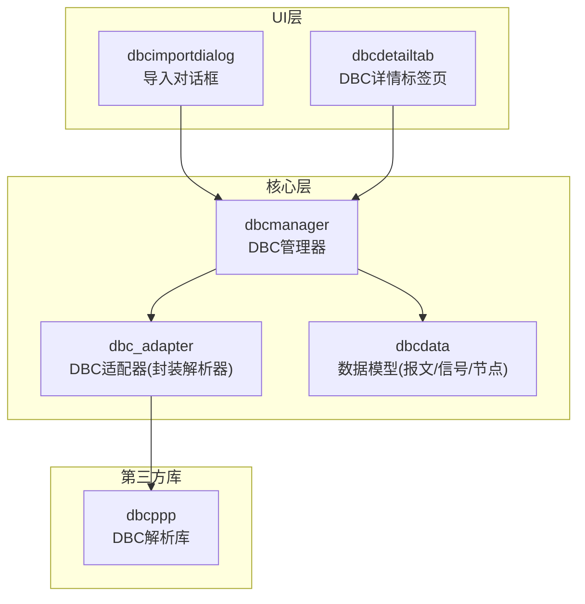
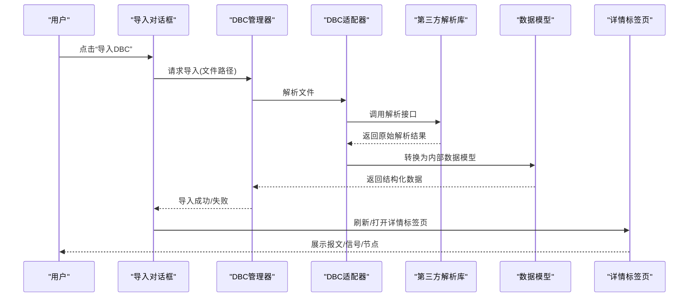
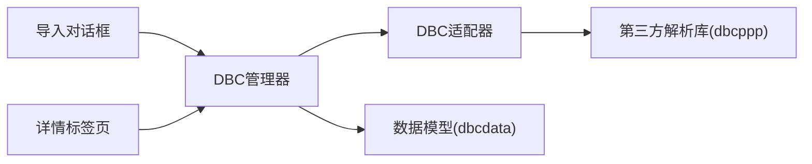

# DBC导入功能

<cite>
**本文档引用的文件**
- [dbc_adapter.h](file://src/core/dbc/dbc_adapter.h)
- [dbc_adapter.cpp](file://src/core/dbc/dbc_adapter.cpp)
- [dbcmanager.h](file://src/core/dbcmanager.h)
- [dbcmanager.cpp](file://src/core/dbcmanager.cpp)
- [dbcimportdialog.h](file://src/ui/dbcimportdialog.h)
- [dbcimportdialog.cpp](file://src/ui/dbcimportdialog.cpp)
- [dbcdetailtab.h](file://src/ui/dbcdetailtab.h)
- [dbcdetailtab.cpp](file://src/ui/dbcdetailtab.cpp)
- [dbcdata.h](file://src/core/dbcdata.h)
- [main.cpp](file://src/main.cpp)
- [CMakeLists.txt](file://CMakeLists.txt)
</cite>

## 目录
1. [简介](#简介)
2. [项目结构](#项目结构)
3. [核心组件](#核心组件)
4. [架构总览](#架构总览)
5. [详细组件分析](#详细组件分析)
6. [依赖关系分析](#依赖关系分析)
7. [性能考虑](#性能考虑)
8. [故障排查指南](#故障排查指南)
9. [结论](#结论)
10. [附录](#附录)

## 简介
本文件围绕“DBC导入功能”进行系统化文档化，涵盖从用户界面触发、解析器集成、数据模型构建到UI展示与管理的完整流程。重点说明：
- 用户如何通过对话框选择并导入DBC文件
- 解析层如何调用第三方库解析DBC
- 内存中的数据结构如何组织（报文、信号、节点等）
- UI侧如何呈现导入结果并提供详情查看
- 错误处理、异常路径与可观测性

## 项目结构
与DBC导入相关的代码主要分布在以下模块：
- 核心解析与数据模型：src/core/dbc、src/core/dbcmanager.h/.cpp、src/core/dbcdata.h
- 用户界面交互：src/ui/dbcimportdialog.*、src/ui/dbcdetailtab.*
- 应用入口与构建配置：src/main.cpp、CMakeLists.txt

图表来源
- [dbcimportdialog.h](file://src/ui/dbcimportdialog.h)
- [dbcdetailtab.h](file://src/ui/dbcdetailtab.h)
- [dbcmanager.h](file://src/core/dbcmanager.h)
- [dbc_adapter.h](file://src/core/dbc/dbc_adapter.h)
- [dbcdata.h](file://src/core/dbcdata.h)

章节来源
- [main.cpp](file://src/main.cpp)
- [CMakeLists.txt](file://CMakeLists.txt)

## 核心组件
- DBC导入对话框（UI）：负责文件选择、进度提示、错误回显，并触发导入流程。
- DBC管理器（Core）：协调解析、加载、缓存与查询；对外提供统一的导入接口。
- DBC适配器（Core）：封装第三方解析库的调用，屏蔽差异，暴露稳定的API。
- 数据模型（Core）：定义报文、信号、节点、网络属性等结构，支撑上层展示与分析。
- DBC详情标签页（UI）：以表格/树形视图展示报文、信号、节点及属性信息。

章节来源
- [dbcimportdialog.h](file://src/ui/dbcimportdialog.h)
- [dbcimportdialog.cpp](file://src/ui/dbcimportdialog.cpp)
- [dbcmanager.h](file://src/core/dbcmanager.h)
- [dbcmanager.cpp](file://src/core/dbcmanager.cpp)
- [dbc_adapter.h](file://src/core/dbc/dbc_adapter.h)
- [dbc_adapter.cpp](file://src/core/dbc/dbc_adapter.cpp)
- [dbcdata.h](file://src/core/dbcdata.h)
- [dbcdetailtab.h](file://src/ui/dbcdetailtab.h)
- [dbcdetailtab.cpp](file://src/ui/dbcdetailtab.cpp)

## 架构总览
下图展示了从用户操作到数据落盘的端到端流程，以及各组件间的职责边界。

图表来源
- [dbcimportdialog.cpp](file://src/ui/dbcimportdialog.cpp)
- [dbcmanager.cpp](file://src/core/dbcmanager.cpp)
- [dbc_adapter.cpp](file://src/core/dbc/dbc_adapter.cpp)
- [dbcdata.h](file://src/core/dbcdata.h)
- [dbcdetailtab.cpp](file://src/ui/dbcdetailtab.cpp)

## 详细组件分析

### DBC导入对话框（UI）
- 职责
  - 提供文件选择器，支持多文件/过滤扩展名
  - 显示导入进度与状态
  - 捕获并展示错误信息（如文件格式不正确、权限问题）
  - 成功后通知主界面或详情标签页刷新
- 关键交互
  - 用户触发导入 -> 调用管理器导入接口 -> 回调更新UI
- 典型异常路径
  - 文件不存在/不可读
  - 解析失败（语法错误、版本不兼容）
  - 内存不足或过大文件导致超时

章节来源
- [dbcimportdialog.h](file://src/ui/dbcimportdialog.h)
- [dbcimportdialog.cpp](file://src/ui/dbcimportdialog.cpp)

### DBC管理器（Core）
- 职责
  - 管理DBC生命周期（加载、缓存、释放）
  - 对外暴露统一导入接口，屏蔽底层解析细节
  - 提供查询能力（按名称/ID查找报文、信号、节点）
  - 维护导入统计与日志
- 设计要点
  - 线程安全：导入过程可能耗时，需避免阻塞UI线程
  - 资源管理：及时释放解析中间态与大型对象
  - 可扩展：预留插件式解析器接入点

章节来源
- [dbcmanager.h](file://src/core/dbcmanager.h)
- [dbcmanager.cpp](file://src/core/dbcmanager.cpp)

### DBC适配器（Core）
- 职责
  - 封装第三方解析库（如dbcppp）的调用
  - 将解析结果映射为内部数据模型
  - 统一错误码与异常转换
- 关键点
  - 解析器版本适配与兼容性检查
  - 大文件分块解析或流式处理（若适用）
  - 日志埋点便于定位解析瓶颈

章节来源
- [dbc_adapter.h](file://src/core/dbc/dbc_adapter.h)
- [dbc_adapter.cpp](file://src/core/dbc/dbc_adapter.cpp)

### 数据模型（Core）
- 职责
  - 定义报文、信号、节点、属性、注释等实体
  - 提供序列化/反序列化的基础结构
  - 支撑UI展示与后续分析（如过滤、统计）
- 复杂度考量
  - 报文-信号层级关系清晰，便于树形展示
  - 属性键值对灵活扩展，支持厂商自定义字段

章节来源
- [dbcdata.h](file://src/core/dbcdata.h)

### DBC详情标签页（UI）
- 职责
  - 以表格/树形视图展示报文列表、信号列表、节点信息
  - 支持搜索、排序、筛选
  - 联动选中项高亮与详情面板
- 交互要点
  - 懒加载大数据集，避免卡顿
  - 增量刷新，提升用户体验

章节来源
- [dbcdetailtab.h](file://src/ui/dbcdetailtab.h)
- [dbcdetailtab.cpp](file://src/ui/dbcdetailtab.cpp)

## 依赖关系分析
- 外部依赖
  - dbcppp：用于解析DBC文件，提供报文/信号/节点等原始数据
- 内部依赖
  - 导入对话框依赖管理器接口
  - 管理器依赖适配器与数据模型
  - 详情标签页依赖管理器提供的查询接口

图表来源
- [dbcimportdialog.h](file://src/ui/dbcimportdialog.h)
- [dbcmanager.h](file://src/core/dbcmanager.h)
- [dbc_adapter.h](file://src/core/dbc/dbc_adapter.h)
- [dbcdata.h](file://src/core/dbcdata.h)
- [dbcdetailtab.h](file://src/ui/dbcdetailtab.h)

章节来源
- [CMakeLists.txt](file://CMakeLists.txt)

## 性能考虑
- 解析阶段
  - 大文件建议采用流式解析，降低峰值内存占用
  - 预分配容器容量，减少动态扩容开销
- 数据模型
  - 使用轻量级结构体，避免不必要的拷贝
  - 按需加载详情，避免一次性构建全部视图
- UI渲染
  - 虚拟滚动/分页加载，保证流畅度
  - 异步导入与进度反馈，避免阻塞主线程

[本节为通用指导，不直接分析具体文件]

## 故障排查指南
- 常见问题
  - 无法读取文件：检查路径、权限与编码
  - 解析失败：确认DBC版本与语法正确性
  - 导入后无数据：核对适配器映射逻辑与字段命名
- 定位手段
  - 启用详细日志，记录解析步骤与异常堆栈
  - 通过详情标签页验证数据完整性
  - 使用最小复现用例隔离问题

章节来源
- [dbc_adapter.cpp](file://src/core/dbc/dbc_adapter.cpp)
- [dbcmanager.cpp](file://src/core/dbcmanager.cpp)
- [dbcimportdialog.cpp](file://src/ui/dbcimportdialog.cpp)

## 结论
DBC导入功能通过清晰的UI-Core分层与适配器模式，实现了与第三方解析库的解耦，提供了稳定、可扩展的导入能力。建议在后续迭代中加强流式解析、错误诊断与性能监控，以提升大文件场景下的稳定性与体验。

[本节为总结性内容，不直接分析具体文件]

## 附录
- 术语
  - DBC：CAN数据库描述文件，包含报文、信号、节点等定义
  - dbcppp：开源的DBC解析库
- 相关入口
  - 应用启动入口：src/main.cpp
  - 构建配置：CMakeLists.txt

章节来源
- [main.cpp](file://src/main.cpp)
- [CMakeLists.txt](file://CMakeLists.txt)