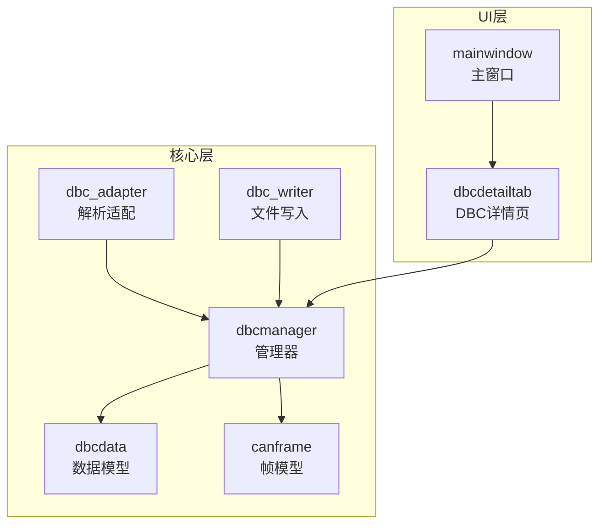
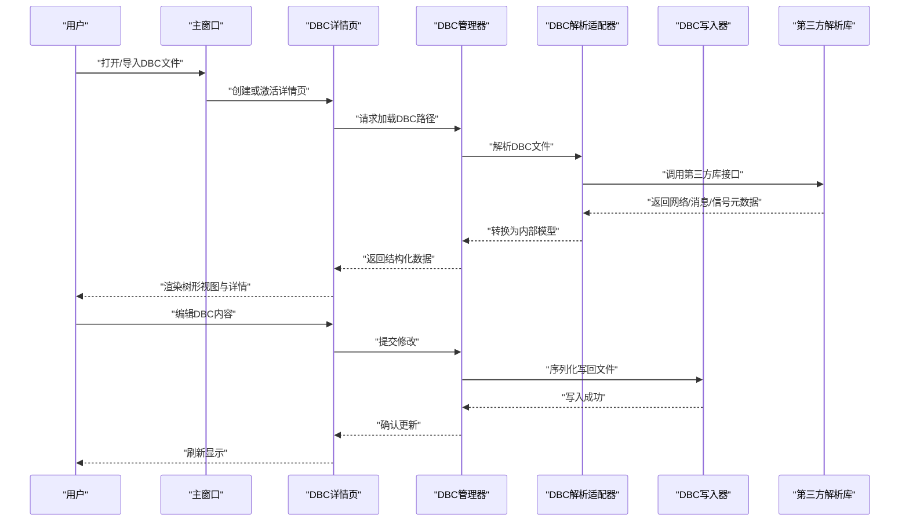
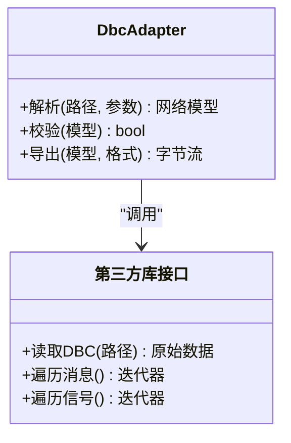
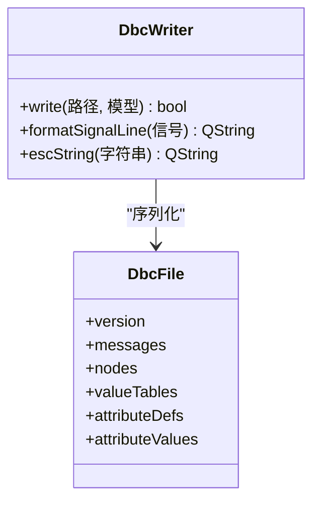
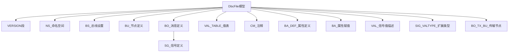
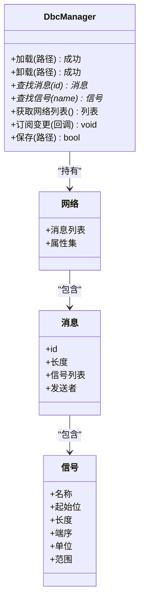
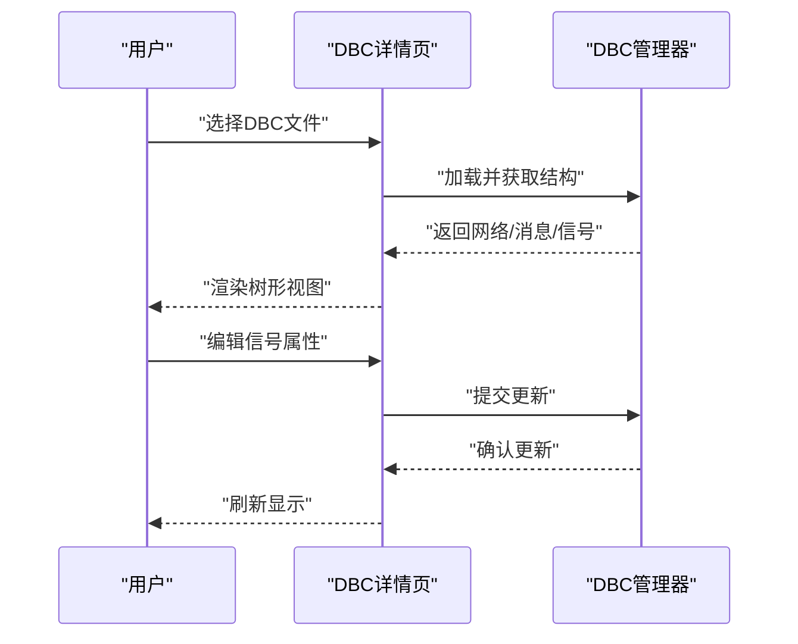
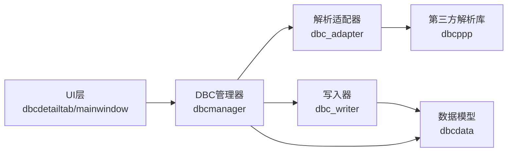

# DBC文件支持

<cite>
**本文引用的文件**   
- [dbc_adapter.h](file://src/core/dbc/dbc_adapter.h)
- [dbc_adapter.cpp](file://src/core/dbc/dbc_adapter.cpp)
- [dbc_writer.h](file://src/core/dbc/dbc_writer.h)
- [dbc_writer.cpp](file://src/core/dbc/dbc_writer.cpp)
- [dbcmanager.h](file://src/core/dbcmanager.h)
- [dbcmanager.cpp](file://src/core/dbcmanager.cpp)
- [dbcdata.h](file://src/core/dbcdata.h)
- [canframe.h](file://src/core/canframe.h)
- [mainwindow.h](file://src/ui/mainwindow.h)
- [dbcdetailtab.h](file://src/ui/dbcdetailtab.h)
- [dbcdetailtab.cpp](file://src/ui/dbcdetailtab.cpp)
- [CMakeLists.txt](file://src/CMakeLists.txt)
- [CMakeLists.txt](file://CMakeLists.txt)
</cite>

## 更新摘要
**所做更改**   
- 新增了完整的DBC文件写入功能模块，提供结构化DBC文件生成能力
- 更新了架构总览，体现读写双向支持的完整体系
- 完善了组件分析，新增DBC写入器详细说明
- 增强了依赖关系分析，包含新的写入模块
- 更新了故障排查指南，涵盖写入功能的常见问题

## 目录
1. [简介](#简介)
2. [项目结构](#项目结构)
3. [核心组件](#核心组件)
4. [架构总览](#架构总览)
5. [详细组件分析](#详细组件分析)
6. [依赖关系分析](#依赖关系分析)
7. [性能考虑](#性能考虑)
8. [故障排查指南](#故障排查指南)
9. [结论](#结论)
10. [附录](#附录)

## 简介
本文件围绕CAN总线仿真工程中的DBC文件支持进行系统化文档化，涵盖解析、建模、管理与UI展示等关键环节。**本次更新新增了完整的DBC文件写入功能**，与现有的读取功能形成完整的读写双向支持体系，为开发者与使用者提供从架构到实现细节的完整说明，帮助快速理解并扩展DBC能力。

**更新** 本次更新反映了DBC文件管理的优化改进，特别是新增的完整写入功能，实现了从解析适配、模型构建、统一管理到UI展示的完整闭环，以及文件命名约定的简化，提升了系统的易用性和维护性。

## 项目结构
与DBC相关的代码主要分布在以下模块：
- 核心层（core）：负责DBC文件的解析、数据模型构建、管理器调度与文件写入
- UI层（ui）：提供DBC详情查看、信号配置等交互界面
- 构建系统（CMakeLists）：集成第三方库与编译选项

图表来源
- [dbc_adapter.h](file://src/core/dbc/dbc_adapter.h)
- [dbc_writer.h](file://src/core/dbc/dbc_writer.h)
- [dbcmanager.h](file://src/core/dbcmanager.h)
- [dbcdata.h](file://src/core/dbcdata.h)
- [canframe.h](file://src/core/canframe.h)
- [mainwindow.h](file://src/ui/mainwindow.h)
- [dbcdetailtab.h](file://src/ui/dbcdetailtab.h)

章节来源
- [CMakeLists.txt](file://src/CMakeLists.txt)
- [CMakeLists.txt](file://CMakeLists.txt)

## 核心组件
- DBC解析适配器（dbc_adapter）：封装对第三方库的调用，完成DBC文件到内部模型的转换
- **DBC写入器（dbc_writer）**：**新增**：将内部DBC模型序列化为标准DBC文件格式，支持消息定义、信号规范、属性分配等完整功能
- DBC管理器（dbcmanager）：维护多DBC实例、消息/信号索引、查询与事件分发
- 数据模型（dbcdata）：定义网络、消息、信号、属性等数据结构
- 帧模型（canframe）：统一CAN帧表示，便于与解析结果对接

**更新** DBC管理器现已支持简化的文件命名约定，提高了文件处理的效率和一致性；新增的DBC写入器提供了完整的文件生成能力。

章节来源
- [dbc_adapter.h](file://src/core/dbc/dbc_adapter.h)
- [dbc_adapter.cpp](file://src/core/dbc/dbc_adapter.cpp)
- [dbc_writer.h](file://src/core/dbc/dbc_writer.h)
- [dbc_writer.cpp](file://src/core/dbc/dbc_writer.cpp)
- [dbcmanager.h](file://src/core/dbcmanager.h)
- [dbcmanager.cpp](file://src/core/dbcmanager.cpp)
- [dbcdata.h](file://src/core/dbcdata.h)
- [canframe.h](file://src/core/canframe.h)

## 架构总览
下图展示了从"加载DBC"到"UI展示"再到"保存DBC"的关键流程，以及核心对象之间的协作关系。

图表来源
- [dbc_adapter.cpp](file://src/core/dbc/dbc_adapter.cpp)
- [dbc_writer.cpp](file://src/core/dbc/dbc_writer.cpp)
- [dbcmanager.cpp](file://src/core/dbcmanager.cpp)
- [dbcdetailtab.cpp](file://src/ui/dbcdetailtab.cpp)
- [mainwindow.h](file://src/ui/mainwindow.h)

## 详细组件分析

### DBC解析适配器（dbc_adapter）
职责
- 对外暴露统一的解析接口，屏蔽第三方库差异
- 将第三方库的节点、消息、信号、属性映射为内部数据模型
- 处理编码规则、字节序、单位换算等细节

关键设计
- 输入：DBC文件路径与可选参数
- 输出：网络拓扑与信号字典的结构化集合
- 错误：统一异常/错误码，向上抛出可诊断信息

图表来源
- [dbc_adapter.h](file://src/core/dbc/dbc_adapter.h)
- [dbc_adapter.cpp](file://src/core/dbc/dbc_adapter.cpp)

章节来源
- [dbc_adapter.h](file://src/core/dbc/dbc_adapter.h)
- [dbc_adapter.cpp](file://src/core/dbc/dbc_adapter.cpp)

### DBC写入器（dbc_writer）**新增**
职责
- 将内部DBC模型序列化为标准DBC文件格式
- 支持消息定义、信号规范、属性分配的完整写入
- 处理字符串转义、数值格式化、注释保留等细节

关键设计
- 输入：文件路径与DbcFile结构体
- 输出：标准DBC文本文件
- 特性：支持多路复用信号、值表、属性定义与赋值

**核心功能特性**：
- **版本信息**：支持VERSION字段和自定义版本字符串
- **命名空间**：完整的NS_段支持，包括所有标准命名空间
- **节点定义**：BU_段节点声明与注释
- **消息定义**：BO_段报文定义，支持发送者、长度、ID
- **信号定义**：SG_段信号规范，支持位序、符号、因子、偏移、范围、单位
- **多路复用**：Multiplexor和Multiplexed信号的M/m标记
- **值表**：VAL_TABLE_命名值表和VAL_内联值表
- **注释**：CM_段节点、消息、信号注释
- **属性**：BA_DEF_属性定义、BA_DEF_DEF_默认值、BA_属性赋值
- **扩展类型**：SIG_VALTYPE_浮点/双精度信号类型
- **传输节点**：BO_TX_BU_发送节点列表

图表来源
- [dbc_writer.h](file://src/core/dbc/dbc_writer.h)
- [dbc_writer.cpp](file://src/core/dbc/dbc_writer.cpp)
- [dbcdata.h](file://src/core/dbcdata.h)

章节来源
- [dbc_writer.h](file://src/core/dbc/dbc_writer.h)
- [dbc_writer.cpp](file://src/core/dbc/dbc_writer.cpp)

### DBC管理器（dbcmanager）
职责
- 管理多个DBC实例的生命周期
- 维护消息ID到消息对象的索引、信号到消息的映射
- 提供按名称/ID查询、批量更新、事件通知

关键设计
- 单例或集中式注册表模式，保证全局一致性
- 增量更新策略，避免重复解析
- 线程安全访问控制（读多写少场景）

**更新** 管理器现已支持简化的文件命名约定，能够自动识别和处理重命名后的DBC文件，如'-2.dbc'格式的测试数据文件；同时集成了新的写入功能支持。

图表来源
- [dbcmanager.h](file://src/core/dbcmanager.h)
- [dbcmanager.cpp](file://src/core/dbcmanager.cpp)
- [dbcdata.h](file://src/core/dbcdata.h)

章节来源
- [dbcmanager.h](file://src/core/dbcmanager.h)
- [dbcmanager.cpp](file://src/core/dbcmanager.cpp)
- [dbcdata.h](file://src/core/dbcdata.h)

### 数据模型（dbcdata）
职责
- 定义网络、消息、信号、属性的标准结构
- 提供基础验证与序列化能力

复杂度与特性
- 线性查询通过索引优化至O(1)
- 大字典场景下采用哈希索引提升查找效率

章节来源
- [dbcdata.h](file://src/core/dbcdata.h)

### 帧模型（canframe）
职责
- 统一表示CAN帧（ID、DLC、数据域、时间戳等）
- 与DBC解析结果对接，用于回放、录制与分析

章节来源
- [canframe.h](file://src/core/canframe.h)

### UI展示（dbcdetailtab / mainwindow）
职责
- 以树形视图展示网络/消息/信号层级
- 提供信号字段编辑、单位/范围校验提示
- 与DBC管理器联动，实时刷新

交互流程
- 主窗口触发加载动作
- 详情页调用管理器获取数据
- 渲染并响应用户编辑操作

图表来源
- [dbcdetailtab.cpp](file://src/ui/dbcdetailtab.cpp)
- [dbcdetailtab.h](file://src/ui/dbcdetailtab.h)
- [mainwindow.h](file://src/ui/mainwindow.h)

章节来源
- [dbcdetailtab.h](file://src/ui/dbcdetailtab.h)
- [dbcdetailtab.cpp](file://src/ui/dbcdetailtab.cpp)
- [mainwindow.h](file://src/ui/mainwindow.h)

## 依赖关系分析
- 外部依赖：第三方DBC解析库（位于third_party/dbcppp或dbcppp_src）
- 内部依赖：UI层依赖管理器；管理器依赖解析适配器与数据模型；**写入器依赖数据模型**
- 构建依赖：CMakeLists中需正确链接第三方库与Qt模块

图表来源
- [CMakeLists.txt](file://src/CMakeLists.txt)
- [CMakeLists.txt](file://CMakeLists.txt)
- [dbcmanager.h](file://src/core/dbcmanager.h)
- [dbc_adapter.h](file://src/core/dbc/dbc_adapter.h)
- [dbc_writer.h](file://src/core/dbc/dbc_writer.h)
- [dbcdetailtab.h](file://src/ui/dbcdetailtab.h)
- [mainwindow.h](file://src/ui/mainwindow.h)

章节来源
- [CMakeLists.txt](file://src/CMakeLists.txt)
- [CMakeLists.txt](file://CMakeLists.txt)

## 性能考虑
- 解析阶段：建议缓存已解析的DBC，避免重复IO与解析开销
- 索引策略：消息ID与信号名建立哈希索引，降低查询复杂度
- UI渲染：大文件时采用懒加载与分页渲染，减少首屏延迟
- 并发访问：读多写少场景使用读写锁保护共享状态
- **文件处理优化**：简化的文件命名约定减少了文件名解析和验证的开销，提升了整体性能
- **写入优化**：写入器采用流式输出，避免内存占用过高；字符串转义和格式化按需执行

[本节为通用指导，不直接分析具体文件]

## 故障排查指南
常见问题与定位要点
- 无法加载DBC：检查文件路径、权限与第三方库版本兼容性
- 信号解析异常：核对端序、起始位与长度是否越界
- UI无响应：确认管理器未阻塞在主线程，必要时异步加载
- 内存占用过高：检查是否存在循环引用或未释放的临时对象
- **文件命名问题**：确保DBC文件遵循简化的命名约定，如'-2.dbc'格式而非完整的版本信息前缀
- **写入失败**：检查文件路径权限、磁盘空间、路径有效性
- **格式错误**：验证DBC文件语法，确保特殊字符正确转义

**更新** 新增关于文件命名约定的故障排查指导，帮助用户识别和解决因命名不规范导致的问题；新增写入功能的故障排查指导，包括文件权限、路径验证等问题。

章节来源
- [dbc_adapter.cpp](file://src/core/dbc/dbc_adapter.cpp)
- [dbc_writer.cpp](file://src/core/dbc/dbc_writer.cpp)
- [dbcmanager.cpp](file://src/core/dbcmanager.cpp)
- [dbcdetailtab.cpp](file://src/ui/dbcdetailtab.cpp)

## 结论
本项目通过清晰的层次划分与职责分离，实现了完整的DBC文件支持：从解析适配、模型构建、统一管理到UI展示，**新增的写入功能进一步完善了读写双向支持体系**。建议在后续迭代中强化缓存机制、完善错误诊断与性能监控，以提升用户体验与系统稳定性。

**更新** 本次优化通过简化文件命名约定和新增完整的写入功能，进一步提升了系统的易用性和维护性，为未来的功能扩展奠定了更好的基础。完整的DBC读写能力使得系统能够支持DBC文件的创建、编辑、保存等全生命周期操作。

[本节为总结性内容，不直接分析具体文件]

## 附录
- 术语
  - DBC：CAN数据库描述文件，定义网络、消息、信号及属性
  - 帧：CAN总线传输的基本单元，包含ID、数据长度与数据域
- 参考
  - 第三方库：dbcppp（DBC解析）
  - Qt框架：UI与事件循环
- **文件命名规范**
  - 推荐使用简化的命名格式，如'-2.dbc'
  - 避免使用冗长的版本信息前缀
  - 保持文件名的一致性和可读性
- **写入功能特性**
  - 支持完整的DBC格式规范
  - 兼容主流DBC工具（Vector CANalyzer等）
  - 保留注释和属性信息
  - 支持多路复用信号和复杂数据类型

**更新** 新增了文件命名规范的补充说明，帮助用户更好地理解和使用新的命名约定；新增写入功能特性的说明，详细介绍新功能的完整能力。

[本节为补充信息，不直接分析具体文件]