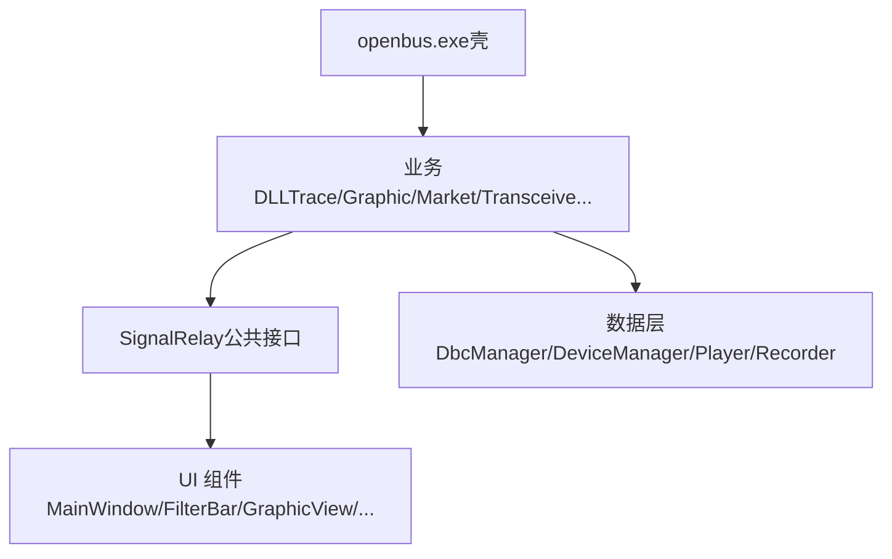
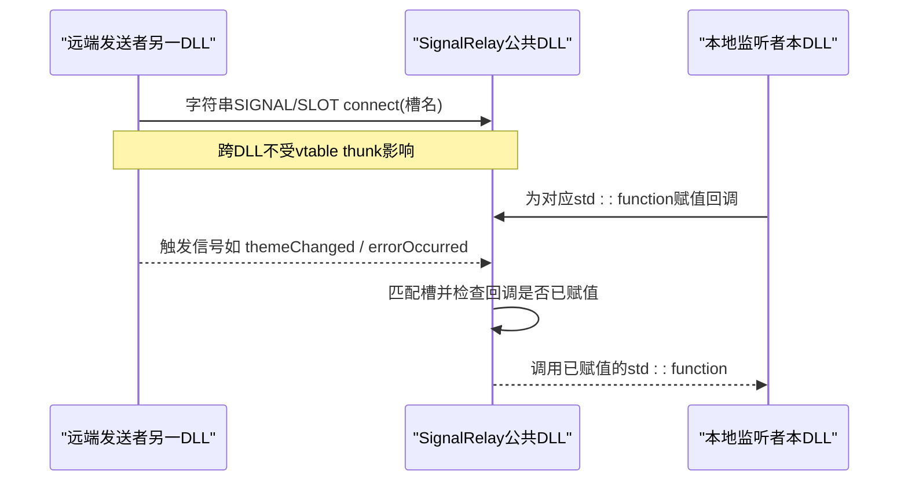
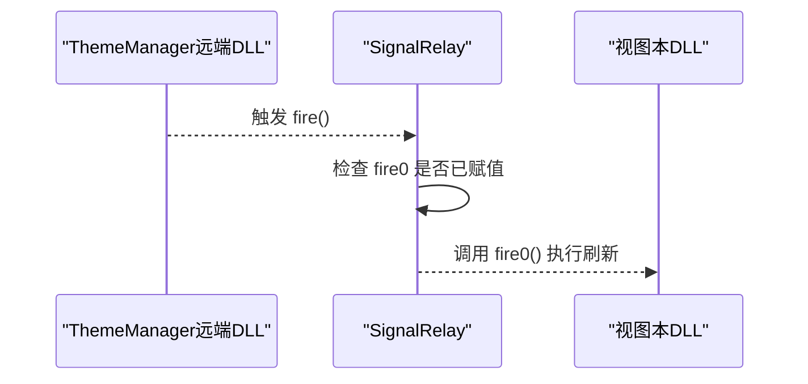
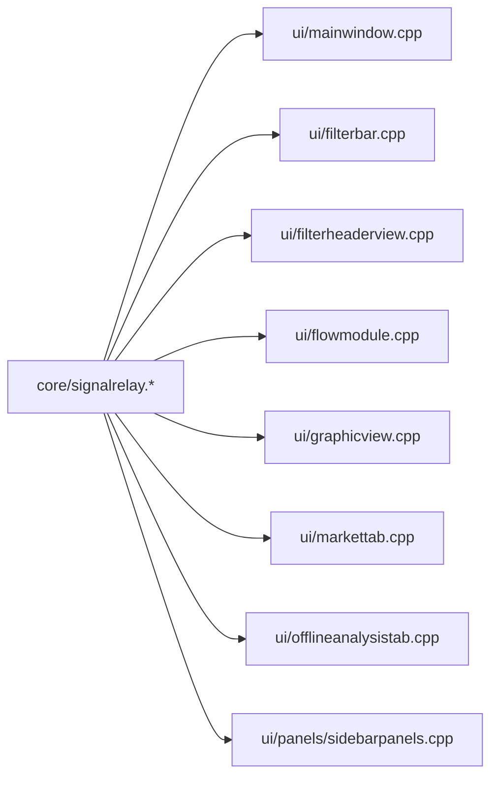

# SignalRelay跨DLL信号处理基础设施

<cite>
**本文引用的文件**
- [src/core/signalrelay.h](file://src/core/signalrelay.h)
- [src/core/signalrelay.cpp](file://src/core/signalrelay.cpp)
- [src/ui/mainwindow.cpp](file://src/ui/mainwindow.cpp)
- [src/ui/filterbar.cpp](file://src/ui/filterbar.cpp)
- [src/ui/filterheaderview.cpp](file://src/ui/filterheaderview.cpp)
- [src/ui/flowmodule.cpp](file://src/ui/flowmodule.cpp)
- [src/ui/graphicview.cpp](file://src/ui/graphicview.cpp)
- [src/ui/markettab.cpp](file://src/ui/markettab.cpp)
- [src/ui/offlineanalysistab.cpp](file://src/ui/offlineanalysistab.cpp)
- [src/ui/panels/sidebarpanels.cpp](file://src/ui/panels/sidebarpanels.cpp)
- [doc/拆分应用方案.md](file://doc/拆分应用方案.md)
</cite>

## 目录
1. [简介](#简介)
2. [项目结构](#项目结构)
3. [核心组件](#核心组件)
4. [架构总览](#架构总览)
5. [详细组件分析](#详细组件分析)
6. [依赖关系分析](#依赖关系分析)
7. [性能与可靠性](#性能与可靠性)
8. [故障排查指南](#故障排查指南)
9. [结论](#结论)

## 简介
SignalRelay 是 openbus 在“壳进程 + 业务 DLL”多模块架构下，用于解决 MinGW 环境下跨 DLL Qt 信号槽连接失败问题的桥接基础设施。它通过一组固定签名的公共槽函数，将字符串形式的 Qt 信号连接到任意可调用对象（lambda/std::function），从而在不导出复杂类型的前提下，实现跨 DLL 的可靠事件转发。该设计被广泛集成到 UI 层各模块中，作为主题切换、DBC 加载、设备连接、录制控制等场景的统一事件中转点。

## 项目结构
- SignalRelay 位于核心层：src/core/signalrelay.{h,cpp}
- 使用方集中在 UI 层：mainwindow、filterbar、graphicview、markettab、offlineanalysistab、flowmodule、sidebarpanels 等
- 架构背景见拆分应用方案文档，说明为何需要跨 DLL 通信以及当前采用“模块化单体（DLL）”而非多进程的路线



图表来源
- [doc/拆分应用方案.md:98-116](file://doc/拆分应用方案.md#L98-L116)

章节来源
- [doc/拆分应用方案.md:98-116](file://doc/拆分应用方案.md#L98-L116)

## 核心组件
- SignalRelay：提供若干固定参数签名的槽函数，内部持有对应 std::function 成员；当槽被触发时，若已赋值对应的可调用对象则执行之。
- 典型用法：外部以字符串 SIGNAL/SLOT connect 将远端信号连接到 SignalRelay 的槽；在本地为 SignalRelay 的对应 std::function 成员赋值 lambda/std::function，完成“跨 DLL 的信号 → 任意可调用对象”桥接。

章节来源
- [src/core/signalrelay.h:7-28](file://src/core/signalrelay.h#L7-L28)
- [src/core/signalrelay.cpp:8-31](file://src/core/signalrelay.cpp#L8-L31)

## 架构总览
SignalRelay 在“壳 + 业务DLL”的边界处充当稳定契约：
- 避免 MinGW 下新式 PMF connect 因 vtable thunk 地址不一致导致的静默失败
- 仅暴露少量常用签名，降低跨 DLL 头文件耦合
- 统一事件入口，便于在 UI 各模块中以一致方式订阅主题、设备、录制等事件



图表来源
- [src/core/signalrelay.h:33-48](file://src/core/signalrelay.h#L33-L48)
- [src/core/signalrelay.cpp:8-31](file://src/core/signalrelay.cpp#L8-L31)

## 详细组件分析

### SignalRelay 类设计
- 职责：将 Qt 字符串信号槽连接转换为对 std::function 的调用
- 关键设计：
  - 提供多个固定签名的槽函数，分别对应不同参数组合
  - 每个槽对应一个同语义的 std::function 成员，供调用方赋值
  - 槽函数内做空指针检查后转发调用，保证无副作用
- 复杂度：O(1) 转发，零额外分配；线程安全性取决于调用上下文（通常由 Qt 事件循环调度）

```mermaid
classDiagram
class SignalRelay {
+fire()
+fireBoolQString(bool, QString)
+fireQString(QString)
+fireQStringInt(QString, int)
+fireIntInt(int, int)
-fire0 : std : : function<void()>
-fnBoolString : std : : function<void(bool, QString)>
-fnString : std : : function<void(QString)>
-fnStringInt : std : : function<void(QString, int)>
-fnIntInt : std : : function<void(int, int)>
}
```

图表来源
- [src/core/signalrelay.h:29-49](file://src/core/signalrelay.h#L29-L49)
- [src/core/signalrelay.cpp:3-31](file://src/core/signalrelay.cpp#L3-L31)

章节来源
- [src/core/signalrelay.h:7-49](file://src/core/signalrelay.h#L7-L49)
- [src/core/signalrelay.cpp:3-31](file://src/core/signalrelay.cpp#L3-L31)

### 典型使用模式：主题切换
- 远端发出主题变化信号（例如来自 ThemeManager）
- 通过字符串 connect 将主题信号连接到 SignalRelay 的 fire()
- 本地为 fire0 赋值刷新逻辑（如 viewport()->update()）
- 结果：跨 DLL 的主题变更能可靠触发本地 UI 刷新



章节来源
- [src/core/signalrelay.h:19-27](file://src/core/signalrelay.h#L19-L27)
- [src/core/signalrelay.cpp:8-11](file://src/core/signalrelay.cpp#L8-L11)

### 典型使用模式：错误/连接/录制事件
- 设备连接、错误上报、录制开始/停止等事件，均通过 SignalRelay 统一转发
- 各 UI 模块按需订阅相应签名（如 fireQString、fireBoolQString、fireIntInt）
- 好处：屏蔽跨 DLL 差异，集中管理事件路由

章节来源
- [src/ui/mainwindow.cpp:225-274](file://src/ui/mainwindow.cpp#L225-L274)

### 典型使用模式：DBC 加载/卸载联动
- Flow 模块在 DBC 加载/卸载时，通过 SignalRelay 通知其他模块
- 接收方根据事件更新自身状态（如图形视图、统计面板）

章节来源
- [src/ui/flowmodule.cpp:90-99](file://src/ui/flowmodule.cpp#L90-L99)

### 典型使用模式：市场页按钮事件
- 市场页的刷新/安装按钮点击事件，经 SignalRelay 转发给业务逻辑
- 保持 UI 与业务解耦，便于跨 DLL 协作

章节来源
- [src/ui/markettab.cpp:218-235](file://src/ui/markettab.cpp#L218-L235)

### 典型使用模式：侧边栏导入/DBC/Trace 按钮
- 侧边栏的导入、DBC 详情、打开 Trace 等操作，通过 SignalRelay 统一派发
- 减少直接耦合，提升可维护性

章节来源
- [src/ui/panels/sidebarpanels.cpp:452-512](file://src/ui/panels/sidebarpanels.cpp#L452-L512)
- [src/ui/panels/sidebarpanels.cpp:718-808](file://src/ui/panels/sidebarpanels.cpp#L718-L808)

### 典型使用模式：图形视图调色板/信号按钮
- 图形视图通过 SignalRelay 处理调色板切换与信号按钮点击
- 确保跨 DLL 的 UI 交互一致性

章节来源
- [src/ui/graphicview.cpp:224-224](file://src/ui/graphicview.cpp#L224-L224)
- [src/ui/graphicview.cpp:513-513](file://src/ui/graphicview.cpp#L513-L513)

### 典型使用模式：过滤栏/表头主题刷新
- 过滤栏与列头在主题变化时通过 SignalRelay 触发刷新
- 保证界面风格一致性

章节来源
- [src/ui/filterbar.cpp:89-89](file://src/ui/filterbar.cpp#L89-L89)
- [src/ui/filterheaderview.cpp:29-29](file://src/ui/filterheaderview.cpp#L29-L29)

### 典型使用模式：离线分析页主题刷新
- 离线分析页同样通过 SignalRelay 响应主题变化

章节来源
- [src/ui/offlineanalysistab.cpp:104-104](file://src/ui/offlineanalysistab.cpp#L104-L104)

## 依赖关系分析
- SignalRelay 仅依赖 Qt 基础类型与 std::function，不引入业务耦合
- UI 各模块通过字符串 connect 与其交互，避免强类型依赖
- 与“壳 + 业务DLL”架构契合：公共 DLL 暴露稳定契约，业务 DLL 自由扩展行为



图表来源
- [src/core/signalrelay.h:29-49](file://src/core/signalrelay.h#L29-L49)
- [src/core/signalrelay.cpp:3-31](file://src/core/signalrelay.cpp#L3-L31)
- [src/ui/mainwindow.cpp:225-274](file://src/ui/mainwindow.cpp#L225-L274)
- [src/ui/filterbar.cpp:89-89](file://src/ui/filterbar.cpp#L89-L89)
- [src/ui/filterheaderview.cpp:29-29](file://src/ui/filterheaderview.cpp#L29-L29)
- [src/ui/flowmodule.cpp:90-99](file://src/ui/flowmodule.cpp#L90-L99)
- [src/ui/graphicview.cpp:224-224](file://src/ui/graphicview.cpp#L224-L224)
- [src/ui/markettab.cpp:218-235](file://src/ui/markettab.cpp#L218-L235)
- [src/ui/offlineanalysistab.cpp:104-104](file://src/ui/offlineanalysistab.cpp#L104-L104)
- [src/ui/panels/sidebarpanels.cpp:452-512](file://src/ui/panels/sidebarpanels.cpp#L452-L512)
- [src/ui/panels/sidebarpanels.cpp:718-808](file://src/ui/panels/sidebarpanels.cpp#L718-L808)

章节来源
- [src/core/signalrelay.h:29-49](file://src/core/signalrelay.h#L29-L49)
- [src/core/signalrelay.cpp:3-31](file://src/core/signalrelay.cpp#L3-L31)

## 性能与可靠性
- 性能特征：
  - 每次触发最多一次函数指针检查与一次调用，开销极低
  - 适合高频事件（如主题切换、UI 刷新）
- 可靠性保障：
  - 未赋值回调时安全忽略，不会崩溃
  - 字符串 connect 绕过 MinGW 跨 DLL 的 vtable thunk 问题
- 建议：
  - 合理选择槽签名，避免过多参数导致频繁拷贝
  - 在 UI 线程或 Qt 事件循环上下文中调用，避免竞态

[本节为通用指导，无需特定文件引用]

## 故障排查指南
- 症状：跨 DLL 信号连接后无响应
  - 检查是否正确为对应 std::function 成员赋值
  - 确认字符串 connect 的槽名与 SignalRelay 提供的槽一致
- 症状：MinGW 下连接失败
  - 优先使用 SignalRelay 的字符串 connect 方式，避免新式 PMF connect
- 症状：UI 刷新不及时
  - 确认回调是否在合适的线程/事件循环中被调用
  - 避免在回调中进行耗时操作

章节来源
- [src/core/signalrelay.h:7-28](file://src/core/signalrelay.h#L7-L28)
- [src/core/signalrelay.cpp:8-31](file://src/core/signalrelay.cpp#L8-L31)

## 结论
SignalRelay 以最小侵入的方式解决了 openbus 在“壳 + 业务DLL”架构下的跨 DLL 信号槽连接难题。其固定签名、弱耦合、易扩展的特点，使其成为 UI 层事件转发的基础设施。配合现有的驱动插件与模块划分，既提升了构建与迭代效率，也增强了系统的可维护性与稳定性。未来可在不破坏现有契约的前提下，继续扩展新的槽签名以满足更多场景需求。