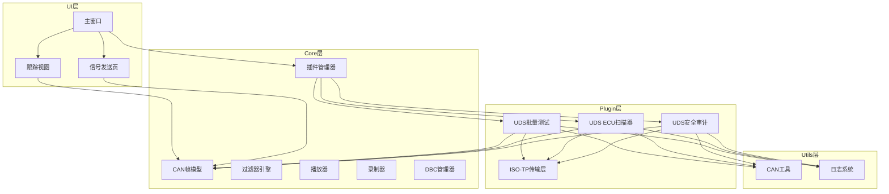
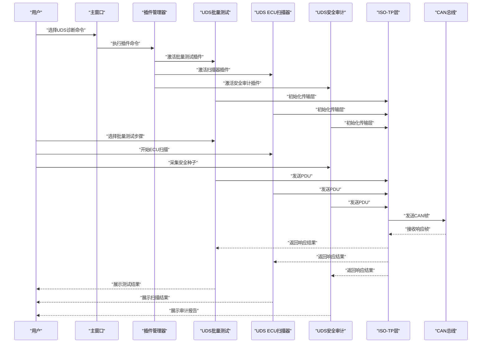
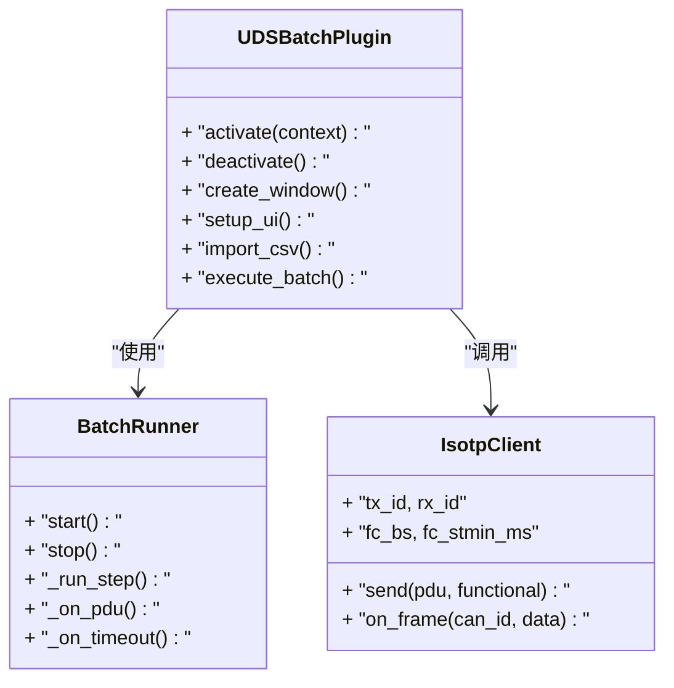
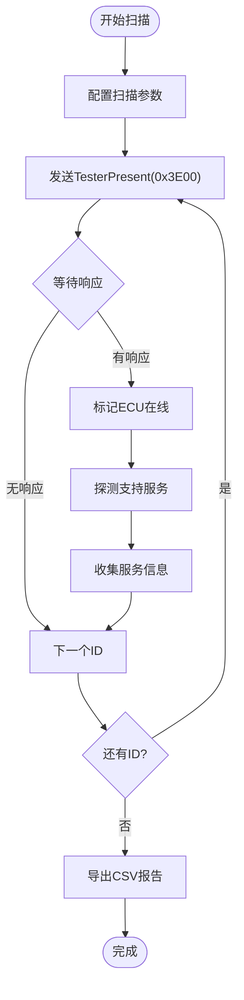
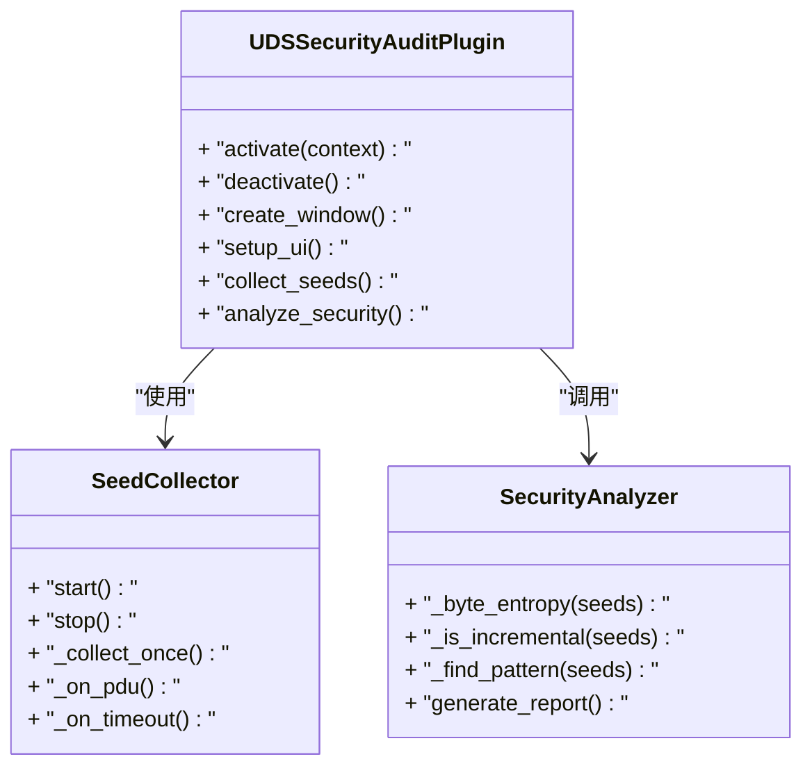
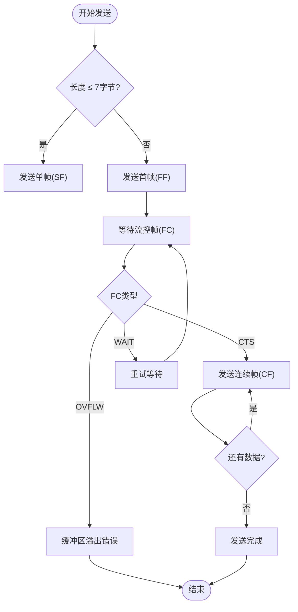
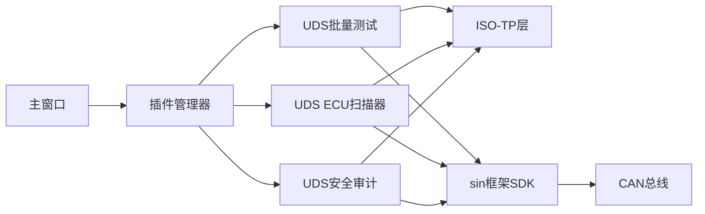

# UDS诊断接口

<cite>
**本文档引用的文件**   
- [README.md](file://README.md)
- [src/core/plugin/pluginmanager.h](file://src/core/plugin/pluginmanager.h)
- [plugins/uds-batch/main.py](file://plugins/uds-batch/main.py)
- [plugins/uds-batch/plugin.json](file://plugins/uds-batch/plugin.json)
- [plugins/uds-scan/main.py](file://plugins/uds-scan/main.py)
- [plugins/uds-scan/plugin.json](file://plugins/uds-scan/plugin.json)
- [plugins/uds-security-audit/main.py](file://plugins/uds-security-audit/main.py)
- [plugins/uds-security-audit/plugin.json](file://plugins/uds-security-audit/plugin.json)
- [plugins/_shared/isotp_client.py](file://plugins/_shared/isotp_client.py)
</cite>

## 更新摘要
**变更内容**   
- 移除了原有的uds-diagnostic插件相关的所有引用和描述
- 新增三个专用UDS插件：uds-batch（批量测试）、uds-scan（ECU扫描器）、uds-security-audit（安全审计）
- 更新了架构总览图，反映从单一插件到专业化插件的拆分
- 新增了各专用插件的详细功能分析和组件说明
- 更新了故障排查指南，针对新的插件化架构进行调整

## 目录
1. [简介](#简介)
2. [项目结构](#项目结构)
3. [核心组件](#核心组件)
4. [架构总览](#架构总览)
5. [详细组件分析](#详细组件分析)
6. [依赖关系分析](#依赖关系分析)
7. [性能考虑](#性能考虑)
8. [故障排查指南](#故障排查指南)
9. [结论](#结论)
10. [附录](#附录)

## 简介
本项目为基于Qt的CAN/CAN FD报文分析工具，现已将UDS（ISO 14229）诊断功能完全迁移至插件系统。通过独立的UDS诊断插件提供完整的诊断交互能力，包括会话控制、数据读写、DTC管理、安全访问和刷写辅助等高级功能。文档聚焦于插件化UDS诊断接口的实现与使用方式，涵盖插件架构、ISO-TP传输层、服务编解码等关键路径，帮助读者理解并扩展UDS相关功能。

**更新** 原有的uds-diagnostic插件已被完全移除，UDS功能已拆分为三个专用插件：uds-batch（批量测试）、uds-scan（ECU扫描器）、uds-security-audit（安全审计），每个插件专注于特定的诊断场景。

## 项目结构
项目采用分层组织，UDS诊断功能已完全迁移至插件系统：
- UI层：Qt界面模块，包含主窗口、面板与视图，通过插件系统集成UDS功能。
- Core层：CAN帧模型、播放器、录制器、DBC解析与过滤器等核心逻辑。
- Plugin层：独立的UDS诊断插件，提供完整的诊断客户端实现。
- Utils层：通用工具，如CAN工具函数与消息队列。

**图表来源**
- [src/core/plugin/pluginmanager.h:20-28](file://src/core/plugin/pluginmanager.h#L20-L28)
- [plugins/uds-batch/main.py:147-163](file://plugins/uds-batch/main.py#L147-L163)
- [plugins/uds-scan/main.py:227-245](file://plugins/uds-scan/main.py#L227-L245)
- [plugins/uds-security-audit/main.py:144-163](file://plugins/uds-security-audit/main.py#L144-L163)

**章节来源**
- [README.md](file://README.md)
- [src/core/plugin/pluginmanager.h:20-28](file://src/core/plugin/pluginmanager.h#L20-L28)

## 核心组件
- **UDS批量测试插件**：提供CSV请求表导入、顺序执行、结果统计功能，支持ISO 14229标准。
- **UDS ECU扫描器插件**：提供诊断ID范围扫描与服务探测，生成ECU清单与支持服务地图。
- **UDS安全审计插件**：提供SecurityAccess种子采集与弱随机检测、会话时序审计、负响应统计与安全报告。
- **ISO-TP传输层**：实现ISO 15765-2标准，支持单帧、多帧传输和流控机制。
- **插件管理器**：负责插件的发现、激活、停用和消息分发。
- **CAN帧模型**：定义CAN报文的数据结构与基础操作，是各模块共享的核心数据结构。

**更新** 原有的单一UDS诊断功能已拆分为三个专业化插件，每个插件专注于特定的诊断场景，提供更好的模块化和可维护性。

**章节来源**
- [plugins/uds-batch/main.py:1-10](file://plugins/uds-batch/main.py#L1-L10)
- [plugins/uds-scan/main.py:1-9](file://plugins/uds-scan/main.py#L1-L9)
- [plugins/uds-security-audit/main.py:1-12](file://plugins/uds-security-audit/main.py#L1-L12)
- [plugins/_shared/isotp_client.py:1-9](file://plugins/_shared/isotp_client.py#L1-L9)
- [src/core/plugin/pluginmanager.h:20-28](file://src/core/plugin/pluginmanager.h#L20-L28)

## 架构总览
下图展示了从用户操作到CAN总线输出的关键流程，包括UDS请求构造、ISO-TP传输和CAN帧发送。

**图表来源**
- [src/core/plugin/pluginmanager.h:67-81](file://src/core/plugin/pluginmanager.h#L67-L81)
- [plugins/uds-batch/main.py:396-401](file://plugins/uds-batch/main.py#L396-L401)
- [plugins/uds-scan/main.py:414-419](file://plugins/uds-scan/main.py#L414-L419)
- [plugins/uds-security-audit/main.py:425-430](file://plugins/uds-security-audit/main.py#L425-L430)

## 详细组件分析

### UDS批量测试插件
- **职责**：提供完整的UDS批量测试功能，包含CSV请求表导入/编辑、顺序执行、结果统计。
- **关键点**：
  - 基于PyQt6构建独立窗口界面
  - 支持CSV格式的请求表导入和导出
  - 每步独立超时与期望校验，支持7F xx延续等待
  - 逐行结果（PASS/FAIL/超时）+ 通过率统计
  - 内置ISO-TP客户端（SF/FF/CF/FC全状态机）
- **典型流程**：
  - 插件激活 → 创建窗口 → 导入CSV配置 → 顺序执行测试 → 生成统计报告

**图表来源**
- [plugins/uds-batch/main.py:147-163](file://plugins/uds-batch/main.py#L147-L163)
- [plugins/uds-batch/main.py:56-145](file://plugins/uds-batch/main.py#L56-L145)
- [plugins/_shared/isotp_client.py:25-41](file://plugins/_shared/isotp_client.py#L25-L41)

**章节来源**
- [plugins/uds-batch/main.py:147-419](file://plugins/uds-batch/main.py#L147-L419)
- [plugins/uds-batch/plugin.json:1-20](file://plugins/uds-batch/plugin.json#L1-L20)

### UDS ECU扫描器插件
- **职责**：提供ECU扫描功能，支持诊断ID范围扫描与服务探测，生成ECU清单与支持服务地图。
- **关键点**：
  - 支持诊断ID范围扫描（0x7E0-0x7EF / 自定义）
  - 发送TesterPresent检测ECU响应
  - 可选服务探测：默认读取VIN (0x22F190)、支持服务 (0x1003+0x22)
  - ISO-TP完整支持（FF/CF/FC、多帧重组、超时控制）
  - 结果表（ID、ECU名称、探测服务）、事件日志 + CSV导出
- **典型流程**：
  - 插件激活 → 配置扫描参数 → 开始扫描 → 收集响应 → 生成ECU清单

**图表来源**
- [plugins/uds-scan/main.py:341-373](file://plugins/uds-scan/main.py#L341-L373)

**章节来源**
- [plugins/uds-scan/main.py:227-434](file://plugins/uds-scan/main.py#L227-L434)
- [plugins/uds-scan/plugin.json:1-20](file://plugins/uds-scan/plugin.json#L1-L20)

### UDS安全审计插件
- **职责**：提供UDS安全审计功能，包括SecurityAccess种子采集与弱随机检测、会话时序审计、负响应统计与安全报告。
- **关键点**：
  - 27服务种子批量采集（次数可配，间隔可配）
  - 弱随机性分析：重复种子检测、字节熵统计、线性递增检测
  - 29 Authentication（新版）种子采集支持
  - 会话切换时序检查（10 03 → 27 01间隔）
  - 负响应地图（哪些子功能拒绝、NRC分布）
  - 安全审计报告（问题清单 + 评分 + 建议）导出
- **典型流程**：
  - 插件激活 → 配置采集参数 → 采集种子 → 分析随机性 → 生成审计报告

**图表来源**
- [plugins/uds-security-audit/main.py:144-163](file://plugins/uds-security-audit/main.py#L144-L163)
- [plugins/uds-security-audit/main.py:81-142](file://plugins/uds-security-audit/main.py#L81-L142)
- [plugins/uds-security-audit/main.py:36-79](file://plugins/uds-security-audit/main.py#L36-L79)

**章节来源**
- [plugins/uds-security-audit/main.py:144-445](file://plugins/uds-security-audit/main.py#L144-L445)
- [plugins/uds-security-audit/plugin.json:1-20](file://plugins/uds-security-audit/plugin.json#L1-L20)

### ISO-TP传输层
- **职责**：实现ISO 15765-2标准的传输层，处理单帧和多帧传输、流控机制。
- **关键点**：
  - 支持SF（单帧）、FF（首帧）、CF（连续帧）、FC（流控帧）
  - 实现BS（块大小）、STmin（最小间隔）流控
  - 自动处理功能寻址限制（仅支持单帧）
  - 超时管理和错误恢复机制
  - 事件驱动设计，全部使用QTimer，随窗口销毁自动停止
- **状态机**：WAIT/OVFLW/CTS状态转换

**图表来源**
- [plugins/_shared/isotp_client.py:63-150](file://plugins/_shared/isotp_client.py#L63-L150)

**章节来源**
- [plugins/_shared/isotp_client.py:1-214](file://plugins/_shared/isotp_client.py#L1-L214)

### 插件管理器
- **职责**：负责插件的发现、激活、停用和消息分发，实现主程序与插件的解耦。
- **关键点**：
  - 扫描plugins/目录发现插件
  - 启动Python宿主进程
  - 管理插件生命周期（激活/停用）
  - 转发插件请求（发送帧、输出文本等）
  - 支持插件包安装/卸载（G9 .opk）
- **集成点**：主窗口通过扩展面板提供插件操作入口

**章节来源**
- [src/core/plugin/pluginmanager.h:20-198](file://src/core/plugin/pluginmanager.h#L20-L198)

## 依赖关系分析
- 三个UDS插件都依赖ISO-TP传输层，用于协议处理和会话管理。
- 插件通过插件管理器与主程序通信，避免直接耦合。
- 插件使用sin框架提供的UI、帧发送和输出接口。
- 每个插件都有独立的plugin.json配置文件，定义了激活事件和命令。

**图表来源**
- [src/core/plugin/pluginmanager.h:67-81](file://src/core/plugin/pluginmanager.h#L67-L81)
- [plugins/uds-batch/main.py:17-18](file://plugins/uds-batch/main.py#L17-L18)
- [plugins/uds-scan/main.py:15-16](file://plugins/uds-scan/main.py#L15-L16)
- [plugins/uds-security-audit/main.py:19-20](file://plugins/uds-security-audit/main.py#L19-L20)

**章节来源**
- [src/core/plugin/pluginmanager.h:20-198](file://src/core/plugin/pluginmanager.h#L20-L198)
- [plugins/uds-batch/plugin.json:1-20](file://plugins/uds-batch/plugin.json#L1-L20)
- [plugins/uds-scan/plugin.json:1-20](file://plugins/uds-scan/plugin.json#L1-L20)
- [plugins/uds-security-audit/plugin.json:1-20](file://plugins/uds-security-audit/plugin.json#L1-L20)

## 性能考虑
- **异步处理**：ISO-TP和各个插件使用QTimer进行异步操作，避免阻塞UI线程。
- **批量处理**：对高频CAN帧进行批处理与合并，降低UI刷新频率。
- **内存管理**：插件在deactivate时清理资源，防止内存泄漏。
- **日志优化**：支持暂停日志记录，减少I/O开销。
- **超时控制**：合理的超时设置，避免长时间阻塞。
- **零发送基线**：所有插件仅在用户主动触发时才发送CAN帧，确保安全性。

## 故障排查指南
- **常见问题**：
  - 插件无法激活：检查Python环境是否正确安装，确认插件路径配置。
  - ISO-TP传输失败：验证CAN ID配置（物理/功能/响应），检查流控帧接收。
  - UDS请求无响应：确认会话模式正确，检查超时设置。
  - 批量测试失败：核对CSV配置格式，验证请求/期望响应格式。
  - ECU扫描无结果：检查ID范围配置，确认响应偏移设置。
  - 安全审计异常：验证种子采集配置，检查NRC响应处理。
- **建议步骤**：
  - 启用详细日志，定位请求/响应链路。
  - 逐步缩小范围，隔离问题模块。
  - 检查插件状态和错误输出。
  - 使用插件自带的导出功能获取详细报告。

**章节来源**
- [plugins/uds-batch/main.py:156-157](file://plugins/uds-batch/main.py#L156-L157)
- [plugins/uds-scan/main.py:241-243](file://plugins/uds-scan/main.py#L241-L243)
- [plugins/uds-security-audit/main.py:153-155](file://plugins/uds-security-audit/main.py#L153-L155)

## 结论
项目的UDS诊断功能已成功迁移至插件系统，并通过三个专用插件提供了更强大和灵活的诊断能力。新的架构实现了更好的模块化设计，支持完整的ISO-TP传输、丰富的UDS服务支持和完善的用户体验。建议在后续迭代中继续完善插件生态，提供更多诊断工具和扩展接口。

**更新** 从单一的uds-diagnostic插件拆分为三个专业化插件，每个插件专注于特定的诊断场景，提高了代码的可维护性和功能的专注度。

## 附录
- **插件安装**：通过主窗口的扩展面板安装和管理UDS诊断插件。
- **配置管理**：每个插件都有独立的配置文件，支持自定义参数设置。
- **测试验证**：各插件都提供了完整的测试用例和验证方法。
- **扩展开发**：参考现有插件结构开发新的诊断工具。

**章节来源**
- [plugins/uds-batch/plugin.json:1-20](file://plugins/uds-batch/plugin.json#L1-L20)
- [plugins/uds-scan/plugin.json:1-20](file://plugins/uds-scan/plugin.json#L1-L20)
- [plugins/uds-security-audit/plugin.json:1-20](file://plugins/uds-security-audit/plugin.json#L1-L20)
- [src/core/plugin/pluginmanager.h:117-125](file://src/core/plugin/pluginmanager.h#L117-L125)