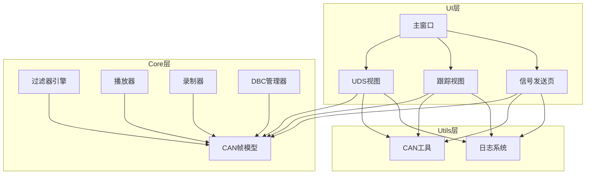
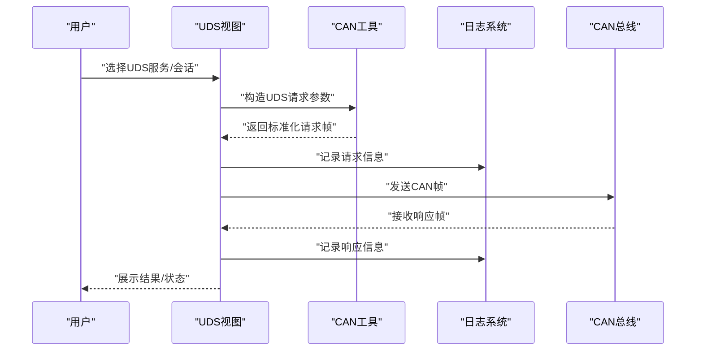
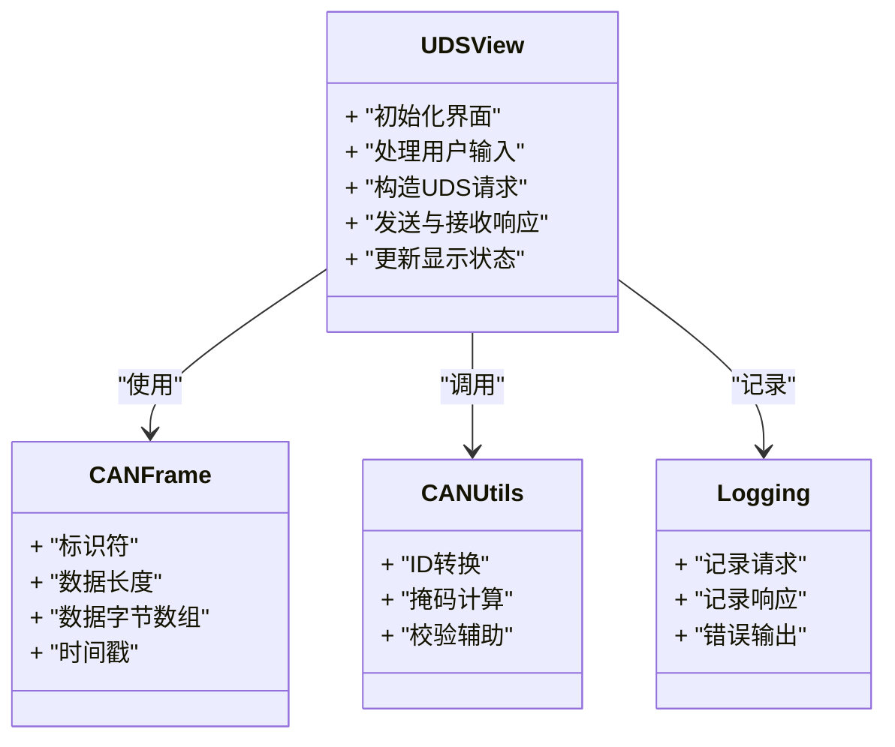
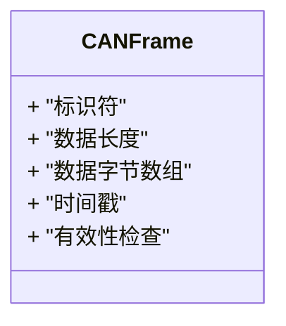
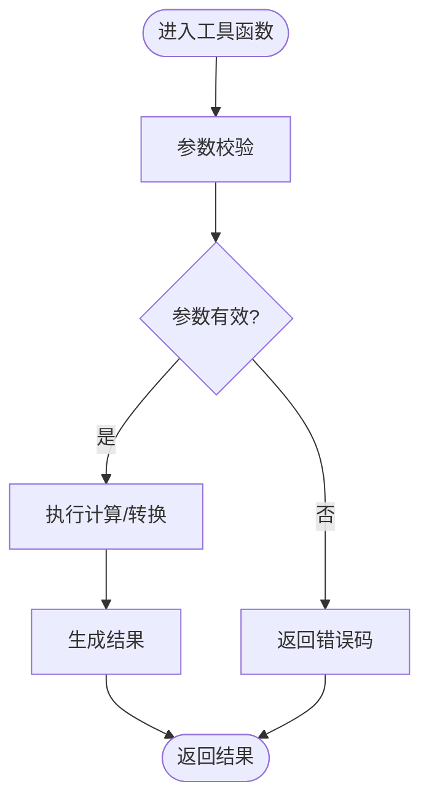
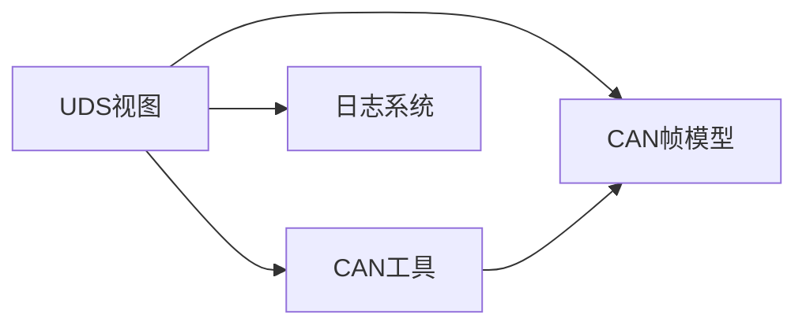

# UDS诊断接口

<cite>
**本文档引用的文件**   
- [README.md](file://README.md)
- [src/main.cpp](file://src/main.cpp)
- [src/ui/udsview.h](file://src/ui/udsview.h)
- [src/ui/udsview.cpp](file://src/ui/udsview.cpp)
- [src/core/canframe.h](file://src/core/canframe.h)
- [src/utils/canutils.h](file://src/utils/canutils.h)
- [src/utils/canutils.cpp](file://src/utils/canutils.cpp)
- [src/core/logging.h](file://src/core/logging.h)
- [src/core/logging.cpp](file://src/core/logging.cpp)
- [CMakeLists.txt](file://CMakeLists.txt)
</cite>

## 目录
1. [简介](#简介)
2. [项目结构](#项目结构)
3. [核心组件](#核心组件)
4. [架构总览](#架构总览)
5. [详细组件分析](#详细组件分析)
6. [依赖关系分析](#依赖关系分析)
7. [性能考虑](#性能考虑)
8. [故障排查指南](#故障排查指南)
9. [结论](#结论)
10. [附录](#附录)

## 简介
本仓库为基于Qt的CAN/UDS诊断工具，提供CAN总线数据可视化、过滤与回放，以及面向UDS（ISO 14229）的诊断交互能力。文档聚焦于“UDS诊断接口”的实现与使用方式，涵盖UI层展示、CAN帧处理、日志记录与构建配置等关键路径，帮助读者快速理解并扩展UDS相关功能。

## 项目结构
本项目采用分层组织：
- UI层：Qt界面模块，包含主窗口、面板与视图，其中UDS视图负责诊断交互展示。
- Core层：CAN帧模型、播放器、录制器、DBC解析与过滤器等核心逻辑。
- Utils层：通用工具，如CAN工具函数与消息队列。
- 资源与脚本：样式、第三方库下载与构建脚本。

图表来源
- [src/ui/udsview.h](file://src/ui/udsview.h)
- [src/ui/udsview.cpp](file://src/ui/udsview.cpp)
- [src/core/canframe.h](file://src/core/canframe.h)
- [src/utils/canutils.h](file://src/utils/canutils.h)
- [src/core/logging.h](file://src/core/logging.h)

章节来源
- [README.md](file://README.md)
- [CMakeLists.txt](file://CMakeLists.txt)

## 核心组件
- UDS视图（UDSView）：提供UDS会话控制、服务调用与响应展示的UI入口，封装了与底层CAN帧和工具的交互。
- CAN帧模型（CANFrame）：定义CAN报文的数据结构与基础操作，是各模块共享的核心数据结构。
- CAN工具（CANUtils）：提供CAN相关的实用方法，如ID转换、掩码计算、校验辅助等。
- 日志系统（Logging）：统一的日志输出与级别控制，贯穿UI与Core层。

章节来源
- [src/ui/udsview.h](file://src/ui/udsview.h)
- [src/ui/udsview.cpp](file://src/ui/udsview.cpp)
- [src/core/canframe.h](file://src/core/canframe.h)
- [src/utils/canutils.h](file://src/utils/canutils.h)
- [src/utils/canutils.cpp](file://src/utils/canutils.cpp)
- [src/core/logging.h](file://src/core/logging.h)
- [src/core/logging.cpp](file://src/core/logging.cpp)

## 架构总览
下图展示了从用户操作到CAN总线输出的关键流程，包括UDS请求构造、日志记录与CAN帧发送。

图表来源
- [src/ui/udsview.cpp](file://src/ui/udsview.cpp)
- [src/utils/canutils.cpp](file://src/utils/canutils.cpp)
- [src/core/logging.cpp](file://src/core/logging.cpp)

## 详细组件分析

### UDS视图（UDSView）
- 职责：承载UDS诊断交互界面，处理用户输入，组装UDS请求，管理响应显示与状态提示。
- 关键点：
  - 与CAN帧模型交互，将高层UDS语义映射到底层CAN帧。
  - 通过工具模块进行ID与数据域的处理。
  - 使用日志系统进行请求/响应的可观测性记录。
- 典型流程：
  - 用户触发服务调用 -> 参数校验 -> 构造请求帧 -> 发送 -> 等待响应 -> 解析并展示。

图表来源
- [src/ui/udsview.h](file://src/ui/udsview.h)
- [src/core/canframe.h](file://src/core/canframe.h)
- [src/utils/canutils.h](file://src/utils/canutils.h)
- [src/core/logging.h](file://src/core/logging.h)

章节来源
- [src/ui/udsview.h](file://src/ui/udsview.h)
- [src/ui/udsview.cpp](file://src/ui/udsview.cpp)

### CAN帧模型（CANFrame）
- 职责：统一表示CAN报文，包含标识符、数据长度、数据字节与时间戳等字段，供UI与Core层共享。
- 关键点：
  - 作为数据载体在UI与工具之间传递。
  - 支持基本序列化/反序列化的约定，便于日志与存储。

图表来源
- [src/core/canframe.h](file://src/core/canframe.h)

章节来源
- [src/core/canframe.h](file://src/core/canframe.h)

### CAN工具（CANUtils）
- 职责：提供CAN相关的通用计算方法与辅助函数，例如标识符转换、掩码运算、数据域校验等。
- 关键点：
  - 被UDS视图与跟踪视图广泛调用，保证一致性。
  - 提高代码复用率，降低重复实现带来的错误风险。

图表来源
- [src/utils/canutils.cpp](file://src/utils/canutils.cpp)
- [src/utils/canutils.h](file://src/utils/canutils.h)

章节来源
- [src/utils/canutils.h](file://src/utils/canutils.h)
- [src/utils/canutils.cpp](file://src/utils/canutils.cpp)

### 日志系统（Logging）
- 职责：统一日志输出，支持不同级别与格式化，贯穿UI与Core层，便于问题定位与审计。
- 关键点：
  - 在UDS请求/响应路径中记录关键事件。
  - 提供错误与警告输出，辅助调试。

章节来源
- [src/core/logging.h](file://src/core/logging.h)
- [src/core/logging.cpp](file://src/core/logging.cpp)

## 依赖关系分析
- UDS视图依赖CAN帧模型与CAN工具，用于数据构造与处理；同时依赖日志系统进行可观测性。
- CAN工具为无状态辅助模块，被多个UI与Core组件复用。
- 日志系统独立于业务逻辑，提供跨层统一输出。

图表来源
- [src/ui/udsview.h](file://src/ui/udsview.h)
- [src/core/canframe.h](file://src/core/canframe.h)
- [src/utils/canutils.h](file://src/utils/canutils.h)
- [src/core/logging.h](file://src/core/logging.h)

章节来源
- [src/ui/udsview.h](file://src/ui/udsview.h)
- [src/core/canframe.h](file://src/core/canframe.h)
- [src/utils/canutils.h](file://src/utils/canutils.h)
- [src/core/logging.h](file://src/core/logging.h)

## 性能考虑
- 减少不必要的对象拷贝：在UDS请求构造与响应解析时尽量使用引用或移动语义，避免频繁分配。
- 批量处理：对高频CAN帧进行批处理与合并，降低UI刷新频率。
- 异步化：将耗时操作（如网络或设备通信）放入后台线程，避免阻塞UI。
- 日志级别控制：在生产环境降低日志级别，减少I/O开销。

[本节为通用指导，不直接分析具体文件]

## 故障排查指南
- 常见问题：
  - UDS请求未发送或无响应：检查CAN工具是否正确构造ID与数据域，确认日志是否记录请求。
  - 响应解析失败：核对数据长度与字节序，查看日志中的原始帧内容。
  - 界面卡顿：评估是否在主线程执行了耗时操作，必要时引入异步处理。
- 建议步骤：
  - 启用详细日志，定位请求/响应链路。
  - 使用跟踪视图验证CAN帧收发情况。
  - 逐步缩小范围，隔离问题模块。

章节来源
- [src/ui/udsview.cpp](file://src/ui/udsview.cpp)
- [src/utils/canutils.cpp](file://src/utils/canutils.cpp)
- [src/core/logging.cpp](file://src/core/logging.cpp)

## 结论
本项目的UDS诊断接口以清晰的层次划分与模块化设计为基础，通过UDS视图、CAN帧模型、工具与日志系统的协作，实现了从用户操作到CAN总线输出的完整链路。建议在后续迭代中强化异步处理与性能优化，完善错误恢复机制，提升用户体验与稳定性。

[本节为总结性内容，不直接分析具体文件]

## 附录
- 构建与运行：参考根目录构建脚本与CMake配置，确保依赖库正确安装。
- 扩展建议：新增UDS服务时，优先在工具层实现通用方法，再在UDS视图中集成调用与展示。

章节来源
- [CMakeLists.txt](file://CMakeLists.txt)
- [src/main.cpp](file://src/main.cpp)