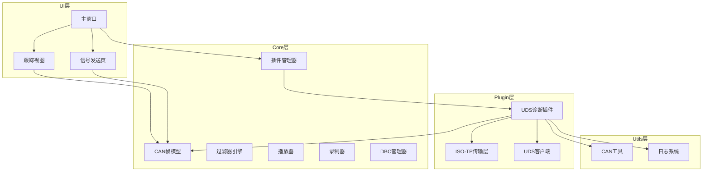
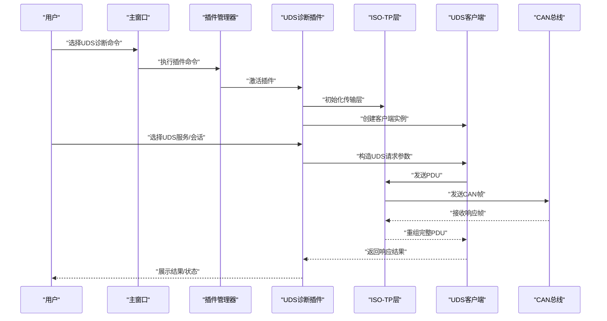
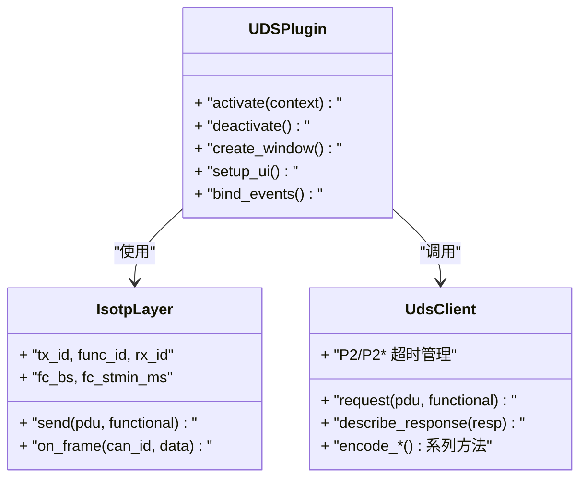
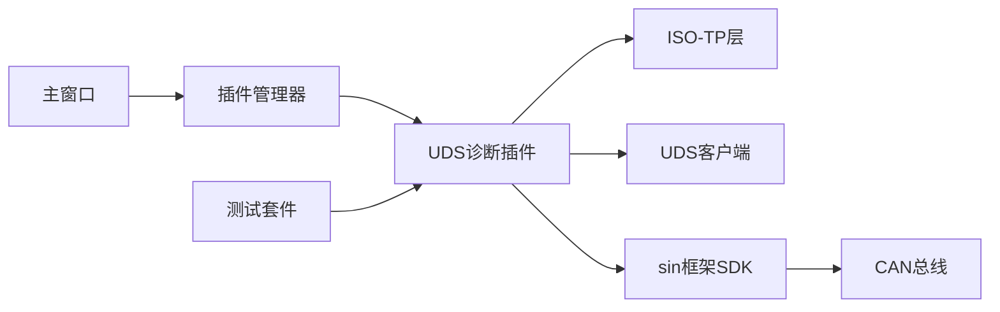

# UDS诊断接口

<cite>
**本文档引用的文件**   
- [README.md](file://README.md)
- [src/main.cpp](file://src/main.cpp)
- [src/ui/mainwindow.cpp](file://src/ui/mainwindow.cpp)
- [src/core/plugin/pluginmanager.h](file://src/core/plugin/pluginmanager.h)
- [plugins/uds-diagnostic/plugin.json](file://plugins/uds-diagnostic/plugin.json)
- [plugins/uds-diagnostic/main.py](file://plugins/uds-diagnostic/main.py)
- [plugins/uds-diagnostic/uds_client.py](file://plugins/uds-diagnostic/uds_client.py)
- [plugins/uds-diagnostic/uds_isotp.py](file://plugins/uds-diagnostic/uds_isotp.py)
- [plugins/uds-diagnostic/dids.json](file://plugins/uds-diagnostic/dids.json)
- [plugins/uds-diagnostic/tests/test_e2e.py](file://plugins/uds-diagnostic/tests/test_e2e.py)
</cite>

## 更新摘要
**变更内容**   
- 移除了内置UDS视图（src/ui/udsview.cpp/.h）相关的所有引用和描述
- 新增插件化UDS诊断功能说明，包括完整的ISO-TP传输层、服务编解码、DID管理等功能
- 更新了架构总览图，反映从内置界面到插件系统的迁移
- 新增了UDS诊断插件的详细组件分析和使用指南
- 更新了故障排查指南，针对插件化架构进行调整

## 目录
1. [简介](#简介)
2. [项目结构](#项目结构)
3. [核心组件](#核心组件)
4. [架构总览](#架构总览)
5. [详细组件分析](#详细组件分析)
6. [依赖关系分析](#依赖关系分析)
7. [性能考虑](#性能考虑)
8. [故障排查指南](#故障排查指南)
9. [结论](#结论)
10. [附录](#附录)

## 简介
本项目为基于Qt的CAN/CAN FD报文分析工具，现已将UDS（ISO 14229）诊断功能完全迁移至插件系统。通过独立的UDS诊断插件提供完整的诊断交互能力，包括会话控制、数据读写、DTC管理、安全访问和刷写辅助等高级功能。文档聚焦于插件化UDS诊断接口的实现与使用方式，涵盖插件架构、ISO-TP传输层、服务编解码等关键路径，帮助读者理解并扩展UDS相关功能。

## 项目结构
项目采用分层组织，UDS诊断功能已完全迁移至插件系统：
- UI层：Qt界面模块，包含主窗口、面板与视图，通过插件系统集成UDS功能。
- Core层：CAN帧模型、播放器、录制器、DBC解析与过滤器等核心逻辑。
- Plugin层：独立的UDS诊断插件，提供完整的诊断客户端实现。
- Utils层：通用工具，如CAN工具函数与消息队列。

**图表来源**
- [src/ui/mainwindow.cpp:32](file://src/ui/mainwindow.cpp#L32)
- [src/core/plugin/pluginmanager.h:28-27](file://src/core/plugin/pluginmanager.h#L28-L27)
- [plugins/uds-diagnostic/main.py:125-149](file://plugins/uds-diagnostic/main.py#L125-L149)

**章节来源**
- [README.md](file://README.md)
- [src/ui/mainwindow.cpp:32](file://src/ui/mainwindow.cpp#L32)

## 核心组件
- **UDS诊断插件**：提供完整的UDS诊断客户端实现，包含ISO-TP传输层、服务编解码、DID管理等核心功能。
- **ISO-TP传输层**：实现ISO 15765-2标准，支持单帧、多帧传输和流控机制。
- **UDS客户端**：处理请求-响应匹配、超时管理、NRC处理和会话状态。
- **插件管理器**：负责插件的发现、激活、停用和消息分发。
- **CAN帧模型**：定义CAN报文的数据结构与基础操作，是各模块共享的核心数据结构。

**章节来源**
- [plugins/uds-diagnostic/main.py:1-15](file://plugins/uds-diagnostic/main.py#L1-L15)
- [plugins/uds-diagnostic/uds_isotp.py:1-8](file://plugins/uds-diagnostic/uds_isotp.py#L1-L8)
- [plugins/uds-diagnostic/uds_client.py:1-9](file://plugins/uds-diagnostic/uds_client.py#L1-L9)
- [src/core/plugin/pluginmanager.h:19-27](file://src/core/plugin/pluginmanager.h#L19-L27)

## 架构总览
下图展示了从用户操作到CAN总线输出的关键流程，包括UDS请求构造、ISO-TP传输和CAN帧发送。

**图表来源**
- [src/ui/mainwindow.cpp:135-140](file://src/ui/mainwindow.cpp#L135-L140)
- [plugins/uds-diagnostic/main.py:145-149](file://plugins/uds-diagnostic/main.py#L145-L149)
- [plugins/uds-diagnostic/uds_isotp.py:68-80](file://plugins/uds-diagnostic/uds_isotp.py#L68-L80)

## 详细组件分析

### UDS诊断插件
- **职责**：提供完整的UDS诊断客户端实现，包含5个主要功能标签页：诊断服务、DID面板、DTC管理、安全访问、刷写助手。
- **关键点**：
  - 基于PyQt6构建独立窗口界面
  - 集成ISO-TP传输层和UDS客户端
  - 支持功能寻址、会话切换、心跳维持
  - 提供结构化日志记录和CSV导出功能
- **典型流程**：
  - 插件激活 → 创建窗口 → 初始化协议栈 → 绑定事件回调 → 等待用户操作

**图表来源**
- [plugins/uds-diagnostic/main.py:125-149](file://plugins/uds-diagnostic/main.py#L125-L149)
- [plugins/uds-diagnostic/uds_isotp.py:24-44](file://plugins/uds-diagnostic/uds_isotp.py#L24-L44)
- [plugins/uds-diagnostic/uds_client.py:16-45](file://plugins/uds-diagnostic/uds_client.py#L16-L45)

**章节来源**
- [plugins/uds-diagnostic/main.py:125-800](file://plugins/uds-diagnostic/main.py#L125-L800)
- [plugins/uds-diagnostic/plugin.json:1-16](file://plugins/uds-diagnostic/plugin.json#L1-L16)

### ISO-TP传输层
- **职责**：实现ISO 15765-2标准的传输层，处理单帧和多帧传输、流控机制。
- **关键点**：
  - 支持SF（单帧）、FF（首帧）、CF（连续帧）、FC（流控帧）
  - 实现BS（块大小）、STmin（最小间隔）流控
  - 自动处理功能寻址限制（仅支持单帧）
  - 超时管理和错误恢复机制
- **状态机**：WAIT/OVFLW/CTS状态转换

**图表来源**
- [plugins/uds-diagnostic/uds_isotp.py:68-158](file://plugins/uds-diagnostic/uds_isotp.py#L68-L158)

**章节来源**
- [plugins/uds-diagnostic/uds_isotp.py:1-225](file://plugins/uds-diagnostic/uds_isotp.py#L1-L225)

### UDS客户端
- **职责**：处理UDS协议的请求-响应匹配、超时管理、NRC处理和会话状态。
- **关键点**：
  - P2（默认2s）超时和P2*（默认5s）续等机制
  - NRC 0x78自动续等处理
  - 功能寻址和抑制响应的特殊处理
  - 丰富的服务编码器（10/11/14/19/22/2E/2F/27/28/31/34/36/37/3E/85）
- **响应解码**：支持正响应和否定响应的详细描述生成

**章节来源**
- [plugins/uds-diagnostic/uds_client.py:1-357](file://plugins/uds-diagnostic/uds_client.py#L1-L357)

### 插件管理器
- **职责**：负责插件的发现、激活、停用和消息分发，实现主程序与插件的解耦。
- **关键点**：
  - 扫描plugins/目录发现插件
  - 启动Python宿主进程
  - 管理插件生命周期（激活/停用）
  - 转发插件请求（发送帧、输出文本等）
- **集成点**：主窗口通过扩展面板提供插件操作入口

**章节来源**
- [src/core/plugin/pluginmanager.h:19-171](file://src/core/plugin/pluginmanager.h#L19-L171)
- [src/ui/mainwindow.cpp:135-193](file://src/ui/mainwindow.cpp#L135-L193)

## 依赖关系分析
- UDS诊断插件依赖ISO-TP传输层和UDS客户端，用于协议处理和会话管理。
- 插件通过插件管理器与主程序通信，避免直接耦合。
- 插件使用sin框架提供的UI、帧发送和输出接口。
- 测试套件提供端到端验证，确保插件功能完整性。

**图表来源**
- [src/ui/mainwindow.cpp:135-140](file://src/ui/mainwindow.cpp#L135-L140)
- [plugins/uds-diagnostic/main.py:22-35](file://plugins/uds-diagnostic/main.py#L22-L35)
- [plugins/uds-diagnostic/tests/test_e2e.py:31-56](file://plugins/uds-diagnostic/tests/test_e2e.py#L31-L56)

**章节来源**
- [src/core/plugin/pluginmanager.h:28-104](file://src/core/plugin/pluginmanager.h#L28-L104)
- [plugins/uds-diagnostic/main.py:22-35](file://plugins/uds-diagnostic/main.py#L22-L35)

## 性能考虑
- **异步处理**：ISO-TP和UDS客户端使用QTimer进行异步操作，避免阻塞UI线程。
- **批量处理**：对高频CAN帧进行批处理与合并，降低UI刷新频率。
- **内存管理**：插件在deactivate时清理资源，防止内存泄漏。
- **日志优化**：支持暂停日志记录，减少I/O开销。
- **超时控制**：合理的P2/P2*超时设置，避免长时间阻塞。

## 故障排查指南
- **常见问题**：
  - 插件无法激活：检查Python环境是否正确安装，确认插件路径配置。
  - ISO-TP传输失败：验证CAN ID配置（物理/功能/响应），检查流控帧接收。
  - UDS请求无响应：确认会话模式正确，检查P2超时设置。
  - DID读取失败：核对DID字典配置，验证数据类型和长度。
- **建议步骤**：
  - 启用详细日志，定位请求/响应链路。
  - 使用测试套件验证基本功能。
  - 逐步缩小范围，隔离问题模块。
  - 检查插件状态和错误输出。

**章节来源**
- [plugins/uds-diagnostic/main.py:243-249](file://plugins/uds-diagnostic/main.py#L243-L249)
- [plugins/uds-diagnostic/tests/test_e2e.py:25-341](file://plugins/uds-diagnostic/tests/test_e2e.py#L25-L341)

## 结论
项目的UDS诊断功能已成功迁移至插件系统，通过独立的UDS诊断插件提供了更强大和灵活的诊断能力。新的架构实现了更好的模块化设计，支持完整的ISO-TP传输、丰富的UDS服务支持和完善的用户体验。建议在后续迭代中继续完善插件生态，提供更多诊断工具和扩展接口。

## 附录
- **插件安装**：通过主窗口的扩展面板安装和管理UDS诊断插件。
- **配置管理**：DID字典存储在dids.json文件中，支持自定义DID定义。
- **测试验证**：使用test_e2e.py进行端到端功能测试。
- **扩展开发**：参考现有插件结构开发新的诊断工具。

**章节来源**
- [plugins/uds-diagnostic/dids.json:1-5](file://plugins/uds-diagnostic/dids.json#L1-L5)
- [plugins/uds-diagnostic/tests/test_e2e.py:1-341](file://plugins/uds-diagnostic/tests/test_e2e.py#L1-L341)
- [src/ui/mainwindow.cpp:135-193](file://src/ui/mainwindow.cpp#L135-L193)