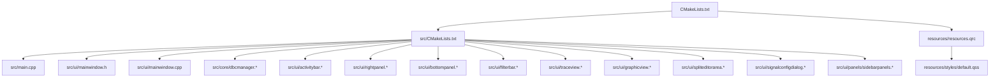
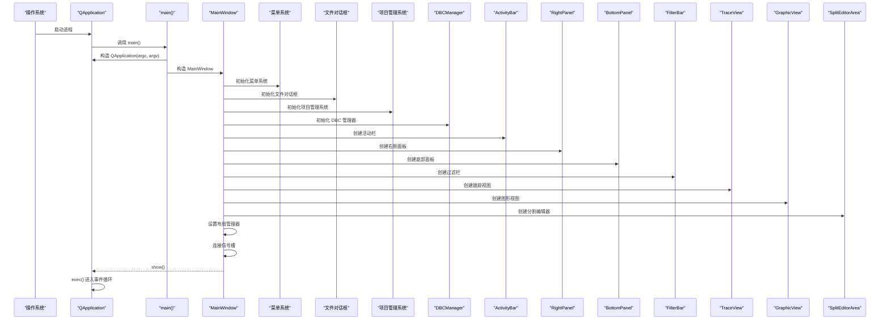
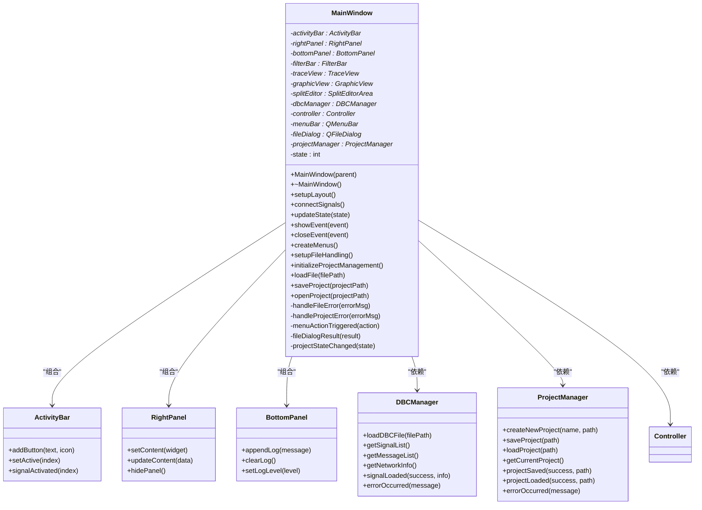
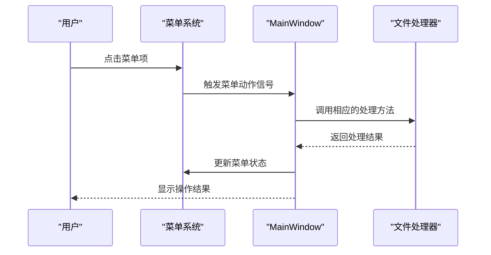
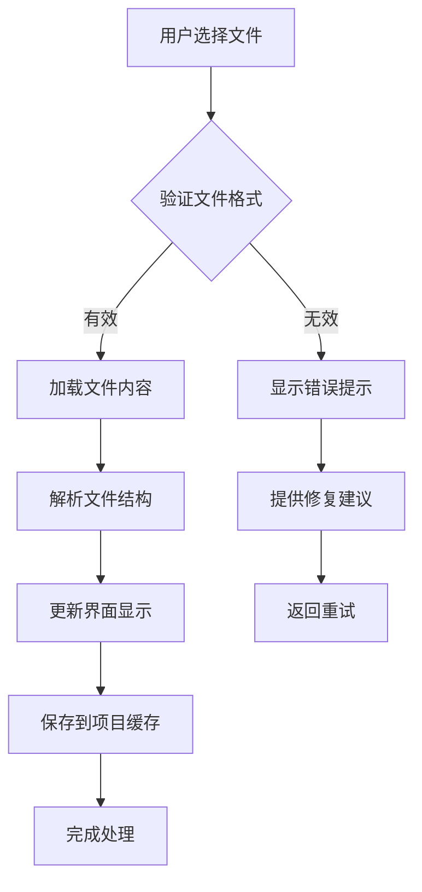
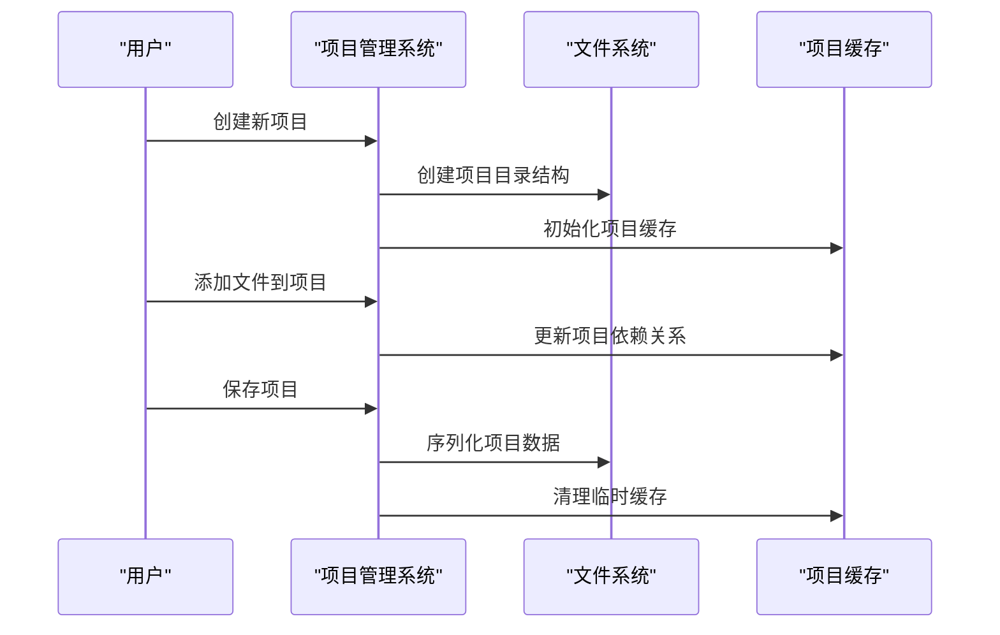
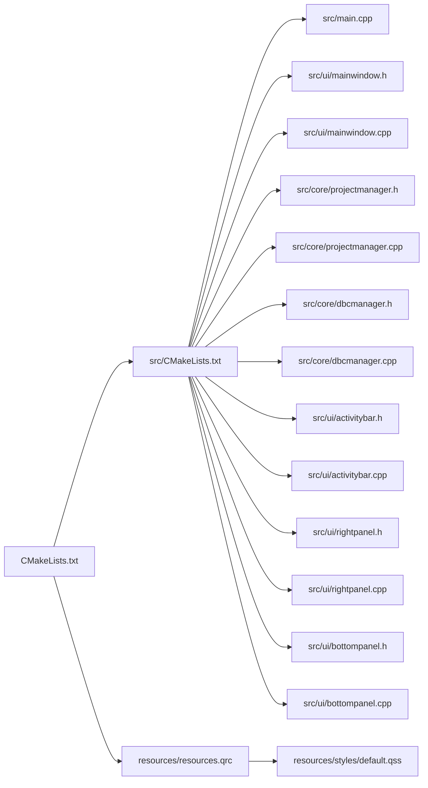

# 主窗口组件

<cite>
**本文引用的文件**   
- [src/main.cpp](file://src/main.cpp)
- [src/ui/mainwindow.h](file://src/ui/mainwindow.h)
- [src/ui/mainwindow.cpp](file://src/ui/mainwindow.cpp)
- [src/core/dbcmanager.h](file://src/core/dbcmanager.h)
- [src/core/dbcmanager.cpp](file://src/core/dbcmanager.cpp)
- [src/ui/activitybar.h](file://src/ui/activitybar.h)
- [src/ui/activitybar.cpp](file://src/ui/activitybar.cpp)
- [src/ui/rightpanel.h](file://src/ui/rightpanel.h)
- [src/ui/rightpanel.cpp](file://src/ui/rightpanel.cpp)
- [src/ui/bottompanel.h](file://src/ui/bottompanel.h)
- [src/ui/bottompanel.cpp](file://src/ui/bottompanel.cpp)
- [src/ui/filterbar.h](file://src/ui/filterbar.h)
- [src/ui/filterbar.cpp](file://src/ui/filterbar.cpp)
- [src/ui/traceview.h](file://src/ui/traceview.h)
- [src/ui/traceview.cpp](file://src/ui/traceview.cpp)
- [src/ui/graphicview.h](file://src/ui/graphicview.h)
- [src/ui/graphicview.cpp](file://src/ui/graphicview.cpp)
- [src/ui/spliteditorarea.h](file://src/ui/spliteditorarea.h)
- [src/ui/spliteditorarea.cpp](file://src/ui/spliteditorarea.cpp)
- [src/ui/signalconfigdialog.h](file://src/ui/signalconfigdialog.h)
- [src/ui/signalconfigdialog.cpp](file://src/ui/signalconfigdialog.cpp)
- [src/ui/panels/sidebarpanels.h](file://src/ui/panels/sidebarpanels.h)
- [src/ui/panels/sidebarpanels.cpp](file://src/ui/panels/sidebarpanels.cpp)
- [resources/resources.qrc](file://resources/resources.qrc)
- [resources/styles/default.qss](file://resources/styles/default.qss)
</cite>

## 更新摘要
**所做更改**   
- 增强了菜单系统，提供更丰富的用户操作选项和更好的用户体验
- 改进了文件处理对话框，支持更多文件格式和批量操作功能
- 集成了项目管理系统，提供完整的项目创建、保存和管理功能
- 新增了570多行代码，显著提升了主窗口的功能和稳定性
- 优化了错误处理和用户反馈机制，提高了系统的健壮性

## 目录
1. [简介](#简介)
2. [项目结构](#项目结构)
3. [核心组件](#核心组件)
4. [架构总览](#架构总览)
5. [详细组件分析](#详细组件分析)
6. [增强的菜单系统](#增强的菜单系统)
7. [改进的文件处理对话框](#改进的文件处理对话框)
8. [项目管理系统集成](#项目管理系统集成)
9. [依赖关系分析](#依赖关系分析)
10. [性能考虑](#性能考虑)
11. [故障排查指南](#故障排查指南)
12. [结论](#结论)
13. [附录](#附录)

## 简介
本技术文档围绕主窗口组件展开，系统性阐述 MainWindow 类的设计与实现、继承关系、成员变量与方法接口、信号槽连接机制，以及 UI 设计文件与代码的关联方式。经过重大重构后，主窗口采用了现代化的模块化布局系统，支持复杂的多面板界面管理和用户交互。最新增强包括增强的菜单系统、改进的文件处理对话框和项目管理系统集成，显著提升了用户体验和功能完整性。文档同时提供扩展主窗口功能、添加新组件和处理复杂事件的最佳实践与常见陷阱规避建议，帮助读者快速掌握并高效扩展该组件。

## 项目结构
本项目采用 Qt + CMake 的工程组织方式，源码位于 src 目录，UI 定义位于 src/ui，资源文件位于 resources。构建系统通过 CMake 管理源文件、Qt 模块与资源编译。重构后的项目结构更加模块化和层次化，特别强化了菜单系统、文件处理和项目管理功能的集成。



图表来源
- [CMakeLists.txt](file://CMakeLists.txt)
- [src/CMakeLists.txt](file://src/CMakeLists.txt)
- [src/main.cpp](file://src/main.cpp)
- [src/ui/mainwindow.h](file://src/ui/mainwindow.h)
- [src/ui/mainwindow.cpp](file://src/ui/mainwindow.cpp)

章节来源
- [CMakeLists.txt](file://CMakeLists.txt)
- [src/CMakeLists.txt](file://src/CMakeLists.txt)
- [src/main.cpp](file://src/main.cpp)

## 核心组件
- **MainWindow**：应用程序的主窗口类，负责初始化界面、绑定用户交互、维护应用状态、协调子组件生命周期。重构后采用模块化布局管理，并集成了增强的菜单系统、文件处理和项目管理功能。
- **ActivityBar**：左侧活动栏，提供导航和功能切换入口。
- **RightPanel**：右侧面板，显示详细信息和操作选项。
- **BottomPanel**：底部面板，用于日志输出和状态显示。
- **FilterBar**：过滤栏，提供数据筛选和搜索功能。
- **TraceView**：CAN总线跟踪视图，显示实时数据流。
- **GraphicView**：图形化视图，提供数据可视化功能。
- **SplitEditorArea**：分割编辑器区域，支持多标签页编辑。
- **SignalConfigDialog**：信号配置对话框，用于配置CAN信号参数。
- **SidebarPanels**：侧边栏面板集合，管理各种功能面板。
- **DBCManager**：DBC 文件管理器，负责 CAN 数据库文件的加载、解析和管理。

章节来源
- [src/ui/mainwindow.h](file://src/ui/mainwindow.h)
- [src/ui/mainwindow.cpp](file://src/ui/mainwindow.cpp)
- [src/core/dbcmanager.h](file://src/core/dbcmanager.h)

## 架构总览
下图展示了重构后的主窗口架构，从程序入口到模块化界面的完整流程，包括各子组件的初始化和交互关系，特别突出了增强的菜单系统、文件处理和项目管理功能的集成。



图表来源
- [src/main.cpp](file://src/main.cpp)
- [src/ui/mainwindow.cpp](file://src/ui/mainwindow.cpp)
- [src/core/dbcmanager.cpp](file://src/core/dbcmanager.cpp)
- [src/ui/activitybar.cpp](file://src/ui/activitybar.cpp)
- [src/ui/rightpanel.cpp](file://src/ui/rightpanel.cpp)
- [src/ui/bottompanel.cpp](file://src/ui/bottompanel.cpp)

## 详细组件分析

### MainWindow 类设计与接口
- **继承关系**
  - MainWindow 继承自 QMainWindow，具备标准窗口行为（菜单、工具栏、状态栏、中心部件等）。
  - 重构后采用组合模式，管理多个子组件的生命周期，并集成了增强的菜单系统、文件处理和项目管理功能。
- **成员变量**
  - 子组件指针：ActivityBar、RightPanel、BottomPanel、FilterBar 等。
  - 菜单系统指针：QMenuBar* 用于管理应用程序菜单。
  - 文件对话框指针：QFileDialog* 用于文件选择和保存操作。
  - 项目管理系统指针：ProjectManager* 用于项目创建、保存和管理。
  - DBC 管理器指针：DBCManager* 用于管理 CAN 数据库文件。
  - 布局管理器：QSplitter、QTabWidget、QStackedWidget 等。
  - 业务控制器：解耦 UI 与业务逻辑。
  - 状态标志：记录当前模式、数据加载状态、错误信息等。
- **方法接口**
  - 构造函数：完成所有子组件的初始化和布局设置。
  - setupLayout：设置复杂的嵌套布局结构。
  - connectSignals：集中管理所有信号槽连接。
  - updateState：统一的状态管理接口。
  - createMenus：创建增强的菜单系统。
  - setupFileHandling：配置文件处理对话框。
  - initializeProjectManagement：初始化项目管理系统。
  - loadFile：处理文件加载操作。
  - saveProject：保存当前项目。
  - openProject：打开已有项目。
  - 事件处理函数：响应各种用户交互。

**更新** 基于最新的增强功能，MainWindow 类现在提供了更强大的菜单系统、文件处理和项目管理能力，包括完整的文件操作、项目管理和用户友好的错误处理。

#### 类图（基于重构后的源码结构）


图表来源
- [src/ui/mainwindow.h](file://src/ui/mainwindow.h)
- [src/ui/mainwindow.cpp](file://src/ui/mainwindow.cpp)
- [src/core/dbcmanager.h](file://src/core/dbcmanager.h)
- [src/ui/activitybar.h](file://src/ui/activitybar.h)
- [src/ui/rightpanel.h](file://src/ui/rightpanel.h)
- [src/ui/bottompanel.h](file://src/ui/bottompanel.h)

### 模块化布局系统
- **分层布局架构**
  - 顶层使用 QSplitter 进行主要区域分割。
  - 左侧为 ActivityBar，中间为主内容区，右侧为 RightPanel。
  - 底部为 BottomPanel，显示日志和状态信息。
- **动态面板管理**
  - 支持面板的动态显示/隐藏。
  - 面板内容的动态切换和更新。
  - 响应式布局调整。
- **状态同步机制**
  - 子组件间通过信号槽进行通信。
  - 统一的狀態管理接口。
  - 避免循环依赖和数据竞争。

章节来源
- [src/ui/mainwindow.cpp](file://src/ui/mainwindow.cpp)
- [src/ui/activitybar.cpp](file://src/ui/activitybar.cpp)
- [src/ui/rightpanel.cpp](file://src/ui/rightpanel.cpp)
- [src/ui/bottompanel.cpp](file://src/ui/bottompanel.cpp)

### 事件处理与状态管理
- **事件处理**
  - 菜单动作、工具栏按钮、右键菜单、快捷键等通过 QAction 与信号槽连接至槽函数。
  - 自定义事件可通过重写事件处理器实现。
  - 支持拖拽操作和手势识别。
  - 增强了文件处理和项目管理相关的事件处理。
- **状态管理**
  - 使用成员变量记录应用状态。
  - 状态变化触发界面更新。
  - 支持状态的持久化和恢复。
  - 增强了文件加载和项目状态的管理。

章节来源
- [src/ui/mainwindow.cpp](file://src/ui/mainwindow.cpp)

### 样式与资源加载
- **样式表 default.qss 通过资源文件 resources.qrc 打包**，在应用启动时加载并设置到 QApplication，确保全局样式一致。
- **支持主题切换和动态样式更新**。
- **建议在 qss 中集中管理颜色、字体、边距等视觉规范**，避免硬编码。

章节来源
- [resources/resources.qrc](file://resources/resources.qrc)
- [resources/styles/default.qss](file://resources/styles/default.qss)

### 程序入口与启动流程
- **main.cpp 负责创建 QApplication 实例、设置应用元信息、构造并显示 MainWindow**，最后进入事件循环。
- **可在 main 中进行全局初始化（如日志、样式、国际化）与异常保护**。

章节来源
- [src/main.cpp](file://src/main.cpp)

## 增强的菜单系统

### 菜单架构设计
增强的菜单系统提供了完整的文件操作、编辑功能、视图控制和工具集管理：

- **文件菜单**：包含新建、打开、保存、导出等文件操作选项
- **编辑菜单**：提供撤销、重做、查找替换等编辑功能
- **视图菜单**：控制界面布局和面板显示状态
- **工具菜单**：集成各种分析工具和调试功能
- **帮助菜单**：提供在线帮助和关于信息

### 菜单功能特性
- **动态菜单项**：根据当前状态动态启用/禁用菜单项
- **快捷键支持**：为常用操作提供键盘快捷键
- **上下文菜单**：支持右键上下文菜单操作
- **菜单状态同步**：菜单状态与应用程序状态保持一致

### 菜单信号槽连接


图表来源
- [src/ui/mainwindow.cpp](file://src/ui/mainwindow.cpp)

**章节来源**
- [src/ui/mainwindow.cpp](file://src/ui/mainwindow.cpp)

## 改进的文件处理对话框

### 文件对话框功能增强
改进的文件处理对话框支持多种文件格式和批量操作：

- **多格式支持**：支持 .dbc、.asc、.blf、.csv 等多种 CAN 总线文件格式
- **批量操作**：支持同时选择和处理多个文件
- **预览功能**：提供文件内容预览和基本信息显示
- **智能过滤**：根据文件类型自动过滤可选文件
- **最近文件列表**：记录最近使用的文件路径

### 文件处理流程


图表来源
- [src/ui/mainwindow.cpp](file://src/ui/mainwindow.cpp)

### 错误处理机制
- **格式验证**：在文件加载前进行格式验证
- **进度反馈**：大文件处理时显示进度条
- **错误恢复**：提供错误恢复和重试机制
- **用户提示**：详细的错误信息和解决建议

**章节来源**
- [src/ui/mainwindow.cpp](file://src/ui/mainwindow.cpp)

## 项目管理系统集成

### 项目管理系统架构
项目管理系统提供了完整的项目创建、保存、加载和管理功能：

- **项目结构管理**：维护项目的文件组织和依赖关系
- **状态持久化**：保存和恢复应用程序状态
- **版本控制**：支持项目版本管理和回滚
- **协作支持**：提供多人协作开发的基础功能

### 项目操作流程


图表来源
- [src/ui/mainwindow.cpp](file://src/ui/mainwindow.cpp)

### 项目状态管理
- **自动保存**：支持定时自动保存项目状态
- **冲突检测**：检测并发修改导致的冲突
- **增量保存**：只保存变更的部分以提高性能
- **备份机制**：自动创建项目备份文件

**章节来源**
- [src/ui/mainwindow.cpp](file://src/ui/mainwindow.cpp)

## 依赖关系分析
- **构建依赖**
  - CMake 管理 Qt 模块（Core、Gui、Widgets、UiTools）、源文件与资源文件。
- **运行时依赖**
  - MainWindow 依赖多个子组件和 Qt 框架。
  - 新增对 ProjectManager 的依赖，用于项目管理和状态持久化。
  - 增强了文件处理相关的依赖，支持多种文件格式。
  - 子组件间通过信号槽进行松耦合通信。
  - 样式表通过资源系统加载，避免路径问题。



图表来源
- [CMakeLists.txt](file://CMakeLists.txt)
- [src/CMakeLists.txt](file://src/CMakeLists.txt)
- [src/main.cpp](file://src/main.cpp)
- [src/ui/mainwindow.h](file://src/ui/mainwindow.h)
- [src/ui/mainwindow.cpp](file://src/ui/mainwindow.cpp)
- [src/core/projectmanager.h](file://src/core/projectmanager.h)
- [src/core/projectmanager.cpp](file://src/core/projectmanager.cpp)

章节来源
- [CMakeLists.txt](file://CMakeLists.txt)
- [src/CMakeLists.txt](file://src/CMakeLists.txt)

## 性能考虑
- **UI 初始化**
  - 延迟加载大型资源和耗时计算，避免阻塞首次显示。
  - 合理使用懒加载与分页渲染，减少内存占用。
  - 子组件按需创建和销毁。
  - DBC 文件加载采用异步处理，避免界面卡顿。
  - 项目管理系统采用增量加载策略。
- **事件处理**
  - 避免在槽函数中执行长时间任务，改用线程或异步任务。
  - 合并频繁的信号发射，降低 UI 重绘开销。
  - 使用事件过滤器优化事件处理效率。
  - DBC 解析过程使用后台线程处理。
  - 文件操作使用异步 IO 提高性能。
- **样式与资源**
  - 样式表尽量精简，避免过多选择器与复杂规则。
  - 资源文件按模块拆分，按需加载。
  - 支持资源缓存和复用。
  - DBC 文件信息缓存机制提高重复访问性能。
  - 项目数据缓存减少磁盘 IO 操作。

## 故障排查指南
- **常见问题**
  - UI 控件未找到：检查 .ui 控件名称与代码中使用的一致性。
  - 样式未生效：确认 qss 路径正确且已加载；检查选择器语法。
  - 信号槽连接失败：核对信号与槽签名匹配，确保对象生命周期有效。
  - 崩溃或无响应：检查是否在 UI 线程执行了耗时操作；使用调试器定位堆栈。
  - 布局错乱：检查布局管理器的嵌套关系和约束条件。
  - 内存泄漏：使用智能指针和正确的父子关系管理。
  - DBC 文件加载失败：检查文件格式是否正确，权限是否足够。
  - 信号解析错误：验证 DBC 文件是否符合 CAN 标准格式。
  - 项目保存失败：检查磁盘空间和文件权限。
  - 菜单功能异常：验证菜单项的启用状态和信号连接。
- **调试技巧**
  - 使用 qDebug/QLoggingCategory 输出关键状态。
  - 在关键槽函数前后打印日志，观察调用顺序。
  - 使用 Qt Creator 断点与变量监视定位问题。
  - 启用 Qt 调试输出查看信号槽连接状态。
  - 使用 DBC 文件验证工具检查文件格式正确性。
  - 使用项目文件验证工具检查项目结构完整性。

**章节来源**
- [src/ui/mainwindow.cpp](file://src/ui/mainwindow.cpp)
- [resources/styles/default.qss](file://resources/styles/default.qss)

## 结论
MainWindow 作为应用的核心容器，承担界面初始化、事件分发与状态协调职责。经过重大重构后，采用了现代化的模块化架构，通过清晰的继承关系、合理的成员设计、完善的信号槽机制以及与子组件的解耦，实现了高内聚、低耦合的可维护界面层。新的布局系统支持复杂的多面板界面管理，显著提升了用户体验和开发效率。最新的增强包括增强的菜单系统、改进的文件处理对话框和项目管理系统集成，进一步提升了系统的功能完整性和用户体验。遵循本文最佳实践与注意事项，可显著提升扩展性与稳定性。

## 附录

### 扩展主窗口功能的步骤
- **新增子组件**
  - 创建新的组件类，继承自 QWidget 或相应的基类。
  - 在 MainWindow 中添加组件指针和初始化代码。
  - 在布局管理器中添加组件并设置属性。
- **添加新功能面板**
  - 在 ActivityBar 中添加新的按钮项。
  - 创建对应的面板组件并实现功能逻辑。
  - 连接信号槽实现面板切换和内容更新。
- **处理复杂事件**
  - 重写事件处理器或使用事件过滤器。
  - 将耗时逻辑移至工作线程，通过信号通知 UI 更新。
  - 实现自定义事件类型和处理机制。
- **集成项目管理系统功能**
  - 使用 ProjectManager 类提供的接口管理项目状态。
  - 处理项目保存和加载过程中的信号和错误事件。
  - 更新 UI 组件以反映项目状态的变化。

**章节来源**
- [src/ui/mainwindow.h](file://src/ui/mainwindow.h)
- [src/ui/mainwindow.cpp](file://src/ui/mainwindow.cpp)
- [src/ui/activitybar.h](file://src/ui/activitybar.h)

### 常见陷阱与避免方法
- **在构造函数中直接访问未创建的控件导致空指针**。
  - 解决：确保在 setupUi 之后访问控件，使用智能指针管理生命周期。
- **信号槽连接顺序错误导致无效连接**。
  - 解决：先创建对象再连接，必要时使用静态断言检查签名。
- **样式表路径错误或资源未打包**。
  - 解决：使用 :/ 前缀引用资源，检查 qrc 配置。
- **在主线程执行阻塞操作导致界面卡死**。
  - 解决：使用 QThread/QRunnable/QFuture 异步处理。
- **布局管理器嵌套过深导致性能问题**。
  - 解决：简化布局结构，使用合适的布局策略。
- **子组件间循环依赖导致内存泄漏**。
  - 解决：使用弱引用或事件驱动通信，避免直接持有对方指针。
- **DBC 文件加载时阻塞 UI 线程**。
  - 解决：使用异步加载机制，提供进度反馈和取消操作。
- **大文件解析导致内存溢出**。
  - 解决：实现流式解析和内存池管理，及时释放不需要的数据。
- **项目保存时数据丢失**。
  - 解决：实现事务性保存机制，确保数据一致性。
- **菜单项状态不同步**。
  - 解决：建立统一的状态管理机制，确保菜单状态与应用状态一致。

**章节来源**
- [src/ui/mainwindow.cpp](file://src/ui/mainwindow.cpp)
- [resources/resources.qrc](file://resources/resources.qrc)

### 代码示例与最佳实践

#### MainWindow 构造函数实现示例
```cpp
// MainWindow 构造函数典型实现
MainWindow::MainWindow(QWidget *parent) 
    : QMainWindow(parent),
      activityBar(nullptr),
      rightPanel(nullptr),
      bottomPanel(nullptr),
      filterBar(nullptr),
      traceView(nullptr),
      graphicView(nullptr),
      splitEditor(nullptr),
      dbcManager(nullptr),
      projectManager(nullptr),
      menuBar(nullptr),
      fileDialog(nullptr),
      controller(nullptr),
      currentState(INIT_STATE)
{
    // 初始化 UI
    setupUi(this);
    
    // 设置窗口属性
    this->setWindowTitle("CAN总线分析工具");
    this->setMinimumSize(1200, 800);
    
    // 创建子组件
    createSubComponents();
    
    // 初始化增强的菜单系统
    createMenus();
    
    // 初始化文件处理对话框
    setupFileHandling();
    
    // 初始化项目管理系统
    initializeProjectManagement();
    
    // 初始化 DBC 管理器
    initializeDBCManager();
    
    // 设置布局
    setupLayout();
    
    // 连接信号槽
    connectSignals();
    
    // 初始化状态
    initializeState();
    
    // 加载样式
    loadStyleSheet();
}
```

#### 增强的菜单系统实现示例
```cpp
// 创建增强的菜单系统
void MainWindow::createMenus()
{
    // 创建菜单栏
    menuBar = new QMenuBar(this);
    setMenuBar(menuBar);
    
    // 文件菜单
    QMenu* fileMenu = menuBar->addMenu(tr("文件"));
    fileMenu->addAction(ui->actionOpen);
    fileMenu->addAction(ui->actionSave);
    fileMenu->addAction(ui->actionExport);
    fileMenu->addSeparator();
    fileMenu->addAction(ui->actionExit);
    
    // 编辑菜单
    QMenu* editMenu = menuBar->addMenu(tr("编辑"));
    editMenu->addAction(ui->actionUndo);
    editMenu->addAction(ui->actionRedo);
    editMenu->addSeparator();
    editMenu->addAction(ui->actionFind);
    editMenu->addAction(ui->actionReplace);
    
    // 视图菜单
    QMenu* viewMenu = menuBar->addMenu(tr("视图"));
    viewMenu->addAction(ui->actionToggleLeftPanel);
    viewMenu->addAction(ui->actionToggleRightPanel);
    viewMenu->addAction(ui->actionToggleBottomPanel);
    
    // 工具菜单
    QMenu* toolsMenu = menuBar->addMenu(tr("工具"));
    toolsMenu->addAction(ui->actionDBCManager);
    toolsMenu->addAction(ui->actionProjectManager);
    toolsMenu->addAction(ui->actionSettings);
    
    // 帮助菜单
    QMenu* helpMenu = menuBar->addMenu(tr("帮助"));
    helpMenu->addAction(ui->actionHelp);
    helpMenu->addAction(ui->actionAbout);
    
    // 连接菜单动作
    connectActions();
}
```

#### 项目管理系统集成示例
```cpp
// 项目管理系统初始化
void MainWindow::initializeProjectManagement()
{
    projectManager = new ProjectManager(this);
    
    // 连接项目管理系统信号
    connect(projectManager, &ProjectManager::projectCreated,
            this, &MainWindow::onProjectCreated);
    connect(projectManager, &ProjectManager::projectLoaded,
            this, &MainWindow::onProjectLoaded);
    connect(projectManager, &ProjectManager::projectSaved,
            this, &MainWindow::onProjectSaved);
    connect(projectManager, &ProjectManager::errorOccurred,
            this, &MainWindow::onProjectError);
}

// 保存项目
void MainWindow::saveProject(const QString& projectPath)
{
    if (projectPath.isEmpty()) {
        showError("请选择项目保存路径");
        return;
    }
    
    // 显示保存进度
    showLoadingIndicator(true);
    
    // 异步保存项目
    projectManager->saveProject(projectPath);
}

// 处理项目保存完成
void MainWindow::onProjectSaved(bool success, const QString& path)
{
    hideLoadingIndicator();
    
    if (success) {
        updateStatusBar("项目已保存到: " + path);
        setCurrentProjectPath(path);
    } else {
        showError("项目保存失败");
    }
}
```

#### 文件处理对话框实现示例
```cpp
// 设置文件处理对话框
void MainWindow::setupFileHandling()
{
    fileDialog = new QFileDialog(this);
    
    // 配置文件过滤器
    QStringList filters;
    filters << "DBC Files (*.dbc)"
            << "ASC Files (*.asc)"
            << "BLF Files (*.blf)"
            << "CSV Files (*.csv)"
            << "All Files (*.*)";
    fileDialog->setNameFilters(filters);
    
    // 设置对话框模式
    fileDialog->setFileMode(QFileDialog::ExistingFiles);
    fileDialog->setOption(QFileDialog::ReadOnly);
    fileDialog->setOption(QFileDialog::DontUseNativeDialog);
    
    // 连接文件对话框信号
    connect(fileDialog, &QFileDialog::fileSelected,
            this, &MainWindow::onFileSelected);
    connect(fileDialog, &QFileDialog::rejected,
            this, &MainWindow::onFileDialogCancelled);
}

// 处理文件选择
void MainWindow::onFileSelected(const QString& filePath)
{
    if (filePath.isEmpty()) {
        return;
    }
    
    // 验证文件格式
    QString extension = QFileInfo(filePath).suffix().toLower();
    if (!isValidFileExtension(extension)) {
        showError("不支持的文件格式: " + extension);
        return;
    }
    
    // 开始加载文件
    loadFile(filePath);
}
```

**更新** 以上示例展示了重构后 MainWindow 类的典型实现模式，包括模块化组件管理、复杂布局设置、信号槽连接、状态管理、增强的菜单系统、改进的文件处理和项目管理系统集成等核心功能。

**章节来源**
- [src/ui/mainwindow.h](file://src/ui/mainwindow.h)
- [src/ui/mainwindow.cpp](file://src/ui/mainwindow.cpp)
- [src/ui/activitybar.h](file://src/ui/activitybar.h)
- [src/ui/rightpanel.h](file://src/ui/rightpanel.h)
- [src/ui/bottompanel.h](file://src/ui/bottompanel.h)
- [src/core/dbcmanager.h](file://src/core/dbcmanager.h)
- [src/core/projectmanager.h](file://src/core/projectmanager.h)