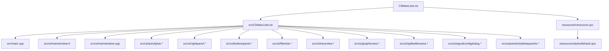
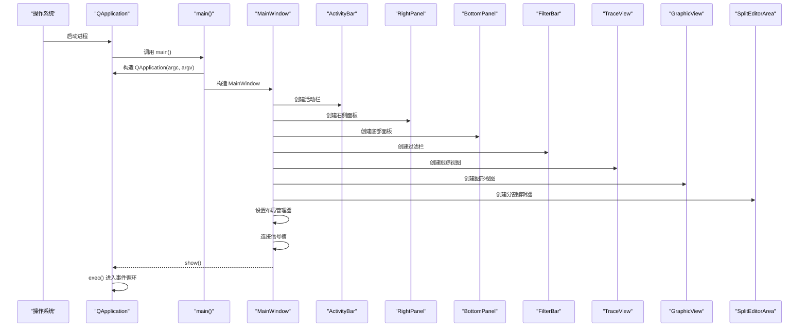
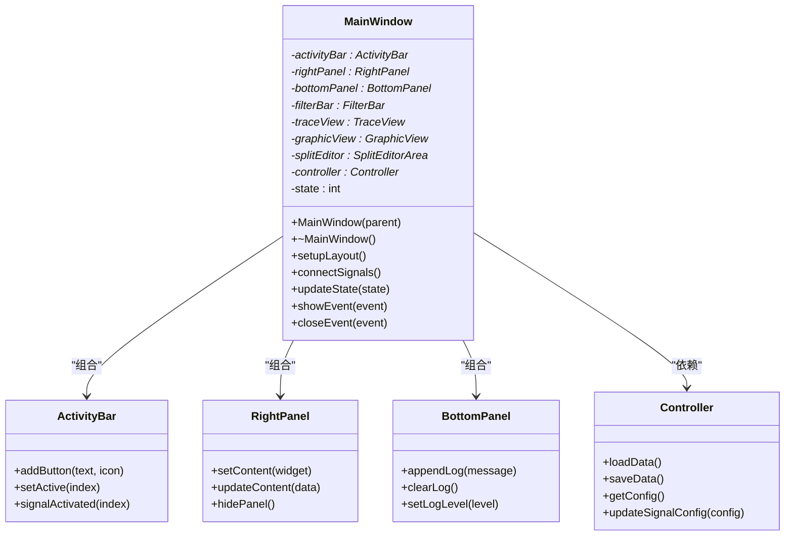
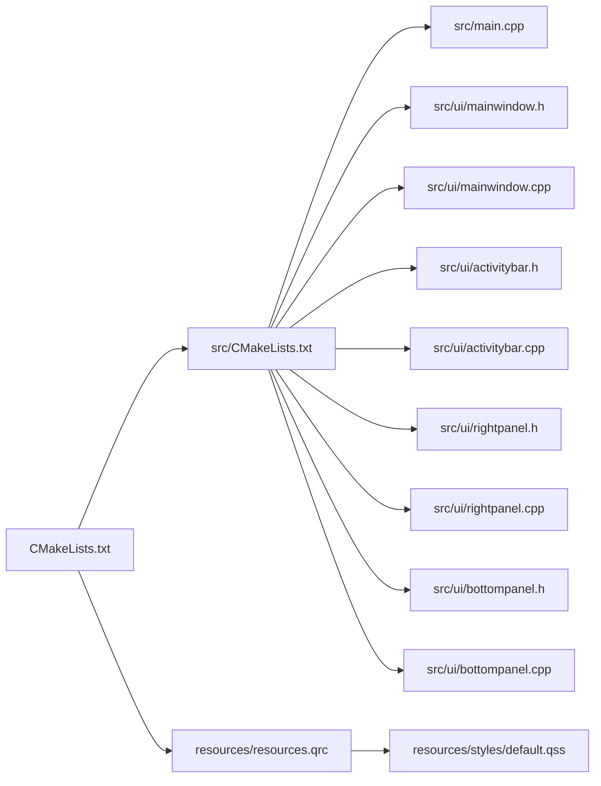

# 主窗口组件

<cite>
**本文引用的文件**   
- [src/main.cpp](file://src/main.cpp)
- [src/ui/mainwindow.h](file://src/ui/mainwindow.h)
- [src/ui/mainwindow.cpp](file://src/ui/mainwindow.cpp)
- [src/ui/activitybar.h](file://src/ui/activitybar.h)
- [src/ui/activitybar.cpp](file://src/ui/activitybar.cpp)
- [src/ui/rightpanel.h](file://src/ui/rightpanel.h)
- [src/ui/rightpanel.cpp](file://src/ui/rightpanel.cpp)
- [src/ui/bottompanel.h](file://src/ui/bottompanel.h)
- [src/ui/bottompanel.cpp](file://src/ui/bottompanel.cpp)
- [src/ui/filterbar.h](file://src/ui/filterbar.h)
- [src/ui/filterbar.cpp](file://src/ui/filterbar.cpp)
- [src/ui/traceview.h](file://src/ui/traceview.h)
- [src/ui/traceview.cpp](file://src/ui/traceview.cpp)
- [src/ui/graphicview.h](file://src/ui/graphicview.h)
- [src/ui/graphicview.cpp](file://src/ui/graphicview.cpp)
- [src/ui/spliteditorarea.h](file://src/ui/spliteditorarea.h)
- [src/ui/spliteditorarea.cpp](file://src/ui/spliteditorarea.cpp)
- [src/ui/signalconfigdialog.h](file://src/ui/signalconfigdialog.h)
- [src/ui/signalconfigdialog.cpp](file://src/ui/signalconfigdialog.cpp)
- [src/ui/panels/sidebarpanels.h](file://src/ui/panels/sidebarpanels.h)
- [src/ui/panels/sidebarpanels.cpp](file://src/ui/panels/sidebarpanels.cpp)
- [resources/resources.qrc](file://resources/resources.qrc)
- [resources/styles/default.qss](file://resources/styles/default.qss)
</cite>

## 更新摘要
**所做更改**   
- 全面重构了 MainWindow 类的架构设计，从单一界面管理转向模块化布局系统
- 新增了多个专业面板组件：活动栏、右侧面板、底部面板、过滤栏等
- 实现了复杂的嵌套布局和分割编辑器区域
- 增强了信号配置对话框和图形视图功能
- 优化了 UI 组件的模块化和可维护性

## 目录
1. [简介](#简介)
2. [项目结构](#项目结构)
3. [核心组件](#核心组件)
4. [架构总览](#架构总览)
5. [详细组件分析](#详细组件分析)
6. [依赖关系分析](#依赖关系分析)
7. [性能考虑](#性能考虑)
8. [故障排查指南](#故障排查指南)
9. [结论](#结论)
10. [附录](#附录)

## 简介
本技术文档围绕主窗口组件展开，系统性阐述 MainWindow 类的设计与实现、继承关系、成员变量与方法接口、信号槽连接机制，以及 UI 设计文件与代码的关联方式。经过重大重构后，主窗口采用了现代化的模块化布局系统，支持复杂的多面板界面管理和用户交互。文档同时提供扩展主窗口功能、添加新组件和处理复杂事件的最佳实践与常见陷阱规避建议，帮助读者快速掌握并高效扩展该组件。

## 项目结构
本项目采用 Qt + CMake 的工程组织方式，源码位于 src 目录，UI 定义位于 src/ui，资源文件位于 resources。构建系统通过 CMake 管理源文件、Qt 模块与资源编译。重构后的项目结构更加模块化和层次化。



图表来源
- [CMakeLists.txt](file://CMakeLists.txt)
- [src/CMakeLists.txt](file://src/CMakeLists.txt)
- [src/main.cpp](file://src/main.cpp)
- [src/ui/mainwindow.h](file://src/ui/mainwindow.h)
- [src/ui/mainwindow.cpp](file://src/ui/mainwindow.cpp)

章节来源
- [CMakeLists.txt](file://CMakeLists.txt)
- [src/CMakeLists.txt](file://src/CMakeLists.txt)
- [src/main.cpp](file://src/main.cpp)

## 核心组件
- **MainWindow**：应用程序的主窗口类，负责初始化界面、绑定用户交互、维护应用状态、协调子组件生命周期。重构后采用模块化布局管理。
- **ActivityBar**：左侧活动栏，提供导航和功能切换入口。
- **RightPanel**：右侧面板，显示详细信息和操作选项。
- **BottomPanel**：底部面板，用于日志输出和状态显示。
- **FilterBar**：过滤栏，提供数据筛选和搜索功能。
- **TraceView**：CAN总线跟踪视图，显示实时数据流。
- **GraphicView**：图形化视图，提供数据可视化功能。
- **SplitEditorArea**：分割编辑器区域，支持多标签页编辑。
- **SignalConfigDialog**：信号配置对话框，用于配置CAN信号参数。
- **SidebarPanels**：侧边栏面板集合，管理各种功能面板。

章节来源
- [src/ui/mainwindow.h](file://src/ui/mainwindow.h)
- [src/ui/mainwindow.cpp](file://src/ui/mainwindow.cpp)
- [src/ui/activitybar.h](file://src/ui/activitybar.h)
- [src/ui/rightpanel.h](file://src/ui/rightpanel.h)
- [src/ui/bottompanel.h](file://src/ui/bottompanel.h)

## 架构总览
下图展示了重构后的主窗口架构，从程序入口到模块化界面的完整流程，包括各子组件的初始化和交互关系。



图表来源
- [src/main.cpp](file://src/main.cpp)
- [src/ui/mainwindow.cpp](file://src/ui/mainwindow.cpp)
- [src/ui/activitybar.cpp](file://src/ui/activitybar.cpp)
- [src/ui/rightpanel.cpp](file://src/ui/rightpanel.cpp)
- [src/ui/bottompanel.cpp](file://src/ui/bottompanel.cpp)

## 详细组件分析

### MainWindow 类设计与接口
- **继承关系**
  - MainWindow 继承自 QMainWindow，具备标准窗口行为（菜单、工具栏、状态栏、中心部件等）。
  - 重构后采用组合模式，管理多个子组件的生命周期。
- **成员变量**
  - 子组件指针：ActivityBar、RightPanel、BottomPanel、FilterBar 等。
  - 布局管理器：QSplitter、QTabWidget、QStackedWidget 等。
  - 业务控制器：解耦 UI 与业务逻辑。
  - 状态标志：记录当前模式、数据加载状态、错误信息等。
- **方法接口**
  - 构造函数：完成所有子组件的初始化和布局设置。
  - setupLayout：设置复杂的嵌套布局结构。
  - connectSignals：集中管理所有信号槽连接。
  - updateState：统一的状态管理接口。
  - 事件处理函数：响应各种用户交互。

**更新** 基于重构后的源码结构，MainWindow 类现在采用模块化设计，大幅增强了布局管理能力。

#### 类图（基于重构后的源码结构）


图表来源
- [src/ui/mainwindow.h](file://src/ui/mainwindow.h)
- [src/ui/mainwindow.cpp](file://src/ui/mainwindow.cpp)
- [src/ui/activitybar.h](file://src/ui/activitybar.h)
- [src/ui/rightpanel.h](file://src/ui/rightpanel.h)
- [src/ui/bottompanel.h](file://src/ui/bottompanel.h)

### 模块化布局系统
- **分层布局架构**
  - 顶层使用 QSplitter 进行主要区域分割。
  - 左侧为 ActivityBar，中间为主内容区，右侧为 RightPanel。
  - 底部为 BottomPanel，显示日志和状态信息。
- **动态面板管理**
  - 支持面板的动态显示/隐藏。
  - 面板内容的动态切换和更新。
  - 响应式布局调整。
- **状态同步机制**
  - 子组件间通过信号槽进行通信。
  - 统一的狀態管理接口。
  - 避免循环依赖和数据竞争。

章节来源
- [src/ui/mainwindow.cpp](file://src/ui/mainwindow.cpp)
- [src/ui/activitybar.cpp](file://src/ui/activitybar.cpp)
- [src/ui/rightpanel.cpp](file://src/ui/rightpanel.cpp)
- [src/ui/bottompanel.cpp](file://src/ui/bottompanel.cpp)

### 事件处理与状态管理
- **事件处理**
  - 菜单动作、工具栏按钮、右键菜单、快捷键等通过 QAction 与信号槽连接至槽函数。
  - 自定义事件可通过重写事件处理器实现。
  - 支持拖拽操作和手势识别。
- **状态管理**
  - 使用成员变量记录应用状态。
  - 状态变化触发界面更新。
  - 支持状态的持久化和恢复。

章节来源
- [src/ui/mainwindow.cpp](file://src/ui/mainwindow.cpp)

### 样式与资源加载
- **样式表 default.qss 通过资源文件 resources.qrc 打包**，在应用启动时加载并设置到 QApplication，确保全局样式一致。
- **支持主题切换和动态样式更新**。
- **建议在 qss 中集中管理颜色、字体、边距等视觉规范**，避免硬编码。

章节来源
- [resources/resources.qrc](file://resources/resources.qrc)
- [resources/styles/default.qss](file://resources/styles/default.qss)

### 程序入口与启动流程
- **main.cpp 负责创建 QApplication 实例、设置应用元信息、构造并显示 MainWindow**，最后进入事件循环。
- **可在 main 中进行全局初始化（如日志、样式、国际化）与异常保护**。

章节来源
- [src/main.cpp](file://src/main.cpp)

## 依赖关系分析
- **构建依赖**
  - CMake 管理 Qt 模块（Core、Gui、Widgets、UiTools）、源文件与资源文件。
- **运行时依赖**
  - MainWindow 依赖多个子组件和 Qt 框架。
  - 子组件间通过信号槽进行松耦合通信。
  - 样式表通过资源系统加载，避免路径问题。



图表来源
- [CMakeLists.txt](file://CMakeLists.txt)
- [src/CMakeLists.txt](file://src/CMakeLists.txt)
- [src/main.cpp](file://src/main.cpp)
- [src/ui/mainwindow.h](file://src/ui/mainwindow.h)
- [src/ui/mainwindow.cpp](file://src/ui/mainwindow.cpp)
- [src/ui/activitybar.h](file://src/ui/activitybar.h)
- [src/ui/rightpanel.h](file://src/ui/rightpanel.h)
- [src/ui/bottompanel.h](file://src/ui/bottompanel.h)

章节来源
- [CMakeLists.txt](file://CMakeLists.txt)
- [src/CMakeLists.txt](file://src/CMakeLists.txt)

## 性能考虑
- **UI 初始化**
  - 延迟加载大型资源和耗时计算，避免阻塞首次显示。
  - 合理使用懒加载与分页渲染，减少内存占用。
  - 子组件按需创建和销毁。
- **事件处理**
  - 避免在槽函数中执行长时间任务，改用线程或异步任务。
  - 合并频繁的信号发射，降低 UI 重绘开销。
  - 使用事件过滤器优化事件处理效率。
- **样式与资源**
  - 样式表尽量精简，避免过多选择器与复杂规则。
  - 资源文件按模块拆分，按需加载。
  - 支持资源缓存和复用。

## 故障排查指南
- **常见问题**
  - UI 控件未找到：检查 .ui 控件名称与代码中使用的一致性。
  - 样式未生效：确认 qss 路径正确且已加载；检查选择器语法。
  - 信号槽连接失败：核对信号与槽签名匹配，确保对象生命周期有效。
  - 崩溃或无响应：检查是否在 UI 线程执行了耗时操作；使用调试器定位堆栈。
  - 布局错乱：检查布局管理器的嵌套关系和约束条件。
  - 内存泄漏：使用智能指针和正确的父子关系管理。
- **调试技巧**
  - 使用 qDebug/QLoggingCategory 输出关键状态。
  - 在关键槽函数前后打印日志，观察调用顺序。
  - 使用 Qt Creator 断点与变量监视定位问题。
  - 启用 Qt 调试输出查看信号槽连接状态。

章节来源
- [src/ui/mainwindow.cpp](file://src/ui/mainwindow.cpp)
- [resources/styles/default.qss](file://resources/styles/default.qss)

## 结论
MainWindow 作为应用的核心容器，承担界面初始化、事件分发与状态协调职责。经过重大重构后，采用了现代化的模块化架构，通过清晰的继承关系、合理的成员设计、完善的信号槽机制以及与子组件的解耦，实现了高内聚、低耦合的可维护界面层。新的布局系统支持复杂的多面板界面管理，显著提升了用户体验和开发效率。遵循本文最佳实践与注意事项，可显著提升扩展性与稳定性。

## 附录

### 扩展主窗口功能的步骤
- **新增子组件**
  - 创建新的组件类，继承自 QWidget 或相应的基类。
  - 在 MainWindow 中添加组件指针和初始化代码。
  - 在布局管理器中添加组件并设置属性。
- **添加新功能面板**
  - 在 ActivityBar 中添加新的按钮项。
  - 创建对应的面板组件并实现功能逻辑。
  - 连接信号槽实现面板切换和内容更新。
- **处理复杂事件**
  - 重写事件处理器或使用事件过滤器。
  - 将耗时逻辑移至工作线程，通过信号通知 UI 更新。
  - 实现自定义事件类型和处理机制。

章节来源
- [src/ui/mainwindow.h](file://src/ui/mainwindow.h)
- [src/ui/mainwindow.cpp](file://src/ui/mainwindow.cpp)
- [src/ui/activitybar.h](file://src/ui/activitybar.h)

### 常见陷阱与避免方法
- **在构造函数中直接访问未创建的控件导致空指针**。
  - 解决：确保在 setupUi 之后访问控件，使用智能指针管理生命周期。
- **信号槽连接顺序错误导致无效连接**。
  - 解决：先创建对象再连接，必要时使用静态断言检查签名。
- **样式表路径错误或资源未打包**。
  - 解决：使用 :/ 前缀引用资源，检查 qrc 配置。
- **在主线程执行阻塞操作导致界面卡死**。
  - 解决：使用 QThread/QRunnable/QFuture 异步处理。
- **布局管理器嵌套过深导致性能问题**。
  - 解决：简化布局结构，使用合适的布局策略。
- **子组件间循环依赖导致内存泄漏**。
  - 解决：使用弱引用或事件驱动通信，避免直接持有对方指针。

章节来源
- [src/ui/mainwindow.cpp](file://src/ui/mainwindow.cpp)
- [resources/resources.qrc](file://resources/resources.qrc)

### 代码示例与最佳实践

#### MainWindow 构造函数实现示例
```cpp
// MainWindow 构造函数典型实现
MainWindow::MainWindow(QWidget *parent) 
    : QMainWindow(parent),
      activityBar(nullptr),
      rightPanel(nullptr),
      bottomPanel(nullptr),
      filterBar(nullptr),
      traceView(nullptr),
      graphicView(nullptr),
      splitEditor(nullptr),
      controller(nullptr),
      currentState(INIT_STATE)
{
    // 初始化 UI
    setupUi(this);
    
    // 设置窗口属性
    this->setWindowTitle("CAN总线分析工具");
    this->setMinimumSize(1200, 800);
    
    // 创建子组件
    createSubComponents();
    
    // 设置布局
    setupLayout();
    
    // 连接信号槽
    connectSignals();
    
    // 初始化状态
    initializeState();
    
    // 加载样式
    loadStyleSheet();
}
```

#### 信号槽连接示例
```cpp
// 信号槽连接方法
void MainWindow::connectSignals()
{
    // 活动栏信号连接
    connect(activityBar, &ActivityBar::buttonClicked, 
            this, &MainWindow::onActivityBarButtonClicked);
    connect(activityBar, &ActivityBar::panelRequested,
            this, &MainWindow::onPanelRequested);
    
    // 面板间通信
    connect(rightPanel, &RightPanel::contentChanged,
            this, &MainWindow::onContentChanged);
    connect(traceView, &TraceView::dataReceived,
            this, &MainWindow::onDataReceived);
    
    // 菜单动作连接
    connect(ui->actionOpen, &QAction::triggered, 
            this, &MainWindow::onOpenFile);
    connect(ui->actionSave, &QAction::triggered,
            this, &MainWindow::onSaveFile);
    
    // 状态栏信号连接
    connect(bottomPanel, &BottomPanel::logMessage,
            this, &MainWindow::onLogMessage);
}
```

#### 布局设置示例
```cpp
// 布局设置方法
void MainWindow::setupLayout()
{
    // 创建主分割器
    QSplitter* mainSplitter = new QSplitter(Qt::Horizontal, this);
    
    // 左侧活动栏
    activityBar = new ActivityBar(mainSplitter);
    activityBar->setFixedWidth(60);
    
    // 中间主内容区
    QWidget* centerWidget = new QWidget(mainSplitter);
    QHBoxLayout* centerLayout = new QHBoxLayout(centerWidget);
    
    // 右侧面板
    rightPanel = new RightPanel(centerWidget);
    rightPanel->setFixedWidth(300);
    
    // 设置中心布局
    centerLayout->addWidget(traceView);
    centerLayout->addWidget(rightPanel);
    
    // 底部面板
    bottomPanel = new BottomPanel(this);
    bottomPanel->setFixedHeight(150);
    
    // 设置主布局
    QVBoxLayout* mainLayout = new QVBoxLayout(this);
    mainLayout->addWidget(mainSplitter);
    mainLayout->addWidget(filterBar);
    mainLayout->addWidget(bottomPanel);
    
    setCentralWidget(centerWidget);
}
```

**更新** 以上示例展示了重构后 MainWindow 类的典型实现模式，包括模块化组件管理、复杂布局设置、信号槽连接和状态管理等核心功能。

章节来源
- [src/ui/mainwindow.h](file://src/ui/mainwindow.h)
- [src/ui/mainwindow.cpp](file://src/ui/mainwindow.cpp)
- [src/ui/activitybar.h](file://src/ui/activitybar.h)
- [src/ui/rightpanel.h](file://src/ui/rightpanel.h)
- [src/ui/bottompanel.h](file://src/ui/bottompanel.h)