# 主窗口组件

<cite>
**本文引用的文件**
- [src/main.cpp](file://src/main.cpp)
- [src/ui/mainwindow.h](file://src/ui/mainwindow.h)
- [src/ui/mainwindow.cpp](file://src/ui/mainwindow.cpp)
- [src/core/candevicemanager.h](file://src/core/candevicemanager.h)
- [src/core/candevicemanager.cpp](file://src/core/candevicemanager.cpp)
- [src/ui/deviceconnectiontab.h](file://src/ui/deviceconnectiontab.h)
- [src/ui/deviceconnectiontab.cpp](file://src/ui/deviceconnectiontab.cpp)
- [src/ui/panels/sidebarpanels.h](file://src/ui/panels/sidebarpanels.h)
- [src/ui/panels/sidebarpanels.cpp](file://src/ui/panels/sidebarpanels.cpp)
- [src/ui/rightpanel.h](file://src/ui/rightpanel.h)
- [src/ui/rightpanel.cpp](file://src/ui/rightpanel.cpp)
- [src/core/dbcmanager.h](file://src/core/dbcmanager.h)
- [src/core/dbcmanager.cpp](file://src/core/dbcmanager.cpp)
- [src/ui/activitybar.h](file://src/ui/activitybar.h)
- [src/ui/activitybar.cpp](file://src/ui/activitybar.cpp)
- [src/ui/bottompanel.h](file://src/ui/bottompanel.h)
- [src/ui/bottompanel.cpp](file://src/ui/bottompanel.cpp)
- [src/ui/filterbar.h](file://src/ui/filterbar.h)
- [src/ui/filterbar.cpp](file://src/ui/filterbar.cpp)
- [src/ui/traceview.h](file://src/ui/traceview.h)
- [src/ui/traceview.cpp](file://src/ui/traceview.cpp)
- [src/ui/graphicview.h](file://src/ui/graphicview.h)
- [src/ui/graphicview.cpp](file://src/ui/graphicview.cpp)
- [src/ui/spliteditorarea.h](file://src/ui/spliteditorarea.h)
- [src/ui/spliteditorarea.cpp](file://src/ui/spliteditorarea.cpp)
- [src/ui/signalsendtab.h](file://src/ui/signalsendtab.h)
- [src/ui/signalsendtab.cpp](file://src/ui/signalsendtab.cpp)
- [src/ui/measurementsetupview.h](file://src/ui/measurementsetupview.h)
- [src/ui/measurementsetupview.cpp](file://src/ui/measurementsetupview.cpp)
- [src/core/projectmanager.h](file://src/core/projectmanager.h)
- [src/core/projectmanager.cpp](file://src/core/projectmanager.cpp)
- [src/ui/markettab.h](file://src/ui/markettab.h)
- [src/ui/markettab.cpp](file://src/ui/markettab.cpp)
- [resources/resources.qrc](file://resources/resources.qrc)
- [resources/styles/default.qss](file://resources/styles/default.qss)
</cite>

## 更新摘要
**所做更改**
- 统一插件市场入口：移除了对 AddDeviceTab 和 ExtensionsTab 的独立引用，改为使用统一的 MarketTab 标签页管理驱动与插件。
- 更新导航信号连接：设备面板的「＋新增设备」按钮现在连接到 onOpenMarketTab，直接打开插件市场标签页并聚焦搜索框。
- 简化插件管理流程：MarketTab 通过信号槽机制与 PluginManager 集成，提供统一的安装、启用、禁用、卸载操作界面。
- 优化用户体验：从设备管理跳转到插件市场时自动聚焦搜索框，便于用户快速查找和安装所需驱动。

## 目录
1. [简介](#简介)
2. [项目结构](#项目结构)
3. [核心组件](#核心组件)
4. [架构总览](#架构总览)
5. [详细组件分析](#详细组件分析)
6. [CanDeviceManager集成](#candevicemanager集成)
7. [设备标签管理系统](#设备标签管理系统)
8. [快速连接/断开功能](#快速连接断开功能)
9. [统一收发面板与信号发送增强](#统一收发面板与信号发送增强)
10. [统一插件市场系统](#统一插件市场系统)
11. [自动实例创建系统](#自动实例创建系统)
12. [简化的项目状态管理](#简化的项目状态管理)
13. [标签页管理与资源清理](#标签页管理与资源清理)
14. [依赖关系分析](#依赖关系分析)
15. [性能考虑](#性能考虑)
16. [故障排查指南](#故障排查指南)
17. [结论](#结论)
18. [附录](#附录)

## 简介
本技术文档围绕主窗口组件展开，系统性阐述 MainWindow 类的设计与实现、继承关系、成员变量与方法接口、信号槽连接机制，以及 UI 设计文件与代码的关联方式。经过重大重构后，主窗口采用了现代化的模块化布局系统，支持复杂的多面板界面管理和用户交互。最新增强包括 CanDeviceManager 集成、设备标签管理、快速连接/断开功能，以及全新的自动实例创建系统和简化的项目状态管理机制，显著提升了设备管理和用户体验。本次更新进一步统一了插件市场入口，将原本分散的 AddDeviceTab 和 ExtensionsTab 功能整合到统一的 MarketTab 中，提供了更一致的插件和驱动管理体验。文档同时提供扩展主窗口功能、添加新组件和处理复杂事件的最佳实践与常见陷阱规避建议，帮助读者快速掌握并高效扩展该组件。

## 项目结构
本项目采用 Qt + CMake 的工程组织方式，源码位于 src 目录，UI 定义位于 src/ui，资源文件位于 resources。构建系统通过 CMake 管理源文件、Qt 模块与资源编译。重构后的项目结构更加模块化和层次化，特别强化了设备管理、文件处理和项目管理功能的集成。

```mermaid
graph TB
A["CMakeLists.txt"] --> B["src/CMakeLists.txt"]
B --> C["src/main.cpp"]
B --> D["src/ui/mainwindow.h"]
B --> E["src/ui/mainwindow.cpp"]
B --> F["src/core/candevicemanager.*"]
B --> G["src/ui/deviceconnectiontab.*"]
B --> H["src/ui/panels/sidebarpanels.*"]
B --> I["src/ui/rightpanel.*"]
B --> J["src/core/dbcmanager.*"]
B --> K["src/ui/activitybar.*"]
B --> L["src/ui/bottompanel.*"]
B --> M["src/ui/filterbar.*"]
B --> N["src/ui/traceview.*"]
B --> O["src/ui/graphicview.*"]
B --> P["src/ui/spliteditorarea.*"]
B --> Q["src/ui/signalsendtab.*"]
B --> R["src/ui/measurementsetupview.*"]
B --> S["src/core/projectmanager.*"]
B --> T["src/ui/markettab.*"]
A --> U["resources/resources.qrc"]
U --> V["resources/styles/default.qss"]
```

图表来源
- [CMakeLists.txt](file://CMakeLists.txt)
- [src/CMakeLists.txt](file://src/CMakeLists.txt)
- [src/main.cpp](file://src/main.cpp)
- [src/ui/mainwindow.h](file://src/ui/mainwindow.h)
- [src/ui/mainwindow.cpp](file://src/ui/mainwindow.cpp)

章节来源
- [CMakeLists.txt](file://CMakeLists.txt)
- [src/CMakeLists.txt](file://src/CMakeLists.txt)
- [src/main.cpp](file://src/main.cpp)

## 核心组件
- **MainWindow**：应用程序的主窗口类，负责初始化界面、绑定用户交互、维护应用状态、协调子组件生命周期。重构后采用模块化布局管理，并集成了 CanDeviceManager 设备管理器。
- **CanDeviceManager**：CAN 设备管理器，统一管理 CanSimulator（内置模拟器）和 ICanDevice（真实硬件），对外暴露与 CanSimulator 相同的信号接口。
- **DeviceConnectionTab**：设备连接标签页，提供完整的设备参数配置和连接控制界面。
- **DevicePanel**：侧边栏设备面板，显示设备列表和管理入口。
- **RightPanel**：右侧面板，包含AI对话和快捷按钮，支持快速连接/断开功能。
- **ActivityBar**：左侧活动栏，提供导航和功能切换入口。
- **BottomPanel**：底部面板，用于日志输出和状态显示。
- **FilterBar**：过滤栏，提供数据筛选和搜索功能。
- **TraceView**：CAN总线跟踪视图，显示实时数据流。
- **GraphicView**：图形化视图，提供数据可视化功能。
- **SplitEditorArea**：分割编辑器区域，支持多标签页编辑。
- **MeasurementSetupView**：测量设置视图，提供可视化的Flow画布进行模块编排。
- **ProjectManager**：项目状态管理器，负责工程状态的保存、加载和切换。
- **DBCManager**：DBC 文件管理器，负责 CAN 数据库文件的加载、解析和管理。
- **SignalSendTab**：信号发送标签页，支持单帧发送、行发送（周期/次数）、列表发送与停止，以及从 DBC 导入消息和信号级编辑。
- **TransceivePanel**：收发面板，集中提供发送、回放、录制入口。
- **MarketTab**：统一插件市场标签页，整合驱动和插件的搜索、安装、管理功能。

章节来源
- [src/ui/mainwindow.h](file://src/ui/mainwindow.h)
- [src/ui/mainwindow.cpp](file://src/ui/mainwindow.cpp)
- [src/core/candevicemanager.h](file://src/core/candevicemanager.h)
- [src/ui/signalsendtab.h](file://src/ui/signalsendtab.h)
- [src/ui/panels/sidebarpanels.h](file://src/ui/panels/sidebarpanels.h)
- [src/ui/markettab.h](file://src/ui/markettab.h)

## 架构总览
下图展示了重构后的主窗口架构，从程序入口到模块化界面的完整流程，包括各子组件的初始化和交互关系，特别突出了 CanDeviceManager 集成的设备管理架构、自动实例创建机制、简化的项目状态管理，以及统一的插件市场系统。

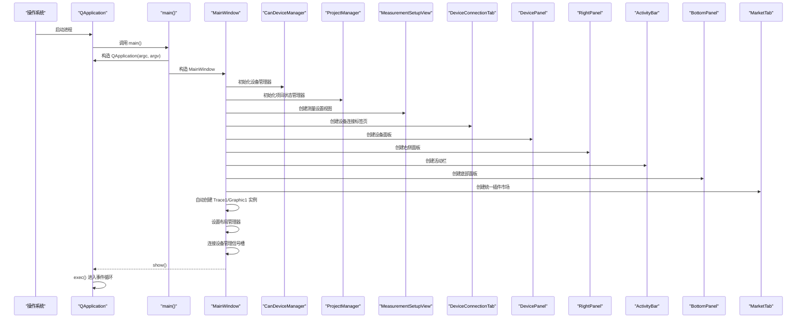

图表来源
- [src/main.cpp](file://src/main.cpp)
- [src/ui/mainwindow.cpp](file://src/ui/mainwindow.cpp)
- [src/core/candevicemanager.cpp](file://src/core/candevicemanager.cpp)
- [src/ui/deviceconnectiontab.cpp](file://src/ui/deviceconnectiontab.cpp)
- [src/ui/markettab.cpp](file://src/ui/markettab.cpp)

## 详细组件分析

### MainWindow 类设计与接口
- **继承关系**
  - MainWindow 继承自 QMainWindow，具备标准窗口行为（菜单、工具栏、状态栏、中心部件等）。
  - 重构后采用组合模式，管理多个子组件的生命周期，并集成了 CanDeviceManager 设备管理器。
- **成员变量**
  - 子组件指针：ActivityBar、RightPanel、BottomPanel、FilterBar 等。
  - 设备管理器指针：CanDeviceManager* m_deviceManager 用于管理CAN设备。
  - 设备连接标签页指针：DeviceConnectionTab* m_deviceTab 用于设备配置。
  - 布局管理器：QSplitter、QTabWidget、QStackedWidget 等。
  - 业务控制器：解耦 UI 与业务逻辑。
  - 状态标志：记录当前模式、数据加载状态、错误信息等。
  - **新增**：实例跟踪映射表 m_traceInstances 和 m_graphicInstances，用于管理 Trace 和 Graphic 实例。
  - **新增**：MeasurementSetupView* m_setupView 用于Flow画布管理。
  - **新增**：MarketTab* m_marketTab 用于统一插件市场管理。
- **方法接口**
  - 构造函数：完成所有子组件的初始化和布局设置。
  - setupLayout：设置复杂的嵌套布局结构。
  - connectSignals：集中管理所有信号槽连接。
  - updateState：统一的状态管理接口。
  - setupDeviceTab：设置设备连接标签页。
  - onQuickConnect：快速连接设备。
  - onQuickDisconnect：快速断开设备。
  - onOpenDeviceTab：打开设备标签页。
  - **新增**：onNewGraphicRequested：请求创建新的 Graphic 视图。
  - **增强**：openTab：增强的标签页打开方法，支持重复检查。
  - **新增**：captureProjectState/applyProjectState：项目状态捕获和应用。
  - **新增**：setupMarketTab/onOpenMarketTab：统一插件市场标签页管理。
  - 事件处理函数：响应各种用户交互。

**更新** 基于最新的 CanDeviceManager 集成、自动实例创建功能、简化的项目状态管理，以及统一的插件市场系统，MainWindow 类现在提供了完整的设备管理能力、实例跟踪机制、Flow画布集成、改进的标签页管理功能和统一的插件市场管理功能。

#### 类图（基于重构后的源码结构）
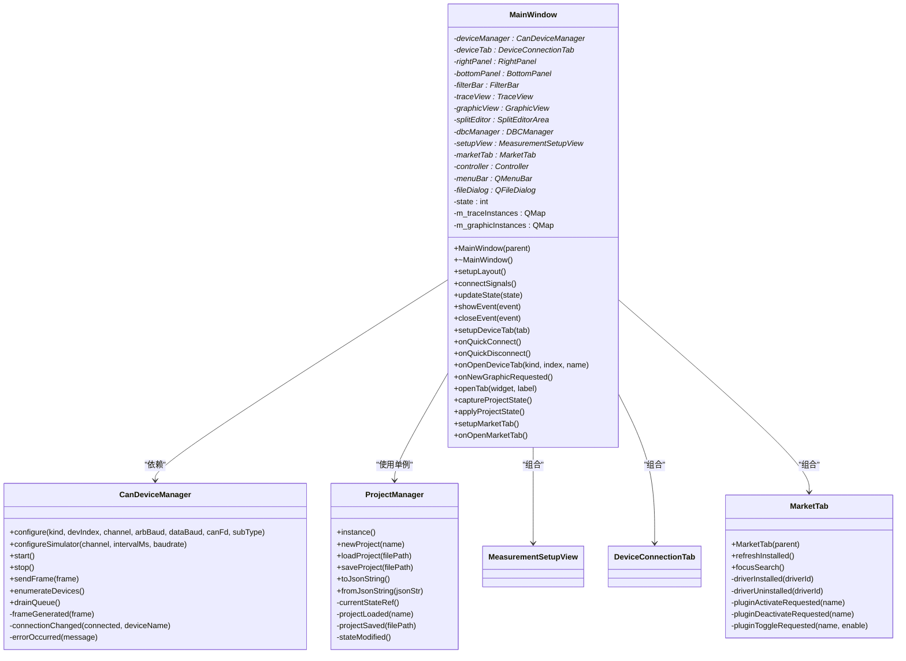

图表来源
- [src/ui/mainwindow.h](file://src/ui/mainwindow.h)
- [src/ui/mainwindow.cpp](file://src/ui/mainwindow.cpp)
- [src/core/candevicemanager.h](file://src/core/candevicemanager.h)
- [src/core/projectmanager.h](file://src/core/projectmanager.h)
- [src/ui/measurementsetupview.h](file://src/ui/measurementsetupview.h)
- [src/ui/markettab.h](file://src/ui/markettab.h)

### 模块化布局系统
- **分层布局架构**
  - 顶层使用 QSplitter 进行主要区域分割。
  - 左侧为 ActivityBar，中间为主内容区，右侧为 RightPanel。
  - 底部为 BottomPanel，显示日志和状态信息。
- **动态面板管理**
  - 支持面板的动态显示/隐藏。
  - 面板内容的动态切换和更新。
  - 响应式布局调整。
- **状态同步机制**
  - 子组件间通过信号槽进行通信。
  - 统一的狀態管理接口。
  - 避免循环依赖和数据竞争。

章节来源
- [src/ui/mainwindow.cpp](file://src/ui/mainwindow.cpp)
- [src/ui/activitybar.cpp](file://src/ui/activitybar.cpp)
- [src/ui/rightpanel.cpp](file://src/ui/rightpanel.cpp)
- [src/ui/bottompanel.cpp](file://src/ui/bottompanel.cpp)

### 事件处理与状态管理
- **事件处理**
  - 菜单动作、工具栏按钮、右键菜单、快捷键等通过 QAction 与信号槽连接至槽函数。
  - 自定义事件可通过重写事件处理器实现。
  - 支持拖拽操作和手势识别。
  - 增强了设备管理相关的事件处理。
- **状态管理**
  - 使用成员变量记录应用状态。
  - 状态变化触发界面更新。
  - 支持状态的持久化和恢复。
  - 增强了设备连接状态的管理。

章节来源
- [src/ui/mainwindow.cpp](file://src/ui/mainwindow.cpp)

### 样式与资源加载
- **样式表 default.qss 通过资源文件 resources.qrc 打包**，在应用启动时加载并设置到 QApplication，确保全局样式一致。
- **支持主题切换和动态样式更新**。
- **建议在 qss 中集中管理颜色、字体、边距等视觉规范**，避免硬编码。

章节来源
- [resources/resources.qrc](file://resources/resources.qrc)
- [resources/styles/default.qss](file://resources/styles/default.qss)

### 程序入口与启动流程
- **main.cpp 负责创建 QApplication 实例、设置应用元信息、构造并显示 MainWindow**，最后进入事件循环。
- **可在 main 中进行全局初始化（如日志、样式、国际化）与异常保护**。

章节来源
- [src/main.cpp](file://src/main.cpp)

## CanDeviceManager集成

### 设备管理器架构设计
CanDeviceManager 作为统一的设备管理抽象层，提供了对模拟器和真实硬件设备的无缝切换能力：

- **设备类型支持**：支持模拟器（内置）、ZLG 致远电子等设备类型
- **统一接口**：对外暴露与 CanSimulator 相同的信号接口（frameGenerated）
- **异步处理**：使用独立接收线程和无锁队列处理高并发数据流
- **状态管理**：完整的设备状态管理和错误处理机制
- **子类型支持**：支持厂商设备子类型信息传递，提供更精确的设备识别

### 设备配置与管理
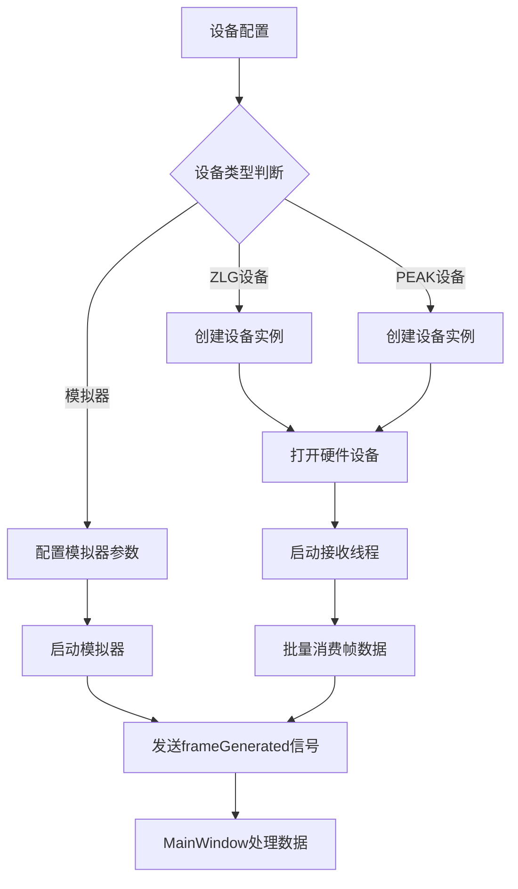

图表来源
- [src/core/candevicemanager.cpp](file://src/core/candevicemanager.cpp)

### 设备枚举和发现
- **自动设备扫描**：支持自动检测可用的CAN设备
- **设备信息展示**：显示设备名称、型号等详细信息
- **多设备支持**：同时支持多个设备实例

章节来源
- [src/core/candevicemanager.h](file://src/core/candevicemanager.h)
- [src/core/candevicemanager.cpp](file://src/core/candevicemanager.cpp)

## 设备标签管理系统

### 设备标签页架构
DeviceConnectionTab 提供了完整的设备配置界面，支持多种设备类型的参数设置：

- **基本配置**：CAN模式选择（Classic/FD）、通道使能配置
- **仲裁段配置**：波特率设置、时序预设选择
- **数据段配置**：CAN FD数据波特率、时序参数配置
- **连接控制**：连接/断开按钮、状态显示
- **子类型支持**：支持厂商设备子类型信息的传递和处理

### 设备配置界面
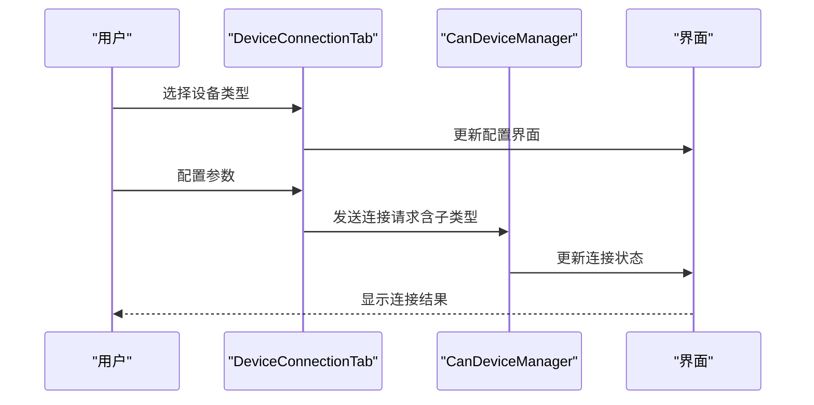

图表来源
- [src/ui/deviceconnectiontab.cpp](file://src/ui/deviceconnectiontab.cpp)

### 设备面板管理
DevicePanel 负责设备列表的显示和管理：

- **设备树形结构**：按设备厂商分类显示
- **实时更新**：支持设备热插拔检测
- **快捷操作**：双击设备直接打开配置页面
- **新增设备入口**：通过「＋新增设备」按钮跳转到统一插件市场

章节来源
- [src/ui/deviceconnectiontab.h](file://src/ui/deviceconnectiontab.h)
- [src/ui/deviceconnectiontab.cpp](file://src/ui/deviceconnectiontab.cpp)
- [src/ui/panels/sidebarpanels.h](file://src/ui/panels/sidebarpanels.h)
- [src/ui/panels/sidebarpanels.cpp](file://src/ui/panels/sidebarpanels.cpp)

## 快速连接/断开功能

### 右侧面板快捷操作
RightPanel 提供了便捷的快速连接/断开功能：

- **一键连接**：快速连接最近使用的设备
- **一键断开**：快速断开当前连接的设备
- **状态同步**：与设备管理器状态保持同步
- **用户反馈**：实时显示连接状态和操作结果

### 快捷操作流程
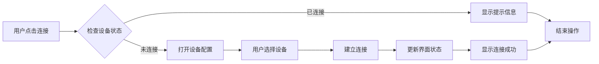

图表来源
- [src/ui/rightpanel.cpp](file://src/ui/rightpanel.cpp)

### 状态管理机制
- **实时状态更新**：设备连接状态变化时立即更新界面
- **错误处理**：连接失败时显示详细的错误信息
- **用户提示**：操作过程中提供清晰的反馈信息

章节来源
- [src/ui/rightpanel.h](file://src/ui/rightpanel.h)
- [src/ui/rightpanel.cpp](file://src/ui/rightpanel.cpp)

## 统一收发面板与信号发送增强

### 统一收发面板集成
TransceivePanel 将发送、回放、录制三个入口统一到侧边栏，减少分散操作路径，提升用户效率：

- **入口聚合**：发送、回放、录制按钮集中在收发面板
- **信号桥接**：点击对应按钮后向 MainWindow 发射 openSendRequested/openPlaybackRequested/openRecordRequested
- **标签页联动**：ActivityBar 切换到"收发"活动时仅显示侧边栏面板，不自动打开标签页，由用户点击触发

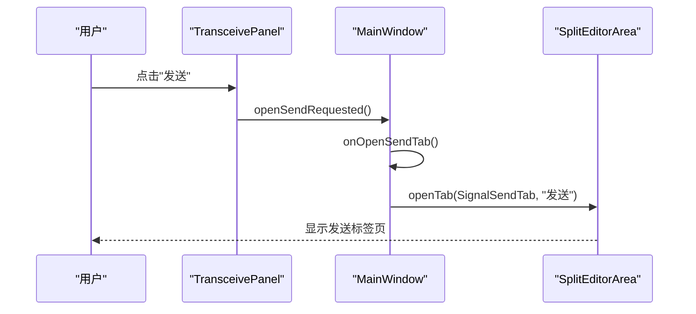

图表来源
- [src/ui/panels/sidebarpanels.h](file://src/ui/panels/sidebarpanels.h)
- [src/ui/panels/sidebarpanels.cpp](file://src/ui/panels/sidebarpanels.cpp)
- [src/ui/mainwindow.cpp](file://src/ui/mainwindow.cpp)

### 信号发送增强
SignalSendTab 提供丰富的发送能力：

- **单帧发送**：输入 ID、DLC、数据，点击"发送单帧"立即发送
- **行发送**：每行可配置周期(ms)和次数，点击"发送"开始周期性发送，点击"停止"终止
- **列表发送/停止**：勾选多行后点击"列表发送"批量开始，"列表停止"批量停止
- **DBC 导入**：从 DBC 中选择消息批量加入发送列表，自动填充 DLC、周期等
- **信号级编辑**：根据 DBC 消息生成信号控件（数值或枚举），修改信号值自动更新 Hex 数据
- **上下移动与重编号**：支持行顺序调整与序号重排

```mermaid
flowchart TD
A[编辑ID/DLC/数据] --> B{是否从DBC导入?}
B --> |是| C[选择消息并添加到列表]
B --> |否| D[手动添加或编辑现有行]
C --> E[配置周期/次数]
D --> E
E --> F{发送模式}
F --> |单帧| G[emit sendSingleRequested(id,data)]
F --> |行发送| H[emit sendRowRequested(row,id,data,period,count)]
F --> |列表发送| I[遍历勾选行执行行发送]
G --> J[MainWindow转发到设备]
H --> J
I --> J
```

图表来源
- [src/ui/signalsendtab.h](file://src/ui/signalsendtab.h)
- [src/ui/signalsendtab.cpp](file://src/ui/signalsendtab.cpp)
- [src/ui/mainwindow.cpp](file://src/ui/mainwindow.cpp)

### 与设备管理的协作
- 单帧发送通过 CanDeviceManager::sendFrame 发送到当前设备
- 行发送由 MainWindow 使用 QTimer 管理周期发送，并在停止时清理定时器
- 列表发送/停止通过 SignalSendTab 的信号统一分发

章节来源
- [src/ui/signalsendtab.h](file://src/ui/signalsendtab.h)
- [src/ui/signalsendtab.cpp](file://src/ui/signalsendtab.cpp)
- [src/ui/mainwindow.h](file://src/ui/mainwindow.h)
- [src/ui/mainwindow.cpp](file://src/ui/mainwindow.cpp)

## 统一插件市场系统

### 统一插件市场架构
MarketTab 作为统一的插件市场标签页，整合了原本分散的 AddDeviceTab 和 ExtensionsTab 功能，提供统一的驱动和插件管理界面：

- **统一入口**：设备面板的「＋新增设备」按钮现在直接跳转到插件市场标签页
- **四象限管理**：已安装驱动、已安装插件、市场驱动、市场插件的统一管理界面
- **智能搜索**：支持多词 AND 搜索，可按驱动/插件筛选
- **详情展示**：右栏详情页支持图文说明、设备简表、Markdown 文档
- **操作集成**：安装、更新、启用、禁用、卸载等操作统一在详情页完成

### 插件市场工作流程
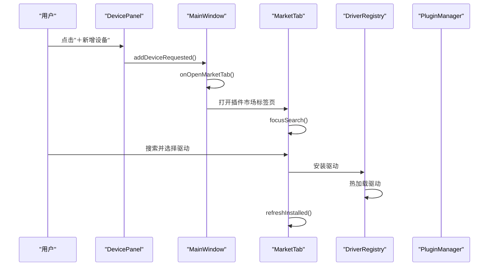

图表来源
- [src/ui/panels/sidebarpanels.cpp](file://src/ui/panels/sidebarpanels.cpp)
- [src/ui/mainwindow.cpp](file://src/ui/mainwindow.cpp)
- [src/ui/markettab.cpp](file://src/ui/markettab.cpp)

### 信号连接机制
MarketTab 通过以下信号与 MainWindow 集成：

- **pluginActivateRequested**：请求激活插件
- **pluginDeactivateRequested**：请求停用插件  
- **pluginToggleRequested**：请求启用/禁用插件
- **driverInstalled**：驱动安装完成通知
- **driverUninstalled**：驱动卸载完成通知

### 与设备管理的协作
- 设备面板的「＋新增设备」按钮连接到 onOpenMarketTab
- 插件市场打开后自动聚焦搜索框，便于用户快速查找
- 驱动安装完成后自动刷新设备列表
- 插件操作通过 PluginManager 统一管理

章节来源
- [src/ui/markettab.h](file://src/ui/markettab.h)
- [src/ui/markettab.cpp](file://src/ui/markettab.cpp)
- [src/ui/mainwindow.cpp](file://src/ui/mainwindow.cpp)
- [src/ui/panels/sidebarpanels.h](file://src/ui/panels/sidebarpanels.h)

## 自动实例创建系统

### 默认实例管理机制
MainWindow 现在实现了智能的默认实例创建机制，为 Trace1 和 Graphic1 提供自动化的实例管理：

- **自动创建**：应用启动时自动创建默认的 Trace1 和 Graphic1 实例
- **实例跟踪**：使用 QMap 跟踪所有创建的实例，支持动态管理
- **生命周期管理**：自动处理实例的创建、销毁和资源清理
- **Flow画布集成**：将实例注册到 Flow 画布，支持可视化编排
- **唯一性保证**：确保每个实例ID的唯一性
- **智能编号**：自动生成递增的实例编号

### 实例创建流程图
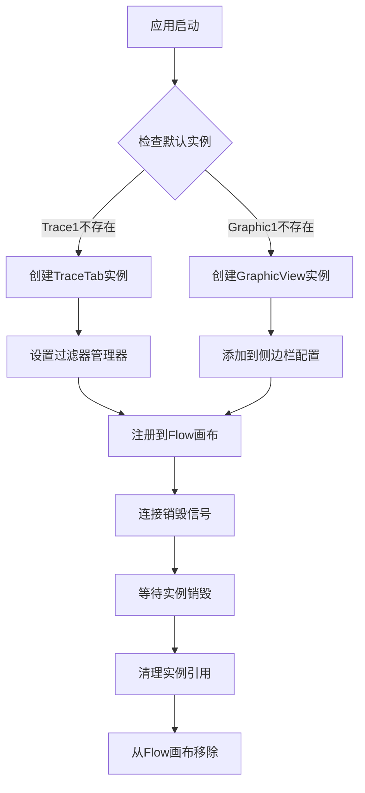

图表来源
- [src/ui/mainwindow.cpp](file://src/ui/mainwindow.cpp)

### 实例管理特性
- **唯一性保证**：确保每个实例ID的唯一性
- **智能编号**：自动生成递增的实例编号
- **状态同步**：实例状态与Flow画布保持同步
- **错误恢复**：实例销毁时的自动清理机制

章节来源
- [src/ui/mainwindow.cpp](file://src/ui/mainwindow.cpp)

## 简化的项目状态管理

### 项目状态管理架构
ProjectManager 提供了简化的项目状态管理，支持工程的创建、加载、保存和切换：

- **简化接口**：提供简洁的API进行项目状态管理
- **状态持久化**：支持项目状态的JSON序列化和反序列化
- **向后兼容**：支持v1和v2格式的相互转换
- **资源管理**：管理DBC文件、录制文件等资源路径
- **设备配置**：保存和恢复设备配置信息

### 项目状态流程
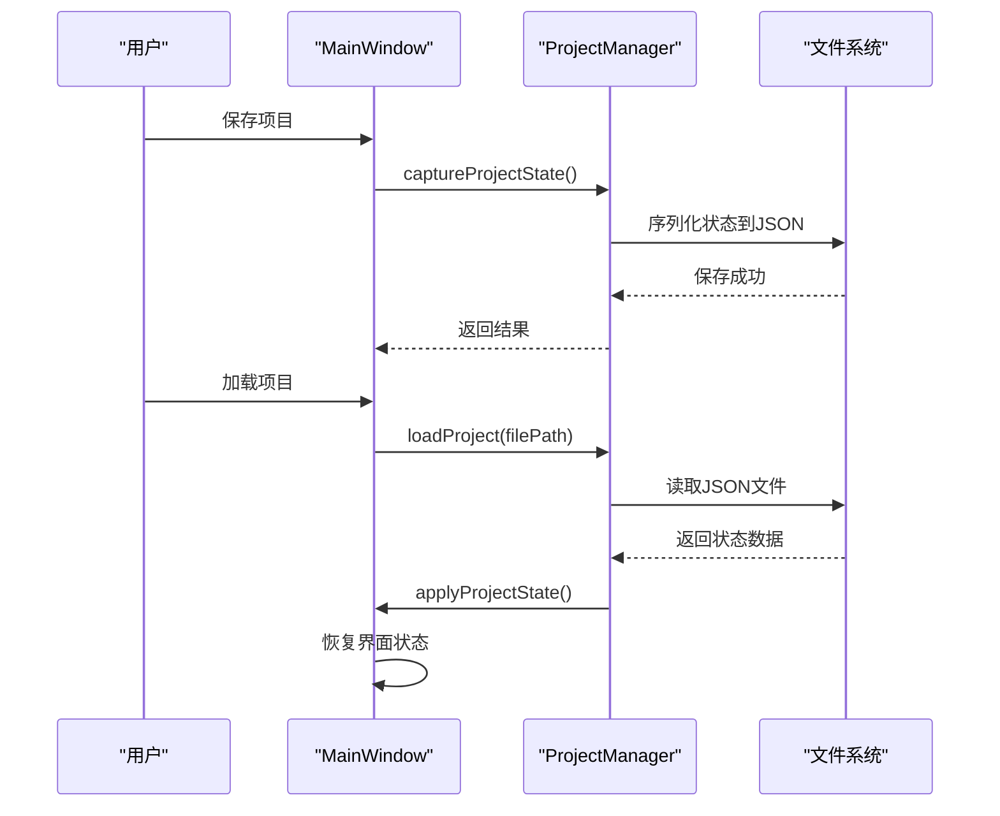

图表来源
- [src/core/projectmanager.cpp](file://src/core/projectmanager.cpp)
- [src/ui/mainwindow.cpp](file://src/ui/mainwindow.cpp)

### 状态捕获和应用
- **captureProjectState**：捕获当前应用状态到ProjectState结构
- **applyProjectState**：从ProjectState恢复应用状态
- **资源路径管理**：支持相对路径和绝对路径的转换
- **设备配置恢复**：恢复设备连接配置但不自动连接

章节来源
- [src/core/projectmanager.h](file://src/core/projectmanager.h)
- [src/core/projectmanager.cpp](file://src/core/projectmanager.cpp)
- [src/ui/mainwindow.cpp](file://src/ui/mainwindow.cpp)

## 标签页管理与资源清理

### 增强的标签页管理
MainWindow 现在提供了更健壮的标签页管理功能，包含完整的资源清理机制：

- **重复检查**：防止创建同名标签页
- **智能查找**：自动查找现有标签页或创建新的
- **资源清理**：确保标签页关闭时释放所有资源
- **状态同步**：标签页状态与侧边栏面板保持同步
- **Flow画布同步**：标签页变化时自动更新Flow画布

### 资源清理机制
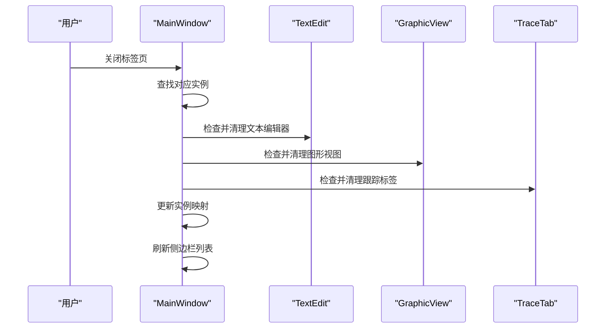

图表来源
- [src/ui/mainwindow.cpp](file://src/ui/mainwindow.cpp)

### 删除操作改进
- **安全删除**：使用 QTimer::singleShot 延迟删除，避免事件循环冲突
- **完整清理**：确保所有相关资源都被正确释放
- **状态恢复**：删除后自动切换到合适的标签页
- **错误处理**：删除失败时的回滚机制

章节来源
- [src/ui/mainwindow.cpp](file://src/ui/mainwindow.cpp)

## 依赖关系分析
- **构建依赖**
  - CMake 管理 Qt 模块（Core、Gui、Widgets、UiTools）、源文件与资源文件。
- **运行时依赖**
  - MainWindow 依赖多个子组件和 Qt 框架。
  - 新增对 CanDeviceManager 的依赖，用于设备管理和状态同步。
  - 设备标签页依赖 CanDeviceManager 和设备配置接口。
  - 子组件间通过信号槽进行松耦合通信。
  - 样式表通过资源系统加载，避免路径问题。
  - **新增**：ProjectManager 单例用于项目状态管理。
  - **新增**：MeasurementSetupView 用于Flow画布管理。
  - **新增**：TransceivePanel 与 SignalSendTab 集成，统一收发入口。
  - **新增**：MarketTab 统一插件市场管理，替代原有的 AddDeviceTab 和 ExtensionsTab。

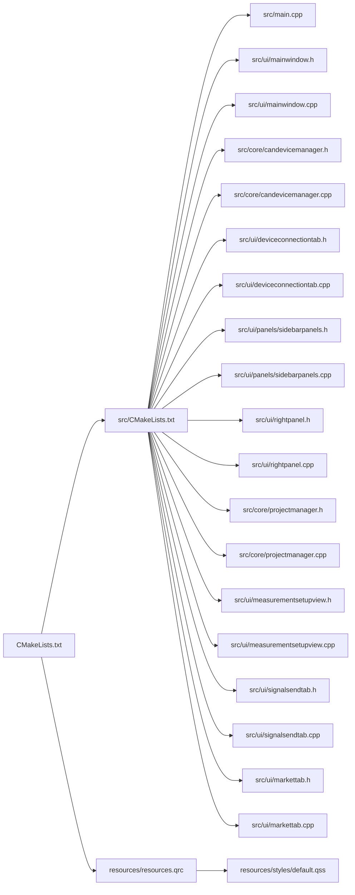

图表来源
- [CMakeLists.txt](file://CMakeLists.txt)
- [src/CMakeLists.txt](file://src/CMakeLists.txt)
- [src/main.cpp](file://src/main.cpp)
- [src/ui/mainwindow.h](file://src/ui/mainwindow.h)
- [src/ui/mainwindow.cpp](file://src/ui/mainwindow.cpp)
- [src/core/candevicemanager.h](file://src/core/candevicemanager.h)
- [src/core/candevicemanager.cpp](file://src/core/candevicemanager.cpp)
- [src/core/projectmanager.h](file://src/core/projectmanager.h)
- [src/core/projectmanager.cpp](file://src/core/projectmanager.cpp)
- [src/ui/signalsendtab.h](file://src/ui/signalsendtab.h)
- [src/ui/signalsendtab.cpp](file://src/ui/signalsendtab.cpp)
- [src/ui/markettab.h](file://src/ui/markettab.h)
- [src/ui/markettab.cpp](file://src/ui/markettab.cpp)

章节来源
- [CMakeLists.txt](file://CMakeLists.txt)
- [src/CMakeLists.txt](file://src/CMakeLists.txt)

## 性能考虑
- **UI 初始化**
  - 延迟加载大型资源和耗时计算，避免阻塞首次显示。
  - 合理使用懒加载与分页渲染，减少内存占用。
  - 子组件按需创建和销毁。
  - DBC 文件加载采用异步处理，避免界面卡顿。
  - 设备枚举过程使用后台线程处理。
  - **新增**：自动实例创建采用延迟初始化，避免启动时延。
  - **新增**：项目状态加载采用异步处理，避免界面卡顿。
  - **新增**：插件市场数据加载采用异步处理，避免界面卡顿。
- **事件处理**
  - 避免在槽函数中执行长时间任务，改用线程或异步任务。
  - 合并频繁的信号发射，降低 UI 重绘开销。
  - 使用事件过滤器优化事件处理效率。
  - DBC 解析过程使用后台线程处理。
  - 设备数据接收使用无锁队列提高性能。
  - **优化**：标签页删除操作使用延迟执行，避免事件循环冲突。
  - **优化**：项目状态切换时批量处理资源卸载和加载。
  - **优化**：收发面板仅做入口跳转，避免自动打开标签页造成多余开销。
  - **优化**：插件市场搜索和筛选操作进行防抖处理。
- **样式与资源**
  - 样式表尽量精简，避免过多选择器与复杂规则。
  - 资源文件按模块拆分，按需加载。
  - 支持资源缓存和复用。
  - DBC 文件信息缓存机制提高重复访问性能。
  - 设备状态缓存减少重复查询。
  - **增强**：实例管理使用映射表，提高查找效率。
  - **增强**：项目状态JSON序列化使用高效的nlohmann库。
  - **增强**：插件市场图片采用磁盘缓存机制。

## 故障排查指南
- **常见问题**
  - UI 控件未找到：检查 .ui 控件名称与代码中使用的一致性。
  - 样式未生效：确认 qss 路径正确且已加载；检查选择器语法。
  - 信号槽连接失败：核对信号与槽签名匹配，确保对象生命周期有效。
  - 崩溃或无响应：检查是否在 UI 线程执行了耗时操作；使用调试器定位堆栈。
  - 布局错乱：检查布局管理器的嵌套关系和约束条件。
  - 内存泄漏：使用智能指针和正确的父子关系管理。
  - DBC 文件加载失败：检查文件格式是否正确，权限是否足够。
  - 信号解析错误：验证 DBC 文件是否符合 CAN 标准格式。
  - 设备连接失败：检查设备驱动是否正常安装，USB连接是否稳定。
  - 设备枚举失败：确认设备驱动程序已正确加载。
  - 数据接收异常：检查波特率配置是否与设备匹配。
  - **新增**：实例创建失败：检查实例ID是否重复，确保唯一性。
  - **新增**：标签页删除崩溃：确认使用延迟删除机制，避免事件循环冲突。
  - **新增**：项目状态保存失败：检查JSON序列化是否成功，文件权限是否正确。
  - **新增**：项目状态加载失败：检查JSON格式兼容性，版本迁移是否正确。
  - **新增**：Flow画布不同步：检查实例注册和注销是否正确配对。
  - **新增**：收发面板点击无效：确认 TransceivePanel 信号已连接到 MainWindow。
  - **新增**：信号发送无响应：检查 SignalSendTab 信号是否被 MainWindow 正确处理。
  - **新增**：设备错误未显示：确认 CanDeviceManager::errorOccurred 已连接到 BottomPanel。
  - **新增**：插件市场无法打开：检查 MarketTab 初始化是否成功。
  - **新增**：设备面板跳转失效：确认 addDeviceRequested 信号已连接到 onOpenMarketTab。
  - **新增**：插件安装失败：检查网络连接和插件包完整性。
  - **新增**：驱动热加载失败：确认驱动包格式正确且签名验证通过。
- **调试技巧**
  - 使用 qDebug/QLoggingCategory 输出关键状态。
  - 在关键槽函数前后打印日志，观察调用顺序。
  - 使用 Qt Creator 断点与变量监视定位问题。
  - 启用 Qt 调试输出查看信号槽连接状态。
  - 使用 DBC 文件验证工具检查文件格式正确性。
  - 使用设备诊断工具检查硬件连接状态。
  - 监控设备接收线程的CPU占用情况。
  - **新增**：使用实例跟踪调试工具监控实例生命周期。
  - **新增**：检查标签页映射表的完整性，确保无悬挂引用。
  - **新增**：监控项目状态JSON文件大小和序列化时间。
  - **新增**：验证Flow画布实例块与实际标签页的一致性。
  - **新增**：检查收发面板按钮信号连接与标签页打开逻辑。
  - **新增**：验证 SignalSendTab 的行发送定时器创建与销毁。
  - **新增**：检查插件市场网络连接和市场索引加载状态。
  - **新增**：验证设备面板到插件市场的信号连接链路。

**章节来源**
- [src/ui/mainwindow.cpp](file://src/ui/mainwindow.cpp)
- [src/core/candevicemanager.cpp](file://src/core/candevicemanager.cpp)
- [src/core/projectmanager.cpp](file://src/core/projectmanager.cpp)
- [resources/styles/default.qss](file://resources/styles/default.qss)
- [src/ui/signalsendtab.cpp](file://src/ui/signalsendtab.cpp)
- [src/ui/panels/sidebarpanels.cpp](file://src/ui/panels/sidebarpanels.cpp)
- [src/ui/markettab.cpp](file://src/ui/markettab.cpp)

## 结论
MainWindow 作为应用的核心容器，承担界面初始化、事件分发与状态协调职责。经过重大重构后，采用了现代化的模块化架构，通过清晰的继承关系、合理的成员设计、完善的信号槽机制以及与子组件的解耦，实现了高内聚、低耦合的可维护界面层。新的布局系统支持复杂的多面板界面管理，显著提升了用户体验和开发效率。最新的 CanDeviceManager 集成、设备标签管理、快速连接/断开功能，以及全新的自动实例创建系统和简化的项目状态管理机制，进一步提升了系统的设备管理能力和用户体验。本次更新统一了插件市场入口，将原本分散的 AddDeviceTab 和 ExtensionsTab 功能整合到统一的 MarketTab 中，提供了更一致的插件和驱动管理体验。Flow画布的引入使得模块编排更加直观和灵活。遵循本文最佳实践与注意事项，可显著提升扩展性与稳定性。

## 附录

### 扩展主窗口功能的步骤
- **新增子组件**
  - 创建新的组件类，继承自 QWidget 或相应的基类。
  - 在 MainWindow 中添加组件指针和初始化代码。
  - 在布局管理器中添加组件并设置属性。
- **添加新功能面板**
  - 在 ActivityBar 中添加新的按钮项。
  - 创建对应的面板组件并实现功能逻辑。
  - 连接信号槽实现面板切换和内容更新。
- **处理复杂事件**
  - 重写事件处理器或使用事件过滤器。
  - 将耗时逻辑移至工作线程，通过信号通知 UI 更新。
  - 实现自定义事件类型和处理机制。
- **集成设备管理功能**
  - 使用 CanDeviceManager 类提供的接口管理设备状态。
  - 处理设备连接和断开过程中的信号和错误事件。
  - 更新 UI 组件以反映设备状态的变化。
- **实现自动实例创建**
  - 在 MainWindow 中添加实例跟踪映射表。
  - 实现实例创建和销毁的生命周期管理。
  - 集成到 Flow 画布进行可视化编排。
- **集成项目状态管理**
  - 使用 ProjectManager 单例进行项目状态管理。
  - 实现状态捕获和应用的逻辑。
  - 处理项目切换时的资源清理和重建。
- **集成收发面板**
  - 在 SideBar 中添加 TransceivePanel。
  - 将收发面板按钮信号连接到 MainWindow。
  - 实现标签页打开与状态同步。
- **集成统一插件市场**
  - 在 MainWindow 中添加 MarketTab 成员变量。
  - 实现 setupMarketTab 和 onOpenMarketTab 方法。
  - 连接设备面板的 addDeviceRequested 信号到 onOpenMarketTab。
  - 实现插件操作的信号槽连接。

**章节来源**
- [src/ui/mainwindow.h](file://src/ui/mainwindow.h)
- [src/ui/mainwindow.cpp](file://src/ui/mainwindow.cpp)
- [src/ui/activitybar.h](file://src/ui/activitybar.h)
- [src/ui/panels/sidebarpanels.h](file://src/ui/panels/sidebarpanels.h)
- [src/ui/markettab.h](file://src/ui/markettab.h)

### 常见陷阱与避免方法
- **在构造函数中直接访问未创建的控件导致空指针**。
  - 解决：确保在 setupUi 之后访问控件，使用智能指针管理生命周期。
- **信号槽连接顺序错误导致无效连接**。
  - 解决：先创建对象再连接，必要时使用静态断言检查签名。
- **样式表路径错误或资源未打包**。
  - 解决：使用 :/ 前缀引用资源，检查 qrc 配置。
- **在主线程执行阻塞操作导致界面卡死**。
  - 解决：使用 QThread/QRunnable/QFuture 异步处理。
- **布局管理器嵌套过深导致性能问题**。
  - 解决：简化布局结构，使用合适的布局策略。
- **子组件间循环依赖导致内存泄漏**。
  - 解决：使用弱引用或事件驱动通信，避免直接持有对方指针。
- **DBC 文件加载时阻塞 UI 线程**。
  - 解决：使用异步加载机制，提供进度反馈和取消操作。
- **大文件解析导致内存溢出**。
  - 解决：实现流式解析和内存池管理，及时释放不需要的数据。
- **设备连接时阻塞主线程**。
  - 解决：使用异步连接机制，提供连接进度和取消操作。
- **设备数据接收线程安全**。
  - 解决：使用无锁队列和适当的同步机制。
- **设备枚举时UI冻结**。
  - 解决：在后台线程执行设备扫描，通过信号通知UI更新。
- **新增**：实例创建时ID冲突。
  - 解决：实现唯一的实例ID生成算法，确保实例标识符的唯一性。
- **新增**：标签页删除时的事件循环冲突。
  - 解决：使用 QTimer::singleShot 延迟删除操作，避免在事件处理期间修改UI结构。
- **新增**：实例销毁时的资源泄露。
  - 解决：实现完整的析构链，确保所有相关资源都被正确释放。
- **新增**：项目状态序列化失败。
  - 解决：实现异常处理和降级方案，确保应用稳定性。
- **新增**：Flow画布与标签页不同步。
  - 解决：使用信号槽机制确保两者状态一致性，添加同步检查机制。
- **新增**：设备子类型信息丢失。
  - 解决：确保整个连接管道中子类型信息的正确传递和存储。
- **新增**：收发面板按钮无效。
  - 解决：确认 TransceivePanel 信号已连接到 MainWindow，并实现对应槽函数。
- **新增**：信号发送行定时器未清理。
  - 解决：在停止发送时正确删除 QTimer，避免内存泄漏。
- **新增**：设备错误未显示。
  - 解决：确保 CanDeviceManager::errorOccurred 已连接到 BottomPanel 输出。
- **新增**：插件市场跳转失败。
  - 解决：确认设备面板的 addDeviceRequested 信号已正确连接到 onOpenMarketTab。
- **新增**：插件市场搜索无响应。
  - 解决：检查 MarketTab 的搜索框连接和 rebuildList 方法实现。
- **新增**：插件安装后列表未刷新。
  - 解决：确保 DriverRegistry::driversChanged 信号已连接到 refreshInstalled。

**章节来源**
- [src/ui/mainwindow.cpp](file://src/ui/mainwindow.cpp)
- [src/core/candevicemanager.cpp](file://src/core/candevicemanager.cpp)
- [src/core/projectmanager.cpp](file://src/core/projectmanager.cpp)
- [resources/resources.qrc](file://resources/resources.qrc)
- [src/ui/signalsendtab.cpp](file://src/ui/signalsendtab.cpp)
- [src/ui/panels/sidebarpanels.cpp](file://src/ui/panels/sidebarpanels.cpp)
- [src/ui/markettab.cpp](file://src/ui/markettab.cpp)

### 代码示例与最佳实践

#### MainWindow 构造函数实现示例
```cpp
// MainWindow 构造函数典型实现
MainWindow::MainWindow(QWidget *parent) 
    : QMainWindow(parent),
      activityBar(nullptr),
      rightPanel(nullptr),
      bottomPanel(nullptr),
      filterBar(nullptr),
      traceView(nullptr),
      graphicView(nullptr),
      splitEditor(nullptr),
      dbcManager(nullptr),
      deviceManager(nullptr),
      menuBar(nullptr),
      fileDialog(nullptr),
      controller(nullptr),
      currentState(INIT_STATE)
{
    // 初始化 UI
    setupUi(this);
    
    // 设置窗口属性
    this->setWindowTitle("CAN总线分析工具");
    this->setMinimumSize(1200, 800);
    
    // 创建子组件
    createSubComponents();
    
    // 初始化设备管理器
    initializeDeviceManager();
    
    // 初始化 DBC 管理器
    initializeDBCManager();
    
    // 设置布局
    setupLayout();
    
    // 连接信号槽
    connectSignals();
    
    // 初始化状态
    initializeState();
    
    // 加载样式
    loadStyleSheet();
}
```

#### 设备管理器集成示例
```cpp
// 设备管理器初始化
void MainWindow::initializeDeviceManager()
{
    deviceManager = new CanDeviceManager(this);
    
    // 连接设备管理器信号
    connect(deviceManager, &CanDeviceManager::frameGenerated,
            this, &MainWindow::onFrameReceived);
    connect(deviceManager, &CanDeviceManager::connectionChanged,
            this, [this](bool connected, const QString& name) {
        if (connected) {
            statusLabel->setText(QStringLiteral("🔗 已连接: %1").arg(name));
            bottomPanel->appendOutput(QStringLiteral("✅ 硬件已连接: %1").arg(name));
        } else {
            statusLabel->setText("🔗 未连接");
            bottomPanel->appendOutput(QStringLiteral("■ 硬件已断开"));
        }
    });
    connect(deviceManager, &CanDeviceManager::errorOccurred,
            this, [this](const QString& msg) {
                bottomPanel->appendOutput(QStringLiteral("⚠ %1").arg(msg));
            });
}

// 快速连接设备
void MainWindow::onQuickConnect()
{
    // 获取最近使用的设备配置
    QString lastDevice = AppConfig::instance()->getString("device.lastDevice", "");
    if (!lastDevice.isEmpty()) {
        // 尝试连接上次设备
        deviceManager->configure(DeviceKind::ZLG, 0, 0, 500000, 2000000, false, 41);
        deviceManager->start();
    } else {
        // 打开设备配置对话框
        openDeviceConfig();
    }
}
```

#### 项目状态管理示例
```cpp
// 项目状态捕获
void MainWindow::captureProjectState()
{
    auto &st = ProjectManager::instance()->currentStateRef();
    
    // 捕获数据源配置
    if (m_setupView) {
        st.sourceMode = static_cast<int>(m_setupView->currentSource());
        st.filePath = m_setupView->filePath();
    }
    
    // 捕获设备配置
    if (m_deviceTab) {
        st.deviceConfig.fd = m_deviceTab->isCanFd();
        st.deviceConfig.fdBaudrate = m_deviceTab->dataBaudrate();
        st.deviceConfig.type = QStringLiteral("devKind%1").arg(m_deviceTab->deviceKind());
    }
    
    // 捕获Trace和Graphic实例状态
    st.traces.clear();
    st.graphics.clear();
    
    // 只保存默认实例
    if (m_traceInstances.contains("trace1")) {
        ProjectTraceInstance ti;
        ti.id = "trace1";
        ti.title = "Trace1";
        if (auto* tab = qobject_cast<TraceTab*>(m_traceInstances["trace1"])) {
            ti.filterExpression = tab->filterExpression();
        }
        st.traces.append(ti);
    }
    
    if (m_graphicInstances.contains("graphic1")) {
        ProjectGraphicInstance gi;
        gi.id = "graphic1";
        gi.title = "Graphic1";
        if (auto* gv = qobject_cast<GraphicView*>(m_graphicInstances["graphic1"])) {
            for (const auto& sig : gv->signalConfigs()) {
                ProjectSigCfg sc;
                sc.canId = sig.canId;
                sc.name = sig.name;
                sc.extended = sig.extended;
                gi.sigList.append(sc);
            }
        }
        st.graphics.append(gi);
    }
    
    ProjectManager::instance()->currentStateRef() = st;
}

// 项目状态应用
void MainWindow::applyProjectState()
{
    const auto &st = ProjectManager::instance()->currentState();
    
    // 停止所有活动
    m_simulator->stop();
    m_player->stop();
    
    // 清理现有实例
    cleanupExistingInstances();
    
    // 恢复设备配置
    if (m_deviceTab) {
        m_deviceTab->setBaudrate(st.baudrate);
        m_deviceTab->setChannel(st.channel);
        m_deviceTab->setCanFd(st.deviceConfig.fd);
        if (st.deviceConfig.fdBaudrate > 0)
            m_deviceTab->setDataBaudrate(st.deviceConfig.fdBaudrate);
    }
    
    // 恢复默认实例
    restoreDefaultInstances(st);
    
    // 更新Flow画布
    if (m_setupView) {
        m_setupView->clearTraceGraphicInstances();
        for (const auto& t : st.traces)
            m_setupView->addModuleInstance("trace", t.id, t.title);
        for (const auto& g : st.graphics)
            m_setupView->addModuleInstance("graphic", g.id, g.title);
        m_setupView->rebuildScene();
    }
}
```

#### 自动实例创建示例
```cpp
// 自动创建默认实例
void MainWindow::createDefaultInstances()
{
    // 创建默认的 Trace1 实例
    if (!m_traceInstances.contains("trace1")) {
        auto* traceTab = new TraceTab(this);
        setupTraceTab(traceTab);
        
        // 设置过滤器管理器
        if (m_filterPresets) {
            auto* filterBar = traceTab->filterBar();
            if (filterBar)
                filterBar->setPresetManager(m_filterPresets);
        }
        
        // 添加到标签页
        openTab(traceTab, "Trace1");
        m_traceCount = qMax(m_traceCount, 1);
        m_traceInstances["trace1"] = traceTab;
        
        // 连接到 Flow 画布
        if (m_setupView) {
            m_setupView->addModuleInstance("trace", "trace1", "Trace1");
        }
        
        // 连接销毁信号
        connect(traceTab, &QObject::destroyed, this, [this]() {
            m_traceInstances.remove("trace1");
            m_traceTab = nullptr;
            if (m_setupView) {
                m_setupView->removeModuleInstance("trace", "trace1");
            }
        });
    }
    
    // 创建默认的 Graphic1 实例
    if (!m_graphicInstances.contains("graphic1")) {
        auto* graphicView = new GraphicView(this);
        openTab(graphicView, "Graphic1");
        linkGraphicCursor(gv);
        m_graphicInstances["graphic1"] = gv;
        m_graphicView = gv;
        m_sideBar->graphicConfigPanel()->setGraphicView(gv);
        m_graphicCount = qMax(m_graphicCount, 1);
        
        // 连接到 Flow 画布
        if (m_setupView) {
            m_setupView->addModuleInstance("graphic", "graphic1", "Graphic1");
        }
        
        // 连接销毁信号
        connect(graphicView, &QObject::destroyed, this, [this]() {
            m_graphicInstances.remove("graphic1");
            m_graphicView = nullptr;
            if (m_setupView) {
                m_setupView->removeModuleInstance("graphic", "graphic1");
            }
        });
    }
}
```

#### 统一插件市场集成示例
```cpp
// 统一插件市场初始化
void MainWindow::setupMarketTab()
{
    m_marketTab = new MarketTab(this);
    
    // 插件操作请求 → PluginManager（沿用原 ExtensionsTab 的连接）
    connect(m_marketTab, &MarketTab::pluginActivateRequested,
            this, [this](const QString &name) {
        if (m_pluginManager) m_pluginManager->reactivatePlugin(name);
    });
    connect(m_marketTab, &MarketTab::pluginDeactivateRequested,
            this, [this](const QString &name) {
        if (m_pluginManager) m_pluginManager->deactivatePlugin(name);
        if (m_pluginManager) emit m_pluginManager->pluginListChanged();
    });
    connect(m_marketTab, &MarketTab::pluginToggleRequested,
            this, [this](const QString &name, bool enable) {
        if (m_pluginManager) m_pluginManager->setPluginEnabled(name, enable);
    });
    
    // 标签页被关闭后 widget 被删除 → 置空指针，避免悬空引用
    connect(m_marketTab, &QObject::destroyed, this, [this]() {
        m_marketTab = nullptr;
    });
}

// 打开插件市场标签页
void MainWindow::onOpenMarketTab()
{
    // 标签页可能已被关闭并删除，需要重建
    if (!m_marketTab)
        setupMarketTab();
    openTab(m_marketTab, QStringLiteral("插件市场"));
    m_marketTab->refreshInstalled();
    // ＋新增设备跳转后直接聚焦搜索（方案 §13.6）
    m_marketTab->focusSearch();
}
```

**更新** 以上示例展示了重构后 MainWindow 类的典型实现模式，包括模块化组件管理、复杂布局设置、信号槽连接、状态管理、设备管理器集成、设备标签管理、快速连接功能、自动实例创建系统、简化的项目状态管理机制、Flow画布集成，以及统一的插件市场系统。本次更新还包含了收发面板集成、信号发送增强和统一插件市场集成的最佳实践。

**章节来源**
- [src/ui/mainwindow.h](file://src/ui/mainwindow.h)
- [src/ui/mainwindow.cpp](file://src/ui/mainwindow.cpp)
- [src/ui/activitybar.h](file://src/ui/activitybar.h)
- [src/ui/rightpanel.h](file://src/ui/rightpanel.h)
- [src/ui/bottompanel.h](file://src/ui/bottompanel.h)
- [src/core/candevicemanager.h](file://src/core/candevicemanager.h)
- [src/core/dbcmanager.h](file://src/core/dbcmanager.h)
- [src/core/projectmanager.h](file://src/core/projectmanager.h)
- [src/ui/measurementsetupview.h](file://src/ui/measurementsetupview.h)
- [src/ui/signalsendtab.h](file://src/ui/signalsendtab.h)
- [src/ui/panels/sidebarpanels.h](file://src/ui/panels/sidebarpanels.h)
- [src/ui/markettab.h](file://src/ui/markettab.h)