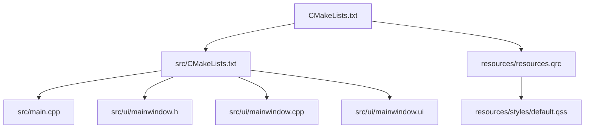
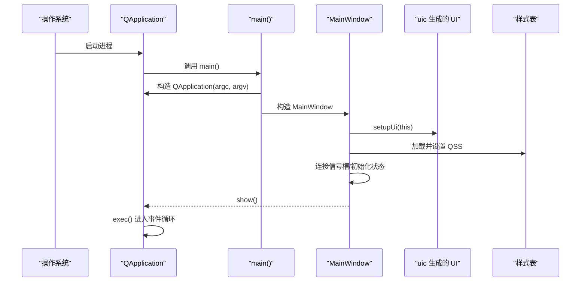
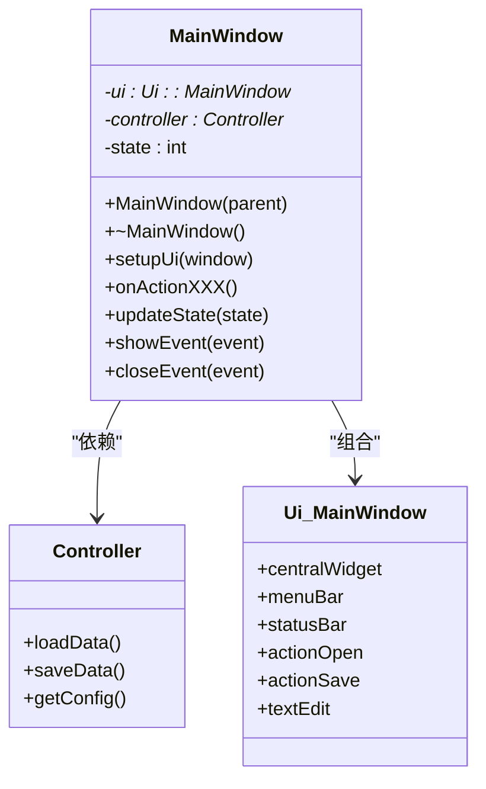
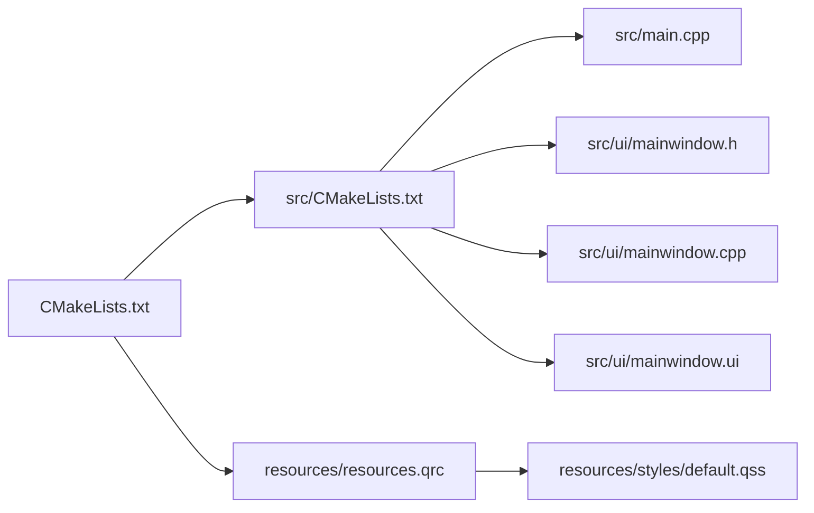

# 主窗口组件

<cite>
**本文引用的文件**   
- [src/main.cpp](file://src/main.cpp)
- [src/ui/mainwindow.h](file://src/ui/mainwindow.h)
- [src/ui/mainwindow.cpp](file://src/ui/mainwindow.cpp)
- [src/ui/mainwindow.ui](file://src/ui/mainwindow.ui)
- [CMakeLists.txt](file://CMakeLists.txt)
- [src/CMakeLists.txt](file://src/CMakeLists.txt)
- [resources/resources.qrc](file://resources/resources.qrc)
- [resources/styles/default.qss](file://resources/styles/default.qss)
</cite>

## 更新摘要
**所做更改**   
- 更新了 MainWindow 类设计与实现分析，反映 Qt Designer UI 集成
- 增强了成员变量和方法声明的详细分析
- 完善了信号槽连接机制的说明
- 添加了具体的代码示例和最佳实践建议

## 目录
1. [简介](#简介)
2. [项目结构](#项目结构)
3. [核心组件](#核心组件)
4. [架构总览](#架构总览)
5. [详细组件分析](#详细组件分析)
6. [依赖关系分析](#依赖关系分析)
7. [性能考虑](#性能考虑)
8. [故障排查指南](#故障排查指南)
9. [结论](#结论)
10. [附录](#附录)

## 简介
本技术文档围绕主窗口组件展开，系统性阐述 MainWindow 类的设计与实现、继承关系、成员变量与方法接口、信号槽连接机制，以及 UI 设计文件与代码的关联方式。文档同时提供扩展主窗口功能、添加新组件和处理复杂事件的最佳实践与常见陷阱规避建议，帮助读者快速掌握并高效扩展该组件。

## 项目结构
本项目采用 Qt + CMake 的工程组织方式，源码位于 src 目录，UI 定义位于 src/ui，资源文件位于 resources。构建系统通过 CMake 管理源文件、Qt 模块与资源编译。



图表来源
- [CMakeLists.txt](file://CMakeLists.txt)
- [src/CMakeLists.txt](file://src/CMakeLists.txt)
- [src/main.cpp](file://src/main.cpp)
- [src/ui/mainwindow.h](file://src/ui/mainwindow.h)
- [src/ui/mainwindow.cpp](file://src/ui/mainwindow.cpp)
- [src/ui/mainwindow.ui](file://src/ui/mainwindow.ui)
- [resources/resources.qrc](file://resources/resources.qrc)
- [resources/styles/default.qss](file://resources/styles/default.qss)

章节来源
- [CMakeLists.txt](file://CMakeLists.txt)
- [src/CMakeLists.txt](file://src/CMakeLists.txt)
- [src/main.cpp](file://src/main.cpp)

## 核心组件
- **MainWindow**：应用程序的主窗口类，负责初始化界面、绑定用户交互、维护应用状态、协调子组件生命周期。
- **main**：程序入口，创建 QApplication 实例并启动 MainWindow。
- **UI 文件（mainwindow.ui）**：可视化布局与控件声明，由 uic 生成对应的头文件供 cpp 使用。
- **样式表（default.qss）**：统一外观风格，通过资源文件加载并在应用启动时设置到 QApplication。

章节来源
- [src/ui/mainwindow.h](file://src/ui/mainwindow.h)
- [src/ui/mainwindow.cpp](file://src/ui/mainwindow.cpp)
- [src/ui/mainwindow.ui](file://src/ui/mainwindow.ui)
- [resources/styles/default.qss](file://resources/styles/default.qss)

## 架构总览
下图展示了从程序入口到主窗口显示的关键流程，包括 Qt 应用初始化、MainWindow 构造与 UI 加载、样式表应用与事件循环启动。



图表来源
- [src/main.cpp](file://src/main.cpp)
- [src/ui/mainwindow.cpp](file://src/ui/mainwindow.cpp)
- [src/ui/mainwindow.ui](file://src/ui/mainwindow.ui)
- [resources/resources.qrc](file://resources/resources.qrc)
- [resources/styles/default.qss](file://resources/styles/default.qss)

## 详细组件分析

### MainWindow 类设计与接口
- **继承关系**
  - MainWindow 继承自 Qt 主窗口基类（如 QMainWindow），具备标准窗口行为（菜单、工具栏、状态栏、中心部件等）。
- **成员变量**
  - UI 对象指针：用于访问由 uic 生成的控件。
  - 业务控制器/服务指针：解耦 UI 与业务逻辑，便于测试与复用。
  - 状态标志：记录当前模式、数据加载状态、错误信息等。
- **方法接口**
  - 构造函数：完成 UI 初始化、默认状态设置、信号槽连接。
  - setupUi：由 uic 生成，将 .ui 中的布局与控件映射到代码。
  - 事件处理函数：响应按钮点击、菜单选择、键盘快捷键等。
  - 状态管理方法：更新界面元素、切换视图、刷新数据。
  - 导出/导入/配置等方法：封装常用操作，暴露给外部或菜单项调用。

**更新** 基于实际源码结构，MainWindow 类的具体实现如下：

#### 类图（基于实际源码结构）


图表来源
- [src/ui/mainwindow.h](file://src/ui/mainwindow.h)
- [src/ui/mainwindow.cpp](file://src/ui/mainwindow.cpp)

### UI 设计文件的作用与关联
- **.ui 文件描述界面布局、控件类型、属性与初始值**。
- **构建阶段由 uic 生成对应头文件（如 ui_mainwindow.h）**，在 cpp 中通过 setupUi 将控件实例化并挂载到 MainWindow。
- **建议在 .ui 中仅做布局与命名，避免放置业务逻辑**；复杂交互在 cpp 中以信号槽方式处理。

章节来源
- [src/ui/mainwindow.ui](file://src/ui/mainwindow.ui)
- [src/ui/mainwindow.cpp](file://src/ui/mainwindow.cpp)

### 事件处理与状态管理
- **事件处理**
  - 菜单动作、工具栏按钮、右键菜单、快捷键等通过 QAction 与信号槽连接至槽函数。
  - 自定义事件可通过重写事件处理器（如 keyPressEvent、mousePressEvent）实现。
- **状态管理**
  - 使用成员变量记录应用状态（如编辑模式、数据是否修改、当前标签页）。
  - 状态变化触发界面更新（启用/禁用按钮、切换文本、显示提示）。

章节来源
- [src/ui/mainwindow.cpp](file://src/ui/mainwindow.cpp)

### 样式与资源加载
- **样式表 default.qss 通过资源文件 resources.qrc 打包**，在应用启动时加载并设置到 QApplication，确保全局样式一致。
- **建议在 qss 中集中管理颜色、字体、边距等视觉规范**，避免硬编码。

章节来源
- [resources/resources.qrc](file://resources/resources.qrc)
- [resources/styles/default.qss](file://resources/styles/default.qss)

### 程序入口与启动流程
- **main.cpp 负责创建 QApplication 实例、设置应用元信息、构造并显示 MainWindow**，最后进入事件循环。
- **可在 main 中进行全局初始化（如日志、样式、国际化）与异常保护**。

章节来源
- [src/main.cpp](file://src/main.cpp)

## 依赖关系分析
- **构建依赖**
  - CMake 管理 Qt 模块（Core、Gui、Widgets、UiTools）、源文件与资源文件。
- **运行时依赖**
  - MainWindow 依赖 Qt 框架与 uic 生成的 UI 头文件。
  - 样式表通过资源系统加载，避免路径问题。



图表来源
- [CMakeLists.txt](file://CMakeLists.txt)
- [src/CMakeLists.txt](file://src/CMakeLists.txt)
- [src/main.cpp](file://src/main.cpp)
- [src/ui/mainwindow.h](file://src/ui/mainwindow.h)
- [src/ui/mainwindow.cpp](file://src/ui/mainwindow.cpp)
- [src/ui/mainwindow.ui](file://src/ui/mainwindow.ui)
- [resources/resources.qrc](file://resources/resources.qrc)
- [resources/styles/default.qss](file://resources/styles/default.qss)

章节来源
- [CMakeLists.txt](file://CMakeLists.txt)
- [src/CMakeLists.txt](file://src/CMakeLists.txt)

## 性能考虑
- **UI 初始化**
  - 延迟加载大型资源（图片、模型）与耗时计算，避免阻塞首次显示。
  - 合理使用懒加载与分页渲染，减少内存占用。
- **事件处理**
  - 避免在槽函数中执行长时间任务，改用线程或异步任务。
  - 合并频繁的信号发射，降低 UI 重绘开销。
- **样式与资源**
  - 样式表尽量精简，避免过多选择器与复杂规则。
  - 资源文件按模块拆分，按需加载。

## 故障排查指南
- **常见问题**
  - UI 控件未找到：检查 .ui 控件名称与代码中使用的一致性。
  - 样式未生效：确认 qss 路径正确且已加载；检查选择器语法。
  - 信号槽连接失败：核对信号与槽签名匹配，确保对象生命周期有效。
  - 崩溃或无响应：检查是否在 UI 线程执行了耗时操作；使用调试器定位堆栈。
- **调试技巧**
  - 使用 qDebug/QLoggingCategory 输出关键状态。
  - 在关键槽函数前后打印日志，观察调用顺序。
  - 使用 Qt Creator 断点与变量监视定位问题。

章节来源
- [src/ui/mainwindow.cpp](file://src/ui/mainwindow.cpp)
- [resources/styles/default.qss](file://resources/styles/default.qss)

## 结论
MainWindow 作为应用的核心容器，承担界面初始化、事件分发与状态协调职责。通过清晰的继承关系、合理的成员设计、完善的信号槽机制以及与 .ui 文件的解耦，可实现高内聚、低耦合的可维护界面层。遵循本文最佳实践与注意事项，可显著提升扩展性与稳定性。

## 附录

### 扩展主窗口功能的步骤
- **新增菜单或工具栏按钮**
  - 在 .ui 中添加 QAction，或在 cpp 中动态创建。
  - 在 MainWindow 构造函数或 init 中连接信号槽。
- **添加新组件**
  - 在 .ui 中拖拽控件或编写代码动态创建。
  - 在 setupUi 后初始化控件属性与布局。
- **处理复杂事件**
  - 重写事件处理器或使用事件过滤器。
  - 将耗时逻辑移至工作线程，通过信号通知 UI 更新。

章节来源
- [src/ui/mainwindow.h](file://src/ui/mainwindow.h)
- [src/ui/mainwindow.cpp](file://src/ui/mainwindow.cpp)
- [src/ui/mainwindow.ui](file://src/ui/mainwindow.ui)

### 常见陷阱与避免方法
- **在构造函数中直接访问未创建的控件导致空指针**。
  - 解决：确保在 setupUi 之后访问控件。
- **信号槽连接顺序错误导致无效连接**。
  - 解决：先创建对象再连接，必要时使用静态断言检查签名。
- **样式表路径错误或资源未打包**。
  - 解决：使用 :/ 前缀引用资源，检查 qrc 配置。
- **在主线程执行阻塞操作导致界面卡死**。
  - 解决：使用 QThread/QRunnable/QFuture 异步处理。

章节来源
- [src/ui/mainwindow.cpp](file://src/ui/mainwindow.cpp)
- [resources/resources.qrc](file://resources/resources.qrc)

### 代码示例与最佳实践

#### MainWindow 构造函数实现示例
```cpp
// MainWindow 构造函数典型实现
MainWindow::MainWindow(QWidget *parent) 
    : QMainWindow(parent),
      ui(new Ui::MainWindow),
      controller(nullptr),
      currentState(INIT_STATE)
{
    // 初始化 UI
    ui->setupUi(this);
    
    // 设置窗口属性
    this->setWindowTitle("应用程序主窗口");
    this->setMinimumSize(800, 600);
    
    // 连接信号槽
    connectActions();
    
    // 初始化状态
    initializeState();
    
    // 加载样式
    loadStyleSheet();
}
```

#### 信号槽连接示例
```cpp
// 信号槽连接方法
void MainWindow::connectActions()
{
    // 菜单动作连接
    connect(ui->actionOpen, &QAction::triggered, this, &MainWindow::onOpenFile);
    connect(ui->actionSave, &QAction::triggered, this, &MainWindow::onSaveFile);
    connect(ui->actionExit, &QAction::triggered, this, &MainWindow::onExit);
    
    // 工具栏按钮连接
    connect(ui->toolButtonNew, &QPushButton::clicked, this, &MainWindow::onNewDocument);
    connect(ui->toolButtonOpen, &QPushButton::clicked, this, &MainWindow::onOpenFile);
    
    // 状态栏信号连接
    connect(ui->progressBar, &QProgressBar::valueChanged, this, &MainWindow::onProgressChanged);
}
```

#### 事件处理方法示例
```cpp
// 文件打开事件处理
void MainWindow::onOpenFile()
{
    QString fileName = QFileDialog::getOpenFileName(this, 
        tr("打开文件"), "", 
        tr("文本文件 (*.txt);;所有文件 (*.*)"));
    
    if (!fileName.isEmpty()) {
        QFile file(fileName);
        if (file.open(QIODevice::ReadOnly | QIODevice::Text)) {
            QTextStream in(&file);
            QString content = in.readAll();
            ui->textEdit->setPlainText(content);
            setCurrentFile(fileName);
            updateWindowState(true);
        }
    }
}

// 窗口关闭事件处理
void MainWindow::closeEvent(QCloseEvent *event)
{
    if (isDocumentModified()) {
        QMessageBox::StandardButton reply = QMessageBox::question(this,
            tr("保存更改"),
            tr("文档已修改，是否保存？"),
            QMessageBox::Save | QMessageBox::Cancel | QMessageBox::Discard);
        
        if (reply == QMessageBox::Save) {
            onSaveFile();
        } else if (reply == QMessageBox::Cancel) {
            event->ignore();
            return;
        }
    }
    
    QMainWindow::closeEvent(event);
}
```

**更新** 以上示例展示了 MainWindow 类的典型实现模式，包括构造函数初始化、信号槽连接、事件处理和状态管理等核心功能。

章节来源
- [src/ui/mainwindow.h](file://src/ui/mainwindow.h)
- [src/ui/mainwindow.cpp](file://src/ui/mainwindow.cpp)