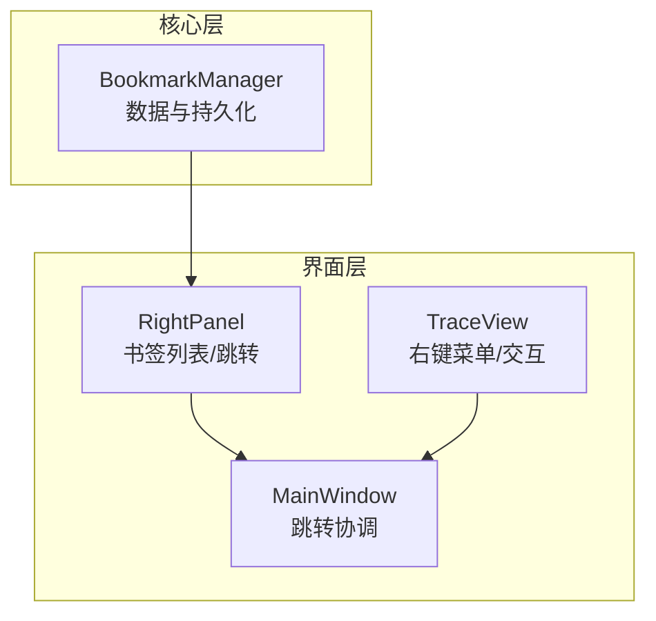
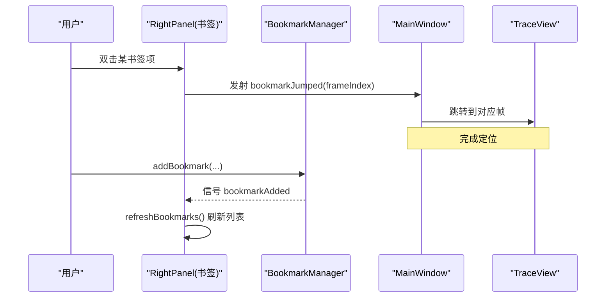
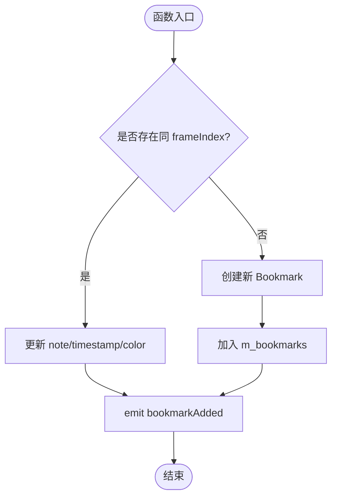
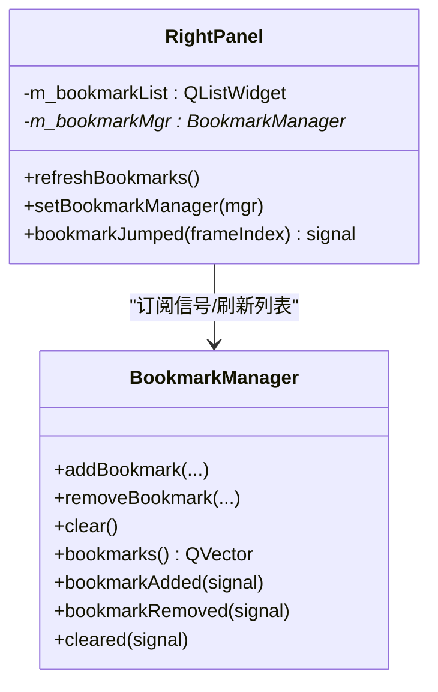

# 书签管理器

<cite>
**本文引用的文件**
- [src/core/bookmarkmanager.h](file://src/core/bookmarkmanager.h)
- [src/core/bookmarkmanager.cpp](file://src/core/bookmarkmanager.cpp)
- [src/ui/rightpanel.h](file://src/ui/rightpanel.h)
- [src/ui/rightpanel.cpp](file://src/ui/rightpanel.cpp)
- [src/ui/traceview.h](file://src/ui/traceview.h)
- [src/ui/mainwindow.cpp](file://src/ui/mainwindow.cpp)
- [README.md](file://README.md)
- [CMakeLists.txt](file://CMakeLists.txt)
</cite>

## 目录
1. [简介](#简介)
2. [项目结构](#项目结构)
3. [核心组件](#核心组件)
4. [架构总览](#架构总览)
5. [详细组件分析](#详细组件分析)
6. [依赖关系分析](#依赖关系分析)
7. [性能考量](#性能考量)
8. [故障排查指南](#故障排查指南)
9. [结论](#结论)
10. [附录](#附录)

## 简介
本文件聚焦于“书签管理器”在 sin（CAN/CAN FD 报文分析工具）中的设计与实现。该功能对标 CANoe Trace 的书签能力，用于对报文列表中的关键帧进行标记、备注、着色与快速跳转，并支持持久化到独立 .sbm 文件或嵌入工程文件。书签管理器通过 Qt 信号槽机制与 UI 层（右侧面板、Trace 视图、主窗口）解耦协作，提供增删改查与文件 I/O 能力。

## 项目结构
与书签相关的代码主要分布在 core 与 ui 两个层次：
- core 层：BookmarkManager 负责数据模型与持久化
- ui 层：RightPanel 展示书签列表并提供跳转；TraceView 提供上下文菜单与交互入口；MainWindow 协调书签跳转等全局行为

图表来源
- [src/core/bookmarkmanager.h:14-48](file://src/core/bookmarkmanager.h#L14-L48)
- [src/ui/rightpanel.h:16-44](file://src/ui/rightpanel.h#L16-L44)
- [src/ui/traceview.h:22-67](file://src/ui/traceview.h#L22-L67)
- [src/ui/mainwindow.cpp:1984-1987](file://src/ui/mainwindow.cpp#L1984-L1987)

章节来源
- [CMakeLists.txt:1-63](file://CMakeLists.txt#L1-L63)

## 核心组件
- BookmarkManager：管理书签集合（frameIndex、note、timestamp、color），提供加载/保存、添加/删除/清空、查找等能力，并通过信号通知变更。
- RightPanel：右侧面板包含“书签”标签页，绑定 BookmarkManager，刷新显示书签列表，双击条目触发跳转。
- TraceView：提供报文列表的上下文菜单与交互入口（如标记、着色等），为书签功能的用户入口之一。
- MainWindow：接收来自 UI 的信号，执行跳转到指定 frameIndex 的操作。

章节来源
- [src/core/bookmarkmanager.h:14-48](file://src/core/bookmarkmanager.h#L14-L48)
- [src/core/bookmarkmanager.cpp:12-114](file://src/core/bookmarkmanager.cpp#L12-L114)
- [src/ui/rightpanel.h:16-44](file://src/ui/rightpanel.h#L16-L44)
- [src/ui/rightpanel.cpp:102-175](file://src/ui/rightpanel.cpp#L102-L175)
- [src/ui/traceview.h:22-67](file://src/ui/traceview.h#L22-L67)
- [src/ui/mainwindow.cpp:1984-1987](file://src/ui/mainwindow.cpp#L1984-L1987)

## 架构总览
书签功能采用“数据-视图-控制器”的分层协作模式：
- 数据层：BookmarkManager 维护书签数据与 JSON 序列化
- 视图层：RightPanel 渲染书签列表，TraceView 提供交互入口
- 控制层：MainWindow 响应 UI 事件，驱动跳转等行为

图表来源
- [src/ui/rightpanel.cpp:121-127](file://src/ui/rightpanel.cpp#L121-L127)
- [src/ui/rightpanel.cpp:152-175](file://src/ui/rightpanel.cpp#L152-L175)
- [src/core/bookmarkmanager.cpp:67-88](file://src/core/bookmarkmanager.cpp#L67-L88)
- [src/ui/mainwindow.cpp:1984-1987](file://src/ui/mainwindow.cpp#L1984-L1987)

## 详细组件分析

### BookmarkManager（数据与持久化）
- 数据结构：Bookmark 包含 frameIndex、note、timestamp、color
- 持久化：以 JSON 格式读写 .sbm 文件，根节点包含 version 与 bookmarks 数组
- 操作：
  - 添加：若已存在同 frameIndex 则更新，否则新增；发出 bookmarkAdded
  - 删除：按 frameIndex 移除；发出 bookmarkRemoved
  - 清空：清空全部；发出 cleared
  - 查找：返回指定 frameIndex 的索引或 -1
- 复杂度：
  - 添加/删除/查找均为 O(n)，n 为书签数量
  - 文件 I/O 受文件大小影响，通常较小

图表来源
- [src/core/bookmarkmanager.cpp:67-88](file://src/core/bookmarkmanager.cpp#L67-L88)

章节来源
- [src/core/bookmarkmanager.h:14-48](file://src/core/bookmarkmanager.h#L14-L48)
- [src/core/bookmarkmanager.cpp:12-114](file://src/core/bookmarkmanager.cpp#L12-L114)

### RightPanel（书签列表与跳转）
- 书签标签页：使用 QListWidget 展示书签，每项存储 frameIndex 作为 UserRole
- 双向绑定：连接 BookmarkManager 的 bookmarkAdded/removed/cleared 信号，自动刷新列表
- 跳转：双击书签项，发射 bookmarkJumped(frameIndex) 给上层处理

图表来源
- [src/ui/rightpanel.h:16-44](file://src/ui/rightpanel.h#L16-L44)
- [src/ui/rightpanel.cpp:102-175](file://src/ui/rightpanel.cpp#L102-L175)
- [src/core/bookmarkmanager.h:14-48](file://src/core/bookmarkmanager.h#L14-L48)

章节来源
- [src/ui/rightpanel.h:16-44](file://src/ui/rightpanel.h#L16-L44)
- [src/ui/rightpanel.cpp:102-175](file://src/ui/rightpanel.cpp#L102-L175)

### TraceView（交互入口）
- 提供报文列表的上下文菜单，支持标记、着色等操作，为书签功能提供用户入口
- 具备 Wireshark 风格导航能力（跳转、查找、同 ID 跳转等），便于后续扩展书签跳转体验

章节来源
- [src/ui/traceview.h:22-67](file://src/ui/traceview.h#L22-L67)

### MainWindow（跳转协调）
- 接收 RightPanel 的 bookmarkJumped 信号，获取当前 TraceTab 并跳转到指定 frameIndex
- 保证 UI 状态一致性与用户体验

章节来源
- [src/ui/mainwindow.cpp:1984-1987](file://src/ui/mainwindow.cpp#L1984-L1987)

## 依赖关系分析
- 模块内聚：BookmarkManager 仅依赖 Qt 容器与 JSON 库，职责单一
- 耦合度：UI 层通过信号槽与 BookmarkManager 松耦合，避免直接依赖内部实现
- 外部依赖：Qt（Widgets、JSON）、标准 C++ 库
- 构建配置：顶层 CMakeLists 启用 Qt 自动化处理（MOC/UIC/RCC），确保 Qt 对象与资源正确编译

图表来源
- [CMakeLists.txt:17-21](file://CMakeLists.txt#L17-L21)
- [src/core/bookmarkmanager.cpp:1-5](file://src/core/bookmarkmanager.cpp#L1-L5)
- [src/ui/rightpanel.cpp:1-3](file://src/ui/rightpanel.cpp#L1-L3)

章节来源
- [CMakeLists.txt:1-63](file://CMakeLists.txt#L1-L63)

## 性能考量
- 时间复杂度：书签增删查为 O(n)，n 为书签数；典型场景下 n 较小，性能可接受
- 文件 I/O：.sbm 文件通常为轻量 JSON，读写开销低；建议批量保存时合并写入
- UI 刷新：RightPanel 仅在书签变更时刷新，避免频繁重绘
- 可扩展性：如需大规模书签，可考虑引入索引（如按 frameIndex 哈希表）将查找降至 O(1)

[本节为通用指导，不直接分析具体文件]

## 故障排查指南
- 无法加载书签文件：
  - 检查文件路径是否有效、权限是否足够
  - 确认 JSON 结构包含 bookmarks 数组且字段类型正确
  - 参考 loadFromFile 的错误分支
- 书签未显示或跳转无效：
  - 确认 RightPanel 已设置 BookmarkManager 并连接信号
  - 检查 bookmarkJumped 信号是否被 MainWindow 正确接收并处理
- 颜色显示异常：
  - 确认 color 字段为合法颜色名称；空字符串时不设置颜色
- 重复书签：
  - 同一 frameIndex 会覆盖更新；如需去重逻辑可在应用层校验

章节来源
- [src/core/bookmarkmanager.cpp:12-40](file://src/core/bookmarkmanager.cpp#L12-L40)
- [src/ui/rightpanel.cpp:152-175](file://src/ui/rightpanel.cpp#L152-L175)
- [src/ui/mainwindow.cpp:1984-1987](file://src/ui/mainwindow.cpp#L1984-L1987)

## 结论
书签管理器以简洁的数据模型和清晰的信号槽机制实现了报文关键帧的标记、备注、着色与快速跳转，并与 UI 层良好解耦。其 JSON 持久化方案易于扩展与维护，满足日常分析需求。未来可结合工程文件（.sinproj）实现书签的集中管理与共享，进一步提升团队协作效率。

[本节为总结性内容，不直接分析具体文件]

## 附录
- 功能规划参考：README 中标注了“Trace 书签持久化 + 着色规则编辑器”的优先级与实施方案，可作为后续演进方向
- 构建环境：Qt 6.8+、C++17、CMake 3.21+，已在顶层 CMakeLists 中配置

章节来源
- [README.md:323-358](file://README.md#L323-L358)
- [CMakeLists.txt:1-63](file://CMakeLists.txt#L1-L63)