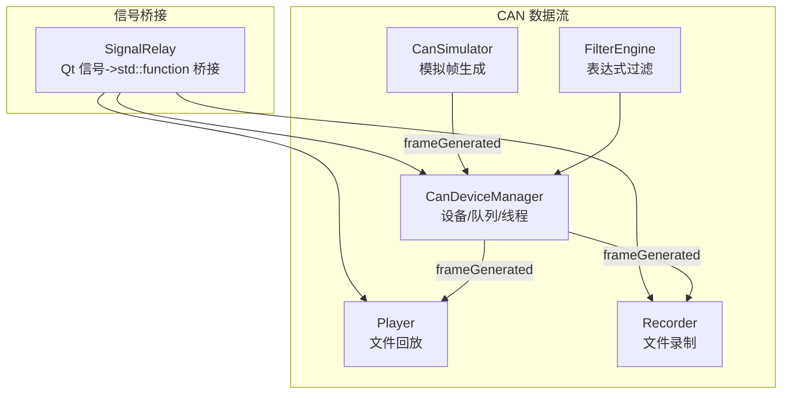
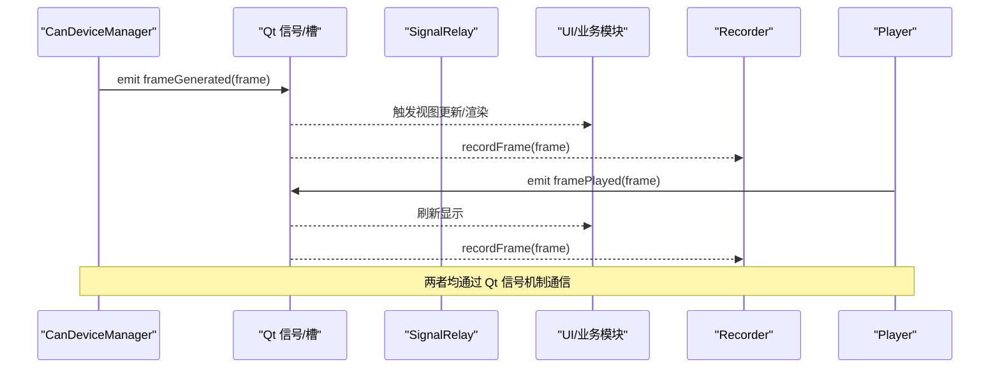
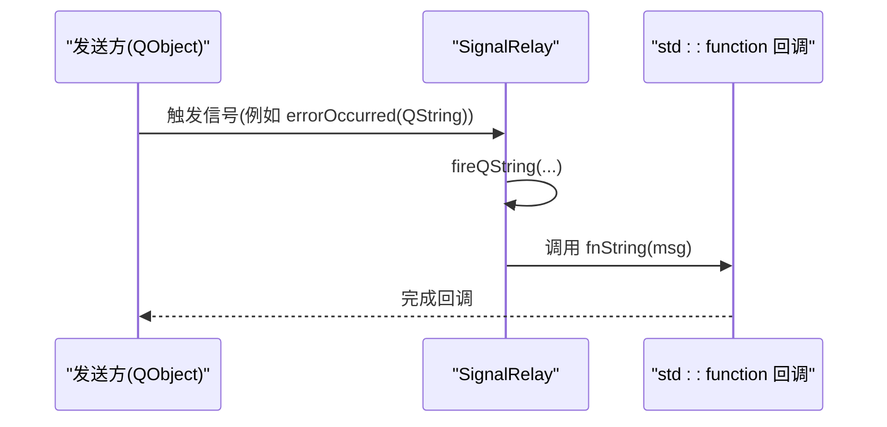
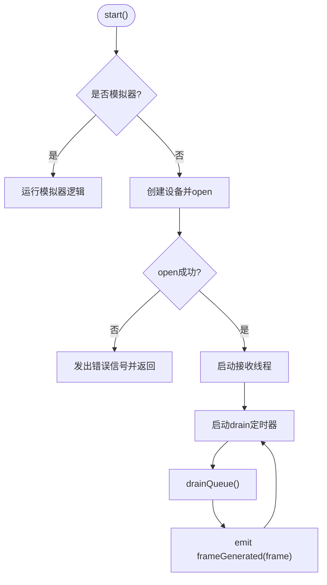
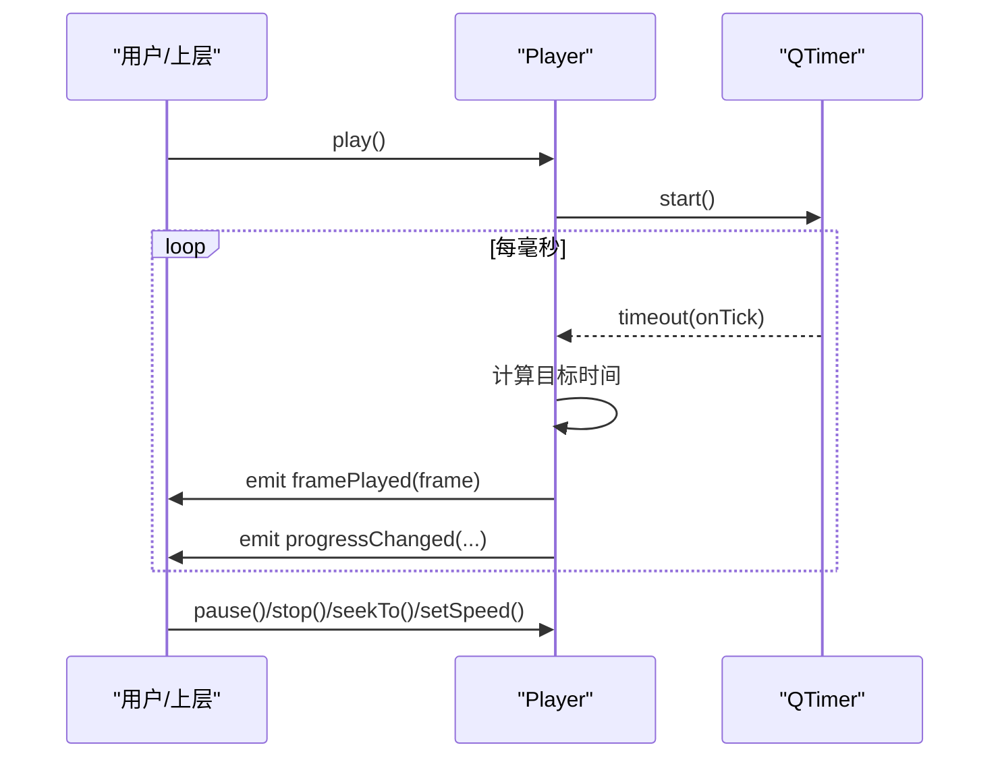
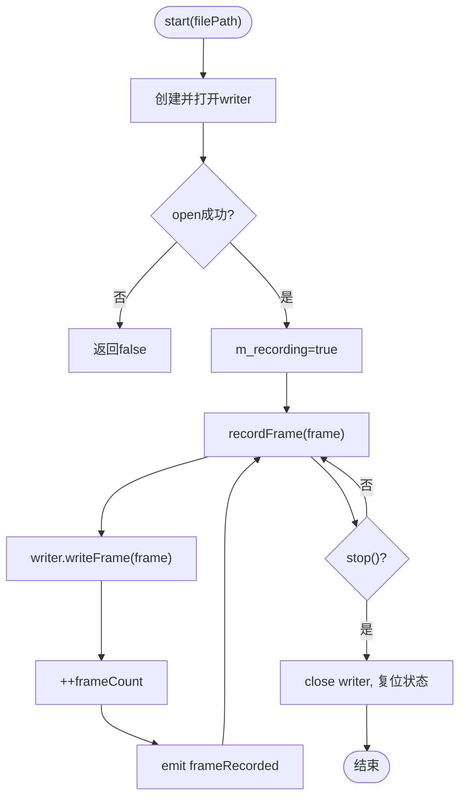
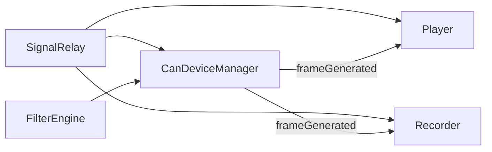

# 事件总线系统

<cite>
**本文引用的文件**
- [signalrelay.h](file://src/core/signalrelay.h)
- [signalrelay.cpp](file://src/core/signalrelay.cpp)
- [candevicemanager.h](file://src/core/candevicemanager.h)
- [player.h](file://src/core/player.h)
- [recorder.h](file://src/core/recorder.h)
- [cansimulator.h](file://src/core/cansimulator.h)
- [filter_engine.h](file://src/core/filter_engine.h)
</cite>

## 更新摘要
**所做更改**
- 移除了已删除的 EventBus 组件相关的所有内容
- 更新了架构描述，仅保留 SignalRelay 作为信号桥接组件
- 简化了依赖关系图，移除 EventBus 相关连接
- 更新了故障排查指南，移除 EventBus 相关问题
- 调整了性能考量部分，专注于 SignalRelay 和现有组件

## 目录
1. [简介](#简介)
2. [项目结构](#项目结构)
3. [核心组件](#核心组件)
4. [架构总览](#架构总览)
5. [详细组件分析](#详细组件分析)
6. [依赖关系分析](#依赖关系分析)
7. [性能考量](#性能考量)
8. [故障排查指南](#故障排查指南)
9. [结论](#结论)
10. [附录](#附录)

## 简介
本仓库中的信号桥接系统主要由以下部分组成：
- Qt 信号/槽体系与桥接组件（SignalRelay），用于跨 DLL/线程边界可靠地传递信号，并桥接到 std::function 回调，解决 MinGW/DLL 环境下指针函数与 vtable 带来的连接问题。

围绕 CAN 数据流的核心组件（CanDeviceManager、Player、Recorder、CanSimulator）通过 Qt 信号/槽协同工作，形成从采集/回放/录制到 UI 展示与插件处理的完整链路。

**注意**：原类型安全的事件总线（EventBus）组件已被移除，当前系统主要依赖 Qt 的信号/槽机制进行模块间通信。

## 项目结构
信号桥接相关代码集中在 core 层，配合上层组件使用：
- Qt 信号桥接：src/core/signalrelay.{h,cpp}
- 设备管理/回放/录制/模拟器：src/core/{candevicemanager,player,recorder,cansimulator}.{h,cpp}
- 过滤引擎：src/core/filter_engine.h

**图表来源**
- [signalrelay.h:29-49](file://src/core/signalrelay.h#L29-L49)
- [candevicemanager.h:25-143](file://src/core/candevicemanager.h#L25-L143)
- [player.h:15-80](file://src/core/player.h#L15-L80)
- [recorder.h:18-52](file://src/core/recorder.h#L18-L52)
- [cansimulator.h:20-69](file://src/core/cansimulator.h#L20-L69)
- [filter_engine.h:29-59](file://src/core/filter_engine.h#L29-L59)

**章节来源**
- [signalrelay.h:29-49](file://src/core/signalrelay.h#L29-L49)
- [candevicemanager.h:25-143](file://src/core/candevicemanager.h#L25-L143)
- [player.h:15-80](file://src/core/player.h#L15-L80)
- [recorder.h:18-52](file://src/core/recorder.h#L18-L52)
- [cansimulator.h:20-69](file://src/core/cansimulator.h#L20-L69)
- [filter_engine.h:29-59](file://src/core/filter_engine.h#L29-L59)

## 核心组件
- **SignalRelay**：将 Qt 信号转发到 std::function 成员，解决 MinGW/DLL 环境下信号/槽连接不稳定问题，便于跨模块/线程调用。
- **CanDeviceManager**：统一管理真实设备与模拟器，维护接收线程与队列，周期性 drain 并通过 frameGenerated 信号广播帧。
- **Player**：加载文件/帧序列，按时间轴回放，发射 framePlayed 与进度/状态信号。
- **Recorder**：打开文件写入器，记录帧并统计计数，发射录制开始/停止/帧记录信号。
- **FilterEngine**：解析并评估过滤表达式，对帧进行筛选。

**章节来源**
- [signalrelay.h:29-49](file://src/core/signalrelay.h#L29-L49)
- [signalrelay.cpp:8-31](file://src/core/signalrelay.cpp#L8-L31)
- [candevicemanager.h:25-143](file://src/core/candevicemanager.h#L25-L143)
- [player.h:15-80](file://src/core/player.h#L15-L80)
- [recorder.h:18-52](file://src/core/recorder.h#L18-L52)
- [filter_engine.h:29-59](file://src/core/filter_engine.h#L29-L59)

## 架构总览
SignalRelay 作为信号桥接基础设施，被多个子系统消费：
- 设备侧：CanDeviceManager 通过 Qt 信号 frameGenerated 将帧推入 UI/处理链。
- 回放侧：Player 按时间驱动发射 framePlayed，供 UI/过滤器/录制等订阅。
- 录制侧：Recorder 接收帧并持久化，同时上报录制状态。
- 桥接侧：SignalRelay 将 Qt 信号转换为 std::function 回调，便于在非 Qt 或跨 DLL 场景复用。

**图表来源**
- [candevicemanager.h:104-112](file://src/core/candevicemanager.h#L104-L112)
- [player.h:54-59](file://src/core/player.h#L54-L59)
- [recorder.h:35-41](file://src/core/recorder.h#L35-L41)
- [signalrelay.h:29-49](file://src/core/signalrelay.h#L29-L49)

## 详细组件分析

### SignalRelay：Qt 信号到 std::function 的桥接
- **设计要点**
  - 暴露多个 slots，内部转发到对应的 std::function 成员，实现"信号->回调"的解耦。
  - 解决 MinGW/DLL 下信号/槽连接不稳定、vtable 地址变化导致的连接失败问题。
- **使用模式**
  - 将 Qt 信号连接到 relay 的 slot，再在 slot 中调用 std::function，从而在任意位置执行回调。

**图表来源**
- [signalrelay.h:29-49](file://src/core/signalrelay.h#L29-L49)
- [signalrelay.cpp:8-31](file://src/core/signalrelay.cpp#L8-L31)

**章节来源**
- [signalrelay.h:29-49](file://src/core/signalrelay.h#L29-L49)
- [signalrelay.cpp:8-31](file://src/core/signalrelay.cpp#L8-L31)

### CanDeviceManager：设备与帧分发中枢
- **职责**
  - 配置与启动/停止设备或模拟器。
  - 接收线程+队列缓冲，定时 drain 并广播 frameGenerated。
  - 设置接受滤波器，控制收发。
- **关键流程**
  - start：创建设备/模拟器，开启接收线程与定时器，发出连接成功信号。
  - drainQueue：批量出队并逐条 emit frameGenerated。
  - sendFrame：发送帧，必要时构造 Tx echo。

**图表来源**
- [candevicemanager.cpp:57-113](file://src/core/candevicemanager.cpp#L57-L113)
- [candevicemanager.cpp:143-152](file://src/core/candevicemanager.cpp#L143-L152)
- [candevicemanager.h:57-112](file://src/core/candevicemanager.h#L57-L112)

**章节来源**
- [candevicemanager.h:25-143](file://src/core/candevicemanager.h#L25-L143)
- [candevicemanager.cpp:57-113](file://src/core/candevicemanager.cpp#L57-L113)
- [candevicemanager.cpp:143-152](file://src/core/candevicemanager.cpp#L143-L152)

### Player：回放控制器
- **能力**
  - 加载文件或帧序列，按时间推进播放，支持暂停/停止/跳转/倍速/循环。
  - 发射 framePlayed、progressChanged、stateChanged、finished。
- **时序**
  - onTick 根据 elapsedReal 与 speed 计算目标时间，逐个发射帧。

**图表来源**
- [player.cpp:66-178](file://src/core/player.cpp#L66-L178)
- [player.h:46-59](file://src/core/player.h#L46-L59)

**章节来源**
- [player.h:15-80](file://src/core/player.h#L15-L80)
- [player.cpp:66-178](file://src/core/player.cpp#L66-L178)

### Recorder：录制控制器
- **能力**
  - 打开文件写入器，持续写入帧，统计数量。
  - 发射 recordingStarted/recordingStopped/frameRecorded。
- **流程**
  - start：创建 writer 并 open，置位 m_recording。
  - recordFrame：写入帧并计数，发射事件。
  - stop：关闭 writer，复位状态，发射停止事件。

**图表来源**
- [recorder.cpp:17-61](file://src/core/recorder.cpp#L17-L61)
- [recorder.h:22-41](file://src/core/recorder.h#L22-L41)

**章节来源**
- [recorder.h:18-52](file://src/core/recorder.h#L18-L52)
- [recorder.cpp:17-61](file://src/core/recorder.cpp#L17-L61)

### FilterEngine：表达式过滤
- **能力**
  - 编译表达式为可执行过滤器，支持变量、运算符、组合条件。
  - evaluate 对每个帧快速判断是否通过。
- **集成点**
  - 可在 CanDeviceManager 或 UI 层对帧流进行过滤，减少下游负载。

**章节来源**
- [filter_engine.h:29-59](file://src/core/filter_engine.h#L29-L59)

## 依赖关系分析
- SignalRelay 依赖 Qt 框架，用于桥接 Qt 信号与回调。
- CanDeviceManager 依赖 Qt 线程/定时器与底层 ICanDevice 抽象。
- Player/Recorder 依赖文件 IO 工厂与 CanFrame。
- FilterEngine 独立于其他组件，提供表达式过滤功能。

**图表来源**
- [signalrelay.h:29-49](file://src/core/signalrelay.h#L29-L49)
- [candevicemanager.h:104-112](file://src/core/candevicemanager.h#L104-L112)
- [player.h:54-59](file://src/core/player.h#L54-L59)
- [recorder.h:35-41](file://src/core/recorder.h#L35-L41)
- [filter_engine.h:29-59](file://src/core/filter_engine.h#L29-L59)

**章节来源**
- [signalrelay.h:29-49](file://src/core/signalrelay.h#L29-L49)
- [candevicemanager.h:104-112](file://src/core/candevicemanager.h#L104-L112)
- [player.h:54-59](file://src/core/player.h#L54-L59)
- [recorder.h:35-41](file://src/core/recorder.h#L35-L41)
- [filter_engine.h:29-59](file://src/core/filter_engine.h#L29-L59)

## 性能考量
- **SignalRelay**
  - 简单的函数指针调用，开销极小。
  - 避免跨 DLL 边界的信号/槽连接问题，提升稳定性。
- **CanDeviceManager**
  - 接收线程+队列缓冲降低主线程压力；drain 定时器间隔可调（默认 2ms）。
  - 批量出队 tryDequeueBulk 减少锁竞争与上下文切换。
- **Player**
  - 高精度定时器（1ms）保证回放精度；seek/setSpeed 使用二分查找定位索引。
- **Recorder**
  - 写入路径尽量非阻塞；大文件场景注意磁盘 IO 吞吐。
- **FilterEngine**
  - 复杂表达式可能增加 evaluate 开销，建议在设备端或 UI 前端做粗粒度过滤。

## 故障排查指南
- **Qt 信号未到达回调**
  - 使用 SignalRelay 桥接，确保信号与 slot 正确连接。
  - 检查跨 DLL/线程边界调用是否在主线程事件循环中执行。
- **设备无帧输出**
  - 确认 CanDeviceManager 已 start，接收线程已启动，定时器已运行。
  - 检查 setAcceptanceFilter 是否正确配置。
- **回放不准或卡顿**
  - 调整 Player 定时器精度与速度；检查 seek/setSpeed 逻辑。
- **录制文件为空**
  - 确认 Recorder.start 成功，recordFrame 被调用，未处于 paused 状态。

**章节来源**
- [signalrelay.h:29-49](file://src/core/signalrelay.h#L29-L49)
- [signalrelay.cpp:8-31](file://src/core/signalrelay.cpp#L8-L31)
- [candevicemanager.cpp:57-113](file://src/core/candevicemanager.cpp#L57-L113)
- [candevicemanager.cpp:143-152](file://src/core/candevicemanager.cpp#L143-L152)
- [player.cpp:66-178](file://src/core/player.cpp#L66-L178)
- [recorder.cpp:17-61](file://src/core/recorder.cpp#L17-L61)

## 结论
当前的信号桥接系统以稳健的 Qt 信号桥接 SignalRelay 为核心，配合 CanDeviceManager、Player、Recorder 等组件，构建了高内聚、低耦合的 CAN 数据处理管线。通过 Qt 信号/槽机制与线程/队列缓冲，系统在实时性与可扩展性之间取得良好平衡。虽然原 EventBus 组件已被移除，但现有的 Qt 信号机制仍能满足大部分通信需求。未来可根据需要引入更复杂的异步通信模式或事件聚合机制。

## 附录
- **SignalRelay 常用用法**
  - 创建 SignalRelay 实例并设置回调函数。
  - 将 Qt 信号连接到 relay 的对应 slot。
  - 在回调中执行业务逻辑。

**章节来源**
- [signalrelay.h:19-27](file://src/core/signalrelay.h#L19-L27)
- [signalrelay.cpp:8-31](file://src/core/signalrelay.cpp#L8-L31)