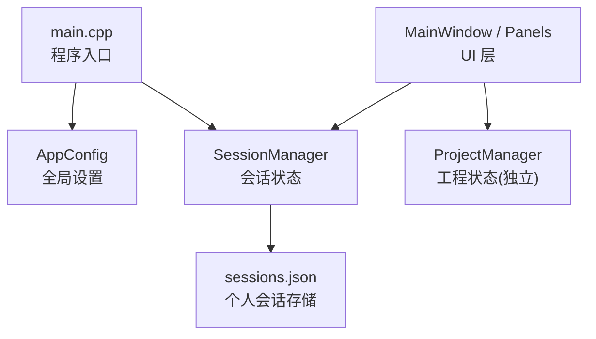
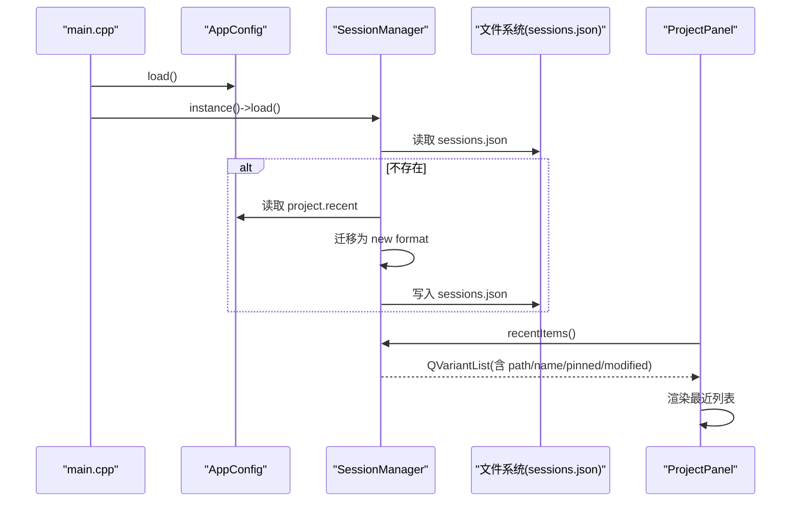
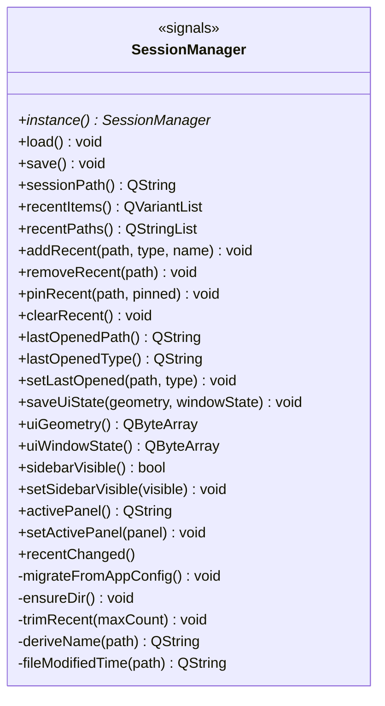
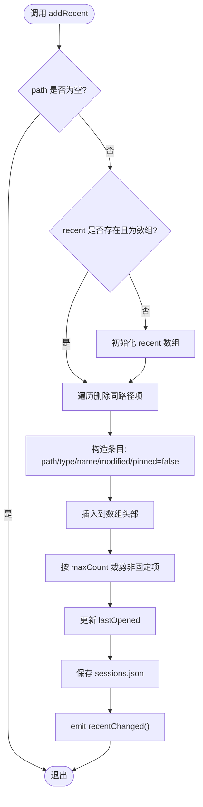
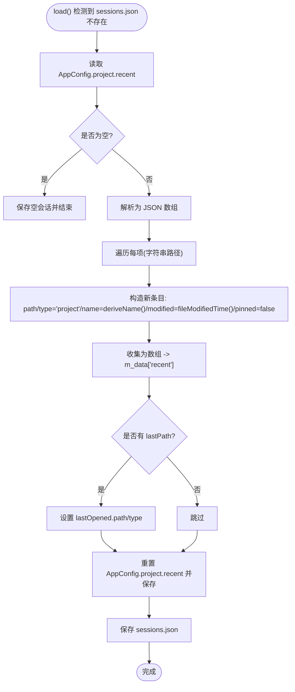
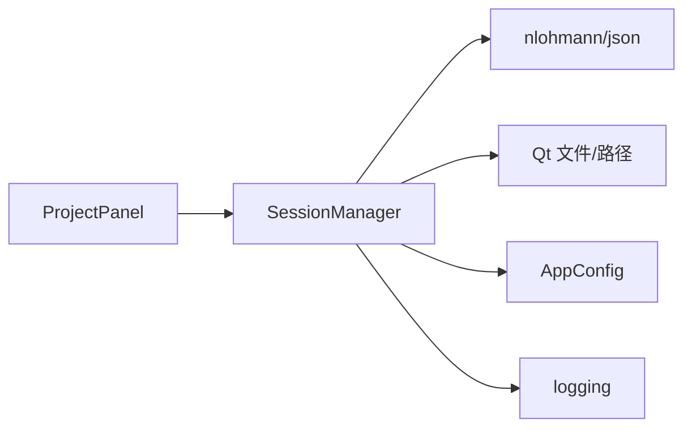

# 会话管理系统

<cite>
**本文引用的文件**
- [sessionmanager.h](file://src/core/sessionmanager.h)
- [sessionmanager.cpp](file://src/core/sessionmanager.cpp)
- [appconfig.h](file://src/core/appconfig.h)
- [projectmanager.h](file://src/core/projectmanager.h)
- [mainwindow.h](file://src/ui/mainwindow.h)
- [sidebarpanels.cpp](file://src/ui/panels/sidebarpanels.cpp)
- [main.cpp](file://src/main.cpp)
- [README.md](file://README.md)
</cite>

## 目录
1. [简介](#简介)
2. [项目结构](#项目结构)
3. [核心组件](#核心组件)
4. [架构总览](#架构总览)
5. [详细组件分析](#详细组件分析)
6. [依赖关系分析](#依赖关系分析)
7. [性能与可靠性](#性能与可靠性)
8. [故障排查指南](#故障排查指南)
9. [结论](#结论)
10. [附录：数据模型与接口](#附录数据模型与接口)

## 简介
本文件聚焦于“会话管理系统”，即通过 SessionManager 管理用户个人会话状态（最近打开项、最后打开项、UI 布局等），并与 AppConfig（全局应用设置）解耦。该子系统负责持久化 sessions.json，提供迁移能力（从旧版 AppConfig.project.recent 迁移至新格式），并通过信号通知 UI 刷新。

## 项目结构
会话管理相关代码位于 core 层，UI 侧在 panels 中消费会话数据；启动流程在 main.cpp 中初始化配置与会话。

图表来源
- [main.cpp:20-33](file://src/main.cpp#L20-L33)
- [sessionmanager.cpp:28-69](file://src/core/sessionmanager.cpp#L28-L69)
- [sidebarpanels.cpp:200-222](file://src/ui/panels/sidebarpanels.cpp#L200-L222)

章节来源
- [main.cpp:20-33](file://src/main.cpp#L20-L33)
- [sessionmanager.h:29-110](file://src/core/sessionmanager.h#L29-L110)
- [sessionmanager.cpp:28-69](file://src/core/sessionmanager.cpp#L28-L69)

## 核心组件
- SessionManager：单例，负责加载/保存 sessions.json，维护最近列表、最后打开项、UI 状态，并提供 recentChanged 信号。
- AppConfig：全局配置（settings.json），SessionManager 在首次加载时可能从中迁移历史数据。
- ProjectManager：工程管理器，管理 .sinproj 工程状态，与 SessionManager 职责分离。
- UI 面板（ProjectPanel）：读取 SessionManager 的最近列表并展示。

章节来源
- [sessionmanager.h:29-110](file://src/core/sessionmanager.h#L29-L110)
- [sessionmanager.cpp:14-117](file://src/core/sessionmanager.cpp#L14-L117)
- [appconfig.h:12-57](file://src/core/appconfig.h#L12-L57)
- [projectmanager.h:99-146](file://src/core/projectmanager.h#L99-L146)
- [sidebarpanels.cpp:200-222](file://src/ui/panels/sidebarpanels.cpp#L200-L222)

## 架构总览
会话管理采用“单例 + JSON 持久化 + 信号驱动 UI”的模式：
- 启动时先加载 AppConfig，再加载 SessionManager（含迁移逻辑）。
- UI 通过 SessionManager 提供的 API 读写最近列表和 UI 状态。
- 变更触发 recentChanged 信号，UI 订阅后刷新显示。

图表来源
- [main.cpp:20-33](file://src/main.cpp#L20-L33)
- [sessionmanager.cpp:42-117](file://src/core/sessionmanager.cpp#L42-L117)
- [sidebarpanels.cpp:200-222](file://src/ui/panels/sidebarpanels.cpp#L200-L222)

## 详细组件分析

### SessionManager 类设计
- 单例模式：instance() 返回静态实例。
- 路径管理：sessionPath() 基于 QStandardPaths::AppDataLocation 定位 sessions.json；ensureDir() 确保目录存在。
- 加载/保存：load() 解析 JSON，失败则回退为空对象；save() 序列化到文件。
- 最近列表：addRecent/removeRecent/pinRecent/clearRecent/recentItems/recentPaths，支持去重、置顶、限量裁剪（trimRecent）。
- 最后打开：lastOpenedPath/Type 与 setLastOpened。
- UI 状态：geometry/windowState/sideBarVisible/activePanel。
- 迁移：migrateFromAppConfig() 将旧 project.recent 数组迁移为新结构，并清理旧键。

图表来源
- [sessionmanager.h:29-110](file://src/core/sessionmanager.h#L29-L110)
- [sessionmanager.cpp:14-395](file://src/core/sessionmanager.cpp#L14-L395)

章节来源
- [sessionmanager.h:29-110](file://src/core/sessionmanager.h#L29-L110)
- [sessionmanager.cpp:14-395](file://src/core/sessionmanager.cpp#L14-L395)

### 最近列表处理流程

图表来源
- [sessionmanager.cpp:183-225](file://src/core/sessionmanager.cpp#L183-L225)
- [sessionmanager.cpp:270-291](file://src/core/sessionmanager.cpp#L270-L291)

章节来源
- [sessionmanager.cpp:183-225](file://src/core/sessionmanager.cpp#L183-L225)
- [sessionmanager.cpp:270-291](file://src/core/sessionmanager.cpp#L270-L291)

### 迁移流程（从 AppConfig 到 SessionManager）

图表来源
- [sessionmanager.cpp:65-117](file://src/core/sessionmanager.cpp#L65-L117)

章节来源
- [sessionmanager.cpp:65-117](file://src/core/sessionmanager.cpp#L65-L117)

### UI 集成（ProjectPanel 消费最近列表）
- ProjectPanel 在刷新时调用 SessionManager::recentItems()，将每个条目的 path/name/pinned 映射为 QListWidgetItem，并在 pinned 时添加书签图标。
- 双击最近项触发 openProjectRequested(path)，由上层 MainWindow 处理打开工程。

章节来源
- [sidebarpanels.cpp:200-222](file://src/ui/panels/sidebarpanels.cpp#L200-L222)

## 依赖关系分析
- SessionManager 依赖：
  - nlohmann/json：JSON 序列化/反序列化
  - Qt 标准路径与文件 IO：QStandardPaths、QFile、QDir、QFileInfo
  - AppConfig：读取旧配置进行迁移
  - logging：记录加载/错误信息
- 被依赖方：
  - UI 面板（ProjectPanel）：读取最近列表
  - 主窗口：在关闭或切换时可能需要保存 UI 状态（当前实现中 SessionManager 暴露了保存 UI 状态的接口）

图表来源
- [sessionmanager.cpp:1-10](file://src/core/sessionmanager.cpp#L1-L10)
- [sessionmanager.cpp:28-69](file://src/core/sessionmanager.cpp#L28-L69)
- [sidebarpanels.cpp:200-222](file://src/ui/panels/sidebarpanels.cpp#L200-L222)

章节来源
- [sessionmanager.cpp:1-10](file://src/core/sessionmanager.cpp#L1-L10)
- [sessionmanager.cpp:28-69](file://src/core/sessionmanager.cpp#L28-L69)
- [sidebarpanels.cpp:200-222](file://src/ui/panels/sidebarpanels.cpp#L200-L222)

## 性能与可靠性
- 性能
  - 最近列表操作为 O(n) 去重与插入，n 通常为较小值（默认上限 10），开销可忽略。
  - trimRecent 从尾部扫描并删除非固定项，最坏 O(n)。
  - JSON 序列化/反序列化在小规模数据下开销极低。
- 可靠性
  - 文件读取失败或 JSON 解析异常会降级为空会话，避免崩溃。
  - 写入失败会记录错误日志但不中断主流程。
  - 迁移过程有 try/catch 保护，解析失败则跳过并保留安全状态。
- 建议
  - 若未来最近列表规模增长，可考虑使用有序容器优化去重与裁剪。
  - 对频繁 save() 可考虑合并写策略（如防抖），减少磁盘 I/O。

[本节为通用指导，不直接分析具体文件]

## 故障排查指南
- 症状：最近列表未显示或为空
  - 检查 sessions.json 是否存在且可读；查看日志中的“无法读取 sessions.json”提示。
  - 确认 SessionManager::load() 是否被调用（main.cpp 中已调用）。
- 症状：迁移后旧配置仍存在
  - 检查 migrateFromAppConfig() 是否正确执行 reset("project.recent") 并保存。
- 症状：UI 未刷新
  - 确认 UI 是否连接了 SessionManager::recentChanged 信号并刷新列表。
- 症状：UI 状态未恢复
  - 检查 MainWindow 是否在合适时机调用 saveUiState()，并在启动时读取 geometry/windowState。

章节来源
- [sessionmanager.cpp:42-69](file://src/core/sessionmanager.cpp#L42-L69)
- [sessionmanager.cpp:122-137](file://src/core/sessionmanager.cpp#L122-L137)
- [sessionmanager.cpp:322-374](file://src/core/sessionmanager.cpp#L322-L374)
- [main.cpp:20-33](file://src/main.cpp#L20-L33)

## 结论
SessionManager 以简洁清晰的职责边界实现了个人会话状态管理，具备向后兼容的迁移能力，并通过信号机制与 UI 解耦。与 AppConfig、ProjectManager 的职责划分明确，便于后续扩展（如工作区、多工程上下文）。整体实现稳健、易维护，适合持续演进。

[本节为总结性内容，不直接分析具体文件]

## 附录：数据模型与接口

### sessions.json 结构（概念）
- lastWorkspace：最后打开的工作区路径
- recent：最近打开项数组，每项包含 path、type（project/workspace）、name、modified（ISO 8601）、pinned
- ui：窗口几何、窗口状态、侧边栏可见性、活跃面板

章节来源
- [README.md:1063-1093](file://README.md#L1063-L1093)

### 关键接口摘要
- SessionManager
  - 加载/保存：load(), save()
  - 最近列表：recentItems(), recentPaths(), addRecent(), removeRecent(), pinRecent(), clearRecent()
  - 最后打开：lastOpenedPath(), lastOpenedType(), setLastOpened()
  - UI 状态：saveUiState(), uiGeometry(), uiWindowState(), sidebarVisible(), setSidebarVisible(), activePanel(), setActivePanel()
- ProjectManager（与会话解耦）
  - 工程状态：currentState(), newProject(), loadProject(), saveProject(), saveAs()
  - 工程元数据：meta（创建/修改时间、作者、标签、备注）
  - 设备配置：deviceConfig（类型、FD 标志、FD 波特率）

章节来源
- [sessionmanager.h:29-110](file://src/core/sessionmanager.h#L29-L110)
- [projectmanager.h:13-97](file://src/core/projectmanager.h#L13-L97)
- [projectmanager.h:99-146](file://src/core/projectmanager.h#L99-L146)