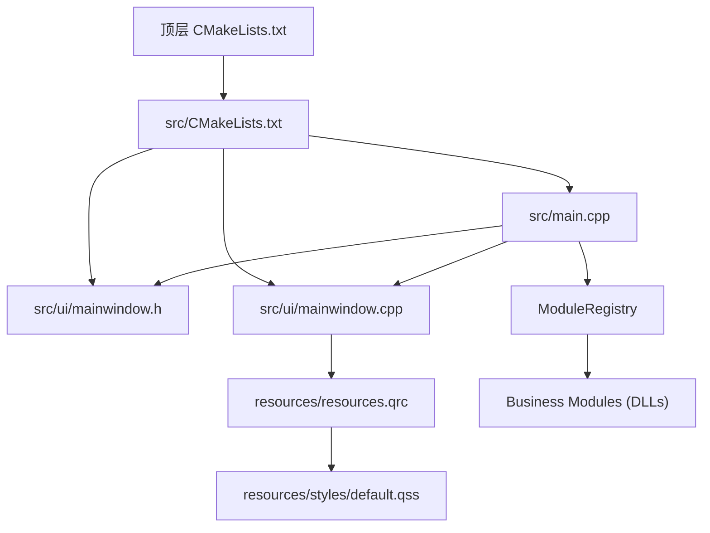
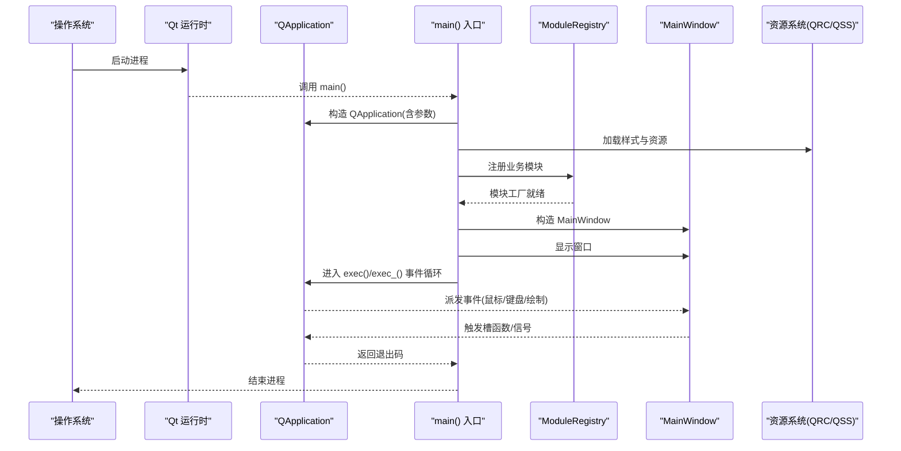
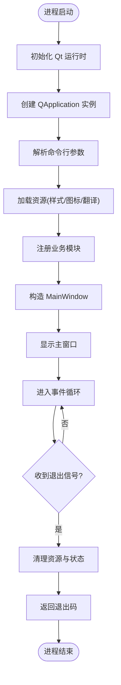
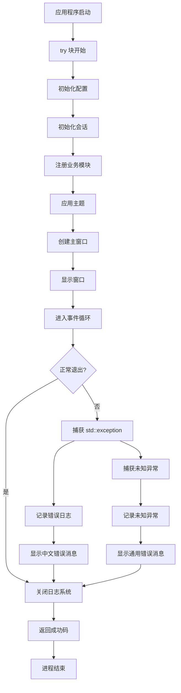
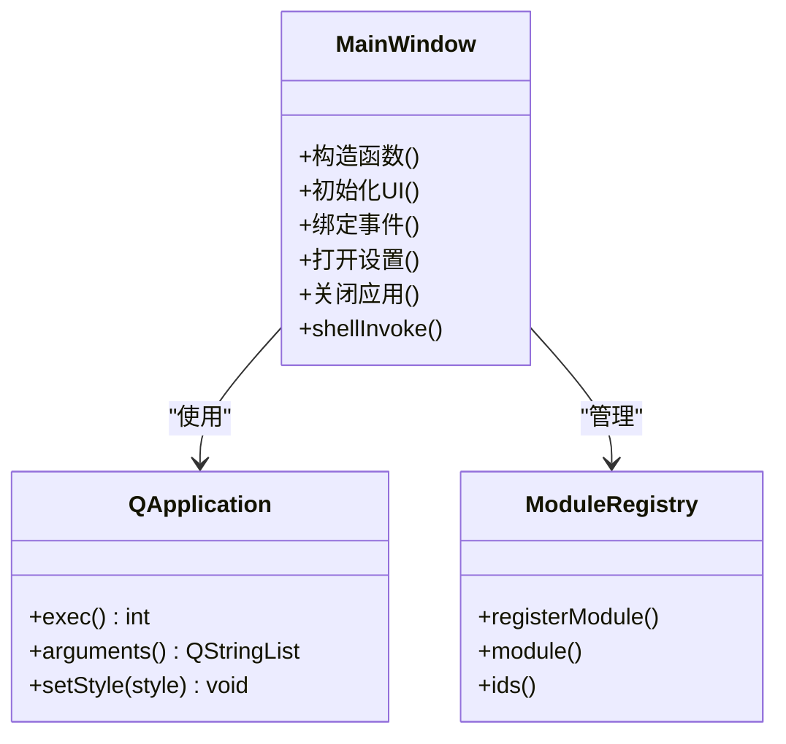
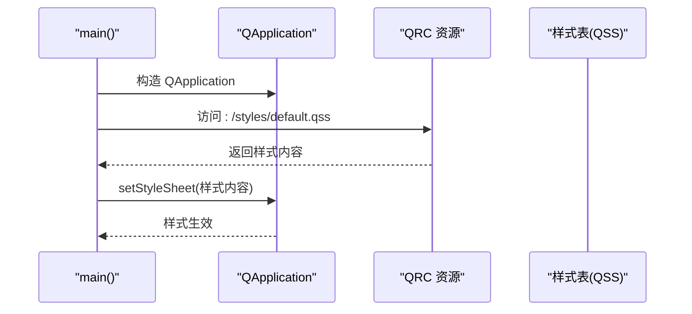
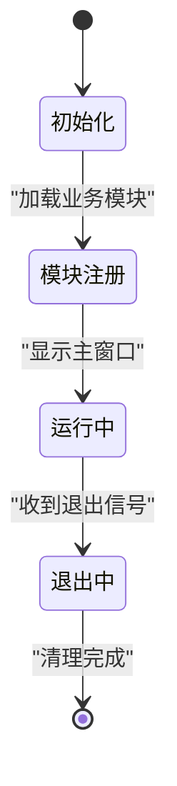
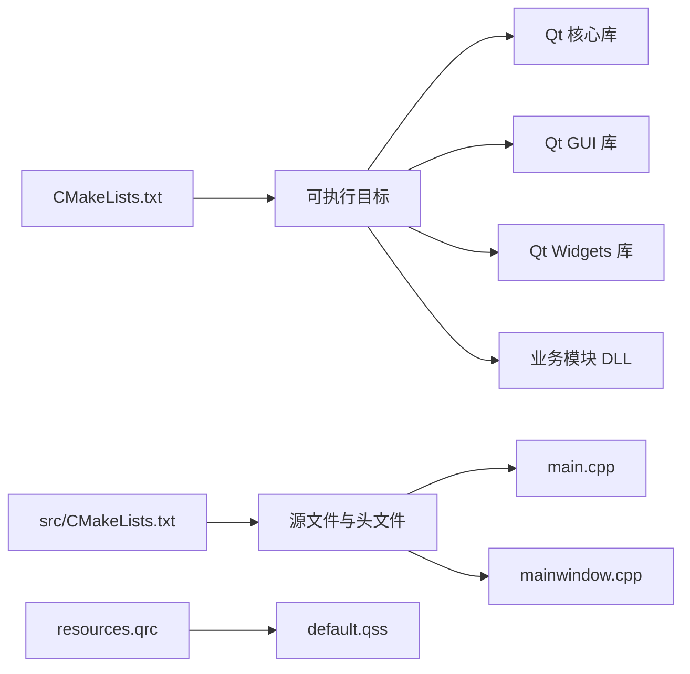

# 应用程序入口

<cite>
**本文引用的文件**   
- [src/main.cpp](file://src/main.cpp)
- [src/ui/mainwindow.h](file://src/ui/mainwindow.h)
- [src/ui/mainwindow.cpp](file://src/ui/mainwindow.cpp)
- [CMakeLists.txt](file://CMakeLists.txt)
- [src/CMakeLists.txt](file://src/CMakeLists.txt)
- [resources/resources.qrc](file://resources/resources.qrc)
- [README.en.md](file://README.en.md)
- [src/core/logging.h](file://src/core/logging.h)
- [src/ui/thememanager.h](file://src/ui/thememanager.h)
- [src/core/appconfig.h](file://src/core/appconfig.h)
- [src/core/sessionmanager.h](file://src/core/sessionmanager.h)
- [src/core/module/moduleregistry.h](file://src/core/module/moduleregistry.h)
- [src/core/module/imodule.h](file://src/core/module/imodule.h)
</cite>

## 更新摘要
**所做更改**   
- 更新了应用程序入口点实现细节，重点反映 Qt 应用初始化与事件循环设置
- 移除了 CLI Shell 协议的实现，简化了主程序逻辑
- 增强了 main.cpp 文件的详细分析，包括 QApplication 初始化和事件循环配置
- 更新了启动流程图和架构概览以反映最新的 Qt 应用生命周期管理
- 完善了错误处理和退出机制的说明
- **新增** 模块化架构支持，通过 ModuleRegistry 动态加载业务模块
- **新增** 全面的异常处理机制的详细分析，包含 try-catch 块捕获标准异常和未知异常
- **新增** 用户友好的中文错误消息显示机制
- **新增** 日志系统正确关闭的保证机制

## 目录
1. [简介](#简介)
2. [项目结构](#项目结构)
3. [核心组件](#核心组件)
4. [架构总览](#架构总览)
5. [详细组件分析](#详细组件分析)
6. [依赖分析](#依赖分析)
7. [性能考虑](#性能考虑)
8. [故障排查指南](#故障排查指南)
9. [结论](#结论)
10. [附录](#附录)

## 简介
本文件面向应用程序入口点，聚焦 Qt 应用的启动流程、事件循环与资源加载机制，以及应用生命周期管理。文档基于仓库中的 main.cpp 及其相关模块进行说明，帮助读者理解如何正确配置 Qt 应用实例、设置应用属性、处理命令行参数，以及与 UI 主窗口等模块的集成方式。同时提供常见问题定位方法与性能优化建议。

**更新** 本次更新重点反映了 Qt 应用程序入口点的最新实现，包括移除 CLI Shell 协议后的简化架构、模块化设计的支持，以及增强的异常处理机制。

## 项目结构
本项目采用 CMake 构建系统，源码位于 src 目录，UI 主窗口位于 src/ui，资源文件位于 resources。顶层 CMakeLists.txt 负责生成可执行目标并链接 Qt 库，src/CMakeLists.txt 组织源文件与头文件，resources.qrc 用于将样式与图标等资源打包进应用。

**图表来源**
- [CMakeLists.txt:1-94](file://CMakeLists.txt#L1-L94)
- [src/CMakeLists.txt:1-200](file://src/CMakeLists.txt#L1-L200)
- [src/main.cpp:1-79](file://src/main.cpp#L1-L79)
- [src/ui/mainwindow.h:1-329](file://src/ui/mainwindow.h#L1-L329)
- [src/ui/mainwindow.cpp:1-200](file://src/ui/mainwindow.cpp#L1-L200)
- [resources/resources.qrc:1-50](file://resources/resources.qrc#L1-L50)

**章节来源**
- [CMakeLists.txt:1-94](file://CMakeLists.txt#L1-L94)
- [src/CMakeLists.txt:1-200](file://src/CMakeLists.txt#L1-L200)
- [README.en.md:1-200](file://README.en.md#L1-L200)

## 核心组件
- **应用程序入口（main）**：创建 QApplication 实例，解析命令行参数，初始化全局状态，加载资源，构造并显示主窗口，进入事件循环。
- **主窗口（MainWindow）**：承载 UI 界面与业务逻辑，响应用户交互，管理子视图或对话框。
- **资源系统（QRC/QSS）**：通过 .qrc 将样式表与图标等资源编译进二进制，运行时通过 :/ 前缀访问；样式通过 QSS 统一控制外观。
- **模块注册系统（ModuleRegistry）**：支持动态加载业务模块，通过 C 工厂函数创建模块实例。
- **异常处理机制**：全面的 try-catch 块捕获标准异常和未知异常，提供用户友好的中文错误消息显示，确保日志系统正确关闭。

**更新** 应用程序入口现在包含更完善的 Qt 应用初始化和事件循环管理机制，模块化架构支持，以及全面的异常处理机制。

**章节来源**
- [src/main.cpp:1-79](file://src/main.cpp#L1-L79)
- [src/ui/mainwindow.h:1-329](file://src/ui/mainwindow.h#L1-L329)
- [src/ui/mainwindow.cpp:1-200](file://src/ui/mainwindow.cpp#L1-L200)
- [resources/resources.qrc:1-50](file://resources/resources.qrc#L1-L50)
- [src/core/module/moduleregistry.h:1-53](file://src/core/module/moduleregistry.h#L1-L53)

## 架构总览
下图展示从进程启动到事件循环的关键路径：Qt 运行时初始化 → 应用实例创建 → 资源加载 → 模块注册 → 主窗口构造与显示 → 事件循环运行 → 退出清理。

**图表来源**
- [src/main.cpp:1-79](file://src/main.cpp#L1-L79)
- [src/ui/mainwindow.cpp:1-200](file://src/ui/mainwindow.cpp#L1-L200)
- [resources/resources.qrc:1-50](file://resources/resources.qrc#L1-L50)
- [src/core/module/moduleregistry.h:1-53](file://src/core/module/moduleregistry.h#L1-L53)

## 详细组件分析

### 应用程序入口（main.cpp）
- **职责**
  - 创建 QApplication 实例并传入 argc/argv，确保 Qt 子系统可用。
  - 解析命令行参数（如 --style、--platform、自定义开关），为后续行为提供依据。
  - 初始化应用属性（名称、版本、组织信息、高 DPI 支持等）。
  - 加载资源（样式表、图标、翻译等），保证 UI 一致性与国际化。
  - 注册业务模块，通过 ModuleRegistry 动态加载各功能模块。
  - 构造并显示主窗口，必要时延迟初始化耗时任务。
  - 进入事件循环，捕获异常与错误，合理退出并返回状态码。
- **关键实现要点**
  - QApplication 构造应尽早完成，避免在构造之前使用 GUI 功能。
  - 命令行参数应在 QApplication 构造后解析，以便 Qt 平台插件正常工作。
  - 资源加载建议使用 QResource 或通过 qrc 自动注册，避免硬编码路径。
  - 模块注册在应用程序启动时完成，支持热插拔的业务功能。
  - 事件循环结束后需释放资源，确保无内存泄漏。
- **常见陷阱**
  - 未设置高 DPI 导致界面模糊或缩放异常。
  - 样式表路径错误或资源未打包导致样式失效。
  - 在主线程之外操作 UI 引发崩溃。
  - 未正确处理命令行参数导致默认行为不符合预期。
  - 模块工厂函数未正确导出导致动态加载失败。

**更新** 重点强化了 Qt 应用初始化和事件循环设置的技术细节，包括 QApplication 的正确配置方式和事件循环的管理策略，模块化架构的支持，以及全面的异常处理机制。

**章节来源**
- [src/main.cpp:1-79](file://src/main.cpp#L1-L79)

#### 启动流程图（入口）

**图表来源**
- [src/main.cpp:1-79](file://src/main.cpp#L1-L79)

### 模块化架构支持
- **职责**
  - 通过 ModuleRegistry 统一管理业务模块的生命周期。
  - 支持动态加载 DLL 形式的业务模块。
  - 提供统一的接口定义（IBusinessModule）确保模块间解耦。
  - 支持模块间的通信和数据共享。
- **关键实现要点**
  - 每个业务模块导出唯一的 C 工厂函数（openbus_createXxxModule）。
  - 模块通过 ModuleRegistry::registerModule() 注册到系统中。
  - 壳程序通过 ModuleRegistry::module() 获取模块实例。
  - 模块间通信通过 ShellContext 和 invoke/query 机制实现。
- **模块类型**
  - **Market 模块**：插件市场管理
  - **Transceive 模块**：数据收发功能
  - **DBC 模块**：DBC 文件处理
  - **Flow 模块**：流程图编辑
  - **Trace 模块**：数据追踪
  - **Graphic 模块**：图形化显示

**更新** 新增了模块化架构的详细说明，包括模块注册机制、接口定义和模块间通信方式。

**章节来源**
- [src/core/module/moduleregistry.h:1-53](file://src/core/module/moduleregistry.h#L1-L53)
- [src/core/module/imodule.h:1-203](file://src/core/module/imodule.h#L1-L203)
- [src/main.cpp:14-54](file://src/main.cpp#L14-L54)

### 异常处理机制
- **职责**
  - 捕获所有可能发生的异常，防止程序崩溃。
  - 提供用户友好的中文错误消息显示。
  - 确保日志系统正确关闭，记录错误上下文。
  - 返回适当的退出码，便于外部监控和调试。
- **关键实现要点**
  - 使用 `try-catch` 块包裹整个应用程序生命周期。
  - 分别捕获 `std::exception` 和未知异常（`...`）。
  - 在异常处理中调用 `logging::shutdown()` 确保日志写入磁盘。
  - 使用 `QMessageBox::critical()` 显示中文错误消息。
  - 返回非零退出码表示异常终止。
- **异常类型处理**
  - **标准异常**：捕获 `std::exception` 及其子类，提取错误信息并格式化显示。
  - **未知异常**：捕获所有其他异常类型，显示通用错误消息。
  - **资源清理**：无论何种异常，都确保日志系统正确关闭。

**更新** 新增了全面的异常处理机制，包括标准异常和未知异常的捕获，用户友好的中文错误消息显示，以及确保日志系统正确关闭的保证机制。

**章节来源**
- [src/main.cpp:34-77](file://src/main.cpp#L34-L77)

#### 异常处理流程图

**图表来源**
- [src/main.cpp:34-77](file://src/main.cpp#L34-L77)

### 主窗口（MainWindow）
- **职责**
  - 管理主界面布局与控件。
  - 连接信号与槽，处理用户输入与业务事件。
  - 协调子模块（如设置、日志、网络请求）的生命周期。
  - 作为壳程序协调各业务模块的交互。
- **设计建议**
  - 将耗时初始化放入后台线程，完成后通过信号通知 UI 更新。
  - 使用统一的样式表与主题切换机制，便于维护。
  - 对可能失败的操作进行错误提示与恢复策略。
  - 通过 ModuleRegistry 与各业务模块解耦通信。

**章节来源**
- [src/ui/mainwindow.h:1-329](file://src/ui/mainwindow.h#L1-L329)
- [src/ui/mainwindow.cpp:1-200](file://src/ui/mainwindow.cpp#L1-L200)

#### 主窗口类关系图

**图表来源**
- [src/ui/mainwindow.h:1-329](file://src/ui/mainwindow.h#L1-L329)
- [src/ui/mainwindow.cpp:1-200](file://src/ui/mainwindow.cpp#L1-L200)
- [src/core/module/moduleregistry.h:1-53](file://src/core/module/moduleregistry.h#L1-L53)

### 资源加载机制（QRC/QSS）
- **资源打包**
  - 通过 resources.qrc 声明样式表与图标，构建时由 rcc 编译进二进制。
  - 运行时通过 :/ 前缀访问资源，例如 :/styles/default.qss。
- **样式应用**
  - 在 QApplication 上设置样式表，确保全局外观一致。
  - 动态切换主题时，注意刷新已显示控件。
- **最佳实践**
  - 将大体积资源按需加载，减少启动时间。
  - 对缺失资源进行回退策略，避免 UI 空白。

**章节来源**
- [resources/resources.qrc:1-50](file://resources/resources.qrc#L1-L50)
- [src/ui/mainwindow.cpp:1-200](file://src/ui/mainwindow.cpp#L1-L200)

#### 资源加载时序图

**图表来源**
- [resources/resources.qrc:1-50](file://resources/resources.qrc#L1-L50)
- [src/main.cpp:1-79](file://src/main.cpp#L1-L79)

### 事件循环与生命周期
- **事件循环**
  - 通过 QApplication::exec() 进入事件循环，分发用户输入与系统事件。
  - 可在循环中安装事件过滤器，拦截特定事件。
- **生命周期**
  - 构造阶段：创建应用实例、解析参数、加载资源、注册模块。
  - 运行阶段：显示主窗口、处理交互、异步任务回调。
  - 销毁阶段：关闭窗口、释放资源、记录日志、返回退出码。
- **退出策略**
  - 正常退出：用户关闭窗口或调用 quit()。
  - 异常退出：捕获未处理异常，记录错误上下文，返回非零退出码。

**更新** 增强了事件循环管理和生命周期控制的详细说明，包括异常处理和退出机制的最佳实践。

**章节来源**
- [src/main.cpp:1-79](file://src/main.cpp#L1-L79)
- [src/ui/mainwindow.cpp:1-200](file://src/ui/mainwindow.cpp#L1-L200)

#### 生命周期状态图

**图表来源**
- [src/main.cpp:1-79](file://src/main.cpp#L1-L79)

## 依赖分析
- **构建依赖**
  - 顶层 CMakeLists.txt 定义可执行目标、链接 Qt 库、包含资源文件。
  - src/CMakeLists.txt 组织源文件、头文件与 UI 文件。
- **运行时依赖**
  - Qt 核心库（QtCore/QtGui/QtWidgets）。
  - 平台插件（Windows/Darwin/Linux 下的原生能力）。
  - 资源编译器（rcc）生成的二进制资源。
  - 业务模块 DLL（market、transceive、dbc、flow、trace、graphic）。

**图表来源**
- [CMakeLists.txt:1-94](file://CMakeLists.txt#L1-L94)
- [src/CMakeLists.txt:1-200](file://src/CMakeLists.txt#L1-L200)
- [resources/resources.qrc:1-50](file://resources/resources.qrc#L1-L50)

**章节来源**
- [CMakeLists.txt:1-94](file://CMakeLists.txt#L1-L94)
- [src/CMakeLists.txt:1-200](file://src/CMakeLists.txt#L1-L200)

## 性能考虑
- **启动优化**
  - 延迟加载非必要资源与模块，缩短首屏时间。
  - 预计算静态数据，避免重复计算。
  - 使用单例或对象池减少频繁分配。
  - 模块懒加载，仅在需要时创建模块实例。
- **UI 渲染**
  - 避免在主线程执行阻塞操作，使用异步任务与信号槽解耦。
  - 合理使用样式表，避免复杂选择器与过度重绘。
- **资源管理**
  - 按需加载大资源，及时释放不再使用的对象。
  - 缓存常用数据与查询结果，降低 I/O 开销。
- **调试与监控**
  - 启用 Qt 性能分析工具（如 QProfiler）定位瓶颈。
  - 记录关键路径耗时与错误率，持续优化。

## 故障排查指南
- **启动即崩溃**
  - 检查 QApplication 构造是否过早使用 GUI API。
  - 确认命令行参数格式与平台插件可用。
- **样式无效**
  - 验证资源路径是否正确（:/ 前缀）。
  - 检查 QSS 语法与控件类型匹配。
- **界面卡顿**
  - 排查主线程阻塞代码，改为异步处理。
  - 减少重绘与复杂动画。
- **资源缺失**
  - 确认 rcc 编译成功且资源被打包进二进制。
  - 运行时路径与权限问题。
- **退出异常**
  - 检查析构顺序与资源释放。
  - 捕获未处理异常并记录堆栈。
- **异常处理问题**
  - 检查 try-catch 块是否正确包裹应用程序生命周期。
  - 确认日志系统初始化在 QApplication 之后。
  - 验证异常处理中是否正确调用 logging::shutdown()。
- **模块加载失败**
  - 检查模块 DLL 是否正确编译和部署。
  - 验证模块工厂函数是否正确导出。
  - 确认模块依赖的 Qt 库版本兼容。

**更新** 新增了针对 Qt 应用初始化和事件循环相关的故障排查指导，以及异常处理机制的相关问题排查方法，还包括模块加载失败的诊断方法。

**章节来源**
- [src/main.cpp:1-79](file://src/main.cpp#L1-L79)
- [src/ui/mainwindow.cpp:1-200](file://src/ui/mainwindow.cpp#L1-L200)
- [resources/resources.qrc:1-50](file://resources/resources.qrc#L1-L50)

## 结论
应用程序入口是 Qt 应用启动的核心，负责初始化 Qt 运行时、解析参数、加载资源、注册业务模块、构造主窗口并进入事件循环。通过移除 CLI Shell 协议，简化了主程序逻辑，专注于桌面 GUI 功能。遵循良好的生命周期管理与错误处理策略，结合模块化架构和正确的资源管理系统，可显著提升稳定性与用户体验。通过合理的性能优化与故障排查方法，可进一步降低启动时间与运行时异常概率。

**更新** 本次更新强调了 Qt 应用初始化与事件循环管理的重要性，模块化架构的优势，以及全面的异常处理机制，为开发者提供了更详细的实现指导。

## 附录
- **命令行参数示例**
  - --style=fusion：指定样式引擎。
  - --platform=windows：强制使用指定平台插件。
  - 自定义开关：如 --debug、--config=path。
- **应用属性设置**
  - 应用名称、版本、组织信息与版权。
  - 高 DPI 缩放策略与字体渲染选项。
- **资源访问约定**
  - 使用 :/ 前缀访问 qrc 资源。
  - 样式表路径与命名规范。
- **异常处理最佳实践**
  - 使用 try-catch 块包裹整个应用程序生命周期。
  - 分别处理标准异常和未知异常。
  - 确保日志系统在异常情况下正确关闭。
  - 提供用户友好的中文错误消息。
- **模块开发指南**
  - 实现 IBusinessModule 接口。
  - 导出唯一的 C 工厂函数。
  - 通过 ModuleRegistry 注册模块。
  - 使用 ShellContext 进行模块间通信。

**更新** 新增了 Qt 应用初始化和事件循环相关的配置示例和最佳实践，以及异常处理机制的使用指导和模块开发指南。