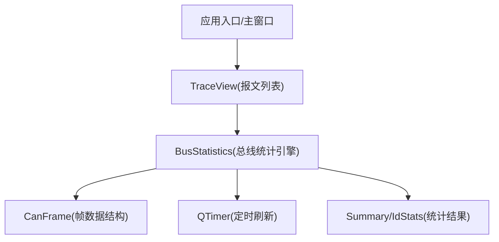
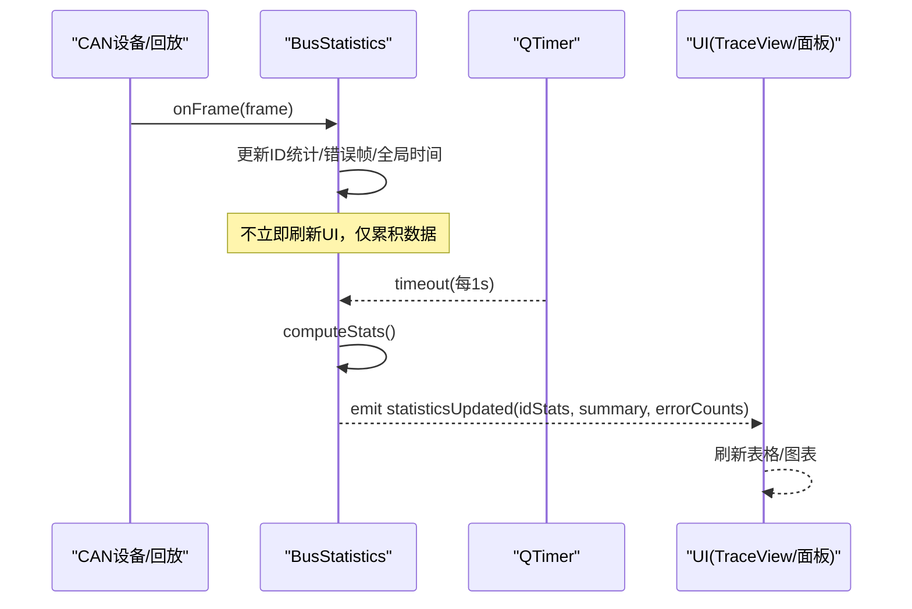
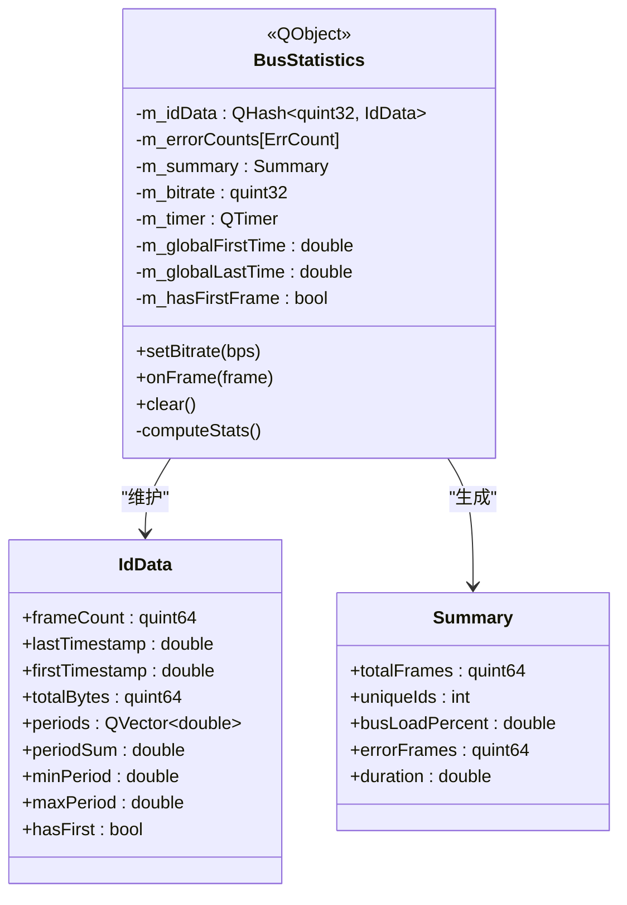
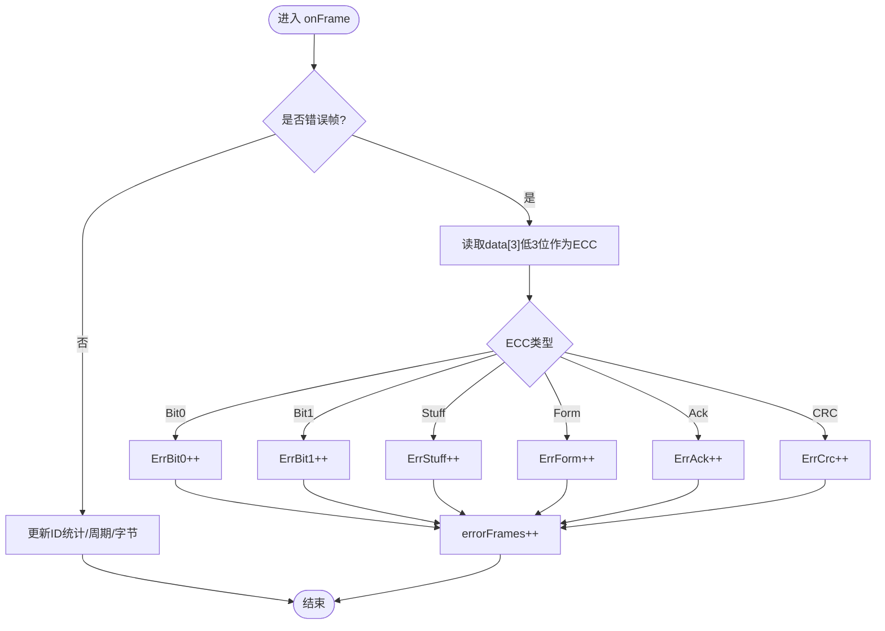
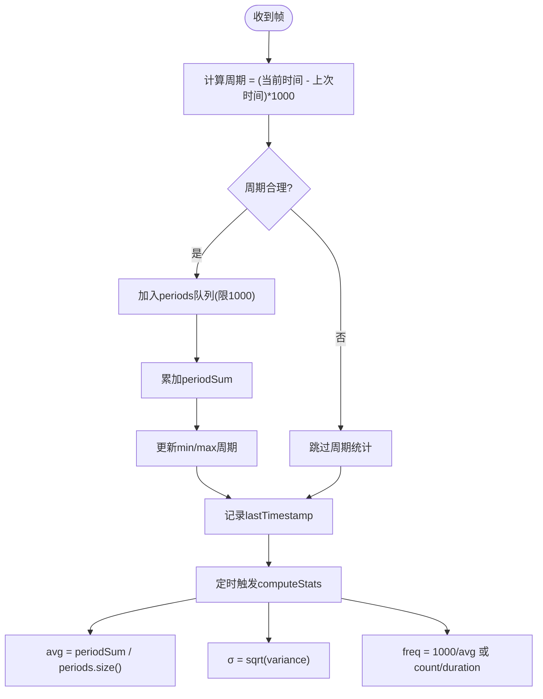
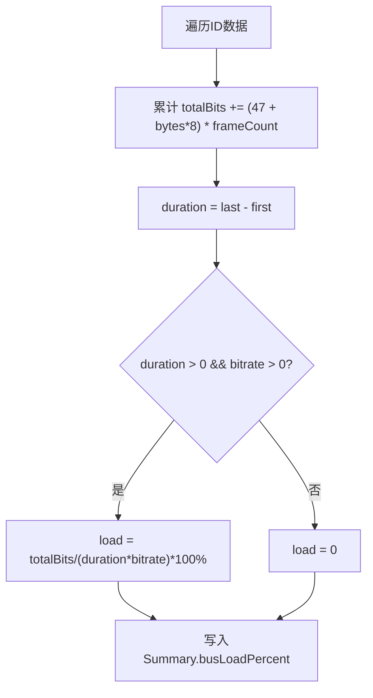
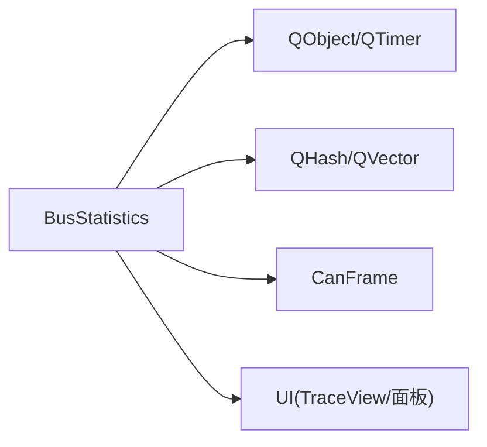

# 总线统计引擎

<cite>
**本文引用的文件**
- [busstatistics.h](file://src/core/busstatistics.h)
- [busstatistics.cpp](file://src/core/busstatistics.cpp)
- [canframe.h](file://src/core/canframe.h)
- [traceview.h](file://src/ui/traceview.h)
- [traceview.cpp](file://src/ui/traceview.cpp)
- [CMakeLists.txt](file://CMakeLists.txt)
- [README.md](file://README.md)
</cite>

## 目录
1. [简介](#简介)
2. [项目结构](#项目结构)
3. [核心组件](#核心组件)
4. [架构总览](#架构总览)
5. [详细组件分析](#详细组件分析)
6. [依赖关系分析](#依赖关系分析)
7. [性能考量](#性能考量)
8. [故障排查指南](#故障排查指南)
9. [结论](#结论)
10. [附录](#附录)

## 简介
本文件聚焦于“总线统计引擎”的设计与实现，该引擎对标 CANoe 的 Bus Statistics Window，提供按 CAN ID 的帧数、周期（平均/最小/最大）、抖动（标准差 σ）、频率、累计字节数等指标统计，支持错误帧分类统计与总线负载率计算。引擎以定时器驱动（默认 1s）批量刷新统计结果，避免每帧更新 UI 带来的性能开销。

## 项目结构
- 核心统计逻辑位于 src/core 下的 busstatistics.h/.cpp
- 数据载体为 CanFrame（src/core/canframe.h），承载时间戳、ID、DLC、数据、方向、是否错误帧等
- UI 层通过 TraceView 等视图展示报文列表与统计信息（参考 traceview.h/.cpp）
- 构建系统使用 CMake（顶层 CMakeLists.txt）

图表来源
- [traceview.h:150-235](file://src/ui/traceview.h#L150-L235)
- [busstatistics.h:20-98](file://src/core/busstatistics.h#L20-L98)
- [busstatistics.cpp:5-11](file://src/core/busstatistics.cpp#L5-L11)
- [canframe.h:14-84](file://src/core/canframe.h#L14-L84)

章节来源
- [CMakeLists.txt:1-63](file://CMakeLists.txt#L1-L63)
- [README.md:1-120](file://README.md#L1-L120)

## 核心组件
- BusStatistics：统计引擎主体，维护每个 CAN ID 的时间序列与周期统计、错误帧计数、全局汇总，并周期性触发统计计算与信号发射
- IdData：内部结构，保存每个 ID 的帧计数、首末时间戳、累计字节、周期队列、周期和、最小/最大周期等
- Summary：全局汇总，包含总帧数、唯一 ID 数、总线负载率、错误帧总数、统计时长
- ErrorType：错误帧分类枚举（Stuff/Form/ACK/Bit0/Bit1/CRC）
- CanFrame：帧数据模型，提供 isErrorFrame() 等方法用于识别错误帧

章节来源
- [busstatistics.h:20-98](file://src/core/busstatistics.h#L20-L98)
- [busstatistics.cpp:13-69](file://src/core/busstatistics.cpp#L13-L69)
- [canframe.h:14-84](file://src/core/canframe.h#L14-L84)

## 架构总览
总线统计引擎采用“事件驱动 + 定时批处理”的模式：
- onFrame(CanFrame)：接收每一帧，更新全局时间范围、错误帧计数、ID 级别统计（周期、字节数、首末时间戳）
- QTimer::onTimeout：每 1s 触发 computeStats()，计算各 ID 的周期均值/极值/抖动/频率，以及全局汇总（负载率、时长、错误帧）
- statisticsUpdated：发射信号，供 UI 层订阅并刷新显示

图表来源
- [busstatistics.cpp:13-69](file://src/core/busstatistics.cpp#L13-L69)
- [busstatistics.cpp:82-153](file://src/core/busstatistics.cpp#L82-L153)
- [busstatistics.h:62-73](file://src/core/busstatistics.h#L62-L73)

## 详细组件分析

### BusStatistics 类设计
- 职责：维护 per-ID 统计、错误帧分类、全局汇总；定时计算并发布结果
- 关键方法：
  - onFrame：增量更新，含错误帧分类、周期收集、累计字节、首末时间戳
  - clear：重置所有状态
  - computeStats：计算周期均值/极值/抖动/频率，汇总负载率与时长，排序后发射信号
- 关键数据结构：
  - IdData：周期队列（保留最近 N=1000 个周期）、周期和、最小/最大周期、首末时间戳
  - Summary：总帧数、唯一 ID 数、负载率、错误帧数、时长
  - ErrorType：错误类型枚举

图表来源
- [busstatistics.h:20-98](file://src/core/busstatistics.h#L20-L98)
- [busstatistics.cpp:87-153](file://src/core/busstatistics.cpp#L87-L153)

章节来源
- [busstatistics.h:20-98](file://src/core/busstatistics.h#L20-L98)
- [busstatistics.cpp:5-153](file://src/core/busstatistics.cpp#L5-L153)

### 错误帧分类流程
- 判断是否为错误帧：基于 CanFrame::isErrorFrame()（检查扩展标志位）
- 解析 ECC 错误码：从 frame.data[3] 的低三位提取错误类型，映射到 ErrBit0/ErrBit1/Stuff/Form/ACK/CRC
- 累计错误帧数量并参与汇总

图表来源
- [busstatistics.cpp:24-43](file://src/core/busstatistics.cpp#L24-L43)
- [canframe.h:80-84](file://src/core/canframe.h#L80-L84)

章节来源
- [busstatistics.cpp:24-43](file://src/core/busstatistics.cpp#L24-L43)
- [canframe.h:80-84](file://src/core/canframe.h#L80-L84)

### 周期与抖动计算
- 周期：相邻同 ID 帧的时间差（毫秒），过滤不合理值（>0 且 <1e6 ms）
- 均值/极值：维护周期和与最小/最大周期
- 抖动 σ：对最近 N=1000 个周期计算标准差 sqrt(Σ(xi-x̄)²/N)
- 频率：周期帧按 1000/avgPeriod(ms)；事件帧按 frameCount/duration

图表来源
- [busstatistics.cpp:54-66](file://src/core/busstatistics.cpp#L54-L66)
- [busstatistics.cpp:100-125](file://src/core/busstatistics.cpp#L100-L125)

章节来源
- [busstatistics.cpp:54-66](file://src/core/busstatistics.cpp#L54-L66)
- [busstatistics.cpp:100-125](file://src/core/busstatistics.cpp#L100-L125)

### 总线负载率计算
- 公式：负载率 = (总数据位数 / (统计时长 × 波特率)) × 100%
- 总数据位数近似：经典 CAN 帧约 47 + DLC×8 位；CAN FD 额外开销简化处理
- 统计时长：m_globalLastTime - m_globalFirstTime

图表来源
- [busstatistics.cpp:139-150](file://src/core/busstatistics.cpp#L139-L150)

章节来源
- [busstatistics.cpp:139-150](file://src/core/busstatistics.cpp#L139-L150)

### UI 集成与刷新策略
- 引擎通过 signals/slots 机制发布 statisticsUpdated，UI 层可订阅并刷新表格/图表
- 刷新策略：1s 定时器触发，避免高频 UI 更新导致卡顿
- TraceView 负责报文列表展示与交互，可与统计面板联动

章节来源
- [busstatistics.h:62-73](file://src/core/busstatistics.h#L62-L73)
- [traceview.h:150-235](file://src/ui/traceview.h#L150-L235)
- [traceview.cpp:47-113](file://src/ui/traceview.cpp#L47-L113)

## 依赖关系分析
- 直接依赖：
  - QObject/QTimer：Qt 框架对象与定时器
  - QHash/QVector：存储 per-ID 数据与周期队列
  - CanFrame：帧数据模型
- 间接依赖：
  - UI 层（TraceView/面板）订阅 statisticsUpdated 信号进行刷新
  - 构建系统（CMake）管理 Qt 模块与第三方库

图表来源
- [busstatistics.h:4-8](file://src/core/busstatistics.h#L4-L8)
- [canframe.h:1-12](file://src/core/canframe.h#L1-L12)
- [traceview.h:150-235](file://src/ui/traceview.h#L150-L235)

章节来源
- [busstatistics.h:4-8](file://src/core/busstatistics.h#L4-L8)
- [canframe.h:1-12](file://src/core/canframe.h#L1-L12)
- [traceview.h:150-235](file://src/ui/traceview.h#L150-L235)

## 性能考量
- 定时器批处理：1s 间隔触发统计计算，降低 UI 刷新频率
- 周期队列限制：保留最近 1000 个周期，控制内存占用
- 合理性检查：过滤异常周期（>0 且 <1e6 ms），避免噪声影响统计
- 负载率近似：使用经典 CAN 帧位数估算，兼顾精度与性能

优化建议
- 可根据业务场景调整周期队列长度（如增大至 2000）以提升抖动估计稳定性
- 若需更高精度负载率，可按实际帧头/尾开销精确计算（区分经典 CAN 与 CAN FD）
- 在极高吞吐场景下，可将统计计算移至独立线程，进一步解耦 UI

[本节为通用指导，无需特定文件引用]

## 故障排查指南
- 错误帧分类异常
  - 检查 frame.data 长度是否 ≥4，确保能读取 ECC 字段
  - 确认 isErorrFrame() 标志位设置正确（扩展帧标志位）
- 周期统计异常
  - 检查时间戳单位与精度，确保 timestamp 为秒级浮点
  - 验证周期合理性阈值（>0 且 <1e6 ms）
- 负载率为零或异常
  - 确认 setBitrate() 已设置正确的波特率
  - 检查统计时长 duration 是否大于 0

章节来源
- [busstatistics.cpp:24-43](file://src/core/busstatistics.cpp#L24-L43)
- [busstatistics.cpp:54-66](file://src/core/busstatistics.cpp#L54-L66)
- [busstatistics.cpp:139-150](file://src/core/busstatistics.cpp#L139-L150)
- [canframe.h:80-84](file://src/core/canframe.h#L80-L84)

## 结论
总线统计引擎以轻量、高效的方式实现了 CAN 总线的关键统计能力，包括按 ID 的周期/抖动/频率、错误帧分类与总线负载率。通过定时器批处理与合理的内存限制，在保证精度的同时避免了 UI 卡顿。后续可扩展更精确的负载率计算、动态周期队列长度与多线程统计以提升在高吞吐场景下的表现。

[本节为总结性内容，无需特定文件引用]

## 附录
- 相关功能规划与对标说明可参考 README 中关于 Bus Statistics 增强方案的部分
- 构建配置与依赖管理见 CMakeLists.txt

章节来源
- [README.md:216-256](file://README.md#L216-L256)
- [CMakeLists.txt:40-55](file://CMakeLists.txt#L40-L55)