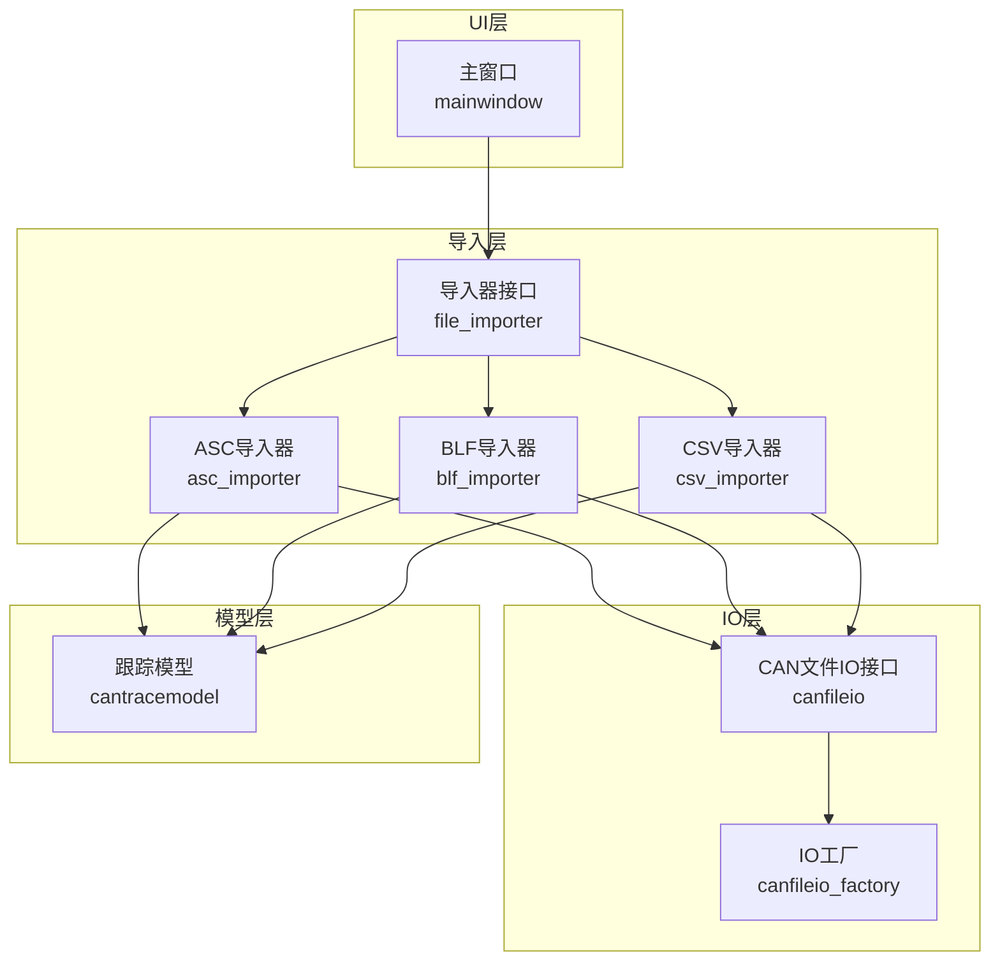
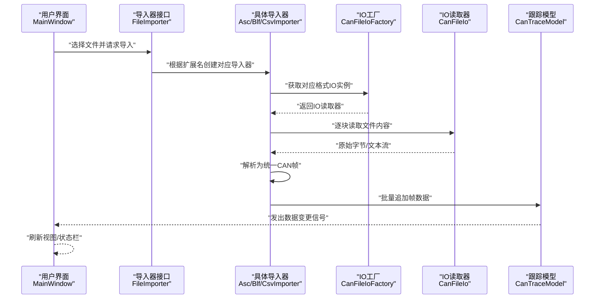
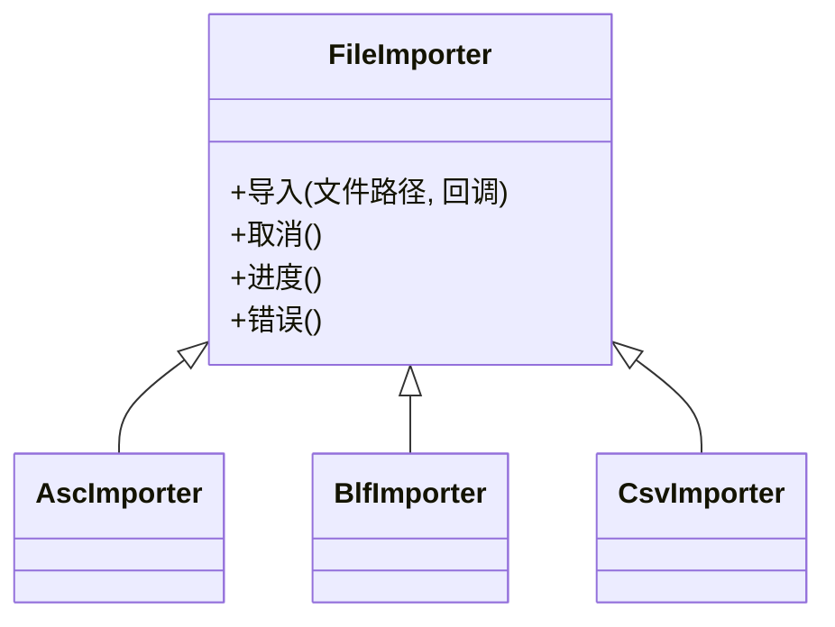
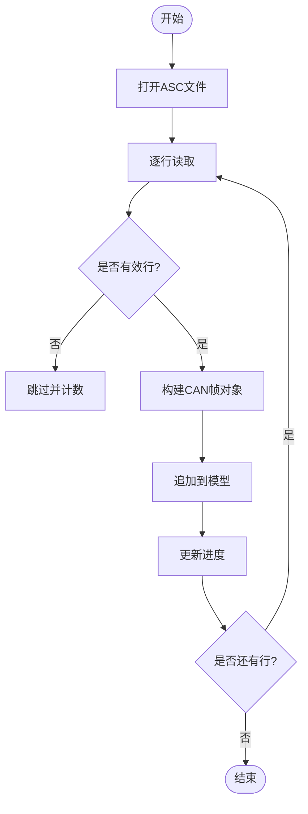
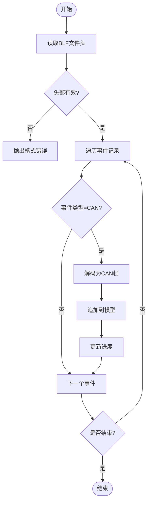
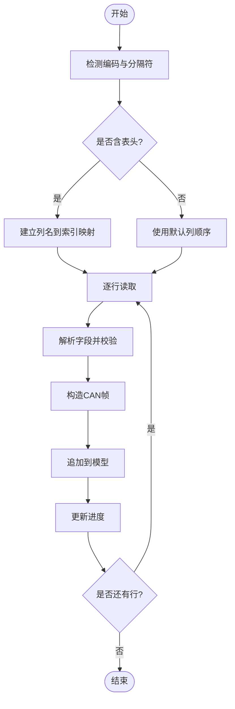
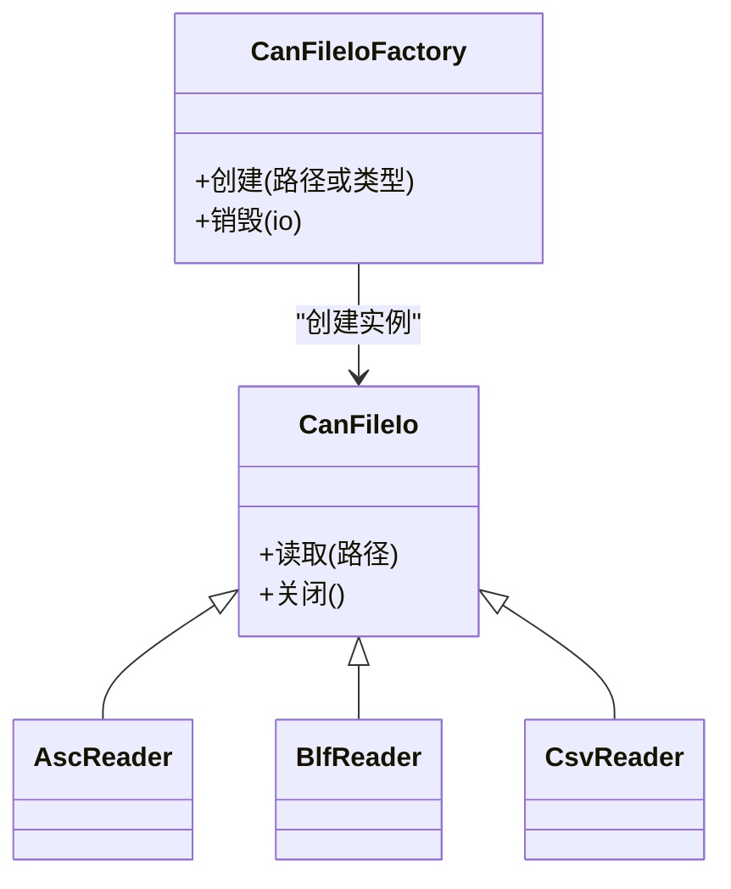
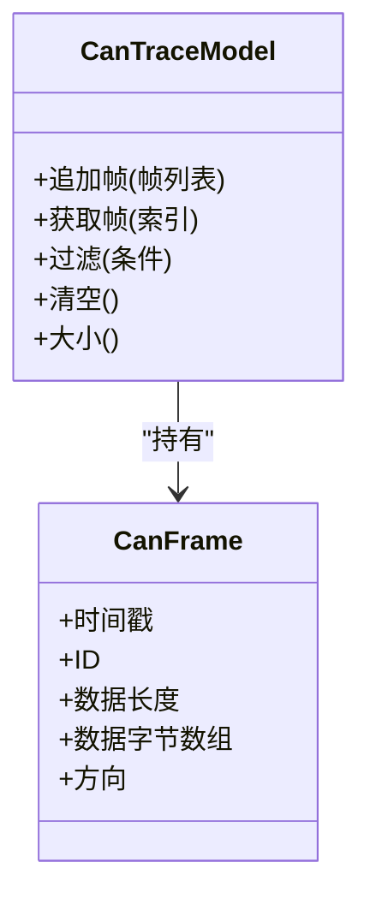
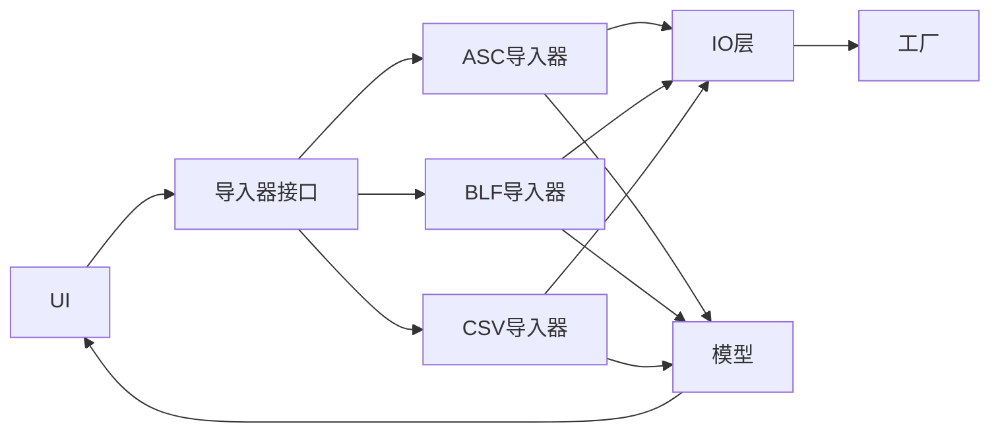

# 文件导入系统

<cite>
**本文引用的文件**   
- [src/core/file_import/file_importer.h](file://src/core/file_import/file_importer.h)
- [src/core/file_import/file_importer.cpp](file://src/core/file_import/file_importer.cpp)
- [src/core/file_import/asc_importer.h](file://src/core/file_import/asc_importer.h)
- [src/core/file_import/asc_importer.cpp](file://src/core/file_import/asc_importer.cpp)
- [src/core/file_import/blf_importer.h](file://src/core/file_import/blf_importer.h)
- [src/core/file_import/blf_importer.cpp](file://src/core/file_import/blf_importer.cpp)
- [src/core/file_import/csv_importer.h](file://src/core/file_import/csv_importer.h)
- [src/core/file_import/csv_importer.cpp](file://src/core/file_import/csv_importer.cpp)
- [src/core/canfileio/canfileio.h](file://src/core/canfileio/canfileio.h)
- [src/core/canfileio/canfileio.cpp](file://src/core/canfileio/canfileio.cpp)
- [src/core/canfileio/canfileio_factory.h](file://src/core/canfileio/canfileio_factory.h)
- [src/core/canframe.h](file://src/core/canframe.h)
- [src/models/cantracemodel.h](file://src/models/cantracemodel.h)
- [src/models/cantracemodel.cpp](file://src/models/cantracemodel.cpp)
- [src/ui/mainwindow.h](file://src/ui/mainwindow.h)
- [src/ui/mainwindow.cpp](file://src/ui/mainwindow.cpp)
</cite>

## 目录
1. [简介](#简介)
2. [项目结构](#项目结构)
3. [核心组件](#核心组件)
4. [架构总览](#架构总览)
5. [详细组件分析](#详细组件分析)
6. [依赖关系分析](#依赖关系分析)
7. [性能考虑](#性能考虑)
8. [故障排查指南](#故障排查指南)
9. [结论](#结论)
10. [附录](#附录)

## 简介
本文件围绕“文件导入系统”展开，该系统负责将多种CAN总线日志与数据文件（如 ASC、BLF、CSV）解析为统一的 CAN 帧数据结构，并注入到模型层以供 UI 展示与分析。系统采用“抽象接口 + 具体导入器”的设计，结合工厂模式进行格式识别与实例化，确保可扩展性与高内聚低耦合。

## 项目结构
文件导入系统主要位于 src/core/file_import 与 src/core/canfileio 两个子模块：
- file_import：定义统一的导入器接口与具体格式实现（ASC、BLF、CSV）。
- canfileio：提供底层文件格式读写能力与工厂机制，供导入器调用。
- models：承载解析后的 CAN 帧数据，供 UI 层渲染。
- ui：用户交互入口，触发导入流程。

图表来源
- [src/ui/mainwindow.h](file://src/ui/mainwindow.h)
- [src/ui/mainwindow.cpp](file://src/ui/mainwindow.cpp)
- [src/core/file_import/file_importer.h](file://src/core/file_import/file_importer.h)
- [src/core/file_import/asc_importer.h](file://src/core/file_import/asc_importer.h)
- [src/core/file_import/blf_importer.h](file://src/core/file_import/blf_importer.h)
- [src/core/file_import/csv_importer.h](file://src/core/file_import/csv_importer.h)
- [src/core/canfileio/canfileio.h](file://src/core/canfileio/canfileio.h)
- [src/core/canfileio/canfileio_factory.h](file://src/core/canfileio/canfileio_factory.h)
- [src/models/cantracemodel.h](file://src/models/cantracemodel.h)

章节来源
- [src/core/file_import/file_importer.h](file://src/core/file_import/file_importer.h)
- [src/core/file_import/file_importer.cpp](file://src/core/file_import/file_importer.cpp)
- [src/core/canfileio/canfileio.h](file://src/core/canfileio/canfileio.h)
- [src/core/canfileio/canfileio.cpp](file://src/core/canfileio/canfileio.cpp)
- [src/core/canfileio/canfileio_factory.h](file://src/core/canfileio/canfileio_factory.h)
- [src/models/cantracemodel.h](file://src/models/cantracemodel.h)
- [src/models/cantracemodel.cpp](file://src/models/cantracemodel.cpp)
- [src/ui/mainwindow.h](file://src/ui/mainwindow.h)
- [src/ui/mainwindow.cpp](file://src/ui/mainwindow.cpp)

## 核心组件
- 导入器接口：定义统一的导入方法、进度回调、错误处理等契约，屏蔽不同格式的解析差异。
- 具体导入器：分别实现 ASC、BLF、CSV 的解析逻辑，调用 IO 层读取原始数据，转换为统一帧结构后写入模型。
- IO 层与工厂：封装各格式文件的底层读写细节，并通过工厂根据扩展名或文件头识别具体解析器。
- 数据模型：集中存储 CAN 帧序列，提供查询、过滤、视图绑定等能力。
- UI 入口：发起导入任务，管理进度与结果展示。

章节来源
- [src/core/file_import/file_importer.h](file://src/core/file_import/file_importer.h)
- [src/core/file_import/file_importer.cpp](file://src/core/file_import/file_importer.cpp)
- [src/core/canfileio/canfileio.h](file://src/core/canfileio/canfileio.h)
- [src/core/canfileio/canfileio_factory.h](file://src/core/canfileio/canfileio_factory.h)
- [src/models/cantracemodel.h](file://src/models/cantracemodel.h)
- [src/ui/mainwindow.h](file://src/ui/mainwindow.h)

## 架构总览
导入流程从 UI 触发，经导入器选择与实例化，调用 IO 层读取文件，解析为 CAN 帧并追加至模型，最后通过信号槽更新 UI。

图表来源
- [src/ui/mainwindow.cpp](file://src/ui/mainwindow.cpp)
- [src/core/file_import/file_importer.cpp](file://src/core/file_import/file_importer.cpp)
- [src/core/canfileio/canfileio_factory.h](file://src/core/canfileio/canfileio_factory.h)
- [src/core/canfileio/canfileio.cpp](file://src/core/canfileio/canfileio.cpp)
- [src/models/cantracemodel.cpp](file://src/models/cantracemodel.cpp)

## 详细组件分析

### 导入器接口与基类
- 职责：定义统一的导入入口、进度回调、错误上报、取消机制。
- 关键点：
  - 支持异步导入，避免阻塞 UI。
  - 提供可插拔的错误处理策略。
  - 暴露进度事件，便于 UI 显示百分比与状态。

图表来源
- [src/core/file_import/file_importer.h](file://src/core/file_import/file_importer.h)
- [src/core/file_import/file_importer.cpp](file://src/core/file_import/file_importer.cpp)
- [src/core/file_import/asc_importer.h](file://src/core/file_import/asc_importer.h)
- [src/core/file_import/blf_importer.h](file://src/core/file_import/blf_importer.h)
- [src/core/file_import/csv_importer.h](file://src/core/file_import/csv_importer.h)

章节来源
- [src/core/file_import/file_importer.h](file://src/core/file_import/file_importer.h)
- [src/core/file_import/file_importer.cpp](file://src/core/file_import/file_importer.cpp)

### ASC 导入器
- 职责：解析 ASC 文本格式，提取时间戳、ID、数据域、方向等字段，构造统一帧。
- 关键点：
  - 行级解析与容错跳过无效行。
  - 增量追加至模型，降低内存峰值。
  - 进度按行数估算。

图表来源
- [src/core/file_import/asc_importer.cpp](file://src/core/file_import/asc_importer.cpp)
- [src/models/cantracemodel.cpp](file://src/models/cantracemodel.cpp)

章节来源
- [src/core/file_import/asc_importer.h](file://src/core/file_import/asc_importer.h)
- [src/core/file_import/asc_importer.cpp](file://src/core/file_import/asc_importer.cpp)

### BLF 导入器
- 职责：解析二进制 BLF 容器，定位事件记录，解码为 CAN 帧。
- 关键点：
  - 文件头校验与版本兼容。
  - 事件类型判断与字段映射。
  - 批量读取与零拷贝优化（若适用）。

图表来源
- [src/core/file_import/blf_importer.cpp](file://src/core/file_import/blf_importer.cpp)
- [src/models/cantracemodel.cpp](file://src/models/cantracemodel.cpp)

章节来源
- [src/core/file_import/blf_importer.h](file://src/core/file_import/blf_importer.h)
- [src/core/file_import/blf_importer.cpp](file://src/core/file_import/blf_importer.cpp)

### CSV 导入器
- 职责：解析 CSV 文本，按列映射为 CAN 帧字段。
- 关键点：
  - 分隔符与编码自适应。
  - 表头识别与列索引映射。
  - 数值转换与异常值处理。

图表来源
- [src/core/file_import/csv_importer.cpp](file://src/core/file_import/csv_importer.cpp)
- [src/models/cantracemodel.cpp](file://src/models/cantracemodel.cpp)

章节来源
- [src/core/file_import/csv_importer.h](file://src/core/file_import/csv_importer.h)
- [src/core/file_import/csv_importer.cpp](file://src/core/file_import/csv_importer.cpp)

### IO 层与工厂
- 职责：封装 ASC/BLF/CSV 的底层读取逻辑，提供统一接口；工厂根据文件或扩展名返回具体读取器。
- 关键点：
  - 工厂注册与查找机制。
  - 读取器生命周期管理。
  - 错误码与异常传播。

图表来源
- [src/core/canfileio/canfileio.h](file://src/core/canfileio/canfileio.h)
- [src/core/canfileio/canfileio.cpp](file://src/core/canfileio/canfileio.cpp)
- [src/core/canfileio/canfileio_factory.h](file://src/core/canfileio/canfileio_factory.h)

章节来源
- [src/core/canfileio/canfileio.h](file://src/core/canfileio/canfileio.h)
- [src/core/canfileio/canfileio.cpp](file://src/core/canfileio/canfileio.cpp)
- [src/core/canfileio/canfileio_factory.h](file://src/core/canfileio/canfileio_factory.h)

### 数据模型与帧结构
- 职责：存储 CAN 帧序列，提供插入、查询、过滤、视图绑定等能力。
- 关键点：
  - 批量追加减少重绘次数。
  - 索引与缓存提升查询效率。
  - 线程安全访问（若涉及多线程）。

图表来源
- [src/core/canframe.h](file://src/core/canframe.h)
- [src/models/cantracemodel.h](file://src/models/cantracemodel.h)
- [src/models/cantracemodel.cpp](file://src/models/cantracemodel.cpp)

章节来源
- [src/core/canframe.h](file://src/core/canframe.h)
- [src/models/cantracemodel.h](file://src/models/cantracemodel.h)
- [src/models/cantracemodel.cpp](file://src/models/cantracemodel.cpp)

### UI 入口与交互
- 职责：提供“打开文件”对话框，选择导入器，启动导入任务，显示进度与结果。
- 关键点：
  - 异步任务调度，避免阻塞主线程。
  - 进度条与状态提示。
  - 错误弹窗与恢复建议。

章节来源
- [src/ui/mainwindow.h](file://src/ui/mainwindow.h)
- [src/ui/mainwindow.cpp](file://src/ui/mainwindow.cpp)

## 依赖关系分析
- 松耦合：导入器仅依赖接口与模型，不直接耦合 UI。
- 工厂解耦：IO 层通过工厂按需创建读取器，新增格式只需注册。
- 数据流向：文件 → IO → 导入器 → 模型 → UI。

图表来源
- [src/ui/mainwindow.cpp](file://src/ui/mainwindow.cpp)
- [src/core/file_import/file_importer.cpp](file://src/core/file_import/file_importer.cpp)
- [src/core/canfileio/canfileio_factory.h](file://src/core/canfileio/canfileio_factory.h)
- [src/models/cantracemodel.cpp](file://src/models/cantracemodel.cpp)

章节来源
- [src/core/file_import/file_importer.cpp](file://src/core/file_import/file_importer.cpp)
- [src/core/canfileio/canfileio_factory.h](file://src/core/canfileio/canfileio_factory.h)
- [src/models/cantracemodel.cpp](file://src/models/cantracemodel.cpp)
- [src/ui/mainwindow.cpp](file://src/ui/mainwindow.cpp)

## 性能考虑
- 批量写入：导入器应累积一定数量的帧后再批量追加模型，减少 UI 重绘与锁竞争。
- 内存控制：大文件分块读取，避免一次性加载全部数据。
- 解析优化：预分配缓冲区、复用字符串/向量，减少动态分配。
- 并发策略：后台线程执行解析，主线程仅负责 UI 更新与进度反馈。
- 缓存与索引：对常用查询建立索引，提高筛选与搜索速度。

[本节为通用指导，不直接分析具体文件]

## 故障排查指南
- 常见错误：
  - 文件头损坏或格式不匹配：检查文件完整性与扩展名一致性。
  - 解析失败行过多：查看导入器的跳过计数与错误日志。
  - 内存不足：减小批次大小或启用分页加载。
- 调试建议：
  - 启用详细日志，记录关键阶段与异常堆栈。
  - 使用最小样例文件复现问题。
  - 在导入器中增加断点，逐步验证字段映射。

章节来源
- [src/core/file_import/asc_importer.cpp](file://src/core/file_import/asc_importer.cpp)
- [src/core/file_import/blf_importer.cpp](file://src/core/file_import/blf_importer.cpp)
- [src/core/file_import/csv_importer.cpp](file://src/core/file_import/csv_importer.cpp)

## 结论
文件导入系统通过清晰的层次划分与接口抽象，实现了多格式 CAN 数据的统一接入。借助工厂与模型层，系统在可扩展性、性能与可维护性方面具备良好基础。后续可在解析精度、错误恢复与大数据量场景下进一步优化。

[本节为总结性内容，不直接分析具体文件]

## 附录
- 术语说明：
  - CAN 帧：包含时间戳、标识符、数据长度与数据字节的通信单元。
  - ASC/BLF/CSV：常见的 CAN 日志与数据导出格式。
- 扩展建议：
  - 新增格式时，实现导入器接口并在工厂注册。
  - 为模型增加更多查询与统计接口，提升分析能力。

[本节为补充信息，不直接分析具体文件]