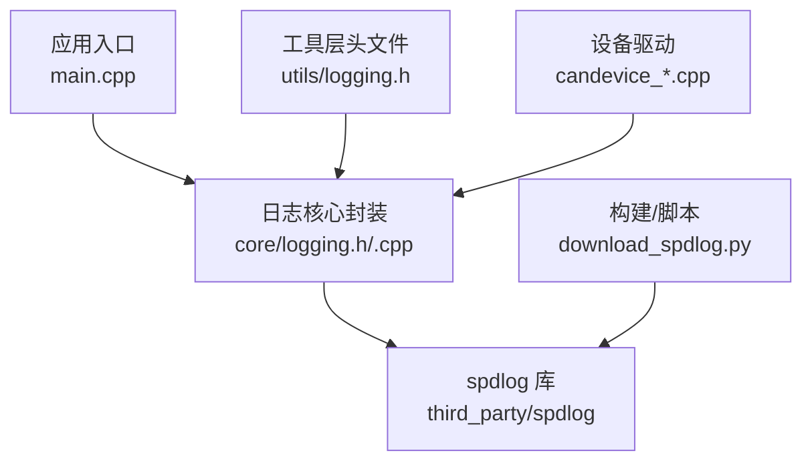
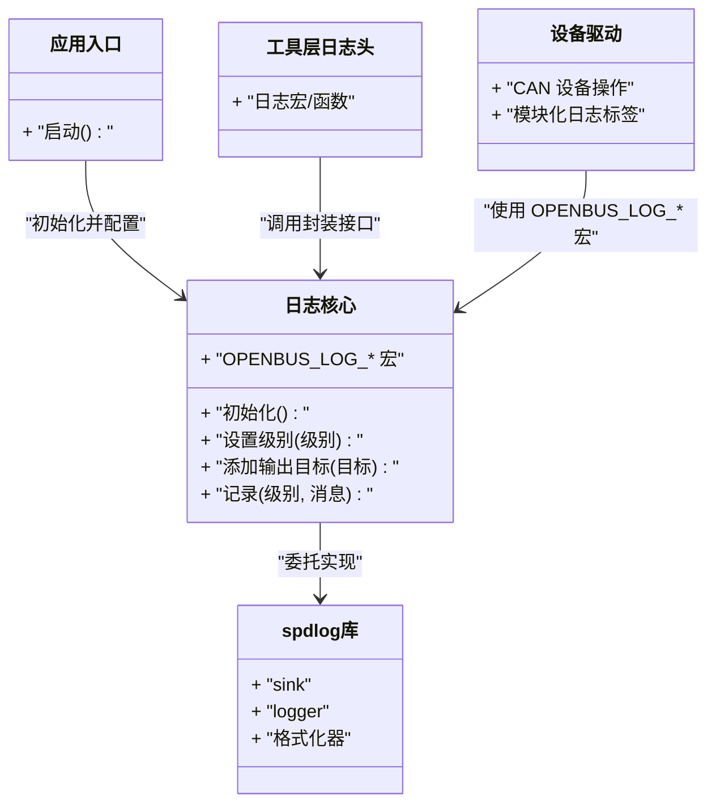
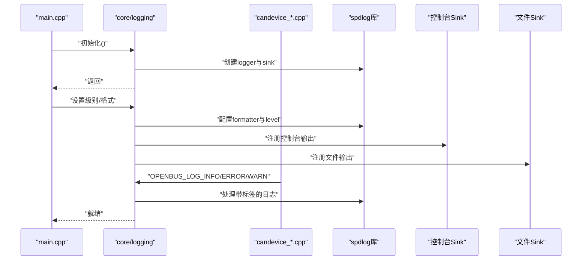
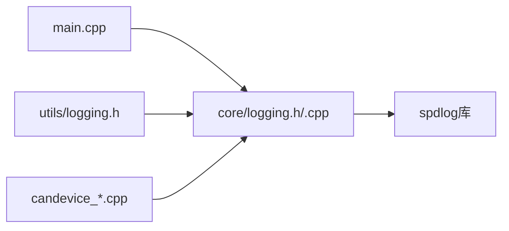

# 日志系统

<cite>
**本文引用的文件**   
- [src/core/logging.h](file://src/core/logging.h)
- [src/core/logging.cpp](file://src/core/logging.cpp)
- [src/utils/logging.h](file://src/utils/logging.h)
- [src/main.cpp](file://src/main.cpp)
- [scripts/download_spdlog.py](file://scripts/download_spdlog.py)
- [src/core/candevice_zlg.cpp](file://src/core/candevice_zlg.cpp)
- [src/core/candevice_kvaser.cpp](file://src/core/candevice_kvaser.cpp)
- [src/core/candevice_peak.cpp](file://src/core/candevice_peak.cpp)
- [src/core/candevice.cpp](file://src/core/candevice.cpp)
</cite>

## 更新摘要
**变更内容**   
- 更新了设备驱动文件的日志宏使用，从 SIN_LOG_* 迁移到 OPENBUS_LOG_*
- 增强了品牌一致性，确保所有设备驱动输出统一的日志前缀
- 完善了日志系统的品牌标识和模块标签机制

## 目录
1. [简介](#简介)
2. [项目结构](#项目结构)
3. [核心组件](#核心组件)
4. [架构总览](#架构总览)
5. [详细组件分析](#详细组件分析)
6. [依赖分析](#依赖分析)
7. [性能考虑](#性能考虑)
8. [故障排查指南](#故障排查指南)
9. [结论](#结论)
10. [附录](#附录)

## 简介
本仓库包含一个面向 CAN 总线仿真与调试的桌面应用，其中"日志系统"是贯穿核心模块、UI 层与工具层的通用基础设施。日志系统基于 spdlog 实现，提供统一的日志接口、多输出目标（控制台、文件等）、分级控制与线程安全能力，支撑记录运行状态、错误诊断与性能分析。

**更新** 日志系统已全面采用 OPENBUS_LOG_* 系列宏，统一了品牌标识，确保所有设备驱动（ZLG、Kvaser、PEAK）的输出格式一致，便于日志分析和故障排查。

## 项目结构
日志相关代码主要分布在以下位置：
- src/core/logging.{h,cpp}：封装 spdlog 的核心日志接口与初始化逻辑
- src/utils/logging.h：为工具层提供的轻量日志头文件
- src/main.cpp：应用入口，负责全局日志初始化
- scripts/download_spdlog.py：第三方库下载脚本，用于获取 spdlog 源码或预编译产物
- src/core/candevice_*.cpp：设备驱动文件，现已统一使用 OPENBUS_LOG_* 宏

图表来源 
- [src/main.cpp](file://src/main.cpp)
- [src/core/logging.h](file://src/core/logging.h)
- [src/core/logging.cpp](file://src/core/logging.cpp)
- [src/utils/logging.h](file://src/utils/logging.h)
- [scripts/download_spdlog.py](file://scripts/download_spdlog.py)
- [src/core/candevice_zlg.cpp](file://src/core/candevice_zlg.cpp)
- [src/core/candevice_kvaser.cpp](file://src/core/candevice_kvaser.cpp)
- [src/core/candevice_peak.cpp](file://src/core/candevice_peak.cpp)

章节来源
- [src/core/logging.h](file://src/core/logging.h)
- [src/core/logging.cpp](file://src/core/logging.cpp)
- [src/utils/logging.h](file://src/utils/logging.h)
- [src/main.cpp](file://src/main.cpp)
- [scripts/download_spdlog.py](file://scripts/download_spdlog.py)
- [src/core/candevice_zlg.cpp](file://src/core/candevice_zlg.cpp)
- [src/core/candevice_kvaser.cpp](file://src/core/candevice_kvaser.cpp)
- [src/core/candevice_peak.cpp](file://src/core/candevice_peak.cpp)

## 核心组件
- 日志核心封装（core/logging）
  - 职责：统一对外暴露日志 API，屏蔽 spdlog 细节；提供初始化、级别设置、输出目标管理、异步/同步策略选择等。
  - 关键能力：单例或全局访问点、线程安全、可配置的多 sink（控制台、文件、滚动文件等）。
  - **更新** 定义了 OPENBUS_LOG_* 系列宏，支持模块化标签和格式化字符串。
- 工具层日志头（utils/logging.h）
  - 职责：为 utils 模块提供最小化依赖的日志宏或函数包装，避免循环依赖。
  - **更新** 重新包含核心日志头文件，作为统一入口点。
- 应用入口初始化（main.cpp）
  - 职责：在程序启动时完成日志系统初始化，设定默认级别、输出格式与目标。
- 第三方依赖管理（download_spdlog.py）
  - 职责：自动化下载 spdlog 源码或二进制，便于本地构建与集成。
- **新增** 设备驱动日志集成
  - ZLG、Kvaser、PEAK 等设备驱动现已统一使用 OPENBUS_LOG_* 宏
  - 每个设备模块都有独立的日志标签，便于区分不同设备的日志输出

章节来源
- [src/core/logging.h:35-45](file://src/core/logging.h#L35-L45)
- [src/core/logging.cpp](file://src/core/logging.cpp)
- [src/utils/logging.h:4-8](file://src/utils/logging.h#L4-L8)
- [src/main.cpp](file://src/main.cpp)
- [scripts/download_spdlog.py](file://scripts/download_spdlog.py)
- [src/core/candevice_zlg.cpp:194-199](file://src/core/candevice_zlg.cpp#L194-L199)
- [src/core/candevice_kvaser.cpp:49-53](file://src/core/candevice_kvaser.cpp#L49-L53)
- [src/core/candevice_peak.cpp:57-78](file://src/core/candevice_peak.cpp#L57-L78)

## 架构总览
日志系统采用"薄封装 + 强依赖"的架构：上层通过 core/logging 的统一接口进行调用，内部委托给 spdlog 完成实际的 I/O 与格式化。该设计确保：
- 松耦合：业务模块仅依赖 core/logging 或 utils/logging.h
- 可替换性：若需更换底层日志库，仅需修改封装层
- 可扩展性：新增输出目标（如网络、数据库）只需扩展 sink 配置
- **增强** 品牌一致性：所有设备驱动使用统一的 OPENBUS_LOG_* 宏，确保日志输出格式一致

图表来源 
- [src/core/logging.h:35-45](file://src/core/logging.h#L35-L45)
- [src/core/logging.cpp](file://src/core/logging.cpp)
- [src/utils/logging.h:4-8](file://src/utils/logging.h#L4-L8)
- [src/main.cpp](file://src/main.cpp)
- [src/core/candevice_zlg.cpp:194-199](file://src/core/candevice_zlg.cpp#L194-L199)

## 详细组件分析

### 日志核心封装（core/logging）
- 设计要点
  - 对外暴露简洁 API，隐藏 spdlog 的 logger/sink/formatter 等复杂概念
  - 支持运行时调整日志级别与输出目标，便于调试与生产环境切换
  - 保证多线程并发写入时的安全性（由 spdlog 保障）
  - **更新** 定义了 OPENBUS_LOG_* 系列宏，支持模块化标签和 C++ 风格格式化
- 典型流程
  - 应用启动时调用初始化，注册默认 sink（控制台、文件）
  - 各模块通过统一接口记录日志，自动按级别过滤与格式化
  - 可按需增加自定义 sink（如写入数据库或远程服务）

图表来源 
- [src/core/logging.h:35-45](file://src/core/logging.h#L35-L45)
- [src/core/logging.cpp](file://src/core/logging.cpp)
- [src/main.cpp](file://src/main.cpp)
- [src/core/candevice_zlg.cpp:194-199](file://src/core/candevice_zlg.cpp#L194-L199)

章节来源
- [src/core/logging.h:35-45](file://src/core/logging.h#L35-L45)
- [src/core/logging.cpp](file://src/core/logging.cpp)

### 工具层日志头（utils/logging.h）
- 设计要点
  - 提供轻量级日志宏或函数，避免引入完整核心实现
  - 通常以条件编译或内联方式减少开销
  - **更新** 作为统一入口，重新包含核心日志头文件
- 使用场景
  - 工具函数中快速记录调试信息或异常路径
  - 与核心封装解耦，降低模块间依赖

章节来源
- [src/utils/logging.h:4-8](file://src/utils/logging.h#L4-L8)

### 应用入口初始化（main.cpp）
- 设计要点
  - 在进程启动早期完成日志系统初始化
  - 根据运行模式（调试/发布）设置不同默认级别与输出目标
- 典型步骤
  - 初始化 spdlog
  - 设置全局级别与时间戳格式
  - 注册必要的 sink（控制台、文件）

章节来源
- [src/main.cpp](file://src/main.cpp)

### 第三方依赖管理（download_spdlog.py）
- 设计要点
  - 自动化下载 spdlog 源码或预编译包，简化本地构建流程
  - 支持指定版本与平台，提升跨平台一致性
- 使用建议
  - 首次构建前执行脚本，确保依赖可用
  - 在网络受限环境下可离线准备依赖

章节来源
- [scripts/download_spdlog.py](file://scripts/download_spdlog.py)

### 设备驱动日志集成
- **新增功能** 所有设备驱动现已统一使用 OPENBUS_LOG_* 宏
- **ZLG 设备驱动** (candevice_zlg.cpp)
  - 使用 OPENBUS_LOG_WARN/INFO/ERROR 记录 DLL 加载和设备状态
  - 模块化标签 "CanDeviceZLG" 便于识别日志来源
  - 支持 CAN FD 和 Classic CAN 两种模式的详细日志
- **Kvaser 设备驱动** (candevice_kvaser.cpp)
  - 统一的日志格式，包含 canlib32.dll 加载状态
  - 详细的通道打开和关闭过程记录
- **PEAK 设备驱动** (candevice_peak.cpp)
  - PCANUSB.dll 加载和设备初始化的完整日志
  - 支持 CAN FD 和标准 CAN 的详细操作记录

章节来源
- [src/core/candevice_zlg.cpp:194-199](file://src/core/candevice_zlg.cpp#L194-L199)
- [src/core/candevice_zlg.cpp:215-245](file://src/core/candevice_zlg.cpp#L215-L245)
- [src/core/candevice_kvaser.cpp:49-53](file://src/core/candevice_kvaser.cpp#L49-L53)
- [src/core/candevice_kvaser.cpp:71-115](file://src/core/candevice_kvaser.cpp#L71-L115)
- [src/core/candevice_peak.cpp:57-78](file://src/core/candevice_peak.cpp#L57-L78)
- [src/core/candevice_peak.cpp:106-159](file://src/core/candevice_peak.cpp#L106-L159)

## 依赖分析
日志系统的依赖关系清晰且层次分明：
- main.cpp 依赖 core/logging 进行初始化
- core/logging 依赖 spdlog 完成实际日志输出
- utils/logging.h 作为轻量头文件，重新包含 core/logging
- **更新** 设备驱动文件依赖 core/logging 中的 OPENBUS_LOG_* 宏

图表来源 
- [src/main.cpp](file://src/main.cpp)
- [src/core/logging.h:35-45](file://src/core/logging.h#L35-L45)
- [src/core/logging.cpp](file://src/core/logging.cpp)
- [src/utils/logging.h:4-8](file://src/utils/logging.h#L4-L8)
- [src/core/candevice_zlg.cpp:194-199](file://src/core/candevice_zlg.cpp#L194-L199)

章节来源
- [src/main.cpp](file://src/main.cpp)
- [src/core/logging.h:35-45](file://src/core/logging.h#L35-L45)
- [src/core/logging.cpp](file://src/core/logging.cpp)
- [src/utils/logging.h:4-8](file://src/utils/logging.h#L4-L8)
- [src/core/candevice_zlg.cpp:194-199](file://src/core/candevice_zlg.cpp#L194-L199)

## 性能考虑
- 异步日志：在高吞吐场景下启用异步 sink，避免阻塞主线程
- 级别过滤：合理设置日志级别，减少不必要的格式化与 I/O
- 输出目标：生产环境优先文件输出，调试阶段开启控制台与更详细的级别
- 缓冲策略：根据磁盘 I/O 特性调整缓冲大小与刷新频率
- 线程安全：利用 spdlog 的线程安全特性，避免额外锁竞争
- **优化** 模块化标签减少了日志解析开销，提高日志处理效率

[本节为通用指导，不直接分析具体文件]

## 故障排查指南
- 日志未输出
  - 检查初始化是否成功调用
  - 确认当前级别是否高于或等于输出级别
  - 验证 sink 是否正确注册且路径可写
- 文件无法写入
  - 检查权限与路径是否存在
  - 确认磁盘空间与句柄限制
- 性能下降
  - 评估是否启用了过多 sink 或过高频率刷新
  - 考虑切换到异步模式或降低级别
- 乱码或格式异常
  - 检查编码设置与 formatter 配置
  - 确认时间戳与线程 ID 等字段是否冲突
- **新增** 设备驱动日志问题
  - 检查 OPENBUS_LOG_* 宏是否正确包含 logging.h
  - 确认设备模块标签是否与预期一致
  - 验证不同设备驱动的日志格式是否统一

章节来源
- [src/core/logging.h:35-45](file://src/core/logging.h#L35-L45)
- [src/core/logging.cpp](file://src/core/logging.cpp)
- [src/main.cpp](file://src/main.cpp)
- [src/core/candevice_zlg.cpp:194-199](file://src/core/candevice_zlg.cpp#L194-L199)

## 结论
本项目的日志系统以 spdlog 为核心，通过 core/logging 的薄封装实现了统一、可扩展、高性能的日志能力。**最新更新** 已将所有设备驱动（ZLG、Kvaser、PEAK）的日志宏统一迁移到 OPENBUS_LOG_* 系列，确保了品牌一致性和日志格式标准化。配合 utils/logging.h 的轻量接口与 main.cpp 的全局初始化，形成了清晰的层次结构与稳定的运行基线。建议在后续迭代中继续完善配置化能力与监控指标，以满足更大规模与更高可靠性的需求。

[本节为总结性内容，不直接分析具体文件]

## 附录
- 术语
  - Sink：日志输出目标（控制台、文件、网络等）
  - Logger：日志记录器，负责格式化与分发
  - Formatter：日志格式器，定义输出样式
  - **新增** 模块化标签：用于标识日志来源的字符串标签
- 最佳实践
  - 将关键路径与异常分支纳入日志
  - 避免在高频循环中记录高开销日志
  - 使用结构化日志便于后续分析与检索
  - **更新** 统一使用 OPENBUS_LOG_* 宏，确保品牌一致性
  - **更新** 为每个设备模块使用独立的日志标签，便于问题定位

[本节为补充说明，不直接分析具体文件]