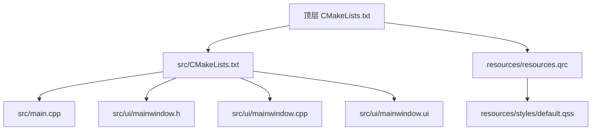
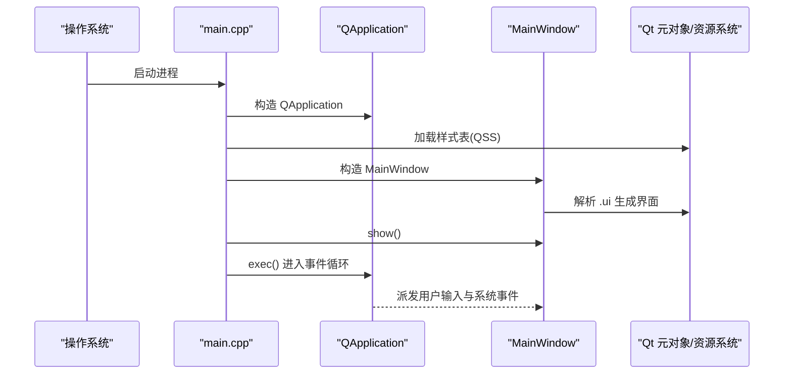
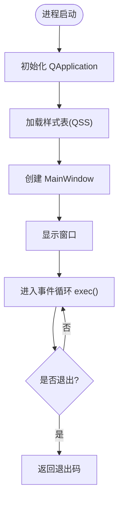
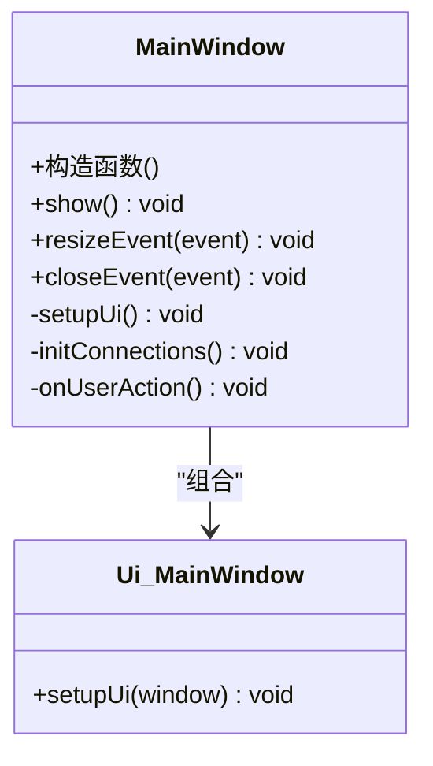
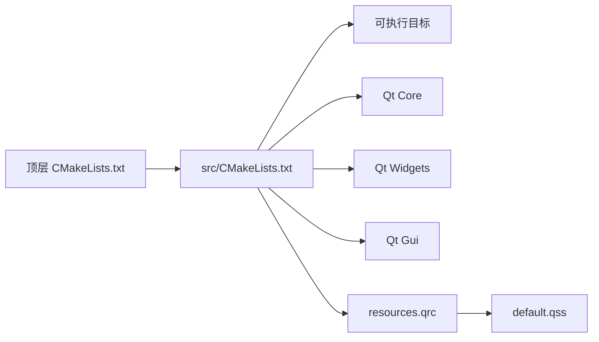
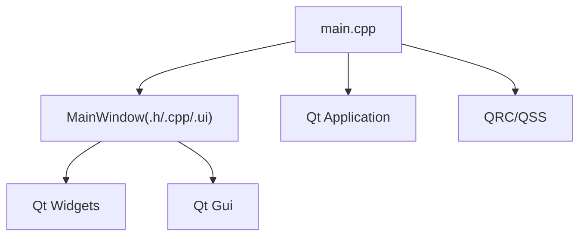

# 核心模块详解

<cite>
**本文档引用的文件**   
- [src/main.cpp](file://src/main.cpp)
- [src/ui/mainwindow.h](file://src/ui/mainwindow.h)
- [src/ui/mainwindow.cpp](file://src/ui/mainwindow.cpp)
- [src/ui/mainwindow.ui](file://src/ui/mainwindow.ui)
- [CMakeLists.txt](file://CMakeLists.txt)
- [src/CMakeLists.txt](file://src/CMakeLists.txt)
- [resources/resources.qrc](file://resources/resources.qrc)
- [README.en.md](file://README.en.md)
</cite>

## 目录
1. [简介](#简介)
2. [项目结构](#项目结构)
3. [核心组件](#核心组件)
4. [架构总览](#架构总览)
5. [详细组件分析](#详细组件分析)
6. [依赖关系分析](#依赖关系分析)
7. [性能考虑](#性能考虑)
8. [故障排查指南](#故障排查指南)
9. [结论](#结论)
10. [附录](#附录)

## 简介
本技术文档围绕该 Qt 应用程序的核心模块进行系统化说明，重点覆盖：
- 应用程序入口点的实现细节、调用关系与使用模式
- UI 主窗口组件的职责边界、数据流与事件处理
- CMake 构建配置与资源集成方式
- 与其他组件的耦合关系与扩展点
- 常见问题定位与解决方案

目标读者包括初学者与有经验的开发者。文档在保持可读性的同时，提供足够的代码级细节与可视化图示，帮助快速理解并高效扩展。

## 项目结构
该项目采用典型的 Qt + CMake 工程组织方式：
- src: 源代码目录，包含 main.cpp 与 ui 子模块
- resources: Qt 资源文件（样式表与资源清单）
- CMakeLists.txt: 顶层构建脚本
- README.en.md: 英文说明文档

图表来源
- [CMakeLists.txt](file://CMakeLists.txt)
- [src/CMakeLists.txt](file://src/CMakeLists.txt)
- [src/main.cpp](file://src/main.cpp)
- [src/ui/mainwindow.h](file://src/ui/mainwindow.h)
- [src/ui/mainwindow.cpp](file://src/ui/mainwindow.cpp)
- [src/ui/mainwindow.ui](file://src/ui/mainwindow.ui)
- [resources/resources.qrc](file://resources/resources.qrc)
- [resources/styles/default.qss](file://resources/styles/default.qss)

章节来源
- [CMakeLists.txt](file://CMakeLists.txt)
- [src/CMakeLists.txt](file://src/CMakeLists.txt)
- [README.en.md](file://README.en.md)

## 核心组件
- 应用程序入口（main.cpp）
  - 负责初始化 Qt 应用对象、加载全局样式、创建并显示主窗口、进入事件循环
  - 关键职责：应用生命周期管理、资源加载、UI 启动
- 主窗口（MainWindow）
  - 封装 UI 界面与业务交互逻辑
  - 通过 .ui 文件描述界面布局，.h/.cpp 实现行为
- 构建系统（CMake）
  - 定义可执行目标、源文件集合、Qt 模块链接、资源编译
- 资源系统（QRC/QSS）
  - 将样式表打包进资源，运行时动态加载

章节来源
- [src/main.cpp](file://src/main.cpp)
- [src/ui/mainwindow.h](file://src/ui/mainwindow.h)
- [src/ui/mainwindow.cpp](file://src/ui/mainwindow.cpp)
- [src/CMakeLists.txt](file://src/CMakeLists.txt)
- [resources/resources.qrc](file://resources/resources.qrc)

## 架构总览
下图展示了从应用启动到 UI 渲染的关键流程，以及各组件之间的依赖关系。

图表来源
- [src/main.cpp](file://src/main.cpp)
- [src/ui/mainwindow.h](file://src/ui/mainwindow.h)
- [src/ui/mainwindow.cpp](file://src/ui/mainwindow.cpp)
- [resources/resources.qrc](file://resources/resources.qrc)

## 详细组件分析

### 应用程序入口（main.cpp）
- 职责
  - 创建 QApplication 实例
  - 设置应用属性（如高 DPI、样式等）
  - 实例化并显示 MainWindow
  - 进入 QApplication::exec() 事件循环
- 关键参数与返回值
  - 命令行参数：通常用于调试开关或配置文件路径（由具体实现决定）
  - 返回码：程序退出时向操作系统返回的状态码
- 常见用法
  - 在启动前加载全局样式表
  - 在启动前设置平台相关选项（如 Windows 下的高 DPI）
- 错误处理
  - 若资源加载失败，应给出明确提示并优雅退出
  - 避免在构造阶段抛出未捕获异常

图表来源
- [src/main.cpp](file://src/main.cpp)

章节来源
- [src/main.cpp](file://src/main.cpp)

### 主窗口组件（MainWindow）
- 职责
  - 承载 UI 布局与交互逻辑
  - 响应用户操作，触发业务回调或状态更新
  - 与外部模块（如网络、存储）交互（如有）
- 数据结构与复杂度
  - 典型成员：视图控件指针、模型数据、状态标志
  - 时间复杂度：UI 事件处理通常为 O(1)~O(n)，取决于事件处理逻辑
- 依赖关系
  - 依赖 Qt 框架（QWidget/QMainWindow、信号槽机制）
  - 可能依赖资源系统（QRC）、样式系统（QSS）
- 设计模式
  - MVC/MVP：分离界面与业务逻辑（视实现而定）
  - 观察者模式：基于 Qt 信号槽的事件分发

图表来源
- [src/ui/mainwindow.h](file://src/ui/mainwindow.h)
- [src/ui/mainwindow.cpp](file://src/ui/mainwindow.cpp)
- [src/ui/mainwindow.ui](file://src/ui/mainwindow.ui)

章节来源
- [src/ui/mainwindow.h](file://src/ui/mainwindow.h)
- [src/ui/mainwindow.cpp](file://src/ui/mainwindow.cpp)
- [src/ui/mainwindow.ui](file://src/ui/mainwindow.ui)

### 构建系统（CMake）
- 顶层 CMakeLists.txt
  - 指定 CMake 版本、项目名称、Qt 查找与启用
  - 递归包含子目录构建脚本
- src/CMakeLists.txt
  - 定义可执行目标（target）
  - 添加源文件、头文件、UI 文件
  - 链接 Qt 模块（Core、Widgets、Gui 等）
  - 启用自动 MOC/UIC/RCC
- 资源与样式
  - 通过 QRC 将样式表等资源打包
  - 运行时通过资源路径访问样式

图表来源
- [CMakeLists.txt](file://CMakeLists.txt)
- [src/CMakeLists.txt](file://src/CMakeLists.txt)
- [resources/resources.qrc](file://resources/resources.qrc)

章节来源
- [CMakeLists.txt](file://CMakeLists.txt)
- [src/CMakeLists.txt](file://src/CMakeLists.txt)
- [resources/resources.qrc](file://resources/resources.qrc)

### 资源系统（QRC/QSS）
- 作用
  - 将样式表、图标等静态资源编译进二进制
  - 运行时通过统一路径访问，避免相对路径问题
- 使用模式
  - 在 QRC 中声明资源条目
  - 在代码中以 ":/styles/default.qss" 形式加载
- 注意事项
  - 确保资源路径一致
  - 大资源建议按需加载

章节来源
- [resources/resources.qrc](file://resources/resources.qrc)
- [resources/styles/default.qss](file://resources/styles/default.qss)

## 依赖关系分析
- 组件内聚与耦合
  - main.cpp 仅负责启动与展示，低耦合
  - MainWindow 封装 UI 与交互，内聚良好
  - CMake 作为构建期依赖，不侵入运行时代码
- 外部依赖
  - Qt 框架（Core/Widgets/Gui）
  - 资源系统（QRC）
- 潜在循环依赖
  - 当前结构未见明显循环；建议在新增模块时保持单向依赖

图表来源
- [src/main.cpp](file://src/main.cpp)
- [src/ui/mainwindow.h](file://src/ui/mainwindow.h)
- [src/ui/mainwindow.cpp](file://src/ui/mainwindow.cpp)
- [src/ui/mainwindow.ui](file://src/ui/mainwindow.ui)
- [resources/resources.qrc](file://resources/resources.qrc)

章节来源
- [src/main.cpp](file://src/main.cpp)
- [src/ui/mainwindow.h](file://src/ui/mainwindow.h)
- [src/ui/mainwindow.cpp](file://src/ui/mainwindow.cpp)
- [src/ui/mainwindow.ui](file://src/ui/mainwindow.ui)
- [resources/resources.qrc](file://resources/resources.qrc)

## 性能考虑
- 启动优化
  - 延迟加载非关键资源（如图标、大型样式）
  - 减少构造阶段的复杂计算
- UI 渲染
  - 避免在主线程执行耗时任务
  - 合理使用样式表，避免过度重绘
- 内存管理
  - 及时释放不再使用的对象
  - 避免深层嵌套的信号槽导致隐式拷贝

## 故障排查指南
- 无法找到样式表
  - 检查 QRC 中资源路径是否正确
  - 确认运行时资源加载路径前缀
- 窗口未显示或崩溃
  - 检查 MainWindow 构造是否抛出异常
  - 验证 .ui 文件生成的类名与方法签名
- 构建失败
  - 确认 Qt 环境已正确配置
  - 检查 CMake 变量与模块链接顺序
- 高 DPI 显示异常
  - 启用 Qt 高 DPI 支持并在必要时缩放 UI

章节来源
- [src/main.cpp](file://src/main.cpp)
- [src/ui/mainwindow.h](file://src/ui/mainwindow.h)
- [src/ui/mainwindow.cpp](file://src/ui/mainwindow.cpp)
- [resources/resources.qrc](file://resources/resources.qrc)

## 结论
本项目以清晰的层次划分与标准的 Qt+CMake 实践为基础，具备良好的可扩展性与可维护性。通过合理拆分入口、UI 与构建配置，结合资源系统统一管理样式与静态资源，能够在保证用户体验的同时提升开发效率。建议在后续迭代中持续遵循低耦合、高内聚原则，逐步引入模块化与单元测试以提升质量。

## 附录
- 术语
  - QRC：Qt 资源编译系统
  - QSS：Qt 样式表
  - MOC/UIC/RCC：Qt 元对象编译器、界面编译器、资源编译器
- 参考
  - 项目英文说明文档可用于了解背景与总体目标

章节来源
- [README.en.md](file://README.en.md)