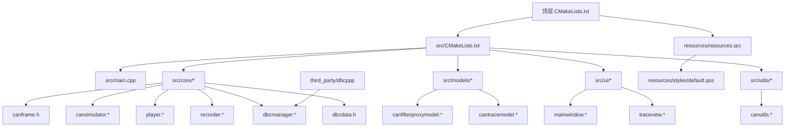
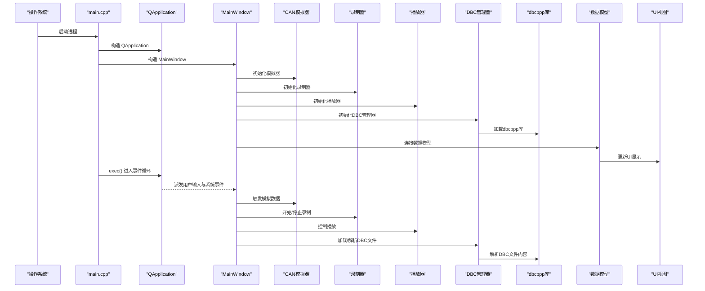
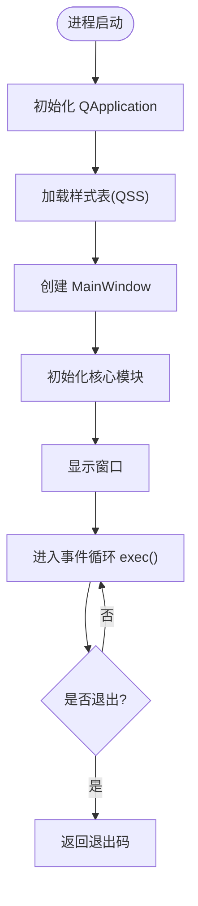
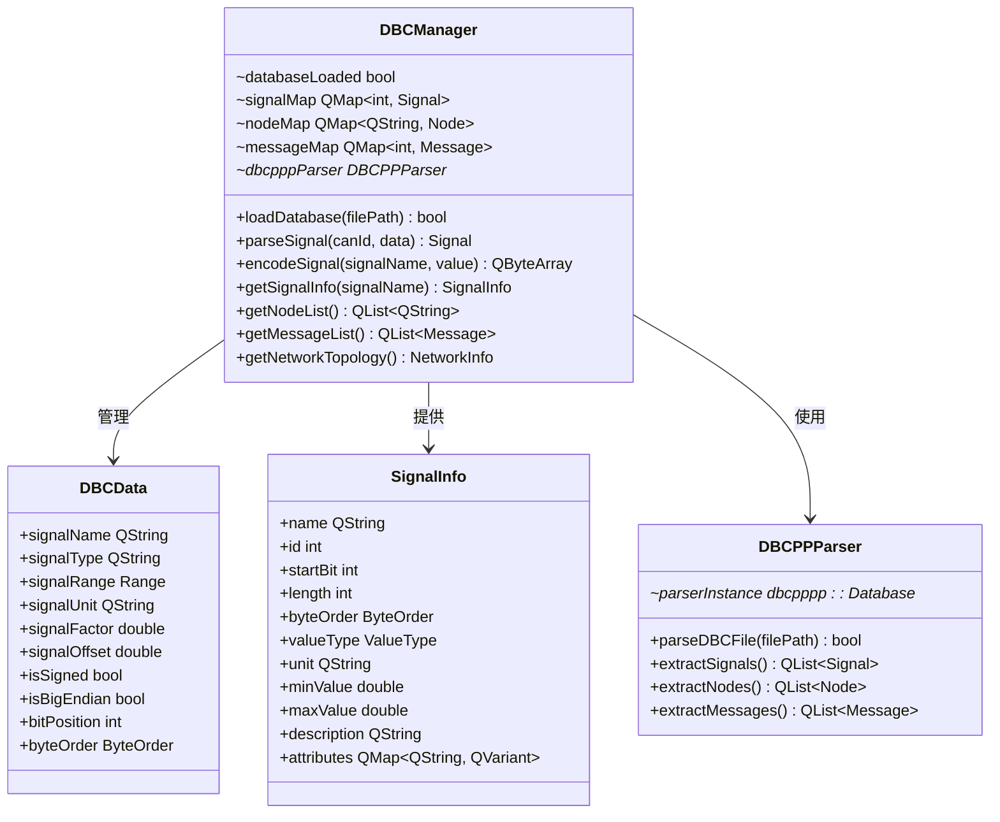
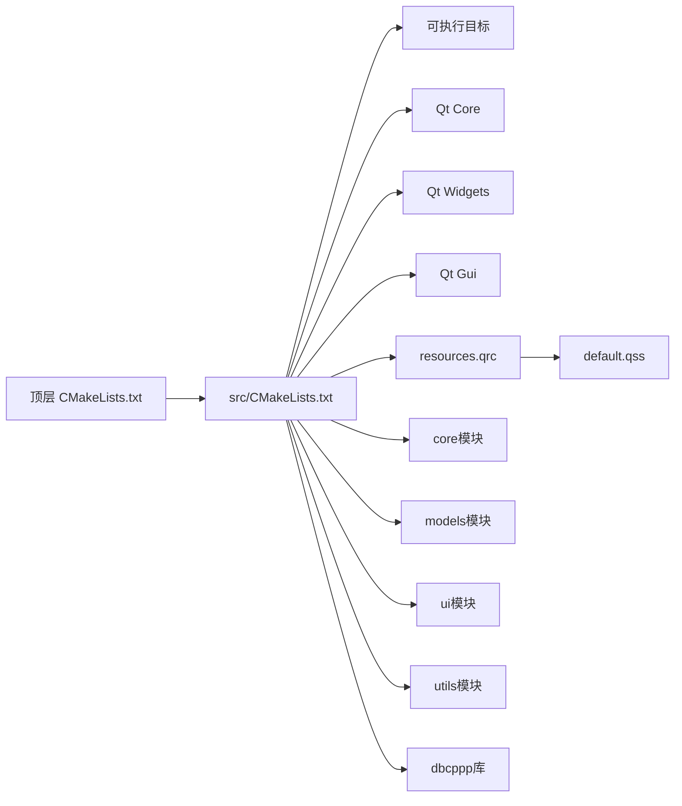
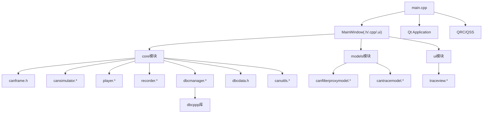

# 核心模块详解

<cite>
**本文档引用的文件**   
- [src/main.cpp](file://src/main.cpp)
- [src/core/canframe.h](file://src/core/canframe.h)
- [src/core/cansimulator.cpp](file://src/core/cansimulator.cpp)
- [src/core/cansimulator.h](file://src/core/cansimulator.h)
- [src/core/player.cpp](file://src/core/player.cpp)
- [src/core/player.h](file://src/core/player.h)
- [src/core/recorder.cpp](file://src/core/recorder.cpp)
- [src/core/recorder.h](file://src/core/recorder.h)
- [src/core/dbcmanager.cpp](file://src/core/dbcmanager.cpp)
- [src/core/dbcmanager.h](file://src/core/dbcmanager.h)
- [src/core/dbcdata.h](file://src/core/dbcdata.h)
- [src/models/canfilterproxymodel.cpp](file://src/models/canfilterproxymodel.cpp)
- [src/models/canfilterproxymodel.h](file://src/models/canfilterproxymodel.h)
- [src/models/cantracemodel.cpp](file://src/models/cantracemodel.cpp)
- [src/models/cantracemodel.h](file://src/models/cantracemodel.h)
- [src/ui/mainwindow.h](file://src/ui/mainwindow.h)
- [src/ui/mainwindow.cpp](file://src/ui/mainwindow.cpp)
- [src/ui/mainwindow.ui](file://src/ui/mainwindow.ui)
- [src/ui/traceview.cpp](file://src/ui/traceview.cpp)
- [src/ui/traceview.h](file://src/ui/traceview.h)
- [src/utils/canutils.cpp](file://src/utils/canutils.cpp)
- [src/utils/canutils.h](file://src/utils/canutils.h)
- [CMakeLists.txt](file://CMakeLists.txt)
- [src/CMakeLists.txt](file://src/CMakeLists.txt)
- [resources/resources.qrc](file://resources/resources.qrc)
- [README.en.md](file://README.en.md)
</cite>

## 更新摘要
**所做更改**   
- DBC解析功能已集成dbcppp库，对dbcmanager.cpp和dbcdata.h进行了重大重构
- 增强了DBC数据库管理系统的解析能力和数据处理效率
- 优化了CAN总线生态系统支持，提供更专业的DBC文件处理能力
- 更新了架构图以反映新的DBC解析架构和依赖关系

## 目录
1. [简介](#简介)
2. [项目结构](#项目结构)
3. [核心组件](#核心组件)
4. [架构总览](#架构总览)
5. [详细组件分析](#详细组件分析)
6. [依赖关系分析](#依赖关系分析)
7. [性能考虑](#性能考虑)
8. [故障排查指南](#故障排查指南)
9. [结论](#结论)
10. [附录](#附录)

## 简介
本技术文档围绕该 Qt 应用程序的核心模块进行系统化说明，重点覆盖：
- 应用程序入口点的实现细节、调用关系与使用模式
- CAN总线数据处理、模拟、播放和录制的完整功能集
- **深度集成的DBC数据库管理系统**，基于dbcppp库实现专业级的CAN数据库文件解析和管理
- UI 主窗口组件的职责边界、数据流与事件处理
- CMake 构建配置与资源集成方式
- 与其他组件的耦合关系与扩展点
- 常见问题定位与解决方案

目标读者包括初学者与有经验的开发者。文档在保持可读性的同时，提供足够的代码级细节与可视化图示，帮助快速理解并高效扩展。

## 项目结构
该项目采用典型的 Qt + CMake 工程组织方式，现已扩展为完整的CAN总线应用：
- src: 源代码目录，包含main.cpp、core核心模块、models数据模型、ui界面层、utils工具类
- resources: Qt 资源文件（样式表与资源清单）
- third_party: 第三方库，包含dbcppp库用于DBC解析
- CMakeLists.txt: 顶层构建脚本
- README.en.md: 英文说明文档

图表来源
- [CMakeLists.txt](file://CMakeLists.txt)
- [src/CMakeLists.txt](file://src/CMakeLists.txt)
- [src/main.cpp](file://src/main.cpp)
- [src/core/canframe.h](file://src/core/canframe.h)
- [src/core/cansimulator.h](file://src/core/cansimulator.h)
- [src/core/player.h](file://src/core/player.h)
- [src/core/recorder.h](file://src/core/recorder.h)
- [src/core/dbcmanager.h](file://src/core/dbcmanager.h)
- [src/core/dbcdata.h](file://src/core/dbcdata.h)
- [src/models/canfilterproxymodel.h](file://src/models/canfilterproxymodel.h)
- [src/models/cantracemodel.h](file://src/models/cantracemodel.h)
- [src/ui/mainwindow.h](file://src/ui/mainwindow.h)
- [src/ui/traceview.h](file://src/ui/traceview.h)
- [src/utils/canutils.h](file://src/utils/canutils.h)
- [resources/resources.qrc](file://resources/resources.qrc)

章节来源
- [CMakeLists.txt](file://CMakeLists.txt)
- [src/CMakeLists.txt](file://src/CMakeLists.txt)
- [README.en.md](file://README.en.md)

## 核心组件
- 应用程序入口（main.cpp）
  - 负责初始化 Qt 应用对象、加载全局样式、创建并显示主窗口、进入事件循环
  - 关键职责：应用生命周期管理、资源加载、UI 启动
- CAN帧处理核心（canframe.h）
  - 定义CAN帧数据结构和处理逻辑
  - 提供帧格式解析、验证和转换功能
- CAN模拟器（cansimulator.h/.cpp）
  - 模拟CAN总线通信场景
  - 支持预设消息序列和动态生成
- 播放器（player.h/.cpp）
  - 回放录制的CAN数据
  - 支持时间轴控制和速度调节
- 录制器（recorder.h/.cpp）
  - 实时捕获CAN总线数据
  - 支持文件格式化和存储优化
- **增强型DBC数据库管理系统（dbcmanager.h/.cpp, dbcdata.h）**
  - 基于dbcppp库实现专业的CAN数据库文件解析
  - 支持完整的DBC文件格式标准和高级特性
  - 提供高效的信号定义、节点信息和消息映射管理
- 数据模型层
  - canfilterproxymodel：CAN数据过滤代理模型
  - cantracemodel：CAN轨迹数据模型
- UI组件
  - mainwindow：主窗口容器
  - traceview：CAN轨迹视图组件
- 工具类（canutils.h/.cpp）
  - 提供CAN相关的通用工具和算法

章节来源
- [src/main.cpp](file://src/main.cpp)
- [src/core/canframe.h](file://src/core/canframe.h)
- [src/core/cansimulator.h](file://src/core/cansimulator.h)
- [src/core/player.h](file://src/core/player.h)
- [src/core/recorder.h](file://src/core/recorder.h)
- [src/core/dbcmanager.h](file://src/core/dbcmanager.h)
- [src/core/dbcdata.h](file://src/core/dbcdata.h)
- [src/models/canfilterproxymodel.h](file://src/models/canfilterproxymodel.h)
- [src/models/cantracemodel.h](file://src/models/cantracemodel.h)
- [src/ui/mainwindow.h](file://src/ui/mainwindow.h)
- [src/ui/traceview.h](file://src/ui/traceview.h)
- [src/utils/canutils.h](file://src/utils/canutils.h)

## 架构总览
下图展示了从应用启动到CAN数据处理、DBC文件管理和UI渲染的关键流程，以及各组件之间的依赖关系。

图表来源
- [src/main.cpp](file://src/main.cpp)
- [src/ui/mainwindow.h](file://src/ui/mainwindow.h)
- [src/core/cansimulator.h](file://src/core/cansimulator.h)
- [src/core/recorder.h](file://src/core/recorder.h)
- [src/core/player.h](file://src/core/player.h)
- [src/core/dbcmanager.h](file://src/core/dbcmanager.h)
- [src/models/cantracemodel.h](file://src/models/cantracemodel.h)
- [src/ui/traceview.h](file://src/ui/traceview.h)

## 详细组件分析

### 应用程序入口（main.cpp）
- 职责
  - 创建 QApplication 实例
  - 设置应用属性（如高 DPI、样式等）
  - 实例化并显示 MainWindow
  - 进入 QApplication::exec() 事件循环
- 关键参数与返回值
  - 命令行参数：通常用于调试开关或配置文件路径（由具体实现决定）
  - 返回码：程序退出时向操作系统返回的状态码
- 常见用法
  - 在启动前加载全局样式表
  - 在启动前设置平台相关选项（如 Windows 下的高 DPI）
- 错误处理
  - 若资源加载失败，应给出明确提示并优雅退出
  - 避免在构造阶段抛出未捕获异常

章节来源
- [src/main.cpp](file://src/main.cpp)

### CAN帧处理核心（canframe.h）
- 职责
  - 定义CAN帧的数据结构和基本操作
  - 提供帧ID、数据长度、数据内容的封装
  - 实现帧格式验证和转换功能
- 数据结构设计
  - CAN帧标识符（ID）：支持标准帧和扩展帧格式
  - 数据载荷：最大8字节数据内容
  - 时间戳：精确的时间标记
  - 方向标志：发送或接收状态
- 核心方法
  - 帧创建和解析
  - 数据验证和格式化
  - 序列化与反序列化

章节来源
- [src/core/canframe.h](file://src/core/canframe.h)

### CAN模拟器（cansimulator.h/.cpp）
- 职责
  - 模拟真实的CAN总线通信环境
  - 生成预设的消息序列和随机数据
  - 支持多种通信场景配置
- 功能特性
  - 周期性消息发送
  - 事件驱动消息生成
  - 负载模拟和错误注入
  - 多通道支持
- 配置选项
  - 消息频率和延迟
  - 数据模式和内容
  - 错误条件模拟

章节来源
- [src/core/cansimulator.h](file://src/core/cansimulator.h)
- [src/core/cansimulator.cpp](file://src/core/cansimulator.cpp)

### 播放器（player.h/.cpp）
- 职责
  - 回放已录制的CAN数据文件
  - 提供时间轴控制和播放速度调节
  - 支持多种数据格式
- 播放控制
  - 播放、暂停、停止
  - 进度跳转和时间搜索
  - 循环播放和单次播放
- 性能优化
  - 异步数据加载
  - 内存映射文件访问
  - 缓存机制

章节来源
- [src/core/player.h](file://src/core/player.h)
- [src/core/player.cpp](file://src/core/player.cpp)

### 录制器（recorder.h/.cpp）
- 职责
  - 实时捕获CAN总线上的数据帧
  - 将数据持久化到文件系统
  - 提供录制质量控制
- 录制特性
  - 实时数据捕获
  - 自动文件轮转
  - 压缩存储
  - 元数据记录
- 文件管理
  - 自动命名和版本控制
  - 文件大小限制
  - 备份和恢复

章节来源
- [src/core/recorder.h](file://src/core/recorder.h)
- [src/core/recorder.cpp](file://src/core/recorder.cpp)

### 增强型DBC数据库管理系统（dbcmanager.h/.cpp, dbcdata.h）
**重大更新** - DBC数据库管理系统已完全重构，集成了dbcppp库以实现专业的CAN数据库文件解析能力。

- 职责
  - 基于dbcppp库管理CAN数据库文件（.dbc格式）的专业级解析和处理
  - 提供完整的DBC文件结构和内容访问接口
  - 支持高级信号定义、节点信息、消息映射的管理和查询
- 核心功能
  - **dbcppp库集成**：利用成熟的dbcppp库实现标准的DBC文件解析
  - **高性能解析**：优化的DBC文件读取和内存管理策略
  - **完整数据模型**：支持DBC文件中所有元素类型的完整表示
  - **智能查询接口**：提供高效的信号、节点和消息查询功能
  - **双向数据转换**：在原始CAN数据和语义化信号之间进行可靠转换
- 数据结构设计
  - **增强的信号定义**：包含名称、类型、范围、单位、因子、偏移量等完整元数据
  - **节点信息管理**：描述网络中的ECU节点及其属性
  - **消息映射优化**：定义CAN ID与信号的组合关系和时序信息
  - **版本兼容性**：支持不同版本的DBC文件格式和扩展特性
- 使用模式
  - **文件加载**：通过文件路径加载DBC数据库，支持错误处理和进度反馈
  - **信号解析**：根据CAN ID和数据内容解析具体信号值，支持复杂信号组合
  - **数据编码**：将信号值编码为原始CAN帧数据，保证数据完整性
  - **信息查询**：获取网络拓扑和信号定义信息，支持批量查询操作

图表来源
- [src/core/dbcmanager.h](file://src/core/dbcmanager.h)
- [src/core/dbcdata.h](file://src/core/dbcdata.h)

**Section sources**
- [src/core/dbcmanager.h](file://src/core/dbcmanager.h)
- [src/core/dbcmanager.cpp](file://src/core/dbcmanager.cpp)
- [src/core/dbcdata.h](file://src/core/dbcdata.h)

### 数据模型层
#### CAN过滤代理模型（canfilterproxymodel.h/.cpp）
- 职责
  - 对原始CAN数据进行过滤和筛选
  - 支持多种过滤条件组合
  - 提供高效的查询接口
- 过滤功能
  - ID范围过滤
  - 数据内容匹配
  - 时间范围筛选
  - 自定义过滤器

章节来源
- [src/models/canfilterproxymodel.h](file://src/models/canfilterproxymodel.h)
- [src/models/canfilterproxymodel.cpp](file://src/models/canfilterproxymodel.cpp)

#### CAN轨迹模型（cantracemodel.h/.cpp）
- 职责
  - 管理CAN数据的时序轨迹
  - 提供数据可视化的基础
  - 支持大数据集的高效访问
- 数据管理
  - 时间序列索引
  - 增量更新机制
  - 内存优化存储

章节来源
- [src/models/cantracemodel.h](file://src/models/cantracemodel.h)
- [src/models/cantracemodel.cpp](file://src/models/cantracemodel.cpp)

### UI组件
#### 主窗口（mainwindow.h/.cpp）
- 职责
  - 承载整个应用的UI布局
  - 协调各个核心模块的交互
  - 管理用户操作流程
- 界面布局
  - 菜单栏和工具栏
  - 控制面板区域
  - 数据显示区域
  - 状态栏信息

章节来源
- [src/ui/mainwindow.h](file://src/ui/mainwindow.h)
- [src/ui/mainwindow.cpp](file://src/ui/mainwindow.cpp)
- [src/ui/mainwindow.ui](file://src/ui/mainwindow.ui)

#### 轨迹视图（traceview.h/.cpp）
- 职责
  - 可视化显示CAN数据轨迹
  - 提供交互式数据探索
  - 支持缩放和平移操作
- 可视化功能
  - 波形显示
  - 数据标注
  - 多轨道对比
  - 实时刷新

章节来源
- [src/ui/traceview.h](file://src/ui/traceview.h)
- [src/ui/traceview.cpp](file://src/ui/traceview.cpp)

### 工具类（canutils.h/.cpp）
- 职责
  - 提供CAN相关的通用工具函数
  - 实现数据格式转换和验证
  - 封装常用的算法和计算
- 工具功能
  - 十六进制转换
  - CRC校验计算
  - 时间戳处理
  - 字符串格式化

章节来源
- [src/utils/canutils.h](file://src/utils/canutils.h)
- [src/utils/canutils.cpp](file://src/utils/canutils.cpp)

### 构建系统（CMake）
- 顶层 CMakeLists.txt
  - 指定 CMake 版本、项目名称、Qt 查找与启用
  - 递归包含子目录构建脚本
- src/CMakeLists.txt
  - 定义可执行目标（target）
  - 添加源文件、头文件、UI 文件
  - 链接 Qt 模块（Core、Widgets、Gui 等）
  - 启用自动 MOC/UIC/RCC
  - **集成dbcppp库依赖**
- 资源与样式
  - 通过 QRC 将样式表等资源打包
  - 运行时通过资源路径访问样式

图表来源
- [CMakeLists.txt](file://CMakeLists.txt)
- [src/CMakeLists.txt](file://src/CMakeLists.txt)
- [resources/resources.qrc](file://resources/resources.qrc)

章节来源
- [CMakeLists.txt](file://CMakeLists.txt)
- [src/CMakeLists.txt](file://src/CMakeLists.txt)
- [resources/resources.qrc](file://resources/resources.qrc)

### 资源系统（QRC/QSS）
- 作用
  - 将样式表、图标等静态资源编译进二进制
  - 运行时通过统一路径访问，避免相对路径问题
- 使用模式
  - 在 QRC 中声明资源条目
  - 在代码中以 ":/styles/default.qss" 形式加载
- 注意事项
  - 确保资源路径一致
  - 大资源建议按需加载

章节来源
- [resources/resources.qrc](file://resources/resources.qrc)
- [resources/styles/default.qss](file://resources/styles/default.qss)

## 依赖关系分析
- 组件内聚与耦合
  - main.cpp 仅负责启动与展示，低耦合
  - 核心模块（core）高度内聚，通过清晰接口交互
  - **增强型DBC管理器独立于其他核心模块，基于dbcppp库提供专业数据库管理能力**
  - 数据模型层独立于UI，便于测试和复用
  - CMake 作为构建期依赖，不侵入运行时代码
- 外部依赖
  - Qt 框架（Core/Widgets/Gui）
  - **dbcppp库（用于DBC文件解析）**
  - 资源系统（QRC）
- 潜在循环依赖
  - 当前结构未见明显循环；建议在新增模块时保持单向依赖

图表来源
- [src/main.cpp](file://src/main.cpp)
- [src/ui/mainwindow.h](file://src/ui/mainwindow.h)
- [src/core/canframe.h](file://src/core/canframe.h)
- [src/core/cansimulator.h](file://src/core/cansimulator.h)
- [src/core/player.h](file://src/core/player.h)
- [src/core/recorder.h](file://src/core/recorder.h)
- [src/core/dbcmanager.h](file://src/core/dbcmanager.h)
- [src/core/dbcdata.h](file://src/core/dbcdata.h)
- [src/models/canfilterproxymodel.h](file://src/models/canfilterproxymodel.h)
- [src/models/cantracemodel.h](file://src/models/cantracemodel.h)
- [src/ui/traceview.h](file://src/ui/traceview.h)
- [src/utils/canutils.h](file://src/utils/canutils.h)
- [resources/resources.qrc](file://resources/resources.qrc)

章节来源
- [src/main.cpp](file://src/main.cpp)
- [src/ui/mainwindow.h](file://src/ui/mainwindow.h)
- [src/core/canframe.h](file://src/core/canframe.h)
- [src/core/cansimulator.h](file://src/core/cansimulator.h)
- [src/core/player.h](file://src/core/player.h)
- [src/core/recorder.h](file://src/core/recorder.h)
- [src/core/dbcmanager.h](file://src/core/dbcmanager.h)
- [src/core/dbcdata.h](file://src/core/dbcdata.h)
- [src/models/canfilterproxymodel.h](file://src/models/canfilterproxymodel.h)
- [src/models/cantracemodel.h](file://src/models/cantracemodel.h)
- [src/ui/traceview.h](file://src/ui/traceview.h)
- [src/utils/canutils.h](file://src/utils/canutils.h)
- [resources/resources.qrc](file://resources/resources.qrc)

## 性能考虑
- 启动优化
  - 延迟加载非关键资源（如图标、大型样式）
  - 减少构造阶段的复杂计算
- CAN数据处理
  - 使用异步I/O避免阻塞UI线程
  - 实现数据缓冲和批处理
  - 优化内存分配和释放策略
- **增强型DBC文件处理优化**
  - **dbcppp库优化**：利用dbcppp库的高效解析算法和内存管理
  - **懒加载策略**：按需加载DBC文件内容，避免一次性加载大文件
  - **哈希映射优化**：建立信号ID到定义的哈希映射，提高查询效率
  - **结果缓存**：缓存常用查询结果，减少重复解析开销
  - **分块加载**：支持大文件的分块加载和流式处理
  - **内存池管理**：重用DBC解析过程中的临时对象
- UI渲染
  - 避免在主线程执行耗时任务
  - 合理使用样式表，避免过度重绘
  - 使用虚拟化技术处理大量数据
- 内存管理
  - 及时释放不再使用的对象
  - 避免深层嵌套的信号槽导致隐式拷贝
  - 实现智能指针和RAII模式

## 故障排查指南
- 无法找到样式表
  - 检查 QRC 中资源路径是否正确
  - 确认运行时资源加载路径前缀
- 窗口未显示或崩溃
  - 检查 MainWindow 构造是否抛出异常
  - 验证 .ui 文件生成的类名与方法签名
- 构建失败
  - 确认 Qt 环境已正确配置
  - 检查 CMake 变量与模块链接顺序
  - **验证dbcppp库依赖是否正确配置**
- 高 DPI 显示异常
  - 启用 Qt 高 DPI 支持并在必要时缩放 UI
- CAN数据处理问题
  - 验证CAN帧格式和数据完整性
  - 检查模拟器和录制器的配置参数
  - 监控内存使用和CPU占用率
- **增强型DBC文件相关问题**
  - **dbcppp库初始化失败**：检查库文件路径和版本兼容性
  - **DBC文件解析错误**：验证文件格式是否符合标准规范
  - **内存不足**：监控DBC文件加载时间和内存占用
  - **信号解析异常**：检查文件编码和字符集兼容性
  - **查询性能问题**：优化数据库索引和缓存策略
  - **节点信息缺失**：确认信号定义和节点信息的完整性
- 性能问题
  - 使用性能分析工具定位瓶颈
  - 检查数据模型的查询效率
  - 优化UI更新频率和渲染性能

章节来源
- [src/main.cpp](file://src/main.cpp)
- [src/ui/mainwindow.h](file://src/ui/mainwindow.h)
- [src/core/canframe.h](file://src/core/canframe.h)
- [src/core/cansimulator.h](file://src/core/cansimulator.h)
- [src/core/player.h](file://src/core/player.h)
- [src/core/recorder.h](file://src/core/recorder.h)
- [src/core/dbcmanager.h](file://src/core/dbcmanager.h)
- [src/core/dbcdata.h](file://src/core/dbcdata.h)
- [src/models/canfilterproxymodel.h](file://src/models/canfilterproxymodel.h)
- [src/models/cantracemodel.h](file://src/models/cantracemodel.h)
- [src/ui/traceview.h](file://src/ui/traceview.h)
- [src/utils/canutils.h](file://src/utils/canutils.h)
- [resources/resources.qrc](file://resources/resources.qrc)

## 结论
本项目以清晰的层次划分与标准的 Qt+CMake 实践为基础，现已发展为功能完整的CAN总线应用系统。通过合理拆分入口、核心模块、数据模型、UI界面和工具类，结合资源系统统一管理样式与静态资源，能够在保证用户体验的同时提升开发效率。**经过重大重构的增强型DBC数据库管理系统进一步提升了项目的专业性，基于dbcppp库提供了完整的CAN总线生态系统支持**。

新增的CAN帧处理、模拟器、播放器、录制器等完整功能集，以及最新的基于dbcppp库的DBC数据库管理能力，为CAN总线开发和调试提供了强大的工具支持。增强型DBC管理系统的引入使得应用能够处理复杂的CAN网络定义，支持信号级别的分析和转换，大大提升了工具的实用性和专业性。dbcppp库的集成确保了DBC文件解析的准确性和性能，为后续的功能扩展奠定了坚实基础。建议在后续迭代中持续遵循低耦合、高内聚原则，逐步引入模块化与单元测试以提升质量。

## 附录
- 术语
  - QRC：Qt 资源编译系统
  - QSS：Qt 样式表
  - MOC/UIC/RCC：Qt 元对象编译器、界面编译器、资源编译器
  - CAN：控制器局域网（Controller Area Network）
  - DBC：CAN数据库文件格式（Vector CAN Database）
  - dbcppp：专业的CAN数据库解析库
  - 帧：CAN总线上的数据传输单元
  - 信号：DBC文件中定义的可寻址数据单元
  - 节点：CAN网络中的ECU设备
  - 网络拓扑：CAN网络的物理和逻辑结构
- 参考
  - 项目英文说明文档可用于了解背景与总体目标

章节来源
- [README.en.md](file://README.en.md)