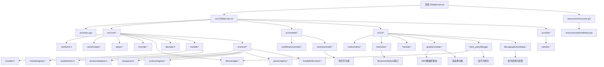
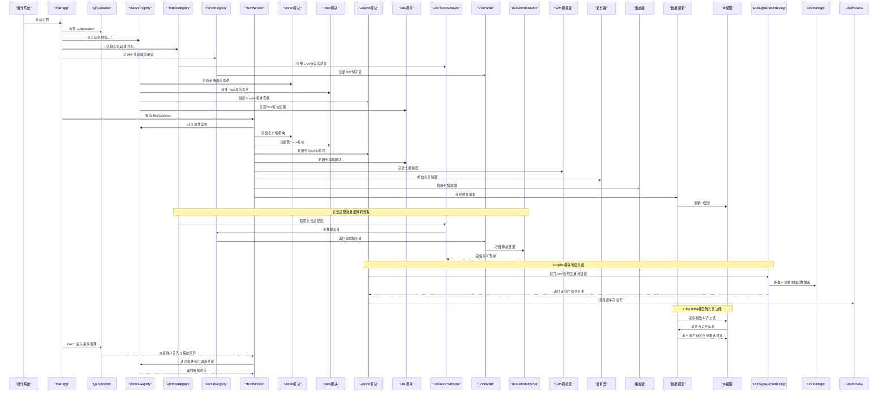
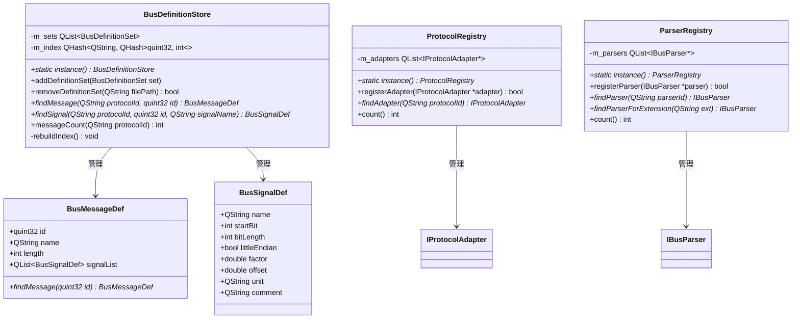
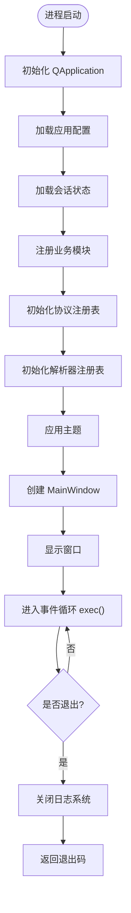
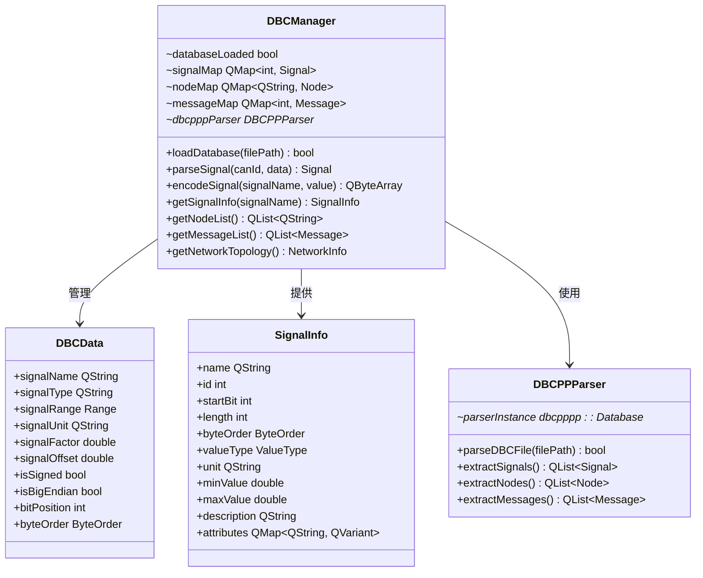
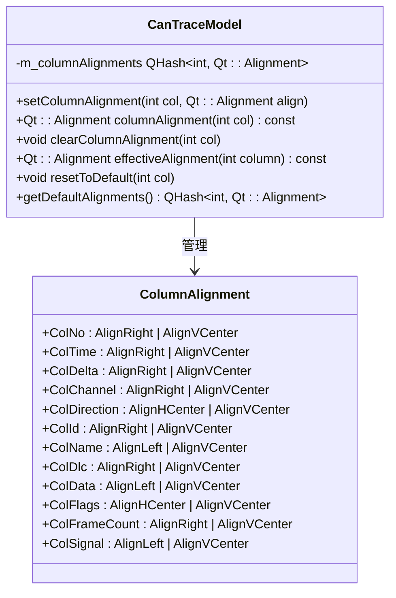
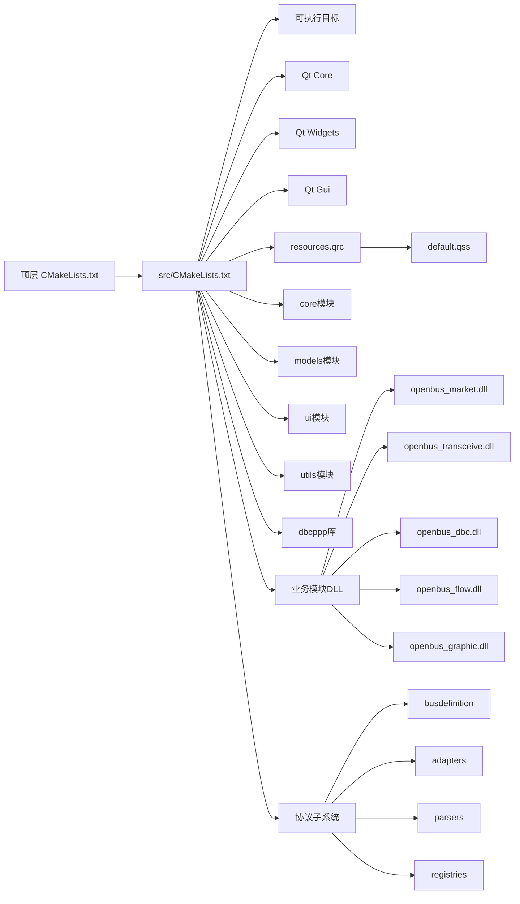
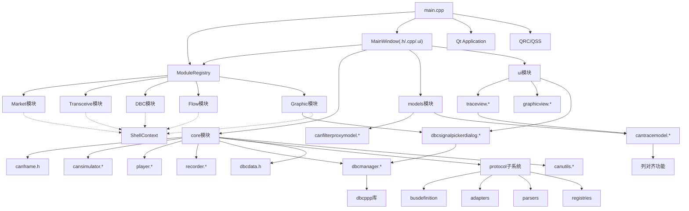

# 核心模块详解

<cite>
**本文档引用的文件**   
- [src/main.cpp](file://src/main.cpp)
- [src/core/module/imodule.h](file://src/core/module/imodule.h)
- [src/core/module/moduleregistry.h](file://src/core/module/moduleregistry.h)
- [src/core/module/moduleregistry.cpp](file://src/core/module/moduleregistry.cpp)
- [src/ui/dbcmodule.h](file://src/ui/dbcmodule.h)
- [src/ui/tracemodule.h](file://src/ui/tracemodule.h)
- [src/ui/graphicmodule.h](file://src/ui/graphicmodule.h)
- [src/ui/graphicmodule.cpp](file://src/ui/graphicmodule.cpp)
- [src/ui/graphicview.h](file://src/ui/graphicview.h)
- [src/ui/graphicview.cpp](file://src/ui/graphicview.cpp)
- [src/ui/dbcsignalpickerdialog.h](file://src/ui/dbcsignalpickerdialog.h)
- [src/ui/dbcsignalpickerdialog.cpp](file://src/ui/dbcsignalpickerdialog.cpp)
- [src/ui/mainwindow.h](file://src/ui/mainwindow.h)
- [src/core/canframe.h](file://src/core/canframe.h)
- [src/core/cansimulator.cpp](file://src/core/cansimulator.cpp)
- [src/core/cansimulator.h](file://src/core/cansimulator.h)
- [src/core/player.cpp](file://src/core/player.cpp)
- [src/core/player.h](file://src/core/player.h)
- [src/core/recorder.cpp](file://src/core/recorder.cpp)
- [src/core/recorder.h](file://src/core/recorder.h)
- [src/core/dbcmanager.cpp](file://src/core/dbcmanager.cpp)
- [src/core/dbcmanager.h](file://src/core/dbcmanager.h)
- [src/core/dbcdata.h](file://src/core/dbcdata.h)
- [src/models/canfilterproxymodel.cpp](file://src/models/canfilterproxymodel.cpp)
- [src/models/canfilterproxymodel.h](file://src/models/canfilterproxymodel.h)
- [src/models/cantracemodel.cpp](file://src/models/cantracemodel.cpp)
- [src/models/cantracemodel.h](file://src/models/cantracemodel.h)
- [src/ui/mainwindow.cpp](file://src/ui/mainwindow.cpp)
- [src/ui/mainwindow.ui](file://src/ui/mainwindow.ui)
- [src/ui/traceview.cpp](file://src/ui/traceview.cpp)
- [src/ui/traceview.h](file://src/ui/traceview.h)
- [src/utils/canutils.cpp](file://src/utils/canutils.cpp)
- [src/utils/canutils.h](file://src/utils/canutils.h)
- [CMakeLists.txt](file://CMakeLists.txt)
- [src/CMakeLists.txt](file://src/CMakeLists.txt)
- [resources/resources.qrc](file://resources/resources.qrc)
- [README.en.md](file://README.en.md)
- [src/core/protocol/busdefinition.h](file://src/core/protocol/busdefinition.h)
- [src/core/protocol/iprotocoladapter.h](file://src/core/protocol/iprotocoladapter.h)
- [src/core/protocol/canprotocoladapter.cpp](file://src/core/protocol/canprotocoladapter.cpp)
- [src/core/protocol/canprotocoladapter.h](file://src/core/protocol/canprotocoladapter.h)
- [src/core/protocol/ibusparser.h](file://src/core/protocol/ibusparser.h)
- [src/core/protocol/dbcparser.cpp](file://src/core/protocol/dbcparser.cpp)
- [src/core/protocol/dbcparser.h](file://src/core/protocol/dbcparser.h)
- [src/core/protocol/busdefinitionstore.cpp](file://src/core/protocol/busdefinitionstore.cpp)
- [src/core/protocol/busdefinitionstore.h](file://src/core/protocol/busdefinitionstore.h)
- [src/core/protocol/parserregistry.cpp](file://src/core/protocol/parserregistry.cpp)
- [src/core/protocol/parserregistry.h](file://src/core/protocol/parserregistry.h)
- [src/core/protocol/protocolregistry.cpp](file://src/core/protocol/protocolregistry.cpp)
- [src/core/protocol/protocolregistry.h](file://src/core/protocol/protocolregistry.h)
- [doc/G17-Trace 列对齐方案.md](file://doc/G17-Trace 列对齐方案.md)
</cite>

## 更新摘要
**所做更改**   
- 增强了CAN Trace模型的列对齐功能：新增了`clearColumnAlignment(int col)`和`effectiveAlignment(int column)`公共方法
- 实现了完整的列对齐系统：支持用户自定义对齐方式、默认对齐策略和持久化存储
- 改进了CAN跟踪模型的UI自定义能力：通过TraceView集成列对齐配置保存和恢复功能
- 更新了G17列对齐方案的完整实现：包含默认对齐表、UI交互设计和持久化方案

## 目录
1. [简介](#简介)
2. [项目结构](#项目结构)
3. [核心组件](#核心组件)
4. [架构总览](#架构总览)
5. [详细组件分析](#详细组件分析)
6. [依赖关系分析](#依赖关系分析)
7. [性能考虑](#性能考虑)
8. [故障排查指南](#故障排查指南)
9. [结论](#结论)
10. [附录](#附录)

## 简介
本技术文档围绕该 Qt 应用程序的核心模块进行系统化说明，重点覆盖：
- **全新的模块化架构**：基于IBusinessModule接口的插件化设计，支持动态加载和管理业务模块
- **新增的协议子系统**：统一的协议适配层、解析器框架和总线定义模型
- 应用程序入口点的实现细节、调用关系与使用模式
- CAN总线数据处理、模拟、播放和录制的完整功能集
- **深度集成的DBC数据库管理系统**，基于dbcppp库实现专业级的CAN数据库文件解析和管理
- **增强的Graphic模块**：集成了DBC数据库选择和高级多选择功能，提供卓越的用户交互体验
- **增强的CAN Trace模型**：实现了完整的列对齐功能，支持用户自定义列显示格式
- UI 主窗口组件的职责边界、数据流与事件处理
- CMake 构建配置与资源集成方式
- 与其他组件的耦合关系与扩展点
- 常见问题定位与解决方案

目标读者包括初学者与有经验的开发者。文档在保持可读性的同时，提供足够的代码级细节与可视化图示，帮助快速理解并高效扩展。

## 项目结构
该项目采用典型的 Qt + CMake 工程组织方式，现已扩展为完整的CAN总线应用，并引入了全新的模块化架构和协议子系统：
- src: 源代码目录，包含main.cpp、core核心模块、models数据模型、ui界面层、utils工具类
- resources: Qt 资源文件（样式表与资源清单）
- third_party: 第三方库，包含dbcppp库用于DBC解析
- CMakeLists.txt: 顶层构建脚本
- README.en.md: 英文说明文档



图表来源
- [CMakeLists.txt](file://CMakeLists.txt)
- [src/CMakeLists.txt](file://src/CMakeLists.txt)
- [src/main.cpp](file://src/main.cpp)
- [src/core/canframe.h](file://src/core/canframe.h)
- [src/core/cansimulator.h](file://src/core/cansimulator.h)
- [src/core/player.h](file://src/core/player.h)
- [src/core/recorder.h](file://src/core/recorder.h)
- [src/core/dbcmanager.h](file://src/core/dbcmanager.h)
- [src/core/dbcdata.h](file://src/core/dbcdata.h)
- [src/core/module/imodule.h](file://src/core/module/imodule.h)
- [src/core/module/moduleregistry.h](file://src/core/module/moduleregistry.h)
- [src/models/canfilterproxymodel.h](file://src/models/canfilterproxymodel.h)
- [src/models/cantracemodel.h](file://src/models/cantracemodel.h)
- [src/ui/mainwindow.h](file://src/ui/mainwindow.h)
- [src/ui/traceview.h](file://src/ui/traceview.h)
- [src/ui/graphicmodule.h](file://src/ui/graphicmodule.h)
- [src/ui/graphicview.h](file://src/ui/graphicview.h)
- [src/ui/dbcsignalpickerdialog.h](file://src/ui/dbcsignalpickerdialog.h)
- [src/utils/canutils.h](file://src/utils/canutils.h)
- [resources/resources.qrc](file://resources/resources.qrc)
- [src/core/protocol/busdefinition.h](file://src/core/protocol/busdefinition.h)
- [src/core/protocol/iprotocoladapter.h](file://src/core/protocol/iprotocoladapter.h)
- [src/core/protocol/ibusparser.h](file://src/core/protocol/ibusparser.h)

章节来源
- [CMakeLists.txt](file://CMakeLists.txt)
- [src/CMakeLists.txt](file://src/CMakeLists.txt)
- [README.en.md](file://README.en.md)

## 核心组件
- **模块化架构核心**
  - IBusinessModule接口：定义业务模块的统一契约，支持插件化扩展
  - ShellContext结构：壳程序提供给业务模块的服务上下文
  - ModuleRegistry：模块注册表，集中管理所有业务模块的实例化
- **协议子系统核心**
  - BusDefinition模型：统一的报文/信号定义数据结构
  - IProtocolAdapter接口：协议适配层标准接口
  - IBusParser接口：解析器角色接口
  - ProtocolRegistry：协议适配器注册表
  - ParserRegistry：解析器注册表
  - BusDefinitionStore：统一定义存储管理
- 应用程序入口（main.cpp）
  - 负责初始化 Qt 应用对象、加载全局样式、创建并显示主窗口、进入事件循环
  - 关键职责：应用生命周期管理、资源加载、UI 启动、模块注册
- CAN帧处理核心（canframe.h）
  - 定义CAN帧数据结构和处理逻辑
  - 提供帧格式解析、验证和转换功能
- CAN模拟器（cansimulator.h/.cpp）
  - 模拟CAN总线通信场景
  - 支持预设消息序列和动态生成
- 播放器（player.h/.cpp）
  - 回放录制的CAN数据
  - 支持时间轴控制和速度调节
- 录制器（recorder.h/.cpp）
  - 实时捕获CAN总线数据
  - 支持文件格式化和存储优化
- **增强型DBC数据库管理系统（dbcmanager.h/.cpp, dbcdata.h）**
  - 基于dbcppp库实现专业的CAN数据库文件解析
  - 支持完整的DBC文件格式标准和高级特性
  - 提供高效的信号定义、节点信息和消息映射管理
- **增强的Graphic模块**
  - 集成DbcSignalPickerDialog实现DBC数据库信号选择
  - 支持Ctrl/Shift多选、反选、批量删除等高级操作
  - 提供搜索过滤、实时计数、双击确认等便捷交互
  - 实现信号配置的加载、保存和序列化
- **增强的CAN Trace模型**
  - 实现了完整的列对齐功能，支持用户自定义列显示格式
  - 提供默认对齐策略和用户自定义对齐的优先级管理
  - 支持列对齐配置的持久化存储和恢复
- 数据模型层
  - canfilterproxymodel：CAN数据过滤代理模型
  - cantracemodel：CAN轨迹数据模型
- UI组件
  - mainwindow：主窗口容器，协调各模块交互
  - traceview：CAN轨迹视图组件，集成列对齐功能
- 工具类（canutils.h/.cpp）
  - 提供CAN相关的通用工具和算法

章节来源
- [src/main.cpp](file://src/main.cpp)
- [src/core/module/imodule.h](file://src/core/module/imodule.h)
- [src/core/module/moduleregistry.h](file://src/core/module/moduleregistry.h)
- [src/core/protocol/busdefinition.h](file://src/core/protocol/busdefinition.h)
- [src/core/protocol/iprotocoladapter.h](file://src/core/protocol/iprotocoladapter.h)
- [src/core/protocol/ibusparser.h](file://src/core/protocol/ibusparser.h)
- [src/core/canframe.h](file://src/core/canframe.h)
- [src/core/cansimulator.h](file://src/core/cansimulator.h)
- [src/core/player.h](file://src/core/player.h)
- [src/core/recorder.h](file://src/core/recorder.h)
- [src/core/dbcmanager.h](file://src/core/dbcmanager.h)
- [src/core/dbcdata.h](file://src/core/dbcdata.h)
- [src/ui/graphicmodule.h](file://src/ui/graphicmodule.h)
- [src/ui/graphicview.h](file://src/ui/graphicview.h)
- [src/ui/dbcsignalpickerdialog.h](file://src/ui/dbcsignalpickerdialog.h)
- [src/models/canfilterproxymodel.h](file://src/models/canfilterproxymodel.h)
- [src/models/cantracemodel.h](file://src/models/cantracemodel.h)
- [src/ui/mainwindow.h](file://src/ui/mainwindow.h)
- [src/ui/traceview.h](file://src/ui/traceview.h)
- [src/utils/canutils.h](file://src/utils/canutils.h)

## 架构总览
下图展示了从应用启动到模块加载、协议适配、CAN数据处理、DBC文件管理和UI渲染的关键流程，以及各组件之间的依赖关系。



图表来源
- [src/main.cpp](file://src/main.cpp)
- [src/core/module/moduleregistry.h](file://src/core/module/moduleregistry.h)
- [src/core/module/imodule.h](file://src/core/module/imodule.h)
- [src/core/protocol/protocolregistry.h](file://src/core/protocol/protocolregistry.h)
- [src/core/protocol/parserregistry.h](file://src/core/protocol/parserregistry.h)
- [src/core/protocol/busdefinitionstore.h](file://src/core/protocol/busdefinitionstore.h)
- [src/ui/mainwindow.h](file://src/ui/mainwindow.h)
- [src/ui/dbcmodule.h](file://src/ui/dbcmodule.h)
- [src/ui/tracemodule.h](file://src/ui/tracemodule.h)
- [src/ui/graphicmodule.h](file://src/ui/graphicmodule.h)
- [src/ui/dbcsignalpickerdialog.h](file://src/ui/dbcsignalpickerdialog.h)

## 详细组件分析

### 模块化架构核心

#### IBusinessModule接口
**新增** - 业务模块的统一接口定义，实现了插件化架构的核心契约。

- 职责
  - 定义业务模块的标准接口，确保不同模块间的兼容性
  - 支持模块的基本信息获取（ID、标题、图标）
  - 提供模块UI创建和多页面支持
  - 支持模块间动作调用和状态查询
- 核心方法
  - `id()`：返回模块唯一标识符
  - `title()`：返回模块默认标题
  - `icon()`：返回模块图标
  - `createWidget()`：创建模块主界面widget
  - `createPage()`：创建指定页面（支持多页面模块）
  - `invoke()`：执行模块动作
  - `query()`：查询模块状态
- 设计原则
  - 只增不改：新增能力通过新虚函数或ShellContext新字段实现
  - 低耦合：接口仅依赖Qt基础类型和数据层类型
  - 向后兼容：默认实现保证旧模块不受影响

#### ShellContext结构
**新增** - 壳程序提供给业务模块的服务上下文。

- 职责
  - 提供业务模块访问壳程序服务的统一接口
  - 封装数据层服务指针（Player、Recorder、DeviceManager等）
  - 提供壳服务回调（输出追加、问题添加等）
  - 支持模块到壳的反向调用
- 服务组件
  - 主窗口指针：用于对话框父窗口和定位
  - 数据层服务：播放器、录制器、设备管理器、模拟器、DBC管理器
  - 回调函数：输出追加、问题添加、壳程序动作调用
- 反向调用机制
  - 支持模块触发壳程序的各种操作
  - 统一的action参数传递机制
  - 支持复杂参数的 QVariant 类型

#### ModuleRegistry类
**新增** - 模块注册表，实现中心化的模块管理。

- 职责
  - 集中管理所有业务模块的注册和实例化
  - 提供模块实例的惰性创建和缓存
  - 维护模块工厂函数的映射关系
- 核心功能
  - `registerModule()`：注册模块工厂函数
  - `module()`：获取模块实例（首次访问时惰性创建）
  - `ids()`：枚举已注册的模块ID
  - `instance()`：单例模式获取注册表实例
- 设计特点
  - 线程安全：仅主线程使用，避免锁开销
  - 懒加载：模块实例按需创建，减少启动时间
  - 可替换性：重复注册时后者覆盖前者

```mermaid
classDiagram
class IBusinessModule {
+QString id() const
+QString title() const
+QIcon icon() const
+QWidget *createWidget(ShellContext &ctx)
+QWidget *createPage(QString pageId, ShellContext &ctx)
+void invoke(QString action, QVariant arg = {})
+QVariant query(QString what, QVariant arg = {})
}
class ShellContext {
+QWidget *mainWindow
+Player *player
+Recorder *recorder
+CanDeviceManager *deviceManager
+CanSimulator *simulator
+DbcManager *dbcManager
+function appendOutput
+function addProblem
+function shellInvoke
}
class ModuleRegistry {
+static instance() ModuleRegistry*
+registerModule(QString id, ModuleFactory factory)
+module(QString id) IBusinessModule*
+ids() QStringList
-m_entries QHash~QString, Entry~
}
class Entry {
+ModuleFactory factory
+IBusinessModule *instance
}
IBusinessModule <|-- DbcModule
IBusinessModule <|-- TraceModule
IBusinessModule <|-- GraphicModule
ModuleRegistry --> IBusinessModule : 管理
ShellContext --> Player : 使用
ShellContext --> Recorder : 使用
ShellContext --> CanDeviceManager : 使用
```

图表来源
- [src/core/module/imodule.h](file://src/core/module/imodule.h)
- [src/core/module/moduleregistry.h](file://src/core/module/moduleregistry.h)
- [src/core/module/moduleregistry.cpp](file://src/core/module/moduleregistry.cpp)

**Section sources**
- [src/core/module/imodule.h:31-80](file://src/core/module/imodule.h#L31-L80)
- [src/core/module/imodule.h:82-171](file://src/core/module/imodule.h#L82-L171)
- [src/core/module/moduleregistry.h:27-50](file://src/core/module/moduleregistry.h#L27-L50)
- [src/core/module/moduleregistry.cpp:3-31](file://src/core/module/moduleregistry.cpp#L3-L31)

### 协议子系统核心

#### BusDefinition模型
**新增** - 统一的报文/信号定义模型，抽象了不同协议的语义差异。

- 职责
  - 提供统一的报文和信号定义数据结构
  - 支持多种协议格式（DBC、ARXML、J1939、ENI、ESI、布局JSON）的映射
  - 实现协议无关的数据表示和查询接口
- 核心数据结构
  - **BusSignalDef**：统一信号定义，包含名称、位位置、长度、字节序、缩放因子、偏移量、单位、注释等
  - **BusMessageDef**：统一报文定义，包含ID、名称、长度和信号列表
  - **BusDefinitionSet**：解析结果集合，包含解析器ID、文件路径、协议提示和消息列表
- 设计原则
  - 只增不改：公共字段只增不改，确保向后兼容性
  - 协议隔离：无法映射的协议特定语义保留在解析器内部
  - 高效查询：提供按ID查找报文定义的优化接口

#### IProtocolAdapter接口
**新增** - 协议适配层标准接口，定义了协议特定的行为和配置。

- 职责
  - 定义协议适配器的统一接口规范
  - 声明协议身份、源能力和通道配置
  - 提供解码、Trace列定义和文件IO功能
- 核心功能
  - **身份声明**：协议ID、显示名称、图标路径
  - **源能力**：支持的源类型（硬件、文件、仿真）
  - **通道配置**：最大通道数限制
  - **解析器支持**：接受的解析器类型列表
  - **信号解码**：将原始消息解码为语义化信号
  - **Trace展示**：协议专属列定义和字段格式化
  - **文件IO**：支持的文件过滤器
- ABI契约
  - 复用驱动插件模式，跨边界仅使用Qt值类型/POD
  - 接口只增不改，新增虚函数追加末尾并带默认实现

#### IBusParser接口
**新增** - 解析器角色接口，定义了协议描述文件的解析规范。

- 职责
  - 定义解析器的统一接口规范
  - 将协议描述文件转换为统一定义（BusDefinitionSet）
  - 不关心数据来源，专注于解析逻辑
- 核心功能
  - **解析器标识**：解析器ID、显示名称、图标路径
  - **文件支持**：支持的文件扩展名列表
  - **解析执行**：将文件路径解析为统一定义集
- 设计原则
  - 解析器只负责解析，不关心数据流向
  - 流类型（适配器）通过acceptedParsers()声明接受哪些解析器

#### ProtocolRegistry和ParserRegistry
**新增** - 协议适配器和解析器的注册管理机制。

- **ProtocolRegistry**：协议适配器注册表
  - 全进程唯一的单例模式
  - 管理内置和第三方协议适配器
  - 提供适配器注册、查找和枚举功能
- **ParserRegistry**：解析器注册表
  - 与ProtocolRegistry并列的管理机制
  - 支持解析器的动态注册和查找
  - 提供基于文件扩展名的解析器匹配

#### BusDefinitionStore
**新增** - 统一定义存储管理，提供跨文件的定义索引和查询。

- 职责
  - 持有全部已加载的BusDefinitionSet
  - 提供O(1)复杂度的跨文件索引查找
  - 接替DbcManager的跨文件索引职责
- 核心功能
  - **定义集管理**：添加、移除定义集
  - **索引查询**：按协议ID和报文ID查找定义
  - **信号查询**：按协议ID、报文ID和信号名查找信号定义
  - **统计信息**：提供协议级别的统计信息
- 设计特点
  - 命名空间隔离：通过protocolHint实现多解析器命名空间隔离
  - 内存优化：使用哈希索引提高查询效率
  - 事件通知：定义集变更时发出信号通知



图表来源
- [src/core/protocol/busdefinitionstore.h](file://src/core/protocol/busdefinitionstore.h)
- [src/core/protocol/protocolregistry.h](file://src/core/protocol/protocolregistry.h)
- [src/core/protocol/parserregistry.h](file://src/core/protocol/parserregistry.h)
- [src/core/protocol/busdefinition.h](file://src/core/protocol/busdefinition.h)

**Section sources**
- [src/core/protocol/busdefinition.h:24-73](file://src/core/protocol/busdefinition.h#L24-L73)
- [src/core/protocol/iprotocoladapter.h:24-65](file://src/core/protocol/iprotocoladapter.h#L24-L65)
- [src/core/protocol/ibusparser.h:17-29](file://src/core/protocol/ibusparser.h#L17-L29)
- [src/core/protocol/busdefinitionstore.h:20-59](file://src/core/protocol/busdefinitionstore.h#L20-L59)
- [src/core/protocol/protocolregistry.h:18-45](file://src/core/protocol/protocolregistry.h#L18-L45)
- [src/core/protocol/parserregistry.h:17-47](file://src/core/protocol/parserregistry.h#L17-L47)

### 应用程序入口（main.cpp）
**更新** - 集成了新的模块化架构和协议子系统，通过多个注册表统一管理。

- 职责
  - 创建 QApplication 实例
  - 设置应用属性（如高 DPI、样式等）
  - **注册业务模块工厂函数**
  - **初始化协议注册表和解析器注册表**
  - 实例化并显示 MainWindow
  - 进入 QApplication::exec() 事件循环
- 关键参数与返回值
  - 命令行参数：通常用于调试开关或配置文件路径（由具体实现决定）
  - 返回码：程序退出时向操作系统返回的状态码
- 常见用法
  - 在启动前加载全局样式表
  - 在启动前设置平台相关选项（如 Windows 下的高 DPI）
  - **通过ModuleRegistry注册各业务DLL的工厂函数**
  - **通过ProtocolRegistry和ParserRegistry初始化协议子系统**
- 错误处理
  - 若资源加载失败，应给出明确提示并优雅退出
  - 避免在构造阶段抛出未捕获异常



**Section sources**
- [src/main.cpp:19-72](file://src/main.cpp#L19-L72)

### CAN帧处理核心（canframe.h）
- 职责
  - 定义CAN帧的数据结构和基本操作
  - 提供帧ID、数据长度、数据内容的封装
  - 实现帧格式验证和转换功能
- 数据结构设计
  - CAN帧标识符（ID）：支持标准帧和扩展帧格式
  - 数据载荷：最大8字节数据内容
  - 时间戳：精确的时间标记
  - 方向标志：发送或接收状态
- 核心方法
  - 帧创建和解析
  - 数据验证和格式化
  - 序列化与反序列化

**Section sources**
- [src/core/canframe.h](file://src/core/canframe.h)

### CAN协议适配器（canprotocoladapter.h/.cpp）
**新增** - 内置CAN协议适配器的具体实现。

- 职责
  - 实现IProtocolAdapter接口的CAN协议特定逻辑
  - 提供CAN总线数据的解码和格式化功能
  - 管理CAN协议的资源配置和通道设置
- 核心功能
  - **协议标识**：返回"can"协议ID和"CAN Flow"显示名称
  - **源能力**：支持硬件、文件和仿真三种数据源
  - **通道配置**：最大支持16个通道
  - **解析器支持**：当前支持DBC解析器
  - **信号解码**：通过DbcManager进行信号解码
  - **Trace列定义**：提供12列标准Trace显示格式
  - **字段格式化**：复用CanUtils进行数据格式化
- 设计特点
  - 零重构包装：复用现有DbcManager和CanUtils功能
  - 热路径优化：热路径不经过适配器，M2仅为预埋
  - 会话注入：通过setDbcManager注入DBC管理器引用

**Section sources**
- [src/core/protocol/canprotocoladapter.h:17-44](file://src/core/protocol/canprotocoladapter.h#L17-L44)
- [src/core/protocol/canprotocoladapter.cpp:5-108](file://src/core/protocol/canprotocoladapter.cpp#L5-L108)

### DBC解析器（dbcparser.h/.cpp）
**新增** - DBC解析器的直通实现。

- 职责
  - 实现IBusParser接口的DBC文件解析逻辑
  - 将DBC文件转换为统一的BusDefinitionSet
  - 复用现有DbcManager的解析能力
- 核心功能
  - **解析器标识**：返回"dbc"解析器ID和"DBC 数据库"显示名称
  - **文件支持**：支持.dbc文件扩展名
  - **解析执行**：临时创建DbcManager进行解析，避免全局状态污染
  - **数据映射**：将DbcMessage/DbcSignal映射为BusMessageDef/BusSignalDef
- 设计特点
  - 无状态解析：临时实例避免触碰全局已加载状态
  - 双入口并存：直连loadDbc和注册表管道同时可用
  - 冻结API：不改变DbcManager现有API与行为

**Section sources**
- [src/core/protocol/dbcparser.h:14-28](file://src/core/protocol/dbcparser.h#L14-L28)
- [src/core/protocol/dbcparser.cpp:4-67](file://src/core/protocol/dbcparser.cpp#L4-L67)

### CAN模拟器（cansimulator.h/.cpp）
- 职责
  - 模拟真实的CAN总线通信环境
  - 生成预设的消息序列和随机数据
  - 支持多种通信场景配置
- 功能特性
  - 周期性消息发送
  - 事件驱动消息生成
  - 负载模拟和错误注入
  - 多通道支持
- 配置选项
  - 消息频率和延迟
  - 数据模式和内容
  - 错误条件模拟

**Section sources**
- [src/core/cansimulator.h](file://src/core/cansimulator.h)
- [src/core/cansimulator.cpp](file://src/core/cansimulator.cpp)

### 播放器（player.h/.cpp）
- 职责
  - 回放已录制的CAN数据文件
  - 提供时间轴控制和播放速度调节
  - 支持多种数据格式
- 播放控制
  - 播放、暂停、停止
  - 进度跳转和时间搜索
  - 循环播放和单次播放
- 性能优化
  - 异步数据加载
  - 内存映射文件访问
  - 缓存机制

**Section sources**
- [src/core/player.h](file://src/core/player.h)
- [src/core/player.cpp](file://src/core/player.cpp)

### 录制器（recorder.h/.cpp）
- 职责
  - 实时捕获CAN总线上的数据帧
  - 将数据持久化到文件系统
  - 提供录制质量控制
- 录制特性
  - 实时数据捕获
  - 自动文件轮转
  - 压缩存储
  - 元数据记录
- 文件管理
  - 自动命名和版本控制
  - 文件大小限制
  - 备份和恢复

**Section sources**
- [src/core/recorder.h](file://src/core/recorder.h)
- [src/core/recorder.cpp](file://src/core/recorder.cpp)

### 增强型DBC数据库管理系统（dbcmanager.h/.cpp, dbcdata.h）
**重大更新** - DBC数据库管理系统已完全重构，集成了dbcppp库以实现专业的CAN数据库文件解析能力。

- 职责
  - 基于dbcppp库管理CAN数据库文件（.dbc格式）的专业级解析和处理
  - 提供完整的DBC文件结构和内容访问接口
  - 支持高级信号定义、节点信息、消息映射的管理和查询
- 核心功能
  - **dbcppp库集成**：利用成熟的dbcppp库实现标准的DBC文件解析
  - **高性能解析**：优化的DBC文件读取和内存管理策略
  - **完整数据模型**：支持DBC文件中所有元素类型的完整表示
  - **智能查询接口**：提供高效的信号、节点和消息查询功能
  - **双向数据转换**：在原始CAN数据和语义化信号之间进行可靠转换
- 数据结构设计
  - **增强的信号定义**：包含名称、类型、范围、单位、因子、偏移量等完整元数据
  - **节点信息管理**：描述网络中的ECU节点及其属性
  - **消息映射优化**：定义CAN ID与信号的组合关系和时序信息
  - **版本兼容性**：支持不同版本的DBC文件格式和扩展特性
- 使用模式
  - **文件加载**：通过文件路径加载DBC数据库，支持错误处理和进度反馈
  - **信号解析**：根据CAN ID和数据内容解析具体信号值，支持复杂信号组合
  - **数据编码**：将信号值编码为原始CAN帧数据，保证数据完整性
  - **信息查询**：获取网络拓扑和信号定义信息，支持批量查询操作



图表来源
- [src/core/dbcmanager.h](file://src/core/dbcmanager.h)
- [src/core/dbcdata.h](file://src/core/dbcdata.h)

**Section sources**
- [src/core/dbcmanager.h](file://src/core/dbcmanager.h)
- [src/core/dbcmanager.cpp](file://src/core/dbcmanager.cpp)
- [src/core/dbcdata.h](file://src/core/dbcdata.h)

### 数据模型层
#### CAN过滤代理模型（canfilterproxymodel.h/.cpp）
- 职责
  - 对原始CAN数据进行过滤和筛选
  - 支持多种过滤条件组合
  - 提供高效的查询接口
- 过滤功能
  - ID范围过滤
  - 数据内容匹配
  - 时间范围筛选
  - 自定义过滤器

**Section sources**
- [src/models/canfilterproxymodel.h](file://src/models/canfilterproxymodel.h)
- [src/models/canfilterproxymodel.cpp](file://src/models/canfilterproxymodel.cpp)

#### CAN轨迹模型（cantracemodel.h/.cpp）
**重大更新** - CAN轨迹模型已增强，新增了完整的列对齐功能，显著改进了UI自定义能力。

- 职责
  - 管理CAN数据的时序轨迹
  - 提供数据可视化的基础
  - 支持大数据集的高效访问
  - **实现列对齐配置管理**
- 数据管理
  - 时间序列索引
  - 增量更新机制
  - 内存优化存储
- **列对齐功能**
  - **默认对齐策略**：为每列定义合理的默认对齐方式（数字右对齐、文本左对齐、标签居中对齐）
  - **用户自定义对齐**：支持用户通过UI界面自定义每列的对齐方式
  - **优先级管理**：用户自定义对齐优先于默认对齐
  - **持久化存储**：列对齐配置保存到QSettings，支持应用重启后恢复
  - **实时更新**：修改对齐方式后立即反映到UI显示



图表来源
- [src/models/cantracemodel.h:114-121](file://src/models/cantracemodel.h#L114-L121)
- [src/models/cantracemodel.cpp:806-858](file://src/models/cantracemodel.cpp#L806-L858)

**Section sources**
- [src/models/cantracemodel.h:114-121](file://src/models/cantracemodel.h#L114-L121)
- [src/models/cantracemodel.cpp:806-858](file://src/models/cantracemodel.cpp#L806-L858)

### UI组件
#### 主窗口（mainwindow.h/.cpp）
**更新** - 集成了新的模块化架构和协议子系统，通过多个注册表协调各业务模块的交互。

- 职责
  - 承载整个应用的UI布局
  - **协调各个业务模块的交互**
  - 管理用户操作流程
  - **通过ShellContext提供模块服务上下文**
- 界面布局
  - 菜单栏和工具栏
  - 控制面板区域
  - 数据显示区域
  - 状态栏信息
- 模块集成
  - **通过ModuleRegistry获取模块实例**
  - **创建ShellContext供模块使用**
  - **处理模块间的通信和状态同步**

**Section sources**
- [src/ui/mainwindow.h](file://src/ui/mainwindow.h)
- [src/ui/mainwindow.cpp](file://src/ui/mainwindow.cpp)
- [src/ui/mainwindow.ui](file://src/ui/mainwindow.ui)

#### 轨迹视图（traceview.h/.cpp）
**重大更新** - 轨迹视图已集成完整的列对齐功能，支持列对齐配置的保存和恢复。

- 职责
  - 可视化显示CAN数据轨迹
  - 提供交互式数据探索
  - 支持缩放和平移操作
  - **集成列对齐配置管理**
- 可视化功能
  - 波形显示
  - 数据标注
  - 多轨道对比
  - 实时刷新
- **列对齐集成**
  - **配置保存**：在`saveColumnLayout()`中保存列对齐配置到QSettings
  - **配置恢复**：在`restoreColumnLayout()`中从QSettings恢复列对齐配置
  - **版本管理**：使用layout_version=4支持新的列对齐功能
  - **优先级处理**：先恢复对齐配置，再处理可见性和顺序

**Section sources**
- [src/ui/traceview.h](file://src/ui/traceview.h)
- [src/ui/traceview.cpp:174-261](file://src/ui/traceview.cpp#L174-L261)

### 业务模块实现

#### DBC模块（dbcmodule.h）
**新增** - 基于IBusinessModule接口的DBC业务模块实现。

- 职责
  - 实现DBC详情页和信号清单工具
  - 支持多实例页面管理（每个DBC文件一个页面）
  - 通过ShellContext访问DBC管理服务
  - 支持信号联动功能（双击、添加到Trace/Graphic）
- 页面支持
  - "detail"：DBC详情页，支持参数化创建
  - "signallist"：信号清单导出工具
- 模块特性
  - 多实例支持：每个DBC文件独立页面
  - 信号联动：与Trace和Graphic模块的集成
  - 上下文管理：保存ShellContext用于对话框父窗口

**Section sources**
- [src/ui/dbcmodule.h:18-30](file://src/ui/dbcmodule.h#L18-L30)

#### Trace模块（tracemodule.h）
**新增** - 基于IBusinessModule接口的Trace业务模块实现。

- 职责
  - 实现CANoe风格的Trace页面模块
  - 管理多个TraceTab实例
  - 处理帧分发、过滤和着色规则
  - 支持书签跳转和统计显示
- 功能特性
  - 多实例管理：每用户新建一页Tab
  - 帧处理：Frame分发、过滤、着色规则
  - 文件加载：流控（running/offline/realtime gate）
  - 模块动作：onFrame、setAutoScroll、clearTraceAll等
- 模块集成
  - 通过ShellContext访问DbcManager等服务
  - 支持模块间通信和状态同步

**Section sources**
- [src/ui/tracemodule.h:20-62](file://src/ui/tracemodule.h#L20-L62)

#### Graphic模块（graphicmodule.h/.cpp）
**重大更新** - 基于IBusinessModule接口的Graphic业务模块实现，显著增强了DBC数据库集成和多选择功能。

- 职责
  - 实现CANoe风格的Graphic页面模块
  - 管理多个GraphicView实例
  - 处理帧分发和信号配置
  - 支持DataWindow辅助窗口
  - **集成DBC数据库信号选择功能**
  - **实现高级多选择操作**
- 功能特性
  - 多实例管理：每用户新建一页Graph
  - 帧分发：仅启用flowEnabled的视图
  - 信号配置：加载/保存信号配置
  - 数据窗口：实时信号表格显示
  - **DBC数据库集成**：通过DbcSignalPickerDialog从已加载的DBC数据库选择信号
  - **多选择功能**：支持Ctrl/Shift多选、反选、批量删除等操作
  - **搜索过滤**：提供跨数据库的信号搜索和过滤功能
  - **实时计数**：显示已选信号数量，提供即时反馈
- 模块集成
  - 通过ShellContext访问DbcManager等服务
  - 支持跨DLL边界的信号数据序列化
  - **与DbcSignalPickerDialog的深度集成**

**Section sources**
- [src/ui/graphicmodule.h:23-63](file://src/ui/graphicmodule.h#L23-63)
- [src/ui/graphicmodule.cpp:36-99](file://src/ui/graphicmodule.cpp#L36-L99)

#### DBC信号选择对话框（dbcsignalpickerdialog.h/.cpp）
**新增** - 专门用于从已加载的DBC数据库中选择信号的对话框组件。

- 职责
  - 提供图形化的DBC数据库信号选择界面
  - 支持三级树结构：数据库文件 → 报文 → 信号
  - 实现搜索过滤和批量选择功能
  - 提供实时计数和状态反馈
- 核心功能
  - **三级树导航**：数据库文件（导航）→ 报文（全选信号）→ 信号（单个选择）
  - **搜索过滤**：跨全部数据库按信号名/报文名过滤，防抖250ms
  - **多选支持**：ExtendedSelection模式，支持Ctrl/Shift多选
  - **双击确认**：双击报文/信号行直接确认添加
  - **实时计数**：底部显示已选信号数量，按钮状态实时更新
  - **去重处理**：报文行与子信号行同选时的自动去重
- 用户体验
  - **空态提示**：无数据库或无匹配结果时显示友好提示
  - **展开控制**：全部展开/收拢按钮，过滤态自动展开
  - **主题适配**：随主题切换自动调整图标颜色
  - **数据库监听**：对话框期间数据库加载/卸载自动重灌

**Section sources**
- [src/ui/dbcsignalpickerdialog.h:17-77](file://src/ui/dbcsignalpickerdialog.h#L17-L77)
- [src/ui/dbcsignalpickerdialog.cpp:34-117](file://src/ui/dbcsignalpickerdialog.cpp#L34-L117)
- [src/ui/dbcsignalpickerdialog.cpp:128-231](file://src/ui/dbcsignalpickerdialog.cpp#L128-L231)
- [src/ui/dbcsignalpickerdialog.cpp:237-321](file://src/ui/dbcsignalpickerdialog.cpp#L237-L321)

### Graphic视图（graphicview.h/.cpp）
**重大更新** - CANoe风格Graphic信号图形视图，显著增强了多选择功能和用户交互体验。

- 职责
  - 基于QCustomPlot实现高性能的信号波形可视化
  - 提供丰富的信号配置和显示选项
  - **实现高级多选择操作**
  - **集成DBC数据库信号选择**
  - 支持离线回放历史回填
- 增强功能
  - **多选择支持**：ExtendedSelection模式，支持Ctrl/Shift多选
  - **反选功能**：invertSignalSelection()实现全选反选
  - **批量操作**：批量删除、批量颜色修改等
  - **右键菜单**：全选、反选、取消选择等快捷操作
  - **快捷键支持**：Ctrl+A全选，Ctrl+I反选
  - **DBC集成**：通过DbcSignalPickerDialog选择信号
  - **搜索过滤**：信号列表支持搜索和过滤
  - **实时计数**：显示选中信号数量
- 交互特性
  - **拖拽支持**：文件拖放加载
  - **鼠标交互**：框选缩放、中键平移、卡尺测量
  - **键盘操作**：丰富的快捷键支持
  - **上下文菜单**：信号操作、轴设置、显示模式等
- 性能优化
  - **环形缓冲**：百万点数据存储
  - **视口降采样**：O(视口宽)恒定成本
  - **定时重绘**：50ms批量replot
  - **缓存机制**：显示数据缓存和失效管理

**Section sources**
- [src/ui/graphicview.h:43-471](file://src/ui/graphicview.h#L43-L471)
- [src/ui/graphicview.cpp:509-522](file://src/ui/graphicview.cpp#L509-L522)
- [src/ui/graphicview.cpp:593-600](file://src/ui/graphicview.cpp#L593-L600)
- [src/ui/graphicview.cpp:619-641](file://src/ui/graphicview.cpp#L619-L641)
- [src/ui/graphicview.cpp:643-660](file://src/ui/graphicview.cpp#L643-L660)
- [src/ui/graphicview.cpp:786-854](file://src/ui/graphicview.cpp#L786-L854)
- [src/ui/graphicview.cpp:2797-2803](file://src/ui/graphicview.cpp#L2797-L2803)

### 工具类（canutils.h/.cpp）
- 职责
  - 提供CAN相关的通用工具函数
  - 实现数据格式转换和验证
  - 封装常用的算法和计算
- 工具功能
  - 十六进制转换
  - CRC校验计算
  - 时间戳处理
  - 字符串格式化

**Section sources**
- [src/utils/canutils.h](file://src/utils/canutils.h)
- [src/utils/canutils.cpp](file://src/utils/canutils.cpp)

### 构建系统（CMake）
**更新** - 集成了新的模块化架构和协议子系统，支持业务DLL的构建和链接。

- 顶层 CMakeLists.txt
  - 指定 CMake 版本、项目名称、Qt 查找与启用
  - 递归包含子目录构建脚本
- src/CMakeLists.txt
  - 定义可执行目标（target）
  - 添加源文件、头文件、UI 文件
  - 链接 Qt 模块（Core、Widgets、Gui 等）
  - 启用自动 MOC/UIC/RCC
  - **集成dbcppp库依赖**
  - **链接业务模块DLL**
  - **编译协议子系统组件**
- 资源与样式
  - 通过 QRC 将样式表等资源打包
  - 运行时通过资源路径访问样式



图表来源
- [CMakeLists.txt](file://CMakeLists.txt)
- [src/CMakeLists.txt](file://src/CMakeLists.txt)
- [resources/resources.qrc](file://resources/resources.qrc)

**Section sources**
- [CMakeLists.txt](file://CMakeLists.txt)
- [src/CMakeLists.txt](file://src/CMakeLists.txt)
- [resources/resources.qrc](file://resources/resources.qrc)

### 资源系统（QRC/QSS）
- 作用
  - 将样式表、图标等静态资源编译进二进制
  - 运行时通过统一路径访问，避免相对路径问题
- 使用模式
  - 在 QRC 中声明资源条目
  - 在代码中以 ":/styles/default.qss" 形式加载
- 注意事项
  - 确保资源路径一致
  - 大资源建议按需加载

**Section sources**
- [resources/resources.qrc](file://resources/resources.qrc)
- [resources/styles/default.qss](file://resources/styles/default.qss)

## 依赖关系分析
**更新** - 新的模块化架构和协议子系统改变了组件间的依赖关系，实现了更清晰的解耦，同时增强了Graphic模块的DBC集成和CAN Trace模型的列对齐功能。

- 组件内聚与耦合
  - main.cpp 仅负责启动与展示，低耦合
  - **ModuleRegistry作为中心枢纽，解耦了壳程序与业务模块的直接依赖**
  - **ProtocolRegistry和ParserRegistry提供协议适配和解耦**
  - 核心模块（core）高度内聚，通过清晰接口交互
  - **业务模块通过IBusinessModule接口实现松耦合**
  - **Graphic模块通过DbcSignalPickerDialog与DBC管理器解耦**
  - **CAN Trace模型通过列对齐API与UI组件解耦**
  - 数据模型层独立于UI，便于测试和复用
  - CMake 作为构建期依赖，不侵入运行时代码
- 外部依赖
  - Qt 框架（Core/Widgets/Gui）
  - **dbcppp库（用于DBC文件解析）**
  - 资源系统（QRC）
- 潜在循环依赖
  - **新架构避免了循环依赖：模块间通过ModuleRegistry间接通信**
  - **协议子系统通过注册表模式避免直接依赖**
  - **Graphic模块通过对话框模式避免与DBC管理的直接耦合**
  - **列对齐功能通过API接口避免UI与模型的紧耦合**
  - 当前结构未见明显循环；建议在新增模块时保持单向依赖



图表来源
- [src/main.cpp](file://src/main.cpp)
- [src/core/module/moduleregistry.h](file://src/core/module/moduleregistry.h)
- [src/core/module/imodule.h](file://src/core/module/imodule.h)
- [src/core/protocol/protocolregistry.h](file://src/core/protocol/protocolregistry.h)
- [src/core/protocol/parserregistry.h](file://src/core/protocol/parserregistry.h)
- [src/ui/mainwindow.h](file://src/ui/mainwindow.h)
- [src/ui/dbcmodule.h](file://src/ui/dbcmodule.h)
- [src/ui/tracemodule.h](file://src/ui/tracemodule.h)
- [src/ui/graphicmodule.h](file://src/ui/graphicmodule.h)
- [src/ui/graphicview.h](file://src/ui/graphicview.h)
- [src/ui/dbcsignalpickerdialog.h](file://src/ui/dbcsignalpickerdialog.h)

**Section sources**
- [src/main.cpp](file://src/main.cpp)
- [src/core/module/moduleregistry.h](file://src/core/module/moduleregistry.h)
- [src/core/module/imodule.h](file://src/core/module/imodule.h)
- [src/core/protocol/protocolregistry.h](file://src/core/protocol/protocolregistry.h)
- [src/core/protocol/parserregistry.h](file://src/core/protocol/parserregistry.h)
- [src/ui/mainwindow.h](file://src/ui/mainwindow.h)
- [src/ui/dbcmodule.h](file://src/ui/dbcmodule.h)
- [src/ui/tracemodule.h](file://src/ui/tracemodule.h)
- [src/ui/graphicmodule.h](file://src/ui/graphicmodule.h)
- [src/ui/graphicview.h](file://src/ui/graphicview.h)
- [src/ui/dbcsignalpickerdialog.h](file://src/ui/dbcsignalpickerdialog.h)

## 性能考虑
**更新** - 新的模块化架构和协议子系统带来了新的性能优化机会，同时Graphic模块的多选择功能和CAN Trace模型的列对齐功能也进行了性能优化。

- 启动优化
  - 延迟加载非关键资源（如图标、大型样式）
  - 减少构造阶段的复杂计算
  - **模块懒加载：通过ModuleRegistry实现模块实例的惰性创建**
  - **协议适配器懒注册：通过ProtocolRegistry实现协议适配器的惰性注册**
- CAN数据处理
  - 使用异步I/O避免阻塞UI线程
  - 实现数据缓冲和批处理
  - 优化内存分配和释放策略
- **增强型DBC文件处理优化**
  - **dbcppp库优化**：利用dbcppp库的高效解析算法和内存管理
  - **懒加载策略**：按需加载DBC文件内容，避免一次性加载大文件
  - **哈希映射优化**：建立信号ID到定义的哈希映射，提高查询效率
  - **结果缓存**：缓存常用查询结果，减少重复解析开销
  - **分块加载**：支持大文件的分块加载和流式处理
  - **内存池管理**：重用DBC解析过程中的临时对象
- **协议子系统性能优化**
  - **统一定义存储优化**：使用哈希索引实现O(1)复杂度的消息查找
  - **解析器缓存**：缓存已解析的定义集，避免重复解析
  - **适配器复用**：协议适配器实例复用，减少对象创建开销
  - **批量查询优化**：支持批量信号查询，减少数据库访问次数
- **Graphic模块性能优化**
  - **多选择操作优化**：批量操作减少UI重绘次数
  - **搜索过滤优化**：250ms防抖避免频繁重建树结构
  - **信号列表优化**：虚拟化显示大量信号项
  - **实时计数优化**：增量更新而非全量重建
- **CAN Trace模型列对齐性能优化**
  - **默认对齐缓存**：使用静态QHash缓存默认对齐配置，避免重复计算
  - **用户配置查找优化**：通过QHash实现O(1)复杂度的用户自定义对齐查找
  - **有效对齐计算优化**：`effectiveAlignment()`方法优先检查用户配置，然后回退到默认值
  - **UI刷新优化**：修改对齐配置时只触发必要的布局更新
- UI渲染
  - 避免在主线程执行耗时任务
  - 合理使用样式表，避免过度重绘
  - 使用虚拟化技术处理大量数据
  - **定时批量重绘**：50ms间隔的批量replot
  - **视口降采样**：仅渲染可见区域的信号数据
- 内存管理
  - 及时释放不再使用的对象
  - 避免深层嵌套的信号槽导致隐式拷贝
  - 实现智能指针和RAII模式
  - **模块实例的生命周期管理：通过ModuleRegistry统一管理**
  - **协议适配器生命周期管理：通过ProtocolRegistry统一管理**
  - **对话框实例管理：DbcSignalPickerDialog按需创建和销毁**
  - **列对齐配置内存管理：通过QHash管理用户自定义对齐配置**

## 故障排查指南
**更新** - 新增了模块化架构和协议子系统相关的故障排查指导，以及Graphic模块增强功能和CAN Trace模型列对齐功能的故障排查。

- 无法找到样式表
  - 检查 QRC 中资源路径是否正确
  - 确认运行时资源加载路径前缀
- 窗口未显示或崩溃
  - 检查 MainWindow 构造是否抛出异常
  - 验证 .ui 文件生成的类名与方法签名
- 构建失败
  - 确认 Qt 环境已正确配置
  - 检查 CMake 变量与模块链接顺序
  - **验证dbcppp库依赖是否正确配置**
  - **检查业务DLL的构建和链接配置**
  - **验证协议子系统组件的编译配置**
- 高 DPI 显示异常
  - 启用 Qt 高 DPI 支持并在必要时缩放 UI
- CAN数据处理问题
  - 验证CAN帧格式和数据完整性
  - 检查模拟器和录制器的配置参数
  - 监控内存使用和CPU占用率
- **增强型DBC文件相关问题**
  - **dbcppp库初始化失败**：检查库文件路径和版本兼容性
  - **DBC文件解析错误**：验证文件格式是否符合标准规范
  - **内存不足**：监控DBC文件加载时间和内存占用
  - **信号解析异常**：检查文件编码和字符集兼容性
  - **查询性能问题**：优化数据库索引和缓存策略
  - **节点信息缺失**：确认信号定义和节点信息的完整性
- **模块化架构相关问题**
  - **模块注册失败**：检查ModuleRegistry的注册调用
  - **模块实例创建失败**：验证业务DLL的工厂函数实现
  - **ShellContext服务不可用**：检查服务指针的初始化和传递
  - **模块间通信异常**：验证action参数和QVariant数据类型
  - **模块生命周期问题**：检查模块实例的创建和销毁时机
- **协议子系统相关问题**
  - **协议适配器注册失败**：检查ProtocolRegistry的适配器注册
  - **解析器注册失败**：检查ParserRegistry的解析器注册
  - **定义存储异常**：验证BusDefinitionStore的索引重建
  - **协议适配错误**：检查协议适配器的配置和依赖注入
  - **解析器查找失败**：验证解析器ID和文件扩展名匹配
  - **统一定义映射错误**：检查协议特定数据到统一模型的映射
- **Graphic模块相关问题**
  - **DBC信号选择对话框无法打开**：检查DbcManager是否已初始化
  - **多选择功能异常**：验证QTreeWidget的selectionMode设置
  - **搜索过滤不工作**：检查防抖定时器配置
  - **批量操作性能问题**：监控信号数量和UI响应时间
  - **信号配置加载失败**：验证信号配置数据格式
  - **实时计数不准确**：检查信号选择事件连接
- **CAN Trace模型列对齐相关问题**
  - **列对齐不生效**：检查`effectiveAlignment()`方法的调用链
  - **用户配置未保存**：验证`saveColumnLayout()`中的对齐配置保存逻辑
  - **配置恢复失败**：检查`restoreColumnLayout()`中的版本检查和配置加载
  - **默认对齐异常**：验证`getDefaultAlignments()`静态函数的初始化
  - **UI刷新不及时**：检查`layoutChanged()`信号的发射时机
  - **列对齐冲突**：确认用户自定义配置优先于默认配置
- 性能问题
  - 使用性能分析工具定位瓶颈
  - 检查数据模型的查询效率
  - 优化UI更新频率和渲染性能
  - **监控模块实例的创建和销毁开销**
  - **监控协议适配器的调用频率和性能**
  - **监控Graphic模块的信号数量和渲染性能**
  - **监控列对齐配置的查找和缓存性能**

**Section sources**
- [src/main.cpp](file://src/main.cpp)
- [src/ui/mainwindow.h](file://src/ui/mainwindow.h)
- [src/core/canframe.h](file://src/core/canframe.h)
- [src/core/cansimulator.h](file://src/core/cansimulator.h)
- [src/core/player.h](file://src/core/player.h)
- [src/core/recorder.h](file://src/core/recorder.h)
- [src/core/dbcmanager.h](file://src/core/dbcmanager.h)
- [src/core/dbcdata.h](file://src/core/dbcdata.h)
- [src/models/canfilterproxymodel.h](file://src/models/canfilterproxymodel.h)
- [src/models/cantracemodel.h](file://src/models/cantracemodel.h)
- [src/ui/traceview.h](file://src/ui/traceview.h)
- [src/ui/graphicview.h](file://src/ui/graphicview.h)
- [src/ui/dbcsignalpickerdialog.h](file://src/ui/dbcsignalpickerdialog.h)
- [src/utils/canutils.h](file://src/utils/canutils.h)
- [resources/resources.qrc](file://resources/resources.qrc)
- [src/core/protocol/protocolregistry.h](file://src/core/protocol/protocolregistry.h)
- [src/core/protocol/parserregistry.h](file://src/core/protocol/parserregistry.h)
- [src/core/protocol/busdefinitionstore.h](file://src/core/protocol/busdefinitionstore.h)

## 结论
本项目以清晰的层次划分与标准的 Qt+CMake 实践为基础，现已发展为功能完整的CAN总线应用系统。**通过引入全新的模块化架构和协议子系统，以及增强的Graphic模块功能和CAN Trace模型列对齐能力，项目实现了更好的可扩展性和用户体验**。

新的模块化架构通过IBusinessModule接口、ShellContext结构和ModuleRegistry实现了：
- **插件化设计**：业务模块可以独立开发和部署
- **松耦合架构**：模块间通过标准接口通信，降低依赖复杂度
- **灵活扩展**：支持动态加载和管理业务模块
- **统一服务访问**：通过ShellContext提供一致的服务接口

**新增的协议子系统通过统一的BusDefinition模型、标准化的协议适配器接口和解析器框架实现了**：
- **协议抽象**：统一的报文/信号定义模型，屏蔽不同协议的差异
- **适配器模式**：标准化的协议适配器接口，支持多种协议接入
- **解析器框架**：灵活的解析器注册和管理机制
- **存储优化**：高效的统一定义存储和索引查询

**增强的Graphic模块通过DbcSignalPickerDialog和高级多选择功能实现了**：
- **无缝DBC集成**：从已加载的DBC数据库中选择信号，无需手动配置
- **高效多选择**：支持Ctrl/Shift多选、反选、批量操作等高级功能
- **优化用户体验**：搜索过滤、实时计数、双击确认等便捷操作
- **性能优化**：防抖搜索、批量操作、虚拟化显示等性能优化措施

**增强的CAN Trace模型通过完整的列对齐功能实现了**：
- **用户自定义显示**：支持用户自定义每列的对齐方式，提升数据可读性
- **智能默认策略**：为不同类型的数据提供合理的默认对齐方式
- **配置持久化**：列对齐配置保存到QSettings，支持应用重启后恢复
- **性能优化**：通过缓存和高效查找算法优化对齐配置的处理性能

结合原有的CAN总线数据处理、模拟、播放和录制功能，以及基于dbcppp库的增强型DBC数据库管理系统，项目现在具备了完整的CAN总线开发工具链能力。模块化架构和协议子系统的引入使得系统更加易于维护和扩展，而增强的Graphic模块和CAN Trace模型则提供了卓越的用户交互体验。

新增的模块化架构、协议子系统、增强的Graphic模块和CAN Trace模型列对齐功能不仅提升了系统的可维护性，还为未来的功能扩展提供了灵活的框架。通过标准化的接口设计和中心化的注册管理，开发者可以轻松添加新的业务模块和协议支持，而无需修改现有代码。这种设计模式符合现代软件工程的最佳实践，有助于提升项目的长期可维护性和可扩展性。

## 附录
- 术语
  - QRC：Qt 资源编译系统
  - QSS：Qt 样式表
  - MOC/UIC/RCC：Qt 元对象编译器、界面编译器、资源编译器
  - CAN：控制器局域网（Controller Area Network）
  - DBC：CAN数据库文件格式（Vector CAN Database）
  - dbcppp：专业的CAN数据库解析库
  - 帧：CAN总线上的数据传输单元
  - 信号：DBC文件中定义的可寻址数据单元
  - 节点：CAN网络中的ECU设备
  - 网络拓扑：CAN网络的物理和逻辑结构
  - **模块：基于IBusinessModule接口的业务功能单元**
  - **ShellContext：模块服务上下文，提供壳程序服务访问**
  - **ModuleRegistry：模块注册表，集中管理模块实例**
  - **协议适配器：实现IProtocolAdapter接口的协议特定逻辑**
  - **解析器：实现IBusParser接口的协议描述文件解析器**
  - **BusDefinition：统一的报文/信号定义模型**
  - **ProtocolRegistry：协议适配器注册表**
  - **ParserRegistry：解析器注册表**
  - **BusDefinitionStore：统一定义存储管理**
  - **DbcSignalPickerDialog：DBC数据库信号选择对话框**
  - **多选择：支持Ctrl/Shift多选、反选等高级选择操作**
  - **列对齐：CAN Trace模型中每列的水平对齐方式配置**
  - **effectiveAlignment：获取列的有效对齐方式（用户自定义优先于默认）**
  - **clearColumnAlignment：清除指定列的用户自定义对齐配置**
- 参考
  - 项目英文说明文档可用于了解背景与总体目标
  - G17列对齐方案文档详细说明了列对齐功能的设计和实施

**Section sources**
- [README.en.md](file://README.en.md)
- [doc/G17-Trace 列对齐方案.md](file://doc/G17-Trace 列对齐方案.md)