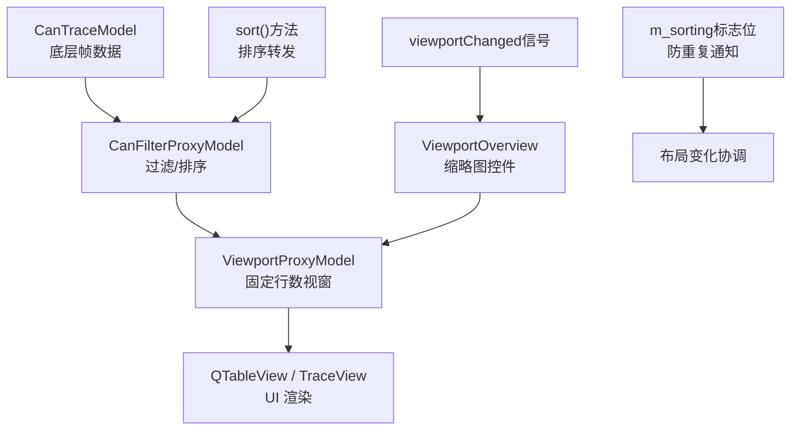
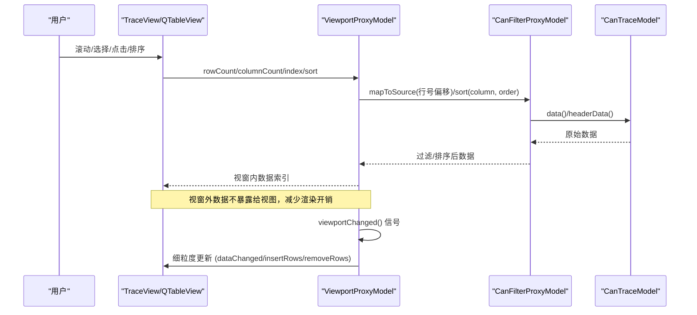
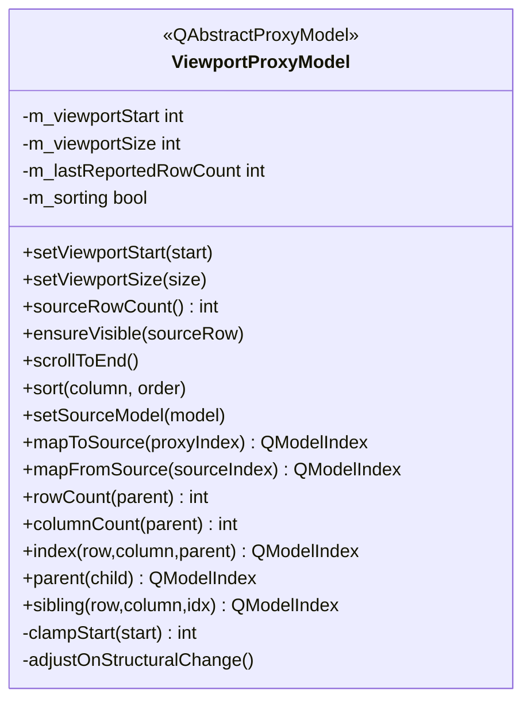
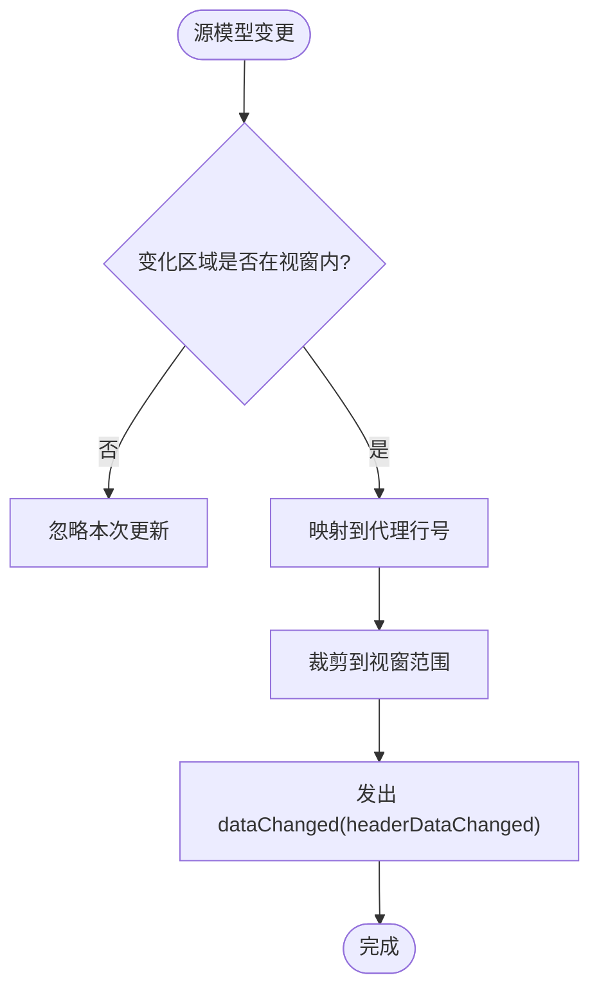
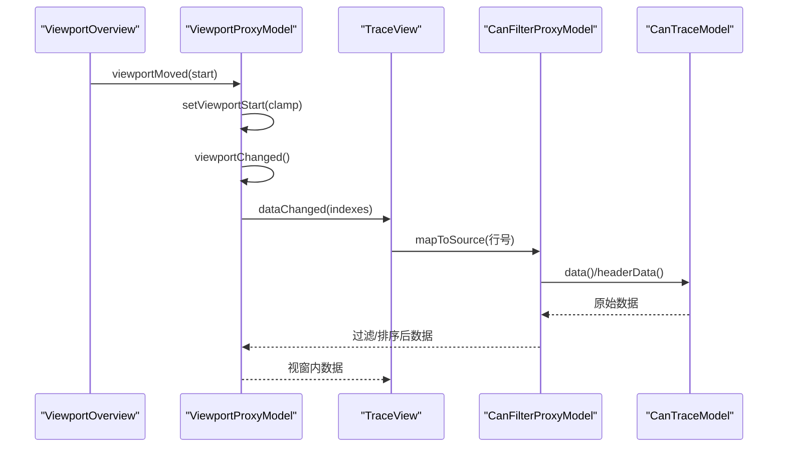

# 视口代理模型

<cite>
**本文引用的文件**
- [viewportproxy.h](file://src/models/viewportproxy.h)
- [viewportproxy.cpp](file://src/models/viewportproxy.cpp)
- [canfilterproxymodel.h](file://src/models/canfilterproxymodel.h)
- [canfilterproxymodel.cpp](file://src/models/canfilterproxymodel.cpp)
- [cantracemodel.h](file://src/models/cantracemodel.h)
- [traceview.h](file://src/ui/traceview.h)
- [traceview.cpp](file://src/ui/traceview.cpp)
- [main.cpp](file://src/main.cpp)
- [CMakeLists.txt](file://CMakeLists.txt)
</cite>

## 更新摘要
**所做更改**
- 增强了viewportChanged信号机制，在视窗位置或大小变化时发出统一信号
- 改进了行计数跟踪机制，引入m_lastReportedRowCount实现细粒度更新
- 优化了更新策略，减少不必要的modelReset调用，提升性能
- 完善了结构变化处理逻辑，确保视窗始终指向有效范围
- **新增**：完整的排序功能支持，通过自定义sort()方法正确转发排序请求到源模型
- **新增**：改进的布局变化传播机制，通过m_sorting标志位防止重复的信号转发
- **新增**：优化的视窗位置管理，确保排序后视窗状态的一致性和稳定性

## 目录
1. [简介](#简介)
2. [项目结构](#项目结构)
3. [核心组件](#核心组件)
4. [架构总览](#架构总览)
5. [详细组件分析](#详细组件分析)
6. [依赖关系分析](#依赖关系分析)
7. [性能考量](#性能考量)
8. [故障排查指南](#故障排查指南)
9. [结论](#结论)
10. [附录](#附录)

## 简介
本文件聚焦于"视口代理模型"的设计与实现，解释其在 CAN 报文 Trace 视图中的角色：在过滤与排序之上，提供固定行数的可视窗口，使 QTableView 仅渲染当前视窗内的数据行，同时保持筛选/排序对全部数据生效。该设计显著降低大数据量下的 UI 渲染压力，提升滚动、定位与交互的流畅度。

**最新更新**：视口代理模型经过重大优化，增强了viewportChanged信号机制，改进了行计数跟踪和细粒度更新策略，移除了对modelReset的过度依赖，提供了更高效的增量更新能力。**新增的完整排序功能**使得模型能够正确处理排序请求，同时保持视窗状态的一致性，并通过改进的布局变化协调机制避免了重复通知问题。

## 项目结构
围绕视口代理模型的代码主要分布在 models 层（数据模型）与 ui 层（视图集成）。整体链路为：
- CanTraceModel：底层数据源（环形缓冲、批量提交、着色规则等）
- CanFilterProxyModel：基于 FilterEngine 的行级过滤与列过滤、排序
- ViewportProxyModel：在过滤结果之上叠加"固定行数视窗"，映射到 QTableView
- TraceView/TraceTab：将上述模型链绑定到界面，并提供视窗缩略图控件进行外部滚动控制



图表来源
- [viewportproxy.h:6-17](file://src/models/viewportproxy.h#L6-L17)
- [canfilterproxymodel.h:9-16](file://src/models/canfilterproxymodel.h#L9-L16)
- [cantracemodel.h:15-23](file://src/models/cantracemodel.h#L15-L23)
- [traceview.h:161-225](file://src/ui/traceview.h#L161-L225)

章节来源
- [viewportproxy.h:6-17](file://src/models/viewportproxy.h#L6-L17)
- [traceview.h:161-225](file://src/ui/traceview.h#L161-L225)

## 核心组件
- ViewportProxyModel：继承 QAbstractProxyModel，暴露固定大小的行范围给上层视图；维护视窗起始行与大小；提供 ensureVisible、scrollToEnd 等导航能力；监听源模型变化并裁剪更新区域。**增强**：完整的排序功能支持、智能的布局变化协调机制和细粒度的行计数跟踪。
- CanFilterProxyModel：继承 QSortFilterProxyModel，封装主表达式过滤与按列过滤，支持时间戳显示模式切换，负责过滤后的可见行计算与排序。
- CanTraceModel：QAbstractTableModel，管理帧数据（环形缓冲）、批量提交、行标记与着色规则、覆盖模式等。
- TraceView/TraceTab：将模型链绑定到界面，提供选中保持、查找跳转、上下文菜单等交互；通过 ViewportOverview 提供外部滚动控制。

章节来源
- [viewportproxy.h:18-73](file://src/models/viewportproxy.h#L18-L73)
- [viewportproxy.cpp:10-60](file://src/models/viewportproxy.cpp#L10-L60)
- [canfilterproxymodel.h:16-104](file://src/models/canfilterproxymodel.h#L16-L104)
- [cantracemodel.h:23-179](file://src/models/cantracemodel.h#L23-L179)
- [traceview.h:24-113](file://src/ui/traceview.h#L24-L113)

## 架构总览
下图展示从数据到界面的完整调用链与职责边界：



图表来源
- [viewportproxy.cpp:68-115](file://src/models/viewportproxy.cpp#L68-L115)
- [canfilterproxymodel.h:73-85](file://src/models/canfilterproxymodel.h#L73-85)
- [cantracemodel.h:49-54](file://src/models/cantracemodel.h#L49-L54)

## 详细组件分析

### ViewportProxyModel 类设计
- 视窗控制
  - setViewportStart：设置视窗起始行，内部 clamp 到有效范围；根据行数变化策略性发出 dataChanged/insertRows/removeRows/resetModel，避免不必要的重绘。**增强**：使用 m_lastReportedRowCount 实现智能的行数变化检测。
  - setViewportSize：设置固定视窗大小，重置模型并调整起始行。
  - sourceRowCount：返回源模型总行数，用于外部控件（如缩略图）计算可访问范围。
  - ensureVisible：确保指定源行在视窗内，必要时移动视窗使其居中可见。
  - scrollToEnd：将视窗移动到末尾，显示最后 viewportSize 行。
- 模型接口
  - setSourceModel：连接源模型的数据/头数据/结构变化信号，统一转发或裁剪到视窗范围。
  - mapToSource/mapFromSource：在代理行与源行之间做偏移映射。
  - index/parent/sibling：构造代理索引，保证行列边界安全。
  - **新增** sort：将排序请求转发给源模型，同时通知视图布局即将变化，保持视窗状态一致性。
- 变更处理
  - onSourceDataChanged：将源模型的变化区域映射到视窗内，裁剪后发出 dataChanged。
  - onSourceHeaderDataChanged：透传头数据变化。
  - adjustOnStructuralChange：当源模型发生 rowsInserted/rowsRemoved/layoutChanged/modelReset 时，自动调整视窗起始位置，保持有效性。**优化**：减少了 modelReset 的使用，采用更细粒度的更新策略。



图表来源
- [viewportproxy.h:18-73](file://src/models/viewportproxy.h#L18-L73)
- [viewportproxy.cpp:10-60](file://src/models/viewportproxy.cpp#L10-L60)

章节来源
- [viewportproxy.h:18-73](file://src/models/viewportproxy.h#L18-L73)
- [viewportproxy.cpp:10-60](file://src/models/viewportproxy.cpp#L10-L60)
- [viewportproxy.cpp:132-181](file://src/models/viewportproxy.cpp#L132-L181)
- [viewportproxy.cpp:212-256](file://src/models/viewportproxy.cpp#L212-L256)

### 完整的排序功能支持
**新增功能**：实现了完整的排序支持，通过 `sort()` 方法将排序请求正确转发到源模型（CanFilterProxyModel），同时保持视窗状态的一致性。

排序流程：
1. 设置 `m_sorting` 标志位，防止源模型的 layout 信号重复转发
2. 发出 `layoutAboutToBeChanged()` 通知视图布局即将变化
3. 调用源模型的 `sort()` 方法执行实际排序
4. 重新钳制视窗起始位置，确保排序后视窗仍然有效
5. 更新行数统计，发出 `layoutChanged()` 和 `viewportChanged()` 信号

这种设计确保了排序操作不会破坏现有的视窗状态，同时避免了重复的信号处理和性能问题。

章节来源
- [viewportproxy.cpp:132-146](file://src/models/viewportproxy.cpp#L132-L146)
- [viewportproxy.h:55](file://src/models/viewportproxy.h#L55)

### 改进的布局变化协调机制
**核心改进**：通过 `m_sorting` 标志位和条件检查，实现了智能的布局变化传播：

- **排序期间**：当 `m_sorting = true` 时，忽略源模型的 layout 信号，由 `sort()` 方法统一处理
- **非排序期间**：正常转发源模型的 layout 变化信号，但会调整视窗位置以保持有效性
- **防重复处理**：避免同一布局变化被多次处理导致的性能问题和状态不一致

这种机制确保了布局变化的高效传播，同时保持了系统的稳定性。

章节来源
- [viewportproxy.cpp:277-291](file://src/models/viewportproxy.cpp#L277-L291)
- [viewportproxy.cpp:137-145](file://src/models/viewportproxy.cpp#L137-L145)

### 改进的行计数跟踪机制
**核心改进**：引入 `m_lastReportedRowCount` 成员变量，用于跟踪视图已知的行数，实现智能的行数变化检测：

- **行数不变时**：只发出 dataChanged，保持滚动条位置和选中状态
- **行数增加时**：先更新已有行，再插入新行，避免视觉跳动
- **行数减少时**：先更新剩余行，再移除多余行，保持数据一致性
- **空数据时**：仅在必要时使用 beginResetModel/endResetModel

这种细粒度的更新策略显著提升了用户体验，避免了不必要的全表刷新。

章节来源
- [viewportproxy.cpp:20-44](file://src/models/viewportproxy.cpp#L20-L44)
- [viewportproxy.cpp:173-193](file://src/models/viewportproxy.cpp#L173-L193)

### 与 CanFilterProxyModel 的协作
- 过滤与排序发生在 CanFilterProxyModel 层，ViewportProxyModel 只在其结果上截取固定行数。
- 当源模型结构变化（插入/删除/重置/布局变化），ViewportProxyModel 会调整视窗起始行，保证始终指向有效范围。
- 数据变化事件会被裁剪到视窗范围内，避免无关刷新。
- **优化**：通过智能的行数跟踪和排序支持，减少了不必要的 modelReset 调用，提升了响应速度。



图表来源
- [viewportproxy.cpp:183-208](file://src/models/viewportproxy.cpp#L183-L208)
- [viewportproxy.cpp:212-256](file://src/models/viewportproxy.cpp#L212-L256)

章节来源
- [viewportproxy.cpp:183-208](file://src/models/viewportproxy.cpp#L183-L208)
- [viewportproxy.cpp:212-256](file://src/models/viewportproxy.cpp#L212-L256)

### 与 TraceView/TraceTab 的集成
- TraceView 通过 setModel 将 ViewportProxyModel 作为模型，并暴露 viewportProxy/filterProxy/traceSource 辅助方法以穿越代理层。
- TraceTab 持有 CanTraceModel、CanFilterProxyModel、ViewportProxyModel 三者实例，并将 ViewportOverview 缩略图控件与 ViewportProxyModel 关联，实现外部滚动控制。
- 视窗缩略图控件支持拖拽高亮区域移动视窗、点击任意位置跳转视窗，并通过 viewportMoved 信号驱动 ViewportProxyModel 更新。
- **增强**：通过 viewportChanged 信号，ViewportOverview 可以及时响应视窗变化，无需轮询或复杂的状态同步。



图表来源
- [traceview.h:161-225](file://src/ui/traceview.h#L161-L225)
- [viewportproxy.cpp:10-60](file://src/models/viewportproxy.cpp#L10-L60)

章节来源
- [traceview.h:24-113](file://src/ui/traceview.h#L24-L113)
- [traceview.h:161-225](file://src/ui/traceview.h#L161-L225)
- [traceview.cpp:1380-1384](file://src/ui/traceview.cpp#L1380-L1384)

### 增强的viewportChanged信号机制
**新增功能**：viewportChanged信号在所有视窗状态变化时发出，包括：
- 视窗起始位置改变
- 视窗大小调整
- 源模型结构变化
- 数据更新完成
- **新增** 排序操作完成

这为外部组件（如ViewportOverview缩略图）提供了统一的更新通知机制，避免了复杂的信号连接和状态同步问题。

章节来源
- [viewportproxy.cpp:44](file://src/models/viewportproxy.cpp#L44)
- [viewportproxy.cpp:59](file://src/models/viewportproxy.cpp#L59)
- [viewportproxy.cpp:193](file://src/models/viewportproxy.cpp#L193)
- [viewportproxy.cpp:259](file://src/models/viewportproxy.cpp#L259)
- [viewportproxy.cpp:270](file://src/models/viewportproxy.cpp#L270)
- [viewportproxy.cpp:145](file://src/models/viewportproxy.cpp#L145)

## 依赖关系分析
- ViewportProxyModel 依赖 QAbstractItemModel 接口，通过 setSourceModel 接入上游模型（通常是 CanFilterProxyModel）。
- CanFilterProxyModel 依赖 FilterEngine 进行表达式解析与匹配，并实现 lessThan 以支持排序。
- CanTraceModel 提供底层帧数据，支持环形缓冲、批量提交、着色规则等。
- TraceView/TraceTab 组合上述模型，提供 UI 交互与外部滚动控制。
- **新增**：ViewportOverview 通过 viewportChanged 信号与 ViewportProxyModel 解耦通信。
- **新增**：排序功能依赖于 CanFilterProxyModel 的排序实现，通过 sort() 方法正确转发。

```mermaid
graph LR
TM["CanTraceModel"] --> FP["CanFilterProxyModel"]
FP --> VP["ViewportProxyModel"]
VP --> TV["TraceView/QTableView"]
VO["ViewportOverview"] --> VP
VP -.->|viewportChanged| VO
VP -.->|sort()| FP
VP -.->|m_sorting| FP
```

图表来源
- [cantracemodel.h:23-179](file://src/models/cantracemodel.h#L23-179)
- [canfilterproxymodel.h:16-104](file://src/models/canfilterproxymodel.h#L16-104)
- [viewportproxy.h:18-73](file://src/models/viewportproxy.h#L18-73)
- [traceview.h:161-225](file://src/ui/traceview.h#L161-L225)

章节来源
- [cantracemodel.h:23-179](file://src/models/cantracemodel.h#L23-179)
- [canfilterproxymodel.h:16-104](file://src/models/canfilterproxymodel.h#L16-104)
- [viewportproxy.h:18-73](file://src/models/viewportproxy.h#L18-73)
- [traceview.h:161-225](file://src/ui/traceview.h#L161-L225)

## 性能考量
- 视窗限制渲染：ViewportProxyModel 仅暴露固定行数，QTableView 只绘制视窗内数据，大幅降低大数据量下的渲染成本。
- **增量更新优化**：通过 m_lastReportedRowCount 实现智能的行数变化检测，只在必要时发出 insertRows/removeRows，避免 beginResetModel 造成的视觉跳动与重排。
- **排序性能优化**：通过 m_sorting 标志位防止重复的布局信号处理，减少不必要的性能开销。
- 事件裁剪：onSourceDataChanged 将源模型变化区域裁剪到视窗范围，减少无效刷新。
- 结构变化自适应：rowsInserted/rowsRemoved/layoutChanged/modelReset 触发 adjustOnStructuralChange，自动校正视窗起始行，避免越界。
- 外部滚动解耦：ViewportOverview 通过 viewportMoved 驱动视窗移动，与 QTableView 内置滚动条协同工作，互不干扰。
- **信号机制优化**：viewportChanged 信号提供统一的更新通知，避免了复杂的信号连接和状态同步开销。
- **布局传播优化**：智能的布局变化传播机制避免了重复的信号处理，提升了整体性能。

[本节为通用性能讨论，无需特定文件引用]

## 故障排查指南
- 视窗越界或空白
  - 检查 setViewportStart 是否被正确 clamp；确认 sourceRowCount 返回值与源模型一致。
  - 若源模型发生 modelReset，确保 ViewportProxyModel 已重置 m_viewportStart 并重新 emit viewportChanged。
- 数据未刷新
  - 确认 onSourceDataChanged 已将变化区域映射到代理行号并裁剪到视窗范围。
  - 若行数发生变化，检查是否发出了 insertRows/removeRows 或 resetModel。
  - **新增**：检查 m_lastReportedRowCount 是否正确更新，确保细粒度更新逻辑正常工作。
- 滚动不同步
  - 确保 ViewportOverview 的 viewportMoved 信号正确连接到 ViewportProxyModel::setViewportStart。
  - 检查 QTableView 的滚动行为是否与外部滚动协调（通常由 Qt 自动处理）。
- 排序/过滤后定位异常
  - 使用 ensureVisible 而非直接 setViewportStart，以保证目标行在视窗内且尽量居中。
  - 在 layoutChanged 后调用 adjustOnStructuralChange 以修正视窗起始行。
  - **新增**：检查 sort() 方法是否正确设置了 m_sorting 标志位，避免重复的布局信号处理。
- **新增**：viewportChanged 信号问题
  - 确认所有需要响应视窗变化的组件都连接了 viewportChanged 信号。
  - 检查信号连接是否在所有关键路径上都正确建立。
  - **新增**：验证排序操作后是否正确发出了 viewportChanged 信号。
- **新增**：排序功能问题
  - 确认 CanFilterProxyModel 的 lessThan 方法正确实现了各列的比较逻辑。
  - 检查排序后视窗位置是否正确钳制，避免排序导致视窗越界。
  - 验证 m_sorting 标志位在排序完成后正确重置为 false。

章节来源
- [viewportproxy.cpp:10-60](file://src/models/viewportproxy.cpp#L10-L60)
- [viewportproxy.cpp:132-181](file://src/models/viewportproxy.cpp#L132-L181)
- [viewportproxy.cpp:183-208](file://src/models/viewportproxy.cpp#L183-L208)
- [viewportproxy.cpp:212-256](file://src/models/viewportproxy.cpp#L212-L256)
- [viewportproxy.cpp:132-146](file://src/models/viewportproxy.cpp#L132-L146)
- [traceview.cpp:1380-1384](file://src/ui/traceview.cpp#L1380-L1384)

## 结论
ViewportProxyModel 通过在过滤与排序之上叠加固定行数视窗，实现了高性能的 Trace 列表渲染。经过最新优化，它具备了增强的viewportChanged信号机制、改进的行计数跟踪、细粒度更新策略和**完整的排序支持**。这些改进显著提升了性能和用户体验，特别是排序功能的完善使得模型能够正确处理各种排序场景，同时保持视窗状态的一致性。**新增的布局变化协调机制**通过 m_sorting 标志位有效防止了重复通知问题，进一步优化了系统性能。它与 CanFilterProxyModel 和 CanTraceModel 形成清晰的职责分层，配合 TraceView/TraceTab 的交互与 ViewportOverview 的外部滚动控制，提供了稳定、流畅的大数据可视化体验。

**未来可在以下方面继续优化**：
- 更细粒度的增量更新策略（例如按列粒度更新）
- 与图形视图的联动（如双击信号追踪时自动定位到对应帧）
- 更丰富的视窗导航（如历史视窗快照、快速跳转书签）
- 进一步优化 viewportChanged 信号的触发时机，减少不必要的更新
- **新增**：考虑添加排序状态的持久化，以便在模型重建后恢复用户的排序偏好
- **新增**：进一步优化布局变化协调机制，减少潜在的竞态条件

[本节为总结性内容，无需特定文件引用]

## 附录
- 构建与入口
  - 项目使用 CMake 配置，Qt6 Widgets/PrintSupport/Svg 为必需组件。
  - main.cpp 中注册元类型、初始化日志、加载配置与会话状态，创建并显示 MainWindow。

章节来源
- [CMakeLists.txt:1-63](file://CMakeLists.txt#L1-L63)
- [main.cpp:10-38](file://src/main.cpp#L10-L38)