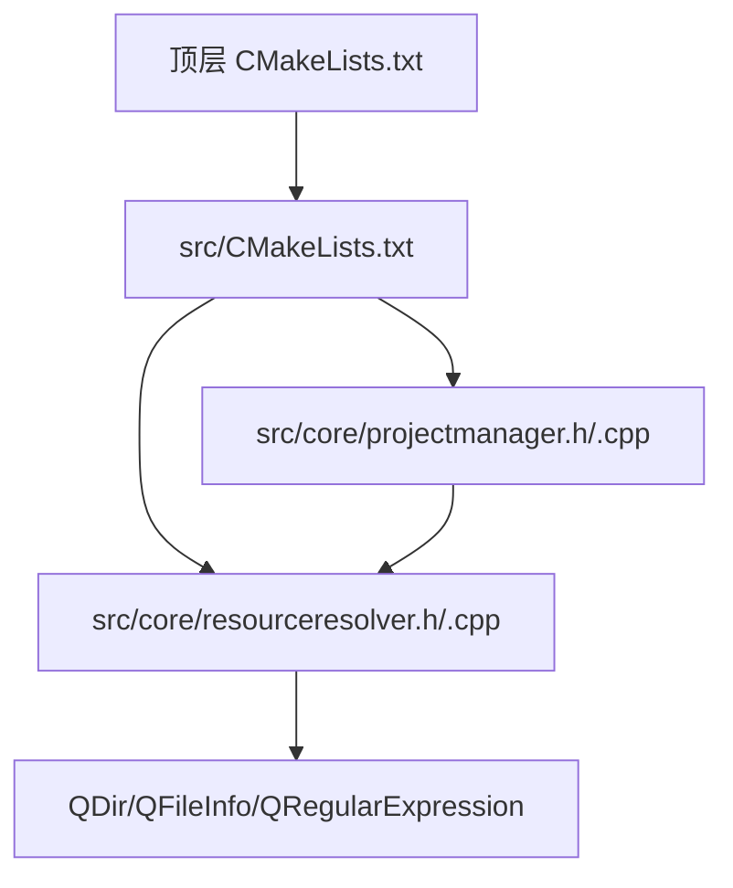
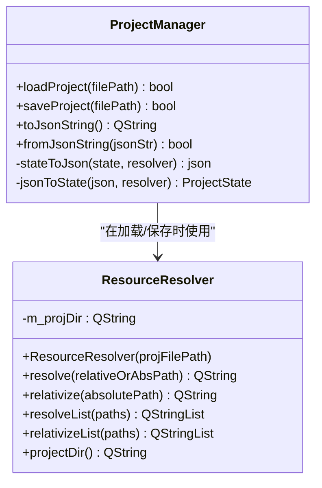
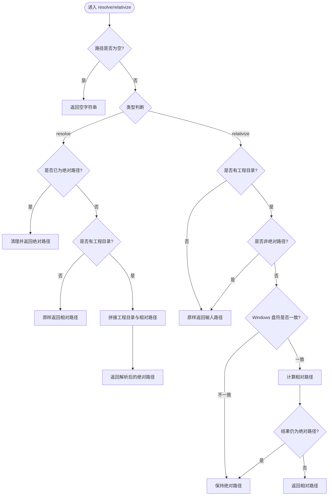
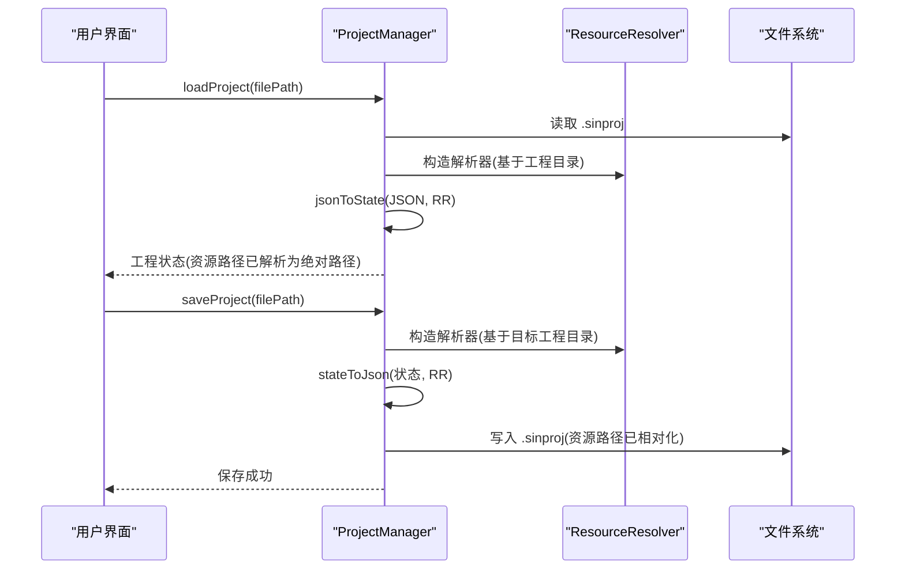
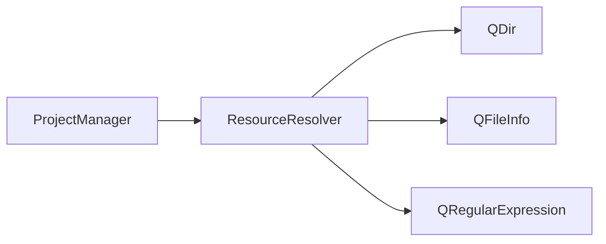

# 资源路径解析器

<cite>
**本文引用的文件**
- [resourceresolver.h](file://src/core/resourceresolver.h)
- [resourceresolver.cpp](file://src/core/resourceresolver.cpp)
- [projectmanager.h](file://src/core/projectmanager.h)
- [projectmanager.cpp](file://src/core/projectmanager.cpp)
- [README.md](file://README.md)
- [CMakeLists.txt](file://CMakeLists.txt)
</cite>

## 目录
1. [简介](#简介)
2. [项目结构](#项目结构)
3. [核心组件](#核心组件)
4. [架构总览](#架构总览)
5. [详细组件分析](#详细组件分析)
6. [依赖关系分析](#依赖关系分析)
7. [性能考量](#性能考量)
8. [故障排查指南](#故障排查指南)
9. [结论](#结论)
10. [附录](#附录)

## 简介
本文件聚焦于“资源路径解析器”的设计与实现，该组件负责在工程（.sinproj）的上下文中，将外部资源（如 DBC、日志、过滤器等）的路径在“相对路径”和“绝对路径”之间进行安全转换。其目标是：
- 保存工程时，将资源路径转为相对于 .sinproj 所在目录的相对路径，提升工程的可移植性；
- 加载工程时，将相对路径还原为绝对路径，确保运行时能正确定位资源；
- 在 Windows 跨盘符等无法相对化的场景下，保持绝对路径作为回退策略，避免错误相对化导致资源不可用。

该组件被集成到工程管理器中，用于工程文件的序列化/反序列化过程中的路径处理。

**章节来源**
- [resourceresolver.h:7-15](file://src/core/resourceresolver.h#L7-L15)
- [README.md:1335-1358](file://README.md#L1335-L1358)

## 项目结构
资源路径解析器位于核心层（core），与工程管理器紧密协作。整体构建由顶层 CMake 配置管理，Qt 自动化特性启用，并通过子目录组织源码。

**图表来源**
- [CMakeLists.txt:17-21](file://CMakeLists.txt#L17-L21)
- [CMakeLists.txt:55](file://CMakeLists.txt#L55)

**章节来源**
- [CMakeLists.txt:1-63](file://CMakeLists.txt#L1-L63)

## 核心组件
- ResourceResolver：提供路径解析的核心能力，包括单条路径与批量路径的解析与相对化。
- ProjectManager：在工程加载/保存过程中使用 ResourceResolver 对资源路径进行处理，并维护工程状态与元数据。

关键职责划分：
- ResourceResolver：专注于路径转换逻辑，不关心业务上下文；
- ProjectManager：负责工程 I/O、JSON 序列化/反序列化，并在需要时调用 ResourceResolver。

**章节来源**
- [resourceresolver.h:16-38](file://src/core/resourceresolver.h#L16-L38)
- [projectmanager.h:105-146](file://src/core/projectmanager.h#L105-L146)

## 架构总览
下图展示了 ResourceResolver 在项目中的位置及其与 ProjectManager 的交互关系。

**图表来源**
- [resourceresolver.h:16-38](file://src/core/resourceresolver.h#L16-L38)
- [projectmanager.h:105-146](file://src/core/projectmanager.h#L105-L146)

## 详细组件分析

### ResourceResolver 类设计
- 构造：以工程文件路径为基准，提取工程目录作为解析根；
- resolve：将相对路径解析为绝对路径，若输入为空或已是绝对路径则按规则返回；
- relativize：将绝对路径转换为相对路径，仅在可相对化时生效，否则保持绝对路径；
- 批量方法：对 QStringList 进行逐条解析/相对化；
- 工程目录访问：暴露 projectDir() 供上层查询。

**图表来源**
- [resourceresolver.cpp:16-74](file://src/core/resourceresolver.cpp#L16-L74)

**章节来源**
- [resourceresolver.cpp:1-96](file://src/core/resourceresolver.cpp#L1-L96)

### 与 ProjectManager 的集成
- 加载工程：创建 ResourceResolver 实例，使用 jsonToState 将 JSON 中的资源路径解析为绝对路径；
- 保存工程：创建 ResourceResolver 实例，使用 stateToJson 将内存中的绝对路径相对化后写入 JSON；
- 工程元数据：v2 新增 meta 与 deviceConfig，resources 节点存储相对路径。

**图表来源**
- [projectmanager.cpp:43-106](file://src/core/projectmanager.cpp#L43-L106)
- [projectmanager.cpp:159-200](file://src/core/projectmanager.cpp#L159-L200)

**章节来源**
- [projectmanager.cpp:43-106](file://src/core/projectmanager.cpp#L43-L106)
- [projectmanager.cpp:159-200](file://src/core/projectmanager.cpp#L159-L200)

### 数据结构与复杂度
- 时间复杂度：
  - resolve/relativize：单次路径操作为 O(1)，主要开销来自路径字符串处理与正则匹配（仅 Windows 盘符检查）；
  - resolveList/relativizeList：O(n)，n 为路径数量。
- 空间复杂度：
  - 单条路径解析：O(1)；
  - 批量操作：O(n) 用于结果容器。

优化点：
- 批量方法已预分配结果容器大小，减少动态扩容开销；
- 正则表达式仅在必要时执行（Windows 盘符检查）。

**章节来源**
- [resourceresolver.cpp:79-95](file://src/core/resourceresolver.cpp#L79-L95)

## 依赖关系分析
ResourceResolver 依赖 Qt 标准库进行路径与文件系统操作，ProjectManager 通过包含头文件引入并使用该组件。

**图表来源**
- [resourceresolver.cpp:1-5](file://src/core/resourceresolver.cpp#L1-L5)
- [projectmanager.h:9](file://src/core/projectmanager.h#L9)

**章节来源**
- [resourceresolver.cpp:1-5](file://src/core/resourceresolver.cpp#L1-L5)
- [projectmanager.h:9](file://src/core/projectmanager.h#L9)

## 性能考量
- 路径解析为轻量操作，适合在工程 I/O 流程中频繁调用；
- 批量方法通过 reserve 预分配，降低内存分配次数；
- 正则表达式仅在 Windows 平台且路径为绝对路径时执行，影响范围有限；
- 建议：
  - 避免在主线程中进行大量路径解析（当前实现已满足需求）；
  - 如需进一步优化，可对常用路径进行缓存（注意工程目录变更时的失效策略）。

[本节为通用性能讨论，不直接分析具体文件]

## 故障排查指南
常见问题与处理策略：
- 空路径：
  - resolve/relativize 遇到空输入直接返回空字符串，避免无效操作；
- 无工程目录：
  - 当未设置工程目录时，resolve 原样返回输入，relativize 也原样返回，保证不会抛出异常；
- 跨盘符路径（Windows）：
  - 检测到不同驱动器前缀时，保持绝对路径，防止错误相对化；
- QDir::relativeFilePath 无法相对化：
  - 若结果为绝对路径，说明不在基准目录下，回退为原始绝对路径；
- JSON 解析失败：
  - ProjectManager 捕获异常并记录错误日志，返回失败状态；
- 文件 I/O 失败：
  - 打开/写入失败时记录错误日志并返回 false。

**章节来源**
- [resourceresolver.cpp:16-74](file://src/core/resourceresolver.cpp#L16-L74)
- [projectmanager.cpp:43-106](file://src/core/projectmanager.cpp#L43-L106)

## 结论
资源路径解析器以简洁、健壮的方式实现了工程资源的相对路径管理，确保了工程文件的可移植性与运行时的资源可定位性。通过与 ProjectManager 的集成，它在工程加载/保存的关键路径上提供了可靠支持，并在跨平台与边界场景中具备合理的回退策略。未来可在批量解析场景考虑缓存机制以提升性能，但当前实现已满足工程管理的核心需求。

[本节为总结性内容，不直接分析具体文件]

## 附录
- 工程文件格式（v2）：
  - resources 节点存储相对路径（DBC、日志、过滤器等）；
  - meta 节点存储元信息（名称、时间戳、标签、备注）；
  - device 节点存储设备配置（类型、通道、波特率、FD 参数）。

**章节来源**
- [README.md:1002-1035](file://README.md#L1002-L1035)