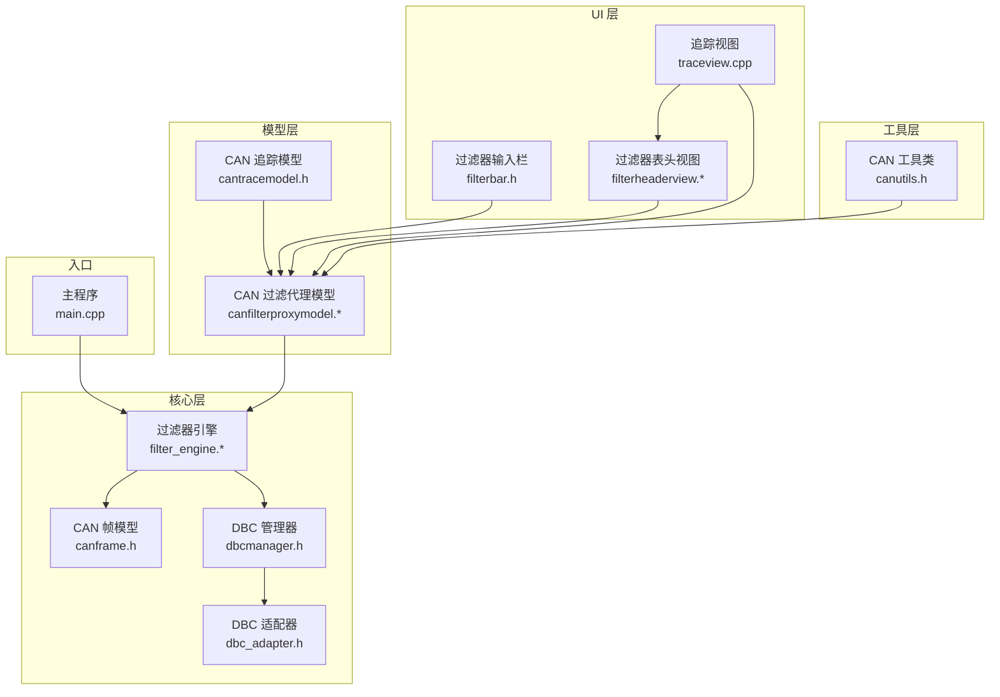
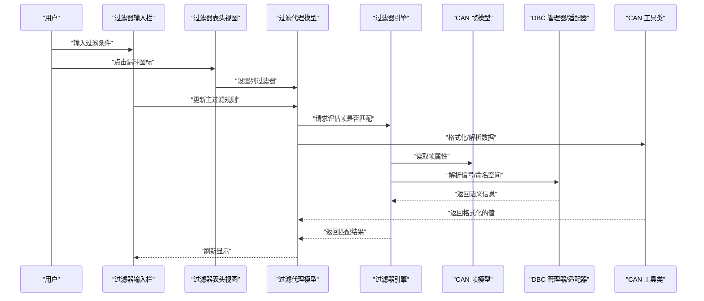
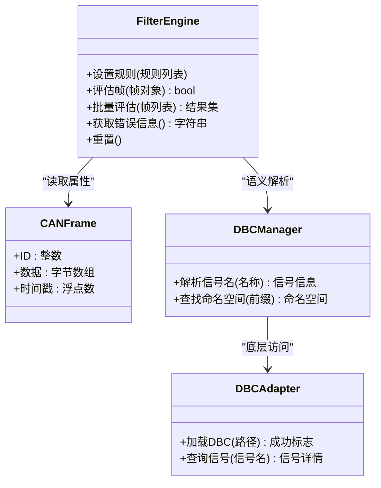
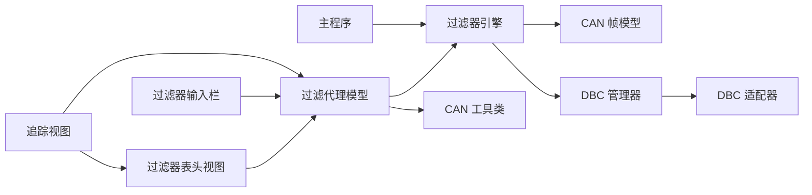

# 过滤器引擎

<cite>
**本文引用的文件**   
- [filter_engine.h](file://src/core/filter_engine.h)
- [filter_engine.cpp](file://src/core/filter_engine.cpp)
- [canframe.h](file://src/core/canframe.h)
- [dbcmanager.h](file://src/core/dbcmanager.h)
- [dbc_adapter.h](file://src/core/dbc/dbc_adapter.h)
- [canfilterproxymodel.h](file://src/models/canfilterproxymodel.h)
- [canfilterproxymodel.cpp](file://src/models/canfilterproxymodel.cpp)
- [cantracemodel.h](file://src/models/cantracemodel.h)
- [filterbar.h](file://src/ui/filterbar.h)
- [filterheaderview.h](file://src/ui/filterheaderview.h)
- [filterheaderview.cpp](file://src/ui/filterheaderview.cpp)
- [traceview.cpp](file://src/ui/traceview.cpp)
- [canutils.h](file://src/utils/canutils.h)
- [main.cpp](file://src/main.cpp)
</cite>

## 更新摘要
**所做更改**   
- 更新了 CanFilterProxyModel 组件分析，包含复杂的过滤操作和排序功能
- 新增 FilterHeaderView 组件章节，描述 Wireshark 风格的交互界面
- 增强了按列过滤功能的详细说明
- 更新了架构总览以反映新的组件关系
- 完善了性能考量和故障排查指南

## 目录
1. [简介](#简介)
2. [项目结构](#项目结构)
3. [核心组件](#核心组件)
4. [架构总览](#架构总览)
5. [详细组件分析](#详细组件分析)
6. [依赖关系分析](#依赖关系分析)
7. [性能考量](#性能考量)
8. [故障排查指南](#故障排查指南)
9. [结论](#结论)
10. [附录](#附录)

## 简介
本文件围绕"过滤器引擎"展开，聚焦于 CAN 数据过滤的核心实现与集成方式。文档从系统架构、组件职责、数据流、处理逻辑、集成点、错误处理与性能特征等维度进行系统化说明，帮助读者快速理解并正确使用该引擎。

**更新** 本次更新重点介绍了 CanFilterProxyModel 的重大增强功能，包括数值比较运算符、时间范围过滤、智能文本匹配和实时过滤能力，以及新增的 FilterHeaderView 组件提供的 Wireshark 风格交互界面。

## 项目结构
本项目采用分层组织：
- 核心层（core）：包含 CAN 帧模型、DBC 管理、播放器/录制器以及过滤器引擎。
- 模型层（models）：提供 CAN 追踪模型与代理模型，用于 UI 展示与筛选。
- UI 层（ui）：提供交互界面，包括过滤器输入栏、表头视图等。
- 工具与第三方库：通用工具与外部依赖。



**图表来源**
- [filter_engine.h](file://src/core/filter_engine.h)
- [canframe.h](file://src/core/canframe.h)
- [dbcmanager.h](file://src/core/dbcmanager.h)
- [dbc_adapter.h](file://src/core/dbc/dbc_adapter.h)
- [canfilterproxymodel.h](file://src/models/canfilterproxymodel.h)
- [canfilterproxymodel.cpp](file://src/models/canfilterproxymodel.cpp)
- [cantracemodel.h](file://src/models/cantracemodel.h)
- [filterbar.h](file://src/ui/filterbar.h)
- [filterheaderview.h](file://src/ui/filterheaderview.h)
- [filterheaderview.cpp](file://src/ui/filterheaderview.cpp)
- [traceview.cpp](file://src/ui/traceview.cpp)
- [canutils.h](file://src/utils/canutils.h)
- [main.cpp](file://src/main.cpp)

## 核心组件
- 过滤器引擎：负责解析过滤表达式、匹配 CAN 帧属性（如 ID、信号名、数值范围等），并提供统一的过滤接口供上层调用。
- CAN 帧模型：定义 CAN 帧的数据结构与基本操作，作为过滤器的输入对象。
- DBC 管理器与适配器：提供 DBC 符号解析能力，支持基于信号名、描述等语义化过滤。
- **增强的** 过滤代理模型：在 UI 层对原始数据进行二次过滤与展示控制，支持复杂的列级过滤和排序。
- **新增的** 过滤器表头视图：提供 Wireshark 风格的交互式过滤界面，支持漏斗图标和悬停效果。
- 过滤器输入栏：用户输入过滤条件，触发模型更新或引擎重评估。

**章节来源**
- [filter_engine.h](file://src/core/filter_engine.h)
- [filter_engine.cpp](file://src/core/filter_engine.cpp)
- [canframe.h](file://src/core/canframe.h)
- [dbcmanager.h](file://src/core/dbcmanager.h)
- [dbc_adapter.h](file://src/core/dbc/dbc_adapter.h)
- [canfilterproxymodel.h](file://src/models/canfilterproxymodel.h)
- [canfilterproxymodel.cpp](file://src/models/canfilterproxymodel.cpp)
- [filterheaderview.h](file://src/ui/filterheaderview.h)
- [filterheaderview.cpp](file://src/ui/filterheaderview.cpp)
- [filterbar.h](file://src/ui/filterbar.h)

## 架构总览
过滤器引擎处于数据处理的关键路径：上游接收原始 CAN 帧，下游输出过滤后的结果给 UI 模型或业务模块。其典型流程如下：



**图表来源**
- [filter_engine.h](file://src/core/filter_engine.h)
- [filter_engine.cpp](file://src/core/filter_engine.cpp)
- [canframe.h](file://src/core/canframe.h)
- [dbcmanager.h](file://src/core/dbcmanager.h)
- [dbc_adapter.h](file://src/core/dbc/dbc_adapter.h)
- [canfilterproxymodel.h](file://src/models/canfilterproxymodel.h)
- [canfilterproxymodel.cpp](file://src/models/canfilterproxymodel.cpp)
- [filterheaderview.h](file://src/ui/filterheaderview.h)
- [filterheaderview.cpp](file://src/ui/filterheaderview.cpp)
- [canutils.h](file://src/utils/canutils.h)
- [filterbar.h](file://src/ui/filterbar.h)

## 详细组件分析

### 过滤器引擎（Filter Engine）
- 职责
  - 解析与编译过滤表达式（如 ID 范围、信号名匹配、数值区间等）。
  - 对每个 CAN 帧执行匹配判断，返回布尔结果。
  - 提供批量评估接口以提升吞吐。
  - 暴露配置接口以动态更新过滤规则。
- 关键数据结构
  - 过滤规则集合：存储已解析的表达式与参数。
  - 匹配上下文：缓存 DBC 解析结果、状态变量等。
- 算法要点
  - 表达式解析：将字符串表达式转换为可执行的结构（如 AST 或规则表）。
  - 短路求值：按优先级快速排除不匹配项，降低计算开销。
  - 增量更新：当规则变化时仅重新评估受影响的数据。
- 错误处理
  - 表达式语法错误：返回明确的错误码与位置提示。
  - 未定义符号：结合 DBC 管理器给出缺失信息建议。
  - 运行时异常：捕获并记录日志，避免崩溃。
- 性能优化
  - 预编译规则：减少重复解析成本。
  - 位图索引：对常用字段（如 ID）建立索引加速匹配。
  - 并行评估：对大批量帧使用多线程分片处理。



**图表来源**
- [filter_engine.h](file://src/core/filter_engine.h)
- [filter_engine.cpp](file://src/core/filter_engine.cpp)
- [canframe.h](file://src/core/canframe.h)
- [dbcmanager.h](file://src/core/dbcmanager.h)
- [dbc_adapter.h](file://src/core/dbc/dbc_adapter.h)

**章节来源**
- [filter_engine.h](file://src/core/filter_engine.h)
- [filter_engine.cpp](file://src/core/filter_engine.cpp)
- [canframe.h](file://src/core/canframe.h)
- [dbcmanager.h](file://src/core/dbcmanager.h)
- [dbc_adapter.h](file://src/core/dbc/dbc_adapter.h)

### CAN 帧模型（CAN Frame）
- 职责
  - 封装 CAN 帧的基本属性（标识符、数据载荷、时间戳等）。
  - 提供只读访问接口，确保过滤过程不可变。
- 复杂度
  - 构造与拷贝为 O(1) 或 O(n)（n 为数据长度）。
  - 比较与哈希可用于索引与去重。
- 设计要点
  - 线程安全：跨线程传递时保证只读访问。
  - 内存布局：紧凑存储以减少拷贝开销。

**章节来源**
- [canframe.h](file://src/core/canframe.h)

### DBC 管理器与适配器（DBC Manager & Adapter）
- 职责
  - 加载 DBC 文件，构建信号与消息的映射表。
  - 提供符号查询接口，支持按名称、前缀、描述等检索。
- 关键点
  - 延迟加载：按需解析大型 DBC，减少启动时间。
  - 缓存策略：对频繁查询的符号进行缓存。
  - 错误恢复：对损坏的 DBC 提供降级模式。

**章节来源**
- [dbcmanager.h](file://src/core/dbcmanager.h)
- [dbc_adapter.h](file://src/core/dbc/dbc_adapter.h)

### 增强的过滤代理模型（Enhanced CAN Filter Proxy Model）
**更新** CanFilterProxyModel 经历了重大增强，现在支持复杂的过滤操作：

- **核心职责**
  - 维护原始数据源与过滤后的视图。
  - 响应过滤器规则变更，触发重新评估。
  - 与 UI 组件协作，提供排序、分页等功能。
  - 支持主过滤表达式 + 按列子过滤器的组合。

- **高级过滤功能**
  - **数值比较运算符**：支持 `>`、`<`、`!=` 等操作符
  - **时间范围过滤**：支持时间戳和增量时间的范围查询
  - **智能文本匹配**：自动识别数据类型并进行相应匹配
  - **实时过滤**：用户输入时即时响应，无需额外确认

- **按列过滤实现**
  ```cpp
  // 支持的列类型和操作
  case ColNo:      // 序列号：">10", "<50", "123"
  case ColTime:    // 时间戳：">0.5", "<1.0", "0.3~0.8"
  case ColDelta:   // 时间增量：">0.01", "<0.1"
  case ColId:      // CAN ID：">0x100", "<0x200", "!=0x123"
  case ColDlc:     // DLC：">4", "8"
  case ColData:    // 数据：十六进制匹配
  case ColFlags:   // 标志：FD, BRS, ESI
  case ColFrameCount: // 帧计数：">10", "50"
  ```

- **增强的排序功能**
  - 针对数值列的正确排序实现
  - 支持时间、ID、DLC 等字段的数值比较
  - 保持与过滤逻辑的一致性

- **数据流**
  - 上游：原始 CAN 帧序列
  - 中游：应用过滤器引擎的规则 + 列级过滤
  - 下游：向 UI 暴露过滤后的行数据

**章节来源**
- [canfilterproxymodel.h](file://src/models/canfilterproxymodel.h)
- [canfilterproxymodel.cpp](file://src/models/canfilterproxymodel.cpp)
- [cantracemodel.h](file://src/models/cantracemodel.h)

### 新增的过滤器表头视图（Filter Header View）
**新增** FilterHeaderView 组件提供了 Wireshark 风格的交互式过滤界面：

- **核心功能**
  - 鼠标悬停某列表头时，右侧绘制半透明漏斗图标
  - 该列已有过滤条件时，漏斗图标持续显示并高亮
  - 点击漏斗图标触发 filterClicked 信号 → 弹出列筛选对话框
  - 漏斗图标左侧绘制小三角形，点击触发排序切换

- **视觉设计**
  - 激活状态：蓝色漏斗图标（Google Blue #1A73E8）
  - 悬停状态：深灰色漏斗图标
  - 默认状态：中灰色漏斗图标
  - 激活指示：右下角小圆点表示有活跃过滤

- **交互特性**
  - 悬停检测：精确的鼠标位置检测
  - 光标反馈：漏斗区域显示手型光标
  - 实时更新：过滤状态变化时立即重绘
  - 事件冒泡：正确处理鼠标事件传递

- **技术实现**
  - 继承 QHeaderView 并重写 paintSection
  - 使用 QPainterPath 绘制漏斗形状
  - 支持动画效果和抗锯齿渲染
  - 与 CanFilterProxyModel 集成查询过滤状态

**章节来源**
- [filterheaderview.h](file://src/ui/filterheaderview.h)
- [filterheaderview.cpp](file://src/ui/filterheaderview.cpp)

### 过滤器输入栏（Filter Bar）
- 职责
  - 收集用户输入的过滤条件。
  - 校验输入格式，反馈错误提示。
  - 触发模型更新或引擎重评估。
- 交互流程
  - 用户输入 → 实时校验 → 更新规则 → 通知模型 → 刷新视图。

**章节来源**
- [filterbar.h](file://src/ui/filterbar.h)

### 入口程序（Main）
- 职责
  - 初始化子系统（日志、资源、UI）。
  - 创建并连接过滤器引擎与模型。
  - 启动事件循环。

**章节来源**
- [main.cpp](file://src/main.cpp)

## 依赖关系分析
- 内聚性
  - 过滤器引擎高内聚：专注于表达式解析与匹配逻辑。
  - DBC 相关模块解耦：通过抽象接口隔离底层实现。
  - 过滤代理模型高度内聚：封装所有过滤逻辑。
- 耦合度
  - 引擎与 CAN 帧模型弱耦合：仅依赖只读接口。
  - 引擎与 DBC 管理器松耦合：通过查询接口而非直接访问。
  - FilterHeaderView 与 CanFilterProxyModel 松耦合：通过接口查询状态。
- 外部依赖
  - 表达式解析可能依赖第三方库（如表达式引擎）。
  - DBC 解析依赖 dbcppp 等库。
  - UI 组件依赖 Qt 框架的绘图和事件处理。



**图表来源**
- [filter_engine.h](file://src/core/filter_engine.h)
- [canframe.h](file://src/core/canframe.h)
- [dbcmanager.h](file://src/core/dbcmanager.h)
- [dbc_adapter.h](file://src/core/dbc/dbc_adapter.h)
- [canfilterproxymodel.h](file://src/models/canfilterproxymodel.h)
- [canfilterproxymodel.cpp](file://src/models/canfilterproxymodel.cpp)
- [filterheaderview.h](file://src/ui/filterheaderview.h)
- [filterheaderview.cpp](file://src/ui/filterheaderview.cpp)
- [canutils.h](file://src/utils/canutils.h)
- [filterbar.h](file://src/ui/filterbar.h)
- [traceview.cpp](file://src/ui/traceview.cpp)
- [main.cpp](file://src/main.cpp)

**章节来源**
- [filter_engine.h](file://src/core/filter_engine.h)
- [canframe.h](file://src/core/canframe.h)
- [dbcmanager.h](file://src/core/dbcmanager.h)
- [dbc_adapter.h](file://src/core/dbc/dbc_adapter.h)
- [canfilterproxymodel.h](file://src/models/canfilterproxymodel.h)
- [canfilterproxymodel.cpp](file://src/models/canfilterproxymodel.cpp)
- [filterheaderview.h](file://src/ui/filterheaderview.h)
- [filterheaderview.cpp](file://src/ui/filterheaderview.cpp)
- [canutils.h](file://src/utils/canutils.h)
- [filterbar.h](file://src/ui/filterbar.h)
- [traceview.cpp](file://src/ui/traceview.cpp)
- [main.cpp](file://src/main.cpp)

## 性能考量
- 表达式解析
  - 预编译规则，避免重复解析。
  - 使用高效的词法/语法分析器。
- 匹配效率
  - 对高频字段（如 ID）建立索引或位图。
  - 短路求值与早期退出策略。
  - **新增** 列级过滤的增量更新机制。
- 并发处理
  - 批量评估时使用线程池分片处理。
  - 避免锁竞争，采用无锁队列或分区锁。
- 内存管理
  - 复用对象与缓冲区，减少分配次数。
  - 及时释放临时对象，避免内存泄漏。
- I/O 与 DBC
  - 延迟加载与缓存 DBC 符号。
  - 异步加载大文件，提升启动速度。
- **新增** UI 性能优化
  - FilterHeaderView 的延迟绘制和局部重绘。
  - 鼠标事件的防抖处理。
  - 图形绘制的批处理和缓存。

## 故障排查指南
- 常见问题
  - 表达式语法错误：检查语法与关键字拼写，查看错误位置提示。
  - 未定义符号：确认 DBC 已正确加载且符号存在。
  - 性能下降：检查规则复杂度与索引有效性。
  - **新增** 列过滤不生效：验证列索引和过滤条件格式。
  - **新增** 漏斗图标不显示：检查 FilterHeaderView 是否正确设置。
- 调试步骤
  - 启用详细日志，观察解析与匹配过程。
  - 使用最小复现用例定位问题。
  - 逐步简化规则，隔离冲突条件。
  - **新增** 使用 Qt Creator 的调试器检查 UI 事件流。
- 恢复策略
  - 回滚到上一个有效规则集。
  - 启用降级模式，忽略无法解析的部分。
  - **新增** 重置 FilterHeaderView 的状态和样式。

**章节来源**
- [filter_engine.h](file://src/core/filter_engine.h)
- [filter_engine.cpp](file://src/core/filter_engine.cpp)
- [canfilterproxymodel.cpp](file://src/models/canfilterproxymodel.cpp)
- [filterheaderview.cpp](file://src/ui/filterheaderview.cpp)
- [dbcmanager.h](file://src/core/dbcmanager.h)
- [dbc_adapter.h](file://src/core/dbc/dbc_adapter.h)

## 结论
过滤器引擎通过清晰的职责划分与松耦合设计，实现了高效、可扩展的 CAN 数据过滤能力。经过重大增强后，CanFilterProxyModel 现在支持复杂的数值比较、时间范围过滤和智能文本匹配，而新增的 FilterHeaderView 组件提供了直观的 Wireshark 风格交互界面。结合 DBC 语义解析与 UI 联动，能够满足复杂场景下的实时筛选需求。建议在大规模数据场景中进一步优化索引与并发策略，以获得更佳的性能表现。

## 附录
- 术语表
  - CAN 帧：控制器局域网通信的基本数据单元。
  - DBC：CAN 数据库文件，描述信号与消息的语义。
  - 过滤代理模型：在 UI 层对数据进行二次过滤与展示的中间层。
  - 漏斗图标：Wireshark 风格的过滤指示器。
  - 列级过滤：针对特定列的独立过滤条件。
- 参考链接
  - 表达式解析库文档（如有）
  - DBC 解析库文档（dbcppp）
  - Qt 自定义控件开发指南