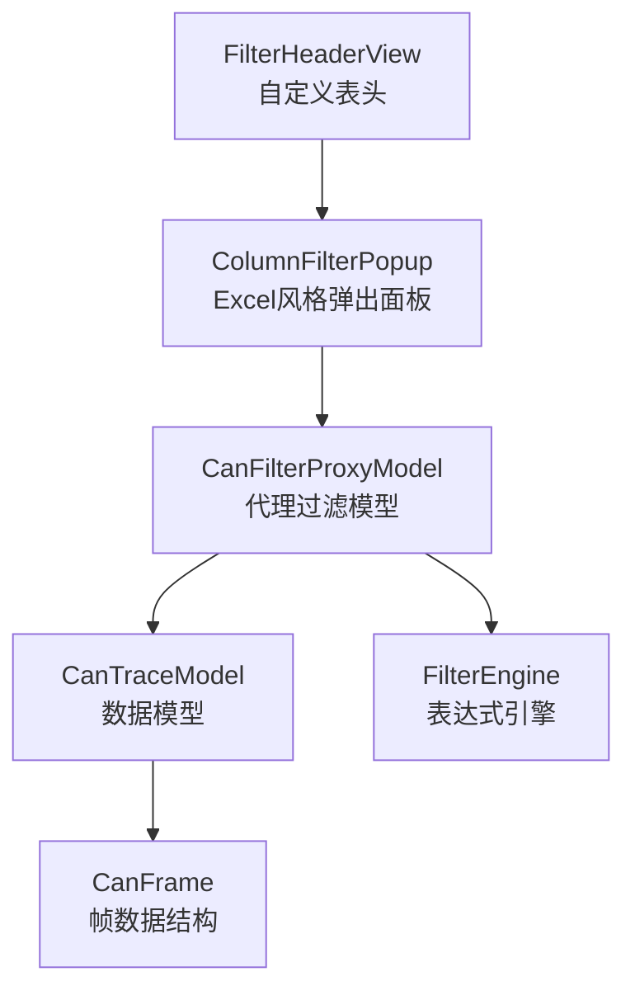
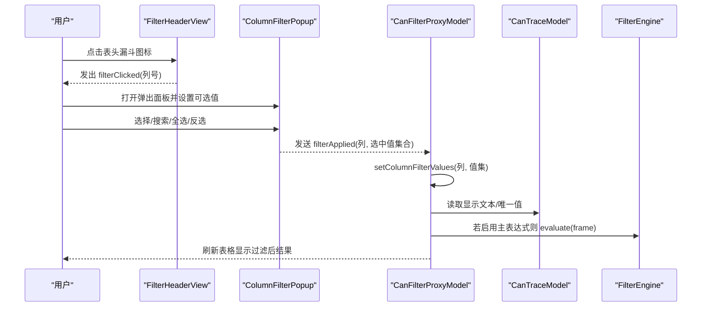
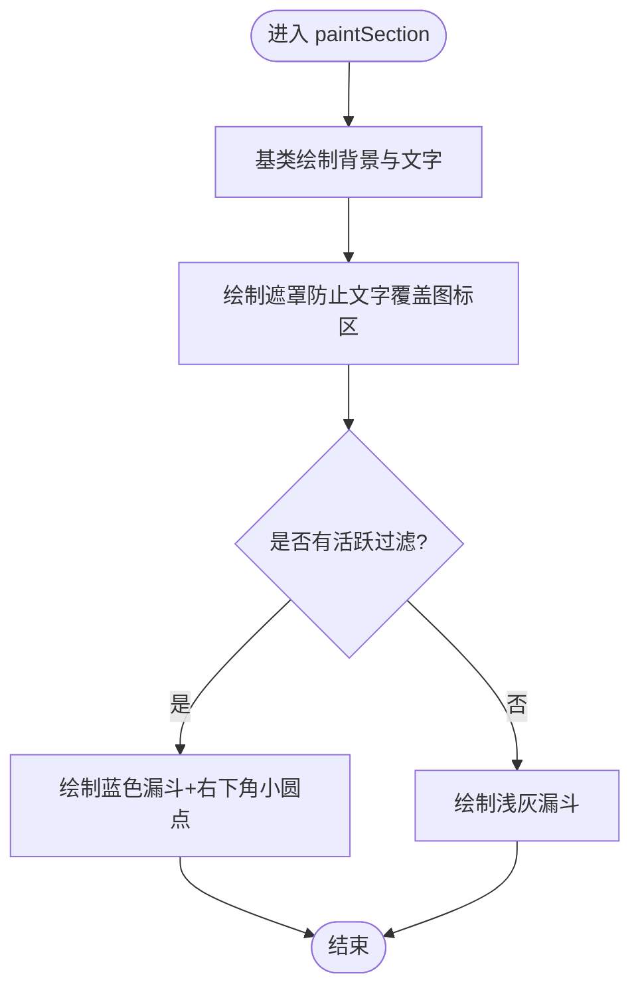
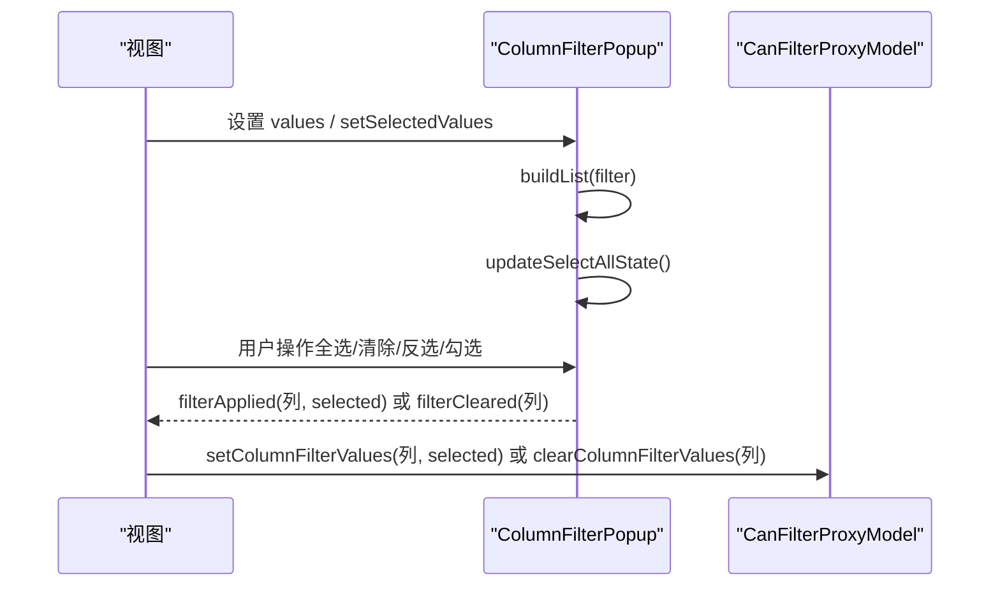
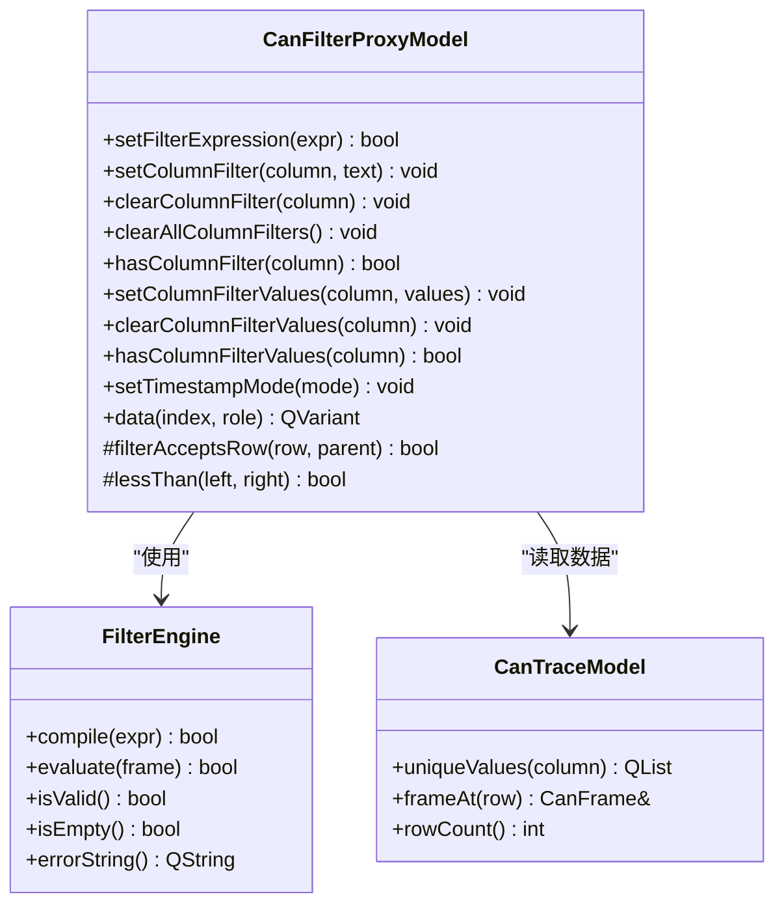
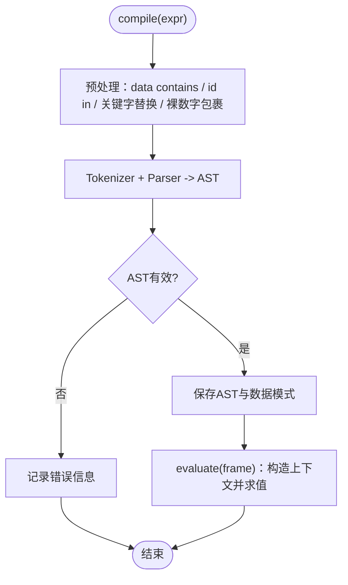
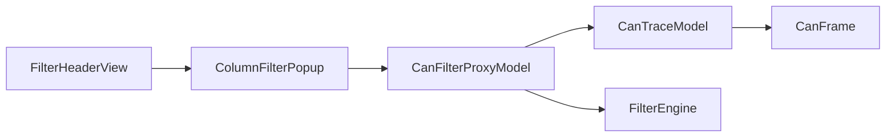

# Excel风格列过滤系统

<cite>
**本文引用的文件**
- [columnfilterpopup.h](file://src/ui/columnfilterpopup.h)
- [columnfilterpopup.cpp](file://src/ui/columnfilterpopup.cpp)
- [canfilterproxymodel.h](file://src/models/canfilterproxymodel.h)
- [canfilterproxymodel.cpp](file://src/models/canfilterproxymodel.cpp)
- [filterheaderview.h](file://src/ui/filterheaderview.h)
- [filterheaderview.cpp](file://src/ui/filterheaderview.cpp)
- [cantracemodel.h](file://src/models/cantracemodel.h)
- [cantracemodel.cpp](file://src/models/cantracemodel.cpp)
- [filter_engine.h](file://src/core/filter_engine.h)
- [filter_engine.cpp](file://src/core/filter_engine.cpp)
- [canframe.h](file://src/core/canframe.h)
- [traceview.cpp](file://src/ui/traceview.cpp)
</cite>

## 目录
1. [简介](#简介)
2. [项目结构](#项目结构)
3. [核心组件](#核心组件)
4. [架构总览](#架构总览)
5. [详细组件分析](#详细组件分析)
6. [依赖关系分析](#依赖关系分析)
7. [性能考量](#性能考量)
8. [故障排查指南](#故障排查指南)
9. [结论](#结论)

## 简介
本系统实现了一个“Excel风格”的列过滤能力，用于在CAN报文追踪视图中对数据进行交互式筛选。用户可通过表头漏斗图标打开弹出面板，基于值集合进行多选、搜索、全选/反选等操作；同时支持按列文本包含匹配与主表达式过滤（Wireshark风格）。该方案将UI交互、模型层过滤与底层数据源解耦，具备高性能、可扩展和易用的特点。

## 项目结构
围绕“Excel风格列过滤”，关键代码分布在以下模块：
- UI交互层：表头自定义绘制与漏斗图标点击、弹出式复选框面板
- 模型层：代理模型负责行级过滤与排序、时间戳显示模式、值集过滤
- 数据层：CAN帧模型提供数据与唯一值统计
- 引擎层：轻量表达式解析与求值器，用于主过滤表达式

图表来源
- [filterheaderview.cpp:97-229](file://src/ui/filterheaderview.cpp#L97-L229)
- [columnfilterpopup.cpp:18-214](file://src/ui/columnfilterpopup.cpp#L18-L214)
- [canfilterproxymodel.cpp:12-219](file://src/models/canfilterproxymodel.cpp#L12-L219)
- [cantracemodel.cpp:36-186](file://src/models/cantracemodel.cpp#L36-L186)
- [filter_engine.cpp:734-791](file://src/core/filter_engine.cpp#L734-L791)
- [canframe.h:14-51](file://src/core/canframe.h#L14-L51)

章节来源
- [filterheaderview.h:8-69](file://src/ui/filterheaderview.h#L8-L69)
- [columnfilterpopup.h:15-80](file://src/ui/columnfilterpopup.h#L15-L80)
- [canfilterproxymodel.h:10-131](file://src/models/canfilterproxymodel.h#L10-L131)
- [cantracemodel.h:16-201](file://src/models/cantracemodel.h#L16-L201)
- [filter_engine.h:9-56](file://src/core/filter_engine.h#L9-L56)
- [canframe.h:8-51](file://src/core/canframe.h#L8-L51)

## 核心组件
- FilterHeaderView：自定义表头，绘制排序箭头与漏斗图标，处理鼠标事件以触发列过滤弹窗
- ColumnFilterPopup：Excel风格的值集筛选面板，支持搜索、全选/清除/反选、确定/清除筛选
- CanFilterProxyModel：QSortFilterProxyModel扩展，实现主表达式过滤、按列文本过滤、按列值集过滤、排序与时间戳显示模式
- CanTraceModel：高性能数据模型，提供帧数据、可见行缓存、唯一值统计等
- FilterEngine：自研递归下降解析器，编译并求值过滤表达式

章节来源
- [filterheaderview.cpp:13-284](file://src/ui/filterheaderview.cpp#L13-L284)
- [columnfilterpopup.cpp:18-214](file://src/ui/columnfilterpopup.cpp#L18-L214)
- [canfilterproxymodel.cpp:7-394](file://src/models/canfilterproxymodel.cpp#L7-L394)
- [cantracemodel.cpp:5-200](file://src/models/cantracemodel.cpp#L5-L200)
- [filter_engine.cpp:734-791](file://src/core/filter_engine.cpp#L734-L791)

## 架构总览
下图展示了从用户操作到数据过滤的完整调用链：

图表来源
- [filterheaderview.cpp:274-284](file://src/ui/filterheaderview.cpp#L274-L284)
- [columnfilterpopup.cpp:201-214](file://src/ui/columnfilterpopup.cpp#L201-L214)
- [canfilterproxymodel.cpp:154-219](file://src/models/canfilterproxymodel.cpp#L154-L219)
- [cantracemodel.cpp:414-460](file://src/models/cantracemodel.cpp#L414-L460)
- [filter_engine.cpp:772-791](file://src/core/filter_engine.cpp#L772-L791)

## 详细组件分析

### FilterHeaderView（表头视图）
- 功能要点
  - 禁用Qt内置排序指示器，自行绘制排序三角形与漏斗图标，避免重叠
  - 计算漏斗图标区域，检测鼠标是否命中漏斗，命中时阻止默认排序行为并触发信号
  - 根据代理模型状态高亮激活的过滤列
- 关键流程
  - paintSection：绘制背景、分隔线、遮罩、排序三角、漏斗图标（含激活态小圆点）
  - mousePressEvent：判断是否在漏斗区域，若是则发射 filterClicked 信号

图表来源
- [filterheaderview.cpp:97-229](file://src/ui/filterheaderview.cpp#L97-L229)

章节来源
- [filterheaderview.h:8-69](file://src/ui/filterheaderview.h#L8-L69)
- [filterheaderview.cpp:13-284](file://src/ui/filterheaderview.cpp#L13-L284)

### ColumnFilterPopup（Excel风格弹出面板）
- 功能要点
  - 提供搜索框、全选/清除/反选按钮、可勾选的值列表（显示计数）、确定/清除筛选按钮
  - 维护原始值列表与当前选中值集合，支持恢复已有筛选状态
  - 通过信号通知上层应用已应用的筛选或已清除的筛选
- 交互流程
  - 构建列表：根据搜索词过滤显示项，为每项设置勾选状态
  - 全选/清除/反选：仅作用于当前可见项（受搜索影响）
  - 确定：发射 filterApplied(列, 选中值集合)
  - 清除筛选：将所有值置为选中并发射 filterCleared(列)

图表来源
- [columnfilterpopup.cpp:81-214](file://src/ui/columnfilterpopup.cpp#L81-L214)
- [canfilterproxymodel.cpp:154-168](file://src/models/canfilterproxymodel.cpp#L154-L168)

章节来源
- [columnfilterpopup.h:15-80](file://src/ui/columnfilterpopup.h#L15-L80)
- [columnfilterpopup.cpp:18-214](file://src/ui/columnfilterpopup.cpp#L18-L214)

### CanFilterProxyModel（代理过滤模型）
- 功能要点
  - 主过滤表达式：使用 FilterEngine 编译并求值
  - 按列文本过滤：支持比较运算符（如 >、<、!=）与包含匹配
  - 值集过滤（Excel风格）：基于显示文本的精确匹配
  - 排序：针对各列正确比较（时间、ID、DLC、Flags等）
  - 时间戳显示模式：绝对时间、相对捕获时间、相对显示时间、日期时间、Unix秒
- 过滤逻辑
  - filterAcceptsRow：先评估主表达式，再遍历列文本过滤与值集过滤
  - matchColumnFilterValues：获取显示文本并与选中集合匹配
  - lessThan：按列语义排序（例如ColDelta使用相邻帧时间差）

图表来源
- [canfilterproxymodel.h:17-131](file://src/models/canfilterproxymodel.h#L17-L131)
- [canfilterproxymodel.cpp:12-394](file://src/models/canfilterproxymodel.cpp#L12-L394)
- [filter_engine.h:29-56](file://src/core/filter_engine.h#L29-L56)
- [cantracemodel.h:24-201](file://src/models/cantracemodel.h#L24-L201)

章节来源
- [canfilterproxymodel.h:10-131](file://src/models/canfilterproxymodel.h#L10-L131)
- [canfilterproxymodel.cpp:7-394](file://src/models/canfilterproxymodel.cpp#L7-L394)

### CanTraceModel（数据模型）
- 功能要点
  - 环形缓冲区存储帧，支持批量追加与刷新率控制
  - 延迟格式化与可见行缓存，减少重复计算
  - uniqueValues：收集指定列的唯一值及其出现次数，供Excel风格面板展示
  - 着色规则与标记：支持行级别颜色与标签
- 关键方法
  - data：DisplayRole下按列格式化，命中缓存直接返回
  - uniqueValues：遍历环形缓冲统计列值频次

章节来源
- [cantracemodel.h:16-201](file://src/models/cantracemodel.h#L16-L201)
- [cantracemodel.cpp:5-200](file://src/models/cantracemodel.cpp#L5-L200)

### FilterEngine（表达式引擎）
- 功能要点
  - 预处理器：提取 data contains、id in、关键字替换、裸十六进制包裹
  - Tokenizer：词法分析
  - Parser：递归下降语法分析，生成AST
  - 求值器：根据变量上下文（id、dlc、ch、time、fd、ext、rx、tx、std）与数据模式求值
- 支持的表达式特性
  - 变量、逻辑运算（and/or/not）、比较（==、!=、>、<、>=、<=）
  - 裸十六进制自动转为 id==N
  - id in v1,v2,... 展开为 or 链
  - data contains 字节序列匹配

图表来源
- [filter_engine.cpp:734-791](file://src/core/filter_engine.cpp#L734-L791)
- [filter_engine.cpp:91-276](file://src/core/filter_engine.cpp#L91-L276)
- [filter_engine.cpp:412-635](file://src/core/filter_engine.cpp#L412-L635)
- [filter_engine.cpp:648-705](file://src/core/filter_engine.cpp#L648-L705)

章节来源
- [filter_engine.h:9-56](file://src/core/filter_engine.h#L9-L56)
- [filter_engine.cpp:1-800](file://src/core/filter_engine.cpp#L1-L800)

### 集成点：TraceView中的弹出面板绑定
- 当用户点击表头漏斗时，TraceView会：
  - 从数据模型获取该列的唯一值及计数
  - 创建 ColumnFilterPopup 并设置值与已有筛选状态
  - 连接信号：filterApplied 时调用代理模型的 setColumnFilterValues 或 clearColumnFilterValues
  - 定位并显示弹出面板于表头下方

章节来源
- [traceview.cpp:680-722](file://src/ui/traceview.cpp#L680-L722)

## 依赖关系分析
- FilterHeaderView 依赖 CanFilterProxyModel 查询列过滤状态
- ColumnFilterPopup 独立于模型，通过信号与上层通信
- CanFilterProxyModel 依赖 CanTraceModel 获取数据与唯一值，依赖 FilterEngine 执行主表达式
- CanTraceModel 依赖 CanFrame 数据结构
- TraceView 作为控制器协调 UI 与模型

图表来源
- [filterheaderview.cpp:26-34](file://src/ui/filterheaderview.cpp#L26-L34)
- [columnfilterpopup.cpp:201-214](file://src/ui/columnfilterpopup.cpp#L201-L214)
- [canfilterproxymodel.cpp:12-219](file://src/models/canfilterproxymodel.cpp#L12-L219)
- [cantracemodel.cpp:36-186](file://src/models/cantracemodel.cpp#L36-L186)
- [canframe.h:14-51](file://src/core/canframe.h#L14-L51)

章节来源
- [filterheaderview.cpp:13-284](file://src/ui/filterheaderview.cpp#L13-L284)
- [columnfilterpopup.cpp:18-214](file://src/ui/columnfilterpopup.cpp#L18-L214)
- [canfilterproxymodel.cpp:7-394](file://src/models/canfilterproxymodel.cpp#L7-L394)
- [cantracemodel.cpp:5-200](file://src/models/cantracemodel.cpp#L5-L200)
- [canframe.h:8-51](file://src/core/canframe.h#L8-L51)

## 性能考量
- 延迟格式化与可见行缓存：CanTraceModel 仅在可见范围内缓存格式化结果，减少CPU开销
- 批量更新与刷新率控制：通过定时器合并帧提交，降低UI重绘频率
- 高效过滤：代理模型在 filterAcceptsRow 中短路求值，避免不必要的计算
- SinceDisplay模式优化：使用 filterAcceptsRow 直接扫描源模型，避免 mapFromSource 的O(log n)映射开销
- 值集过滤：基于显示文本的精确匹配，查找复杂度取决于集合大小（QSet近似O(1)）

[本节为通用性能指导，不直接分析具体文件]

## 故障排查指南
- 表达式编译失败
  - 检查语法是否正确（括号匹配、变量名、运算符）
  - 查看 FilterEngine::errorString 获取错误信息
  - 参考日志输出定位问题
- 过滤不生效
  - 确认主表达式是否为空且有效
  - 检查列文本过滤与值集过滤是否冲突
  - 验证代理模型是否收到 filterApplied 信号并调用相应方法
- 弹出面板异常
  - 确保唯一值统计正确（uniqueValues）
  - 检查搜索框过滤逻辑与全选/反选状态同步
- 时间戳显示不正确
  - 切换时间戳模式后确认 dataChanged 信号已触发
  - SinceDisplay模式下重新计算增量缓存

章节来源
- [filter_engine.cpp:734-791](file://src/core/filter_engine.cpp#L734-L791)
- [canfilterproxymodel.cpp:268-316](file://src/models/canfilterproxymodel.cpp#L268-L316)
- [columnfilterpopup.cpp:113-214](file://src/ui/columnfilterpopup.cpp#L113-L214)

## 结论
本系统通过分层设计实现了灵活高效的Excel风格列过滤能力：
- UI层提供直观的交互入口与可视化反馈
- 模型层统一处理多种过滤策略与排序、时间显示模式
- 引擎层提供强大的表达式求值能力
整体架构清晰、扩展性强，适合在高吞吐场景下稳定运行。建议在实际使用中结合业务需求定制列过滤规则与表达式语法，以获得最佳用户体验与性能表现。