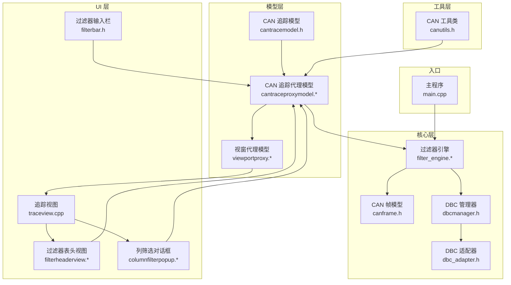
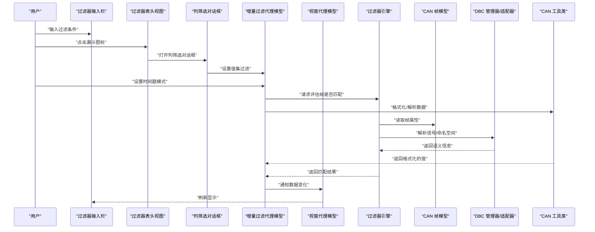
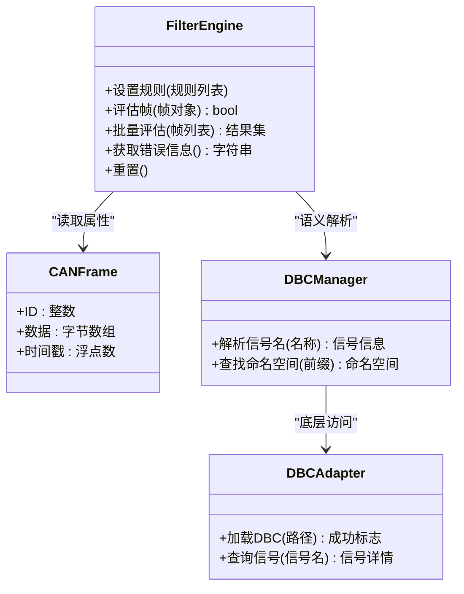
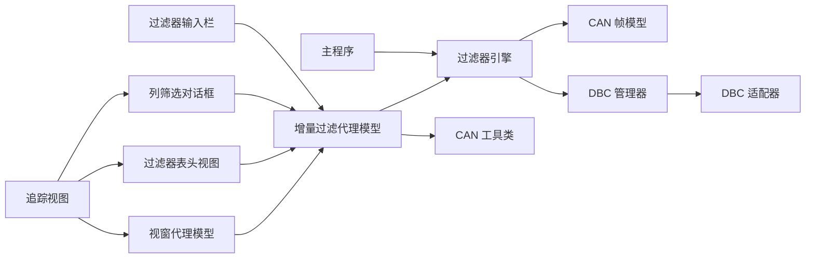

# 过滤器引擎

<cite>
**本文引用的文件**   
- [filter_engine.h](file://src/core/filter_engine.h)
- [filter_engine.cpp](file://src/core/filter_engine.cpp)
- [canframe.h](file://src/core/canframe.h)
- [dbcmanager.h](file://src/core/dbcmanager.h)
- [dbc_adapter.h](file://src/core/dbc/dbc_adapter.h)
- [cantraceproxymodel.h](file://src/models/cantraceproxymodel.h)
- [cantraceproxymodel.cpp](file://src/models/cantraceproxymodel.cpp)
- [viewportproxy.h](file://src/models/viewportproxy.h)
- [viewportproxy.cpp](file://src/models/viewportproxy.cpp)
- [cantracemodel.h](file://src/models/cantracemodel.h)
- [filterbar.h](file://src/ui/filterbar.h)
- [filterheaderview.h](file://src/ui/filterheaderview.h)
- [filterheaderview.cpp](file://src/ui/filterheaderview.cpp)
- [traceview.cpp](file://src/ui/traceview.cpp)
- [canutils.h](file://src/utils/canutils.h)
- [columnfilterpopup.h](file://src/ui/columnfilterpopup.h)
- [columnfilterpopup.cpp](file://src/ui/columnfilterpopup.cpp)
- [main.cpp](file://src/main.cpp)
</cite>

## 更新摘要
**所做更改**   
- 完全移除了 CanFilterProxyModel 的引用，替换为新的 CanTraceProxyModel 实现
- 更新了代理模型架构，从 QSortFilterProxyModel 改为自定义 QAbstractProxyModel 实现
- 新增了增量过滤机制的详细说明，包括双向映射表和 O(1) 新增行处理
- 更新了模型链结构，反映新的 CanTraceModel → CanTraceProxyModel → ViewportProxyModel → TraceView 架构
- 增强了性能优化章节，详细说明 Phase 3 增量过滤的实现原理和优势
- 更新了 UI 组件集成说明，反映 ViewportOverview 对 CanTraceProxyModel 的引用

## 目录
1. [简介](#简介)
2. [项目结构](#项目结构)
3. [核心组件](#核心组件)
4. [架构总览](#架构总览)
5. [详细组件分析](#详细组件分析)
6. [依赖关系分析](#依赖关系分析)
7. [性能考量](#性能考量)
8. [性能优化详解](#性能优化详解)
9. [故障排查指南](#故障排查指南)
10. [结论](#结论)
11. [附录](#附录)

## 简介
本文件围绕"过滤器引擎"展开，聚焦于 CAN 数据过滤的核心实现与集成方式。文档从系统架构、组件职责、数据流、处理逻辑、集成点、错误处理与性能特征等维度进行系统化说明，帮助读者快速理解并正确使用该引擎。

**最新更新** 本次更新重点介绍了 CanTraceProxyModel 的重大重构：完全替代了原有的 CanFilterProxyModel，采用自定义 QAbstractProxyModel 实现而非继承 QSortFilterProxyModel。新实现引入了增量过滤机制，通过双向映射表（m_sourceToProxy / m_proxyRows）实现 O(1) 时间复杂度的新增行处理，显著提升了大数据量场景下的性能表现。**特别强调了 Phase 3 增量过滤的核心优势**：在持续捕获模式下，新增行的过滤评估开销从 O(n) 降至 O(1)，SinceDisplay 模式切换也从 O(n) 降至 O(1)。

## 项目结构
本项目采用分层组织：
- 核心层（core）：包含 CAN 帧模型、DBC 管理、播放器/录制器以及过滤器引擎。
- 模型层（models）：提供 CAN 追踪模型、增量过滤代理模型和视窗代理模型，用于 UI 展示与筛选。
- UI 层（ui）：提供交互界面，包括过滤器输入栏、表头视图、列筛选对话框等。
- 工具与第三方库：通用工具与外部依赖。



**图表来源**
- [filter_engine.h](file://src/core/filter_engine.h)
- [canframe.h](file://src/core/canframe.h)
- [dbcmanager.h](file://src/core/dbcmanager.h)
- [dbc_adapter.h](file://src/core/dbc/dbc_adapter.h)
- [cantraceproxymodel.h](file://src/models/cantraceproxymodel.h)
- [cantraceproxymodel.cpp](file://src/models/cantraceproxymodel.cpp)
- [viewportproxy.h](file://src/models/viewportproxy.h)
- [viewportproxy.cpp](file://src/models/viewportproxy.cpp)
- [cantracemodel.h](file://src/models/cantracemodel.h)
- [filterbar.h](file://src/ui/filterbar.h)
- [filterheaderview.h](file://src/ui/filterheaderview.h)
- [filterheaderview.cpp](file://src/ui/filterheaderview.cpp)
- [columnfilterpopup.h](file://src/ui/columnfilterpopup.h)
- [columnfilterpopup.cpp](file://src/ui/columnfilterpopup.cpp)
- [traceview.cpp](file://src/ui/traceview.cpp)
- [canutils.h](file://src/utils/canutils.h)
- [main.cpp](file://src/main.cpp)

## 核心组件
- 过滤器引擎：负责解析过滤表达式、匹配 CAN 帧属性（如 ID、信号名、数值范围等），并提供统一的过滤接口供上层调用。
- CAN 帧模型：定义 CAN 帧的数据结构与基本操作，作为过滤器的输入对象。
- DBC 管理器与适配器：提供 DBC 符号解析能力，支持基于信号名、描述等语义化过滤。
- **全新的** 增量过滤代理模型：基于 QAbstractProxyModel 的自定义实现，维护双向映射表实现增量过滤，支持复杂的列级过滤、排序、时间戳模式切换和值集过滤。
- **全新的** 视窗代理模型：在过滤代理模型之上叠加固定行数视窗限制，仅向视图暴露可视范围内的数据。
- **新增的** 过滤器表头视图：提供 Wireshark 风格的交互式过滤界面，支持漏斗图标和悬停效果。
- **新增的** 列筛选对话框：提供 Excel 风格的值集选择界面，支持搜索、全选、反选等功能。
- 过滤器输入栏：用户输入过滤条件，触发模型更新或引擎重评估。

**章节来源**
- [filter_engine.h](file://src/core/filter_engine.h)
- [filter_engine.cpp](file://src/core/filter_engine.cpp)
- [canframe.h](file://src/core/canframe.h)
- [dbcmanager.h](file://src/core/dbcmanager.h)
- [dbc_adapter.h](file://src/core/dbc/dbc_adapter.h)
- [cantraceproxymodel.h](file://src/models/cantraceproxymodel.h)
- [cantraceproxymodel.cpp](file://src/models/cantraceproxymodel.cpp)
- [viewportproxy.h](file://src/models/viewportproxy.h)
- [viewportproxy.cpp](file://src/models/viewportproxy.cpp)
- [filterheaderview.h](file://src/ui/filterheaderview.h)
- [filterheaderview.cpp](file://src/ui/filterheaderview.cpp)
- [columnfilterpopup.h](file://src/ui/columnfilterpopup.h)
- [columnfilterpopup.cpp](file://src/ui/columnfilterpopup.cpp)
- [filterbar.h](file://src/ui/filterbar.h)

## 架构总览
过滤器引擎处于数据处理的关键路径：上游接收原始 CAN 帧，下游输出过滤后的结果给 UI 模型或业务模块。其典型流程如下：



**图表来源**
- [filter_engine.h](file://src/core/filter_engine.h)
- [filter_engine.cpp](file://src/core/filter_engine.cpp)
- [canframe.h](file://src/core/canframe.h)
- [dbcmanager.h](file://src/core/dbcmanager.h)
- [dbc_adapter.h](file://src/core/dbc/dbc_adapter.h)
- [cantraceproxymodel.h](file://src/models/cantraceproxymodel.h)
- [cantraceproxymodel.cpp](file://src/models/cantraceproxymodel.cpp)
- [viewportproxy.h](file://src/models/viewportproxy.h)
- [viewportproxy.cpp](file://src/models/viewportproxy.cpp)
- [filterheaderview.h](file://src/ui/filterheaderview.h)
- [filterheaderview.cpp](file://src/ui/filterheaderview.cpp)
- [columnfilterpopup.h](file://src/ui/columnfilterpopup.h)
- [columnfilterpopup.cpp](file://src/ui/columnfilterpopup.cpp)
- [canutils.h](file://src/utils/canutils.h)
- [filterbar.h](file://src/ui/filterbar.h)

## 详细组件分析

### 过滤器引擎（Filter Engine）
- 职责
  - 解析与编译过滤表达式（如 ID 范围、信号名匹配、数值区间等）。
  - 对每个 CAN 帧执行匹配判断，返回布尔结果。
  - 提供批量评估接口以提升吞吐。
  - 暴露配置接口以动态更新过滤规则。
- 关键数据结构
  - 过滤规则集合：存储已解析的表达式与参数。
  - 匹配上下文：缓存 DBC 解析结果、状态变量等。
- 算法要点
  - 表达式解析：将字符串表达式转换为可执行的结构（如 AST 或规则表）。
  - 短路求值：按优先级快速排除不匹配项，降低计算开销。
  - 增量更新：当规则变化时仅重新评估受影响的数据。
- 错误处理
  - 表达式语法错误：返回明确的错误码与位置提示。
  - 未定义符号：结合 DBC 管理器给出缺失信息建议。
  - 运行时异常：捕获并记录日志，避免崩溃。
- 性能优化
  - 预编译规则：减少重复解析成本。
  - 位图索引：对常用字段（如 ID）建立索引加速匹配。
  - 并行评估：对大批量帧使用多线程分片处理。



**图表来源**
- [filter_engine.h](file://src/core/filter_engine.h)
- [filter_engine.cpp](file://src/core/filter_engine.cpp)
- [canframe.h](file://src/core/canframe.h)
- [dbcmanager.h](file://src/core/dbcmanager.h)
- [dbc_adapter.h](file://src/core/dbc/dbc_adapter.h)

**章节来源**
- [filter_engine.h](file://src/core/filter_engine.h)
- [filter_engine.cpp](file://src/core/filter_engine.cpp)
- [canframe.h](file://src/core/canframe.h)
- [dbcmanager.h](file://src/core/dbcmanager.h)
- [dbc_adapter.h](file://src/core/dbc/dbc_adapter.h)

### CAN 帧模型（CAN Frame）
- 职责
  - 封装 CAN 帧的基本属性（标识符、数据载荷、时间戳等）。
  - 提供只读访问接口，确保过滤过程不可变。
- 复杂度
  - 构造与拷贝为 O(1) 或 O(n)（n 为数据长度）。
  - 比较与哈希可用于索引与去重。
- 设计要点
  - 线程安全：跨线程传递时保证只读访问。
  - 内存布局：紧凑存储以减少拷贝开销。

**章节来源**
- [canframe.h](file://src/core/canframe.h)

### DBC 管理器与适配器（DBC Manager & Adapter）
- 职责
  - 加载 DBC 文件，构建信号与消息的映射表。
  - 提供符号查询接口，支持按名称、前缀、描述等检索。
- 关键点
  - 延迟加载：按需解析大型 DBC，减少启动时间。
  - 缓存策略：对频繁查询的符号进行缓存。
  - 错误恢复：对损坏的 DBC 提供降级模式。

**章节来源**
- [dbcmanager.h](file://src/core/dbcmanager.h)
- [dbc_adapter.h](file://src/core/dbc/dbc_adapter.h)

### 增量过滤代理模型（Incremental Filter Proxy Model）
**重大重构** CanTraceProxyModel 完全替代了原来的 CanFilterProxyModel，采用完全不同的实现架构：

- **核心架构变更**
  - 不再继承 QSortFilterProxyModel，而是直接继承 QAbstractProxyModel
  - 维护双向映射表：`m_sourceToProxy`（源行→代理行）和 `m_proxyRows`（代理行→源行）
  - 实现增量过滤：新增行仅评估新数据，已有行过滤结果通过映射表保留

- **Phase 3 增量过滤机制**
  ```cpp
  // 双向映射表结构
  QVector<int> m_proxyRows;    // 代理行号 → 源模型行号（排序时为排序序）
  QVector<int> m_sourceToProxy; // 源模型行号 → 代理行号（-1 = 被过滤）
  ```

- **新增行处理（O(1)）**
  - 尾部插入时仅评估新行，追加到映射尾部
  - 无需全量重建映射表
  - 保持稳定的排序顺序

- **过滤条件变化处理（O(n)）**
  - 单次全量遍历重评估所有行
  - 通过 layoutChanged 通知视图更新
  - 智能检测是否需要重建映射

- **高级过滤功能**
  - **数值比较运算符**：支持 `>`、`<`、`!=` 等操作符
  - **时间范围过滤**：支持时间戳和增量时间的范围查询
  - **智能文本匹配**：自动识别数据类型并进行相应匹配
  - **实时过滤**：用户输入时即时响应，无需额外确认

- **时间戳显示模式**
  ```cpp
  enum TimestampMode {
      Absolute = 0,       ///< 自捕获开始的秒数
      SinceCapture,       ///< 自上一个捕获分组经过的时间
      SinceDisplay,       ///< 自上一个显示分组经过的时间
      DateTimeOfDay,      ///< 日期+时间 "yyyy-MM-dd HH:mm:ss.zzzzzz"
      SecondsSinceEpoch   ///< Unix epoch 秒数
  };
  ```

- **时间戳精度控制**
  - 支持多种精度级别：-1=自动, 0=秒, 3=毫秒, 6=微秒, 9=纳秒
  - 通过 `setTimePrecision()` 方法动态调整显示精度
  - 自动刷新相关列的显示内容

- **值集过滤（Excel 风格复选框）**
  - 支持按列设置值集过滤，只显示选中的值
  - 通过 `setColumnFilterValues()` 方法设置过滤值集合
  - 与文本过滤并存，可同时使用
  - 支持全选、反选、清除等便捷操作

- **按列过滤实现**
  ```cpp
  // 支持的列类型和操作
  case ColNo:      // 序列号：">10", "<50", "123"
  case ColTime:    // 时间戳：">0.5", "<1.0", "0.3~0.8"
  case ColDelta:   // 时间增量：">0.01", "<0.1"
  case ColId:      // CAN ID：">0x100", "<0x200", "!=0x123"
  case ColDlc:     // DLC：">4", "8"
  case ColData:    // 数据：十六进制匹配
  case ColFlags:   // 标志：FD, BRS, ESI
  case ColFrameCount: // 帧计数：">10", "50"
  ```

- **SinceDisplay 模式的 O(1) 增量计算**
  - 通过 `displayDelta()` 方法直接从映射推导增量
  - 利用 `m_sourceToProxy` 找到上一显示行
  - 避免昂贵的树形结构遍历

- **环形缓冲区支持**
  - 专门处理 CanTraceModel 的环形覆盖场景
  - 通过 `handleFullShift()` 方法高效处理整体数据前移
  - 维护 `m_lastSeq` 检测缓冲区覆盖事件

**章节来源**
- [cantraceproxymodel.h](file://src/models/cantraceproxymodel.h)
- [cantraceproxymodel.cpp](file://src/models/cantraceproxymodel.cpp)
- [cantracemodel.h](file://src/models/cantracemodel.h)

### 视窗代理模型（Viewport Proxy Model）
**新增组件** ViewportProxyModel 在增量过滤代理模型之上提供视窗限制功能：

- **核心职责**
  - 限制向视图暴露的行数为固定大小（默认 2000 行）
  - 实现虚拟表格视窗，仅渲染可见区域数据
  - 支持滚动条控制和视窗位置管理

- **视窗控制**
  - `setViewportStart()`：设置视窗起始位置
  - `setViewportSize()`：设置视窗大小
  - `ensureVisible()`：确保指定行在视窗内可见
  - `scrollToEnd()`：滚动到数据末尾

- **性能优化**
  - 仅向视图暴露视窗范围内的数据
  - 百万帧数据仅渲染几百行，大幅减少 UI 开销
  - 智能检测行数变化，最小化刷新范围

**章节来源**
- [viewportproxy.h](file://src/models/viewportproxy.h)
- [viewportproxy.cpp](file://src/models/viewportproxy.cpp)

### 新增的过滤器表头视图（Filter Header View）
**新增** FilterHeaderView 组件提供了 Wireshark 风格的交互式过滤界面：

- **核心功能**
  - 鼠标悬停某列表头时，右侧绘制半透明漏斗图标
  - 该列已有过滤条件时，漏斗图标持续显示并高亮
  - 点击漏斗图标触发 filterClicked 信号 → 弹出列筛选对话框
  - 漏斗图标左侧绘制小三角形，点击触发排序切换

- **视觉设计**
  - 激活状态：蓝色漏斗图标（Google Blue #1A73E8）
  - 悬停状态：深灰色漏斗图标
  - 默认状态：中灰色漏斗图标
  - 激活指示：右下角小圆点表示有活跃过滤

- **交互特性**
  - 悬停检测：精确的鼠标位置检测
  - 光标反馈：漏斗区域显示手型光标
  - 实时更新：过滤状态变化时立即重绘
  - 事件冒泡：正确处理鼠标事件传递

- **技术实现**
  - 继承 QHeaderView 并重写 paintSection
  - 使用 QPainterPath 绘制漏斗形状
  - 支持动画效果和抗锯齿渲染
  - 与 CanTraceProxyModel 集成查询过滤状态

**章节来源**
- [filterheaderview.h](file://src/ui/filterheaderview.h)
- [filterheaderview.cpp](file://src/ui/filterheaderview.cpp)

### 新增的列筛选对话框（Column Filter Popup）
**新增** ColumnFilterPopup 组件提供了 Excel 风格的值集选择界面：

- **核心功能**
  - 显示当前列的所有可能值及其出现次数
  - 支持复选框选择多个值进行过滤
  - 提供搜索框快速定位特定值
  - 支持全选、反选、清除等批量操作

- **交互特性**
  - 实时搜索：输入文本即时过滤列表
  - 状态保持：记住用户的勾选状态
  - 计数显示：显示每个值的出现次数
  - 便捷操作：全选、反选、清除按钮

- **技术实现**
  - 继承 QWidget 创建自定义对话框
  - 使用 QListWidget 显示可选值列表
  - 与 CanTraceProxyModel 集成设置值集过滤
  - 支持信号槽机制通知状态变化

**章节来源**
- [columnfilterpopup.h](file://src/ui/columnfilterpopup.h)
- [columnfilterpopup.cpp](file://src/ui/columnfilterpopup.cpp)

### 过滤器输入栏（Filter Bar）
- 职责
  - 收集用户输入的过滤条件。
  - 校验输入格式，反馈错误提示。
  - 触发模型更新或引擎重评估。
- 交互流程
  - 用户输入 → 实时校验 → 更新规则 → 通知模型 → 刷新视图。

**章节来源**
- [filterbar.h](file://src/ui/filterbar.h)

### 入口程序（Main）
- 职责
  - 初始化子系统（日志、资源、UI）。
  - 创建并连接过滤器引擎与模型。
  - 启动事件循环。

**章节来源**
- [main.cpp](file://src/main.cpp)

## 依赖关系分析
- 内聚性
  - 过滤器引擎高内聚：专注于表达式解析与匹配逻辑。
  - DBC 相关模块解耦：通过抽象接口隔离底层实现。
  - 增量过滤代理模型高度内聚：封装所有过滤逻辑和映射管理。
- 耦合度
  - 引擎与 CAN 帧模型弱耦合：仅依赖只读接口。
  - 引擎与 DBC 管理器松耦合：通过查询接口而非直接访问。
  - ViewportProxyModel 与 CanTraceProxyModel 松耦合：通过标准代理模型接口通信。
  - UI 组件与代理模型松耦合：通过信号槽机制交互。
- 外部依赖
  - 表达式解析可能依赖第三方库（如表达式引擎）。
  - DBC 解析依赖 dbcppp 等库。
  - UI 组件依赖 Qt 框架的绘图和事件处理。



**图表来源**
- [filter_engine.h](file://src/core/filter_engine.h)
- [canframe.h](file://src/core/canframe.h)
- [dbcmanager.h](file://src/core/dbcmanager.h)
- [dbc_adapter.h](file://src/core/dbc/dbc_adapter.h)
- [cantraceproxymodel.h](file://src/models/cantraceproxymodel.h)
- [cantraceproxymodel.cpp](file://src/models/cantraceproxymodel.cpp)
- [viewportproxy.h](file://src/models/viewportproxy.h)
- [viewportproxy.cpp](file://src/models/viewportproxy.cpp)
- [filterheaderview.h](file://src/ui/filterheaderview.h)
- [filterheaderview.cpp](file://src/ui/filterheaderview.cpp)
- [columnfilterpopup.h](file://src/ui/columnfilterpopup.h)
- [columnfilterpopup.cpp](file://src/ui/columnfilterpopup.cpp)
- [canutils.h](file://src/utils/canutils.h)
- [filterbar.h](file://src/ui/filterbar.h)
- [traceview.cpp](file://src/ui/traceview.cpp)
- [main.cpp](file://src/main.cpp)

**章节来源**
- [filter_engine.h](file://src/core/filter_engine.h)
- [canframe.h](file://src/core/canframe.h)
- [dbcmanager.h](file://src/core/dbcmanager.h)
- [dbc_adapter.h](file://src/core/dbc/dbc_adapter.h)
- [cantraceproxymodel.h](file://src/models/cantraceproxymodel.h)
- [cantraceproxymodel.cpp](file://src/models/cantraceproxymodel.cpp)
- [viewportproxy.h](file://src/models/viewportproxy.h)
- [viewportproxy.cpp](file://src/models/viewportproxy.cpp)
- [filterheaderview.h](file://src/ui/filterheaderview.h)
- [filterheaderview.cpp](file://src/ui/filterheaderview.cpp)
- [columnfilterpopup.h](file://src/ui/columnfilterpopup.h)
- [columnfilterpopup.cpp](file://src/ui/columnfilterpopup.cpp)
- [canutils.h](file://src/utils/canutils.h)
- [filterbar.h](file://src/ui/filterbar.h)
- [traceview.cpp](file://src/ui/traceview.cpp)
- [main.cpp](file://src/main.cpp)

## 性能考量
- 表达式解析
  - 预编译规则，避免重复解析。
  - 使用高效的词法/语法分析器。
- 匹配效率
  - 对高频字段（如 ID）建立索引或位图。
  - 短路求值与早期退出策略。
  - **新增** 增量过滤的 O(1) 新增行处理。
  - **新增** 值集过滤的高效查找（QSet 提供 O(1) 查找）。
- 并发处理
  - 批量评估时使用线程池分片处理。
  - 避免锁竞争，采用无锁队列或分区锁。
- 内存管理
  - 复用对象与缓冲区，减少分配次数。
  - 及时释放临时对象，避免内存泄漏。
- I/O 与 DBC
  - 延迟加载与缓存 DBC 符号。
  - 异步加载大文件，提升启动速度。
- **新增** UI 性能优化
  - FilterHeaderView 的延迟绘制和局部重绘。
  - 鼠标事件的防抖处理。
  - 图形绘制的批处理和缓存。
  - **新增** ColumnFilterPopup 的搜索过滤优化。
  - **新增** ViewportProxyModel 的视窗限制，大幅减少渲染开销。

## 性能优化详解
**重大重构** CanTraceProxyModel 实现了 Phase 3 增量过滤，彻底改变了原有的过滤架构：

### 核心优化：增量过滤机制

#### 问题背景
原有的 CanFilterProxyModel 继承自 QSortFilterProxyModel，在 `invalidateFilter()` 时对全部行进行重评估，对于持续捕获的大数据量场景，每次过滤条件变化都会导致 O(n) 的全量重评估，性能较差。

#### 优化方案
**Phase 3 增量过滤**：自定义 QAbstractProxyModel 实现，维护双向映射表：

```cpp
// 双向映射表结构
QVector<int> m_proxyRows;    // 代理行号 → 源模型行号
QVector<int> m_sourceToProxy; // 源模型行号 → 代理行号
```

#### 增量处理流程
1. **新增行（O(1)）**：仅评估新行，追加到映射尾部
2. **过滤条件变化（O(n)）**：单次全量遍历重评估，但仅在必要时重建映射
3. **SinceDisplay 模式（O(1)）**：通过映射直接推导增量，无需全量重算

#### 性能收益
- **新增行处理**：从 O(n) 降至 O(1)，适合持续捕获场景
- **SinceDisplay 切换**：从 O(n) 降至 O(1)，提升用户体验
- **内存访问**：顺序遍历提高 CPU 缓存命中率
- **窗口限制**：ViewportProxyModel 仅渲染可见区域，进一步减少开销

### 其他性能优化措施

#### 智能缓存机制
- **显示增量缓存**：`m_displayDeltas` 缓存 SinceDisplay 模式的增量值
- **懒加载策略**：仅在需要时计算并缓存 delta 值
- **失效策略**：过滤条件变化时自动清除缓存

#### 值集过滤优化
- **QSet 数据结构**：使用 QSet 存储过滤值，提供 O(1) 查找性能
- **增量更新**：值集变化时仅重新计算受影响的行
- **最小化刷新**：只更新必要的 UI 元素

#### 时间戳模式优化
- **模式切换**：时间戳模式变化时仅刷新相关列
- **精度控制**：时间精度调整时批量刷新 Time 和 Delta 列
- **缓存策略**：DateTimeOfDay 和 SecondsSinceEpoch 模式的计算结果缓存

#### 环形缓冲区支持
- **覆盖检测**：通过 `m_lastSeq` 检测 CanTraceModel 的环形覆盖
- **高效处理**：`handleFullShift()` 方法专门处理整体数据前移
- **状态维护**：正确维护 `m_lastAcceptedSourceRow` 等状态变量

#### 视窗限制优化
- **固定行数**：ViewportProxyModel 限制向视图暴露的行数（默认 2000 行）
- **智能滚动**：根据数据量动态调整视窗位置和大小
- **最小化渲染**：百万帧数据仅渲染几百行，大幅减少 UI 开销

**章节来源**
- [cantraceproxymodel.cpp:548-595](file://src/models/cantraceproxymodel.cpp#L548-L595)
- [cantraceproxymodel.cpp:686-764](file://src/models/cantraceproxymodel.cpp#L686-L764)
- [cantraceproxymodel.cpp:846-921](file://src/models/cantraceproxymodel.cpp#L846-L921)
- [viewportproxy.cpp:10-45](file://src/models/viewportproxy.cpp#L10-L45)

## 故障排查指南
- 常见问题
  - 表达式语法错误：检查语法与关键字拼写，查看错误位置提示。
  - 未定义符号：确认 DBC 已正确加载且符号存在。
  - 性能下降：检查规则复杂度与索引有效性。
  - **新增** 增量过滤不生效：验证双向映射表的正确性和完整性。
  - **新增** 值集过滤不工作：检查 QSet 是否正确设置和更新。
  - **新增** 时间戳模式显示异常：确认 TimestampMode 设置和精度配置。
  - **新增** 视窗显示不正确：检查 ViewportProxyModel 的视窗设置。
  - **新增** 环形缓冲区覆盖问题：验证 `handleFullShift()` 方法的调用时机。
  - **新增** 性能问题：检查是否存在不必要的全量重建操作。
- 调试步骤
  - 启用详细日志，观察解析与匹配过程。
  - 使用最小复现用例定位问题。
  - 逐步简化规则，隔离冲突条件。
  - **新增** 使用 Qt Creator 的调试器检查代理模型的映射表状态。
  - **新增** 使用性能分析工具检测热点函数。
  - **新增** 检查 ColumnFilterPopup 的信号槽连接。
  - **新增** 验证 ViewportProxyModel 的视窗边界计算。
- 恢复策略
  - 回滚到上一个有效规则集。
  - 启用降级模式，忽略无法解析的部分。
  - **新增** 重置代理模型的映射表：调用 `rebuildMapping()` 方法。
  - **新增** 清理缓存并重新计算增量。
  - **新增** 重置 ColumnFilterPopup 的选择状态。
  - **新增** 重置 ViewportProxyModel 的视窗位置。

**章节来源**
- [filter_engine.h](file://src/core/filter_engine.h)
- [filter_engine.cpp](file://src/core/filter_engine.cpp)
- [cantraceproxymodel.cpp](file://src/models/cantraceproxymodel.cpp)
- [viewportproxy.cpp](file://src/models/viewportproxy.cpp)
- [filterheaderview.cpp](file://src/ui/filterheaderview.cpp)
- [columnfilterpopup.cpp](file://src/ui/columnfilterpopup.cpp)
- [dbcmanager.h](file://src/core/dbcmanager.h)
- [dbc_adapter.h](file://src/core/dbc/dbc_adapter.h)

## 结论
过滤器引擎通过清晰的职责划分与松耦合设计，实现了高效、可扩展的 CAN 数据过滤能力。经过重大重构后，CanTraceProxyModel 完全替代了原来的 CanFilterProxyModel，采用自定义 QAbstractProxyModel 实现，引入了 Phase 3 增量过滤机制。新架构通过双向映射表实现了 O(1) 时间复杂度的新增行处理，显著提升了大数据量场景下的性能表现。结合 DBC 语义解析、视窗限制和 UI 联动，能够满足复杂场景下的实时筛选需求。**特别强调的是，新的增量过滤架构在持续捕获模式下，将新增行的处理开销从 O(n) 降至 O(1)，SinceDisplay 模式切换也优化至 O(1)，为大规模 CAN 数据分析提供了坚实的性能基础**。建议在大规模数据场景中进一步优化索引与并发策略，以获得更佳的性能表现。

## 附录
- 术语表
  - CAN 帧：控制器局域网通信的基本数据单元。
  - DBC：CAN 数据库文件，描述信号与消息的语义。
  - 增量过滤代理模型：基于 QAbstractProxyModel 的自定义实现，维护双向映射表实现增量过滤。
  - 视窗代理模型：限制向视图暴露行数的代理模型，实现虚拟表格视窗。
  - 双向映射表：维护源模型行号与代理模型行号之间对应关系的映射结构。
  - 增量处理：仅评估新增数据而非全量重评估的优化策略。
  - 环形缓冲区：固定容量数组 + 头尾指针的数据存储结构。
  - Phase 3 优化：指代增量过滤代理模型的实现阶段。
  - 值集过滤：Excel 风格的复选框式过滤方式。
  - 时间戳模式：不同的时间显示格式选项。
  - 精度控制：时间显示的小数位数控制。
  - 视窗限制：仅向视图暴露部分数据的虚拟化技术。
- 参考链接
  - 表达式解析库文档（如有）
  - DBC 解析库文档（dbcppp）
  - Qt 自定义控件开发指南
  - 性能优化最佳实践