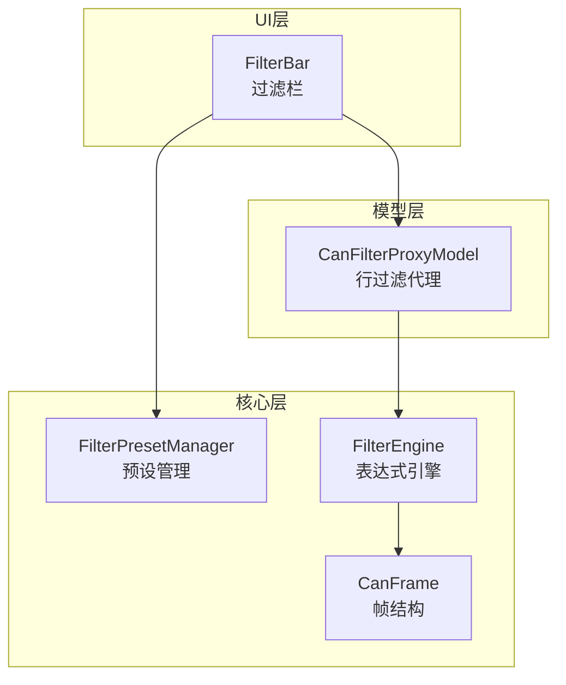
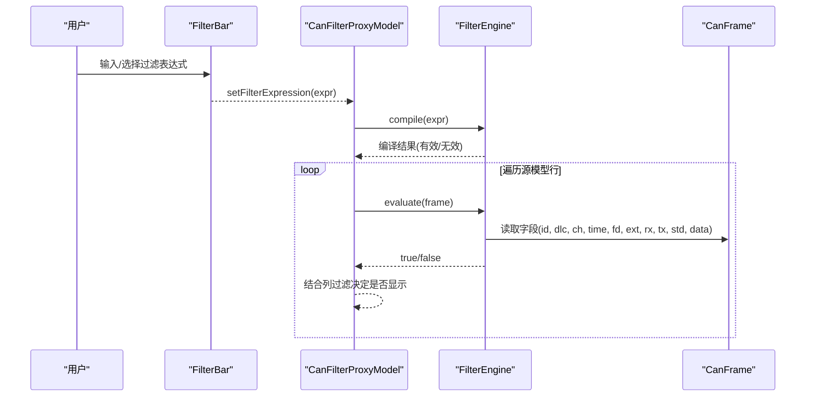
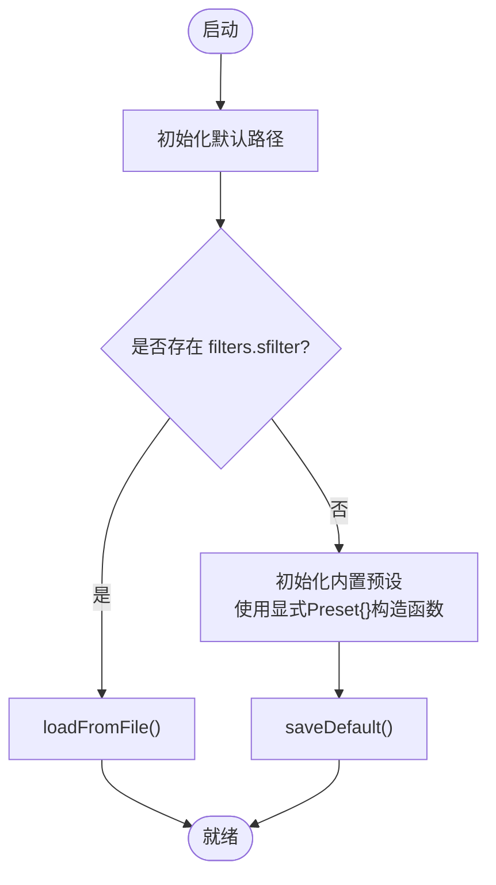
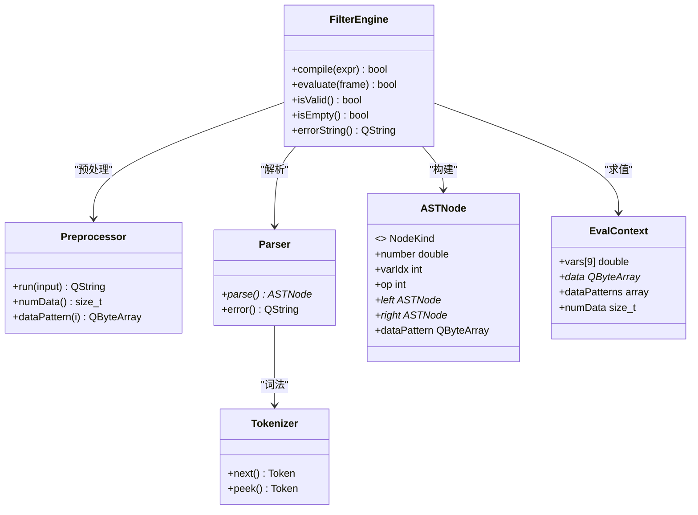
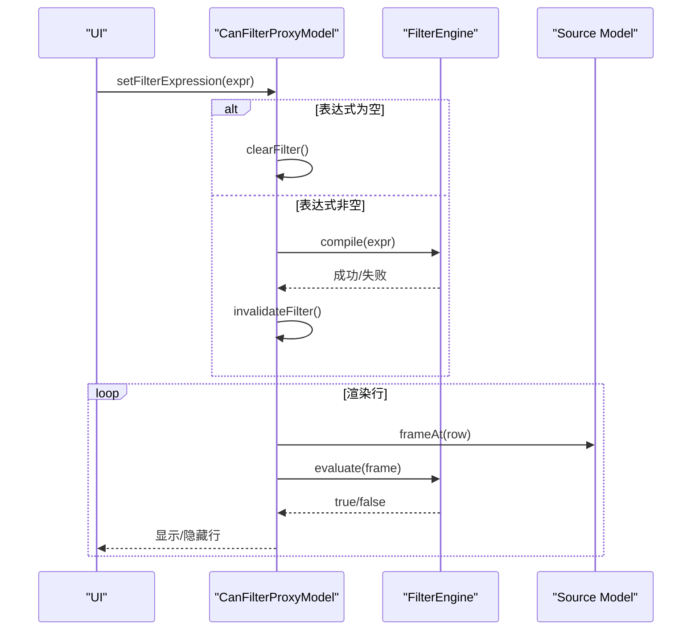
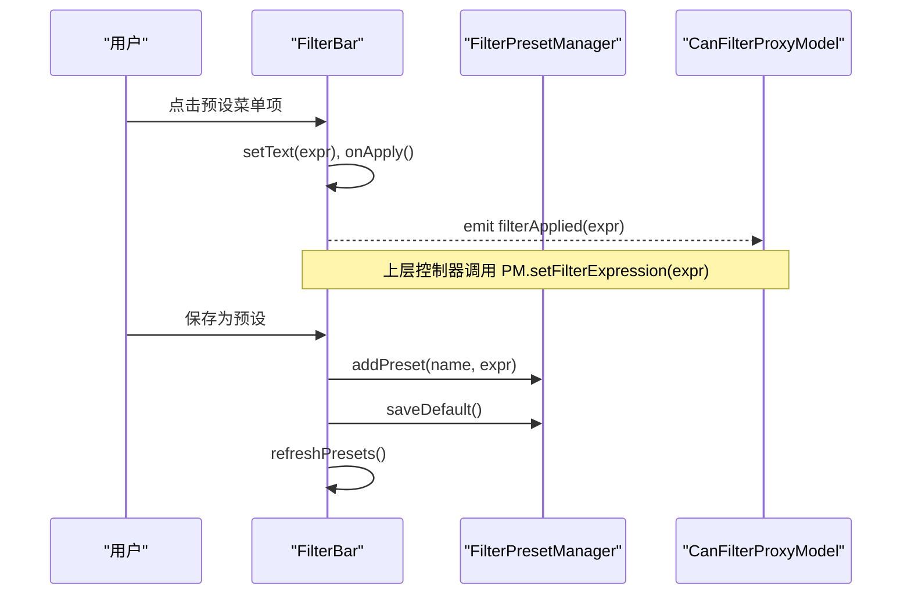
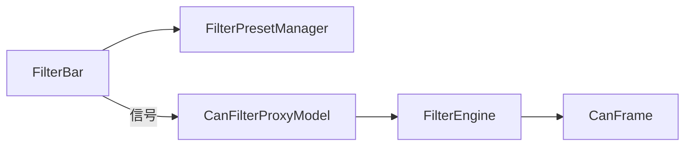

# 过滤器预设管理器

<cite>
**本文引用的文件**
- [filterpresetmanager.h](file://src/core/filterpresetmanager.h)
- [filterpresetmanager.cpp](file://src/core/filterpresetmanager.cpp)
- [filter_engine.h](file://src/core/filter_engine.h)
- [filter_engine.cpp](file://src/core/filter_engine.cpp)
- [canfilterproxymodel.h](file://src/models/canfilterproxymodel.h)
- [canfilterproxymodel.cpp](file://src/models/canfilterproxymodel.cpp)
- [filterbar.h](file://src/ui/filterbar.h)
- [filterbar.cpp](file://src/ui/filterbar.cpp)
- [canframe.h](file://src/core/canframe.h)
</cite>

## 更新摘要
**所做更改**
- 更新了过滤器预设管理器的默认预设初始化方式说明
- 强调了现代化C++初始化模式的采用
- 保持了文档的整体结构和一致性

## 目录
1. [简介](#简介)
2. [项目结构](#项目结构)
3. [核心组件](#核心组件)
4. [架构总览](#架构总览)
5. [详细组件分析](#详细组件分析)
6. [依赖关系分析](#依赖关系分析)
7. [性能考量](#性能考量)
8. [故障排查指南](#故障排查指南)
9. [结论](#结论)
10. [附录](#附录)

## 简介
本模块提供"过滤器预设管理器"，用于管理命名过滤表达式集合，并以 .sfilter（JSON）格式持久化，支持加载/保存/导入/导出，便于团队共享。它与轻量级 CAN 帧过滤引擎、UI 过滤栏以及数据模型代理共同构成完整的"显示过滤"能力：用户通过 UI 输入或选择预设表达式，由过滤引擎对每帧进行求值，最终在表格中按条件筛选显示。

## 项目结构
与过滤器预设相关的代码分布在 core、models、ui 三个层次：
- core：FilterPresetManager（预设管理）、FilterEngine（表达式编译与求值）、CanFrame（帧数据结构）
- models：CanFilterProxyModel（基于 FilterEngine 的行级过滤代理）
- ui：FilterBar（Wireshark 风格过滤栏，集成预设菜单）

图表来源
- [filterbar.cpp:72-95](file://src/ui/filterbar.cpp#L72-L95)
- [canfilterproxymodel.cpp:12-29](file://src/models/canfilterproxymodel.cpp#L12-L29)
- [filter_engine.cpp:734-791](file://src/core/filter_engine.cpp#L734-L791)
- [canframe.h:14-51](file://src/core/canframe.h#L14-L51)

章节来源
- [filterpresetmanager.h:8-55](file://src/core/filterpresetmanager.h#L8-L55)
- [filterpresetmanager.cpp:9-129](file://src/core/filterpresetmanager.cpp#L9-L129)
- [filter_engine.h:9-56](file://src/core/filter_engine.h#L9-L56)
- [filter_engine.cpp:16-800](file://src/core/filter_engine.cpp#L16-L800)
- [canfilterproxymodel.h:9-103](file://src/models/canfilterproxymodel.h#L9-L103)
- [canfilterproxymodel.cpp:1-200](file://src/models/canfilterproxymodel.cpp#L1-L200)
- [filterbar.h:13-59](file://src/ui/filterbar.h#L13-L59)
- [filterbar.cpp:17-178](file://src/ui/filterbar.cpp#L17-L178)
- [canframe.h:14-125](file://src/core/canframe.h#L14-L125)

## 核心组件
- 过滤器预设管理器（FilterPresetManager）
  - 职责：维护命名过滤表达式集合；从 .sfilter（JSON）加载/保存；提供默认预设；增删改查预设。
  - 关键接口：loadFromFile/saveToFile、loadDefault/saveDefault、addPreset/removePreset/findExpr/presetNames。
- 过滤引擎（FilterEngine）
  - 职责：将字符串表达式编译为 AST，并对 CanFrame 求值；支持变量、逻辑、比较、data contains、id in、裸十六进制等语法。
  - 关键接口：compile/evaluate/isValid/isEmpty/errorString。
- 过滤代理模型（CanFilterProxyModel）
  - 职责：基于 FilterEngine 对源模型（如 CanTraceModel）进行行级过滤；支持主表达式 + 列过滤；统计捕获/显示分组数。
  - 关键接口：setFilterExpression/clearFilter、column filter、timestamp mode、packetCountChanged。
- 过滤栏（FilterBar）
  - 职责：提供表达式输入、应用/清除、帮助、预设菜单（读取/保存预设）。
  - 关键交互：setPresetManager、refreshPresets、onSaveAsPreset、onApply/onClear。

章节来源
- [filterpresetmanager.h:18-55](file://src/core/filterpresetmanager.h#L18-L55)
- [filter_engine.h:29-56](file://src/core/filter_engine.h#L29-L56)
- [canfilterproxymodel.h:16-103](file://src/models/canfilterproxymodel.h#L16-L103)
- [filterbar.h:20-59](file://src/ui/filterbar.h#L20-L59)

## 架构总览
下图展示了从 UI 到核心引擎的完整调用链：用户在 FilterBar 中输入或选择预设表达式，FilterBar 将表达式下发给上层（通常为视图/控制器），再由 CanFilterProxyModel 设置并驱动 FilterEngine 对每一帧求值，最终决定该行是否显示。

图表来源
- [filterbar.cpp:72-95](file://src/ui/filterbar.cpp#L72-L95)
- [canfilterproxymodel.cpp:12-29](file://src/models/canfilterproxymodel.cpp#L12-L29)
- [filter_engine.cpp:734-791](file://src/core/filter_engine.cpp#L734-L791)
- [canframe.h:14-51](file://src/core/canframe.h#L14-L51)

## 详细组件分析

### 过滤器预设管理器（FilterPresetManager）
- 设计要点
  - 使用 QVector<Preset> 存储 {name, expr} 列表。
  - 默认路径位于系统可写配置目录，文件名 filters.sfilter（JSON）。
  - 首次运行若无配置文件，则写入内置默认预设（仅 Rx/Tx/FD/ext/error/std）。
  - addPreset 同名覆盖更新；removePreset 按索引删除；findExpr 按名称查找表达式。
- 数据流
  - loadFromFile：解析 JSON 根对象 version/filters，填充 m_presets。
  - saveToFile：序列化当前 m_presets 为 JSON 数组。
  - loadDefault：存在则加载，否则初始化内置预设并保存。
- **现代化初始化** 默认预设对象现在使用显式 `Preset{}` 构造函数调用进行初始化，提升了代码清晰度和C++初始化模式的一致性。
- 复杂度
  - addPreset 线性扫描 O(n)，n 为预设数量（通常较小）。
  - findExpr/presetNames 均为 O(n)。
- 错误处理
  - 文件读写失败返回 false；JSON 结构不合法时忽略或回退。

图表来源
- [filterpresetmanager.cpp:16-95](file://src/core/filterpresetmanager.cpp#L16-L95)

章节来源
- [filterpresetmanager.h:18-55](file://src/core/filterpresetmanager.h#L18-L55)
- [filterpresetmanager.cpp:24-129](file://src/core/filterpresetmanager.cpp#L24-L129)

### 过滤引擎（FilterEngine）
- 设计要点
  - 预处理器：提取 data contains 模式、转换 id in、关键字替换、包裹裸十六进制、十六进制转十进制。
  - 词法分析器：识别数字、标识符、运算符、括号、逗号等。
  - 递归下降解析器：构建 AST（Number/Variable/Compare/Logical/Not/DataContains/IdIn）。
  - 求值器：根据 EvalContext（变量映射、数据指针、data patterns）计算布尔结果。
- 支持的表达式特性
  - 变量：id, dlc, ch, time, fd, ext, rx, tx, std
  - 逻辑：and/&&, or/||, not/!
  - 比较：==, !=, >, <, >=, <=
  - 语法糖：裸十六进制自动视为 id==N；id in 0x100,0x200 展开为多个相等判断；data contains 字节序列匹配。
- 复杂度
  - 编译阶段：预处理/词法/解析近似 O(L)，L 为表达式长度。
  - 求值阶段：AST 节点遍历 O(k)，k 为节点数；data contains 匹配与数据长度相关。
- 错误处理
  - 编译失败记录 errorString；空表达式视为无过滤（始终通过）。

图表来源
- [filter_engine.cpp:16-800](file://src/core/filter_engine.cpp#L16-L800)
- [filter_engine.h:29-56](file://src/core/filter_engine.h#L29-L56)

章节来源
- [filter_engine.h:9-56](file://src/core/filter_engine.h#L9-L56)
- [filter_engine.cpp:85-800](file://src/core/filter_engine.cpp#L85-L800)

### 过滤代理模型（CanFilterProxyModel）
- 设计要点
  - 主过滤：setFilterExpression 创建/复用 FilterEngine，并在 filterAcceptsRow 中调用 evaluate。
  - 列过滤：支持多列简单包含/范围比较（如时间、ID、通道等）。
  - 时间戳模式：Absolute/SinceCapture/SinceDisplay，影响 Time/Delta 列显示与排序。
  - 统计：capturedCount/displayedCount，emitPacketCount 通知计数变化。
- 行为流程
  - 设置表达式后，若为空则清空引擎；否则编译并刷新。
  - 过滤时先检查主表达式，再逐一检查列过滤。

图表来源
- [canfilterproxymodel.cpp:12-29](file://src/models/canfilterproxymodel.cpp#L12-L29)
- [canfilterproxymodel.cpp:153-173](file://src/models/canfilterproxymodel.cpp#L153-L173)
- [filter_engine.cpp:772-791](file://src/core/filter_engine.cpp#L772-L791)

章节来源
- [canfilterproxymodel.h:16-103](file://src/models/canfilterproxymodel.h#L16-L103)
- [canfilterproxymodel.cpp:1-200](file://src/models/canfilterproxymodel.cpp#L1-L200)

### 过滤栏（FilterBar）与预设集成
- 功能
  - 表达式输入框、应用/清除按钮、帮助按钮、状态图标（语法校验反馈）。
  - 预设下拉菜单：列出所有预设名称，点击后将对应表达式填入输入框并应用。
  - 保存当前表达式为预设：弹出名称输入，写入 FilterPresetManager 并持久化。
- 与预设管理器的协作
  - setPresetManager 注入管理器实例。
  - refreshPresets 动态生成菜单项，绑定触发回调。
  - onSaveAsPreset 调用 addPreset/saveDefault 并刷新菜单。

图表来源
- [filterbar.cpp:72-120](file://src/ui/filterbar.cpp#L72-L120)
- [filterbar.cpp:137-156](file://src/ui/filterbar.cpp#L137-L156)
- [filterpresetmanager.cpp:97-129](file://src/core/filterpresetmanager.cpp#L97-L129)

章节来源
- [filterbar.h:20-59](file://src/ui/filterbar.h#L20-59)
- [filterbar.cpp:17-178](file://src/ui/filterbar.cpp#L17-L178)
- [filterpresetmanager.cpp:97-129](file://src/core/filterpresetmanager.cpp#L97-L129)

## 依赖关系分析
- 组件耦合
  - FilterBar 依赖 FilterPresetManager（只读菜单与保存）和上层模型（通过信号传递表达式）。
  - CanFilterProxyModel 依赖 FilterEngine 与源模型（CanTraceModel 等）。
  - FilterEngine 依赖 CanFrame 字段与日志工具。
- 外部依赖
  - Qt JSON 用于 .sfilter 序列化。
  - QStandardPaths 定位配置目录。
- 潜在循环依赖
  - 当前未见直接循环依赖；UI 与核心通过信号/接口解耦。

图表来源
- [filterbar.cpp:72-95](file://src/ui/filterbar.cpp#L72-L95)
- [canfilterproxymodel.cpp:12-29](file://src/models/canfilterproxymodel.cpp#L12-L29)
- [filter_engine.cpp:734-791](file://src/core/filter_engine.cpp#L734-L791)
- [canframe.h:14-51](file://src/core/canframe.h#L14-L51)

章节来源
- [filterbar.cpp:72-120](file://src/ui/filterbar.cpp#L72-L120)
- [canfilterproxymodel.cpp:12-29](file://src/models/canfilterproxymodel.cpp#L12-L29)
- [filter_engine.cpp:734-791](file://src/core/filter_engine.cpp#L734-L791)
- [canframe.h:14-51](file://src/core/canframe.h#L14-L51)

## 性能考量
- 表达式编译
  - 仅在表达式变更时编译一次，后续多次 evaluate 复用 AST，降低重复开销。
- 求值路径
  - 短路逻辑（&&）减少不必要求值；data contains 匹配尽量前置以减少分支。
- 内存占用
  - AST 节点使用智能指针管理生命周期；data patterns 固定容量数组避免频繁分配。
- UI 响应
  - 过滤栏实时语法校验仅做轻量检查，真正编译在 Apply 时执行，避免输入卡顿。

## 故障排查指南
- 表达式编译失败
  - 现象：FilterBar 状态图标变红，提示"语法错误"。
  - 排查：查看 FilterEngine::errorString；确认变量名、运算符、括号匹配是否正确。
  - 参考实现：编译失败记录错误信息并返回 false。
- 数据不包含预期
  - 现象：data contains 未命中。
  - 排查：确认字节序列格式（十六进制两位一组），注意大小写与空格；检查帧数据是否为空。
- 预设未生效
  - 现象：点击预设无效果。
  - 排查：确认 FilterBar 已 setPresetManager；检查 presets() 是否包含目标预设；确认上层已连接 filterApplied 信号并调用 setFilterExpression。
- 默认预设丢失
  - 现象：filters.sfilter 不存在或内容异常。
  - 排查：应用启动时会 loadDefault，若不存在则写入内置预设；检查配置目录权限与磁盘空间。

章节来源
- [filter_engine.cpp:734-769](file://src/core/filter_engine.cpp#L734-L769)
- [filter_engine.cpp:797-800](file://src/core/filter_engine.cpp#L797-L800)
- [filterbar.cpp:158-177](file://src/ui/filterbar.cpp#L158-L177)
- [filterpresetmanager.cpp:75-95](file://src/core/filterpresetmanager.cpp#L75-L95)

## 结论
过滤器预设管理器以简洁的数据结构与稳定的 I/O 协议（JSON）实现了可移植、可共享的过滤表达式集管理。**现代化改进**：通过采用显式 `Preset{}` 构造函数调用替代隐式列表初始化，显著提升了代码清晰度和C++初始化模式的一致性。配合自研的轻量过滤引擎与 UI 过滤栏，提供了高效、直观且可扩展的显示过滤体验。整体架构清晰、职责分离良好，适合在大规模报文场景下稳定运行。

## 附录
- 常用表达式示例（来自引擎说明）
  - id == 0x123 and fd
  - dlc > 8 and ext
  - 0x100 or 0x200
  - not (id == 0x100 or id == 0x200)
  - data contains 01 02 and ch == 1
- 预设文件格式（filters.sfilter）
  - 根对象包含 version 与 filters 数组
  - 每个元素包含 name 与 expr 字段

章节来源
- [filter_engine.h:14-28](file://src/core/filter_engine.h#L14-L28)
- [filterpresetmanager.cpp:52-73](file://src/core/filterpresetmanager.cpp#L52-L73)