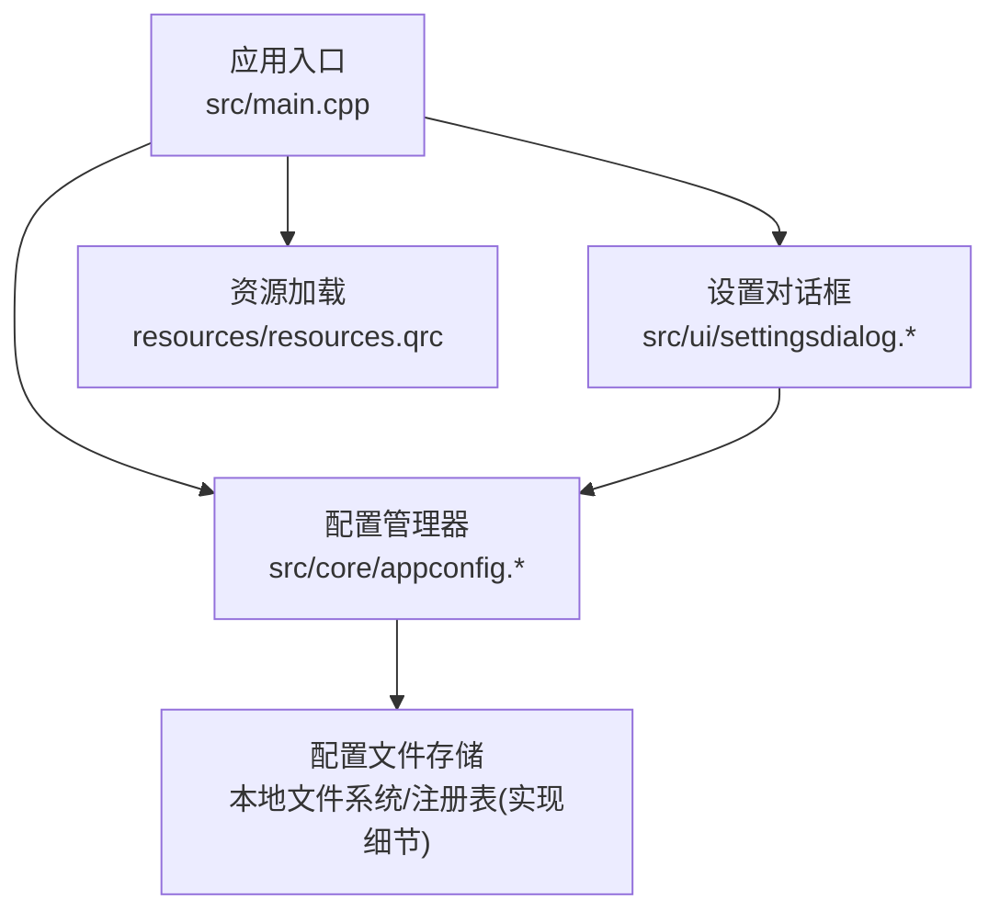
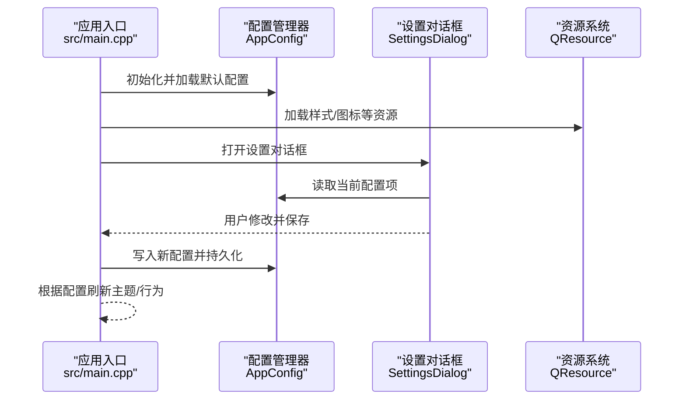
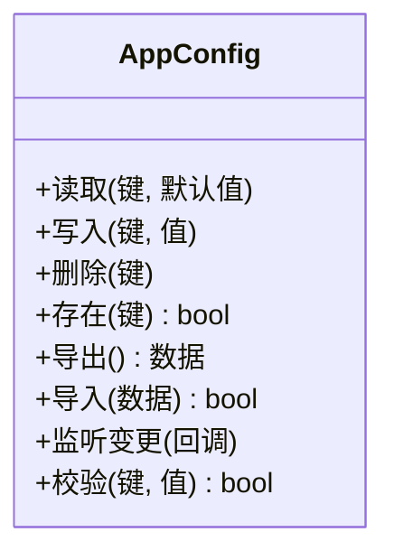
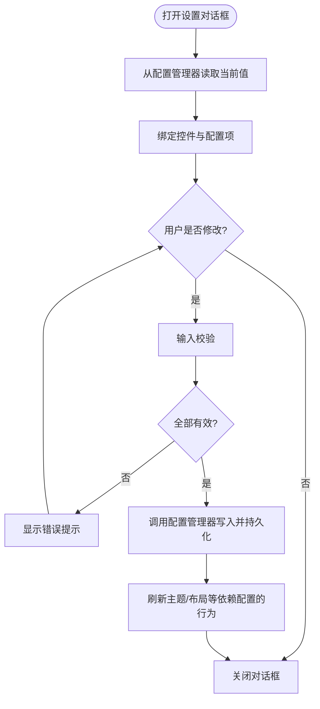
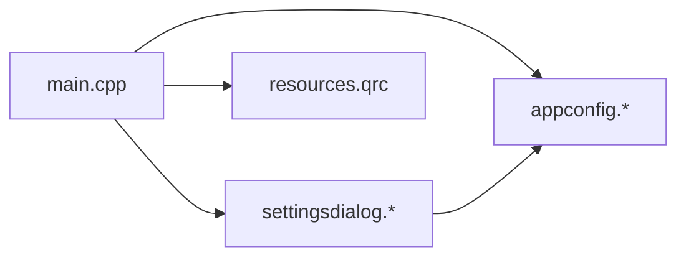

# 配置管理系统

<cite>
**本文引用的文件**   
- [src/core/appconfig.h](file://src/core/appconfig.h)
- [src/core/appconfig.cpp](file://src/core/appconfig.cpp)
- [src/ui/settingsdialog.h](file://src/ui/settingsdialog.h)
- [src/ui/settingsdialog.cpp](file://src/ui/settingsdialog.cpp)
- [src/main.cpp](file://src/main.cpp)
- [CMakeLists.txt](file://CMakeLists.txt)
- [src/CMakeLists.txt](file://src/CMakeLists.txt)
- [resources/resources.qrc](file://resources/resources.qrc)
- [README.md](file://README.md)
</cite>

## 目录
1. [简介](#简介)
2. [项目结构](#项目结构)
3. [核心组件](#核心组件)
4. [架构总览](#架构总览)
5. [详细组件分析](#详细组件分析)
6. [依赖关系分析](#依赖关系分析)
7. [性能考虑](#性能考虑)
8. [故障排查指南](#故障排查指南)
9. [结论](#结论)
10. [附录](#附录)

## 简介
本仓库是一个基于 Qt 的桌面应用，围绕 CAN/DBC 数据解析与可视化展开。其中“配置管理系统”负责应用程序运行期与持久化的配置项管理、用户界面设置交互以及资源加载等能力。该子系统贯穿应用启动、UI 初始化、设置对话框与核心模块之间的配置读写流程，确保系统在不同环境与用户偏好下稳定运行。

## 项目结构
从整体结构看，配置相关代码主要分布在以下位置：
- 核心配置模型与持久化：src/core/appconfig.*
- 设置对话框（UI）：src/ui/settingsdialog.*
- 应用入口与初始化：src/main.cpp
- 构建与资源：CMakeLists.txt、src/CMakeLists.txt、resources/resources.qrc
- 文档与说明：README.md

图示来源
- [src/main.cpp](file://src/main.cpp)
- [src/core/appconfig.h](file://src/core/appconfig.h)
- [src/core/appconfig.cpp](file://src/core/appconfig.cpp)
- [src/ui/settingsdialog.h](file://src/ui/settingsdialog.h)
- [src/ui/settingsdialog.cpp](file://src/ui/settingsdialog.cpp)
- [resources/resources.qrc](file://resources/resources.qrc)

章节来源
- [CMakeLists.txt](file://CMakeLists.txt)
- [src/CMakeLists.txt](file://src/CMakeLists.txt)
- [README.md](file://README.md)

## 核心组件
- 配置管理器（AppConfig）
  - 职责：集中管理应用配置项，提供读取、写入、默认值、校验与变更通知能力；封装底层持久化细节（如 JSON/INI/注册表）。
  - 关键能力：
    - 获取/设置配置项（字符串、数值、布尔、列表等）
    - 默认配置初始化与迁移
    - 配置变更事件广播（供 UI 或业务模块响应）
    - 导入/导出配置（便于备份与共享）
- 设置对话框（SettingsDialog）
  - 职责：以表单形式展示并编辑配置项，支持分组、验证、预览与即时生效。
  - 关键能力：
    - 绑定配置项到控件（双向同步）
    - 输入校验与错误提示
    - 保存/取消操作与状态回滚
    - 主题与样式切换（若集成主题管理）

章节来源
- [src/core/appconfig.h](file://src/core/appconfig.h)
- [src/core/appconfig.cpp](file://src/core/appconfig.cpp)
- [src/ui/settingsdialog.h](file://src/ui/settingsdialog.h)
- [src/ui/settingsdialog.cpp](file://src/ui/settingsdialog.cpp)

## 架构总览
配置管理系统采用“模型-视图-控制器”思想：
- 模型层：AppConfig 作为单一事实源，统一暴露配置 API。
- 视图层：SettingsDialog 将配置项映射为 UI 控件，处理用户交互。
- 控制层：main.cpp 在应用生命周期中协调配置加载、对话框显示与主题/资源初始化。

图示来源
- [src/main.cpp](file://src/main.cpp)
- [src/core/appconfig.h](file://src/core/appconfig.h)
- [src/core/appconfig.cpp](file://src/core/appconfig.cpp)
- [src/ui/settingsdialog.h](file://src/ui/settingsdialog.h)
- [src/ui/settingsdialog.cpp](file://src/ui/settingsdialog.cpp)
- [resources/resources.qrc](file://resources/resources.qrc)

## 详细组件分析

### 配置管理器（AppConfig）
- 设计要点
  - 单例或全局访问点，避免重复实例化导致状态不一致。
  - 配置项按命名空间/分组组织，提高可读性与可维护性。
  - 对关键配置项进行类型与范围校验，失败时回退到默认值并记录日志。
  - 通过信号/回调机制通知配置变更，驱动 UI 或业务逻辑更新。
- 数据结构与复杂度
  - 内部通常使用键值映射（如 QSettings/JSON），读写时间复杂度近似 O(1)/O(n)（n 为条目数）。
  - 批量导入/导出建议分块处理，避免阻塞主线程。
- 错误处理
  - 文件 I/O 异常、权限不足、格式不合法等情况需捕获并降级处理。
  - 提供诊断信息（路径、键名、错误码）以便定位问题。
- 优化机会
  - 懒加载：按需读取大对象配置。
  - 缓存热点配置项，减少频繁磁盘 IO。
  - 异步持久化，避免 UI 卡顿。

图示来源
- [src/core/appconfig.h](file://src/core/appconfig.h)
- [src/core/appconfig.cpp](file://src/core/appconfig.cpp)

章节来源
- [src/core/appconfig.h](file://src/core/appconfig.h)
- [src/core/appconfig.cpp](file://src/core/appconfig.cpp)

### 设置对话框（SettingsDialog）
- 设计要点
  - 将配置项分组展示（如“常规”、“CAN/DBC”、“显示”等）。
  - 控件与配置项双向绑定，支持即时预览与撤销。
  - 保存前执行全量校验，失败则阻止提交并高亮错误项。
- 交互流程
  - 打开对话框：从 AppConfig 拉取当前值填充控件。
  - 用户修改：实时校验并标记无效输入。
  - 保存：调用 AppConfig 写入并持久化，必要时触发主题/布局刷新。
  - 取消：丢弃未保存更改，恢复初始状态。

图示来源
- [src/ui/settingsdialog.h](file://src/ui/settingsdialog.h)
- [src/ui/settingsdialog.cpp](file://src/ui/settingsdialog.cpp)
- [src/core/appconfig.h](file://src/core/appconfig.h)
- [src/core/appconfig.cpp](file://src/core/appconfig.cpp)

章节来源
- [src/ui/settingsdialog.h](file://src/ui/settingsdialog.h)
- [src/ui/settingsdialog.cpp](file://src/ui/settingsdialog.cpp)

### 应用入口与初始化（main.cpp）
- 职责
  - 创建 QApplication/QGuiApplication 实例。
  - 初始化日志、主题、资源（QResource）。
  - 初始化配置管理器并加载默认/上次会话配置。
  - 创建主窗口与设置对话框，建立必要的连接。
- 关键点
  - 资源路径与平台差异处理（Windows/Linux/macOS）。
  - 命令行参数解析（如 --reset-config、--log-level）。
  - 异常保护：确保即使配置损坏也能以默认配置启动。

章节来源
- [src/main.cpp](file://src/main.cpp)

## 依赖关系分析
- 组件耦合
  - SettingsDialog 依赖 AppConfig 进行读写；AppConfig 不应反向依赖 UI，保持解耦。
  - main.cpp 作为装配层，负责实例化与连接。
- 外部依赖
  - Qt 框架（QSettings/QResource/Qt Widgets 等）。
  - 第三方库（如 spdlog、nlohmann_json）用于日志与序列化（视具体实现而定）。
- 潜在循环依赖
  - 避免 AppConfig 直接包含 UI 头文件；如需通知 UI，使用信号/回调接口。

图示来源
- [src/main.cpp](file://src/main.cpp)
- [src/core/appconfig.h](file://src/core/appconfig.h)
- [src/core/appconfig.cpp](file://src/core/appconfig.cpp)
- [src/ui/settingsdialog.h](file://src/ui/settingsdialog.h)
- [src/ui/settingsdialog.cpp](file://src/ui/settingsdialog.cpp)
- [resources/resources.qrc](file://resources/resources.qrc)

章节来源
- [CMakeLists.txt](file://CMakeLists.txt)
- [src/CMakeLists.txt](file://src/CMakeLists.txt)

## 性能考虑
- 配置读写
  - 避免在主线程频繁写盘，采用批量写入或延迟落盘策略。
  - 对大型配置（如主题包、宏定义）采用懒加载与分页读取。
- UI 交互
  - 设置对话框的校验与渲染应在子线程或定时器中分批执行，防止卡顿。
  - 使用增量更新而非全量重绘。
- 资源加载
  - 预编译资源（qrc）减少运行时开销；按需加载图标与样式。

[本节为通用指导，无需特定文件引用]

## 故障排查指南
- 常见问题
  - 配置无法保存：检查目标路径权限、磁盘空间、文件格式合法性。
  - 配置项丢失：确认迁移脚本是否覆盖旧键名；导出/导入流程是否完整。
  - 界面未生效：确认配置变更后是否触发了主题/布局刷新。
- 定位方法
  - 启用详细日志，记录配置读写路径、键名与返回值。
  - 使用最小化复现：清空配置后重试，观察是否恢复默认。
  - 断点调试：在 AppConfig::写入/保存与 SettingsDialog::保存处设置断点。

章节来源
- [src/core/appconfig.cpp](file://src/core/appconfig.cpp)
- [src/ui/settingsdialog.cpp](file://src/ui/settingsdialog.cpp)
- [src/main.cpp](file://src/main.cpp)

## 结论
配置管理系统以 AppConfig 为核心，配合 SettingsDialog 提供直观的配置编辑体验，并通过 main.cpp 完成应用生命周期的装配与初始化。良好的分层与解耦确保了可扩展性与可维护性。后续可在异步化、校验规则引擎、配置版本迁移等方面持续优化。

[本节为总结性内容，无需特定文件引用]

## 附录
- 构建与资源
  - CMakeLists.txt 与 src/CMakeLists.txt 定义了模块与依赖。
  - resources/resources.qrc 管理样式与图标等静态资源。
- 参考文档
  - README.md 提供项目背景与使用说明。

章节来源
- [CMakeLists.txt](file://CMakeLists.txt)
- [src/CMakeLists.txt](file://src/CMakeLists.txt)
- [resources/resources.qrc](file://resources/resources.qrc)
- [README.md](file://README.md)