# 项目管理系统

<cite>
**本文引用的文件**   
- [CMakeLists.txt](file://CMakeLists.txt)
- [README.md](file://README.md)
- [src/main.cpp](file://src/main.cpp)
- [src/CMakeLists.txt](file://src/CMakeLists.txt)
- [src/core/projectmanager.h](file://src/core/projectmanager.h)
- [src/core/projectmanager.cpp](file://src/core/projectmanager.cpp)
- [src/core/appconfig.h](file://src/core/appconfig.h)
- [src/core/appconfig.cpp](file://src/core/appconfig.cpp)
- [src/core/canframe.h](file://src/core/canframe.h)
- [src/core/dbcdata.h](file://src/core/dbcdata.h)
- [src/core/filter_engine.h](file://src/core/filter_engine.h)
- [src/core/filter_engine.cpp](file://src/core/filter_engine.cpp)
- [src/core/logging.h](file://src/core/logging.h)
- [src/core/logging.cpp](file://src/core/logging.cpp)
- [src/core/resourceresolver.h](file://src/core/resourceresolver.h)
- [src/core/resourceresolver.cpp](file://src/core/resourceresolver.cpp)
- [src/core/sessionmanager.h](file://src/core/sessionmanager.h)
- [src/core/sessionmanager.cpp](file://src/core/sessionmanager.cpp)
- [src/models/cantracemodel.h](file://src/models/cantracemodel.h)
- [src/models/cantracemodel.cpp](file://src/models/cantracemodel.cpp)
- [src/ui/mainwindow.h](file://src/ui/mainwindow.h)
- [src/ui/mainwindow.cpp](file://src/ui/mainwindow.cpp)
- [UI/ui-prototype.html](file://UI/ui-prototype.html)
- [scripts/build.py](file://scripts/build.py)
- [EngineAnalysis.sinproj](file://EngineAnalysis.sinproj)
</cite>

## 更新摘要
**变更内容**   
- 项目管理系统已升级到v2格式，新增ProjectMeta元数据结构和ProjectDeviceConfig设备配置结构
- 实现了向后兼容的JSON序列化/反序列化逻辑，支持v1和v2格式共存
- 新增ResourceResolver相对路径解析器，实现工程资源的相对路径管理
- SessionManager独立管理会话状态，支持从AppConfig迁移最近项目列表
- 支持创建时间戳、修改时间、作者信息、标签和笔记等元数据跟踪功能

## 目录
1. [简介](#简介)
2. [项目结构](#项目结构)
3. [核心组件](#核心组件)
4. [架构总览](#架构总览)
5. [详细组件分析](#详细组件分析)
6. [依赖关系分析](#依赖关系分析)
7. [性能考量](#性能考量)
8. [故障排查指南](#故障排查指南)
9. [结论](#结论)
10. [附录](#附录)

## 简介
本项目是一个面向 CAN 总线数据的项目管理系统，提供工程创建与管理、CAN 帧与 DBC 模型管理、过滤引擎、日志记录、以及基于 Qt 的 UI 界面。系统采用分层架构：UI 层负责交互与展示，模型层封装数据视图，核心层实现业务逻辑（项目管理、配置、过滤、日志等），并通过 CMake 构建脚本组织编译流程。

**最新更新**：系统已升级到v2格式，增强了元数据管理和设备配置能力，支持更丰富的工程信息和更好的资源路径管理。

## 项目结构
- 顶层包含构建配置与说明文档，以及用于下载第三方库与构建的脚本。
- src 为源码目录，按 core、models、ui、utils 分层组织。
- UI 目录包含原型 HTML 与样式、脚本，便于快速验证界面布局。
- third_party 存放第三方库（如 dbcppp、spdlog、nlohmann_json、qcustomplot 等）。
- resources 存放 Qt 资源与样式表。

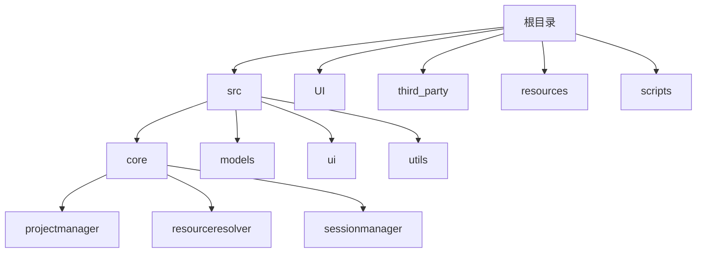

**图表来源** 
- [CMakeLists.txt](file://CMakeLists.txt)
- [src/CMakeLists.txt](file://src/CMakeLists.txt)

**章节来源**
- [CMakeLists.txt](file://CMakeLists.txt)
- [src/CMakeLists.txt](file://src/CMakeLists.txt)

## 核心组件
- **项目管理器**：负责工程的加载、保存、版本兼容与元数据管理，现已升级到v2格式。
- **应用配置**：集中管理用户偏好、路径、插件开关等配置项。
- **资源解析器**：处理工程资源的相对路径与绝对路径转换，支持跨盘符路径处理。
- **会话管理器**：独立管理用户会话状态，包括最近项目列表和UI状态。
- **CAN 帧与 DBC 数据模型**：定义 CAN 帧结构与 DBC 信号/报文描述。
- **过滤引擎**：对 CAN 数据进行规则化过滤与匹配。
- **日志系统**：统一输出调试与运行日志。
- **UI 主窗口**：承载各面板与交互入口。
- **数据模型**：将核心数据暴露给 UI 进行可视化。

**章节来源**
- [src/core/projectmanager.h](file://src/core/projectmanager.h)
- [src/core/projectmanager.cpp](file://src/core/projectmanager.cpp)
- [src/core/appconfig.h](file://src/core/appconfig.h)
- [src/core/appconfig.cpp](file://src/core/appconfig.cpp)
- [src/core/resourceresolver.h](file://src/core/resourceresolver.h)
- [src/core/resourceresolver.cpp](file://src/core/resourceresolver.cpp)
- [src/core/sessionmanager.h](file://src/core/sessionmanager.h)
- [src/core/sessionmanager.cpp](file://src/core/sessionmanager.cpp)
- [src/core/canframe.h](file://src/core/canframe.h)
- [src/core/dbcdata.h](file://src/core/dbcdata.h)
- [src/core/filter_engine.h](file://src/core/filter_engine.h)
- [src/core/filter_engine.cpp](file://src/core/filter_engine.cpp)
- [src/core/logging.h](file://src/core/logging.h)
- [src/core/logging.cpp](file://src/core/logging.cpp)
- [src/models/cantracemodel.h](file://src/models/cantracemodel.h)
- [src/models/cantracemodel.cpp](file://src/models/cantracemodel.cpp)
- [src/ui/mainwindow.h](file://src/ui/mainwindow.h)
- [src/ui/mainwindow.cpp](file://src/ui/mainwindow.cpp)

## 架构总览
系统采用"UI-Model-Core"三层架构，UI 通过 Model 访问 Core 提供的能力；Core 内部模块职责清晰，低耦合高内聚。

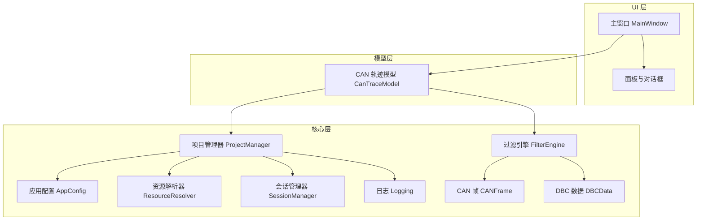

**图表来源** 
- [src/ui/mainwindow.h](file://src/ui/mainwindow.h)
- [src/ui/mainwindow.cpp](file://src/ui/mainwindow.cpp)
- [src/models/cantracemodel.h](file://src/models/cantracemodel.h)
- [src/models/cantracemodel.cpp](file://src/models/cantracemodel.cpp)
- [src/core/projectmanager.h](file://src/core/projectmanager.h)
- [src/core/appconfig.h](file://src/core/appconfig.h)
- [src/core/resourceresolver.h](file://src/core/resourceresolver.h)
- [src/core/sessionmanager.h](file://src/core/sessionmanager.h)
- [src/core/filter_engine.h](file://src/core/filter_engine.h)
- [src/core/logging.h](file://src/core/logging.h)
- [src/core/canframe.h](file://src/core/canframe.h)
- [src/core/dbcdata.h](file://src/core/dbcdata.h)

## 详细组件分析

### 项目管理器（ProjectManager）— v2格式升级

**更新**：项目管理系统已升级到v2格式，新增了ProjectMeta元数据结构和ProjectDeviceConfig设备配置结构。

- **职责**：工程生命周期管理（新建、打开、保存、导出）、工程元数据维护、与配置和日志集成。
- **v2格式特性**：
  - **ProjectMeta元数据结构**：包含创建时间、修改时间、作者、标签和笔记等元数据
  - **ProjectDeviceConfig设备配置**：结构化设备参数，包括设备类型、FD模式、波特率等
  - **ResourceResolver集成**：自动处理资源的相对路径与绝对路径转换
  - **向后兼容性**：同时支持v1和v2格式的JSON序列化/反序列化

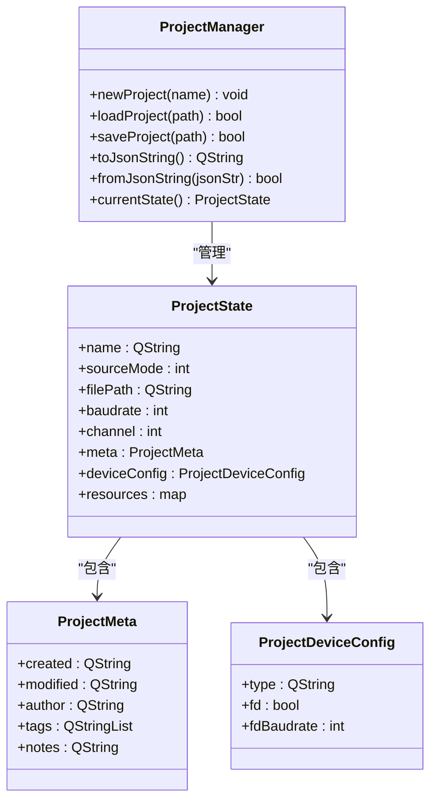

**图表来源** 
- [src/core/projectmanager.h:45-97](file://src/core/projectmanager.h#L45-L97)
- [src/core/projectmanager.cpp:159-249](file://src/core/projectmanager.cpp#L159-L249)

**章节来源**
- [src/core/projectmanager.h:45-97](file://src/core/projectmanager.h#L45-L97)
- [src/core/projectmanager.cpp:27-111](file://src/core/projectmanager.cpp#L27-L111)
- [src/core/projectmanager.cpp:159-376](file://src/core/projectmanager.cpp#L159-L376)

### 资源解析器（ResourceResolver）— 新增组件

**新增**：ResourceResolver是v2格式的核心组件，负责工程资源的相对路径管理。

- **职责**：以 .sinproj 所在目录为基准，将外部资源（DBC、日志、过滤器）在保存时转为相对路径，加载时转回绝对路径。
- **关键特性**：
  - 支持Windows跨盘符路径检测，避免错误的相对化
  - 批量路径处理能力
  - 空路径和无效路径的安全处理

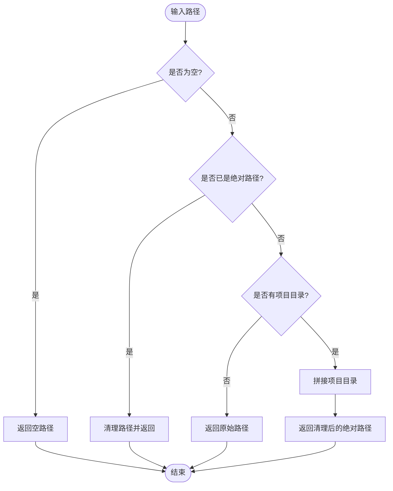

**图表来源** 
- [src/core/resourceresolver.cpp:16-31](file://src/core/resourceresolver.cpp#L16-L31)

**章节来源**
- [src/core/resourceresolver.h:7-38](file://src/core/resourceresolver.h#L7-L38)
- [src/core/resourceresolver.cpp:7-96](file://src/core/resourceresolver.cpp#L7-L96)

### 会话管理器（SessionManager）— 新增组件

**新增**：SessionManager独立管理用户会话状态，从AppConfig中迁移最近项目列表。

- **职责**：管理 sessions.json 文件，存储最近打开的工程/工作区列表、最后打开的路径、UI状态等。
- **迁移功能**：首次启动时自动从 AppConfig 迁移 project.recent 到独立的 sessions.json 文件。
- **元数据支持**：每个最近项目条目包含路径、类型、名称、修改时间和固定标记。

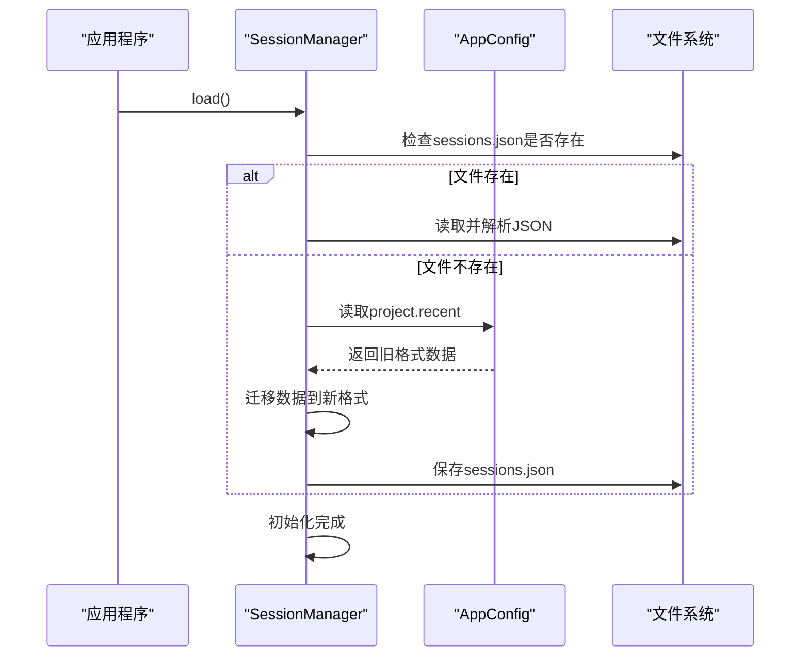

**图表来源** 
- [src/core/sessionmanager.cpp:42-69](file://src/core/sessionmanager.cpp#L42-L69)
- [src/core/sessionmanager.cpp:71-117](file://src/core/sessionmanager.cpp#L71-L117)

**章节来源**
- [src/core/sessionmanager.h:13-28](file://src/core/sessionmanager.h#L13-L28)
- [src/core/sessionmanager.cpp:42-117](file://src/core/sessionmanager.cpp#L42-L117)
- [src/core/sessionmanager.cpp:183-225](file://src/core/sessionmanager.cpp#L183-L225)

### 应用配置（AppConfig）
- **职责**：集中管理用户设置、路径、功能开关、主题等。
- **关键点**：
  - 配置文件格式（JSON/INI/自定义）。
  - 默认值与覆盖策略。
  - 线程安全与持久化。

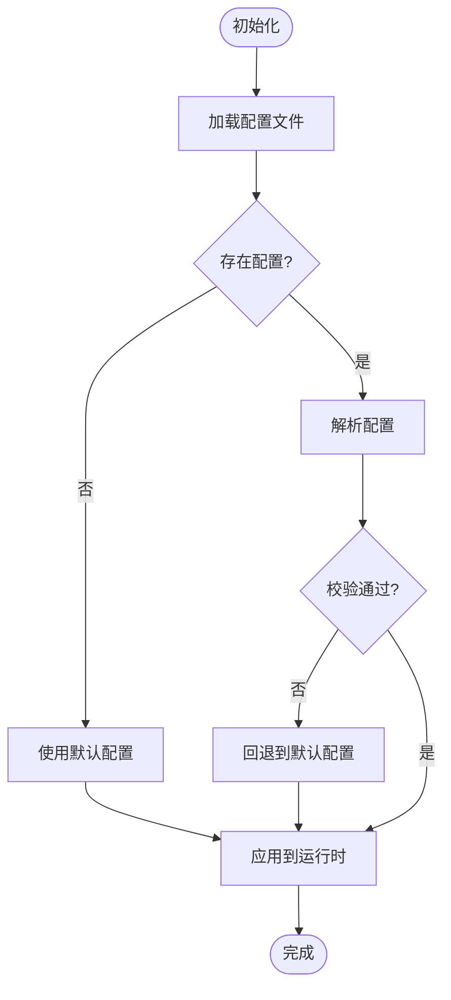

**图表来源** 
- [src/core/appconfig.h](file://src/core/appconfig.h)
- [src/core/appconfig.cpp](file://src/core/appconfig.cpp)

**章节来源**
- [src/core/appconfig.h](file://src/core/appconfig.h)
- [src/core/appconfig.cpp](file://src/core/appconfig.cpp)

### 过滤引擎（FilterEngine）
- **职责**：根据规则对 CAN 帧进行过滤、匹配与聚合。
- **关键点**：
  - 规则表达式或条件组合。
  - 高性能匹配算法（位掩码、哈希索引等）。
  - 与 DBC 信号映射结合，支持语义级过滤。

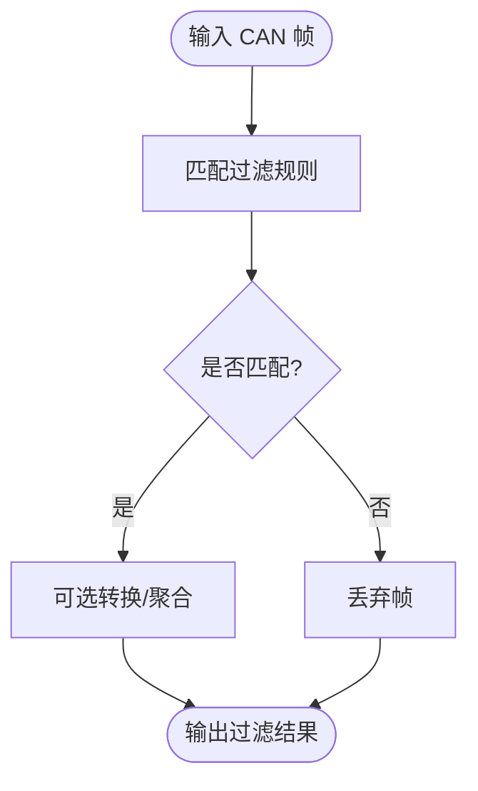

**图表来源** 
- [src/core/filter_engine.h](file://src/core/filter_engine.h)
- [src/core/filter_engine.cpp](file://src/core/filter_engine.cpp)
- [src/core/canframe.h](file://src/core/canframe.h)
- [src/core/dbcdata.h](file://src/core/dbcdata.h)

**章节来源**
- [src/core/filter_engine.h](file://src/core/filter_engine.h)
- [src/core/filter_engine.cpp](file://src/core/filter_engine.cpp)
- [src/core/canframe.h](file://src/core/canframe.h)
- [src/core/dbcdata.h](file://src/core/dbcdata.h)

### 日志系统（Logging）
- **职责**：统一的日志输出、级别控制、文件/控制台输出。
- **关键点**：
  - 异步写入与缓冲策略。
  - 日志轮转与大小限制。
  - 可插拔后端（文件、网络、GUI 面板）。

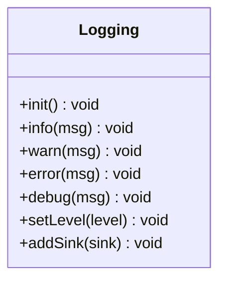

**图表来源** 
- [src/core/logging.h](file://src/core/logging.h)
- [src/core/logging.cpp](file://src/core/logging.cpp)

**章节来源**
- [src/core/logging.h](file://src/core/logging.h)
- [src/core/logging.cpp](file://src/core/logging.cpp)

### 数据模型（CanTraceModel）
- **职责**：将核心层的 CAN 帧序列转换为 UI 可消费的模型接口，支持分页、排序、筛选。
- **关键点**：
  - 与 QAbstractTableModel 集成（Qt 模型/视图）。
  - 增量更新与事件通知。
  - 大数据量下的内存优化。

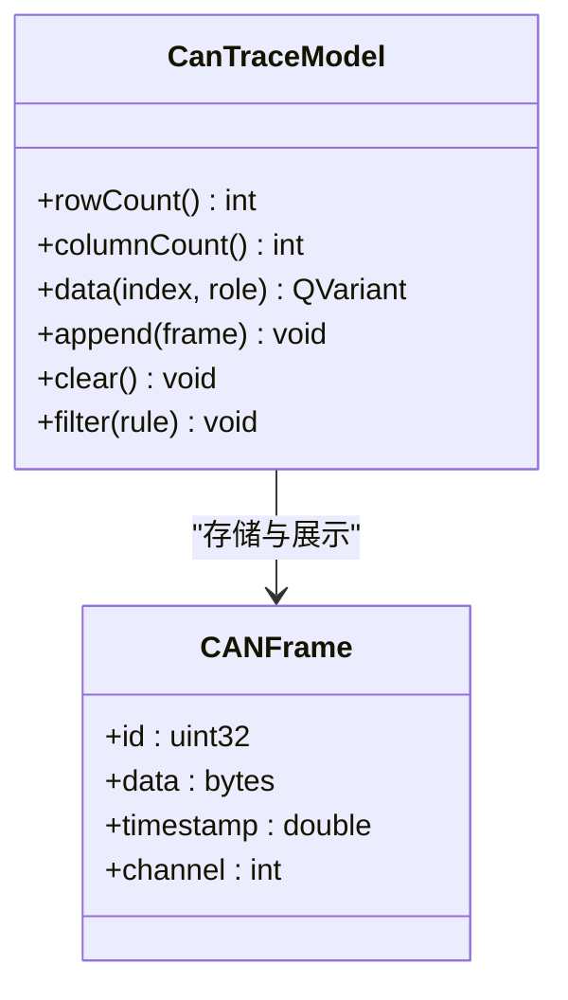

**图表来源** 
- [src/models/cantracemodel.h](file://src/models/cantracemodel.h)
- [src/models/cantracemodel.cpp](file://src/models/cantracemodel.cpp)
- [src/core/canframe.h](file://src/core/canframe.h)

**章节来源**
- [src/models/cantracemodel.h](file://src/models/cantracemodel.h)
- [src/models/cantracemodel.cpp](file://src/models/cantracemodel.cpp)
- [src/core/canframe.h](file://src/core/canframe.h)

### UI 主窗口（MainWindow）
- **职责**：应用入口、菜单/工具栏、面板容器、与模型/核心层交互。
- **关键点**：
  - 启动流程与资源加载。
  - 面板动态创建与状态同步。
  - 快捷键与全局事件分发。

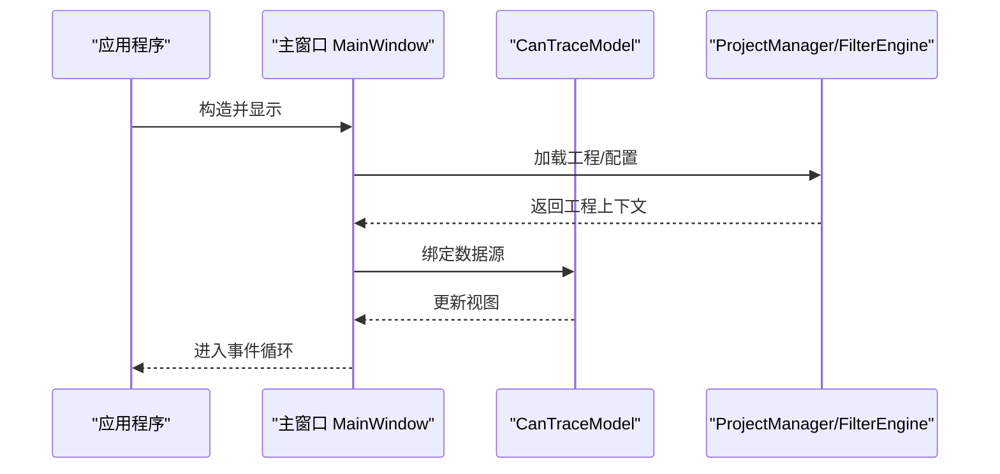

**图表来源** 
- [src/ui/mainwindow.h](file://src/ui/mainwindow.h)
- [src/ui/mainwindow.cpp](file://src/ui/mainwindow.cpp)
- [src/models/cantracemodel.h](file://src/models/cantracemodel.h)
- [src/core/projectmanager.h](file://src/core/projectmanager.h)
- [src/core/filter_engine.h](file://src/core/filter_engine.h)

**章节来源**
- [src/ui/mainwindow.h](file://src/ui/mainwindow.h)
- [src/ui/mainwindow.cpp](file://src/ui/mainwindow.cpp)
- [src/models/cantracemodel.h](file://src/models/cantracemodel.h)
- [src/core/projectmanager.h](file://src/core/projectmanager.h)
- [src/core/filter_engine.h](file://src/core/filter_engine.h)

### 概念性概览
下图展示了从 UI 触发到核心处理的典型流程，适用于大多数操作（如打开工程、应用过滤、刷新视图）。

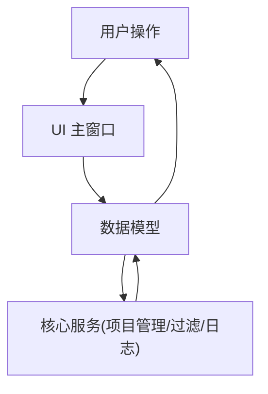

[本图为概念流程图，不直接映射具体代码文件]

## 依赖关系分析
- **构建系统**：顶层 CMake 与 src/CMakeLists.txt 组织模块与依赖。
- **第三方库**：dbcppp（DBC 解析）、spdlog（日志）、nlohmann_json（配置/序列化）、qcustomplot（图形绘制）。
- **资源与样式**：Qt 资源文件与样式表。

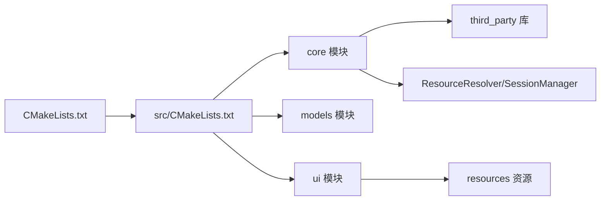

**图表来源** 
- [CMakeLists.txt](file://CMakeLists.txt)
- [src/CMakeLists.txt](file://src/CMakeLists.txt)

**章节来源**
- [CMakeLists.txt](file://CMakeLists.txt)
- [src/CMakeLists.txt](file://src/CMakeLists.txt)

## 性能考量
- **数据模型**：
  - 使用增量更新与批量插入减少 UI 重绘开销。
  - 分页与懒加载避免一次性加载大量数据。
- **过滤引擎**：
  - 预计算索引与位运算提升匹配速度。
  - 多线程过滤与队列缓冲降低阻塞。
- **日志系统**：
  - 异步写入与缓冲策略避免 I/O 阻塞。
  - 合理日志级别与轮转策略控制磁盘占用。
- **UI 渲染**：
  - 使用双缓冲与最小化重绘区域。
  - 按需加载与缓存高频数据。
- **路径解析优化**：
  - ResourceResolver缓存项目目录，避免重复计算。
  - 批量路径处理方法减少函数调用开销。

## 故障排查指南
- **工程加载失败**：
  - 检查工程路径与权限。
  - 查看日志中的解析错误与版本不兼容信息。
  - 确认JSON格式是否符合v2规范。
- **路径问题**：
  - 检查ResourceResolver是否正确处理相对路径。
  - 确认跨盘符路径未被错误相对化。
- **会话数据丢失**：
  - 检查sessions.json文件权限。
  - 验证AppConfig迁移是否成功。
- **过滤无结果**：
  - 确认规则语法与字段映射正确。
  - 检查 DBC 数据是否成功加载。
- **UI 卡顿**：
  - 观察模型更新频率与数据量。
  - 启用分页与延迟加载。
- **日志缺失**：
  - 检查日志级别与输出目标配置。
  - 确认磁盘空间与写入权限。

**章节来源**
- [src/core/logging.h](file://src/core/logging.h)
- [src/core/logging.cpp](file://src/core/logging.cpp)
- [src/core/projectmanager.h](file://src/core/projectmanager.h)
- [src/core/filter_engine.h](file://src/core/filter_engine.h)
- [src/core/resourceresolver.h](file://src/core/resourceresolver.h)
- [src/core/sessionmanager.h](file://src/core/sessionmanager.h)

## 结论
本项目管理系统以清晰的层次架构与模块化设计，实现了 CAN 数据工程的全生命周期管理与高效处理。通过v2格式升级，系统现在支持更丰富的元数据管理、设备配置和相对路径资源管理。配合合理的性能优化与完善的日志体系，系统在易用性与稳定性方面具备良好基础。建议后续加强单元测试与持续集成，进一步提升质量与可维护性。

**v2格式优势**：
- 增强的元数据跟踪能力
- 更好的资源路径管理
- 向后兼容的格式升级策略
- 独立的会话状态管理

## 附录
- **构建与运行**：
  - 使用 scripts/build.py 执行自动化构建流程。
  - 参考 README.md 获取环境要求与使用说明。
- **原型界面**：
  - UI/ui-prototype.html 提供界面布局原型，便于快速验证交互。
- **v2格式示例**：
  - EngineAnalysis.sinproj 展示了基本的项目文件格式。

**章节来源**
- [scripts/build.py](file://scripts/build.py)
- [README.md:1390-1430](file://README.md#L1390-L1430)
- [UI/ui-prototype.html](file://UI/ui-prototype.html)
- [EngineAnalysis.sinproj](file://EngineAnalysis.sinproj)