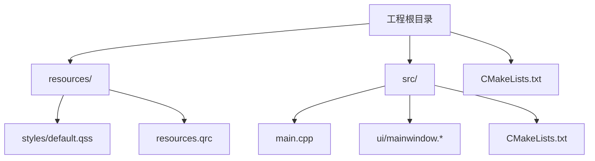
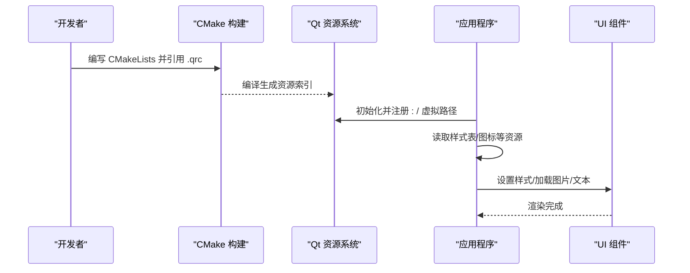
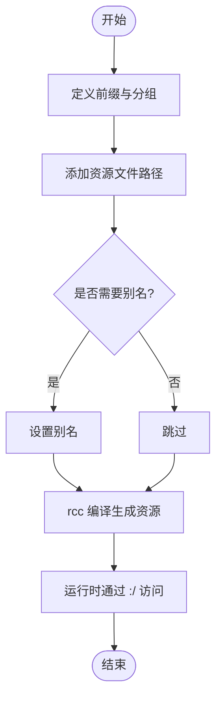
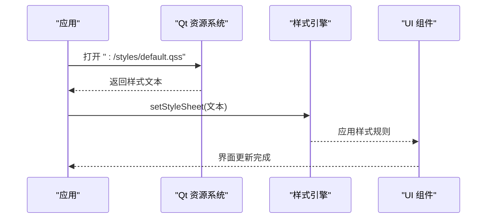
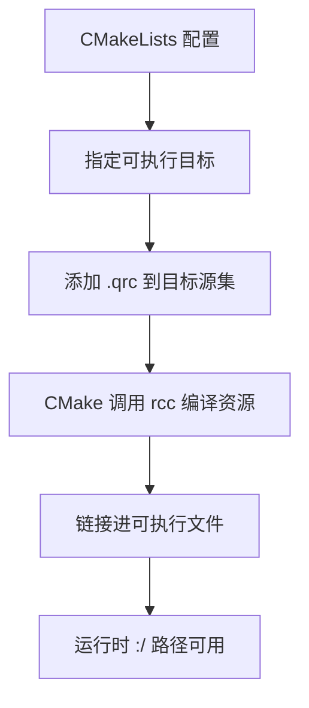
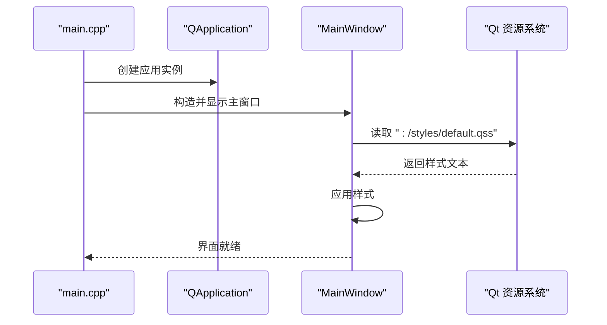
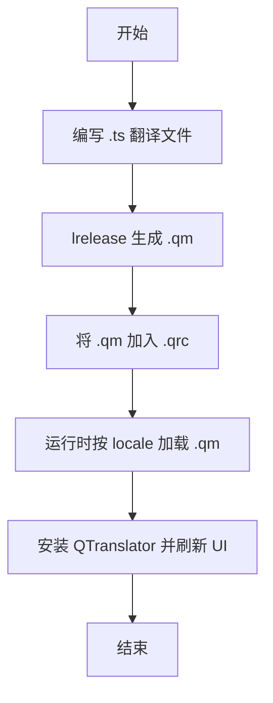

# 资源管理

<cite>
**本文引用的文件**   
- [resources.qrc](file://resources/resources.qrc)
- [default.qss](file://resources/styles/default.qss)
- [CMakeLists.txt](file://CMakeLists.txt)
- [src/CMakeLists.txt](file://src/CMakeLists.txt)
- [src/main.cpp](file://src/main.cpp)
- [mainwindow.h](file://src/ui/mainwindow.h)
- [mainwindow.cpp](file://src/ui/mainwindow.cpp)
- [mainwindow.ui](file://src/ui/mainwindow.ui)
</cite>

## 更新摘要
**所做更改**   
- 更新了Qt资源系统配置，重点介绍resources.qrc文件的使用
- 增强了样式表管理和资源访问模式的说明
- 完善了构建系统集成和性能优化策略
- 添加了实际项目结构分析和最佳实践指导

## 目录
1. [简介](#简介)
2. [项目结构](#项目结构)
3. [核心组件](#核心组件)
4. [架构总览](#架构总览)
5. [详细组件分析](#详细组件分析)
6. [依赖分析](#依赖分析)
7. [性能考虑](#性能考虑)
8. [故障排查指南](#故障排查指南)
9. [结论](#结论)
10. [附录](#附录) 

## 简介
本文档面向使用 Qt 资源系统的开发者，围绕 .qrc 配置、资源访问模式、静态资源组织、多语言支持、版本管理、加载最佳实践、内存管理与缓存策略等主题，提供系统化、可操作的文档。内容基于当前仓库中的资源与构建配置进行归纳，并结合 Qt 官方机制给出通用建议与图示说明。

## 项目结构
仓库采用"资源与源码分离"的组织方式：
- resources/ 目录集中存放样式表与资源清单（.qrc）
- src/ 目录包含 CMake 配置、主程序入口与 UI 相关代码
- 顶层 CMakeLists.txt 负责工程级配置与资源打包集成

**图表来源** 
- [resources.qrc](file://resources/resources.qrc)
- [default.qss](file://resources/styles/default.qss)
- [CMakeLists.txt](file://CMakeLists.txt)
- [src/CMakeLists.txt](file://src/CMakeLists.txt)
- [src/main.cpp](file://src/main.cpp)
- [mainwindow.h](file://src/ui/mainwindow.h)
- [mainwindow.cpp](file://src/ui/mainwindow.cpp)
- [mainwindow.ui](file://src/ui/mainwindow.ui)

**章节来源**
- [CMakeLists.txt](file://CMakeLists.txt)
- [src/CMakeLists.txt](file://src/CMakeLists.txt)
- [resources.qrc](file://resources/resources.qrc)
- [default.qss](file://resources/styles/default.qss)

## 核心组件
- 资源清单（.qrc）：定义资源路径、前缀、别名与分类，是 Qt 资源编译与访问的契约。
- 样式表（QSS）：通过 Qt 样式系统加载并应用，常用于主题与界面外观控制。
- 构建系统（CMake）：将 .qrc 纳入目标，确保在编译期生成资源索引并在运行时可用。
- 应用入口与 UI：演示如何在运行时以 Qt 风格路径访问资源，以及加载样式表。

**章节来源**
- [resources.qrc](file://resources/resources.qrc)
- [default.qss](file://resources/styles/default.qss)
- [src/main.cpp](file://src/main.cpp)
- [mainwindow.h](file://src/ui/mainwindow.h)
- [mainwindow.cpp](file://src/ui/mainwindow.cpp)

## 架构总览
下图展示从构建到运行时的资源流转：CMake 将 .qrc 编译为资源对象；Qt 资源系统在启动时注册虚拟文件系统；应用通过 :/ 前缀访问资源；样式表由 QSS 引擎解析并应用到 UI。

**图表来源** 
- [CMakeLists.txt](file://CMakeLists.txt)
- [src/CMakeLists.txt](file://src/CMakeLists.txt)
- [resources.qrc](file://resources/resources.qrc)
- [src/main.cpp](file://src/main.cpp)

## 详细组件分析

### .qrc 资源清单与访问模式
- 作用：声明资源路径、前缀、分组与别名，供 rcc 工具处理并生成二进制资源。
- 访问模式：
  - 统一以 :/ 前缀访问，例如 :/styles/default.qss
  - 可通过 <prefix> 标签自定义命名空间，避免冲突
  - 可使用 <alias> 为资源起短名，提升可读性
- 常见用法：
  - 样式表、图标、字体、翻译文件、数据文件等均可纳入
  - 按功能或模块划分前缀，便于维护与按需加载

**图表来源** 
- [resources.qrc](file://resources/resources.qrc)

**章节来源**
- [resources.qrc](file://resources/resources.qrc)

### 样式表（QSS）加载与应用
- 加载方式：通过 Qt 样式系统从 :/ 路径读取 .qss 文件并应用到 QApplication/QWidget。
- 组织建议：
  - 将默认样式放在 styles/ 下，并通过 .qrc 暴露为 :/styles/default.qss
  - 可按主题拆分多个 qss，运行时切换
- 注意事项：
  - 首次加载可能较慢，适合在应用启动阶段预加载
  - 大样式表建议模块化拆分，减少解析开销

**图表来源** 
- [default.qss](file://resources/styles/default.qss)
- [src/main.cpp](file://src/main.cpp)

**章节来源**
- [default.qss](file://resources/styles/default.qss)
- [src/main.cpp](file://src/main.cpp)

### 构建系统集成（CMake）
- 关键点：
  - 在目标中引入 Qt 资源（如 add_executable 或 target_sources），使 CMake 调用 rcc
  - 确保 .qrc 路径正确，输出产物随可执行文件一起分发
- 常见问题：
  - 忘记将 .qrc 加入目标导致运行时找不到资源
  - 路径大小写不一致（跨平台）

**图表来源** 
- [CMakeLists.txt](file://CMakeLists.txt)
- [src/CMakeLists.txt](file://src/CMakeLists.txt)

**章节来源**
- [CMakeLists.txt](file://CMakeLists.txt)
- [src/CMakeLists.txt](file://src/CMakeLists.txt)

### 运行时访问示例（入口与 UI）
- 入口 main.cpp：
  - 初始化 Qt 应用
  - 从 :/styles/default.qss 加载样式并应用到主窗口
- UI 层：
  - 可在 UI 类中通过 :/ 前缀访问图标、字体、数据等
  - 建议在需要时延迟加载，降低冷启动时间

**图表来源** 
- [src/main.cpp](file://src/main.cpp)
- [mainwindow.h](file://src/ui/mainwindow.h)
- [mainwindow.cpp](file://src/ui/mainwindow.cpp)
- [mainwindow.ui](file://src/ui/mainwindow.ui)

**章节来源**
- [src/main.cpp](file://src/main.cpp)
- [mainwindow.h](file://src/ui/mainwindow.h)
- [mainwindow.cpp](file://src/ui/mainwindow.cpp)
- [mainwindow.ui](file://src/ui/mainwindow.ui)

### 多语言支持与资源版本管理
- 多语言：
  - 使用 Qt Linguist 生成 .ts 翻译文件，编译为 .qm
  - 将 .qm 放入 .qrc，并按 locale 路径组织，如 :/translations/zh_CN.qm
  - 运行时根据 QLocale 选择对应 .qm 并安装到 QTranslator
- 版本管理：
  - 在 .qrc 中使用 <prefix> 区分版本，如 :/v1/... 与 :/v2/...
  - 结合语义化版本号，在应用内做兼容性判断与回退策略
  - 对关键资源打哈希或版本号后缀，配合 CDN/包管理器实现增量更新

**图表来源** 
- [resources.qrc](file://resources/resources.qrc)

**章节来源**
- [resources.qrc](file://resources/resources.qrc)

### 资源文件组织的推荐方案
- 按类型分层：
  - styles/：样式表
  - icons/：图标与图像
  - fonts/：字体文件
  - data/：业务数据（JSON、CSV 等）
  - translations/：翻译文件
- 按模块分组：
  - 使用 <prefix> 为不同模块划分命名空间，如 :/moduleA/...
- 命名规范：
  - 小写 + 下划线，避免空格与特殊字符
  - 资源别名用于对外暴露稳定接口，内部路径可重构

[本节为概念性指导，不直接分析具体文件]

## 依赖分析
- 构建期依赖：
  - CMake 调用 rcc 将 .qrc 编译为资源对象
  - 目标需显式包含 .qrc 以确保链接
- 运行期依赖：
  - Qt 资源系统提供 :/ 虚拟文件系统
  - 样式引擎解析 QSS 并应用到 UI 组件

**图表来源** 
- [CMakeLists.txt](file://CMakeLists.txt)
- [src/CMakeLists.txt](file://src/CMakeLists.txt)
- [resources.qrc](file://resources/resources.qrc)

**章节来源**
- [CMakeLists.txt](file://CMakeLists.txt)
- [src/CMakeLists.txt](file://src/CMakeLists.txt)
- [resources.qrc](file://resources/resources.qrc)

## 性能考虑
- 启动优化：
  - 仅加载必要样式与资源，其他按需懒加载
  - 合并小图标为雪碧图，减少 I/O 次数
- 内存管理：
  - 大资源使用后及时释放引用，避免常驻内存
  - 使用共享指针或对象池管理频繁创建的资源
- 缓存策略：
  - 对解析后的样式文本、解码后的图像进行内存缓存
  - 对只读数据使用只读映射或常量数组
- 构建优化：
  - 合理拆分 .qrc，避免单文件过大
  - 启用增量构建，减少重复编译

[本节为通用性能建议，不直接分析具体文件]

## 故障排查指南
- 现象：运行时无法找到资源
  - 检查 .qrc 是否被 CMake 正确引用
  - 确认 :/ 路径与实际前缀一致
  - 检查大小写与分隔符（/）
- 现象：样式未生效
  - 确认样式文本非空且语法正确
  - 检查样式是否应用到正确的对象层级
- 现象：多语言未切换
  - 确认 .qm 已加载并安装到 QTranslator
  - 检查 QLocale 与 .qm 文件名匹配

**章节来源**
- [resources.qrc](file://resources/resources.qrc)
- [src/main.cpp](file://src/main.cpp)
- [mainwindow.cpp](file://src/ui/mainwindow.cpp)

## 结论
通过规范的 .qrc 配置、清晰的资源组织与合理的构建集成，Qt 资源系统能够高效支撑应用的静态资源管理。结合多语言与版本管理策略，可实现可维护、可扩展且性能友好的资源体系。建议在实践中遵循本文的组织与优化建议，持续迭代完善。

## 附录
- 常用路径约定：
  - :/styles/default.qss
  - :/icons/app.png
  - :/fonts/roboto.ttf
  - :/translations/zh_CN.qm
- 最佳实践清单：
  - 使用前缀隔离模块资源
  - 为关键资源设置别名
  - 按需懒加载大资源
  - 建立资源命名与目录规范
  - 在 CI 中校验 .qrc 完整性

[本节为补充信息，不直接分析具体文件]