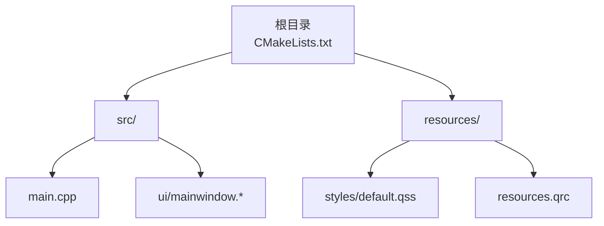
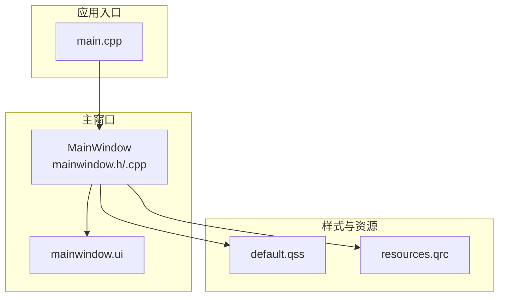
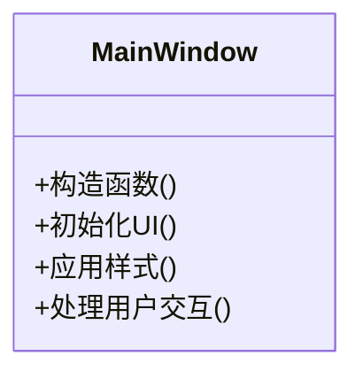
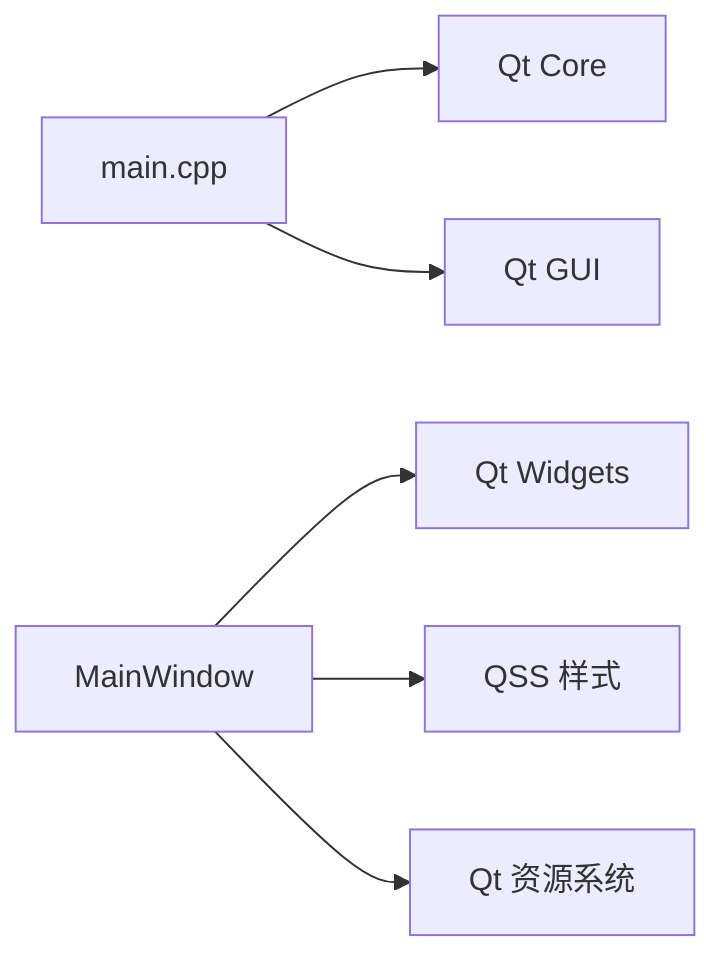

# 项目概述

<cite>
**本文引用的文件**   
- [CMakeLists.txt](file://CMakeLists.txt)
- [src/CMakeLists.txt](file://src/CMakeLists.txt)
- [src/main.cpp](file://src/main.cpp)
- [src/ui/mainwindow.h](file://src/ui/mainwindow.h)
- [src/ui/mainwindow.cpp](file://src/ui/mainwindow.cpp)
- [src/ui/mainwindow.ui](file://src/ui/mainwindow.ui)
- [resources/styles/default.qss](file://resources/styles/default.qss)
- [resources/resources.qrc](file://resources/resources.qrc)
- [README.en.md](file://README.en.md)
</cite>

## 目录
1. [简介](#简介)
2. [项目结构](#项目结构)
3. [核心组件](#核心组件)
4. [架构总览](#架构总览)
5. [详细组件分析](#详细组件分析)
6. [依赖关系分析](#依赖关系分析)
7. [性能考虑](#性能考虑)
8. [故障排查指南](#故障排查指南)
9. [结论](#结论)
10. [附录](#附录)

## 简介
本项目是一个基于 Qt/C++ 的桌面应用程序，采用 CMake 进行构建与配置。整体目标是为桌面端提供统一的界面入口、样式管理与资源组织方式，并通过模块化设计将主窗口、UI 布局与样式资源解耦，便于扩展与维护。技术栈以 Qt（Widgets）为核心，配合 Qt 资源系统与 QSS 样式表实现跨平台一致的视觉表现。

## 项目结构
项目采用分层与按功能划分相结合的目录组织方式：
- src：源代码目录，包含应用入口、主窗口逻辑与 UI 定义
- resources：静态资源目录，包含样式表与 Qt 资源索引
- 根级 CMakeLists.txt：顶层构建配置，协调子模块与资源打包
- README.en.md：英文说明文档（可作为补充阅读）

图表来源 
- [CMakeLists.txt](file://CMakeLists.txt)
- [src/CMakeLists.txt](file://src/CMakeLists.txt)
- [src/main.cpp](file://src/main.cpp)
- [src/ui/mainwindow.h](file://src/ui/mainwindow.h)
- [src/ui/mainwindow.cpp](file://src/ui/mainwindow.cpp)
- [src/ui/mainwindow.ui](file://src/ui/mainwindow.ui)
- [resources/styles/default.qss](file://resources/styles/default.qss)
- [resources/resources.qrc](file://resources/resources.qrc)

章节来源
- [CMakeLists.txt](file://CMakeLists.txt)
- [src/CMakeLists.txt](file://src/CMakeLists.txt)
- [src/main.cpp](file://src/main.cpp)
- [src/ui/mainwindow.h](file://src/ui/mainwindow.h)
- [src/ui/mainwindow.cpp](file://src/ui/mainwindow.cpp)
- [src/ui/mainwindow.ui](file://src/ui/mainwindow.ui)
- [resources/styles/default.qss](file://resources/styles/default.qss)
- [resources/resources.qrc](file://resources/resources.qrc)

## 核心组件
- 应用入口 main.cpp：负责 Qt 应用生命周期初始化、全局设置与主窗口创建展示
- 主窗口 MainWindow：承载应用主界面，管理菜单/工具栏/状态栏等 UI 元素，并协调业务交互
- UI 布局 mainwindow.ui：通过 Qt Designer 定义的界面结构与控件层次
- 样式系统 default.qss：集中式样式表，统一外观主题与控件风格
- 资源索引 resources.qrc：Qt 资源编译与访问的统一入口

职责分工：
- 主窗口管理：MainWindow 负责界面容器与事件分发
- 样式系统：QSS 文件集中管理视觉样式，避免硬编码样式
- 资源管理：qrc 统一管理图标、图片、样式等资源路径，提升可移植性

章节来源
- [src/main.cpp](file://src/main.cpp)
- [src/ui/mainwindow.h](file://src/ui/mainwindow.h)
- [src/ui/mainwindow.cpp](file://src/ui/mainwindow.cpp)
- [src/ui/mainwindow.ui](file://src/ui/mainwindow.ui)
- [resources/styles/default.qss](file://resources/styles/default.qss)
- [resources/resources.qrc](file://resources/resources.qrc)

## 架构总览
本项目的架构遵循“入口—主窗口—UI—样式—资源”的分层模式：
- 入口层：main.cpp 初始化 QApplication/QGuiApplication，加载样式，启动主窗口
- 表现层：MainWindow 作为主容器，组合 UI 控件与行为
- 视图层：mainwindow.ui 描述界面布局与控件树
- 样式层：default.qss 提供全局样式覆盖
- 资源层：resources.qrc 提供资源编译与运行时访问

图表来源 
- [src/main.cpp](file://src/main.cpp)
- [src/ui/mainwindow.h](file://src/ui/mainwindow.h)
- [src/ui/mainwindow.cpp](file://src/ui/mainwindow.cpp)
- [src/ui/mainwindow.ui](file://src/ui/mainwindow.ui)
- [resources/styles/default.qss](file://resources/styles/default.qss)
- [resources/resources.qrc](file://resources/resources.qrc)

## 详细组件分析

### 应用入口（main.cpp）
- 负责创建 Qt 应用实例、设置全局属性（如高 DPI、字体缩放等）、加载样式表并显示主窗口
- 控制应用生命周期，确保异常退出时资源正确释放

章节来源
- [src/main.cpp](file://src/main.cpp)

### 主窗口（MainWindow）
- 继承自 Qt 主窗口基类，封装界面容器与交互逻辑
- 在构造函数或初始化方法中完成 UI 绑定、信号槽连接与样式应用
- 与 UI 文件解耦，通过代码驱动行为，保持界面与逻辑清晰分离

图表来源 
- [src/ui/mainwindow.h](file://src/ui/mainwindow.h)
- [src/ui/mainwindow.cpp](file://src/ui/mainwindow.cpp)

章节来源
- [src/ui/mainwindow.h](file://src/ui/mainwindow.h)
- [src/ui/mainwindow.cpp](file://src/ui/mainwindow.cpp)

### UI 布局（mainwindow.ui）
- 使用 Qt Designer 可视化编辑界面，定义控件层级、布局策略与初始属性
- 与 .h/.cpp 分离，便于设计师与开发者协作

章节来源
- [src/ui/mainwindow.ui](file://src/ui/mainwindow.ui)

### 样式系统（default.qss）
- 集中管理所有控件样式，支持主题切换与多分辨率适配
- 通过 qss 语法统一设置颜色、字体、边距、边框等

章节来源
- [resources/styles/default.qss](file://resources/styles/default.qss)

### 资源管理（resources.qrc）
- 定义资源前缀与文件映射，供 Qt 资源系统编译为二进制资源
- 通过 :/ 前缀在代码中引用资源，提高可移植性与部署便利性

章节来源
- [resources/resources.qrc](file://resources/resources.qrc)

### 构建配置（CMakeLists）
- 根级 CMakeLists.txt 协调子模块与资源打包
- src/CMakeLists.txt 定义 Qt 模块依赖、源文件集合与输出目标

章节来源
- [CMakeLists.txt](file://CMakeLists.txt)
- [src/CMakeLists.txt](file://src/CMakeLists.txt)

## 依赖关系分析
- Qt Widgets：用于构建桌面 GUI
- Qt Core/GUI：基础类型与图形接口
- CMake：构建系统
- Qt 资源系统：qrc 编译与运行时访问
- QSS：样式表引擎

图表来源 
- [src/main.cpp](file://src/main.cpp)
- [src/ui/mainwindow.h](file://src/ui/mainwindow.h)
- [src/ui/mainwindow.cpp](file://src/ui/mainwindow.cpp)
- [resources/styles/default.qss](file://resources/styles/default.qss)
- [resources/resources.qrc](file://resources/resources.qrc)

章节来源
- [CMakeLists.txt](file://CMakeLists.txt)
- [src/CMakeLists.txt](file://src/CMakeLists.txt)
- [src/main.cpp](file://src/main.cpp)
- [src/ui/mainwindow.h](file://src/ui/mainwindow.h)
- [src/ui/mainwindow.cpp](file://src/ui/mainwindow.cpp)
- [resources/styles/default.qss](file://resources/styles/default.qss)
- [resources/resources.qrc](file://resources/resources.qrc)

## 性能考虑
- 样式加载：建议在应用启动时一次性加载 QSS，避免重复解析
- 资源访问：通过 qrc 访问资源可减少 I/O 开销，提升启动速度
- UI 初始化：延迟加载复杂控件或按需初始化，减少首屏渲染时间
- 事件处理：合理拆分信号槽，避免在主线程执行耗时操作

[本节为通用指导，不直接分析具体文件]

## 故障排查指南
- 样式未生效：检查 QSS 文件路径与 qrc 注册是否正确；确认样式加载顺序与优先级
- 资源无法找到：核对 qrc 中的前缀与路径是否与代码引用一致；确保资源已参与构建
- 主窗口空白：检查 UI 文件是否被正确生成并链接；确认主窗口构造函数中 UI 初始化未被跳过
- 构建失败：检查 CMake 配置中的 Qt 模块依赖与源文件列表是否完整

章节来源
- [resources/styles/default.qss](file://resources/styles/default.qss)
- [resources/resources.qrc](file://resources/resources.qrc)
- [src/ui/mainwindow.ui](file://src/ui/mainwindow.ui)
- [src/ui/mainwindow.cpp](file://src/ui/mainwindow.cpp)
- [CMakeLists.txt](file://CMakeLists.txt)
- [src/CMakeLists.txt](file://src/CMakeLists.txt)

## 结论
本项目以清晰的模块化设计与统一的样式/资源管理为基础，提供了可扩展的 Qt 桌面应用骨架。通过主窗口管理、QSS 样式系统与 qrc 资源系统的职责分离，既保证了界面的可维护性，也提升了跨平台一致性。建议在此基础上继续完善业务模块与插件化能力，以满足更复杂的桌面应用场景。

[本节为总结性内容，不直接分析具体文件]

## 附录
- 系统要求与依赖
  - 操作系统：Windows / macOS / Linux（基于 Qt 支持的版本）
  - 编译器：支持 C++11/14 的现代编译器（GCC/Clang/MSVC）
  - 构建工具：CMake 3.x+
  - Qt 版本：Qt 5.x 或 Qt 6.x（根据 CMakeLists 配置确定）
- 主要特性与应用场景
  - 统一的桌面主窗口框架，适合工具类、编辑器、数据查看器等
  - 集中式样式管理，便于主题定制与品牌化
  - 资源内嵌与热更新友好，适合需要频繁更换素材的应用

章节来源
- [README.en.md](file://README.en.md)
- [CMakeLists.txt](file://CMakeLists.txt)
- [src/CMakeLists.txt](file://src/CMakeLists.txt)