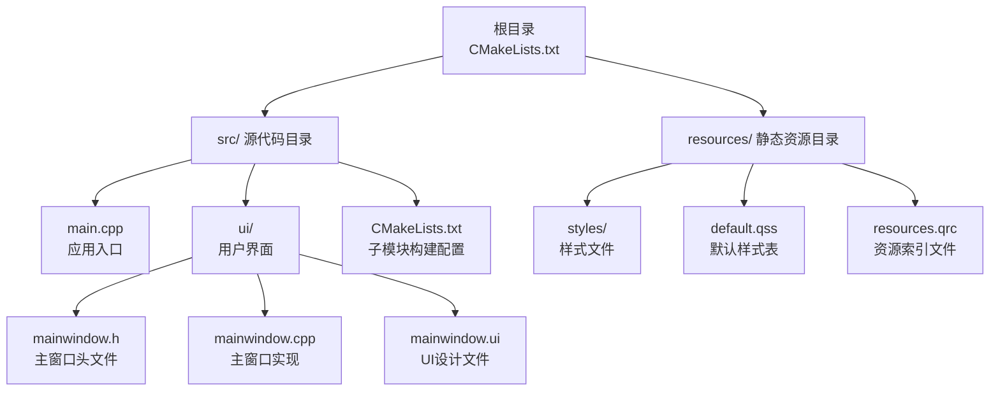
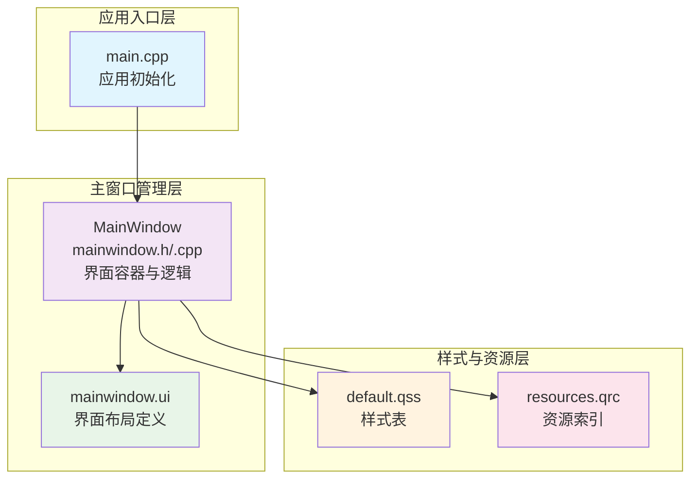
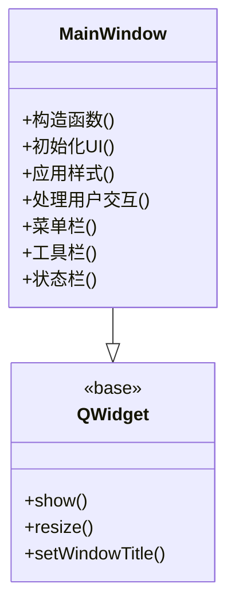
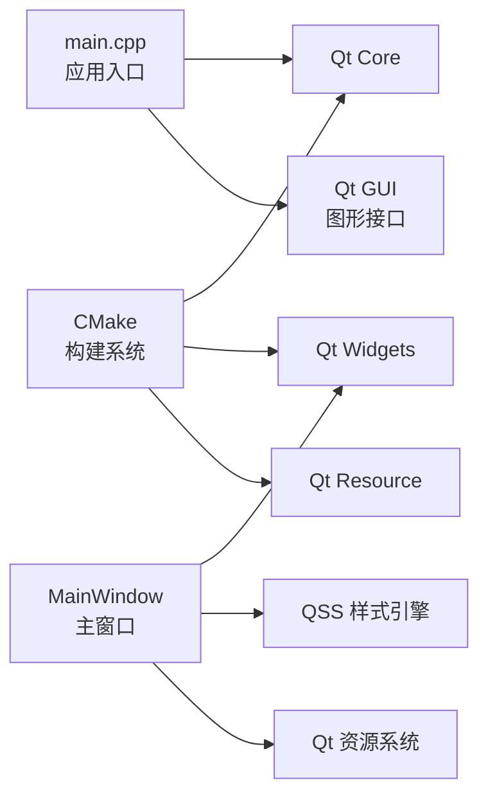

# 项目概述

<cite>
**本文引用的文件**   
- [CMakeLists.txt](file://CMakeLists.txt)
- [src/CMakeLists.txt](file://src/CMakeLists.txt)
- [src/main.cpp](file://src/main.cpp)
- [src/ui/mainwindow.h](file://src/ui/mainwindow.h)
- [src/ui/mainwindow.cpp](file://src/ui/mainwindow.cpp)
- [src/ui/mainwindow.ui](file://src/ui/mainwindow.ui)
- [resources/styles/default.qss](file://resources/styles/default.qss)
- [resources/resources.qrc](file://resources/resources.qrc)
- [README.en.md](file://README.en.md)
</cite>

## 更新摘要
**所做更改**
- 更新了项目架构描述以反映初始Qt/C++桌面应用程序设置
- 增强了CMake构建系统的详细说明
- 完善了主窗口实现和资源管理的职责分工
- 添加了更具体的技术栈和依赖关系分析

## 目录
1. [简介](#简介)
2. [项目结构](#项目结构)
3. [核心组件](#核心组件)
4. [架构总览](#架构总览)
5. [详细组件分析](#详细组件分析)
6. [依赖关系分析](#依赖关系分析)
7. [性能考虑](#性能考虑)
8. [故障排查指南](#故障排查指南)
9. [结论](#结论)
10. [附录](#附录)

## 简介
本项目是一个基于 Qt/C++ 的现代化桌面应用程序，采用 CMake 作为构建系统进行配置和管理。项目的核心目标是为桌面端提供一个统一的界面入口、样式管理与资源组织方式，并通过模块化设计将主窗口、UI 布局与样式资源解耦，便于扩展与维护。

技术栈以 Qt（Widgets）为核心框架，配合 Qt 资源系统与 QSS 样式表实现跨平台一致的视觉表现。项目采用了标准的 Qt 应用开发模式，包括主窗口管理、信号槽机制、事件处理等核心特性。

## 项目结构
项目采用分层与按功能划分相结合的目录组织方式，体现了清晰的模块化设计：

**目录结构说明：**
- **src/**：源代码目录，包含应用入口、主窗口逻辑与 UI 定义
- **resources/**：静态资源目录，包含样式表与 Qt 资源索引
- **根级 CMakeLists.txt**：顶层构建配置，协调子模块与资源打包
- **README.en.md**：英文说明文档（可作为补充阅读）

**章节来源**
- [CMakeLists.txt](file://CMakeLists.txt)
- [src/CMakeLists.txt](file://src/CMakeLists.txt)
- [src/main.cpp](file://src/main.cpp)
- [src/ui/mainwindow.h](file://src/ui/mainwindow.h)
- [src/ui/mainwindow.cpp](file://src/ui/mainwindow.cpp)
- [src/ui/mainwindow.ui](file://src/ui/mainwindow.ui)
- [resources/styles/default.qss](file://resources/styles/default.qss)
- [resources/resources.qrc](file://resources/resources.qrc)

## 核心组件
项目由以下核心组件构成，每个组件都有明确的职责分工：

### 应用入口（main.cpp）
- 负责 Qt 应用生命周期初始化、全局设置与主窗口创建展示
- 配置应用程序属性（如高 DPI 支持、字体缩放等）
- 加载全局样式表并启动主窗口
- 控制应用生命周期，确保异常退出时资源正确释放

### 主窗口（MainWindow）
- 继承自 Qt 主窗口基类，封装界面容器与交互逻辑
- 在构造函数或初始化方法中完成 UI 绑定、信号槽连接与样式应用
- 管理菜单、工具栏、状态栏等标准 UI 元素
- 协调业务交互与事件处理

### UI 布局（mainwindow.ui）
- 使用 Qt Designer 可视化编辑界面，定义控件层级、布局策略与初始属性
- 与 .h/.cpp 分离，便于设计师与开发者协作
- 支持拖拽式界面设计和实时预览

### 样式系统（default.qss）
- 集中管理所有控件样式，支持主题切换与多分辨率适配
- 通过 qss 语法统一设置颜色、字体、边距、边框等
- 提供一致的用户体验和品牌化外观

### 资源管理（resources.qrc）
- 定义资源前缀与文件映射，供 Qt 资源系统编译为二进制资源
- 通过 :/ 前缀在代码中引用资源，提高可移植性与部署便利性
- 统一管理图标、图片、样式等资源文件

**职责分工：**
- **主窗口管理**：MainWindow 负责界面容器与事件分发
- **样式系统**：QSS 文件集中管理视觉样式，避免硬编码样式
- **资源管理**：qrc 统一管理图标、图片、样式等资源路径，提升可移植性

**章节来源**
- [src/main.cpp](file://src/main.cpp)
- [src/ui/mainwindow.h](file://src/ui/mainwindow.h)
- [src/ui/mainwindow.cpp](file://src/ui/mainwindow.cpp)
- [src/ui/mainwindow.ui](file://src/ui/mainwindow.ui)
- [resources/styles/default.qss](file://resources/styles/default.qss)
- [resources/resources.qrc](file://resources/resources.qrc)

## 架构总览
本项目的架构遵循"入口—主窗口—UI—样式—资源"的分层模式，体现了清晰的责任分离：

**架构层次说明：**
- **入口层**：main.cpp 初始化 QApplication/QGuiApplication，加载样式，启动主窗口
- **表现层**：MainWindow 作为主容器，组合 UI 控件与行为
- **视图层**：mainwindow.ui 描述界面布局与控件树
- **样式层**：default.qss 提供全局样式覆盖
- **资源层**：resources.qrc 提供资源编译与运行时访问

**图表来源**
- [src/main.cpp](file://src/main.cpp)
- [src/ui/mainwindow.h](file://src/ui/mainwindow.h)
- [src/ui/mainwindow.cpp](file://src/ui/mainwindow.cpp)
- [src/ui/mainwindow.ui](file://src/ui/mainwindow.ui)
- [resources/styles/default.qss](file://resources/styles/default.qss)
- [resources/resources.qrc](file://resources/resources.qrc)

## 详细组件分析

### 应用入口（main.cpp）
应用入口是整个程序的起点，负责：
- 创建 Qt 应用实例并配置全局属性
- 设置应用程序元数据（名称、版本、组织信息等）
- 加载全局样式表和字体配置
- 创建并显示主窗口实例
- 进入 Qt 事件循环，处理用户交互

**章节来源**
- [src/main.cpp](file://src/main.cpp)

### 主窗口（MainWindow）
主窗口是应用的核心容器，实现了：
- 继承 Qt 主窗口基类，提供标准窗口功能
- 在构造函数中完成 UI 初始化与绑定
- 建立信号槽连接，处理用户交互事件
- 集成样式系统和资源管理
- 提供扩展点供业务逻辑接入

**图表来源**
- [src/ui/mainwindow.h](file://src/ui/mainwindow.h)
- [src/ui/mainwindow.cpp](file://src/ui/mainwindow.cpp)

**章节来源**
- [src/ui/mainwindow.h](file://src/ui/mainwindow.h)
- [src/ui/mainwindow.cpp](file://src/ui/mainwindow.cpp)

### UI 布局（mainwindow.ui）
UI 文件使用 Qt Designer 进行可视化编辑：
- 定义控件层级结构和布局策略
- 设置控件属性、尺寸和位置
- 配置信号槽连接的可视化界面
- 支持响应式布局和自适应设计

**章节来源**
- [src/ui/mainwindow.ui](file://src/ui/mainwindow.ui)

### 样式系统（default.qss）
样式系统提供了统一的视觉表现：
- 集中管理所有控件的样式定义
- 支持主题切换和动态样式更新
- 提供跨平台一致的视觉效果
- 支持媒体查询和条件样式

**章节来源**
- [resources/styles/default.qss](file://resources/styles/default.qss)

### 资源管理（resources.qrc）
资源管理系统确保了资源的统一访问：
- 定义资源前缀和文件映射关系
- 编译资源为二进制格式，提高加载效率
- 支持运行时资源访问和热更新
- 提供类型安全的资源引用机制

**章节来源**
- [resources/resources.qrc](file://resources/resources.qrc)

### 构建配置（CMakeLists）
CMake 构建系统提供了灵活的构建配置：
- 根级 CMakeLists.txt 协调子模块与资源打包
- src/CMakeLists.txt 定义 Qt 模块依赖、源文件集合与输出目标
- 支持多平台构建和交叉编译
- 集成 Qt 自动化工具（MOC、UIC、RCC）

**章节来源**
- [CMakeLists.txt](file://CMakeLists.txt)
- [src/CMakeLists.txt](file://src/CMakeLists.txt)

## 依赖关系分析
项目依赖于以下核心组件和库：

**主要依赖：**
- **Qt Widgets**：用于构建桌面 GUI 界面
- **Qt Core/GUI**：基础类型与图形接口
- **CMake**：现代构建系统，支持跨平台编译
- **Qt 资源系统**：qrc 编译与运行时访问
- **QSS**：Qt 样式表引擎，提供 CSS 风格的样式定义

**章节来源**
- [CMakeLists.txt](file://CMakeLists.txt)
- [src/CMakeLists.txt](file://src/CMakeLists.txt)
- [src/main.cpp](file://src/main.cpp)
- [src/ui/mainwindow.h](file://src/ui/mainwindow.h)
- [src/ui/mainwindow.cpp](file://src/ui/mainwindow.cpp)
- [resources/styles/default.qss](file://resources/styles/default.qss)
- [resources/resources.qrc](file://resources/resources.qrc)

## 性能考虑
为了获得最佳的性能表现，项目采用了以下优化策略：

### 启动优化
- **样式预加载**：在应用启动时一次性加载 QSS，避免重复解析开销
- **资源内嵌**：通过 qrc 访问资源可减少 I/O 开销，提升启动速度
- **延迟初始化**：复杂控件按需初始化，减少首屏渲染时间

### 运行时优化
- **事件处理优化**：合理拆分信号槽，避免在主线程执行耗时操作
- **内存管理**：利用 Qt 的对象树机制自动管理内存
- **绘制优化**：合理使用双缓冲和重绘区域

### 构建优化
- **增量编译**：CMake 支持增量构建，加快开发迭代速度
- **并行编译**：利用多核处理器加速编译过程
- **链接优化**：启用适当的编译器优化选项

## 故障排查指南
遇到常见问题时的排查步骤：

### 样式问题
- **样式未生效**：检查 QSS 文件路径与 qrc 注册是否正确；确认样式加载顺序与优先级
- **样式冲突**：检查选择器优先级和继承关系
- **跨平台差异**：验证不同平台上的样式兼容性

### 资源问题
- **资源无法找到**：核对 qrc 中的前缀与路径是否与代码引用一致；确保资源已参与构建
- **资源加载失败**：检查文件格式支持和编码问题
- **资源大小过大**：考虑使用压缩和优化资源文件

### UI 问题
- **主窗口空白**：检查 UI 文件是否被正确生成并链接；确认主窗口构造函数中 UI 初始化未被跳过
- **控件不显示**：验证布局设置和可见性属性
- **事件不响应**：检查信号槽连接和事件过滤器

### 构建问题
- **构建失败**：检查 CMake 配置中的 Qt 模块依赖与源文件列表是否完整
- **链接错误**：确认 Qt 库路径和版本匹配
- **运行时崩溃**：检查调试符号和堆栈跟踪信息

**章节来源**
- [resources/styles/default.qss](file://resources/styles/default.qss)
- [resources/resources.qrc](file://resources/resources.qrc)
- [src/ui/mainwindow.ui](file://src/ui/mainwindow.ui)
- [src/ui/mainwindow.cpp](file://src/ui/mainwindow.cpp)
- [CMakeLists.txt](file://CMakeLists.txt)
- [src/CMakeLists.txt](file://src/CMakeLists.txt)

## 结论
本项目以清晰的模块化设计与统一的样式/资源管理为基础，提供了可扩展的 Qt 桌面应用骨架。通过主窗口管理、QSS 样式系统与 qrc 资源系统的职责分离，既保证了界面的可维护性，也提升了跨平台一致性。

项目的架构设计遵循了良好的软件工程原则：
- **关注点分离**：UI、样式、资源各司其职
- **模块化设计**：易于扩展和维护
- **跨平台兼容**：基于 Qt 框架的跨平台能力
- **构建系统现代化**：使用 CMake 进行工程管理

建议在此基础上继续完善业务模块与插件化能力，以满足更复杂的桌面应用场景。

## 附录

### 系统要求与依赖
- **操作系统**：Windows / macOS / Linux（基于 Qt 支持的版本）
- **编译器**：支持 C++11/14 的现代编译器（GCC/Clang/MSVC）
- **构建工具**：CMake 3.x+
- **Qt 版本**：Qt 5.x 或 Qt 6.x（根据 CMakeLists 配置确定）
- **IDE 推荐**：Qt Creator、Visual Studio、CLion

### 主要特性与应用场景
- **统一的桌面主窗口框架**：适合工具类、编辑器、数据查看器等
- **集中式样式管理**：便于主题定制与品牌化
- **资源内嵌与热更新友好**：适合需要频繁更换素材的应用
- **跨平台兼容性**：一次开发，多平台部署

### 开发环境搭建
1. 安装 Qt 开发套件（包含 Qt 框架和 Qt Creator）
2. 安装 CMake 构建系统
3. 克隆项目代码到本地
4. 使用 Qt Creator 打开项目或使用命令行构建
5. 配置 Qt 路径和编译器

### 构建与部署
- **开发构建**：`cmake -B build -DCMAKE_BUILD_TYPE=Debug`
- **发布构建**：`cmake -B build -DCMAKE_BUILD_TYPE=Release`
- **执行构建**：`cmake --build build`
- **打包部署**：使用 windeployqt/macdeployqt 等工具打包依赖

**章节来源**
- [README.en.md](file://README.en.md)
- [CMakeLists.txt](file://CMakeLists.txt)
- [src/CMakeLists.txt](file://src/CMakeLists.txt)