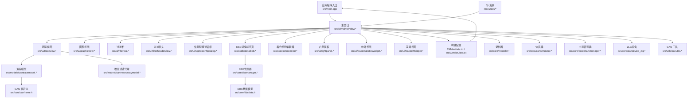
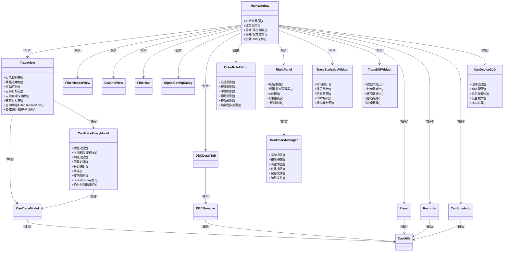
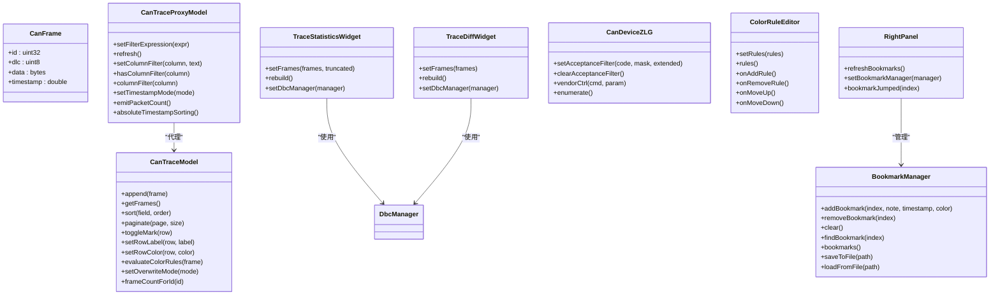
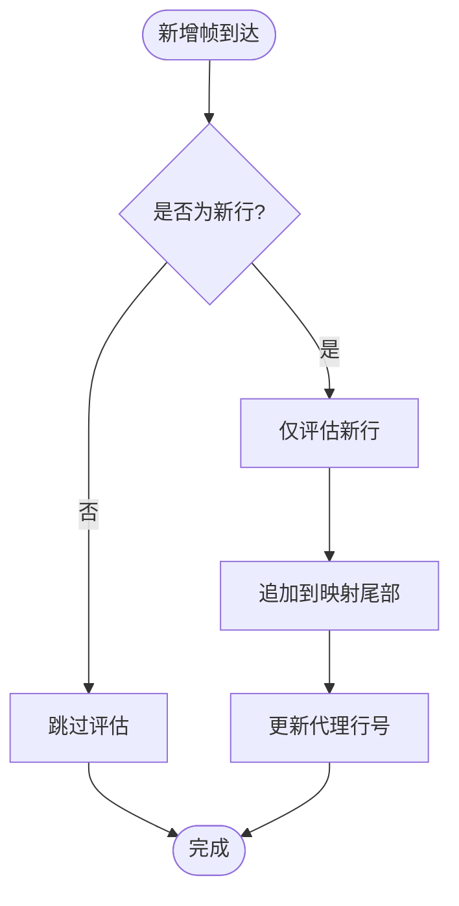
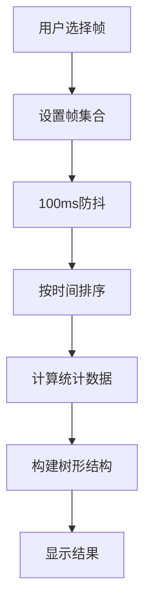
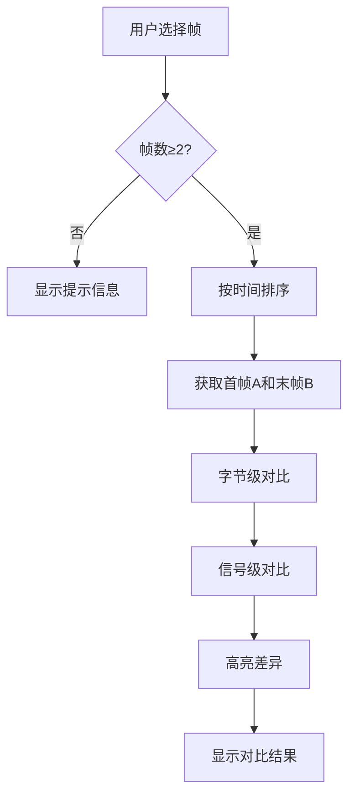
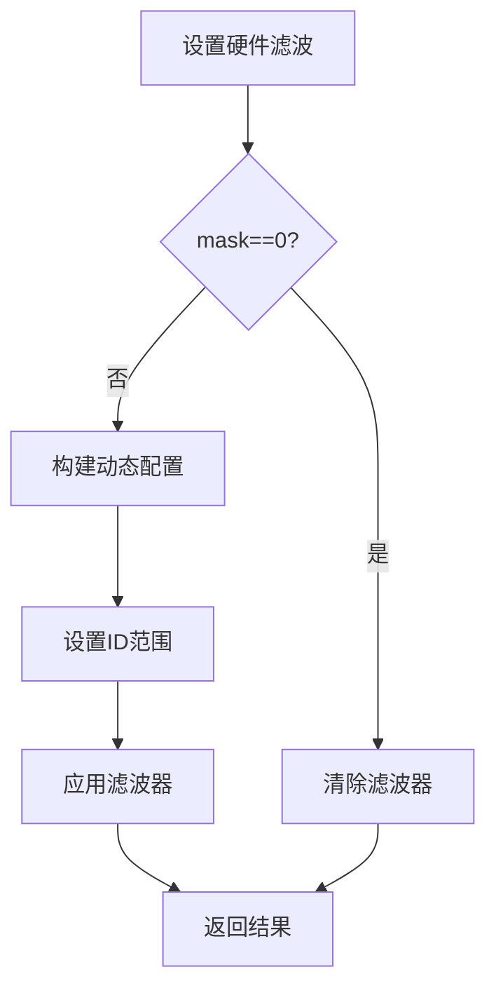
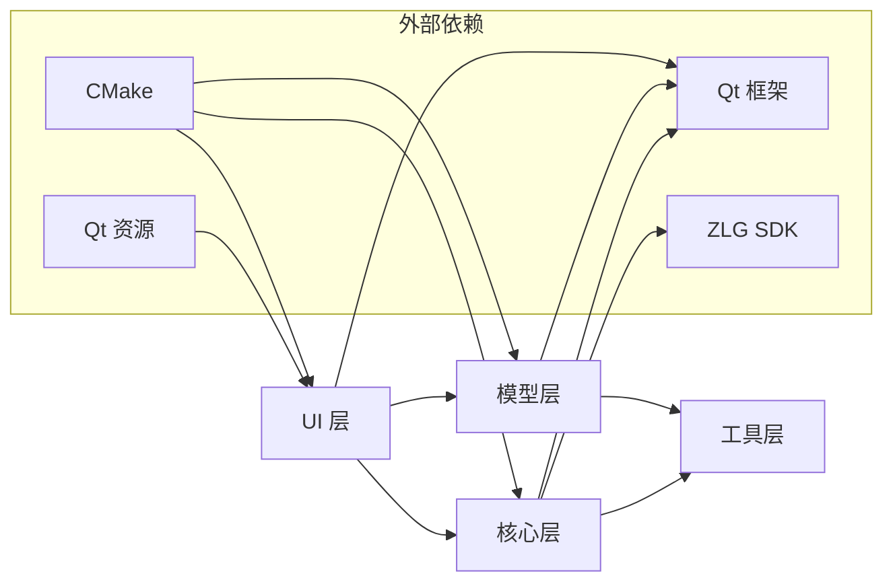

# CAN总线分析工具

<cite>
**本文引用的文件**   
- [CMakeLists.txt](file://CMakeLists.txt)
- [README.en.md](file://README.en.md)
- [src/main.cpp](file://src/main.cpp)
- [src/CMakeLists.txt](file://src/CMakeLists.txt)
- [src/core/canframe.h](file://src/core/canframe.h)
- [src/core/cansimulator.cpp](file://src/core/cansimulator.cpp)
- [src/core/cansimulator.h](file://src/core/cansimulator.h)
- [src/core/dbcdata.h](file://src/core/dbcdata.h)
- [src/core/dbcmanager.cpp](file://src/core/dbcmanager.cpp)
- [src/core/dbcmanager.h](file://src/core/dbcmanager.h)
- [src/core/player.cpp](file://src/core/player.cpp)
- [src/core/player.h](file://src/core/player.h)
- [src/core/recorder.cpp](file://src/core/recorder.cpp)
- [src/core/recorder.h](file://src/core/recorder.h)
- [src/core/bookmarkmanager.cpp](file://src/core/bookmarkmanager.cpp)
- [src/core/bookmarkmanager.h](file://src/core/bookmarkmanager.h)
- [src/models/cantraceproxymodel.cpp](file://src/models/cantraceproxymodel.cpp)
- [src/models/cantraceproxymodel.h](file://src/models/cantraceproxymodel.h)
- [src/models/cantracemodel.cpp](file://src/models/cantracemodel.cpp)
- [src/models/cantracemodel.h](file://src/models/cantracemodel.h)
- [src/ui/filterbar.cpp](file://src/ui/filterbar.cpp)
- [src/ui/filterbar.h](file://src/ui/filterbar.h)
- [src/ui/filterheaderview.cpp](file://src/ui/filterheaderview.cpp)
- [src/ui/filterheaderview.h](file://src/ui/filterheaderview.h)
- [src/ui/graphicview.cpp](file://src/ui/graphicview.cpp)
- [src/ui/graphicview.h](file://src/ui/graphicview.h)
- [src/ui/mainwindow.cpp](file://src/ui/mainwindow.cpp)
- [src/ui/mainwindow.h](file://src/ui/mainwindow.h)
- [src/ui/dbcdetailtab.cpp](file://src/ui/dbcdetailtab.cpp)
- [src/ui/dbcdetailtab.h](file://src/ui/dbcdetailtab.h)
- [src/ui/signalconfigdialog.cpp](file://src/ui/signalconfigdialog.cpp)
- [src/ui/signalconfigdialog.h](file://src/ui/signalconfigdialog.h)
- [src/ui/traceview.cpp](file://src/ui/traceview.cpp)
- [src/ui/traceview.h](file://src/ui/traceview.h)
- [src/ui/colorruleeditor.cpp](file://src/ui/colorruleeditor.cpp)
- [src/ui/colorruleeditor.h](file://src/ui/colorruleeditor.h)
- [src/ui/rightpanel.cpp](file://src/ui/rightpanel.cpp)
- [src/ui/rightpanel.h](file://src/ui/rightpanel.h)
- [src/ui/tracestatisticswidget.cpp](file://src/ui/tracestatisticswidget.cpp)
- [src/ui/tracestatisticswidget.h](file://src/ui/tracestatisticswidget.h)
- [src/ui/tracediffwidget.cpp](file://src/ui/tracediffwidget.cpp)
- [src/ui/tracediffwidget.h](file://src/ui/tracediffwidget.h)
- [src/core/candevice_zlg.cpp](file://src/core/candevice_zlg.cpp)
- [src/core/candevice_zlg.h](file://src/core/candevice_zlg.h)
- [src/utils/canutils.cpp](file://src/utils/canutils.cpp)
- [src/utils/canutils.h](file://src/utils/canutils.h)
</cite>

## 更新摘要
**所做更改**   
- **重大架构变更**：CanFilterProxyModel 被 CanTraceProxyModel 完全替换，实现增量过滤代理模型
- **新增分析组件**：TraceStatisticsWidget（统计视图）和 TraceDiffWidget（差异对比视图）
- **ZLG硬件增强**：增强的硬件滤波功能，支持动态配置和白名单模式
- **性能优化**：增量过滤算法，O(1)/行的新增处理，SinceDisplay模式优化
- **UI增强**：完整的CANoe风格底部面板，集成详情、信号、统计、差异四个标签页
- **时间戳排序简化**：移除了Time列显示增量与排序顺序之间的循环依赖，统一使用绝对时间戳排序

## 目录
1. [简介](#简介)
2. [项目结构](#项目结构)
3. [核心组件](#核心组件)
4. [架构总览](#架构总览)
5. [详细组件分析](#详细组件分析)
6. [依赖关系分析](#依赖关系分析)
7. [性能考虑](#性能考虑)
8. [故障排查指南](#故障排查指南)
9. [结论](#结论)
10. [附录](#附录)

## 简介
本工具是一个基于 Qt 的 CAN 总线分析应用，提供实时抓包、过滤、回放与录制功能，并通过图形化视图展示信号时序。整体采用分层架构：UI 层负责交互与可视化，模型层封装数据与过滤逻辑，核心层实现播放器、录制器、仿真器与 DBC 数据库管理，工具层提供通用辅助能力。构建系统使用 CMake，资源通过 Qt 资源系统进行管理。

**最新更新**：实现了重大的架构升级，用CanTraceProxyModel替代原有的CanFilterProxyModel，提供增量过滤性能和更好的可扩展性。新增了完整的统计分析功能和帧差异对比能力，显著提升了数据分析的专业性和效率。**最新增强**：ZLG设备驱动增强了硬件滤波功能，支持动态配置和白名单模式，提高了数据采集的灵活性和性能。**重要改进**：简化了时间戳排序行为，移除了Time列显示增量与排序顺序之间的循环依赖，确保在所有显示模式下Time列都使用一致的绝对时间戳排序。

## 项目结构
项目按职责划分为以下模块：
- src/core：CAN 帧数据结构、播放器、录制器、仿真器、DBC 数据库管理、书签管理器、ZLG设备驱动
- src/models：CAN 追踪模型与增量过滤代理模型
- src/ui：主窗口、跟踪视图、图形视图、过滤栏、过滤表头、信号配置对话框、DBC 详情标签页、着色规则编辑器、右侧面板、统计分析组件
- src/utils：CAN 工具函数
- resources：样式与资源文件
- scripts：构建脚本
- CMakeLists.txt：顶层构建配置

图表来源
- [src/main.cpp](file://src/main.cpp)
- [src/ui/mainwindow.h](file://src/ui/mainwindow.h)
- [src/ui/traceview.h](file://src/ui/traceview.h)
- [src/ui/graphicview.h](file://src/ui/graphicview.h)
- [src/ui/filterbar.h](file://src/ui/filterbar.h)
- [src/ui/filterheaderview.h](file://src/ui/filterheaderview.h)
- [src/ui/signalconfigdialog.h](file://src/ui/signalconfigdialog.h)
- [src/ui/dbcdetailtab.h](file://src/ui/dbcdetailtab.h)
- [src/ui/colorruleeditor.h](file://src/ui/colorruleeditor.h)
- [src/ui/rightpanel.h](file://src/ui/rightpanel.h)
- [src/ui/tracestatisticswidget.h](file://src/ui/tracestatisticswidget.h)
- [src/ui/tracediffwidget.h](file://src/ui/tracediffwidget.h)
- [src/models/cantracemodel.h](file://src/models/cantracemodel.h)
- [src/models/cantraceproxymodel.h](file://src/models/cantraceproxymodel.h)
- [src/core/canframe.h](file://src/core/canframe.h)
- [src/core/dbcmanager.h](file://src/core/dbcmanager.h)
- [src/core/dbcdata.h](file://src/core/dbcdata.h)
- [src/core/player.h](file://src/core/player.h)
- [src/core/recorder.h](file://src/core/recorder.h)
- [src/core/cansimulator.h](file://src/core/cansimulator.h)
- [src/core/bookmarkmanager.h](file://src/core/bookmarkmanager.h)
- [src/core/candevice_zlg.h](file://src/core/candevice_zlg.h)
- [src/utils/canutils.h](file://src/utils/canutils.h)
- [CMakeLists.txt](file://CMakeLists.txt)
- [src/CMakeLists.txt](file://src/CMakeLists.txt)

章节来源
- [CMakeLists.txt](file://CMakeLists.txt)
- [src/CMakeLists.txt](file://src/CMakeLists.txt)
- [README.en.md](file://README.en.md)

## 核心组件
- CAN 帧定义：统一的数据结构，承载 ID、数据长度、时间戳与载荷等字段，贯穿 UI、模型与核心模块。
- 追踪模型：维护 CAN 帧序列并提供排序、分页与查询接口，支持帧编号、时间增量、行标记、行标签和自定义着色。
- **增量过滤代理模型**：全新的CanTraceProxyModel，替代原有的CanFilterProxyModel，提供增量过滤算法，仅评估新增行，大幅提升性能。
- **统计视图**：TraceStatisticsWidget提供选中帧的统计分析，包括时间统计和信号统计，对标CANoe Statistics功能。
- **差异对比视图**：TraceDiffWidget支持帧差异对比，显示首帧与末帧的字节级和信号级差异。
- **ZLG设备驱动**：增强的硬件滤波功能，支持动态配置和白名单模式，提高数据采集灵活性。
- **过滤表头**：Wireshark风格的交互式表头，支持鼠标悬停显示漏斗图标和列级过滤，提供直观的数据筛选体验。
- **书签管理器**：管理报文行书签，支持添加、删除、持久化保存，包含帧序号、备注、时间戳和颜色信息。
- **着色规则编辑器**：提供可视化的着色规则编辑界面，支持条件表达式、背景色和前景色设置。
- **右侧面板**：集成AI对话、快捷按钮和书签列表功能，提供统一的控制面板。
- 播放器：从文件或缓冲区读取 CAN 帧并按时间轴回放，驱动 UI 更新。
- 录制器：将实时或回放中的 CAN 帧写入文件，支持格式选择与轮转策略。
- 仿真器：生成测试用 CAN 帧流，用于验证 UI 与处理链路。
- DBC 管理器：解析和管理 CAN 总线数据库文件，提供信号映射和消息定义访问。
- DBC 数据模型：存储 DBC 文件的结构化数据，包括消息、信号、节点等信息。
- 工具库：提供字节序转换、校验和计算、字符串解析等通用方法。

**重大更新**：实现了CanTraceProxyModel增量过滤代理模型，相比原有的QSortFilterProxyModel方案，新增行处理从O(n)优化到O(1)，大幅提升了大数据量场景下的性能。**新增功能**：TraceStatisticsWidget和TraceDiffWidget提供了专业的统计分析能力，使工具具备了类似CANoe的分析功能。**增强功能**：ZLG设备驱动的硬件滤波功能得到显著增强，支持更灵活的配置选项。**重要改进**：简化了时间戳排序行为，移除了Time列显示增量与排序顺序之间的循环依赖，确保在所有显示模式下Time列都使用一致的绝对时间戳排序。

章节来源
- [src/core/canframe.h](file://src/core/canframe.h)
- [src/models/cantracemodel.h](file://src/models/cantracemodel.h)
- [src/models/cantraceproxymodel.h](file://src/models/cantraceproxymodel.h)
- [src/ui/tracestatisticswidget.h](file://src/ui/tracestatisticswidget.h)
- [src/ui/tracediffwidget.h](file://src/ui/tracediffwidget.h)
- [src/core/candevice_zlg.h](file://src/core/candevice_zlg.h)
- [src/ui/filterheaderview.h](file://src/ui/filterheaderview.h)
- [src/core/bookmarkmanager.h](file://src/core/bookmarkmanager.h)
- [src/ui/colorruleeditor.h](file://src/ui/colorruleeditor.h)
- [src/ui/rightpanel.h](file://src/ui/rightpanel.h)
- [src/core/player.h](file://src/core/player.h)
- [src/core/recorder.h](file://src/core/recorder.h)
- [src/core/cansimulator.h](file://src/core/cansimulator.h)
- [src/core/dbcmanager.h](file://src/core/dbcmanager.h)
- [src/core/dbcdata.h](file://src/core/dbcdata.h)
- [src/utils/canutils.h](file://src/utils/canutils.h)

## 架构总览
应用采用"UI-Model-Core"三层分离：
- UI 层：主窗口组织各视图与控件，响应用户操作并绑定到模型与核心服务。
- 模型层：数据容器与过滤逻辑，解耦 UI 与业务处理。
- 核心层：播放、录制、仿真、DBC 管理与工具能力，面向模型与 UI 暴露稳定接口。

图表来源
- [src/ui/mainwindow.h](file://src/ui/mainwindow.h)
- [src/ui/traceview.h](file://src/ui/traceview.h)
- [src/ui/filterheaderview.h](file://src/ui/filterheaderview.h)
- [src/ui/filterbar.h](file://src/ui/filterbar.h)
- [src/ui/signalconfigdialog.h](file://src/ui/signalconfigdialog.h)
- [src/ui/dbcdetailtab.h](file://src/ui/dbcdetailtab.h)
- [src/ui/colorruleeditor.h](file://src/ui/colorruleeditor.h)
- [src/ui/rightpanel.h](file://src/ui/rightpanel.h)
- [src/ui/tracestatisticswidget.h](file://src/ui/tracestatisticswidget.h)
- [src/ui/tracediffwidget.h](file://src/ui/tracediffwidget.h)
- [src/models/cantracemodel.h](file://src/models/cantracemodel.h)
- [src/models/cantraceproxymodel.h](file://src/models/cantraceproxymodel.h)
- [src/core/player.h](file://src/core/player.h)
- [src/core/recorder.h](file://src/core/recorder.h)
- [src/core/cansimulator.h](file://src/core/cansimulator.h)
- [src/core/dbcmanager.h](file://src/core/dbcmanager.h)
- [src/core/dbcdata.h](file://src/core/dbcdata.h)
- [src/core/bookmarkmanager.h](file://src/core/bookmarkmanager.h)
- [src/core/candevice_zlg.h](file://src/core/candevice_zlg.h)
- [src/utils/canutils.h](file://src/utils/canutils.h)

## 详细组件分析

### 主窗口（MainWindow）
- 职责：创建并布局 UI 组件，连接信号槽，协调播放/录制/仿真生命周期，管理模型绑定与状态同步。
- 关键流程：启动时初始化资源与模型；用户操作触发过滤更新、回放控制与录制开关；错误通过消息框提示。
- 交互要点：与 TraceView、GraphicView、FilterBar、FilterHeaderView、SignalConfigDialog、DBCDetailTab、ColorRuleEditor、RightPanel 双向通信；与 Player/Recorder/Simulator/DBCManager 单向控制。

章节来源
- [src/ui/mainwindow.cpp](file://src/ui/mainwindow.cpp)
- [src/ui/mainwindow.h](file://src/ui/mainwindow.h)

### 跟踪视图（TraceView）
- 职责：以表格形式展示 CAN 帧，支持排序、搜索、高亮与滚动定位。
- 数据绑定：通过 CanTraceProxyModel 访问 CanTraceModel，确保过滤与排序不影响底层数据。
- 性能优化：延迟渲染、按需加载、批量更新。
- **新增功能**：支持行标记、行标签和自定义着色，可高亮重要帧并设置个性化背景色。
- **自动集成**：在setModel时自动将代理模型传递给FilterHeaderView，实现无缝集成。
- **底部面板集成**：集成了FrameInfoWidget、SignalDecodeWidget、TraceStatisticsWidget和TraceDiffWidget，提供完整的分析面板。

章节来源
- [src/ui/traceview.cpp](file://src/ui/traceview.cpp)
- [src/ui/traceview.h](file://src/ui/traceview.h)

### 增量过滤代理模型（CanTraceProxyModel）
- **核心功能**：替代原有的CanFilterProxyModel，实现增量过滤算法，大幅提升性能。
- **性能优势**：
  - 新增行：仅评估新行，追加到映射尾部（O(1)/行）
  - 过滤条件变化：单次全量遍历重评估 + layoutChanged
  - 排序：独立排序索引（m_proxyRows），不动源模型行号
  - SinceDisplay 增量：由映射直接推导，无需全量重算
- **时间戳显示模式**：支持绝对时间、捕获后时间、显示后时间、日期时间和Unix时间等多种显示模式。
- **列级过滤**：支持文本过滤和值集过滤（Excel风格复选框）。
- **双向映射**：维护m_proxyRows和m_sourceToProxy双向映射，支持高效的行列转换。
- **环形缓冲区支持**：handleFullShift方法处理环形覆盖场景。

**重大改进**：全新的增量过滤架构相比原有的QSortFilterProxyModel方案，在处理大量数据时性能提升显著，特别是在持续捕获场景下。**重要改进**：简化了时间戳排序行为，移除了Time列显示增量与排序顺序之间的循环依赖。现在Time列在所有显示模式下都使用一致的绝对时间戳排序，避免了由于显示增量依赖显示顺序而导致的循环依赖问题。

章节来源
- [src/models/cantraceproxymodel.cpp:453-496](file://src/models/cantraceproxymodel.cpp#L453-L496)
- [src/models/cantraceproxymodel.h:28-189](file://src/models/cantraceproxymodel.h#L28-L189)

### 统计视图（TraceStatisticsWidget）
- **核心功能**：对标CANoe Statistics功能，提供选中帧的详细统计分析。
- **时间统计**：显示帧数、时间跨度、相邻帧Δt的min/max/avg/σ（标准差）等指标。
- **信号统计**：通过DBC解码后逐信号统计min/max/avg/σ/首值/末值，未加载DBC时按字节位置统计。
- **性能优化**：内部100ms防抖后重算，集合上限MaxFrames=10000，超出截断并在摘要中提示。
- **数据源**：来自TraceView当前选中行集合，按时间排序处理。

**新增功能**：为工具提供了专业的统计分析能力，用户可以快速了解选中帧的时间特性和信号特性。

章节来源
- [src/ui/tracestatisticswidget.cpp](file://src/ui/tracestatisticswidget.cpp)
- [src/ui/tracestatisticswidget.h](file://src/ui/tracestatisticswidget.h)

### 差异对比视图（TraceDiffWidget）
- **核心功能**：对标CANoe Difference功能，提供选中帧的差异对比分析。
- **对比逻辑**：选中≥2帧时对比首帧(A)与末帧(B)，恰好2帧即A/B对比。
- **概览信息**：显示A/B时间、报文名、CAN ID、DLC、首末Δt等基本信息。
- **字节级对比**：双列Hex对照，不等字节高亮显示。
- **信号级对比**：DBC解码后逐信号显示首值→末值，默认仅列变化项，可切换显示全部。
- **性能优化**：内部100ms防抖后重算，支持"仅显示变化项"快速切换。

**新增功能**：为帧差异分析提供了专业工具，特别适用于调试和验证场景。

章节来源
- [src/ui/tracediffwidget.cpp](file://src/ui/tracediffwidget.cpp)
- [src/ui/tracediffwidget.h](file://src/ui/tracediffwidget.h)

### ZLG设备驱动（CanDeviceZLG）
- **核心功能**：ZLG致远电子CAN/CAN FD设备后端，动态加载zlgcan.dll，封装全部原生API。
- **设备支持**：支持USBCAN-1/2、USBCANFD-200U等ZLG设备。
- **架构设计**：ICanDevice → CanDeviceZLG → zlgcan.dll (运行时加载)，DLL缺失时open()返回false，不影响其他后端。
- **硬件滤波增强**：
  - setAcceptanceFilter方法支持code、mask、extended参数
  - clearAcceptanceFilter方法清除滤波器
  - 支持动态配置和白名单模式
  - 使用ZCAN_Dynamic_Config结构进行高级配置
- **DLL管理**：共享DLL实例，全局只加载一次，避免反复load/unload导致USB设备状态破坏。

**重大增强**：硬件滤波功能的增强使得ZLG设备能够提供更灵活的数据过滤能力，减少CPU负载。

章节来源
- [src/core/candevice_zlg.cpp](file://src/core/candevice_zlg.cpp)
- [src/core/candevice_zlg.h](file://src/core/candevice_zlg.h)

### 过滤表头（FilterHeaderView）
- **核心功能**：实现Wireshark风格的交互式表头，支持鼠标悬停显示漏斗图标和列级过滤。
- **视觉设计**：
  - 鼠标悬停时显示半透明漏斗图标，提供直观的过滤入口
  - 已有过滤条件时漏斗图标持续高亮显示，清晰标识当前过滤状态
  - 漏斗图标左侧绘制小三角形，点击触发排序切换
- **交互特性**：
  - 智能悬停检测：跟踪当前悬停列号，智能判断过滤状态并更新视觉效果
  - 鼠标形状反馈：在漏斗图标区域显示手型光标，提升用户体验
  - 事件处理：点击漏斗图标触发filterClicked信号，弹出列筛选对话框
- **技术实现**：
  - 继承QHeaderView并重写paintSection、mouseMoveEvent、leaveEvent、mousePressEvent
  - 使用QPainterPath绘制漏斗形状，支持激活态和悬停态的颜色变化
  - 与CanTraceProxyModel集成，实时查询各列过滤状态

章节来源
- [src/ui/filterheaderview.cpp](file://src/ui/filterheaderview.cpp)
- [src/ui/filterheaderview.h](file://src/ui/filterheaderview.h)

### 着色规则编辑器（ColorRuleEditor）
- **核心功能**：提供可视化的着色规则编辑界面，支持条件表达式、背景色和前景色设置。
- **界面设计**：
  - 规则列表显示：每条规则显示启用状态、条件表达式和预览颜色
  - 规则编辑区：支持条件表达式输入、背景色和前景色选择、启用/禁用控制
  - 规则操作：添加、删除、上移、下移规则，调整优先级
- **功能特性**：
  - 复用FilterEngine进行条件表达式解析和求值
  - 实时预览规则效果，支持颜色选择器
  - 规则优先级管理，从上到下匹配，首个命中生效
  - 支持规则的启用/禁用控制
- **数据管理**：
  - 规则数据结构包含表达式、背景色、前景色和启用状态
  - 支持规则的导入导出和持久化存储
  - 与CanTraceModel集成，实时更新着色效果

章节来源
- [src/ui/colorruleeditor.cpp](file://src/ui/colorruleeditor.cpp)
- [src/ui/colorruleeditor.h](file://src/ui/colorruleeditor.h)

### 右侧面板（RightPanel）
- **核心功能**：集成AI对话、快捷按钮和书签列表功能的统一控制面板。
- **标签页设计**：
  - AI对话标签页：提供AI助手对话界面，支持消息发送和接收
  - 快捷按钮标签页：包含录制、回放、Trace控制和设备操作按钮
  - 书签标签页：显示和管理所有书签，支持双击跳转到对应帧
- **书签管理**：
  - 与BookmarkManager集成，实时同步书签状态
  - 支持书签的添加、删除、清空操作
  - 书签项显示帧序号、备注信息和颜色标识
  - 双击书签项触发跳转信号，定位到对应帧位置
- **信号连接**：
  - 监听书签管理器的各种信号（添加、删除、清空）
  - 转发用户操作到相应的控制器
  - 支持书签跳转事件的传播

章节来源
- [src/ui/rightpanel.cpp](file://src/ui/rightpanel.cpp)
- [src/ui/rightpanel.h](file://src/ui/rightpanel.h)

### 书签管理器（BookmarkManager）
- **核心功能**：管理报文行书签，支持添加、删除、持久化保存等操作。
- **数据结构**：
  - 书签结构包含帧序号、备注、时间戳和颜色信息
  - 支持重复帧序号的书签更新操作
  - 内置默认颜色（黄色）和自定义颜色支持
- **文件持久化**：
  - 支持JSON格式的书签文件保存和加载
  - 文件格式包含版本号和书签数组
  - 支持书签数据的完整序列化与反序列化
- **事件机制**：
  - 书签添加、删除、清空时发出相应信号
  - 支持外部组件监听书签状态变化
  - 提供书签查找和索引功能
- **内存管理**：
  - 使用QVector存储书签数据
  - 支持高效的查找和遍历操作
  - 提供清理和重置功能

章节来源
- [src/core/bookmarkmanager.cpp](file://src/core/bookmarkmanager.cpp)
- [src/core/bookmarkmanager.h](file://src/core/bookmarkmanager.h)

### 过滤栏（FilterBar）
- 职责：提供过滤规则输入（如 ID、掩码、方向），即时应用到代理模型。
- 行为：输入变更触发防抖刷新；支持预设模板与快速切换。
- **增强功能**：新增覆盖模式按钮，支持同CAN ID帧的合并显示和数据更新。

章节来源
- [src/ui/filterbar.cpp](file://src/ui/filterbar.cpp)
- [src/ui/filterbar.h](file://src/ui/filterbar.h)

### 信号配置对话框（SignalConfigDialog）
- 职责：编辑信号名称、起始位、长度、字节序、缩放与偏移等参数，支持导入导出。
- 集成：与 GraphicView 联动，实时更新波形映射。

章节来源
- [src/ui/signalconfigdialog.cpp](file://src/ui/signalconfigdialog.cpp)
- [src/ui/signalconfigdialog.h](file://src/ui/signalconfigdialog.h)

### DBC详情标签页（DBCDetailTab）
- 职责：显示 DBC 文件的详细信息，包括消息定义、信号定义、节点信息等。
- 功能：支持消息浏览、信号搜索、属性查看与层次结构导航。
- 集成：与 DBC 管理器协作，提供实时的 DBC 数据访问和验证。

章节来源
- [src/ui/dbcdetailtab.cpp](file://src/ui/dbcdetailtab.cpp)
- [src/ui/dbcdetailtab.h](file://src/ui/dbcdetailtab.h)

### 追踪模型（CanTraceModel）
- 职责：存储 CAN 帧序列，提供追加、查询、排序与分页接口。
- 线程安全：在后台线程追加帧，通过信号通知 UI 线程更新。
- 复杂度：追加 O(1)，随机访问 O(1)，排序 O(n log n)。
- **新增功能**：
  - 帧编号列（ColNo）：显示1-based序列号
  - 时间增量列（ColDelta）：计算与上一帧的时间差
  - 行标记功能：支持标记重要帧并高亮显示
  - **行标签功能**：支持为每行添加自定义文本标签，类似Notepad++的书签功能
  - 自定义着色：为特定行设置个性化背景色
  - 着色规则求值：支持基于条件的自动着色
  - 覆盖模式：同CAN ID的帧只保留一行，实时更新数据

章节来源
- [src/models/cantracemodel.cpp](file://src/models/cantracemodel.cpp)
- [src/models/cantracemodel.h](file://src/models/cantracemodel.h)

### 播放器（Player）
- 职责：从文件或内存缓冲读取 CAN 帧，按时间轴回放，驱动 UI 更新。
- 控制：开始、暂停、停止、跳转至指定时间戳。
- 可靠性：断点续播、异常恢复与日志记录。

章节来源
- [src/core/player.cpp](file://src/core/player.cpp)
- [src/core/player.h](file://src/core/player.h)

### 录制器（Recorder）
- 职责：将 CAN 帧写入文件，支持多种格式与轮转策略。
- 特性：异步写入、压缩可选、完整性校验。
- 错误处理：磁盘空间不足、权限问题与重试机制。

章节来源
- [src/core/recorder.cpp](file://src/core/recorder.cpp)
- [src/core/recorder.h](file://src/core/recorder.h)

### 仿真器（CanSimulator）
- 职责：生成测试用 CAN 帧流，模拟真实设备行为。
- 参数：帧率、负载分布、错误注入。
- 用途：自动化测试与演示。

章节来源
- [src/core/cansimulator.cpp](file://src/core/cansimulator.cpp)
- [src/core/cansimulator.h](file://src/core/cansimulator.h)

### DBC管理器（DBCManager）
- 职责：解析和管理 CAN 总线数据库文件，提供信号映射和消息定义访问。
- 功能：DBC 文件解析、数据验证、错误处理、缓存管理。
- 特性：支持标准 DBC 格式、增量解析、内存优化。
- 错误处理：文件格式验证、语法检查、语义验证与详细的错误报告。

章节来源
- [src/core/dbcmanager.cpp](file://src/core/dbcmanager.cpp)
- [src/core/dbcmanager.h](file://src/core/dbcmanager.h)

### DBC数据模型（DBCData）
- 职责：存储 DBC 文件的结构化数据，包括消息、信号、节点等信息。
- 结构：消息定义、信号定义、节点定义、属性定义、版本信息。
- 验证：数据完整性检查、格式验证、约束检查。

章节来源
- [src/core/dbcdata.h](file://src/core/dbcdata.h)

### 工具库（CanUtils）
- 职责：提供 CAN 相关通用方法，如 ID/掩码解析、字节序转换、校验和计算。
- 设计：无状态函数集合，便于跨模块复用。
- **新增功能**：过滤器语法检查和帮助信息生成。

章节来源
- [src/utils/canutils.cpp](file://src/utils/canutils.cpp)
- [src/utils/canutils.h](file://src/utils/canutils.h)

### 数据模型类图（简化）

图表来源
- [src/core/canframe.h](file://src/core/canframe.h)
- [src/models/cantracemodel.h](file://src/models/cantracemodel.h)
- [src/models/cantraceproxymodel.h](file://src/models/cantraceproxymodel.h)
- [src/ui/tracestatisticswidget.h](file://src/ui/tracestatisticswidget.h)
- [src/ui/tracediffwidget.h](file://src/ui/tracediffwidget.h)
- [src/core/candevice_zlg.h](file://src/core/candevice_zlg.h)
- [src/core/bookmarkmanager.h](file://src/core/bookmarkmanager.h)
- [src/ui/colorruleeditor.h](file://src/ui/colorruleeditor.h)
- [src/ui/rightpanel.h](file://src/ui/rightpanel.h)

### 增量过滤流程图（新增）

图表来源
- [src/models/cantraceproxymodel.cpp](file://src/models/cantraceproxymodel.cpp)

### 统计视图工作流程（新增）

图表来源
- [src/ui/tracestatisticswidget.cpp](file://src/ui/tracestatisticswidget.cpp)

### 差异对比工作流程（新增）

图表来源
- [src/ui/tracediffwidget.cpp](file://src/ui/tracediffwidget.cpp)

### ZLG硬件滤波工作流程（新增）

图表来源
- [src/core/candevice_zlg.cpp](file://src/core/candevice_zlg.cpp)

## 依赖关系分析
- 模块耦合：UI 层依赖模型与核心层；模型层仅依赖工具层；核心层不依赖 UI。
- 外部依赖：Qt GUI/Widgets、CMake 构建系统、Qt 资源系统。
- 潜在循环：通过接口与信号槽避免直接循环依赖。

图表来源
- [CMakeLists.txt](file://CMakeLists.txt)
- [src/CMakeLists.txt](file://src/CMakeLists.txt)
- [resources/resources.qrc](file://resources/resources.qrc)

章节来源
- [CMakeLists.txt](file://CMakeLists.txt)
- [src/CMakeLists.txt](file://src/CMakeLists.txt)

## 性能考虑
- 大数据量渲染：使用延迟渲染与视口裁剪，避免全量重绘。
- 线程模型：后台线程追加帧，UI 线程仅处理展示，降低卡顿。
- 过滤优化：规则缓存与增量更新，减少重复计算。
- I/O 优化：异步写入与批处理，降低磁盘压力。
- 内存管理：对象池与引用计数，避免频繁分配与回收。
- **新增优化**：覆盖模式下的高效行更新，避免不必要的插入删除操作；行标记和着色的增量更新机制。
- **FilterHeaderView优化**：智能悬停检测避免不必要的重绘，高效的漏斗图标绘制算法。
- **书签管理优化**：书签数据的批量操作和懒加载，减少UI刷新频率。
- **着色规则优化**：规则编译缓存和增量求值，提高着色性能。
- **增量过滤优化**：CanTraceProxyModel的增量算法将新增行处理从O(n)优化到O(1)，显著提升大数据量场景性能。
- **统计分析优化**：TraceStatisticsWidget和TraceDiffWidget使用100ms防抖机制，避免频繁重算。
- **ZLG设备优化**：共享DLL实例避免重复加载，硬件滤波减少CPU负载。
- **时间戳排序优化**：移除了Time列显示增量与排序顺序之间的循环依赖，使用绝对时间戳排序，避免了复杂的依赖关系计算。

**重大改进**：CanTraceProxyModel的增量过滤架构是本次更新的核心性能改进，相比原有的QSortFilterProxyModel方案，在处理大量数据时性能提升显著。**新增优化**：统计分析组件的防抖机制和张量优化确保了流畅的用户交互体验。**重要改进**：简化的时间戳排序行为消除了循环依赖，提高了排序操作的稳定性和性能。

## 故障排查指南
- 无法加载资源：检查 Qt 资源路径与编译输出目录是否一致。
- 回放卡顿：确认模型追加频率与 UI 刷新间隔，启用批量更新。
- 过滤无效：验证规则解析与匹配逻辑，检查代理模型刷新时机。
- 录制失败：检查磁盘权限与空间，查看错误日志与重试策略。
- 波形错位：核对信号映射参数（起始位、长度、字节序）。
- DBC文件解析失败：检查文件格式是否正确，验证语法和语义，查看详细错误信息。
- DBC数据不一致：验证数据完整性，检查约束条件，重新解析文件。
- **新增**：行标记失效：检查行号映射是否正确，确认数据更新信号是否正常发送。
- **新增**：行标签失效：检查标签映射表状态，确认标签更新信号是否正常发送。
- **新增**：覆盖模式异常：验证CAN ID映射表状态，检查数据一致性。
- **新增**：过滤表头不显示：确认FilterHeaderView正确绑定代理模型，检查事件处理。
- **新增**：书签功能异常：检查BookmarkManager实例化状态，确认文件读写权限。
- **新增**：着色规则不生效：验证规则表达式语法，检查规则优先级设置。
- **新增**：增量过滤异常：检查CanTraceProxyModel的映射表状态，确认增量算法正常工作。
- **新增**：统计视图不工作：检查TraceStatisticsWidget的防抖定时器，确认DBC管理器连接。
- **新增**：差异对比异常：检查帧数量是否满足要求，确认DBC解码功能正常。
- **新增**：ZLG设备问题：检查DLL加载状态，验证硬件滤波配置参数。
- **新增**：时间戳排序问题：检查Time列排序是否正确使用绝对时间戳，确认排序逻辑没有循环依赖。
- **FilterHeaderView问题**：
  - 漏斗图标不显示：检查列宽是否足够（至少30像素），确认hover属性已启用
  - 过滤状态不同步：验证hasColumnFilter方法调用是否正确，检查代理模型状态
  - 鼠标事件异常：确认mouseMoveEvent和mousePressEvent重写是否正确
- **增量过滤问题**：
  - 过滤结果不正确：检查m_proxyRows和m_sourceToProxy映射表状态
  - 性能下降：验证增量算法是否正常工作，检查是否有全量重评估发生
  - 排序异常：确认排序列和方向的设置是否正确
- **统计分析问题**：
  - 统计结果不准确：检查帧集合是否正确传递，确认防抖机制工作正常
  - DBC解码失败：验证DBC管理器状态，检查信号定义是否存在
  - 界面响应慢：确认防抖定时器设置合理，避免过于频繁的更新
- **差异对比问题**：
  - 对比结果异常：检查帧数量是否满足≥2的要求，确认时间排序正确
  - 字节对比错误：验证数据长度和边界检查
  - 信号对比失败：检查DBC解码功能，确认信号定义存在
- **ZLG设备问题**：
  - DLL加载失败：检查zlgcan.dll路径和架构匹配
  - 硬件滤波无效：验证filter配置参数，检查设备句柄状态
  - 设备枚举失败：检查设备连接状态和权限设置
- **时间戳排序问题**：
  - Time列排序异常：确认使用的是绝对时间戳而非显示增量
  - 排序结果不稳定：检查lessThan方法的比较逻辑
  - 显示模式影响排序：确认排序键不受时间戳显示模式影响

**重大更新**：新增了增量过滤、统计分析、差异对比和ZLG设备相关的专用故障排查指导，帮助用户快速定位和解决相关问题。**最新增强**：针对新的架构变更和时间戳排序简化提供了详细的诊断方法和解决方案。

章节来源
- [src/ui/mainwindow.cpp](file://src/ui/mainwindow.cpp)
- [src/models/cantraceproxymodel.cpp](file://src/models/cantraceproxymodel.cpp)
- [src/core/recorder.cpp](file://src/core/recorder.cpp)
- [src/ui/graphicview.cpp](file://src/ui/graphicview.cpp)
- [src/core/dbcmanager.cpp](file://src/core/dbcmanager.cpp)
- [src/models/cantracemodel.cpp](file://src/models/cantracemodel.cpp)
- [src/ui/filterheaderview.cpp](file://src/ui/filterheaderview.cpp)
- [src/core/bookmarkmanager.cpp](file://src/core/bookmarkmanager.cpp)
- [src/ui/colorruleeditor.cpp](file://src/ui/colorruleeditor.cpp)
- [src/ui/tracestatisticswidget.cpp](file://src/ui/tracestatisticswidget.cpp)
- [src/ui/tracediffwidget.cpp](file://src/ui/tracediffwidget.cpp)
- [src/core/candevice_zlg.cpp](file://src/core/candevice_zlg.cpp)

## 结论
该 CAN 总线分析工具通过清晰的层次划分与稳定的接口设计，实现了高效的抓包、过滤、回放与录制功能。UI 与模型解耦提升了可维护性与可扩展性，核心层提供了可靠的播放、录制、仿真与 DBC 数据库管理能力。**重大更新**：实现了CanTraceProxyModel增量过滤代理模型，相比原有方案性能显著提升，特别是大数据量场景下的处理能力。**新增功能**：TraceStatisticsWidget和TraceDiffWidget提供了专业的统计分析能力，使工具具备了类似CANoe的分析功能。**增强功能**：ZLG设备驱动的硬件滤波功能得到显著增强，支持更灵活的数据过滤配置。**重要改进**：简化了时间戳排序行为，移除了Time列显示增量与排序顺序之间的循环依赖，确保在所有显示模式下Time列都使用一致的绝对时间戳排序。

**架构升级意义**：CanTraceProxyModel的引入标志着工具在数据处理架构上的重大进步，增量过滤算法为未来更大规模的数据处理奠定了基础。**功能扩展价值**：统计和差异对比功能的加入使工具从单纯的抓包工具升级为完整的分析平台，能够满足更复杂的调试和分析需求。**硬件优化成果**：ZLG设备的增强功能为用户提供了更多硬件级别的优化选项，有助于提升整体系统性能。**排序优化成果**：简化的时间戳排序行为消除了循环依赖问题，提高了系统的稳定性和性能表现。

## 附录
- 构建说明：使用 CMake 配置与生成工程，参考顶层与 src 下的构建文件。
- 资源管理：样式与图标通过 Qt 资源系统集成，确保跨平台一致性。
- 扩展建议：新增过滤类型、信号映射与导出格式时，优先扩展工具层与模型层。
- DBC支持：支持标准 DBC 文件格式，提供完整的消息、信号、节点信息管理。
- **新增功能**：
  - **增量过滤代理模型**：CanTraceProxyModel提供O(1)/行的增量处理，支持多种时间戳显示模式和列级过滤
  - **统计分析功能**：TraceStatisticsWidget提供时间统计和信号统计，支持标准差计算和DBC解码
  - **差异对比功能**：TraceDiffWidget支持字节级和信号级的帧差异对比，具备变化高亮显示
  - **ZLG硬件增强**：增强的硬件滤波功能，支持动态配置和白名单模式
  - **底部分析面板**：集成详情、信号、统计、差异四个标签页的完整分析界面
  - **性能优化**：100ms防抖机制、增量算法、共享DLL管理等优化措施
  - **时间戳排序简化**：移除了循环依赖，统一使用绝对时间戳排序

**架构演进**：从QSortFilterProxyModel到CanTraceProxyModel的演进代表了工具在数据处理架构上的重要升级，为未来的功能扩展奠定了坚实基础。**功能完善**：统计分析功能的加入使工具具备了完整的分析能力，能够满足专业用户的复杂分析需求。**硬件优化**：ZLG设备的增强功能为用户提供了更多硬件级别的优化选项，有助于提升整体系统性能。**排序优化**：简化的时间戳排序行为消除了循环依赖，提高了系统的稳定性和性能表现。

章节来源
- [CMakeLists.txt](file://CMakeLists.txt)
- [src/CMakeLists.txt](file://src/CMakeLists.txt)
- [resources/styles/default.qss](file://resources/styles/default.qss)
- [resources/resources.qrc](file://resources/resources.qrc)
- [src/models/cantracemodel.h](file://src/models/cantracemodel.h)
- [src/models/cantraceproxymodel.h](file://src/models/cantraceproxymodel.h)
- [src/ui/filterheaderview.h](file://src/ui/filterheaderview.h)
- [src/core/bookmarkmanager.h](file://src/core/bookmarkmanager.h)
- [src/ui/colorruleeditor.h](file://src/ui/colorruleeditor.h)
- [src/ui/rightpanel.h](file://src/ui/rightpanel.h)
- [src/ui/tracestatisticswidget.h](file://src/ui/tracestatisticswidget.h)
- [src/ui/tracediffwidget.h](file://src/ui/tracediffwidget.h)
- [src/core/candevice_zlg.h](file://src/core/candevice_zlg.h)