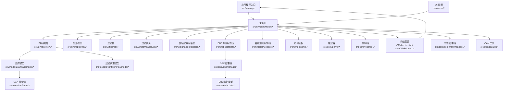
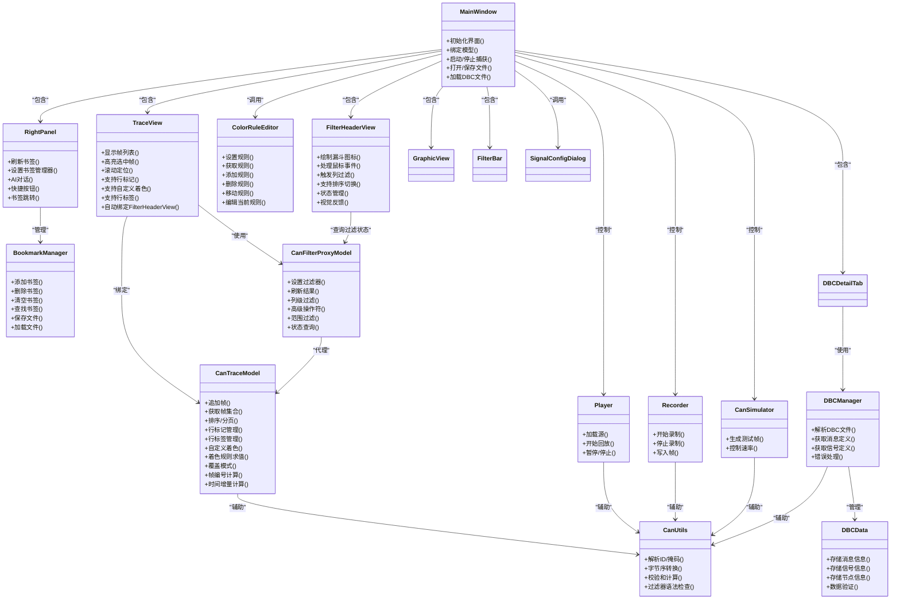
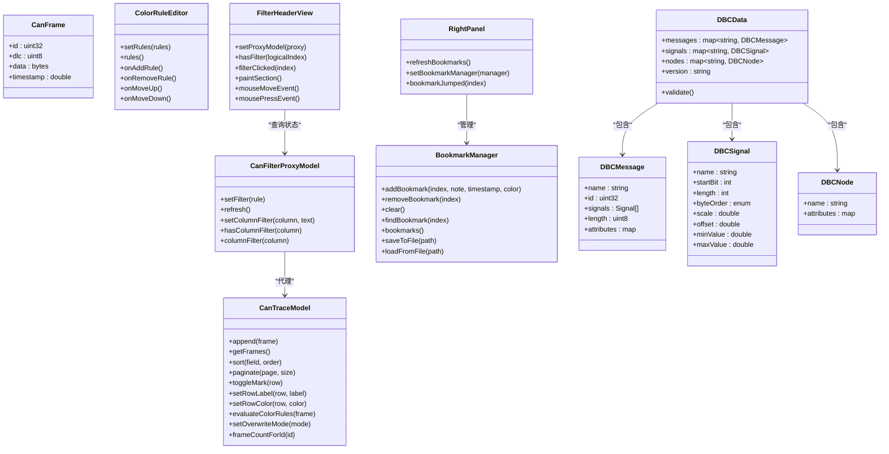
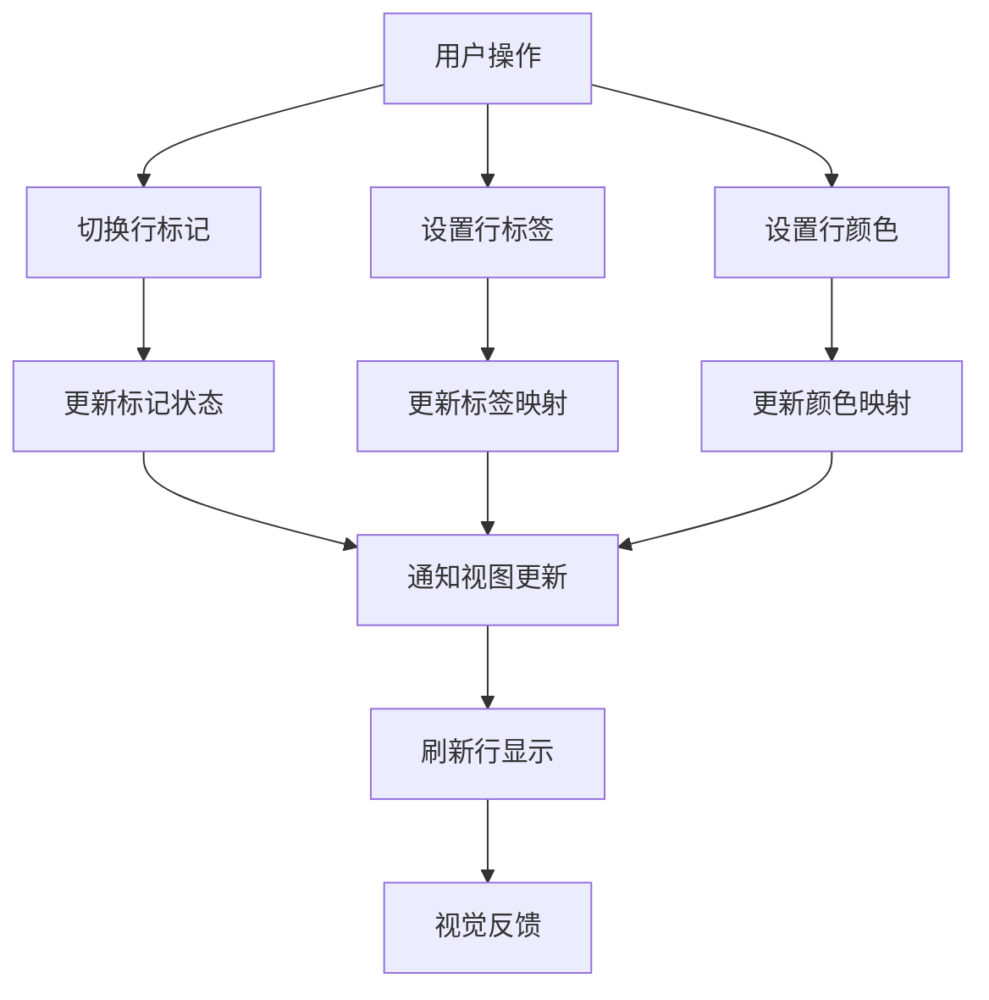
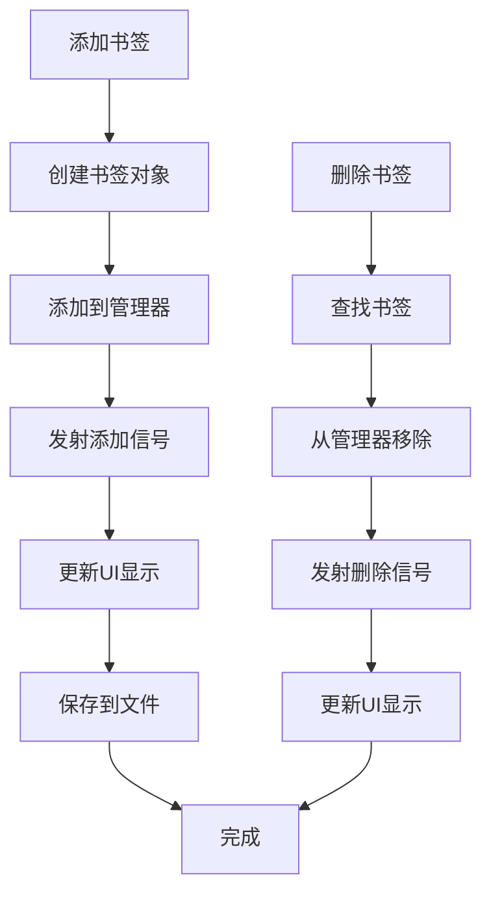
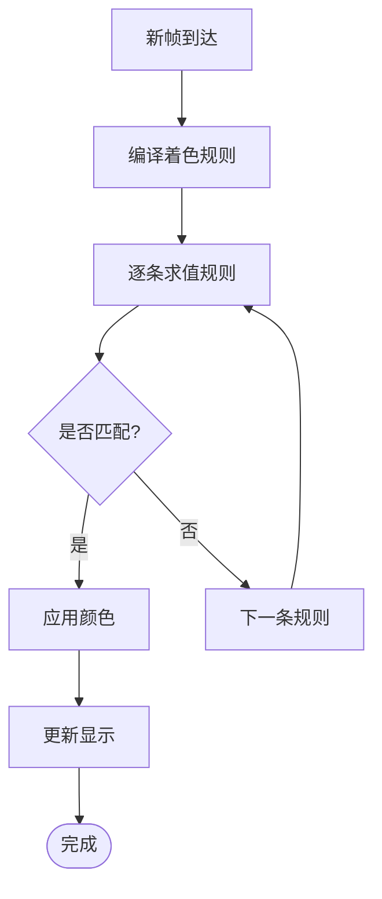
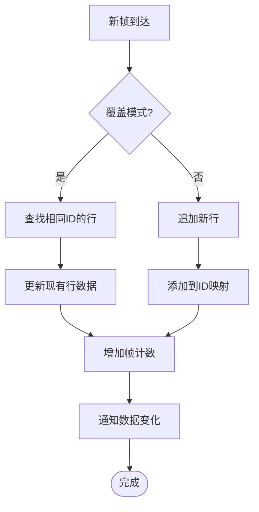
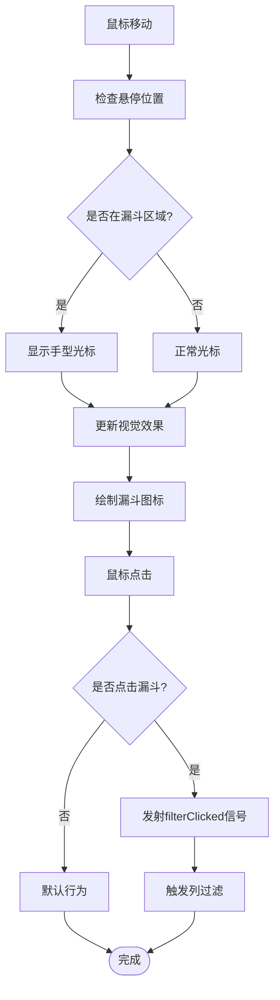
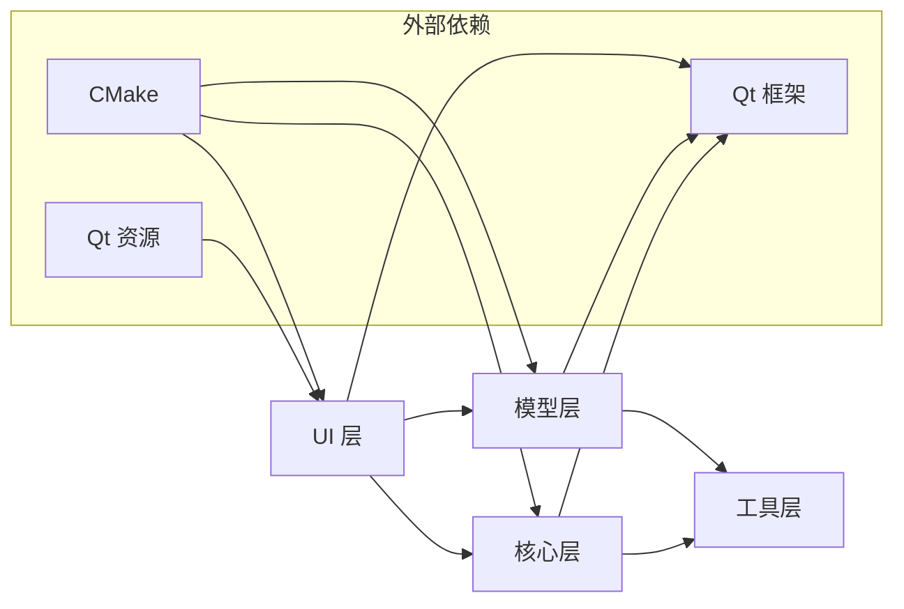

# CAN总线分析工具

<cite>
**本文档引用的文件**   
- [CMakeLists.txt](file://CMakeLists.txt)
- [README.en.md](file://README.en.md)
- [src/main.cpp](file://src/main.cpp)
- [src/CMakeLists.txt](file://src/CMakeLists.txt)
- [src/core/canframe.h](file://src/core/canframe.h)
- [src/core/cansimulator.cpp](file://src/core/cansimulator.cpp)
- [src/core/cansimulator.h](file://src/core/cansimulator.h)
- [src/core/dbcdata.h](file://src/core/dbcdata.h)
- [src/core/dbcmanager.cpp](file://src/core/dbcmanager.cpp)
- [src/core/dbcmanager.h](file://src/core/dbcmanager.h)
- [src/core/player.cpp](file://src/core/player.cpp)
- [src/core/player.h](file://src/core/player.h)
- [src/core/recorder.cpp](file://src/core/recorder.cpp)
- [src/core/recorder.h](file://src/core/recorder.h)
- [src/core/bookmarkmanager.cpp](file://src/core/bookmarkmanager.cpp)
- [src/core/bookmarkmanager.h](file://src/core/bookmarkmanager.h)
- [src/models/canfilterproxymodel.cpp](file://src/models/canfilterproxymodel.cpp)
- [src/models/canfilterproxymodel.h](file://src/models/canfilterproxymodel.h)
- [src/models/cantracemodel.cpp](file://src/models/cantracemodel.cpp)
- [src/models/cantracemodel.h](file://src/models/cantracemodel.h)
- [src/ui/filterbar.cpp](file://src/ui/filterbar.cpp)
- [src/ui/filterbar.h](file://src/ui/filterbar.h)
- [src/ui/filterheaderview.cpp](file://src/ui/filterheaderview.cpp)
- [src/ui/filterheaderview.h](file://src/ui/filterheaderview.h)
- [src/ui/graphicview.cpp](file://src/ui/graphicview.cpp)
- [src/ui/graphicview.h](file://src/ui/graphicview.h)
- [src/ui/mainwindow.cpp](file://src/ui/mainwindow.cpp)
- [src/ui/mainwindow.h](file://src/ui/mainwindow.h)
- [src/ui/dbcdetailtab.cpp](file://src/ui/dbcdetailtab.cpp)
- [src/ui/dbcdetailtab.h](file://src/ui/dbcdetailtab.h)
- [src/ui/signalconfigdialog.cpp](file://src/ui/signalconfigdialog.cpp)
- [src/ui/signalconfigdialog.h](file://src/ui/signalconfigdialog.h)
- [src/ui/traceview.cpp](file://src/ui/traceview.cpp)
- [src/ui/traceview.h](file://src/ui/traceview.h)
- [src/ui/colorruleeditor.cpp](file://src/ui/colorruleeditor.cpp)
- [src/ui/colorruleeditor.h](file://src/ui/colorruleeditor.h)
- [src/ui/rightpanel.cpp](file://src/ui/rightpanel.cpp)
- [src/ui/rightpanel.h](file://src/ui/rightpanel.h)
- [src/utils/canutils.cpp](file://src/utils/canutils.cpp)
- [src/utils/canutils.h](file://src/utils/canutils.h)
</cite>

## 更新摘要
**所做更改**   
- 增强了CAN追踪分析功能，新增帧编号（No.）和时间增量（Delta）列
- 实现了Wireshark风格的过滤界面，支持交互式列级过滤
- 添加了行标记和自定义着色功能，支持高亮重要帧
- 改进了过滤代理模型，支持高级过滤操作符和范围过滤
- 新增了覆盖模式，同CAN ID的帧只保留一行并实时更新数据
- **新增**：FilterHeaderView组件提供完整的Wireshark风格漏斗表头过滤功能
- **重大增强**：新增行标签和书签系统功能，支持类似Notepad++的标记功能，包括自定义文本标签、预设颜色调色板、批量操作等特性

## 目录
1. [简介](#简介)
2. [项目结构](#项目结构)
3. [核心组件](#核心组件)
4. [架构总览](#架构总览)
5. [详细组件分析](#详细组件分析)
6. [依赖关系分析](#依赖关系分析)
7. [性能考虑](#性能考虑)
8. [故障排查指南](#故障排查指南)
9. [结论](#结论)
10. [附录](#附录)

## 简介
本工具是一个基于 Qt 的 CAN 总线分析应用，提供实时抓包、过滤、回放与录制功能，并通过图形化视图展示信号时序。整体采用分层架构：UI 层负责交互与可视化，模型层封装数据与过滤逻辑，核心层实现播放器、录制器、仿真器与 DBC 数据库管理，工具层提供通用辅助能力。构建系统使用 CMake，资源通过 Qt 资源系统进行管理。

**更新** 增强了CAN追踪分析功能，新增了帧编号和时间增量计算，提供了Wireshark风格的过滤界面和行标记着色功能，显著提升了数据分析能力和用户体验。**最新增强**：FilterHeaderView组件实现了完整的Wireshark风格漏斗表头过滤功能，为用户提供直观的列级数据筛选体验。**重大更新**：新增了完整的行标签和书签系统功能，支持类似Notepad++的标记功能，包括自定义文本标签、预设颜色调色板、批量操作等特性，大幅提升了用户标注和分析效率。

## 项目结构
项目按职责划分为以下模块：
- src/core：CAN 帧数据结构、播放器、录制器、仿真器、DBC 数据库管理、书签管理器
- src/models：CAN 追踪模型与过滤器代理模型
- src/ui：主窗口、跟踪视图、图形视图、过滤栏、过滤表头、信号配置对话框、DBC 详情标签页、着色规则编辑器、右侧面板
- src/utils：CAN 工具函数
- resources：样式与资源文件
- scripts：构建脚本
- CMakeLists.txt：顶层构建配置

图表来源
- [src/main.cpp](file://src/main.cpp)
- [src/ui/mainwindow.h](file://src/ui/mainwindow.h)
- [src/ui/traceview.h](file://src/ui/traceview.h)
- [src/ui/graphicview.h](file://src/ui/graphicview.h)
- [src/ui/filterbar.h](file://src/ui/filterbar.h)
- [src/ui/filterheaderview.h](file://src/ui/filterheaderview.h)
- [src/ui/signalconfigdialog.h](file://src/ui/signalconfigdialog.h)
- [src/ui/dbcdetailtab.h](file://src/ui/dbcdetailtab.h)
- [src/ui/colorruleeditor.h](file://src/ui/colorruleeditor.h)
- [src/ui/rightpanel.h](file://src/ui/rightpanel.h)
- [src/models/cantracemodel.h](file://src/models/cantracemodel.h)
- [src/models/canfilterproxymodel.h](file://src/models/canfilterproxymodel.h)
- [src/core/canframe.h](file://src/core/canframe.h)
- [src/core/dbcmanager.h](file://src/core/dbcmanager.h)
- [src/core/dbcdata.h](file://src/core/dbcdata.h)
- [src/core/player.h](file://src/core/player.h)
- [src/core/recorder.h](file://src/core/recorder.h)
- [src/core/cansimulator.h](file://src/core/cansimulator.h)
- [src/core/bookmarkmanager.h](file://src/core/bookmarkmanager.h)
- [src/utils/canutils.h](file://src/utils/canutils.h)
- [CMakeLists.txt](file://CMakeLists.txt)
- [src/CMakeLists.txt](file://src/CMakeLists.txt)

章节来源
- [CMakeLists.txt](file://CMakeLists.txt)
- [src/CMakeLists.txt](file://src/CMakeLists.txt)
- [README.en.md](file://README.en.md)

## 核心组件
- CAN 帧定义：统一的数据结构，承载 ID、数据长度、时间戳与载荷等字段，贯穿 UI、模型与核心模块。
- 追踪模型：维护 CAN 帧序列并提供排序、分页与查询接口，支持帧编号、时间增量、行标记、行标签和自定义着色。
- 过滤代理模型：对底层追踪模型进行动态过滤，支持按 ID、掩码、方向等条件筛选，以及高级操作符和范围过滤。
- **过滤表头**：Wireshark风格的交互式表头，支持鼠标悬停显示漏斗图标和列级过滤，提供直观的数据筛选体验。
- **书签管理器**：管理报文行书签，支持添加、删除、持久化保存，包含帧序号、备注、时间戳和颜色信息。
- **着色规则编辑器**：提供可视化的着色规则编辑界面，支持条件表达式、背景色和前景色设置。
- **右侧面板**：集成AI对话、快捷按钮和书签列表功能，提供统一的控制面板。
- 播放器：从文件或缓冲区读取 CAN 帧并按时间轴回放，驱动 UI 更新。
- 录制器：将实时或回放中的 CAN 帧写入文件，支持格式选择与轮转策略。
- 仿真器：生成测试用 CAN 帧流，用于验证 UI 与处理链路。
- DBC 管理器：解析和管理 CAN 总线数据库文件，提供信号映射和消息定义访问。
- DBC 数据模型：存储 DBC 文件的结构化数据，包括消息、信号、节点等信息。
- 工具库：提供字节序转换、校验和计算、字符串解析等通用方法。

**更新** 增强了追踪模型的帧编号和时间增量功能，新增了Wireshark风格的过滤表头和行标记着色能力，显著提升了数据分析体验。**最新增强**：FilterHeaderView组件实现了完整的Wireshark风格漏斗表头过滤功能，为用户提供专业的数据筛选体验。**重大增强**：新增了完整的行标签和书签系统功能，包括BookmarkManager书签管理器、ColorRuleEditor着色规则编辑器和RightPanel右侧面板，支持类似Notepad++的标记功能，大幅提升了用户的标注和分析效率。

章节来源
- [src/core/canframe.h](file://src/core/canframe.h)
- [src/models/cantracemodel.h](file://src/models/cantracemodel.h)
- [src/models/canfilterproxymodel.h](file://src/models/canfilterproxymodel.h)
- [src/ui/filterheaderview.h](file://src/ui/filterheaderview.h)
- [src/core/bookmarkmanager.h](file://src/core/bookmarkmanager.h)
- [src/ui/colorruleeditor.h](file://src/ui/colorruleeditor.h)
- [src/ui/rightpanel.h](file://src/ui/rightpanel.h)
- [src/core/player.h](file://src/core/player.h)
- [src/core/recorder.h](file://src/core/recorder.h)
- [src/core/cansimulator.h](file://src/core/cansimulator.h)
- [src/core/dbcmanager.h](file://src/core/dbcmanager.h)
- [src/core/dbcdata.h](file://src/core/dbcdata.h)
- [src/utils/canutils.h](file://src/utils/canutils.h)

## 架构总览
应用采用"UI-Model-Core"三层分离：
- UI 层：主窗口组织各视图与控件，响应用户操作并绑定到模型与核心服务。
- 模型层：数据容器与过滤逻辑，解耦 UI 与业务处理。
- 核心层：播放、录制、仿真、DBC 管理与工具能力，面向模型与 UI 暴露稳定接口。

图表来源
- [src/ui/mainwindow.h](file://src/ui/mainwindow.h)
- [src/ui/traceview.h](file://src/ui/traceview.h)
- [src/ui/filterheaderview.h](file://src/ui/filterheaderview.h)
- [src/ui/filterbar.h](file://src/ui/filterbar.h)
- [src/ui/signalconfigdialog.h](file://src/ui/signalconfigdialog.h)
- [src/ui/dbcdetailtab.h](file://src/ui/dbcdetailtab.h)
- [src/ui/colorruleeditor.h](file://src/ui/colorruleeditor.h)
- [src/ui/rightpanel.h](file://src/ui/rightpanel.h)
- [src/models/cantracemodel.h](file://src/models/cantracemodel.h)
- [src/models/canfilterproxymodel.h](file://src/models/canfilterproxymodel.h)
- [src/core/player.h](file://src/core/player.h)
- [src/core/recorder.h](file://src/core/recorder.h)
- [src/core/cansimulator.h](file://src/core/cansimulator.h)
- [src/core/dbcmanager.h](file://src/core/dbcmanager.h)
- [src/core/dbcdata.h](file://src/core/dbcdata.h)
- [src/core/bookmarkmanager.h](file://src/core/bookmarkmanager.h)
- [src/utils/canutils.h](file://src/utils/canutils.h)

## 详细组件分析

### 主窗口（MainWindow）
- 职责：创建并布局 UI 组件，连接信号槽，协调播放/录制/仿真生命周期，管理模型绑定与状态同步。
- 关键流程：启动时初始化资源与模型；用户操作触发过滤更新、回放控制与录制开关；错误通过消息框提示。
- 交互要点：与 TraceView、GraphicView、FilterBar、FilterHeaderView、SignalConfigDialog、DBCDetailTab、ColorRuleEditor、RightPanel 双向通信；与 Player/Recorder/Simulator/DBCManager 单向控制。

章节来源
- [src/ui/mainwindow.cpp](file://src/ui/mainwindow.cpp)
- [src/ui/mainwindow.h](file://src/ui/mainwindow.h)

### 跟踪视图（TraceView）
- 职责：以表格形式展示 CAN 帧，支持排序、搜索、高亮与滚动定位。
- 数据绑定：通过 CanFilterProxyModel 访问 CanTraceModel，确保过滤与排序不影响底层数据。
- 性能优化：延迟渲染、按需加载、批量更新。
- **新增功能**：支持行标记、行标签和自定义着色，可高亮重要帧并设置个性化背景色。
- **自动集成**：在setModel时自动将代理模型传递给FilterHeaderView，实现无缝集成。

章节来源
- [src/ui/traceview.cpp](file://src/ui/traceview.cpp)
- [src/ui/traceview.h](file://src/ui/traceview.h)

### 过滤表头（FilterHeaderView）
- **核心功能**：实现Wireshark风格的交互式表头，支持鼠标悬停显示漏斗图标和列级过滤。
- **视觉设计**：
  - 鼠标悬停时显示半透明漏斗图标，提供直观的过滤入口
  - 已有过滤条件时漏斗图标持续高亮显示，清晰标识当前过滤状态
  - 漏斗图标左侧绘制小三角形，点击触发排序切换
- **交互特性**：
  - 智能悬停检测：跟踪当前悬停列号，智能判断过滤状态并更新视觉效果
  - 鼠标形状反馈：在漏斗图标区域显示手型光标，提升用户体验
  - 事件处理：点击漏斗图标触发filterClicked信号，弹出列筛选对话框
- **技术实现**：
  - 继承QHeaderView并重写paintSection、mouseMoveEvent、leaveEvent、mousePressEvent
  - 使用QPainterPath绘制漏斗形状，支持激活态和悬停态的颜色变化
  - 与CanFilterProxyModel集成，实时查询各列过滤状态

**重大增强** 实现了完整的Wireshark风格过滤界面，提供了直观的列级过滤操作体验，显著提升数据分析效率。

章节来源
- [src/ui/filterheaderview.cpp](file://src/ui/filterheaderview.cpp)
- [src/ui/filterheaderview.h](file://src/ui/filterheaderview.h)

### 着色规则编辑器（ColorRuleEditor）
- **核心功能**：提供可视化的着色规则编辑界面，支持条件表达式、背景色和前景色设置。
- **界面设计**：
  - 规则列表显示：每条规则显示启用状态、条件表达式和预览颜色
  - 规则编辑区：支持条件表达式输入、背景色和前景色选择、启用/禁用控制
  - 规则操作：添加、删除、上移、下移规则，调整优先级
- **功能特性**：
  - 复用FilterEngine进行条件表达式解析和求值
  - 实时预览规则效果，支持颜色选择器
  - 规则优先级管理，从上到下匹配，首个命中生效
  - 支持规则的启用/禁用控制
- **数据管理**：
  - 规则数据结构包含表达式、背景色、前景色和启用状态
  - 支持规则的导入导出和持久化存储
  - 与CanTraceModel集成，实时更新着色效果

**新增功能** 着色规则编辑器为用户提供了强大的可视化着色功能，支持复杂的条件表达式和灵活的配色方案，极大提升了数据分析的可视化效果。

章节来源
- [src/ui/colorruleeditor.cpp](file://src/ui/colorruleeditor.cpp)
- [src/ui/colorruleeditor.h](file://src/ui/colorruleeditor.h)

### 右侧面板（RightPanel）
- **核心功能**：集成AI对话、快捷按钮和书签列表功能的统一控制面板。
- **标签页设计**：
  - AI对话标签页：提供AI助手对话界面，支持消息发送和接收
  - 快捷按钮标签页：包含录制、回放、Trace控制和设备操作按钮
  - 书签标签页：显示和管理所有书签，支持双击跳转到对应帧
- **书签管理**：
  - 与BookmarkManager集成，实时同步书签状态
  - 支持书签的添加、删除、清空操作
  - 书签项显示帧序号、备注信息和颜色标识
  - 双击书签项触发跳转信号，定位到对应帧位置
- **信号连接**：
  - 监听书签管理器的各种信号（添加、删除、清空）
  - 转发用户操作到相应的控制器
  - 支持书签跳转事件的传播

**新增功能** 右侧面板作为统一的控制中心，集成了多种实用功能，特别是书签管理功能，为用户提供了便捷的标注和导航体验。

章节来源
- [src/ui/rightpanel.cpp](file://src/ui/rightpanel.cpp)
- [src/ui/rightpanel.h](file://src/ui/rightpanel.h)

### 书签管理器（BookmarkManager）
- **核心功能**：管理报文行书签，支持添加、删除、持久化保存等操作。
- **数据结构**：
  - 书签结构包含帧序号、备注、时间戳和颜色信息
  - 支持重复帧序号的书签更新操作
  - 内置默认颜色（黄色）和自定义颜色支持
- **文件持久化**：
  - 支持JSON格式的书签文件保存和加载
  - 文件格式包含版本号和书签数组
  - 支持书签数据的完整序列化与反序列化
- **事件机制**：
  - 书签添加、删除、清空时发出相应信号
  - 支持外部组件监听书签状态变化
  - 提供书签查找和索引功能
- **内存管理**：
  - 使用QVector存储书签数据
  - 支持高效的查找和遍历操作
  - 提供清理和重置功能

**重大增强** 书签管理器为整个标注系统提供了核心的数据管理能力，支持完整的书签生命周期管理和持久化存储。

章节来源
- [src/core/bookmarkmanager.cpp](file://src/core/bookmarkmanager.cpp)
- [src/core/bookmarkmanager.h](file://src/core/bookmarkmanager.h)

### 过滤栏（FilterBar）
- 职责：提供过滤规则输入（如 ID、掩码、方向），即时应用到代理模型。
- 行为：输入变更触发防抖刷新；支持预设模板与快速切换。
- **增强功能**：新增覆盖模式按钮，支持同CAN ID帧的合并显示和数据更新。

章节来源
- [src/ui/filterbar.cpp](file://src/ui/filterbar.cpp)
- [src/ui/filterbar.h](file://src/ui/filterbar.h)

### 信号配置对话框（SignalConfigDialog）
- 职责：编辑信号名称、起始位、长度、字节序、缩放与偏移等参数，支持导入导出。
- 集成：与 GraphicView 联动，实时更新波形映射。

章节来源
- [src/ui/signalconfigdialog.cpp](file://src/ui/signalconfigdialog.cpp)
- [src/ui/signalconfigdialog.h](file://src/ui/signalconfigdialog.h)

### DBC详情标签页（DBCDetailTab）
- 职责：显示 DBC 文件的详细信息，包括消息定义、信号定义、节点信息等。
- 功能：支持消息浏览、信号搜索、属性查看与层次结构导航。
- 集成：与 DBC 管理器协作，提供实时的 DBC 数据访问和验证。

章节来源
- [src/ui/dbcdetailtab.cpp](file://src/ui/dbcdetailtab.cpp)
- [src/ui/dbcdetailtab.h](file://src/ui/dbcdetailtab.h)

### 追踪模型（CanTraceModel）
- 职责：存储 CAN 帧序列，提供追加、查询、排序与分页接口。
- 线程安全：在后台线程追加帧，通过信号通知 UI 线程更新。
- 复杂度：追加 O(1)，随机访问 O(1)，排序 O(n log n)。
- **新增功能**：
  - 帧编号列（ColNo）：显示1-based序列号
  - 时间增量列（ColDelta）：计算与上一帧的时间差
  - 行标记功能：支持标记重要帧并高亮显示
  - **行标签功能**：支持为每行添加自定义文本标签，类似Notepad++的书签功能
  - 自定义着色：为特定行设置个性化背景色
  - 着色规则求值：支持基于条件的自动着色
  - 覆盖模式：同CAN ID的帧只保留一行，实时更新数据

**重大增强** 大幅扩展了追踪模型的功能，新增了帧编号、时间增量计算、行标记着色、行标签和覆盖模式，显著提升了数据分析能力。**最新增强**：行标签功能支持为任意行添加自定义文本标签，配合书签系统提供完整的标注能力。

章节来源
- [src/models/cantracemodel.cpp](file://src/models/cantracemodel.cpp)
- [src/models/cantracemodel.h](file://src/models/cantracemodel.h)

### 过滤代理模型（CanFilterProxyModel）
- 职责：对 CanTraceModel 的结果进行动态过滤，保持与底层模型的解耦。
- 算法：基于规则的匹配与缓存命中，避免重复计算。
- 扩展性：新增过滤条件只需扩展规则集。
- **增强功能**：
  - 高级过滤操作符：支持 >、<、!= 等操作符
  - 范围过滤：支持时间范围和数值范围过滤
  - 列级过滤：每列独立的过滤条件和状态管理
  - 智能匹配：根据列类型自动选择合适的匹配策略
  - 状态查询：hasColumnFilter方法支持FilterHeaderView查询过滤状态

**显著改进** 增强了过滤代理模型的功能，支持更复杂的过滤表达式和更智能的匹配算法，为FilterHeaderView提供必要的状态查询接口。

章节来源
- [src/models/canfilterproxymodel.cpp](file://src/models/canfilterproxymodel.cpp)
- [src/models/canfilterproxymodel.h](file://src/models/canfilterproxymodel.h)

### 播放器（Player）
- 职责：从文件或内存缓冲读取 CAN 帧，按时间轴回放，驱动 UI 更新。
- 控制：开始、暂停、停止、跳转至指定时间戳。
- 可靠性：断点续播、异常恢复与日志记录。

章节来源
- [src/core/player.cpp](file://src/core/player.cpp)
- [src/core/player.h](file://src/core/player.h)

### 录制器（Recorder）
- 职责：将 CAN 帧写入文件，支持多种格式与轮转策略。
- 特性：异步写入、压缩可选、完整性校验。
- 错误处理：磁盘空间不足、权限问题与重试机制。

章节来源
- [src/core/recorder.cpp](file://src/core/recorder.cpp)
- [src/core/recorder.h](file://src/core/recorder.h)

### 仿真器（CanSimulator）
- 职责：生成测试用 CAN 帧流，模拟真实设备行为。
- 参数：帧率、负载分布、错误注入。
- 用途：自动化测试与演示。

章节来源
- [src/core/cansimulator.cpp](file://src/core/cansimulator.cpp)
- [src/core/cansimulator.h](file://src/core/cansimulator.h)

### DBC管理器（DBCManager）
- 职责：解析和管理 CAN 总线数据库文件，提供信号映射和消息定义访问。
- 功能：DBC 文件解析、数据验证、错误处理、缓存管理。
- 特性：支持标准 DBC 格式、增量解析、内存优化。
- 错误处理：文件格式验证、语法检查、语义验证与详细的错误报告。

章节来源
- [src/core/dbcmanager.cpp](file://src/core/dbcmanager.cpp)
- [src/core/dbcmanager.h](file://src/core/dbcmanager.h)

### DBC数据模型（DBCData）
- 职责：存储 DBC 文件的结构化数据，包括消息、信号、节点等信息。
- 结构：消息定义、信号定义、节点定义、属性定义、版本信息。
- 验证：数据完整性检查、格式验证、约束检查。

章节来源
- [src/core/dbcdata.h](file://src/core/dbcdata.h)

### 工具库（CanUtils）
- 职责：提供 CAN 相关通用方法，如 ID/掩码解析、字节序转换、校验和计算。
- 设计：无状态函数集合，便于跨模块复用。
- **新增功能**：过滤器语法检查和帮助信息生成。

章节来源
- [src/utils/canutils.cpp](file://src/utils/canutils.cpp)
- [src/utils/canutils.h](file://src/utils/canutils.h)

### 数据模型类图（简化）

图表来源
- [src/core/canframe.h](file://src/core/canframe.h)
- [src/models/cantracemodel.h](file://src/models/cantracemodel.h)
- [src/models/canfilterproxymodel.h](file://src/models/canfilterproxymodel.h)
- [src/core/bookmarkmanager.h](file://src/core/bookmarkmanager.h)
- [src/ui/colorruleeditor.h](file://src/ui/colorruleeditor.h)
- [src/ui/rightpanel.h](file://src/ui/rightpanel.h)
- [src/ui/filterheaderview.h](file://src/ui/filterheaderview.h)
- [src/core/dbcdata.h](file://src/core/dbcdata.h)

### 过滤流程图（代码级）

图表来源
- [src/models/canfilterproxymodel.cpp](file://src/models/canfilterproxymodel.cpp)
- [src/ui/filterbar.cpp](file://src/ui/filterbar.cpp)

### 行标记、标签和着色流程（新增）

图表来源
- [src/models/cantracemodel.cpp](file://src/models/cantracemodel.cpp)

### 书签管理流程（新增）

图表来源
- [src/core/bookmarkmanager.cpp](file://src/core/bookmarkmanager.cpp)

### 着色规则求值流程（新增）

图表来源
- [src/models/cantracemodel.cpp](file://src/models/cantracemodel.cpp)

### 覆盖模式工作流程（新增）

图表来源
- [src/models/cantracemodel.cpp](file://src/models/cantracemodel.cpp)

### FilterHeaderView工作流程（新增）

图表来源
- [src/ui/filterheaderview.cpp](file://src/ui/filterheaderview.cpp)

## 依赖关系分析
- 模块耦合：UI 层依赖模型与核心层；模型层仅依赖工具层；核心层不依赖 UI。
- 外部依赖：Qt GUI/Widgets、CMake 构建系统、Qt 资源系统。
- 潜在循环：通过接口与信号槽避免直接循环依赖。

图表来源
- [CMakeLists.txt](file://CMakeLists.txt)
- [src/CMakeLists.txt](file://src/CMakeLists.txt)
- [resources/resources.qrc](file://resources/resources.qrc)

章节来源
- [CMakeLists.txt](file://CMakeLists.txt)
- [src/CMakeLists.txt](file://src/CMakeLists.txt)

## 性能考虑
- 大数据量渲染：使用延迟渲染与视口裁剪，避免全量重绘。
- 线程模型：后台线程追加帧，UI 线程仅处理展示，降低卡顿。
- 过滤优化：规则缓存与增量更新，减少重复计算。
- I/O 优化：异步写入与批处理，降低磁盘压力。
- 内存管理：对象池与引用计数，避免频繁分配与回收。
- **新增优化**：覆盖模式下的高效行更新，避免不必要的插入删除操作；行标记和着色的增量更新机制。
- **FilterHeaderView优化**：智能悬停检测避免不必要的重绘，高效的漏斗图标绘制算法。
- **书签管理优化**：书签数据的批量操作和懒加载，减少UI刷新频率。
- **着色规则优化**：规则编译缓存和增量求值，提高着色性能。

**更新** 新增了覆盖模式、行标记、行标签和书签功能的性能优化，确保大量数据处理时的流畅性。**最新增强**：FilterHeaderView采用高效的绘制算法和智能的事件处理机制，书签管理器支持高效的批量操作，着色规则编辑器提供优化的规则求值算法，确保流畅的用户交互体验。

## 故障排查指南
- 无法加载资源：检查 Qt 资源路径与编译输出目录是否一致。
- 回放卡顿：确认模型追加频率与 UI 刷新间隔，启用批量更新。
- 过滤无效：验证规则解析与匹配逻辑，检查代理模型刷新时机。
- 录制失败：检查磁盘权限与空间，查看错误日志与重试策略。
- 波形错位：核对信号映射参数（起始位、长度、字节序）。
- DBC文件解析失败：检查文件格式是否正确，验证语法和语义，查看详细错误信息。
- DBC数据不一致：验证数据完整性，检查约束条件，重新解析文件。
- **新增**：行标记失效：检查行号映射是否正确，确认数据更新信号是否正常发送。
- **新增**：行标签失效：检查标签映射表状态，确认标签更新信号是否正常发送。
- **新增**：覆盖模式异常：验证CAN ID映射表状态，检查数据一致性。
- **新增**：过滤表头不显示：确认FilterHeaderView正确绑定代理模型，检查事件处理。
- **新增**：书签功能异常：检查BookmarkManager实例化状态，确认文件读写权限。
- **新增**：着色规则不生效：验证规则表达式语法，检查规则优先级设置。
- **FilterHeaderView问题**：
  - 漏斗图标不显示：检查列宽是否足够（至少30像素），确认hover属性已启用
  - 过滤状态不同步：验证hasColumnFilter方法调用是否正确，检查代理模型状态
  - 鼠标事件异常：确认mouseMoveEvent和mousePressEvent重写是否正确
- **书签管理问题**：
  - 书签无法保存：检查文件路径权限，验证JSON序列化过程
  - 书签显示异常：确认书签数据完整性，检查颜色值有效性
  - 书签跳转失败：验证帧索引有效性，检查目标帧是否存在
- **着色规则问题**：
  - 规则编辑器崩溃：检查规则数据结构完整性，验证颜色值有效性
  - 着色效果异常：验证表达式语法，检查规则优先级和匹配逻辑
  - 性能问题：优化规则数量，启用规则缓存机制

**更新** 新增了覆盖模式、行标记、行标签、书签和着色规则相关的故障排查指南。**最新增强**：增加了FilterHeaderView、BookmarkManager、ColorRuleEditor等新增组件的专用故障排查指导，帮助用户快速定位和解决相关问题。

章节来源
- [src/ui/mainwindow.cpp](file://src/ui/mainwindow.cpp)
- [src/models/canfilterproxymodel.cpp](file://src/models/canfilterproxymodel.cpp)
- [src/core/recorder.cpp](file://src/core/recorder.cpp)
- [src/ui/graphicview.cpp](file://src/ui/graphicview.cpp)
- [src/core/dbcmanager.cpp](file://src/core/dbcmanager.cpp)
- [src/models/cantracemodel.cpp](file://src/models/cantracemodel.cpp)
- [src/ui/filterheaderview.cpp](file://src/ui/filterheaderview.cpp)
- [src/core/bookmarkmanager.cpp](file://src/core/bookmarkmanager.cpp)
- [src/ui/colorruleeditor.cpp](file://src/ui/colorruleeditor.cpp)

## 结论
该 CAN 总线分析工具通过清晰的层次划分与稳定的接口设计，实现了高效的抓包、过滤、回放与录制功能。UI 与模型解耦提升了可维护性与可扩展性，核心层提供了可靠的播放、录制、仿真与 DBC 数据库管理能力。**最新更新** 大幅增强了CAN追踪分析功能，新增了帧编号和时间增量计算、Wireshark风格的过滤界面、行标记着色功能和覆盖模式，显著提升了数据分析能力和用户体验。**最新增强**：FilterHeaderView组件实现了完整的Wireshark风格漏斗表头过滤功能，为用户提供专业级的数据筛选体验。**重大更新**：新增了完整的行标签和书签系统功能，包括BookmarkManager书签管理器、ColorRuleEditor着色规则编辑器和RightPanel右侧面板，支持类似Notepad++的标记功能，包括自定义文本标签、预设颜色调色板、批量操作等特性，大幅提升了用户的标注和分析效率。建议在后续迭代中继续优化渲染与 I/O 性能，并增强错误诊断与用户引导。

**更新** 强调了最新的功能增强对工具性能的显著提升，特别是在大数据量处理和用户交互体验方面的改进。**最新强调**：FilterHeaderView的引入标志着工具在用户界面交互方面达到了新的水平，书签系统的完善使得用户可以像使用专业文档编辑器一样进行高效的数据标注和分析，为开发和测试提供了更强大的支持。

## 附录
- 构建说明：使用 CMake 配置与生成工程，参考顶层与 src 下的构建文件。
- 资源管理：样式与图标通过 Qt 资源系统集成，确保跨平台一致性。
- 扩展建议：新增过滤类型、信号映射与导出格式时，优先扩展工具层与模型层。
- DBC支持：支持标准 DBC 文件格式，提供完整的消息、信号、节点信息管理。
- **新增功能**：
  - 帧编号和时间增量：提供精确的帧序列分析和时间关系计算
  - Wireshark风格过滤：直观的列级过滤界面和高级过滤操作符
  - 行标记和着色：灵活的行标记系统和自定义颜色支持
  - 覆盖模式：高效的同ID帧合并显示和数据更新
  - **FilterHeaderView**：完整的Wireshark风格漏斗表头过滤功能，支持鼠标悬停、状态指示和列级过滤
  - **行标签系统**：类似Notepad++的文本标签功能，支持自定义标签文本和批量操作
  - **书签管理器**：完整的书签CRUD操作，支持JSON格式持久化和颜色标识
  - **着色规则编辑器**：可视化的着色规则编辑界面，支持复杂条件表达式和实时预览
  - **右侧面板**：集成AI对话、快捷按钮和书签管理的统一控制面板

**更新** 新增了所有新功能的使用说明和扩展建议。**最新增强**：行标签和书签系统的完善使得工具具备了专业文档编辑器的标注能力，用户可以像编辑文本一样对CAN数据进行标注和分类，极大地提升了数据分析的工作效率。FilterHeaderView的引入进一步增强了数据筛选的专业性，使工具能够更好地满足复杂CAN总线数据分析需求。

章节来源
- [CMakeLists.txt](file://CMakeLists.txt)
- [src/CMakeLists.txt](file://src/CMakeLists.txt)
- [resources/styles/default.qss](file://resources/styles/default.qss)
- [resources/resources.qrc](file://resources/resources.qrc)
- [src/models/cantracemodel.h](file://src/models/cantracemodel.h)
- [src/models/canfilterproxymodel.h](file://src/models/canfilterproxymodel.h)
- [src/ui/filterheaderview.h](file://src/ui/filterheaderview.h)
- [src/core/bookmarkmanager.h](file://src/core/bookmarkmanager.h)
- [src/ui/colorruleeditor.h](file://src/ui/colorruleeditor.h)
- [src/ui/rightpanel.h](file://src/ui/rightpanel.h)