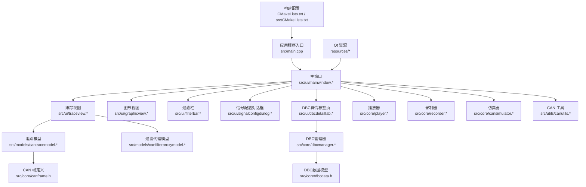
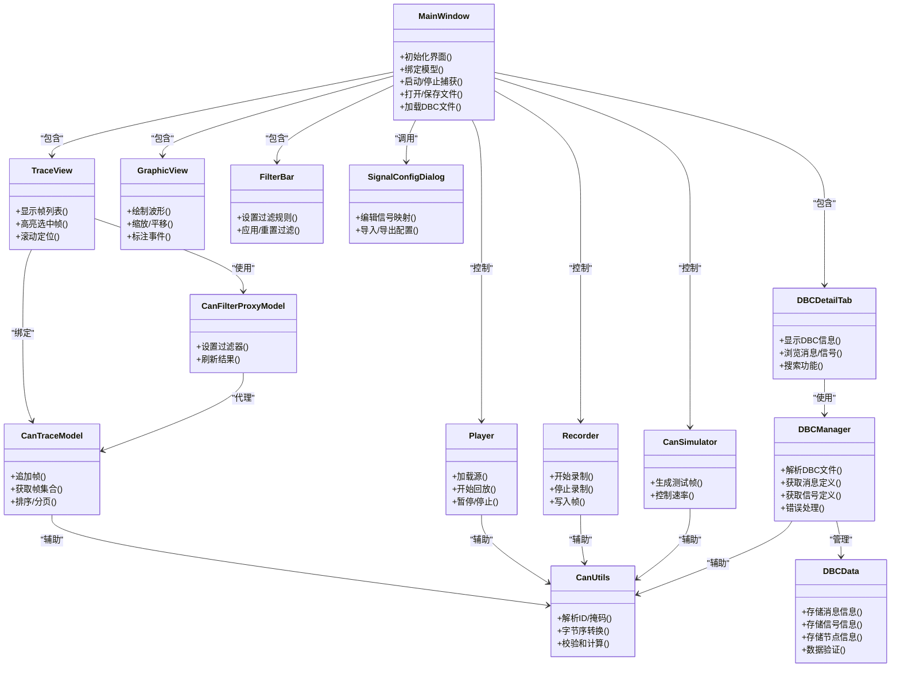
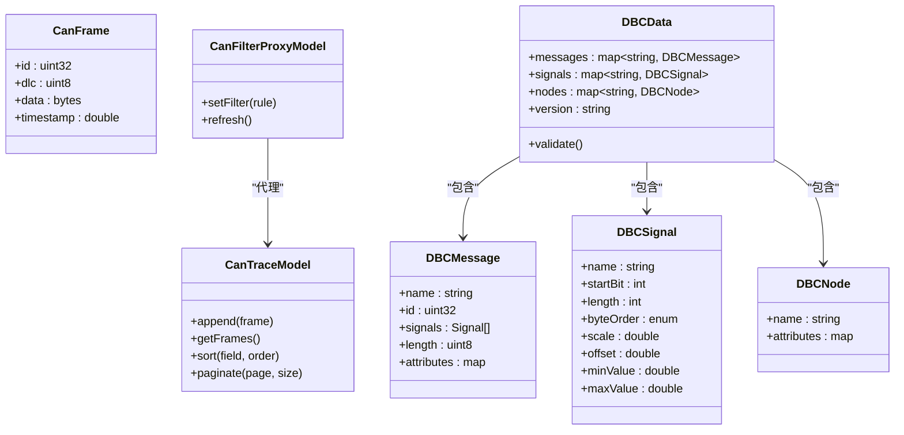
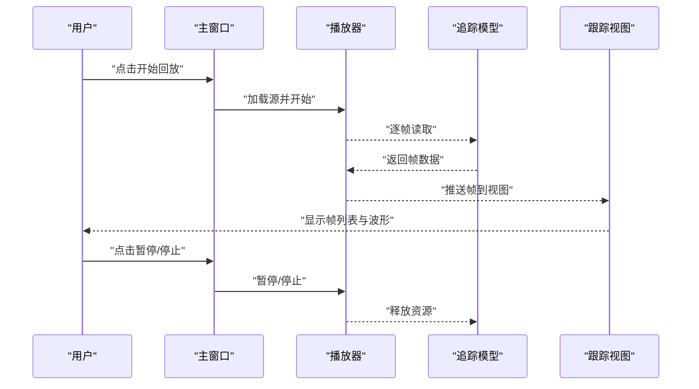
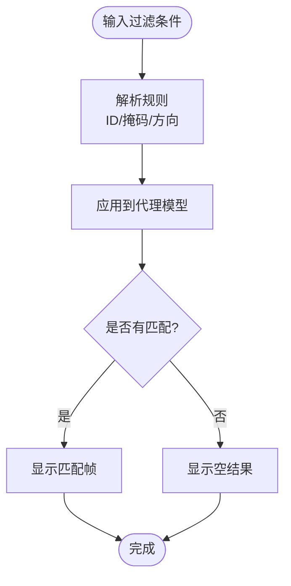
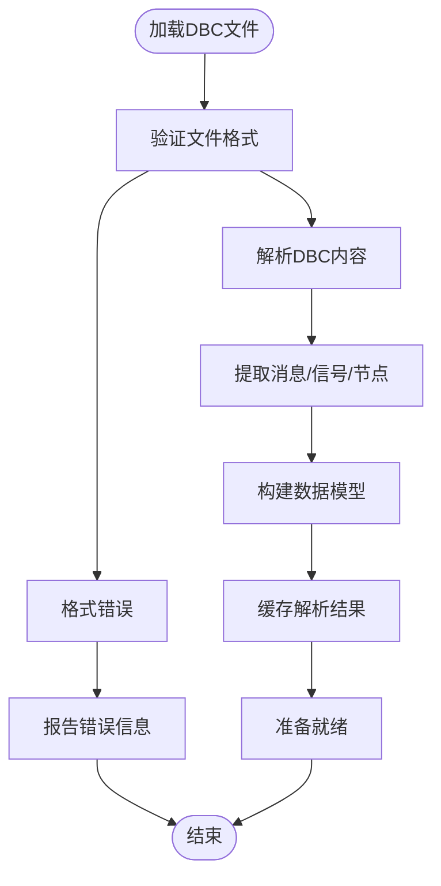
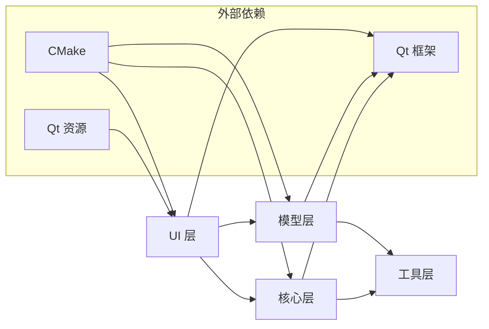

# CAN总线分析工具

<cite>
**本文档引用的文件**   
- [CMakeLists.txt](file://CMakeLists.txt)
- [README.en.md](file://README.en.md)
- [src/main.cpp](file://src/main.cpp)
- [src/CMakeLists.txt](file://src/CMakeLists.txt)
- [src/core/canframe.h](file://src/core/canframe.h)
- [src/core/cansimulator.cpp](file://src/core/cansimulator.cpp)
- [src/core/cansimulator.h](file://src/core/cansimulator.h)
- [src/core/dbcdata.h](file://src/core/dbcdata.h)
- [src/core/dbcmanager.cpp](file://src/core/dbcmanager.cpp)
- [src/core/dbcmanager.h](file://src/core/dbcmanager.h)
- [src/core/player.cpp](file://src/core/player.cpp)
- [src/core/player.h](file://src/core/player.h)
- [src/core/recorder.cpp](file://src/core/recorder.cpp)
- [src/core/recorder.h](file://src/core/recorder.h)
- [src/models/canfilterproxymodel.cpp](file://src/models/canfilterproxymodel.cpp)
- [src/models/canfilterproxymodel.h](file://src/models/canfilterproxymodel.h)
- [src/models/cantracemodel.cpp](file://src/models/cantracemodel.cpp)
- [src/models/cantracemodel.h](file://src/models/cantracemodel.h)
- [src/ui/filterbar.cpp](file://src/ui/filterbar.cpp)
- [src/ui/filterbar.h](file://src/ui/filterbar.h)
- [src/ui/graphicview.cpp](file://src/ui/graphicview.cpp)
- [src/ui/graphicview.h](file://src/ui/graphicview.h)
- [src/ui/mainwindow.cpp](file://src/ui/mainwindow.cpp)
- [src/ui/mainwindow.h](file://src/ui/mainwindow.h)
- [src/ui/dbcdetailtab.cpp](file://src/ui/dbcdetailtab.cpp)
- [src/ui/dbcdetailtab.h](file://src/ui/dbcdetailtab.h)
- [src/ui/signalconfigdialog.cpp](file://src/ui/signalconfigdialog.cpp)
- [src/ui/signalconfigdialog.h](file://src/ui/signalconfigdialog.h)
- [src/ui/traceview.cpp](file://src/ui/traceview.cpp)
- [src/ui/traceview.h](file://src/ui/traceview.h)
- [src/utils/canutils.cpp](file://src/utils/canutils.cpp)
- [src/utils/canutils.h](file://src/utils/canutils.h)
</cite>

## 更新摘要
**所做更改**   
- 新增DBC数据库管理系统的详细文档，包括解析功能、错误处理和验证机制
- 增强CAN总线分析工具的DBC文件支持能力说明
- 添加DBC管理器组件的详细架构分析
- 更新核心组件部分以包含DBC数据处理功能

## 目录
1. [简介](#简介)
2. [项目结构](#项目结构)
3. [核心组件](#核心组件)
4. [架构总览](#架构总览)
5. [详细组件分析](#详细组件分析)
6. [依赖关系分析](#依赖关系分析)
7. [性能考虑](#性能考虑)
8. [故障排查指南](#故障排查指南)
9. [结论](#结论)
10. [附录](#附录)

## 简介
本工具是一个基于 Qt 的 CAN 总线分析应用，提供实时抓包、过滤、回放与录制功能，并通过图形化视图展示信号时序。整体采用分层架构：UI 层负责交互与可视化，模型层封装数据与过滤逻辑，核心层实现播放器、录制器、仿真器与 DBC 数据库管理，工具层提供通用辅助能力。构建系统使用 CMake，资源通过 Qt 资源系统进行管理。

**更新** 增强了 DBC 解析功能，改进了错误处理和 DBC 文件格式验证机制，提供更稳定的 CAN 总线数据库管理能力。

## 项目结构
项目按职责划分为以下模块：
- src/core：CAN 帧数据结构、播放器、录制器、仿真器、DBC 数据库管理
- src/models：CAN 追踪模型与过滤器代理模型
- src/ui：主窗口、跟踪视图、图形视图、过滤栏、信号配置对话框、DBC 详情标签页
- src/utils：CAN 工具函数
- resources：样式与资源文件
- scripts：构建脚本
- CMakeLists.txt：顶层构建配置

图表来源
- [src/main.cpp](file://src/main.cpp)
- [src/ui/mainwindow.h](file://src/ui/mainwindow.h)
- [src/ui/traceview.h](file://src/ui/traceview.h)
- [src/ui/graphicview.h](file://src/ui/graphicview.h)
- [src/ui/filterbar.h](file://src/ui/filterbar.h)
- [src/ui/signalconfigdialog.h](file://src/ui/signalconfigdialog.h)
- [src/ui/dbcdetailtab.h](file://src/ui/dbcdetailtab.h)
- [src/models/cantracemodel.h](file://src/models/cantracemodel.h)
- [src/models/canfilterproxymodel.h](file://src/models/canfilterproxymodel.h)
- [src/core/canframe.h](file://src/core/canframe.h)
- [src/core/dbcmanager.h](file://src/core/dbcmanager.h)
- [src/core/dbcdata.h](file://src/core/dbcdata.h)
- [src/core/player.h](file://src/core/player.h)
- [src/core/recorder.h](file://src/core/recorder.h)
- [src/core/cansimulator.h](file://src/core/cansimulator.h)
- [src/utils/canutils.h](file://src/utils/canutils.h)
- [CMakeLists.txt](file://CMakeLists.txt)
- [src/CMakeLists.txt](file://src/CMakeLists.txt)

章节来源
- [CMakeLists.txt](file://CMakeLists.txt)
- [src/CMakeLists.txt](file://src/CMakeLists.txt)
- [README.en.md](file://README.en.md)

## 核心组件
- CAN 帧定义：统一的数据结构，承载 ID、数据长度、时间戳与载荷等字段，贯穿 UI、模型与核心模块。
- 追踪模型：维护 CAN 帧序列并提供排序、分页与查询接口，供视图层渲染。
- 过滤代理模型：对底层追踪模型进行动态过滤，支持按 ID、掩码、方向等条件筛选。
- 播放器：从文件或缓冲区读取 CAN 帧并按时间轴回放，驱动 UI 更新。
- 录制器：将实时或回放中的 CAN 帧写入文件，支持格式选择与轮转策略。
- 仿真器：生成测试用 CAN 帧流，用于验证 UI 与处理链路。
- DBC 管理器：解析和管理 CAN 总线数据库文件，提供信号映射和消息定义访问。
- DBC 数据模型：存储 DBC 文件的结构化数据，包括消息、信号、节点等信息。
- 工具库：提供字节序转换、校验和计算、字符串解析等通用方法。

**更新** 新增了 DBC 管理器和 DBC 数据模型组件，增强了 CAN 总线数据库的解析和管理能力。

章节来源
- [src/core/canframe.h](file://src/core/canframe.h)
- [src/models/cantracemodel.h](file://src/models/cantracemodel.h)
- [src/models/canfilterproxymodel.h](file://src/models/canfilterproxymodel.h)
- [src/core/player.h](file://src/core/player.h)
- [src/core/recorder.h](file://src/core/recorder.h)
- [src/core/cansimulator.h](file://src/core/cansimulator.h)
- [src/core/dbcmanager.h](file://src/core/dbcmanager.h)
- [src/core/dbcdata.h](file://src/core/dbcdata.h)
- [src/utils/canutils.h](file://src/utils/canutils.h)

## 架构总览
应用采用"UI-Model-Core"三层分离：
- UI 层：主窗口组织各视图与控件，响应用户操作并绑定到模型与核心服务。
- 模型层：数据容器与过滤逻辑，解耦 UI 与业务处理。
- 核心层：播放、录制、仿真、DBC 管理与工具能力，面向模型与 UI 暴露稳定接口。

图表来源
- [src/ui/mainwindow.h](file://src/ui/mainwindow.h)
- [src/ui/traceview.h](file://src/ui/traceview.h)
- [src/ui/graphicview.h](file://src/ui/graphicview.h)
- [src/ui/filterbar.h](file://src/ui/filterbar.h)
- [src/ui/signalconfigdialog.h](file://src/ui/signalconfigdialog.h)
- [src/ui/dbcdetailtab.h](file://src/ui/dbcdetailtab.h)
- [src/models/cantracemodel.h](file://src/models/cantracemodel.h)
- [src/models/canfilterproxymodel.h](file://src/models/canfilterproxymodel.h)
- [src/core/player.h](file://src/core/player.h)
- [src/core/recorder.h](file://src/core/recorder.h)
- [src/core/cansimulator.h](file://src/core/cansimulator.h)
- [src/core/dbcmanager.h](file://src/core/dbcmanager.h)
- [src/core/dbcdata.h](file://src/core/dbcdata.h)
- [src/utils/canutils.h](file://src/utils/canutils.h)

## 详细组件分析

### 主窗口（MainWindow）
- 职责：创建并布局 UI 组件，连接信号槽，协调播放/录制/仿真生命周期，管理模型绑定与状态同步。
- 关键流程：启动时初始化资源与模型；用户操作触发过滤更新、回放控制与录制开关；错误通过消息框提示。
- 交互要点：与 TraceView、GraphicView、FilterBar、SignalConfigDialog、DBCDetailTab 双向通信；与 Player/Recorder/Simulator/DBCManager 单向控制。

**更新** 增加了对 DBC 详情标签页的支持，集成了 DBC 文件管理和解析功能。

章节来源
- [src/ui/mainwindow.cpp](file://src/ui/mainwindow.cpp)
- [src/ui/mainwindow.h](file://src/ui/mainwindow.h)

### 跟踪视图（TraceView）
- 职责：以表格形式展示 CAN 帧，支持排序、搜索、高亮与滚动定位。
- 数据绑定：通过 CanFilterProxyModel 访问 CanTraceModel，确保过滤与排序不影响底层数据。
- 性能优化：延迟渲染、按需加载、批量更新。

章节来源
- [src/ui/traceview.cpp](file://src/ui/traceview.cpp)
- [src/ui/traceview.h](file://src/ui/traceview.h)

### 图形视图（GraphicView）
- 职责：将 CAN 信号转换为波形图，支持多通道叠加、缩放、平移与事件标注。
- 渲染策略：增量绘制、视口裁剪、双缓冲减少闪烁。
- 交互：鼠标滚轮缩放、拖拽平移、点击标注。

章节来源
- [src/ui/graphicview.cpp](file://src/ui/graphicview.cpp)
- [src/ui/graphicview.h](file://src/ui/graphicview.h)

### 过滤栏（FilterBar）
- 职责：提供过滤规则输入（如 ID、掩码、方向），即时应用到代理模型。
- 行为：输入变更触发防抖刷新；支持预设模板与快速切换。

章节来源
- [src/ui/filterbar.cpp](file://src/ui/filterbar.cpp)
- [src/ui/filterbar.h](file://src/ui/filterbar.h)

### 信号配置对话框（SignalConfigDialog）
- 职责：编辑信号名称、起始位、长度、字节序、缩放与偏移等参数，支持导入导出。
- 集成：与 GraphicView 联动，实时更新波形映射。

章节来源
- [src/ui/signalconfigdialog.cpp](file://src/ui/signalconfigdialog.cpp)
- [src/ui/signalconfigdialog.h](file://src/ui/signalconfigdialog.h)

### DBC详情标签页（DBCDetailTab）
- 职责：显示 DBC 文件的详细信息，包括消息定义、信号定义、节点信息等。
- 功能：支持消息浏览、信号搜索、属性查看与层次结构导航。
- 集成：与 DBC 管理器协作，提供实时的 DBC 数据访问和验证。

**新增** 全新的 DBC 详情标签页组件，提供直观的 DBC 文件浏览和管理界面。

章节来源
- [src/ui/dbcdetailtab.cpp](file://src/ui/dbcdetailtab.cpp)
- [src/ui/dbcdetailtab.h](file://src/ui/dbcdetailtab.h)

### 追踪模型（CanTraceModel）
- 职责：存储 CAN 帧序列，提供追加、查询、排序与分页接口。
- 线程安全：在后台线程追加帧，通过信号通知 UI 线程更新。
- 复杂度：追加 O(1)，随机访问 O(1)，排序 O(n log n)。

章节来源
- [src/models/cantracemodel.cpp](file://src/models/cantracemodel.cpp)
- [src/models/cantracemodel.h](file://src/models/cantracemodel.h)

### 过滤代理模型（CanFilterProxyModel）
- 职责：对 CanTraceModel 的结果进行动态过滤，保持与底层模型的解耦。
- 算法：基于规则的匹配与缓存命中，避免重复计算。
- 扩展性：新增过滤条件只需扩展规则集。

章节来源
- [src/models/canfilterproxymodel.cpp](file://src/models/canfilterproxymodel.cpp)
- [src/models/canfilterproxymodel.h](file://src/models/canfilterproxymodel.h)

### 播放器（Player）
- 职责：从文件或内存缓冲读取 CAN 帧，按时间轴回放，驱动 UI 更新。
- 控制：开始、暂停、停止、跳转至指定时间戳。
- 可靠性：断点续播、异常恢复与日志记录。

章节来源
- [src/core/player.cpp](file://src/core/player.cpp)
- [src/core/player.h](file://src/core/player.h)

### 录制器（Recorder）
- 职责：将 CAN 帧写入文件，支持多种格式与轮转策略。
- 特性：异步写入、压缩可选、完整性校验。
- 错误处理：磁盘空间不足、权限问题与重试机制。

章节来源
- [src/core/recorder.cpp](file://src/core/recorder.cpp)
- [src/core/recorder.h](file://src/core/recorder.h)

### 仿真器（CanSimulator）
- 职责：生成测试用 CAN 帧流，模拟真实设备行为。
- 参数：帧率、负载分布、错误注入。
- 用途：自动化测试与演示。

章节来源
- [src/core/cansimulator.cpp](file://src/core/cansimulator.cpp)
- [src/core/cansimulator.h](file://src/core/cansimulator.h)

### DBC管理器（DBCManager）
- 职责：解析和管理 CAN 总线数据库文件，提供信号映射和消息定义访问。
- 功能：DBC 文件解析、数据验证、错误处理、缓存管理。
- 特性：支持标准 DBC 格式、增量解析、内存优化。
- 错误处理：文件格式验证、语法检查、语义验证与详细的错误报告。

**新增** 完整的 DBC 管理器组件，提供强大的 CAN 总线数据库处理能力。

章节来源
- [src/core/dbcmanager.cpp](file://src/core/dbcmanager.cpp)
- [src/core/dbcmanager.h](file://src/core/dbcmanager.h)

### DBC数据模型（DBCData）
- 职责：存储 DBC 文件的结构化数据，包括消息、信号、节点等信息。
- 结构：消息定义、信号定义、节点定义、属性定义、版本信息。
- 验证：数据完整性检查、格式验证、约束检查。

**新增** DBC 数据模型组件，为 DBC 管理器提供数据存储和验证功能。

章节来源
- [src/core/dbcdata.h](file://src/core/dbcdata.h)

### 工具库（CanUtils）
- 职责：提供 CAN 相关通用方法，如 ID/掩码解析、字节序转换、校验和计算。
- 设计：无状态函数集合，便于跨模块复用。

章节来源
- [src/utils/canutils.cpp](file://src/utils/canutils.cpp)
- [src/utils/canutils.h](file://src/utils/canutils.h)

### 数据模型类图（简化）

图表来源
- [src/core/canframe.h](file://src/core/canframe.h)
- [src/models/cantracemodel.h](file://src/models/cantracemodel.h)
- [src/models/canfilterproxymodel.h](file://src/models/canfilterproxymodel.h)
- [src/core/dbcdata.h](file://src/core/dbcdata.h)

### 回放序列图（代码级）

图表来源
- [src/core/player.cpp](file://src/core/player.cpp)
- [src/models/cantracemodel.cpp](file://src/models/cantracemodel.cpp)
- [src/ui/traceview.cpp](file://src/ui/traceview.cpp)
- [src/ui/mainwindow.cpp](file://src/ui/mainwindow.cpp)

### 过滤流程图（代码级）

图表来源
- [src/models/canfilterproxymodel.cpp](file://src/models/canfilterproxymodel.cpp)
- [src/ui/filterbar.cpp](file://src/ui/filterbar.cpp)

### DBC解析流程图（代码级）

图表来源
- [src/core/dbcmanager.cpp](file://src/core/dbcmanager.cpp)
- [src/core/dbcdata.h](file://src/core/dbcdata.h)

## 依赖关系分析
- 模块耦合：UI 层依赖模型与核心层；模型层仅依赖工具层；核心层不依赖 UI。
- 外部依赖：Qt GUI/Widgets、CMake 构建系统、Qt 资源系统。
- 潜在循环：通过接口与信号槽避免直接循环依赖。

图表来源
- [CMakeLists.txt](file://CMakeLists.txt)
- [src/CMakeLists.txt](file://src/CMakeLists.txt)
- [resources/resources.qrc](file://resources/resources.qrc)

章节来源
- [CMakeLists.txt](file://CMakeLists.txt)
- [src/CMakeLists.txt](file://src/CMakeLists.txt)

## 性能考虑
- 大数据量渲染：使用延迟渲染与视口裁剪，避免全量重绘。
- 线程模型：后台线程追加帧，UI 线程仅处理展示，降低卡顿。
- 过滤优化：规则缓存与增量更新，减少重复计算。
- I/O 优化：异步写入与批处理，降低磁盘压力。
- 内存管理：对象池与引用计数，避免频繁分配与回收。
- DBC解析优化：增量解析、结果缓存、内存池管理，提升大文件处理性能。

**更新** 增加了 DBC 解析的性能优化策略，包括增量解析、结果缓存和内存池管理。

## 故障排查指南
- 无法加载资源：检查 Qt 资源路径与编译输出目录是否一致。
- 回放卡顿：确认模型追加频率与 UI 刷新间隔，启用批量更新。
- 过滤无效：验证规则解析与匹配逻辑，检查代理模型刷新时机。
- 录制失败：检查磁盘权限与空间，查看错误日志与重试策略。
- 波形错位：核对信号映射参数（起始位、长度、字节序）。
- DBC文件解析失败：检查文件格式是否正确，验证语法和语义，查看详细错误信息。
- DBC数据不一致：验证数据完整性，检查约束条件，重新解析文件。

**更新** 新增了 DBC 文件相关的故障排查指南，包括文件格式验证、语法检查和数据一致性检查。

章节来源
- [src/ui/mainwindow.cpp](file://src/ui/mainwindow.cpp)
- [src/models/canfilterproxymodel.cpp](file://src/models/canfilterproxymodel.cpp)
- [src/core/recorder.cpp](file://src/core/recorder.cpp)
- [src/ui/graphicview.cpp](file://src/ui/graphicview.cpp)
- [src/core/dbcmanager.cpp](file://src/core/dbcmanager.cpp)

## 结论
该 CAN 总线分析工具通过清晰的层次划分与稳定的接口设计，实现了高效的抓包、过滤、回放与录制功能。UI 与模型解耦提升了可维护性与可扩展性，核心层提供了可靠的播放、录制、仿真与 DBC 数据库管理能力。新增的 DBC 解析功能增强了工具的专业性和实用性，为 CAN 总线开发提供了完整的解决方案。建议在后续迭代中继续优化渲染与 I/O 性能，并增强错误诊断与用户引导。

**更新** 强调了新增的 DBC 数据库管理功能对工具专业性的提升，为 CAN 总线开发提供了更完整的解决方案。

## 附录
- 构建说明：使用 CMake 配置与生成工程，参考顶层与 src 下的构建文件。
- 资源管理：样式与图标通过 Qt 资源系统集成，确保跨平台一致性。
- 扩展建议：新增过滤类型、信号映射与导出格式时，优先扩展工具层与模型层。
- DBC支持：支持标准 DBC 文件格式，提供完整的消息、信号、节点信息管理。

**更新** 新增了 DBC 支持的说明，强调了对标准 DBC 文件格式的完整支持。

章节来源
- [CMakeLists.txt](file://CMakeLists.txt)
- [src/CMakeLists.txt](file://src/CMakeLists.txt)
- [resources/styles/default.qss](file://resources/styles/default.qss)
- [resources/resources.qrc](file://resources/resources.qrc)