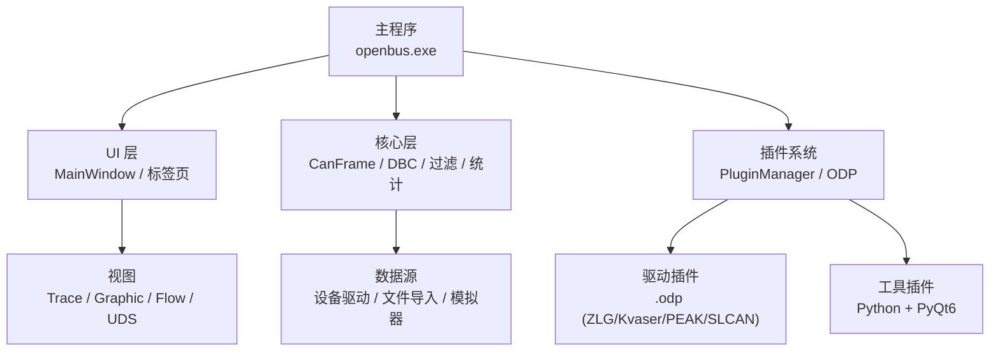
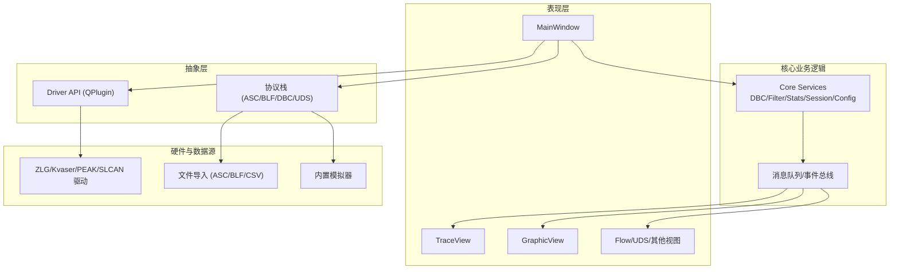
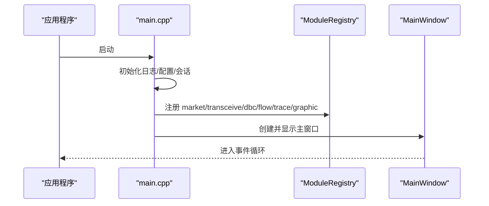
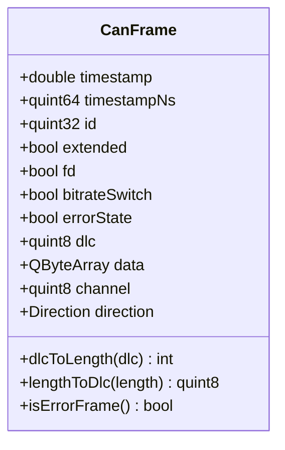
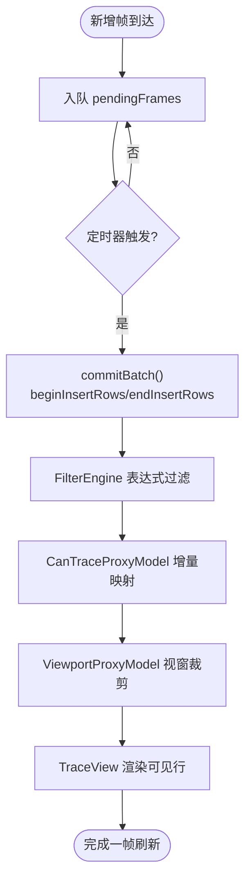
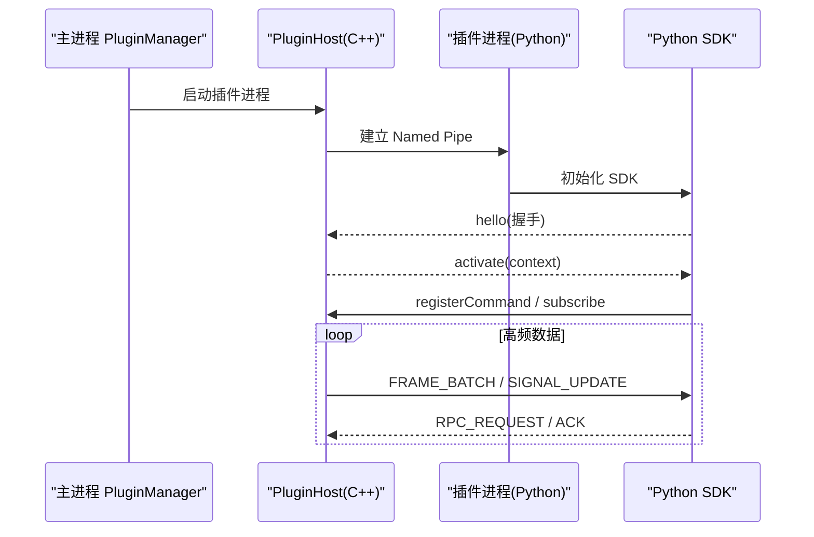
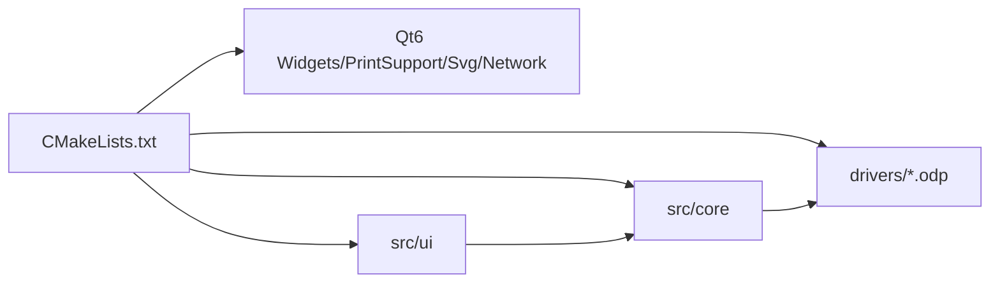

# 需求规格说明

<cite>
**本文引用的文件**
- [README.md](file://README.md)
- [Requirements_Specification.md](file://doc/Requirements_Specification.md)
- [System_Architecture.md](file://doc/System_Architecture.md)
- [Trace模块设计文档.md](file://doc/Trace模块设计文档.md)
- [插件系统方案.md](file://doc/插件系统方案.md)
- [main.cpp](file://src/main.cpp)
- [CMakeLists.txt](file://CMakeLists.txt)
- [canframe.h](file://src/core/canframe.h)
- [mainwindow.h](file://src/ui/mainwindow.h)
</cite>

## 目录
1. [引言](#引言)
2. [项目结构](#项目结构)
3. [核心组件](#核心组件)
4. [架构总览](#架构总览)
5. [详细组件分析](#详细组件分析)
6. [依赖关系分析](#依赖关系分析)
7. [性能与容量目标](#性能与容量目标)
8. [故障排查指南](#故障排查指南)
9. [结论](#结论)
10. [附录](#附录)

## 引言
本需求规格说明面向 openbus——一款面向 CAN/CAN FD 的报文录制、回放、解析与分析桌面工具。目标是在保证高性能与高可用性的前提下，提供对标行业标杆（如 CANoe、Wireshark）的核心能力：实时/离线 Trace 列表、DBC 信号解码、Graphic 波形视图、插件化扩展、驱动市场与统一工具生态。本文档基于仓库现有设计与实现，梳理产品目标、功能范围、关键约束与验收指标，为后续迭代与交付提供基线。

**章节来源**
- [README.md:17-111](file://README.md#L17-L111)
- [Requirements_Specification.md:22-43](file://doc/Requirements_Specification.md#L22-L43)

## 项目结构
openbus 采用分层与模块化组织：
- 顶层 CMake 工程管理与 Qt 依赖集成
- src 为核心代码：core（数据模型与引擎）、ui（Qt 界面）、models（表格/代理模型）、utils（通用工具）
- drivers 与 plugins 分别承载硬件驱动插件与业务工具插件
- doc 存放架构、需求与设计文档
- resources 与 UI 资源用于主题与原型页面

**图表来源**
- [System_Architecture.md:28-68](file://doc/System_Architecture.md#L28-L68)
- [main.cpp:21-64](file://src/main.cpp#L21-L64)

**章节来源**
- [CMakeLists.txt:1-95](file://CMakeLists.txt#L1-L95)
- [System_Architecture.md:75-138](file://doc/System_Architecture.md#L75-L138)

## 核心组件
- CanFrame：统一的帧数据结构，承载时间戳、ID、DLC、数据、通道、方向及标志位，贯穿录制、回放、显示与图形绘制全流程。
- MainWindow：应用壳，负责菜单、布局、Dock、状态栏、活动栏、页面编排与跨模块调用（trace/graphic/transceive/flow/market）。
- Trace 模块：报文列表视图与过滤、排序、导航、着色、书签、覆盖模式、视窗缩略图与批量刷新等。
- Graphic 模块：信号波形绘制、多信号叠加、缩放平移、回放控制与测量。
- 插件系统：进程隔离的双通道通信（JSON-RPC 控制通道 + 二进制数据通道），支持 Python 插件与 PyQt6 独立窗口。
- 驱动系统：ODP 驱动的发现、安装、热加载与卸载；设备市场索引与一键安装流程。

**章节来源**
- [canframe.h:14-125](file://src/core/canframe.h#L14-L125)
- [mainwindow.h:43-329](file://src/ui/mainwindow.h#L43-L329)
- [Trace模块设计文档.md:50-93](file://doc/Trace模块设计文档.md#L50-L93)
- [插件系统方案.md:17-100](file://doc/插件系统方案.md#L17-L100)

## 架构总览
openbus 遵循“表现层—核心业务逻辑—抽象层—硬件与数据源”的分层架构，并通过插件机制实现横向扩展。

**图表来源**
- [System_Architecture.md:28-68](file://doc/System_Architecture.md#L28-L68)

**章节来源**
- [System_Architecture.md:28-68](file://doc/System_Architecture.md#L28-L68)

## 详细组件分析

### 应用启动与模块注册
- 入口 main.cpp 初始化 Qt 应用、日志、配置与会话，注册各业务模块（market、transceive、dbc、flow、trace、graphic），并创建主窗口。
- 通过 ModuleRegistry 将各模块工厂函数注入，实现按模块拆分与按需加载。

**图表来源**
- [main.cpp:21-64](file://src/main.cpp#L21-L64)

**章节来源**
- [main.cpp:21-64](file://src/main.cpp#L21-L64)

### 数据模型：CanFrame
- CanFrame 定义帧的时间戳（秒与纳秒）、ID、扩展/FD/BRS/ESI 标志、DLC、数据、通道与方向，并提供 DLC 转换、错误帧判断与序列化接口。
- 该结构是 Trace、Graphic、Recorder、Player、Simulator 等模块共享的数据契约。

**图表来源**
- [canframe.h:14-125](file://src/core/canframe.h#L14-L125)

**章节来源**
- [canframe.h:14-125](file://src/core/canframe.h#L14-L125)

### Trace 视图与过滤
- Trace 视图提供 Wireshark 风格列表：No./Time/Delta/Ch/Dir/ID/DLC/Data/Flags/Count 等多列显示，支持表达式过滤、列筛选、排序、书签、着色规则、覆盖模式、视窗缩略图与批量刷新。
- 性能优化分阶段完成：延迟格式化+可见行缓存、批量更新+可调刷新率、增量过滤代理、环形缓冲存储。

**图表来源**
- [Trace模块设计文档.md:126-188](file://doc/Trace模块设计文档.md#L126-L188)

**章节来源**
- [Trace模块设计文档.md:50-93](file://doc/Trace模块设计文档.md#L50-L93)
- [Trace模块设计文档.md:112-200](file://doc/Trace模块设计文档.md#L112-L200)

### 插件系统与双通道通信
- 插件运行在独立 Python 进程中，通过 Named Pipe 与主进程通信：控制通道使用 JSON-RPC 2.0，数据通道使用自定义二进制协议，支持帧批量推送与订阅制数据分发。
- 插件通过 plugin.json 声明式贡献点注册命令、视图与数据输入输出，主程序无需修改即可发现与集成。

**图表来源**
- [插件系统方案.md:34-100](file://doc/插件系统方案.md#L34-L100)
- [插件系统方案.md:102-185](file://doc/插件系统方案.md#L102-L185)

**章节来源**
- [插件系统方案.md:17-100](file://doc/插件系统方案.md#L17-L100)
- [插件系统方案.md:102-185](file://doc/插件系统方案.md#L102-L185)

### 驱动系统与设备市场
- 驱动以 .odp 包形式提供，包含 driver.json、驱动 DLL 与校验文件；通过 DriverRegistry 热加载/禁用/卸载，支持设备市场索引与一键安装。
- 已集成 ZLG、Kvaser、PEAK、SLCAN 等厂商驱动插件，设备树动态渲染厂商分区。

**章节来源**
- [README.md:77-83](file://README.md#L77-L83)

## 依赖关系分析
- 构建系统：CMake 管理 Qt6 组件（Widgets/PrintSupport/Svg/Network），启用 AUTOMOC/AUTOUIC/AUTORCC，MinGW 下使用默认链接器与 thin archive 加速静态库重打包。
- 运行时依赖：windeployqt 自动部署 Qt 运行时与平台/样式插件；第三方库通过 third_party/Dependencies.cmake 引入。
- 模块耦合：MainWindow 作为壳协调 trace/graphic/transceive/flow/market 模块，通过 shellInvoke/query 进行跨模块调用，降低直接耦合。

**图表来源**
- [CMakeLists.txt:63-95](file://CMakeLists.txt#L63-L95)

**章节来源**
- [CMakeLists.txt:1-95](file://CMakeLists.txt#L1-L95)

## 性能与容量目标
- Trace 视图性能目标：
  - 10 万帧离线加载 <1s
  - 10 万帧滚动浏览流畅 60fps
  - 5000 帧/s 实时捕获 CPU <20%
  - 过滤条件切换（10 万帧）<500ms
  - 时间格式切换（10 万帧）<100ms
  - 百万帧加载 <5s，内存 <500MB
- 图形视图：多信号叠加、缩放平移、回放控制与测量，满足实时与离线场景。
- 插件数据通道：二进制协议压缩比约 9×，满足高吞吐需求。

**章节来源**
- [Trace模块设计文档.md:190-200](file://doc/Trace模块设计文档.md#L190-L200)
- [插件系统方案.md:149-155](file://doc/插件系统方案.md#L149-L155)

## 故障排查指南
- 启动异常：检查 Qt 路径、编译器与 CMake 配置；确认 windeployqt 已正确部署依赖。
- 插件崩溃：插件进程崩溃会由 PluginHost 监控并尝试重启；查看输出面板与日志定位问题。
- Trace 卡顿：确认刷新率设置、过滤表达式复杂度与可视行数；必要时降低刷新频率或简化表达式。
- 驱动加载失败：检查 .odp 包完整性与 sha256 校验；确认驱动已安装且未被禁用。

**章节来源**
- [插件系统方案.md:66-72](file://doc/插件系统方案.md#L66-L72)
- [System_Architecture.md:281-295](file://doc/System_Architecture.md#L281-L295)

## 结论
openbus 以分层架构与插件化设计为基础，实现了高性能的 Trace 列表、信号波形可视化、DBC 解码、驱动与工具插件生态，具备与行业标杆对齐的核心能力。后续可围绕 Data Window、游标测量、统计增强、ARXML 支持、脚本引擎与测试系统等优先级任务持续演进，进一步提升用户体验与自动化能力。

[无章节来源]

## 附录
- 版本与里程碑：参考 Requirements_Specification.md 的版本信息与发布计划。
- 技术栈：Qt 6.8.3、C++17、CMake 3.21+、MinGW/MSVC。
- 构建与部署：见 README.md 的安装教程与构建步骤。

**章节来源**
- [Requirements_Specification.md:277-311](file://doc/Requirements_Specification.md#L277-L311)
- [README.md:613-641](file://README.md#L613-L641)