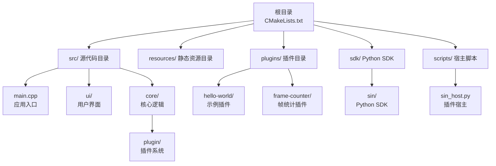
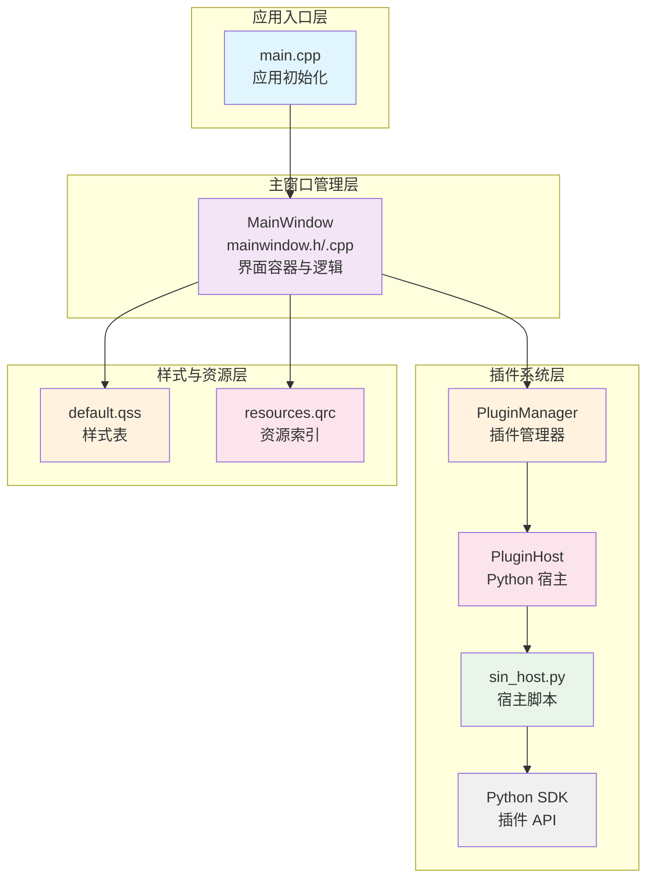
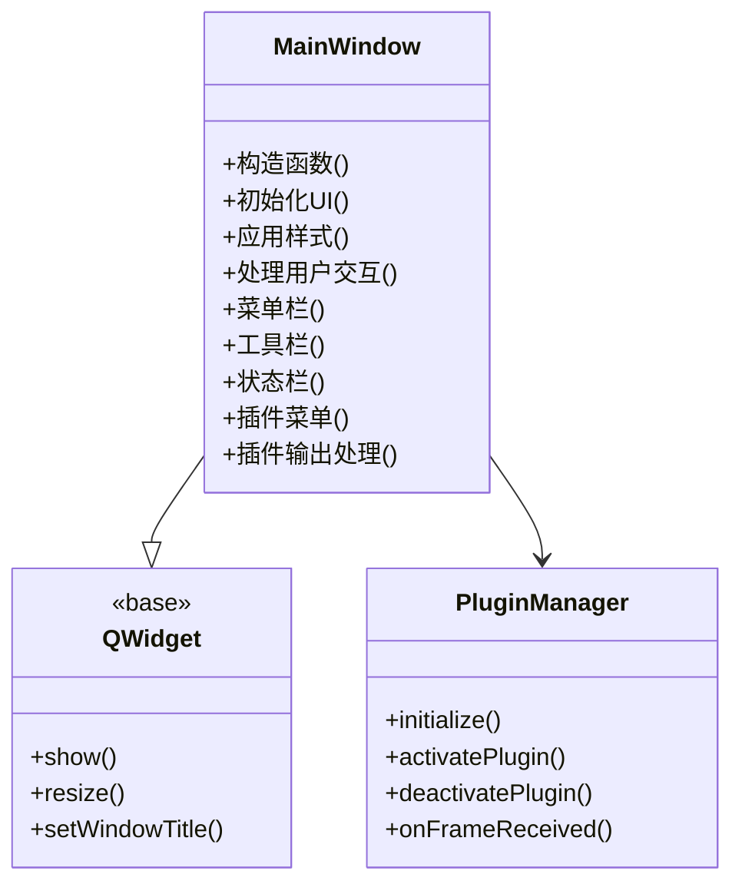
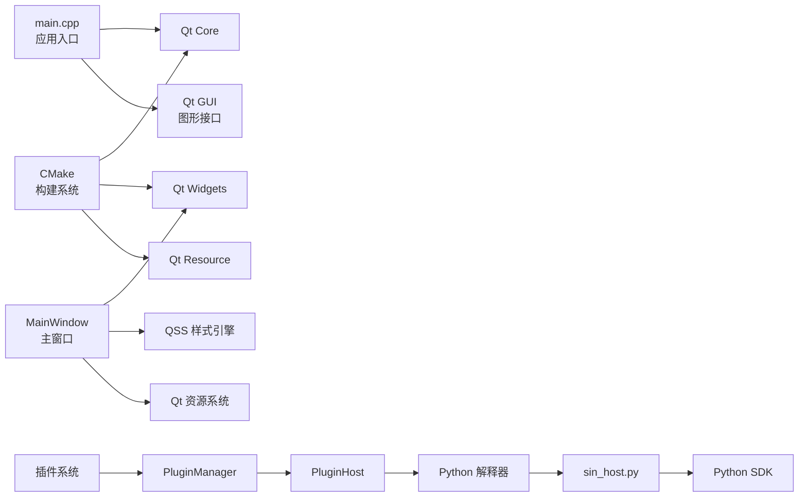

# 项目概述

<cite>
**本文引用的文件**
- [CMakeLists.txt](file://CMakeLists.txt)
- [src/CMakeLists.txt](file://src/CMakeLists.txt)
- [src/main.cpp](file://src/main.cpp)
- [src/ui/mainwindow.h](file://src/ui/mainwindow.h)
- [src/ui/mainwindow.cpp](file://src/ui/mainwindow.cpp)
- [resources/styles/default.qss](file://resources/styles/default.qss)
- [resources/resources.qrc](file://resources/resources.qrc)
- [README.md](file://README.md)
- [README.en.md](file://README.en.md)
- [src/core/plugin/pluginmanager.h](file://src/core/plugin/pluginmanager.h)
- [src/core/plugin/pluginmanager.cpp](file://src/core/plugin/pluginmanager.cpp)
- [src/core/plugin/pluginhost.h](file://src/core/plugin/pluginhost.h)
- [src/core/plugin/plugininfo.h](file://src/core/plugin/plugininfo.h)
- [scripts/sin_host.py](file://scripts/sin_host.py)
- [sdk/sin/__init__.py](file://sdk/sin/__init__.py)
- [sdk/sin/output.py](file://sdk/sin/output.py)
- [sdk/sin/frames.py](file://sdk/sin/frames.py)
- [plugins/hello-world/plugin.json](file://plugins/hello-world/plugin.json)
- [plugins/hello-world/main.py](file://plugins/hello-world/main.py)
- [plugins/frame-counter/main.py](file://plugins/frame-counter/main.py)
</cite>

## 更新摘要
**所做更改**
- 重大架构增强：新增完整的 Python 插件生态系统，将 sin 从独立应用程序升级为可扩展平台
- 新增插件管理器、宿主进程管理、SDK 接口和示例插件
- 更新了主窗口以集成插件系统，包括插件菜单和输出面板
- 增强了构建配置以支持插件发现和动态加载
- 添加了插件开发指南和扩展点说明

## 目录
1. [简介](#简介)
2. [项目结构](#项目结构)
3. [核心组件](#核心组件)
4. [架构总览](#架构总览)
5. [详细组件分析](#详细组件分析)
6. [依赖关系分析](#依赖关系分析)
7. [性能考虑](#性能考虑)
8. [故障排查指南](#故障排查指南)
9. [结论](#结论)
10. [附录](#附录)

## 简介
本项目是一个基于 Qt/C++ 的现代化桌面应用程序，现已升级为可扩展的 CAN 总线分析平台。项目的核心目标是为桌面端提供一个统一的界面入口、样式管理与资源组织方式，并通过模块化设计将主窗口、UI 布局与样式资源解耦，便于扩展与维护。

技术栈以 Qt（Widgets）为核心框架，配合 Qt 资源系统与 QSS 样式表实现跨平台一致的视觉表现。项目采用了标准的 Qt 应用开发模式，包括主窗口管理、信号槽机制、事件处理等核心特性。

**重大更新**：项目已集成完整的 Python 插件生态系统，通过 JSON-RPC 通信协议实现 C++ 主程序与 Python 插件之间的双向通信。现在 sin 不仅是一个独立的 CAN 总线分析工具，更是一个可扩展的平台，支持第三方开发者创建自定义功能模块。

## 项目结构
项目采用分层与按功能划分相结合的目录组织方式，体现了清晰的模块化设计：

**目录结构说明：**
- **src/**：源代码目录，包含应用入口、主窗口逻辑与 UI 定义
- **resources/**：静态资源目录，包含样式表与 Qt 资源索引
- **plugins/**：插件目录，包含各种 Python 插件及其配置文件
- **sdk/**：Python SDK，提供插件开发所需的 API 接口
- **scripts/**：宿主脚本，负责插件生命周期管理和通信
- **根级 CMakeLists.txt**：顶层构建配置，协调子模块与资源打包

**章节来源**
- [CMakeLists.txt](file://CMakeLists.txt)
- [src/CMakeLists.txt](file://src/CMakeLists.txt)
- [src/main.cpp](file://src/main.cpp)
- [src/ui/mainwindow.h](file://src/ui/mainwindow.h)
- [src/ui/mainwindow.cpp](file://src/ui/mainwindow.cpp)
- [resources/styles/default.qss](file://resources/styles/default.qss)
- [resources/resources.qrc](file://resources/resources.qrc)
- [README.md](file://README.md)

## 核心组件
项目由以下核心组件构成，每个组件都有明确的职责分工：

### 应用入口（main.cpp）
- 负责 Qt 应用生命周期初始化、全局设置与主窗口创建展示
- 配置应用程序属性（如高 DPI 支持、字体缩放等）
- 加载全局样式表并启动主窗口
- 控制应用生命周期，确保异常退出时资源正确释放

### 主窗口（MainWindow）
- 继承自 Qt 主窗口基类，封装界面容器与交互逻辑
- 在构造函数或初始化方法中完成 UI 绑定、信号槽连接与样式应用
- 管理菜单、工具栏、状态栏等标准 UI 元素
- 协调业务交互与事件处理
- **新增**：集成插件系统，管理插件菜单和输出面板

### 插件管理系统
- **PluginManager**：单例模式的插件管理器，负责插件发现、激活、停用和消息分发
- **PluginHost**：Python 插件宿主进程管理，通过 QProcess 启动和管理 Python 子进程
- **PluginInfo**：插件元数据描述，解析 plugin.json 配置文件
- **JSON-RPC 通信**：通过 stdin/stdout 进行双向通信，支持异步请求和响应

### 样式系统（default.qss）
- 集中管理所有控件样式，支持主题切换与多分辨率适配
- 通过 qss 语法统一设置颜色、字体、边距、边框等
- 提供一致的用户体验和品牌化外观

### 资源管理（resources.qrc）
- 定义资源前缀与文件映射，供 Qt 资源系统编译为二进制资源
- 通过 :/ 前缀在代码中引用资源，提高可移植性与部署便利性
- 统一管理图标、图片、样式等资源文件

**职责分工：**
- **主窗口管理**：MainWindow 负责界面容器与事件分发
- **插件系统**：PluginManager 协调插件生命周期，PluginHost 管理 Python 进程通信
- **样式系统**：QSS 文件集中管理视觉样式，避免硬编码样式
- **资源管理**：qrc 统一管理图标、图片、样式等资源路径，提升可移植性

**章节来源**
- [src/main.cpp](file://src/main.cpp)
- [src/ui/mainwindow.h](file://src/ui/mainwindow.h)
- [src/ui/mainwindow.cpp](file://src/ui/mainwindow.cpp)
- [src/core/plugin/pluginmanager.h](file://src/core/plugin/pluginmanager.h)
- [src/core/plugin/pluginhost.h](file://src/core/plugin/pluginhost.h)
- [resources/styles/default.qss](file://resources/styles/default.qss)
- [resources/resources.qrc](file://resources/resources.qrc)

## 架构总览
本项目的架构遵循"入口—主窗口—插件系统—样式—资源"的分层模式，体现了清晰的责任分离：

**架构层次说明：**
- **入口层**：main.cpp 初始化 QApplication/QGuiApplication，加载样式，启动主窗口
- **表现层**：MainWindow 作为主容器，组合 UI 控件与行为
- **插件层**：PluginManager 协调插件生命周期，PluginHost 管理 Python 进程通信
- **宿主层**：sin_host.py 负责插件加载、命令分发和消息路由
- **SDK 层**：Python SDK 提供插件开发所需的 API 接口
- **样式层**：default.qss 提供全局样式覆盖
- **资源层**：resources.qrc 提供资源编译与运行时访问

**图表来源**
- [src/main.cpp](file://src/main.cpp)
- [src/ui/mainwindow.h](file://src/ui/mainwindow.h)
- [src/ui/mainwindow.cpp](file://src/ui/mainwindow.cpp)
- [src/core/plugin/pluginmanager.h](file://src/core/plugin/pluginmanager.h)
- [src/core/plugin/pluginhost.h](file://src/core/plugin/pluginhost.h)
- [scripts/sin_host.py](file://scripts/sin_host.py)
- [sdk/sin/__init__.py](file://sdk/sin/__init__.py)
- [resources/styles/default.qss](file://resources/styles/default.qss)
- [resources/resources.qrc](file://resources/resources.qrc)

## 详细组件分析

### 应用入口（main.cpp）
应用入口是整个程序的起点，负责：
- 创建 Qt 应用实例并配置全局属性
- 设置应用程序元数据（名称、版本、组织信息等）
- 加载全局样式表和字体配置
- 创建并显示主窗口实例
- 进入 Qt 事件循环，处理用户交互

**章节来源**
- [src/main.cpp](file://src/main.cpp)

### 主窗口（MainWindow）
主窗口是应用的核心容器，实现了：
- 继承 Qt 主窗口基类，提供标准窗口功能
- 在构造函数中完成 UI 初始化与绑定
- 建立信号槽连接，处理用户交互事件
- 集成样式系统和资源管理
- 提供扩展点供业务逻辑接入
- **新增**：集成插件系统，创建插件菜单和处理插件输出

**图表来源**
- [src/ui/mainwindow.h](file://src/ui/mainwindow.h)
- [src/ui/mainwindow.cpp](file://src/ui/mainwindow.cpp)
- [src/core/plugin/pluginmanager.h](file://src/core/plugin/pluginmanager.h)

**章节来源**
- [src/ui/mainwindow.h](file://src/ui/mainwindow.h)
- [src/ui/mainwindow.cpp](file://src/ui/mainwindow.cpp)

### 插件管理系统

#### PluginManager（插件管理器）
- 单例模式，负责插件发现、激活、停用和消息分发
- 扫描 plugins/ 目录，加载所有 plugin.json 配置文件
- 启动 Python 宿主进程，激活 onStartup 插件
- 将 CAN 帧转发给已激活的 onFrame 插件
- 管理插件的生命周期和状态

#### PluginHost（插件宿主）
- 负责启动/停止 Python 子进程 (sin_host.py)
- 通过 newline-delimited JSON 进行双向通信
- 管理异步请求的回调
- 崩溃后自动重启（指数退避）

#### PluginInfo（插件信息）
- 从 plugin.json 解析插件元数据
- 类似 VSCode 的 package.json，描述插件的名称、入口、激活事件和贡献点
- 支持命令注册、文件格式扩展等贡献点

**章节来源**
- [src/core/plugin/pluginmanager.h](file://src/core/plugin/pluginmanager.h)
- [src/core/plugin/pluginmanager.cpp](file://src/core/plugin/pluginmanager.cpp)
- [src/core/plugin/pluginhost.h](file://src/core/plugin/pluginhost.h)
- [src/core/plugin/plugininfo.h](file://src/core/plugin/plugininfo.h)

### Python 插件宿主（sin_host.py）
- 从 stdin 读取 JSON-RPC，分发到已加载插件
- 通信协议: newline-delimited JSON-RPC 2.0 over stdin/stdout
- SDK 模块 `sin` 通过同一 stdout 管道与主程序通信
- 检测 PyQt6 是否可用（决定是否启用 UI 功能和 Qt 事件循环）
- 管理插件的加载、激活、停用和命令执行

**章节来源**
- [scripts/sin_host.py](file://scripts/sin_host.py)

### Python SDK
- **output.py**：输出面板 API，将文本输出到主程序底部面板
- **frames.py**：CAN 帧操作 API，获取选中帧、最近帧和发送帧
- **__init__.py**：SDK 入口，导出公共 API 接口
- **commands.py**：命令注册和管理
- **workspace.py**：工作区管理
- **signals.py**：信号系统
- **ui.py**：UI 相关功能（需要 PyQt6）

**章节来源**
- [sdk/sin/__init__.py](file://sdk/sin/__init__.py)
- [sdk/sin/output.py](file://sdk/sin/output.py)
- [sdk/sin/frames.py](file://sdk/sin/frames.py)

### 示例插件

#### hello-world 插件
- 最简示例插件，演示插件系统的基本用法
- 启动时输出欢迎消息
- 注册一个命令，点击后在输出面板显示问候

#### frame-counter 插件
- 帧统计示例，演示 onFrame 事件的使用
- 实时统计接收到的 CAN 帧数量
- 按 CAN ID 分类统计
- 通过命令输出统计报告

**章节来源**
- [plugins/hello-world/plugin.json](file://plugins/hello-world/plugin.json)
- [plugins/hello-world/main.py](file://plugins/hello-world/main.py)
- [plugins/frame-counter/main.py](file://plugins/frame-counter/main.py)

### 样式系统（default.qss）
样式系统提供了统一的视觉表现：
- 集中管理所有控件的样式定义
- 支持主题切换和动态样式更新
- 提供跨平台一致的视觉效果
- 支持媒体查询和条件样式

**章节来源**
- [resources/styles/default.qss](file://resources/styles/default.qss)

### 资源管理（resources.qrc）
资源管理系统确保了资源的统一访问：
- 定义资源前缀和文件映射关系
- 编译资源为二进制格式，提高加载效率
- 支持运行时资源访问和热更新
- 提供类型安全的资源引用机制

**章节来源**
- [resources/resources.qrc](file://resources/resources.qrc)

### 构建配置（CMakeLists）
CMake 构建系统提供了灵活的构建配置：
- 根级 CMakeLists.txt 协调子模块与资源打包
- src/CMakeLists.txt 定义 Qt 模块依赖、源文件集合与输出目标
- 支持多平台构建和交叉编译
- 集成 Qt 自动化工具（MOC、UIC、RCC）

**章节来源**
- [CMakeLists.txt](file://CMakeLists.txt)
- [src/CMakeLists.txt](file://src/CMakeLists.txt)

## 依赖关系分析
项目依赖于以下核心组件和库：

**主要依赖：**
- **Qt Widgets**：用于构建桌面 GUI 界面
- **Qt Core/GUI**：基础类型与图形接口
- **CMake**：现代构建系统，支持跨平台编译
- **Qt 资源系统**：qrc 编译与运行时访问
- **QSS**：Qt 样式表引擎，提供 CSS 风格的样式定义
- **Python**：插件系统运行环境，支持插件开发和扩展
- **JSON-RPC**：C++ 与 Python 之间的通信协议

**章节来源**
- [CMakeLists.txt](file://CMakeLists.txt)
- [src/CMakeLists.txt](file://src/CMakeLists.txt)
- [src/main.cpp](file://src/main.cpp)
- [src/ui/mainwindow.h](file://src/ui/mainwindow.h)
- [src/ui/mainwindow.cpp](file://src/ui/mainwindow.cpp)
- [resources/styles/default.qss](file://resources/styles/default.qss)
- [resources/resources.qrc](file://resources/resources.qrc)
- [src/core/plugin/pluginmanager.h](file://src/core/plugin/pluginmanager.h)
- [scripts/sin_host.py](file://scripts/sin_host.py)

## 性能考虑
为了获得最佳的性能表现，项目采用了以下优化策略：

### 启动优化
- **样式预加载**：在应用启动时一次性加载 QSS，避免重复解析开销
- **资源内嵌**：通过 qrc 访问资源可减少 I/O 开销，提升启动速度
- **延迟初始化**：复杂控件按需初始化，减少首屏渲染时间
- **插件懒加载**：插件仅在需要时激活，减少启动时间

### 运行时优化
- **事件处理优化**：合理拆分信号槽，避免在主线程执行耗时操作
- **内存管理**：利用 Qt 的对象树机制自动管理内存
- **绘制优化**：合理使用双缓冲和重绘区域
- **帧批量处理**：插件系统使用定时器批量处理 CAN 帧，减少通信开销
- **进程隔离**：插件运行在独立的 Python 进程中，避免影响主程序稳定性

### 构建优化
- **增量编译**：CMake 支持增量构建，加快开发迭代速度
- **并行编译**：利用多核处理器加速编译过程
- **链接优化**：启用适当的编译器优化选项

## 故障排查指南
遇到常见问题时的排查步骤：

### 样式问题
- **样式未生效**：检查 QSS 文件路径与 qrc 注册是否正确；确认样式加载顺序与优先级
- **样式冲突**：检查选择器优先级和继承关系
- **跨平台差异**：验证不同平台上的样式兼容性

### 资源问题
- **资源无法找到**：核对 qrc 中的前缀与路径是否与代码引用一致；确保资源已参与构建
- **资源加载失败**：检查文件格式支持和编码问题
- **资源大小过大**：考虑使用压缩和优化资源文件

### UI 问题
- **主窗口空白**：检查 UI 文件是否被正确生成并链接；确认主窗口构造函数中 UI 初始化未被跳过
- **控件不显示**：验证布局设置和可见性属性
- **事件不响应**：检查信号槽连接和事件过滤器

### 插件系统问题
- **插件未加载**：检查 plugins/ 目录结构和 plugin.json 配置
- **Python 环境错误**：确认 Python 解释器路径和环境变量设置
- **通信失败**：检查 JSON-RPC 通信是否正常，查看日志输出
- **插件崩溃**：查看插件错误日志，检查插件代码中的异常处理

### 构建问题
- **构建失败**：检查 CMake 配置中的 Qt 模块依赖与源文件列表是否完整
- **链接错误**：确认 Qt 库路径和版本匹配
- **运行时崩溃**：检查调试符号和堆栈跟踪信息

**章节来源**
- [resources/styles/default.qss](file://resources/styles/default.qss)
- [resources/resources.qrc](file://resources/resources.qrc)
- [src/ui/mainwindow.ui](file://src/ui/mainwindow.ui)
- [src/ui/mainwindow.cpp](file://src/ui/mainwindow.cpp)
- [CMakeLists.txt](file://CMakeLists.txt)
- [src/CMakeLists.txt](file://src/CMakeLists.txt)
- [src/core/plugin/pluginmanager.cpp](file://src/core/plugin/pluginmanager.cpp)
- [scripts/sin_host.py](file://scripts/sin_host.py)

## 结论
本项目以清晰的模块化设计与统一的样式/资源管理为基础，现已升级为可扩展的 CAN 总线分析平台。通过主窗口管理、插件系统、QSS 样式系统与 qrc 资源系统的职责分离，既保证了界面的可维护性，也提升了跨平台一致性。

项目的架构设计遵循了良好的软件工程原则：
- **关注点分离**：UI、样式、资源、插件各司其职
- **模块化设计**：易于扩展和维护
- **跨平台兼容**：基于 Qt 框架的跨平台能力
- **构建系统现代化**：使用 CMake 进行工程管理
- **插件化架构**：支持第三方扩展和自定义功能

**重大更新**：项目已成功集成完整的 Python 插件生态系统，通过 JSON-RPC 通信协议实现 C++ 主程序与 Python 插件之间的双向通信。现在 sin 不仅是一个独立的 CAN 总线分析工具，更是一个可扩展的平台，支持第三方开发者创建自定义功能模块。项目包含了两个示例插件（hello-world 和 frame-counter），展示了插件系统的基本用法和高级功能。

建议在此基础上继续完善业务模块与插件生态，以满足更复杂的 CAN 总线分析和测试应用场景。

## 附录

### 系统要求与依赖
- **操作系统**：Windows / macOS / Linux（基于 Qt 支持的版本）
- **编译器**：支持 C++11/14 的现代编译器（GCC/Clang/MSVC）
- **构建工具**：CMake 3.x+
- **Qt 版本**：Qt 5.x 或 Qt 6.x（根据 CMakeLists 配置确定）
- **Python 版本**：Python 3.6+（用于插件系统）
- **IDE 推荐**：Qt Creator、Visual Studio、CLion

### 主要特性与应用场景
- **统一的桌面主窗口框架**：适合工具类、编辑器、数据查看器等
- **集中式样式管理**：便于主题定制与品牌化
- **资源内嵌与热更新友好**：适合需要频繁更换素材的应用
- **跨平台兼容性**：一次开发，多平台部署
- **现代 VS Code 风格界面**：无边框窗口、ActivityBar 侧边栏、可拆分编辑器、全面板停靠
- **Python 插件生态系统**：支持第三方扩展和自定义功能
- **CAN 总线分析**：专业的 CAN/CAN FD 报文分析工具
- **实时数据处理**：支持实时帧捕获、过滤和分析

### 开发环境搭建
1. 安装 Qt 开发套件（包含 Qt 框架和 Qt Creator）
2. 安装 CMake 构建系统
3. 安装 Python 3.6+ 解释器
4. 克隆项目代码到本地
5. 使用 Qt Creator 打开项目或使用命令行构建
6. 配置 Qt 路径和编译器

### 构建与部署
- **开发构建**：`cmake -B build -DCMAKE_BUILD_TYPE=Debug`
- **发布构建**：`cmake -B build -DCMAKE_BUILD_TYPE=Release`
- **执行构建**：`cmake --build build`
- **打包部署**：使用 windeployqt/macdeployqt 等工具打包依赖

### 插件开发指南
1. 在 plugins/ 目录下创建新插件文件夹
2. 编写 plugin.json 配置文件，声明插件元数据和激活事件
3. 实现 main.py 插件主逻辑，使用 sin SDK 提供的 API
4. 实现 activate()、deactivate() 等生命周期函数
5. 使用 context.register_command() 注册命令
6. 使用 sin.output.append() 输出信息到面板
7. 使用 sin.frames 获取和操作 CAN 帧数据

**章节来源**
- [README.md](file://README.md)
- [README.en.md](file://README.en.md)
- [CMakeLists.txt](file://CMakeLists.txt)
- [src/CMakeLists.txt](file://src/CMakeLists.txt)
- [plugins/hello-world/plugin.json](file://plugins/hello-world/plugin.json)
- [plugins/hello-world/main.py](file://plugins/hello-world/main.py)
- [sdk/sin/__init__.py](file://sdk/sin/__init__.py)