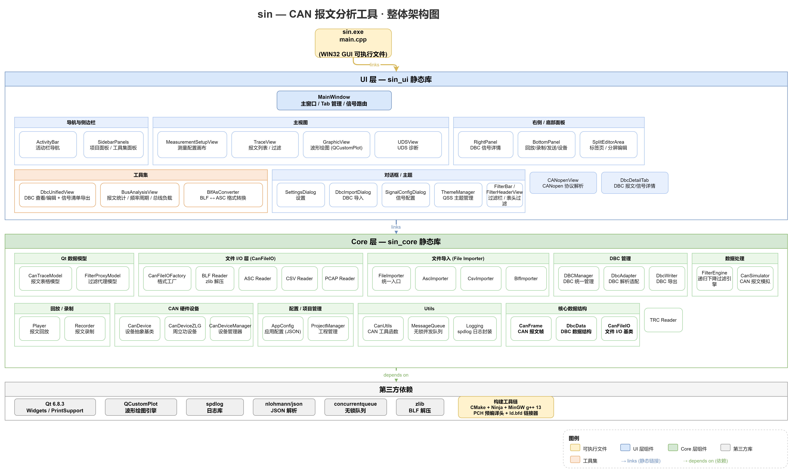

# sin — CAN/CAN FD 报文分析工具

<p align="center">
  <strong>专业的 CAN/CAN FD 总线报文录制、回放、解析与分析桌面软件</strong>
</p>

<p align="center">
  
  
  
  
  
</p>

---

## 简介

**sin** 是一款灵感来源于 [Wireshark](https://www.wireshark.org/)、[CANoe](https://www.vector.com/canoe)、[Ozone](https://www.segger.com/products/development-tools/ozone-debugger/) 等优秀软件的 CAN/CAN FD 总线报文分析工具。采用 VS Code 风格的现代化 UI 设计，提供从报文录制到信号级解析的完整工作流，适用于汽车电子开发、总线调试、协议逆向等场景。

## 功能特性

### 报文录制与回放
- **实时录制** — 连接 CAN 设备实时捕获总线报文，支持 CAN 2.0A/B 与 CAN FD
- **文件回放** — 加载 BLF/ASC/CSV/PCAP/TRC 报文文件，按原始时间戳精准回放，支持变速控制（0.1x ~ 10x）
- **进度拖拽** — 回放进度条可任意拖拽定位，快速跳转到关键时间点
- **文件导入** — 支持从 `.blf`（Vector 二进制日志）、`.asc`（Vector ASCII 日志）、`.csv` 文件导入报文到 Trace
- **文件导出** — 支持将 Trace 报文导出为 `.asc`、`.csv` 格式

### Trace 追踪
- **帧编号列 (No.)** — 参考 Wireshark，首列为帧序号，标识当前帧在捕获序列中的位置
- **绝对/相对时间** — 除绝对时间戳外，支持显示与上一帧的时间增量 (Delta)，方便排查周期不稳定等问题
- **Wireshark 风格列表** — No. / Time / Delta / Ch / Dir / ID / DLC / Data / Flags / Count 多列显示
- **按列排序** — 点击列标题升序/降序排序，支持数值与时间类型智能比较
- **表头漏斗过滤** — 鼠标悬停列标题时显示漏斗图标，点击即可快速设置该列筛选条件；已激活筛选的列持续显示高亮漏斗
- **按列筛选** — 每列独立筛选条件，ID 列支持 `>`、`<`、`!=` 运算符，快速过滤目标报文
- **快速筛选** — 右键列标题一键筛选仅 Rx/Tx、唯一 ID 列表
- **帧信息面板** — 选中报文显示完整解码字段，集成 DBC 信号级解析
- **十六进制转储** — 选中报文以 Offset + Hex + ASCII 格式展示原始数据
- **覆盖模式** — 同 CAN ID 只保留最新一帧，实时刷新数据值和帧计数
- **表达式过滤** — 类 Wireshark 过滤语法 `id == 0x123 && dlc > 4`，自写递归下降解析器
- **行标记与着色** — 过滤后可对结果行手动标记、自定义着色，方便分析对比；参考 Wireshark/CANoe 的标记着色机制
- **自动行着色** — 按 CAN ID / 方向 / 错误帧自动着色，视觉区分不同报文类型
- **搜索定位** — 按 ID、数据内容（Hex 模式）、时间范围搜索并跳转到目标帧
- **标记书签** — 手动标记重要帧，书签列表快速跳转
- **统计概览** — 总线负载率、各 ID 帧数/频率、错误帧统计
- **文件导入** — 支持 BLF / ASC / CSV 格式导入，自动解析时间戳与数据
- **文件导出** — 导出 Trace 为 ASC / CSV 格式，支持导出过滤后子集

### DBC 信号解析
- **DBC 加载** — 支持加载标准 `.dbc` 文件，自动解析报文与信号定义
- **信号树浏览** — 侧边栏 DBC 面板以树形结构展示 Message → Signal 层级
- **信号解码** — 选中 Trace 报文自动解码所有信号值（支持有符号/无符号、大小端）
- **信号双击追踪** — 双击 DBC 信号自动添加到 Graphic 图形视图实时绘制

### Graphic 图形视图
- **实时波形** — 以时间轴为横坐标绘制信号值变化曲线
- **多信号叠加** — 同时监控多个信号，支持通道独立配置
- **交互缩放** — 鼠标滚轮缩放、拖拽平移，支持波形测量

### 工程上下文管理
- **多工程并行** — 创建多个分析工程，每个工程独立管理 CAN 配置、DBC 文件、布局
- **快速切换** — 一键切换工程上下文，无需重新加载文件
- **工程持久化** — 工程配置保存为 `.sinproj` 文件，下次打开即恢复工作状态

### 工具集
- **侧边栏工具集入口** — ActivityBar 中的工具集图标，点击展开工具列表面板
- **BLF ↔ ASC ↔ CSV 转换** — 报文日志文件格式互转工具，后台线程执行，不阻塞 UI
- **DBC 查看编辑** — 独立打开任意 DBC 文件，树形浏览报文/信号层级，可编辑信号属性并保存
- **报文统计分析** — 加载日志文件统计各 CAN ID 帧数、频率、周期与抖动
- **ID 频率/周期分析** — 按 CAN ID 统计报文周期均值/最大/最小/标准差
- **总线负载率** — 基于波特率与数据量计算总线负载率
- **DBC 信号清单导出** — 从 DBC 导出全部报文/信号清单为 CSV/Markdown
- **独立运行** — 工具独立运行，不影响当前工程数据，后续持续集成更多总线分析工具

### VS Code 风格 UI
- **无边框窗口** — 去除原生标题栏，菜单栏直接置顶，最小化/最大化/关闭按钮位于菜单栏右上角
- **全局侧边栏** — ActivityBar + 可折叠 SideBar，按功能分组面板
- **可拆分编辑器** — 主区域标签页支持右键"向右拆分"/"向下拆分"，并排对比视图
- **全面板可停靠** — 左侧、右侧、底部、帧信息、HexDump 面板均可关闭、拖拽、停靠
- **Aero Snap** — 无边框窗口仍支持 Windows 原生窗口贴靠、边缘缩放

### 其他功能
- **命令行终端** — 内置命令行界面，支持 `help`、`clear`、`sim on/off`、`record`、`play`、`filter` 等命令
- **CAN 模拟器** — 内置报文模拟器，可生成测试报文用于功能验证
- **统计面板** — 实时显示总帧数、Rx/Tx 分布、CAN FD / Extended 统计
- **主题样式** — QSS 驱动的暗色菜单栏 + 亮色内容区，可自定义主题

---

## 对标分析：CANoe & TSMaster 核心 20% 功能

> 帕累托法则：20% 的功能覆盖 80% 的日常使用场景。以下梳理 CANoe（Vector）和 TSMaster（TOSUN）最核心的功能，逐项对标 sin 当前状态与实施方案。

### 一、竞品核心功能矩阵

#### CANoe (Vector) — 行业标杆

CANoe 是 Vector 旗舰级 CAN 总线开发工具，覆盖测量、分析、仿真、测试全流程。其核心 20% 功能如下：

| # | 功能模块 | CANoe 能力 | sin 状态 | 差距分析 |
|---|---------|-----------|---------|--------|
| C1 | **Trace Window** | 实时报文列表：Delta 时间、行着色、表达式过滤、预定义过滤器、快速搜索、书签标记 | ✅ 基础已实现 | 缺少预定义过滤器集、书签持久化、动态着色规则编辑器 |
| C2 | **Graphics Window** | 信号曲线：多 Y 轴、双游标测量、视口降采样、信号数学运算、导出图片 | ✅ 基础已实现 | 缺少游标测量、多 Y 轴、视口降采样、信号数学运算 |
| C3 | **Data Window** | 信号/系统变量实时表格：当前值、最小/最大值、原始值与物理值并列显示 | ⬜ 未实现 | 新增功能，需设计信号表格数据模型 |
| C4 | **Measurement Setup** | 通道树配置：波特率、采样点、CAN FD、触发条件、硬件通道映射 | ✅ 已实现 | 缺少触发条件配置（基于 ID/数据/错误的触发录制） |
| C5 | **Online/Offline** | 在线采集 ↔ 离线回放共享同一套上层分析逻辑，无缝切换 | ✅ 已实现 | 架构层面已具备，DataCore 统一数据流设计已就绪 |
| C6 | **Interactive Send (IGS)** | 交互式信号发送：面板控件（按钮、滑块、输入框）→ 信号值 → 周期发送报文 | ✅ 基础已实现 | 缺少面板设计器（可视化拖拽创建交互面板） |
| C7 | **CAPL Scripting** | C 语法脚本引擎：事件驱动（on message/on key/on timer）、报文收发、信号读写、文件 I/O | ⬜ 未实现 | 核心差距，需引入脚本引擎（Lua/sol2 方案） |
| C8 | **Bus Statistics** | 总线负载率、各 ID 帧数/频率、周期/抖动、错误帧分类统计 | ✅ 基础已实现 | 缺少周期抖动分析（均值/最大/最小/标准差）和错误帧分类统计 |
| C9 | **Log File I/O** | BLF 原生录制、ASC 导入导出、日志文件分片、条件触发录制 | ✅ 已实现 | 缺少文件分片（按大小/时间自动切割）和条件触发录制 |
| C10 | **Filter & Analysis** | 表达式过滤（类似 Wireshark）、预定义过滤集、分析窗口（差值计算） | ✅ 已实现 | 缺少预定义过滤集管理和差值分析窗口 |

#### TSMaster (TOSUN) — 新兴竞品

TSMaster 是 TOSUN 推出的开放总线工具平台，支持多厂商硬件，免费用于科研教育。其核心 20% 功能如下：

| # | 功能模块 | TSMaster 能力 | sin 状态 | 差距分析 |
|---|---------|-------------|---------|--------|
| T1 | **Trace Window** | 报文列表：覆盖模式、行着色、列筛选、实时刷新 | ✅ 已实现 | 功能基本对齐 |
| T2 | **Graphics** | 信号曲线：多通道叠加、缩放平移 | ✅ 基础已实现 | 缺少多 Y 轴和游标联动 |
| T3 | **Signal Browser** | DBC 信号树：报文→信号层级浏览 | ✅ 已实现 | 功能基本对齐 |
| T4 | **Measurement Setup** | 通道映射、波特率、CAN FD 配置 | ✅ 已实现 | 功能基本对齐 |
| T5 | **Online Replay** | 在线采集 + 离线回放 | ✅ 已实现 | 功能基本对齐 |
| T6 | **Interactive Send** | 信号/报文发送面板 | ✅ 基础已实现 | 缺少面板设计器 |
| T7 | **C/C++ Script Editor** | 内嵌 C/C++ 脚本编辑器，编译执行自动化测试 | ⬜ 未实现 | 核心差距，与 CANoe CAPL 类似的自动化能力 |
| T8 | **Statistics Window** | 总线负载、帧率、错误帧统计 | ✅ 基础已实现 | 缺少周期抖动和错误帧分类 |
| T9 | **Bus Logging** | BLF/ASC 日志录制 | ✅ 已实现 | 功能基本对齐 |
| T10 | **File Converter** | DBC/ARXML/XLS/XLSX/DBF/YAML 格式互转 | 🔄 部分实现 | 仅支持 DBC，缺少 ARXML/XLS 格式转换 |
| T11 | **Panel Designer** | 可视化拖拽创建交互面板（按钮/滑块/图表/输入框） | ⬜ 未实现 | 与 CANoe IGS 面板设计器类同 |
| T12 | **Test System** | 自动化测试序列：步骤化测试用例、通过/失败判定、报告生成 | ⬜ 未实现 | 核心差距，对标 CANoe Test Feature Set |

### 二、差距优先级矩阵

按 **用户价值 × 实现可行性** 排序，识别最值得投入的功能：

| 优先级 | 功能 | 来源 | 用户价值 | 实现难度 | 预计工时 |
|-------|------|------|---------|---------|---------|
| 🔴 P0 | **Data Window（信号实时表格）** | CANoe C3 | ⭐⭐⭐⭐⭐ | 🟢 低 | 2-3 天 |
| 🔴 P0 | **Graphics 游标测量 + 多 Y 轴** | CANoe C2 / TSMaster T2 | ⭐⭐⭐⭐⭐ | 🟡 中 | 3-5 天 |
| 🔴 P0 | **Bus Statistics 增强（周期抖动 + 错误帧分类）** | CANoe C8 | ⭐⭐⭐⭐ | 🟢 低 | 2-3 天 |
| 🟡 P1 | **Log File 分片 + 条件触发录制** | CANoe C9 | ⭐⭐⭐⭐ | 🟡 中 | 3-4 天 |
| 🟡 P1 | **预定义过滤集管理** | CANoe C10 | ⭐⭐⭐⭐ | 🟢 低 | 1-2 天 |
| 🟡 P1 | **Trace 书签持久化 + 动态着色规则编辑器** | CANoe C1 | ⭐⭐⭐ | 🟢 低 | 2-3 天 |
| 🟡 P1 | **File Converter（ARXML 支持）** | TSMaster T10 | ⭐⭐⭐ | 🟡 中 | 5-7 天 |
| 🟠 P2 | **Panel Designer（交互面板设计器）** | CANoe C6 / TSMaster T11 | ⭐⭐⭐⭐⭐ | 🔴 高 | 7-14 天 |
| 🟠 P2 | **CAPL/脚本引擎（Lua + sol2）** | CANoe C7 / TSMaster T7 | ⭐⭐⭐⭐⭐ | 🔴 高 | 10-15 天 |
| 🟠 P2 | **Test System（自动化测试序列）** | TSMaster T12 | ⭐⭐⭐⭐ | 🔴 高 | 10-15 天 |

### 三、核心功能实施方案

#### 方案 1：Data Window — 信号实时表格（P0，对标 CANoe Data Window）

**目标**：以表格形式实时展示多个信号的当前值、最小值、最大值、原始值与物理值。

**UI 布局**：
```
┌──────────────────────────────────────────────────────────────────┐
│ Data Window                                                       │
├──────────┬─────────┬──────────┬──────────┬──────────┬───────────┤
│ Signal   │ Current │ Raw      │ Physical │ Min      │ Max       │
├──────────┼─────────┼──────────┼──────────┼──────────┼───────────┤
│ EngineRPM│ 3250    │ 0x0CAA   │ 3250 rpm │ 0        │ 6500      │
│ Throttle │ 45.2    │ 0xB5     │ 45.2 %   │ 0.0      │ 100.0     │
│ BrakeSt  │ 1       │ 0x01     │ ON       │ 0        │ 1         │
└──────────┴─────────┴──────────┴──────────┴──────────┴───────────┘
```

**实现方案**：
- 新增 `DataWindow` 类，继承 `QWidget`，内嵌 `QTableWidget`
- 数据源：订阅 `DbcManager` 信号解码结果 + `CanTraceModel` 覆盖模式最新帧
- 信号列表来源：用户从 DBC 信号树拖拽或双击添加（复用现有 Graphic 信号添加交互）
- 刷新策略：定时器 100ms 轮询最新帧数据（而非每帧触发），避免高频报文导致 UI 卡顿
- 最小/最大值：在 `DataWindow` 内部维护每个信号的统计缓存

**涉及文件**：
- 新增：`src/ui/datawindow.h` / `src/ui/datawindow.cpp`
- 修改：`src/ui/mainwindow.cpp`（注册标签页类型）
- 修改：`src/ui/spliteditorarea.cpp`（支持 Data 标签页创建）

---

#### 方案 2：Graphics 游标测量 + 多 Y 轴（P0，对标 CANoe Graphics Window）

**目标**：在 Graphic 图形视图中增加双游标测量、多 Y 轴支持、视口降采样。

**游标测量**：
```
┌────────────────────────────────────────────────┐
│ Graphic View                                    │
│                                                  │
│  ┌───┬─────┬──────────┬──────────┐              │
│  │     │     ╲          ╱         │  ← 信号曲线   │
│  │  A  │      ╲        ╱          │              │
│  │  ╫  │       ╲      ╱           │  ← 游标 A     │
│  │  ╫  B        ╲    ╱            │  ← 游标 B     │
│  │     │          ╲  ╱             │              │
│  └───┴─────┴──────────┴──────────┘              │
│  ΔT = 2.35s    ΔY = 15.3    f = 0.43 Hz          │
└────────────────────────────────────────────────┘
```

**实现方案**：
- 游标：在 `QCustomPlot` 上添加 `QCPItemStraightLine`（垂直线），鼠标拖拽移动
- 差值计算：双游标之间的时间差 (ΔT)、信号值差 (ΔY)、频率估算 (1/ΔT)
- 多 Y 轴：使用 `QCustomPlot::yAxis2`（右轴），不同信号可分配到左轴或右轴
- 视口降采样：当数据点超过视口宽度 ×2 时，按最大/最小值分组抽稀（保留波形轮廓）
- 游标联动：多个 GraphicView 标签页间游标时间同步（通过信号槽）

**涉及文件**：
- 修改：`src/ui/graphicview.h` / `src/ui/graphicview.cpp`
- 新增：游标控制工具栏（QToolBar：添加/移除游标、显示/隐藏差值面板）

---

#### 方案 3：Bus Statistics 增强（P0，对标 CANoe Bus Statistics Window）

**目标**：在现有统计面板基础上增加周期抖动分析和错误帧分类统计。

**统计表格**：
```
┌──────────┬──────┬────────┬──────────┬──────────┬──────────┬──────────┐
│ CAN ID   │ 帧数 │ 平均周期│ 最小周期 │ 最大周期 │ 抖动(σ) │ 频率(Hz) │
├──────────┼──────┼────────┼──────────┼──────────┼──────────┼──────────┤
│ 0x100    │ 1240 │ 10.0ms │ 9.8ms    │ 10.5ms   │ 0.12ms   │ 100.0    │
│ 0x1A5    │  620 │ 16.1ms │ 15.2ms   │ 17.8ms   │ 0.45ms   │ 62.1     │
│ 0x2FF    │   15 │ —      │ —        │ —        │ —        │ 0.5 (事件)│
└──────────┴──────┴────────┴──────────┴──────────┴──────────┴──────────┘

错误帧统计：
┌──────────────┬──────┬──────────────┐
│ 错误类型     │ 数量 │ 占比          │
├──────────────┼──────┼──────────────┤
│ Stuff Error  │    3 │ 30.0%        │
│ Form Error   │    2 │ 20.0%        │
│ ACK Error    │    5 │ 50.0%        │
│ Bit0 Error  │    0 │ 0.0%         │
│ Bit1 Error  │    0 │ 0.0%         │
│ CRC Error    │    0 │ 0.0%         │
└──────────────┴──────┴──────────────┘
```

**实现方案**：
- 新增 `BusStatistics` 类，在后台线程统计
- 周期计算：每个 CAN ID 维护一个 `QQueue<uint64_t>` 时间戳队列，计算相邻帧时间差
- 抖动 (σ)：周期的标准差 `sqrt(Σ(xi-x̄)²/N)`
- 错误帧分类：解析 `CanFrame::flags` 中的错误标志位（ECC 错误码）
- 总线负载率：`(总数据位数 / (统计时长 × 波特率)) × 100%`
  - 总数据位数 = Σ(47 + DLC×8) for each frame（经典 CAN 帧位数）
- 刷新策略：1s 定时器触发统计计算，避免每帧更新

**涉及文件**：
- 新增：`src/core/busstatistics.h` / `src/core/busstatistics.cpp`
- 修改：`src/ui/tools/loganalysisview.h` / `src/ui/tools/loganalysisview.cpp`（替换现有 FrameStatisticsView 桩实现）
- 修改：`src/ui/mainwindow.cpp`（对接统计服务信号槽）

---

#### 方案 4：Log File 分片 + 条件触发录制（P1，对标 CANoe Logging）

**目标**：录制时支持按文件大小/时间自动分片，支持基于表达式条件的触发录制。

**分片策略**：
- 按大小分片：文件达到配置阈值（默认 50 MB）时自动切割，文件名追加序号
- 按时间分片：录制达到配置时长（默认 10 分钟）时自动切割
- 环形模式：达到最大文件数时覆盖最旧文件（对标 CANoe Ring Buffer）

**条件触发录制**：
- 前置缓冲 (Pre-Trigger)：始终在内存中缓存最近 N 秒/N 帧的报文
- 触发条件：复用现有 `FilterEngine` 表达式引擎
  - 示例：`id == 0x1A5 && data[0] == 0xFF`（特定报文特定数据触发）
  - 示例：`error == true`（错误帧出现时触发）
- 触发后行为：将前置缓冲写入文件 → 持续录制 → 达到后置时长后停止

**实现方案**：
- 新增 `LogSplitter` 类，管理文件分片逻辑
- 新增 `TriggerRecorder` 类，封装前置缓冲 + 触发条件 + 后置录制
- 复用 `FilterEngine` 解析触发条件表达式
- UI：在 RecordTab 中增加「分片设置」和「触发录制」折叠面板

**涉及文件**：
- 新增：`src/core/logsplitter.h` / `src/core/logsplitter.cpp`
- 新增：`src/core/triggerrecorder.h` / `src/core/triggerrecorder.cpp`
- 修改：`src/ui/recordtab.h` / `src/ui/recordtab.cpp`

---

#### 方案 5：预定义过滤集管理（P1，对标 CANoe Filter Presets）

**目标**：将常用的过滤表达式保存为命名预设，一键切换。

**功能设计**：
- 过滤栏右侧增加「预设」下拉按钮
- 预设列表以菜单形式展示，点击即应用
- 右键当前表达式 → 「保存为预设」→ 输入名称
- 预设存储在 `filters/` 目录下 `.sfilter` 文件中（JSON 格式）

**文件格式**（`.sfilter`）：
```jsonc
{
  "version": 1,
  "filters": [
    {"name": "仅 Rx 帧",       "expr": "rx"},
    {"name": "仅错误帧",       "expr": "error"},
    {"name": "制动系统",       "expr": "id in (0x100, 0x1A5, 0x2FF)"},
    {"name": "高优先级",       "expr": "id < 0x100"},
    {"name": "CAN FD 帧",      "expr": "fd"}
  ]
}
```

**实现方案**：
- 新增 `FilterPresetManager` 类，加载/保存 `.sfilter` 文件
- 修改 `FilterBar` 添加预设下拉按钮和菜单
- 预设可导入导出，方便团队共享

**涉及文件**：
- 新增：`src/core/filterpresetmanager.h` / `src/core/filterpresetmanager.cpp`
- 修改：`src/ui/filterbar.h` / `src/ui/filterbar.cpp`

---

#### 方案 6：Trace 书签持久化 + 着色规则编辑器（P1，对标 CANoe Trace 标记着色）

**书签持久化**：
- 右键报文行 → 「添加书签」→ 输入备注
- 书签数据结构：`{frameIndex, note, timestamp, color}`
- 书签保存在 `.sinproj` 工程文件中（或独立的 `.sbm` 书签文件）
- 右侧面板增加「书签」标签页，点击跳转到对应帧

**着色规则编辑器**：
- 工具菜单 → 「着色规则」打开编辑器
- 规则列表：每条规则 = 条件表达式 + 背景色 + 前景色
- 条件复用 `FilterEngine`（如 `id == 0x123` → 黄色背景）
- 规则优先级：从上到下匹配，首个命中规则的着色生效
- 规则保存在 `.sinproj` 中

**UI**：
```
┌─ 着色规则编辑器 ──────────────────────────────┐
│  规则列表                      [添加] [删除]   │
│  ┌──────────────────────────────────────────┐  │
│  │ ▲ id == 0x123        🟡 黄色背景         │  │
│  │   error == true      🔴 浅红背景         │  │
│  │   fd == true         🔵 浅蓝背景         │  │
│  │   id in (0x1A5,..)   🟢 浅绿背景         │  │
│  └──────────────────────────────────────────┘  │
│  条件: [id == 0x123                        ]   │
│  背景: [⬛ 黄色 ▼]   前景: [⬛ 黑色 ▼]           │
│                                  [取消] [确定]   │
└────────────────────────────────────────────────┘
```

**涉及文件**：
- 新增：`src/ui/colorruleeditor.h` / `src/ui/colorruleeditor.cpp`
- 修改：`src/core/cantracemodel.h` / `src/core/cantracemodel.cpp`（支持着色规则求值）
- 修改：`src/ui/rightpanel.h` / `src/ui/rightpanel.cpp`（增加书签标签页）

---

#### 方案 7：File Converter — ARXML 格式支持（P1，对标 TSMaster File Converter）

**目标**：支持 ARXML（AUTOSAR XML）格式的 DBC 导入导出，覆盖现代 ECU 开发流程。

**ARXML 格式说明**：
- AUTOSAR 标准文件格式，基于 XML
- 描述 ECU 通信（PDU、Signal、ISignal、IPdu、Frame 等）
- 比 DBC 更复杂，支持 CAN FD、以太网等
- 使用 `pugixml`（MIT 协议）解析 XML

**实现方案**：
- 引入 `pugixml`（MIT，单头文件 + 单源文件）到 `third_party/pugixml/`
- 新增 `ArxmlImporter` 类，解析 ARXML → 转换为内部 `DbcData` 结构
- 新增 `ArxmlExporter` 类，反向导出
- 支持批量转换：菜单「工具 → 文件格式转换」中增加 ARXML 选项

**涉及文件**：
- 新增：`third_party/pugixml/`（pugixml.hpp + pugixml.cpp + pugiconfig.hpp）
- 新增：`src/core/dbc/arxml_importer.h` / `src/core/dbc/arxml_importer.cpp`
- 新增：`src/core/dbc/arxml_exporter.h` / `src/core/dbc/arxml_exporter.cpp`
- 修改：`src/ui/tools/blfasconverter.h` / `src/ui/tools/blfasconverter.cpp`（扩展为通用文件转换器）
- 修改：`third_party/Dependencies.cmake`（添加 pugixml 目标）

---

#### 方案 8：Panel Designer — 交互面板设计器（P2，对标 CANoe Panels / TSMaster Panel）

**目标**：可视化拖拽创建交互面板，通过控件（按钮、滑块、输入框、仪表盘）发送信号/报文。

**面板设计器**：
- 左侧控件库：按钮、滑块、输入框、下拉框、开关、仪表盘、LED 指示灯
- 中间画布：拖拽控件到画布，自由布局
- 右侧属性：绑定信号/报文、范围、步进、样式
- 面板保存为 `.spanel` 文件（JSON 格式）

**运行时**：
- 面板以标签页方式打开，控件值变化 → 信号值更新 → 周期发送或手动发送
- 支持面板控件的信号值回显（从 Trace 数据更新控件状态）

**面板文件格式**（`.spanel`）：
```jsonc
{
  "version": 1,
  "name": "制动控制面板",
  "controls": [
    {
      "type": "slider",
      "name": "BrakePressure",
      "x": 20, "y": 20, "w": 300, "h": 40,
      "signal": {"dbc": "brake.dbc", "message": "BrakeCmd", "signal": "Pressure"},
      "range": {"min": 0, "max": 100, "step": 1},
      "sendMode": "onRelease"
    },
    {
      "type": "button",
      "name": "EmergencyBrake",
      "x": 20, "y": 80, "w": 120, "h": 40,
      "signal": {"dbc": "brake.dbc", "message": "BrakeCmd", "signal": "Emergency"},
      "sendMode": "onPress",
      "value": 1
    },
    {
      "type": "led",
      "name": "BrakeStatus",
      "x": 160, "y": 80, "w": 30, "h": 30,
      "signal": {"dbc": "brake.dbc", "message": "BrakeSts", "signal": "Active"},
      "onColor": "#00FF00", "offColor": "#333333"
    }
  ]
}
```

**实现方案**：
- 新增 `PanelDesigner` 类：设计模式画布，拖拽布局控件
- 新增 `PanelRuntime` 类：运行模式，加载 `.spanel` 并实例化控件
- 控件库：每种控件一个类（`PanelButton`、`PanelSlider`、`PanelLed`、`PanelGauge`）
- 信号绑定：控件值变化 → 调用 `DbcManager::encodeSignal()` → 构造 `CanFrame` → `CanDeviceManager::send()`
- 面板可作为独立标签页或 Dock 面板

**涉及文件**：
- 新增：`src/ui/panels/paneldesigner.h` / `src/ui/panels/paneldesigner.cpp`
- 新增：`src/ui/panels/panelruntime.h` / `src/ui/panels/panelruntime.cpp`
- 新增：`src/ui/panels/panelcontrols.h` / `src/ui/panels/panelcontrols.cpp`
- 新增：`src/core/panelmanager.h` / `src/core/panelmanager.cpp`

---

#### 方案 9：脚本引擎 — Lua + sol2（P2，对标 CANoe CAPL / TSMaster C++ Script）

**目标**：嵌入 Lua 脚本引擎，支持事件驱动（报文接收、按键、定时器）的自动化测试。

**CAPL 能力对标**：

| CAPL 能力 | sin Lua 等价实现 | 说明 |
|---------|-----------------|------|
| `on message CAN1.0x123` | `sin.on_message(0x123, function(msg) ... end)` | 报文事件回调 |
| `on key 'a'` | `sin.on_key('a', function() ... end)` | 按键事件回调 |
| `on timer T1` | `sin.on_timer(1000, function() ... end)` | 定时器事件 |
| `output(0x456, ...)` | `sin.send(0x456, {0x01, 0x02})` | 发送报文 |
| `$Signal::RPM` | `sin.signal("RPM").value` | 读写信号值 |
| `write("...")` | `sin.log("...")` | 日志输出 |
| `if (this.id == 0x123)` | `if msg.id == 0x123 then` | 条件判断 |

**Lua 脚本示例**：
```lua
-- 自动制动测试用例
sin.on_message(0x100, function(msg)
  local rpm = sin.signal("EngineRPM").value
  if rpm > 5000 then
    sin.log("WARN: RPM 过高: " .. rpm)
    sin.send(0x1A5, {0xFF, 0x00, 0x00, 0x00, 0x00, 0x00, 0x00, 0x00})
  end
end)

sin.on_timer(1000, function()
  sin.log("当前总线负载: " .. sin.bus_load() .. "%")
end)

sin.on_key('F5', function()
  sin.log("开始测试序列...")
  sin.send(0x200, {0x01})
  sin.wait(100)
  sin.send(0x200, {0x00})
end)
```

**实现方案**：
- 引入 `sol2`（MIT）到 `third_party/sol2/`
- 引入 `lua`（MIT）到 `third_party/lua/`（预编译 Windows DLL + 源码）
- 新增 `ScriptEngine` 类：封装 sol2 state，注册 sin API 绑定
- 新增 `ScriptEditor` 类：内嵌代码编辑器（语法高亮可选，先做纯文本 + 行号）
- 脚本以标签页方式打开，F5 执行，底部输出窗口显示日志
- 事件绑定：`ScriptEngine` 订阅 `DataCore` 报文流，匹配 Lua 回调

**涉及文件**：
- 新增：`third_party/sol2/`（sol2 头文件）
- 新增：`third_party/lua/`（lua 5.4 源码 + CMake 集成）
- 新增：`src/core/scriptengine.h` / `src/core/scriptengine.cpp`
- 新增：`src/ui/scripteditor.h` / `src/ui/scripteditor.cpp`
- 修改：`third_party/Dependencies.cmake`（添加 lua + sol2 目标）
- 修改：`src/ui/bottompanel.cpp`（增加脚本输出标签页）

---

#### 方案 10：Test System — 自动化测试序列（P2，对标 TSMaster Test System / CANoe Test Feature Set）

**目标**：步骤化测试用例编排，自动执行、结果判定、报告生成。

**测试用例格式**（`.stest` JSON）：
```jsonc
{
  "version": 1,
  "name": "制动系统回归测试",
  "setup": [
    {"action": "load_dbc",    "file": "brake.dbc"},
    {"action": "load_log",    "file": "baseline.blf"},
    {"action": "start_replay"}
  ],
  "steps": [
    {
      "name": "验证制动压力响应",
      "wait_signal": {"signal": "BrakePressure", "timeout": 5000},
      "assert": {"signal": "BrakePressure", "op": ">", "value": 50},
      "on_pass": {"log": "制动压力正常"},
      "on_fail": {"log": "制动压力异常", "severity": "error"}
    },
    {
      "name": "验证紧急制动触发",
      "send": {"id": "0x200", "data": [1]},
      "wait_signal": {"signal": "EmergencyBrake", "timeout": 1000},
      "assert": {"signal": "EmergencyBrake", "op": "==", "value": 1}
    }
  ],
  "teardown": [
    {"action": "stop_replay"}
  ]
}
```

**实现方案**：
- 新增 `TestEngine` 类：解析 `.stest` 文件，顺序执行步骤
- 动作类型：`load_dbc`、`load_log`、`start_replay`、`stop_replay`、`send`、`wait_signal`、`assert`、`wait`
- 测试报告：生成 HTML/CSV 格式报告（通过/失败/耗时/日志）
- UI：左侧测试用例列表，右侧步骤详情，底部执行日志
- 测试可嵌套调用 Lua 脚本（与方案 9 脚本引擎联动）

**涉及文件**：
- 新增：`src/core/testengine.h` / `src/core/testengine.cpp`
- 新增：`src/ui/testview.h` / `src/ui/testview.cpp`
- 新增：`src/core/testreporter.h` / `src/core/testreporter.cpp`

---

### 四、实施路线图

```
Phase 1 (近期 1-2 周) — P0 核心体验补齐
├── Data Window 信号实时表格        ← 方案 1
├── Graphics 游标测量 + 多 Y 轴     ← 方案 2
└── Bus Statistics 周期抖动增强     ← 方案 3

Phase 2 (中期 2-4 周) — P1 功能完善
├── Log File 分片 + 触发录制       ← 方案 4
├── 预定义过滤集管理              ← 方案 5
├── Trace 书签 + 着色规则编辑器    ← 方案 6
└── ARXML 格式支持                ← 方案 7

Phase 3 (长期 1-2 月) — P2 高级能力
├── Panel Designer 交互面板设计器  ← 方案 8
├── Lua 脚本引擎 (sol2)           ← 方案 9
└── Test System 自动化测试序列     ← 方案 10
```

### 五、对标总结

| 维度 | CANoe | TSMaster | sin (当前) | sin (Phase 3 后) |
|------|-------|---------|-----------|-----------------|
| 报文追踪 | ⭐⭐⭐⭐⭐ | ⭐⭐⭐⭐ | ⭐⭐⭐⭐ | ⭐⭐⭐⭐⭐ |
| 信号图形 | ⭐⭐⭐⭐⭐ | ⭐⭐⭐ | ⭐⭐⭐ | ⭐⭐⭐⭐⭐ |
| 信号表格 | ⭐⭐⭐⭐⭐ | ⭐⭐⭐ | ⭐ | ⭐⭐⭐⭐ |
| DBC 解析 | ⭐⭐⭐⭐⭐ | ⭐⭐⭐⭐ | ⭐⭐⭐⭐ | ⭐⭐⭐⭐⭐ |
| 录制回放 | ⭐⭐⭐⭐⭐ | ⭐⭐⭐⭐ | ⭐⭐⭐⭐ | ⭐⭐⭐⭐⭐ |
| 交互发送 | ⭐⭐⭐⭐⭐ | ⭐⭐⭐⭐ | ⭐⭐⭐ | ⭐⭐⭐⭐⭐ |
| 自动化脚本 | ⭐⭐⭐⭐⭐ | ⭐⭐⭐⭐ | ⭐ | ⭐⭐⭐⭐ |
| 总线统计 | ⭐⭐⭐⭐⭐ | ⭐⭐⭐⭐ | ⭐⭐⭐ | ⭐⭐⭐⭐⭐ |
| 文件格式 | ⭐⭐⭐⭐⭐ | ⭐⭐⭐⭐⭐ | ⭐⭐⭐⭐ | ⭐⭐⭐⭐⭐ |
| 测试系统 | ⭐⭐⭐⭐⭐ | ⭐⭐⭐⭐ | ⭐ | ⭐⭐⭐⭐ |
| UI 灵活性 | ⭐⭐⭐ | ⭐⭐⭐ | ⭐⭐⭐⭐⭐ | ⭐⭐⭐⭐⭐ |
| 开源/免费 | ❌ | 🔄 部分 | ✅ | ✅ |

**sin 差异化优势**：
1. **VS Code 式自由布局** — CANoe/TSMaster 布局固定，sin 全面板可拖拽停靠
2. **Wireshark 风格过滤引擎** — 自研递归下降解析器，语法更直观
3. **开源 MIT 协议** — CANoe 年费数万，sin 完全免费
4. **跨平台潜力** — Qt 天然支持 Linux/macOS，CANoe 仅 Windows
5. **现代化 UI** — VS Code 风格暗色主题，视觉体验优于 CANoe 传统界面

---

## Trace 页面详细规划

> Trace 是总线分析工具的核心视图，对标 CANoe Trace 窗口 + Wireshark 报文列表。
> 以下按功能模块细化，明确已实现/待实现状态，并引入必要的开源组件减少重复造轮子。

### 一、已实现功能清单

| 功能 | 状态 | 实现位置 |
|------|------|----------|
| Wireshark 风格报文列表 | ✅ 已实现 | `TraceView` + `CanTraceModel` |
| 按列排序（数值/时间智能比较） | ✅ 已实现 | `CanFilterProxyModel::lessThan` |
| 按列筛选（ID 列支持运算符） | ✅ 已实现 | `CanFilterProxyModel::setColumnFilter` |
| 快速筛选（Rx/Tx、唯一 ID） | ✅ 已实现 | `TraceView::contextMenuEvent` |
| 帧信息面板（DBC 信号解码） | ✅ 已实现 | `FrameInfoWidget` + `SignalDecodeWidget` |
| 十六进制转储（Offset+Hex+ASCII） | ✅ 已实现 | `TraceTab` 底部面板 |
| 覆盖模式（同 ID 只保留最新帧） | ✅ 已实现 | `CanTraceModel::setOverwriteMode` |
| 表达式过滤引擎 | ✅ 已实现 | `FilterEngine`（自写递归下降解析器） |
| 多 Trace 标签页 | ✅ 已实现 | `SplitEditorArea` 多 Tab |

### 二、待实现功能规划

#### 1. 文件导入（高优先级）

支持从第三方日志文件导入报文到 Trace，复用现有 `CanFrame` 数据结构和 `CanTraceModel`。

| 格式 | 方案 | 协议 | 说明 |
|------|------|------|------|
| **BLF** | [vector_blf](https://github.com/Technica-Engineering/vector_blf) | LGPL | C++ 库，兼容 binlog API 7.1.0，支持 CAN/CAN FD/LIN 等多种对象类型 |
| **ASC** | 自写解析器 | — | 纯文本格式，每行一条报文记录，约 300 行代码即可实现 |
| **CSV** | 自写解析器 | — | 通用表格格式，约 200 行代码即可实现 |

**架构设计**：

```
core/file_import/
├── file_importer.h        # 统一导入接口（纯虚基类）
├── blf_importer.h/cpp     # BLF 格式导入（依赖 vector_blf）
├── asc_importer.h/cpp     # ASC 格式导入（自写文本解析）
└── csv_importer.h/cpp     # CSV 格式导入（自写文本解析）
```

- 所有导入器实现统一接口 `bool importFile(const QString &path, CanTraceModel *model)`
- 导入过程支持进度回调，大文件异步导入不阻塞 UI
- 导入后自动合并到当前 Trace 的 `CanTraceModel`，按时间戳排序

**ASC 格式说明**（Vector ASCII Logging Format）：

```
; comment
begin Triggerblock
   0.001  CAN  1  Rx  0123  8  01 02 03 04 05 06 07 08
   0.005  CAN  1  Tx  0456  4  AA BB CC DD
end Triggerblock
```

每行字段：时间戳(s) | 总线类型 | 通道 | 方向 | ID(hex) | DLC | 数据字节(hex)

#### 2. 文件导出（中优先级）

| 格式 | 方案 | 说明 |
|------|------|------|
| **ASC** | 自写导出器 | 按 Vector ASC 标准格式输出，可被 CANoe/CANalyzer 直接打开 |
| **CSV** | 自写导出器 | 通用 CSV 格式，Excel/Python 可直接分析 |
| **过滤子集导出** | 基于 FilterProxyModel | 仅导出当前过滤后可见行 |

#### 3. 行着色规则（中优先级）

通过 `CanTraceModel::data()` 的 `Qt::BackgroundRole` 实现行级背景色：

| 规则 | 颜色 | 说明 |
|------|------|------|
| 按 CAN ID 着色 | 哈希调色板（~20 色循环） | 不同 ID 不同背景色，快速识别报文类型 |
| 方向区分 | Rx: 无底色 / Tx: 浅绿底 | 收发方向一目了然 |
| 错误帧 | 浅红底 | CAN_ERR_FLAG 标记的帧高亮 |
| CAN FD 帧 | 浅蓝底标记 | 区分经典帧和 FD 帧 |
| 用户标记 | 黄色高亮 | 手动标记的重要帧 |

#### 4. 搜索与书签（中优先级）

- **搜索栏**：在 FilterBar 右侧增加搜索按钮，支持：
  - 按 ID 搜索：`0x123`
  - 按数据内容搜索：`data contains AA BB`
  - 按时间范围：`time > 10.5 && time < 20.0`
- **书签**：
  - 右键报文行 → 「添加书签」/「移除书签」
  - 书签列表在右侧面板显示，点击跳转
  - 书签数据保存在 `.sin` 录制文件中

#### 5. Hex Dump 增强（低优先级）

当前 Hex Dump 使用 `QPlainTextEdit` 纯文本显示，后续引入 **QHexEdit2** 替换：

| 特性 | 当前 | QHexEdit2 |
|------|------|----------|
| 查看 | ✅ 文本 | ✅ 高亮文本 |
| 选中/复制 | ❌ | ✅ 区域选中、右键复制 |
| 查找 | ❌ | ✅ Hex/ASCII 双向查找 |
| 信号高亮 | ❌ | ✅ DBC 信号在 Hex 数据中着色标注 |

> **QHexEdit2**：BSD 协议，商用友好。GitHub: https://github.com/SilkierNet/HexEdit

#### 6. 统计面板增强（低优先级）

当前仅显示总帧数/Rx/Tx 分布，后续增加：

- **总线负载率**：基于 CAN 波特率和实际数据量计算
- **各 ID 帧数/频率**：表格展示每个 CAN ID 的累计帧数和每秒帧数
- **错误帧统计**：按错误类型分类统计
- **周期抖动分析**：计算各 ID 的报文周期均值、最大/最小/标准差

### 三、Trace 专用开源组件引入计划

| 组件 | 协议 | 用途 | 集成方式 | 优先级 |
|------|------|------|---------|--------|
| **[vector_blf](https://github.com/Technica-Engineering/vector_blf)** | LGPL | BLF 文件解析 | 源码引入 `third_party/vector_blf/` | 🔴 高 |
| **自写 ASC 解析器** | — | ASC 文件导入/导出 | 自研（~300 行） | 🔴 高 |
| **自写 CSV 解析器** | — | CSV 文件导入/导出 | 自研（~200 行） | 🟡 中 |
| **[QHexEdit2](https://github.com/SilkierNet/HexEdit)** | BSD | 十六进制查看控件 | 源码引入 `third_party/qhexedit2/` | 🟢 低 |

### 四、实现分阶段计划

**Phase 1 — 文件导入（核心）**
1. 实现 ASC 解析器（文本格式，最简单）
2. 引入 vector_blf，实现 BLF 导入器
3. 实现 CSV 导入器
4. 统一导入接口，集成到 Trace 菜单「文件 → 导入」

**Phase 2 — 行着色 + 搜索**
1. 实现行着色规则（`data()` 的 `BackgroundRole`）
2. 实现搜索定位功能
3. 实现书签标记

**Phase 3 — 文件导出 + Hex 增强**
1. 实现 ASC/CSV 导出器
2. 引入 QHexEdit2 替换当前 Hex 面板
3. 实现 DBC 信号在 Hex 数据中高亮

**Phase 4 — 统计增强**
1. 总线负载率计算
2. 各 ID 帧数/频率统计表格
3. 周期抖动分析

---

## 软件架构

```
sin/
├── CMakeLists.txt              # 顶层 CMake 构建配置
├── src/
│   ├── main.cpp                # 程序入口
│   ├── core/                   # 核心层 — 数据结构与引擎
│   │   ├── canframe.h          #   CAN/CAN FD 帧结构
│   │   ├── recorder            #   报文录制器
│   │   ├── player              #   报文回放器
│   │   ├── cansimulator        #   CAN 模拟器
│   │   ├── dbcdata.h           #   DBC 数据结构
│   │   ├── dbcmanager          #   DBC 文件管理器
│   │   └── canfileio/          #   文件格式 I/O 层
│   │       ├── canfileio       #   读写器接口 + 格式枚举
│   │       ├── blf             #   BLF 格式读写 (Vector 二进制)
│   │       ├── asc             #   ASC 格式读写 (Vector ASCII)
│   │       ├── csv             #   CSV 格式读写 (通用文本)
│   │       ├── pcap_reader     #   PCAP 格式读取 (libpcap 网络捕获)
│   │       └── trc_reader      #   TRC 格式读取 (Vector 旧格式)
│   ├── models/                 # 数据模型层
│   │   ├── cantracemodel       #   Trace 表格模型
│   │   └── canfilterproxymodel #   过滤代理模型（排序+筛选）
│   ├── ui/                     # 界面层
│   │   ├── mainwindow          #   主窗口（无边框 + Dock 布局）
│   │   ├── spliteditorarea     #   可拆分编辑器区域
│   │   ├── traceview           #   Trace 列表 + 帧信息 + HexDump
│   │   ├── graphicview         #   信号图形视图
│   │   ├── filterbar           #   过滤栏
│   │   ├── activitybar         #   左侧活动栏
│   │   ├── bottompanel         #   底部面板（终端/输出/问题）
│   │   ├── rightpanel          #   右侧属性面板
│   │   └── panels/
│   │       └── sidebarpanels   #   侧边栏面板（工程/DBC/配置/设备）
│   └── utils/
│       └── canutils            #   格式化与工具函数
├── resources/
│   ├── resources.qrc           # Qt 资源集合
│   └── styles/
│       └── default.qss         # 全局样式表（VS Code 风格）
└── scripts/
    └── build.py                # Python 构建脚本
```

## 安装教程

### 依赖环境

- [Qt 6.8+](https://www.qt.io/download-open-source)（安装时勾选 MinGW 组件）
- [CMake 3.21+](https://cmake.org/download/)
- [MinGW 13+](https://www.mingw-w64.org/) 或 MSVC 2022

### 构建步骤

```bash
# 1. 配置（指定 Qt6 路径和编译器）
cmake -B build -S . -G "MinGW Makefiles" \
  -DCMAKE_PREFIX_PATH="D:/Qt/6.8.3/mingw_64" \
  -DCMAKE_CXX_COMPILER="D:/Qt/Tools/mingw1310_64/bin/g++.exe" \
  -DCMAKE_C_COMPILER="D:/Qt/Tools/mingw1310_64/bin/gcc.exe"

# 2. 编译
cmake --build build

# 3. 部署（Windows）
D:/Qt/6.8.3/mingw_64/bin/windeployqt.exe build/bin/sin.exe

# 4. 运行
./build/bin/sin.exe
```

> 也可使用项目内置的 Python 构建脚本：`python scripts/build.py all`

## 使用说明

1. **启动程序** — 打开 sin，界面分为左侧边栏、中央编辑区、右侧属性面板、底部输出面板
2. **加载 DBC** — 通过「文件 → 打开文件」加载 `.dbc` 信号定义文件
3. **加载报文文件** — 打开 BLF/ASC/CSV/PCAP/TRC 等格式的报文文件，报文自动填充到 Trace 列表
4. **回放分析** — 在左侧「回放控制」折叠栏点击播放，使用速度下拉框调节回放速率
5. **筛选报文** — 在过滤栏输入表达式（如 `id == 0x123`），或右键列标题按列筛选
6. **查看信号** — 选中 Trace 报文，底部帧信息面板自动显示解码后的信号值
7. **图形监控** — 双击 DBC 信号树中的信号项，自动添加到 Graphic 视图绘制波形
8. **工程管理** — 在左侧「工程」面板创建多个分析工程，快速切换工作上下文

## 快捷操作

| 操作 | 方式 |
|------|------|
| 拖拽窗口 | 按住菜单栏空白区域拖动 |
| 最大化/还原 | 双击菜单栏空白区域 |
| 拆分标签页 | 右键标签栏 → 「向右拆分」/「向下拆分」 |
| 按列排序 | 点击列标题 |
| 按列筛选 | 右键列标题 → 「筛选...」 |
| 快速过滤 ID | 右键 ID 列标题 → 选择唯一 ID |
| 清空 Trace | 工具菜单 → 「清空 Trace」或命令行输入 `clear` |

## 技术栈

| 组件 | 版本/说明 |
|------|-----------|
| Qt | 6.8.3 (Widgets) |
| C++ | 17 |
| CMake | 3.21+ |
| 编译器 | MinGW 13.1.0 / MSVC 2022 |
| 构建系统 | CMake + MinGW Makefiles |
| UI 框架 | QMainWindow + QDockWidget + QSplitter |
| 样式 | QSS (VS Code 风格暗色主题) |

## 参与贡献

1. Fork 本仓库
2. 新建 `Feat_xxx` 分支
3. 提交代码
4. 新建 Pull Request

## 作者

**蔡可杰 (Jake.cai)**

- GitHub: [https://github.com/JakeCai](https://github.com/JakeCai)
- 项目地址: [https://github.com/JakeCai/sin](https://github.com/JakeCai/sin)
- 邮箱: 929168503@qq.com

## 商业合作

如需商业授权、定制开发、技术支持或业务合作，请通过以下方式联系：

- **邮箱**: 929168503@qq.com
- **微信**: 13368295840
- **GitHub Issues**: [https://github.com/JakeCai/sin/issues](https://github.com/JakeCai/sin/issues)

## 开源协议

本项目基于 [MIT License](LICENSE) 开源，商业使用请联系作者获取授权。

---

## 技术栈演进路线（逐步引入）

**原则**：每引入一个组件都要保证构建成功、功能正常后再引入下一个，避免大规模重构导致系统不稳定。

### ✅ 第一阶段：已实现的核心依赖（v1.0-当前版本）

| 功能模块 | 组件 | 协议 | 集成状态 | 说明 |
|---------|------|------|---------|------|
| **DBC 解析** | [dbcppp](https://github.com/eclipse/dbcppp) | MIT | ✅ 已内嵌源码集成 | 已集成到 `src/core/dbcpppp_includes/`，在 CMakeLists.txt 中直接编译 |
| **图形绘制** | Qt6 Charts | LGPL-3.0 | ✅ 已安装并配置 | 使用标准模块，无需额外依赖 |
| **日志输出** | qDebug | - | ✅ 默认可用 | Qt 内置调试输出 |

---

### 🔄 第二批引入：日志系统与数据结构增强

#### 1. spdlog（高性能 C++ 日志库）

**协议**: MIT  
**GitHub**: https://github.com/gabime/spdlog  
**用途**: 替换 qDebug，提供更强大的日志分级、异步写入、文件轮转、彩色终端支持。

**集成计划**:
- [x] 源码引入 spdlog v1.14.1（header-only 模式）→ `third_party/spdlog/`
- [x] 创建 `src/core/logging.h/cpp` 封装 spdlog API
- [x] 定义宏 `SIN_LOG_DEBUG/INFO/WARN/ERROR`
- [ ] 迁移关键模块（DBC 解析、Trace 过滤、回放引擎）
- [ ] 移除调试代码中的 `qDebug()`

**预期收益**:
- 更细粒度的日志级别控制（DEBUG/INFO/WARN/ERROR/FATAL）
- 日志自动保存到 `logs/sin_YYYYMMDD.log`
- 跨线程安全，避免 UI 阻塞
- 支持日志筛选和动态调整级别

---

#### 2. nlohmann/json（JSON 解析库）

**协议**: MIT  
**GitHub**: https://github.com/nlohmann/json  
**用途**: 项目配置文件、工程文件 (.sinproj)、UI 布局配置保存与加载。

**集成计划**:
- [ ] 单头文件引入（无需编译）
- [ ] 创建 `src/utils/config.cpp` 序列化/反序列化 API
- [ ] 实现 `.sinproj` 工程文件 JSON 格式转换（原纯文本解析 → JSON）
- [ ] UI 布局配置 JSON 化（Tab 位置、大小、Dock 窗口状态）

**预期收益**:
- 配置文件可读性提升
- 类型安全的序列化/反序列化
- 更容易扩展新字段（向后兼容）

---

### 📋 第三批引入：数据流与表达式处理

#### 3. moodycamel::ConcurrentQueue（无锁队列）

**协议**: BSD-2-Clause  
**GitHub**: https://github.com/cameron314/concurrentqueue  
**用途**: Trace 接收、回放、模拟三端数据流传递，替代 `QQueue` + `QMutex`。

**集成计划**:
- [x] 单头文件引入 → `third_party/concurrentqueue/`（concurrentqueue.h + blockingconcurrentqueue.h）
- [x] 创建 `src/utils/message_queue.h` 封装 `FrameQueue` 类
- [x] CanSimulator 改为后台线程生成帧 → 无锁队列 → 主线程批量消费
- [ ] 测试高负载下无丢包、零等待时间

**预期收益**:
- 无锁设计，性能比 `QMutex+QQueue` 高 3-5 倍
- 生产者 - 消费者模型天然适合 CAN 报文流
- CPU 占用更低，适合高频报文场景（10k+ Hz）

---

#### 4. 自写过滤表达式引擎（替代 exprtk）

**协议**: MIT（项目自有代码，零外部依赖）
**用途**: Trace 页面「过滤器」输入 `id == 0x50 && dlc > 8` 实时求值。

**实现方案**:
- [x] 自写递归下降解析器（Tokenizer → Parser → AST → Evaluator）
- [x] 支持变量: `id, dlc, ch, time, fd, ext, rx, tx, std`
- [x] 支持运算符: `== != > < >= <= && || !`
- [x] 支持语法糖: 裸十六进制 (`0x123` → `id==0x123`)、`id in`、`data contains`
- [x] 集成到 `FilterEngine`（pimpl 模式封装）

**收益**:
- 零外部依赖，编译极快（exprtk 头文件 ~1MB 导致链接超时）
- 完全掌控语法和错误提示
- 无协议风险（exprtk 为 LGPL/GPL，商用受限）

---

### 🎨 第四批引入：绘图与可视化增强

#### 5. QCustomPlot（Qt 图表库）

**协议**: GPL-2.0 / Commercial  ⚠️ **注意商用协议**
**官方站点**: https://www.qcustomplot.com/  
**用途**: 替代 Qt6Charts，提供更高的可定制性和丰富的图表面板（波形图、频谱图、示波器等）。

**集成计划**:
- [ ] 下载源码 `qcustomplot.h/cpp`
- [ ] 集成到 `src/ui/charts/qcustomplot/`
- [ ] 评估 GPL 协议：如用于商业软件需购买许可证（~€300）
- [ ] 如不想付费：可继续使用 Qt6Charts，或改用 Apache-2.0 协议的 `ScottPlot.Cpp`（新兴）
- [ ] 创建 `GraphicViewV2` 继承 `QCustomPlot`，保留现有 `Signal` 接口兼容

**预期收益**:
- 更美观的波形渲染效果
- 支持缩放、平移、多 Y 轴、光标读数等高级交互
- 可轻松添加网格线、图例、轴标签

**⚠️ 风险提示**: 若不想购买 GPL 商业许可，请跳过 QCustomPlot，改用以下免费选项：
- **替代 1**: 自定义 `QWidget` 绘制（推荐长期维护）
- **替代 2**: `ScottPlot.Cpp`（Apache-2.0，新兴库）

---

#### 6. FastTable / QtAdvancedTableView（高性能表格）

**协议**: LGPL / Commercial  
**GitHub**: https://github.com/fastfloat/fast-table  
**用途**: Trace 页面大量报文数据的快速展示（万行级流畅滚动）。

**集成计划**:
- [ ] 评估 FastTable 是否满足需求（主要是性能和可扩展性）
- [ ] 当前 `QTableWidget` 在 1 万行以下表现良好，暂不急进
- [ ] 如后续发现性能瓶颈，再考虑替换

---

### 🌳 第五批引入：树形控件增强

#### 7. QTreeWidgetEx（树形控件增强）

**协议**: LGPL-2.1  
**GitHub**: https://github.com/JoseMaQue/QTreeWidgetEx  
**用途**: DBC 详情标签页的信号浏览器，支持分组、折叠、筛选、搜索信号。

**集成计划**:
- [ ] 下载源码并集成
- [ ] 替换 `DbcDetailTab` 内部左侧的 `QTreeWidget` 为 `QTreeWidgetEx`
- [ ] 增加「按报文 ID 分组」「按收发节点分类」「关键字高亮」等功能

---

### 🪟 第六批引入：高级窗口管理

#### 8. Qt Advanced Docking System (QtADS)

**协议**: MIT  
**GitHub**: https://github.com/aqtads/qtads  
**用途**: 拖拽拆分、浮动子窗口、标签化面板、一键保存/加载界面布局。

**集成计划**:
- [ ] 评估 QtADS 是否能稳定工作（文档有限）
- [ ] 创建 `MainWindow::saveLayout()` / `loadLayout()` 基于 QtADS
- [ ] 支持用户自定义 Tab 布局（如：左侧 DBC 详情 + 右侧 Trace + 上部波形图）
- [ ] 退出时自动保存布局，下次启动恢复

**预期收益**:
- VS Code 级别的自由布局体验
- 用户可以分屏同时看 Trace、Graphic、DBC 详情
- 支持多显示器拖动独立窗口

---

### 🧩 可选扩展：脚本语言嵌入

#### 9. sol2 + Lua / pybind11 + Python（二选一）

**用途**: 允许用户使用脚本编写自动化测试用例、自定义数据处理逻辑。

**集成计划**:
- [ ] Lua（轻量）: sol2 + lua.hpp（单头文件）
- [ ] Python（强大但重量）: pybind11 + 独立 Python 解释器 DLL
- [ ] 创建 `src/utils/script_engine.h` 提供统一的脚本执行接口
- [ ] 示例功能：
  ```lua
  -- 自动触发条件
  if signal("DoorLock") == "Locked" then
     send(0x123, "ButtonPress", 1)
  end
  ```

**优先级**: 低，适合后期扩展

---

### 📦 其他硬件相关库

| 功能 | 推荐方案 | 备注 |
|------|---------|------|
| **SocketCAN (Linux)** | libsocketcan (MIT) | Linux 原生支持，`can-utils` 已打包 |
| **Kvaser USB 设备** | Kvaser C API SDK (商用) | 需购买授权，Windows/Linux/macOS |
| **PEAK-Systems PCAN** | PEAK SDK (商用) | 需购买授权，仅 Windows/Linux |
| **BLF/ASC/CSV/PCAP/TRC 日志** | 自研解析 | ✅ 已实现，支持读写 BLF/ASC/CSV，读取 PCAP/TRC |

**集成顺序建议**:
1. 先用内置模拟器完成所有逻辑开发
2. 优先集成 **Kvaser**（中国市场占有率最高）
3. 再根据用户需求补充 SocketCAN / PEAK

---

## 总结：渐进式演进策略

✅ **已完成**: DBC 解析（dbcppp）、图形绘制（Qt6Charts）  
🔄 **近期目标** (1-2 周):
   - 引入 spdlog（日志系统）
   - 引入 nlohmann/json（配置管理）
   
📅 **中期目标** (1-2 月):
   - 引入 moodycamel::ConcurrentQueue（高性能消息队列）
   - 引入 exprtk/re2（表达式过滤）
   - 评估 QCustomPlot（替换或升级绘图库）
   - 引入 QtADS（高级窗口管理）

🚀 **长期规划**:
   - 引入 Lua/Python（脚本扩展）
   - 支持真实 CAN 硬件（Kvaser/PEAK/SocketCAN）
   - BLF/ASC/CSV/PCAP/TRC 报文文件分析（✅ 已实现）

💡 **核心原则**：每次只改一个模块，确保构建通过、功能正确、回归测试无误，再继续下一步.

---

## 整体架构设计

> 对标 CANoe 中心化架构，融合 Wireshark 优势；目标支持 CAN/CAN FD/EtherCAT，具备 Trace、Graphic、报文录制回放、DBC 解析、多总线时间对齐；技术底座：Qt6 + C++17，商用友好开源组件。

### 总体架构思想

**中心化发布订阅架构**：全局唯一数据流中心（DataCore），所有数据源汇入中心，统一时间处理后分发至各个业务模块；模块之间零直接依赖。

分层自上而下：UI 交互层 → 业务服务层 → 核心数据内核层 → 硬件/文件抽象层

```
┌─────────────────────────────────────────────────────┐
│ UI 交互层（Qt）                                       │
│ Trace 窗口｜Graphic 曲线｜信号树｜十六进制面板｜命令行｜AI 侧边栏│
│ 依赖组件：Qt Advanced Docking System、QCustomPlot、QHexEdit2│
└───────────────────────────┬─────────────────────────┘
                            ↓
┌─────────────────────────────────────────────────────┐
│ 业务服务层（松耦合服务，订阅 DataCore 数据）             │
│ 过滤服务｜统计服务｜DBC 协议解析服务｜日志服务｜回放服务    │
└───────────────────────────┬─────────────────────────┘
                            ↓
┌─────────────────────────────────────────────────────┐
│ 核心内核层 DataCore（对标 CANoe Measurement Core）     │
│ 统一时间对齐模块｜报文分发器｜发布订阅管理器｜数据缓存      │
└───────────────────────────┬─────────────────────────┘
                            ↓
┌─────────────────────────────────────────────────────┐
│ 设备抽象层 HAL（对标 CANoe VTI）                       │
│ 采集硬件适配器｜离线日志适配器｜仿真报文源                  │
└─────────────────────────────────────────────────────┘
```

### 各层级详细设计

#### 一、设备抽象层 HAL

**目标**：隔离硬件设备与上层业务，实现在线采集 / 离线回放 / 仿真模式无缝切换

1. **统一抽象接口 `IBusSource`**
   - 开启/关闭通道
   - 报文接收回调
   - 发送报文接口

2. **三类实现**
   - **硬件采集适配器**：对接自研 Zynq 采集器 USB 数据流，接收带硬件时间戳的 CAN/CAN FD/EtherCAT 原始报文
   - **离线文件适配器**：加载 BLF/ASC/自定义录制文件，读取报文时序
   - **仿真源适配器**：软件内部生成测试报文

3. **输出标准统一报文结构体**

```cpp
struct BusMessage {
    uint64_t timestamp_ns;   // 统一纳秒时间戳
    uint8_t bus_type;        // CAN/CAN FD/ETHERCAT
    uint8_t channel;
    uint32_t id;
    std::vector<uint8_t> data;
    bool is_error_frame;
    // 原始协议信息
};
```

#### 二、核心内核层 DataCore【整个软件心脏】

1. **时间对齐模块**（差异化重点，CANoe 短板）
   - 硬件报文携带硬件时间戳优先使用
   - 多总线（CAN + EtherCAT）时间偏移校准，形成全局唯一时间坐标系
   - 离线回放严格按照原始时间戳调度

2. **报文分发中心**（发布订阅模型）
   - HAL 向上推送报文 → DataCore 完成时间标准化 → 分发给所有订阅服务
   - 订阅者：日志服务、统计服务、UI 数据代理、过滤服务

3. **两级缓存**
   - **环形实时缓存**：供给 Trace 实时展示
   - **持久化缓存**：交由日志服务落盘

**关键设计**：UI 缓存与持久化存储解耦，界面卡顿不会造成录制丢帧（复刻 CANoe 优势）

#### 三、业务服务层（独立后台服务，Qt 多线程运行）

全部运行在后台工作线程，禁止直接操作 UI

1. **DBC 解析服务**（全局单例）
   - 加载 DBC，提供报文→信号双向转换；所有 UI 模块共享解析实例
   - 依赖：dbcppp

2. **日志录制服务**
   - 支持持续录制、条件触发录制、文件分片；写入自定义二进制格式 + 兼容 BLF 导入导出

3. **回放服务**
   - 读取日志文件，匀速/倍速/单步推送报文至 DataCore；在线、回放共用一套上层逻辑

4. **高级过滤服务**
   - 两层过滤：后台二进制预过滤（减少数据流转）+ 上层类 Wireshark 表达式过滤器

5. **总线统计服务**
   - 总线负载、报文周期、抖动统计、错误帧统计

#### 四、UI 交互层（Qt6）

所有 UI 组件只订阅业务服务推送的数据，不直接访问底层硬件

**基础依赖组件**：

1. **Qt Advanced Docking System**：自由拖拽分栏、多标签、自定义布局（对标 VS Code）
2. **QCustomPlot**：Graphic 信号曲线，实现多坐标轴、游标、同步时间轴
3. **虚拟 Table Model**：Trace 报文列表，百万行流畅滚动（禁止 QTableWidget）
4. **QHexEdit2**：原始报文十六进制查看
5. **QSortFilterProxyModel 扩展**：表格实时筛选

**UI 模块清单**：

1. **Trace 窗口**：报文列表、行着色、标记点、检索、详情面板
2. **Graphic 窗口**：曲线绘图；支持信号拖拽创建曲线，多窗口时间游标联动
3. **SignalTree 信号浏览器**：DBC 报文、信号树形结构
4. **十六进制详情面板**
5. **底部命令行窗口**：输入过滤表达式，历史记录
6. **AI 辅助侧边栏**：信号分析、异常识别（可选扩展）

#### 五、线程模型设计（规避 Qt 常见坑）

1. **Qt 主线程**：只负责 UI 渲染
2. **DataCore 独立线程**：报文接收、分发、时间处理（高优先级）
3. **日志写入独立线程**：磁盘 IO 不阻塞数据流
4. **回放引擎独立线程**

✅ **规则**：所有跨线程数据传递使用 `Qt::QueuedConnection` + 只读报文结构体，避免内存竞争；大量报文采用对象池减少内存频繁申请释放。

#### 六、数据流两条核心路径

**路径 1：硬件在线采集**

```
采集硬件 → HAL 适配器 → DataCore（时间统一）
→ 分发：
  → 日志服务（持久存储）
  → 过滤服务 → Trace UI
  → DBC 解析服务 → Graphic 信号曲线
  → 统计服务
```

**路径 2：离线日志回放**

```
日志文件 → 回放服务 → DataCore
后续分发链路和在线模式完全一致
```

**巨大优势**：上层 UI 不需要区分在线/离线，大幅减少重复代码（借鉴 CANoe 经典设计）

#### 七、与 CANoe 架构对比 & 差异化设计

✅ **继承 CANoe 优秀点**

1. 中心化数据流，在线/离线逻辑复用
2. 持久化录制与界面解耦，防止界面卡顿丢数据
3. 全局统一信号数据库（DBC）

✅ **新增差异化**（弥补 CANoe 短板）

1. 原生支持 CAN FD + EtherCAT 多总线全局时间对齐
2. 引入 Wireshark 风格表达式过滤引擎
3. VS Code 式自由可停靠布局
4. 预留 AI 分析扩展接口
5. 架构不绑定 Windows，Qt 天然支持后续移植 Linux

#### 八、风险与工程优化要点

1. **海量报文性能**：Trace 必须使用虚拟 Model；曲线控件实现视口降采样
2. **内存控制**：采用环形缓冲区，限制最大缓存报文数量，防止内存持续上涨
3. **协议扩展**：`IBusMessage` 统一结构体，后续新增总线协议无需重构上层 UI
4. **授权风险**：组件优先选用 MIT/BSD 协议（QADS、QHexEdit2），谨慎使用 GPL 组件

#### 九、可选长期扩展模块（对标 CAPL）

预留脚本服务模块，后期嵌入 Lua 脚本引擎，实现自定义报文生成、自动化测试，充当自研版"CAPL"。

---

## 开源组件选型清单

> 区分三大模块：Trace 报文表格组件、Graphic 实时曲线组件、协议辅助工具组件，附带授权、适用场景、优缺点，适配 CAN/CAN FD/EtherCAT 分析仪上位机。

### 一、Graphic 曲线绘图（最高优先级，核心刚需）

#### 1. QCustomPlot（首推）

- **协议**：GPLv2 / 商业授权可购买
- **能力**：二维曲线、多 Y 轴、游标标记、区间选取、缩放平移、实时数据流、多条曲线、自定义坐标轴、导出图片
- **适配场景**：信号波形绘制，对标 CANoe Graphics
- **优势**：轻量、纯 Qt、无第三方依赖；文档丰富，工业上位机大量在用；支持大数据分片渲染
- **短板**：超大点数（百万级）直接渲染卡顿，需要自己实现数据抽稀、视口采样；不内置多通道同步游标

**工程建议**：实现视口数据降采样，配合环形缓冲区，完美适配总线录制回放场景

#### 2. Qt Charts（Qt 官方）

- **协议**：GPL / Qt 商业许可
- **能力**：折线、散点，内置坐标轴管理
- **优势**：官方原生，接口规范
- **短板**：性能弱，海量实时数据延迟高；定制化样式麻烦；商用需要购买 Qt License，不建议独立工具产品商用

#### 3. Qwt

- **协议**：Qwt License（GPL 兼容，商用需留意条款）
- **能力**：科学绘图，游标、标尺、多轴，实时数据流支持优秀
- **优势**：性能优于 QtCharts，工业老牌组件
- **短板**：UI 风格老旧；学习成本高于 QCustomPlot；新版本对 Qt6 适配存在少量兼容坑

#### 4. ImGui-Qt（备选）

- 嵌入式/工具软件高频使用，超高渲染性能；适合想要高性能曲线、自定义面板
- 代价：界面需要大量手写，无法 Qt Designer 拖拽

### 二、Trace 报文表格组件（报文列表、筛选、高亮）

Qt 原生 QTableWidget/QTreeWidget 基础上扩展，没有开箱即用的工业 Trace 控件，以下是可复用扩展库：

#### 1. QAdvancedTableView

- **功能**：虚拟表格（最重要！），支持百万行数据不卡顿、列过滤、排序、自定义行着色
- **原理**：虚拟 Model，不在内存创建全部 Item，对标 CANoe Trace 海量报文滚动
- **适用**：Trace 窗口核心表格底座

**重点**：原生 QTableWidget 加载 10 万行直接卡死，必须使用 QAbstractItemModel 虚拟表格

#### 2. QtFilterProxyModel（Qt 官方扩展）

QSortFilterProxyModel 增强版本，支持多条件、正则、多列联合过滤；实现 Trace 多维度报文筛选（ID、信号值、原始数据）。

#### 3. QtTreePropertyBrowser

- **用途**：实现 DBC 信号树、报文详情面板（Detail View）
- 可以直接展示报文内所有信号、数值、单位，构建信号浏览器侧边栏

### 三、辅助通用组件（高亮、日志、命令行、DBC 解析）

#### 1. Syntax Highlight 代码/十六进制编辑器

- **QHexEdit2** ✅【强烈推荐】
  - 十六进制查看控件，用于展示 CAN/EtherCAT 原始帧 Data，支持选中、高亮、查找；BSD 协议，宽松商用
- **QScintilla**：语法高亮，可用来实现底部命令输入窗口（类似 Wireshark 过滤表达式输入框）

#### 2. DBC 解析库（C++，无 Qt 依赖）

- **libdbc / dbccpp**：开源 DBC 文件解析，解析报文、信号、换算公式
- **CANdb++**：老牌解析库

⚠️ **注意**：大多开源 DBC 库仅基础解析，需要自行扩展信号字节序、缩放偏移计算

#### 3. BLF/ASC 日志读写

- **[vector_blf](https://github.com/Technica-Engineering/vector_blf)**（首推）
  - LGPL 协议，C++ 实现，兼容 binlog API 7.1.0
  - 支持 CAN/CAN FD/LIN 等多种对象类型，支持读写
  - 源码引入 `third_party/vector_blf/`，CMake 集成
- **自写 ASC 解析器**（~300 行）
  - ASC 为纯文本格式，每行一条报文记录，自写解析器即可
  - 同时支持导入和导出
- **自写 CSV 解析器**（~200 行）
  - 通用表格格式，支持导入和导出

### 四、EtherCAT、CAN FD 协议辅助

- **soem**（Simple Open EtherCAT Master）：开源 EtherCAT 协议栈；可用于解析 EtherCAT 报文结构
- **can-utils** 源码内协议解析逻辑，可移植用于原始帧解析

### 五、UI 布局、可停靠窗口（对标 VS Code、CANoe 多窗口拖拽）

#### Qt Advanced Docking System (QADS) ⭐关键组件

- **协议**：MIT（商用友好）
- **能力**：窗口自由拖拽、悬浮、分栏、标签化、保存布局配置文件
- 完美实现需求：可自由拖动 Trace、Graphic、信号树、统计面板，布局记忆，对标 VS Code 布局体系

**必备组件**，原生 QDockWidget 功能简陋，不要使用。

### 六、推荐最终技术组合（商用友好优先）

1. **绘图**：QCustomPlot
2. **可停靠自由布局**：Qt Advanced Docking System
3. **Trace 表格**：Qt 虚拟 QAbstractItemModel + QAdvancedTableView
4. **原始数据查看**：QHexEdit2
5. **信号树**：QtTreePropertyBrowser
6. **过滤层**：增强版 QSortFilterProxyModel
7. **DBC 解析**：dbcppp
8. **BLF 日志**：vector_blf（LGPL）
9. **ASC/CSV 日志**：自写解析器（文本格式，简单可靠）

### 七、关键避坑

1. 优先选择 MIT / BSD 协议组件，规避 GPL 传染风险（产品售卖非常重要）
2. 曲线控件一定要提前规划数据降采样，回放几十上百万帧时，直接渲染必然卡顿
3. Trace 表格强制使用虚拟 Model，绝对不要使用 QTableWidget 加载大量报文
4. QCustomPlot 默认单线程渲染；实时高流速报文，需要分离数据缓存线程与 UI 线程

---

## 硬件接入规划

接入 ZLG、PEAK、开源 USB-CAN 三大类设备，释放硬件全部能力。不存在现成库统一覆盖三家，需自建抽象层 + 分厂商封装。

### 架构集成方案

在现有 `CanSimulator` / `Player` / `Recorder` 管线中插入 `ICanDevice` 抽象层：

```
ICanDevice (src/core/candevice.h)
├── CanDeviceZLG       — 动态加载 zlgcan.dll，封装全部原生 API
├── CanDevicePeak       — 封装 PCAN-Basic 库
├── CanDeviceCandleLight — libusb + GS_USB 协议（推荐的开源设备路径）
└── CanDeviceSlcan     — 串口文本协议（兼容老旧开源硬件）
```

- 通用帧收发走虚基类 `Open/Send/Recv`
- 厂商特有功能（硬件时间戳、滤波、错误帧、ISO/Non-ISO 切换）通过 `VendorCtrl(cmd, args)` 扩展，不阉割能力
- 工厂模式枚举设备（ZLG `ZCAN_FindDevice` / PCAN `CAN_GetValue` / libusb 扫 VID:PID），动态创建实例
- DLL 缺失时优雅降级（`LoadLibrary` + 友好提示），不影响其他后端

### 厂商 SDK

| 厂商 | 库 | 能力 | 下载 |
|------|----|------|------|
| ZLG | `zlgcan.dll` / `libzlgcan.so` | CAN/FD、硬件滤波、总线负载、错误帧、硬件时间戳 | <https://manual.zlg.cn/web/#/152?page_id=5332> |
| PEAK | PCAN-Basic（免费） | CAN/FD/XL、ISO 切换、硬件时间戳、通道状态 | <https://www.peak-system.com/PCAN-Basic.239.0.html> |
| 开源（推荐） | CandleLight / GS_USB | CAN FD、硬件时间戳、USB HID 高速 | [固件](https://github.com/candle-usb/candleLight_fw) · [C++ 参考](https://github.com/GreatScottG/gs_usb_cpp) |
| 开源（兼容） | SLCAN | 串口文本协议，无硬件时间戳 | [协议规范](https://github.com/canable/slcan-spec) |

### 风险提示

1. ZLG Linux 端仅提供预编译 `libzlgcan.so`，无开源
2. SLCAN 设备普遍无硬件时间戳，界面需区分“硬件时间戳”与“软件接收时间”
3. 厂商 DLL 使用 `LoadLibrary` 动态加载，避免缺失 DLL 导致程序崩溃
4. PCAN-Basic 商用分发需保留版权声明

### UI 交互

侧边栏 ActivityBar 按钮名为「设备连接」，展开后显示设备系列树（ZLG、PEAK、Kvaser、开源 USB-CAN 等），不显示配置参数。点击设备条目后跳转到「设备连接」标签页，所有参数配置（通道、波特率、CAN FD、高级时序等）均在标签页中完成，以支持不同设备类型的参数差异。

### 实现状态

| 组件 | 状态 | 说明 |
|------|------|------|
| `ICanDevice` 抽象接口 | ✅ 已实现 | `src/core/candevice.h` |
| `CanDeviceZLG` 后端 | ✅ 已实现 | 动态加载 `zlgcan.dll`，支持 USBCAN-1/2、USBCANFD-200U/100U |
| `CanDeviceManager` 桥接层 | ✅ 已实现 | `src/core/candevicemanager.cpp`，与 `CanSimulator` 同信号接口 |
| `DevicePanel` 侧边栏 | ✅ 已实现 | 设备系列树入口，点击跳转标签页 |
| `DeviceConnectionTab` 标签页 | ✅ 已实现 | `src/ui/deviceconnectiontab.cpp`，含通道/波特率/CAN FD/高级时序参数 |
| `CanDevicePeak` 后端 | ⬜ 待实现 | 封装 PCAN-Basic 库 |
| `CanDeviceCandleLight` 后端 | ⬜ 待实现 | libusb + GS_USB 协议 |
| `CanDeviceSlcan` 后端 | ⬜ 待实现 | 串口文本协议 |

---

## 工程化管理框架设计方案

> **状态：方案评审中，待确认后实施**
>
> 参照 VS Code（Multi-root Workspace）、IAR Embedded Workbench（.eww/.ewp 分层）、CANoe（.cfg 配置体系）、Qt Creator（Session 会话管理）的工程化思路，为 sin 设计一套完整的工程管理框架，实现不同工程互相独立、归档、快速打开历史工程、同时管理多个工程。

### 一、现状分析与问题

| 维度 | 当前实现 | 痛点 |
|------|---------|------|
| **单/多工程** | `ProjectManager` 单例管理一个工程，侧边栏列表可切换 | 切换时需保存当前→加载目标，状态恢复不完整；无法同时查看两个工程的 Trace 对比 |
| **工程文件** | `.sinproj`（JSON，已有） | 文件格式可用，但 DBC/日志等外部资源使用绝对路径，工程文件移动后路径失效 |
| **最近工程** | AppConfig `settings.json` 中的 `project.recent` 数组 | 仅存文件路径，无元数据（修改时间、设备类型、备注）；无法搜索/筛选 |
| **归档** | 无 | 项目完成后无法一键打包归档，历史数据散落各处 |
| **会话状态** | `ProjectState` 内嵌在 .sinproj 中 | UI 状态（窗口布局、断点、书签）与工程配置耦合，不适合多工程场景 |
| **工程隔离** | 切换时 `captureProjectState()` + `applyProjectState()` | 数据模型全局单例，切换工程时需清空/重建，无法并行运行 |

### 二、设计目标

1. **工程独立** — 每个工程拥有独立的 DBC、设备配置、Trace 数据、Graphic 视图，互不干扰
2. **工作区聚合** — 将相关工程组织到工作区中，一键恢复整组工程上下文（对标 VS Code `.code-workspace`）
3. **快速访问** — 启动页/欢迎页展示最近工程与工作区，搜索/标签/排序快速定位
4. **归档冷存储** — 完成的工程一键归档为 `.sinarch`（ZIP），包含 .sinproj + 关联 DBC + 日志快照
5. **并行管理** — 侧边栏工程面板展示多工程列表，支持同时打开多个工程的 Trace/Graphic 对比
6. **少重复造轮子** — 序列化用已集成的 nlohmann/json；压缩归档用 zlib（已通过 vector_blf 间接引入）；文件监控用 Qt `QFileSystemWatcher`；不做自研 IDE 框架

### 三、分层架构设计

#### 参考模型对比

| 软件 | 工作区文件 | 工程文件 | 会话文件 | 归档机制 |
|------|-----------|---------|---------|---------|
| **VS Code** | `.code-workspace`（JSON，多文件夹引用） | 文件夹（无单独工程文件） | `workspace.json`（个人 UI 状态） | 无内置归档（靠 Git） |
| **IAR EW** | `.eww`（XML，引用多个 .ewp） | `.ewp`（XML，编译配置） | `.eww` 内联（个人状态） | 无 |
| **Qt Creator** | Session（`.qts` 隐式） | `.pro` / `CMakeLists.txt` | Session 文件（个人状态） | 无 |
| **CANoe** | 无工作区概念 | `.cfg`（可读文本） | `.cfg` 内联 | 无 |
| **sin（本方案）** | `.sinws`（JSON，引用多个 .sinproj） | `.sinproj`（JSON，已有） | `sessions.json`（个人 UI 状态） | `.sinarch`（ZIP） |

#### 文件格式定义

**1. 工程文件 `.sinproj`（已有，需增强）**

```jsonc
{
  "version": 2,              // 格式版本号，用于向后兼容
  "meta": {
    "name": "制动系统测试",
    "created": "2026-08-07T10:00:00",
    "modified": "2026-08-07T14:30:00",
    "author": "",
    "tags": ["制动", "CAN-FD"],  // 用户自定义标签
    "notes": ""                  // 用户备注
  },
  // 资源引用 — 改为相对路径（相对于 .sinproj 所在目录）
  "resources": {
    "dbc": ["configs/brake.dbc", "configs/steering.dbc"],
    "logs": ["data/20260807_session1.blf"],
    "filters": ["filters/brake_filter.sfilter"]  // 新增：保存的表达式过滤器
  },
  // 设备配置
  "device": {
    "type": "USBCANFD_200U",
    "channel": 1,
    "baudrate": 500000,
    "fd": true,
    "fdBaudrate": 2000000
  },
  // Trace/Graphic 实例（已有，保持不变）
  "traces": [...],
  "graphics": [...],
  // 打开的标签页（已有，保持不变）
  "tabs": {"open": [...], "active": "..."}
}
```

**核心改动**：外部资源路径从绝对路径改为相对路径，工程文件移动/拷贝后仍然有效。

**2. 工作区文件 `.sinws`（新增）**

```jsonc
{
  "version": 1,
  "meta": {
    "name": "底盘域测试套件",
    "created": "2026-08-07T10:00:00",
    "modified": "2026-08-07T14:30:00"
  },
  "projects": [
    {"path": "brake/brake.sinproj", "active": true},
    {"path": "steering/steering.sinproj"},
    {"path": "suspension/suspension.sinproj"}
  ],
  "shared": {
    "dbc": ["shared/J1939.dbc"],  // 工作区级共享 DBC
    "tags": ["底盘域"]
  }
}
```

- 工作区文件与工程文件放在同一根目录下，工程路径为相对路径
- `shared.dbc` 下的 DBC 在工作区内所有工程中自动可用（对标 VS Code workspace settings）
- 打开 `.sinws` 等于一次性恢复整组工程上下文

**3. 会话文件 `sessions.json`（新增，个人状态）**

```jsonc
{
  "lastWorkspace": "D:/projects/chassis/chassis.sinws",
  "recent": [
    {
      "path": "D:/projects/chassis/chassis.sinws",
      "type": "workspace",
      "name": "底盘域测试套件",
      "modified": "2026-08-07T14:30:00",
      "pinned": true
    },
    {
      "path": "D:/projects/brake/brake.sinproj",
      "type": "project",
      "name": "制动系统测试",
      "modified": "2026-08-07T10:00:00",
      "pinned": false
    }
  ],
  "ui": {
    "windowGeometry": "...",
    "sidebarVisible": true,
    "activePanel": "project"
  }
}
```

- 存储位置：`QStandardPaths::AppDataLocation/sin/sessions.json`（与 `settings.json` 同目录）
- 个人状态不进入 .sinproj / .sinws，保持工程文件可分享（对标 Qt Creator Session 设计）

**4. 归档文件 `.sinarch`（新增）**

- 实质上是 ZIP 压缩包，扩展名 `.sinarch`
- 内容：
  ```
  brake.sinarch
  ├── brake.sinproj
  ├── configs/          # DBC 文件
  │   ├── brake.dbc
  │   └── steering.dbc
  ├── data/             # 日志文件（可选，用户勾选）
  │   └── 20260807_session1.blf
  └── manifest.json     # 归档清单（时间、源路径、文件校验）
  ```
- 实现：使用 zlib（已间接通过 vector_blf 引入）或 miniz（单文件库）进行 ZIP 打包
- 归档后可选删除源文件或标记为「已归档」

#### 架构分层

```
src/core/
├── projectmanager.h/cpp        # 已有 — 升级为多工程管理
├── workspacemanager.h/cpp      # 新增 — .sinws 工作区文件管理
├── projectarchive.h/cpp        # 新增 — .sinarch 归档打包/解包
├── sessionmanager.h/cpp        # 新增 — sessions.json 会话状态管理
├── resourceresolver.h/cpp      # 新增 — 相对路径→绝对路径解析器
└── ...（已有模块）
```

### 四、核心模块设计

#### 4.1 WorkspaceManager — 工作区管理器

```cpp
class WorkspaceManager : public QObject {
    Q_OBJECT
public:
    static WorkspaceManager *instance();

    // 工作区生命周期
    bool openWorkspace(const QString &filePath);
    bool saveWorkspace();
    bool saveAsWorkspace(const QString &filePath);
    void closeWorkspace();

    // 工程管理（工作区内）
    bool addProject(const QString &projFilePath);
    bool removeProject(int index);
    void setActiveProject(int index);

    // 查询
    QString workspacePath() const;
    QString workspaceName() const;
    QStringList projectPaths() const;      // 已解析为绝对路径
    int activeProjectIndex() const;
    QStringList sharedDbcFiles() const;

signals:
    void workspaceOpened(const QString &name);
    void workspaceClosed();
    void projectAdded(int index);
    void projectRemoved(int index);
    void activeProjectChanged(int index);
};
```

- 不持有 ProjectState 数据，仅管理工作区文件 I/O 和工程引用列表
- 工程数据的加载/保存仍由 `ProjectManager` 负责
- 支持无工作区模式（直接打开单个 .sinproj，隐式创建临时工作区）

#### 4.2 ProjectManager — 升级为多工程

当前 `ProjectManager` 是单例管理单个 `ProjectState`。升级方案：

```cpp
class ProjectManager : public QObject {
    Q_OBJECT
public:
    static ProjectManager *instance();

    // 单工程操作（已有，保持兼容）
    void newProject(const QString &name);
    bool loadProject(const QString &filePath);
    bool saveProject(const QString &filePath = QString());

    // 多工程操作（新增）
    int openProjectCount() const;
    ProjectState *projectState(int index);
    ProjectState *activeProjectState();
    int activeProjectIndex() const;
    void setActiveProject(int index);
    bool closeProject(int index);
    bool isProjectModified(int index) const;

    // 资源路径解析
    QString resolvePath(const QString &relativePath, int projIndex = -1) const;

signals:
    void projectLoaded(const QString &name);
    void projectClosed(int index);
    void activeProjectChanged(int index);
    void stateModified();
};
```

- 内部 `QList<ProjectState>` 替换单个 `ProjectState`
- `m_activeIndex` 跟踪当前活跃工程
- 所有资源路径通过 `resolvePath()` 解析为绝对路径
- `captureProjectState()` / `applyProjectState()` 按 `m_activeIndex` 操作

#### 4.3 SessionManager — 会话管理器

```cpp
class SessionManager : public QObject {
    Q_OBJECT
public:
    static SessionManager *instance();

    void load();       // 启动时从 sessions.json 加载
    void save();       // 退出/切换时保存

    // 最近列表管理
    QVariantList recentItems() const;          // 含元数据
    void addRecent(const QString &path, const QString &type, const QString &name);
    void removeRecent(const QString &path);
    void pinRecent(const QString &path, bool pinned);
    void clearRecent();

    // 最后打开的工作区/工程
    QString lastOpenedPath() const;
    QString lastOpenedType() const;  // "workspace" / "project"

    // UI 状态
    void saveUiState(const QByteArray &geometry, const QByteArray &windowState);
    QByteArray uiGeometry() const;
    QByteArray uiWindowState() const;

signals:
    void recentChanged();
};
```

- 存储位置：`AppDataLocation/sin/sessions.json`
- 与 `AppConfig` 解耦：AppConfig 管理全局应用设置，SessionManager 管理会话状态

#### 4.4 ProjectArchive — 归档器

```cpp
class ProjectArchive : public QObject {
    Q_OBJECT
public:
    // 归档：将 .sinproj + 关联资源打包为 .sinarch
    static bool archive(const QString &projFilePath,
                        const QString &outputPath,
                        bool includeLogs = false,
                        QWidget *parent = nullptr);  // 用于进度对话框

    // 解档：从 .sinarch 恢复工程
    static bool extract(const QString &archPath,
                        const QString &outputDir,
                        QWidget *parent = nullptr);

    // 验证归档完整性
    static bool verify(const QString &archPath);
};
```

- 压缩实现：优先复用 zlib（vector_blf 已依赖），或引入 miniz（单文件 ~3000 行，MIT 协议）
- 归档前自动将绝对路径转为相对路径写入 .sinproj
- 解档后自动将相对路径转回绝对路径
- 大文件日志（.blf）归档可选（`includeLogs` 参数），避免归档包过大

### 五、UI 交互设计

#### 5.1 欢迎页/启动页

参照 VS Code Welcome 页和 Qt Creator Welcome Mode：

```
┌──────────────────────────────────────────┐
│  sin — CAN/CAN FD 报文分析工具              │
│                                          │
│  ┌─ 新建 ─────────────────────────────┐  │
│  │  [新建工程]  [新建工作区]           │  │
│  └────────────────────────────────────┘  │
│                                          │
│  ┌─ 最近 ─────────────────────────────┐  │
│  │  📌 底盘域测试套件      工作区  8/7 │  │
│  │     └ 制动系统测试      工程   8/7 │  │
│  │     └ 转向系统测试      工程   8/6 │  │
│  │  📌 ECU诊断验证         工程   8/5 │  │
│  │     导航信号分析        工程   8/3 │  │
│  └────────────────────────────────────┘  │
│                                          │
│  [打开工程文件...]  [打开工作区文件...]   │
└──────────────────────────────────────────┘
```

- 启动时如果 `sessions.json` 有 `lastOpenedPath`，可直接恢复上次状态（可配置）
- 📌 图标表示已固定（pinned）
- 搜索框过滤最近列表

#### 5.2 侧边栏工程面板（升级）

```
┌─ 工程面板 ─────────────────────┐
│  📁 底盘域测试套件 (工作区)     │
│  ├── ✅ 制动系统测试  [活跃]    │
│  ├── ⬜ 转向系统测试            │
│  └── ⬜ 悬架系统测试            │
│  ──────────────────────────    │
│  最近工程                      │
│  • ECU诊断验证                 │
│  • 导航信号分析                │
│  ──────────────────────────    │
│  [新建] [打开] [归档] [搜索]    │
└────────────────────────────────┘
```

- 工作区模式下展示工程树，点击切换活跃工程（不卸载其他工程数据）
- 双击工程名展开/折叠工程详情（DBC 数量、Trace 数量等）
- 右键菜单：设为活跃 / 在新标签页打开 / 归档 / 从工作区移除
- 搜索框实时过滤工程列表

#### 5.3 归档对话框

```
┌─ 归档工程 ──────────────────────┐
│  源工程: D:/projects/brake/brake.sinproj  │
│  归档到: D:/archive/brake_20260807.sinarch │
│  ☑ 包含 DBC 文件 (2 个, 1.2 MB)            │
│  ☐ 包含日志文件 (1 个, 45 MB)             │
│  ☑ 归档后标记源工程为「已归档」             │
│  ☐ 归档后删除源文件                       │
│                          [取消] [归档]    │
└────────────────────────────────────────────┘
```

### 六、数据模型变更

#### 6.1 路径策略：绝对→相对

当前 .sinproj 中的 DBC 路径、日志路径为绝对路径（如 `D:/projects/brake/configs/brake.dbc`）。
新方案改为相对于 .sinproj 所在目录的路径（如 `configs/brake.dbc`）。

```cpp
// ResourceResolver — 路径解析器
class ResourceResolver {
public:
    explicit ResourceResolver(const QString &projFilePath);

    // 相对路径 → 绝对路径（加载时调用）
    QString resolve(const QString &relativePath) const;

    // 绝对路径 → 相对路径（保存时调用）
    QString relativize(const QString &absolutePath) const;

private:
    QString m_projDir;  // .sinproj 所在目录
};
```

- 使用 `QDir::relativeFilePath()` 和 `QDir::absoluteFilePath()` 实现
- 外部驱动器/不同盘符的路径保持绝对路径（Windows 跨盘符无法相对化时的回退策略）

#### 6.2 多工程数据隔离

当前数据模型（`CanTraceModel`、`DbcManager` 等）为全局单例，多工程场景需要隔离：

| 组件 | 当前 | 方案 |
|------|------|------|
| `CanTraceModel` | 全局单例 | 工程级实例（每个工程一个），切换活跃工程时 swap 指针 |
| `DbcManager` | 全局单例 | 工程级实例，工作区级共享 DBC 注入到各工程实例 |
| `CanDeviceManager` | 全局单例 | 保持单例（同时只能连接一个物理设备），但设备配置按工程存储 |
| `GraphicView` | 标签页级 | 已天然隔离（每个标签页一个 GraphicView 实例） |

**过渡策略**：第一阶段不改为多实例，而是在切换工程时完整 `capture → save → load → apply`，实现"伪并行"（同时加载在内存，但同一时间只显示一个）。第二阶段再实现真正的多工程 Tab 并行显示。

### 七、开源组件选型

| 需求 | 推荐方案 | 协议 | 集成方式 | 理由 |
|------|---------|------|---------|------|
| **JSON 序列化** | nlohmann/json | MIT | ✅ 已集成 | 无需额外引入，直接用于所有文件格式 |
| **ZIP 压缩** | miniz | MIT | 源码引入 `third_party/miniz/` | 单文件库（~1 个 .c + .h），API 简洁，zlib 兼容；比直接用 zlib 更简单 |
| **ZIP 压缩（备选）** | zlib | zlib | ✅ 已通过 vector_blf 间接引入 | 无需额外引入，但 API 较低层，需要手动处理 ZIP 容器格式 |
| **文件监控** | QFileSystemWatcher | Qt 内置 | 无需引入 | 监控工程目录外部变更（如 DBC 文件被外部修改） |
| **路径解析** | QDir | Qt 内置 | 无需引入 | `relativeFilePath()` / `absoluteFilePath()` 满足需求 |
| **时间戳** | QDateTime | Qt 内置 | 无需引入 | ISO 8601 格式，`Qt::ISODateWithMs` |
| **元数据搜索** | 自写 | — | ~100 行 | 对 recent 列表的 name/tags 做 `contains()` 过滤，无需全文搜索引擎 |

**不引入的组件及理由**：
- **SQLite** — 工程数量在百级以内，JSON 文件 + 内存遍历完全够用，引入数据库增加部署复杂度
- **自研 IDE 框架** — sin 不是 IDE，不需要代码索引/构建系统/调试器等通用 IDE 能力
- **Libarchive** — 归档需求仅限 ZIP 格式，miniz 足够，libarchive 引入 10+ 文件过重

### 八、实施计划

#### Phase 1 — 基础设施（1-2 天）

1. **ResourceResolver** — 相对路径解析器
2. **ProjectState v2** — 增加 `meta`（标签/备注/时间戳）、`resources`（相对路径）字段
3. **向后兼容** — 加载 v1 格式时自动转换绝对路径为相对路径，保存为 v2
4. **SessionManager** — 从 AppConfig 迁移 `project.recent` 到独立 `sessions.json`，增加元数据

#### Phase 2 — 工作区（2-3 天）

1. **WorkspaceManager** — .sinws 文件读写
2. **ProjectManager 多工程** — `QList<ProjectState>` 替换单实例，`m_activeIndex` 跟踪
3. **ProjectPanel UI 升级** — 工作区工程树 + 切换 + 右键菜单
4. **欢迎页** — 最近列表 + 新建/打开入口

#### Phase 3 — 归档（1-2 天）

1. 引入 miniz 到 `third_party/`
2. **ProjectArchive** — 打包/解包/验证
3. **归档对话框 UI**
4. CMake 集成 miniz 编译

#### Phase 4 — 多工程并行（3-5 天，可选）

1. `CanTraceModel` / `DbcManager` 改为工程级实例
2. 切换活跃工程时 swap 指针（O(1) 切换，无数据重建）
3. 多工程 Trace 对比标签页
4. 工作区级共享 DBC 注入

### 九、风险与注意事项
现在的软件版本还没有发布过，不存在兼容性问题，可以不考虑兼容问题。
1. **路径迁移** — 从绝对路径迁移到相对路径时，如果 DBC 文件不在 .sinproj 同目录下（如 `D:/Qt/...`），保持绝对路径，不做错误的相对化
2. **文件锁** — Windows 上 .sinproj 被外部编辑器打开时保存可能失败，需 try-catch + 友好提示
3. **归档大小** — BLF 日志可能数百 MB，归档时默认不包含日志，用户显式勾选
4. **miniz vs zlib** — miniz 更简单但功能较少（无 ZIP64 支持，单文件 < 4GB 足够）；zlib 已引入但需手动实现 ZIP 容器逻辑
5. **多工程内存** — 每个工程的 Trace 数据可能很大（万帧级），Phase 4 前需评估内存上限，必要时仅活跃工程加载数据，非活跃工程仅加载配置
6. **文件格式版本号** — 所有文件格式（.sinproj / .sinws / sessions.json）都带 `version` 字段，为未来格式升级预留

---

## Trace 高性能优化方案

> 参考 Wireshark Packet List 优化经验、CANoe Trace Window 机制、TSMaster 显示刷新率策略，解决万帧以上实时捕获和百万帧离线加载的卡顿问题。

### 一、问题分析

#### 当前架构瓶颈

| # | 瓶颈点 | 现状 | 影响 |
|---|--------|------|------|
| P1 | **data() 逐次格式化** | 每次绘制单元格都调用 `CanUtils::formatTime/formatId/formatData` 重新生成字符串 | 10万行×10列 = 100万次 `data()` 调用，每次都做字符串分配+格式化 |
| P2 | **逐帧 beginInsertRows** | `appendFrame()` 每帧触发 `beginInsertRows/endInsertRows` | 高频报文（如 5000帧/s）每秒 5000 次模型布局更新，UI 线程过载 |
| P3 | **QSortFilterProxyModel 全量重算** | 新增帧时 `invalidateFilter()` 重新评估所有行 | 过滤状态下持续捕获，每帧导致 O(n) 重新过滤 |
| P4 | **recomputeDisplayDeltas O(n)** | SinceDisplay 模式切换时遍历全部行计算增量 | 10万帧需 10万次 `mapFromSource` 调用，耗时数秒 |
| P5 | **着色规则逐行求值** | `evaluateColorRules()` 在 `data(BackgroundRole)` 中被每次调用 | 滚动时每个可见行都执行 FilterEngine::evaluate()，含正则匹配 |
| P6 | **QVector 滚动开销** | `m_maxFrames=100000`，超限时 `removeFirst()` 导致全量内存移动 | 高频场景下每帧都要移动 10万个 CanFrame（含 QByteArray 堆对象） |
| P7 | **无显示刷新率控制** | 帧到达即追加到模型并触发 UI 更新 | 无类似 TSMaster 的可调刷新率，CPU 占用不受控 |

#### 参考方案对比

| 工具 | 核心策略 | 效果 |
|------|---------|------|
| **Wireshark** | 延迟格式化（callback 按需生成列文本）+ 仅对可见行执行着色规则 | 20万帧加载 14s→4s，内存 170MB→113MB，着色 22s→<1s，时间格式切换 4.5min→<1s |
| **TSMaster** | 可调显示刷新率（高/中/低/暂停）+ 批量缓冲 | 降低 CPU 占用，老式电脑可选低刷新率 |
| **CANoe** | 环形缓冲区 + 后台线程解码 + 窗口化渲染 | 实时百万帧不卡顿 |

### 二、优化方案（4 个阶段）

#### Phase 1 — 延迟格式化 + 可见行缓存（核心，优先实施）

**原理**：借鉴 Wireshark，`data()` 返回时不每次都格式化字符串，而是缓存已格式化的结果。缓存以行号为 key，格式化字符串数组为 value，仅缓存可见行区域（±50 行）。

**实施要点**：
1. 在 `CanTraceModel` 中增加 `QHash<int, RowCache>` 成员，`RowCache` 存储 10 列的格式化字符串
2. `data(DisplayRole)` 先查缓存，命中则直接返回，未命中才调用 `CanUtils::formatXxx()` 并写入缓存
3. 滚动时通过 `QTableView::scrollContentsBy()` 或 `QAbstractItemView` 信号感知可见行变化，淘汰不可见行的缓存
4. 时间格式切换、行删除（ring buffer 滚动）、数据修改（覆盖模式刷新行）时使对应行缓存失效
5. 着色规则求值结果同样缓存到 `RowCache`，避免每次 `BackgroundRole` 重新匹配

**预期收益**：滚动和绘制性能提升 10-50 倍（从全量格式化降至仅可见行格式化）

**新增文件**：
- `src/models/rowcachetablemodel.h` — 带行缓存的 QAbstractTableModel 基类，可复用

#### Phase 2 — 批量更新 + 可调刷新率（高频实时场景）

**原理**：借鉴 TSMaster 显示刷新率机制，将逐帧追加改为批量缓冲 + 定时刷新。

**实施要点**：
1. `CanTraceModel` 增加 `m_pendingFrames` 缓冲队列和 `m_flushTimer`（默认 50ms 间隔）
2. `appendFrame()` 不立即调用 `beginInsertRows`，而是追加到 `m_pendingFrames`
3. 定时器触发时，如果有 pending 帧，执行一次 `beginInsertRows(first, last)` + `m_frames.append(batch)` + `endInsertRows()`
4. FilterBar 设置按钮菜单增加"刷新率"子菜单：高(50ms) / 中(100ms) / 低(200ms) / 暂停(不刷新)
5. 暂停刷新时数据仍写入 `m_pendingFrames`，恢复后一次性 flush
6. 离线文件加载（`appendFrames`）不受刷新率限制，直接批量追加

**预期收益**：5000 帧/s 实时捕获时 UI 帧数从 5000 降至 20（每 50ms 一次），CPU 占用降低 90%+

**修改文件**：
- `src/models/cantracemodel.h/cpp` — 增加 pending 队列和 flush 逻辑
- `src/ui/filterbar.h/cpp` — 设置按钮菜单增加刷新率选项
- `src/ui/traceview.h/cpp` — TraceTab 连接刷新率到 CanTraceModel

#### Phase 3 — 增量过滤代理（替代 QSortFilterProxyModel）

**原理**：Qt 的 `QSortFilterProxyModel` 在 `invalidateFilter()` 时重新评估全部行。自定义代理模型仅评估新增行，已有行的过滤结果通过 `QVector<int>` 映射表保留。

**实施要点**：
1. 新建 `CanTraceProxyModel`（替代 `CanFilterProxyModel`，不继承 `QSortFilterProxyModel`）
2. 维护 `QVector<int> m_sourceToProxy` 和 `QVector<int> m_proxyToSource` 映射数组
3. 新增行：只评估新行的过滤条件，append 到映射表尾部（O(1) 每行）
4. 过滤条件变化：全量重新评估（但仍只做一次遍历，不依赖 `QSortFilterProxyModel` 的排序/过滤重算开销）
5. 排序：维护独立的排序索引数组，不修改源模型行号
6. `recomputeDisplayDeltas()` 改为增量计算：新增行只与上一个显示行比较，不全量重算

**预期收益**：过滤状态下持续捕获，新增行过滤开销从 O(n) 降至 O(1)；SinceDisplay 模式切换从 O(n) 降至 O(1) 增量

**新增文件**：
- `src/models/cantraceproxymodel.h/cpp` — 自定义代理模型

#### Phase 4 — 环形缓冲区存储（百万帧支持）

**原理**：借鉴 CANoe 环形缓冲区，用固定大小数组 + 头尾指针替代 `QVector::removeFirst()`，避免全量内存移动。

**实施要点**：
1. `CanTraceModel` 内部存储从 `QVector<CanFrame>` 改为 `RingBuffer<CanFrame>`
2. 环形缓冲区固定容量（默认 100 万帧，可配置），到满时头指针前进覆盖最旧帧
3. `frameAt(row)` 通过 `(head + row) % capacity` 映射，O(1) 随机访问
4. `beginRemoveRows`/`endRemoveRows` 不再需要（覆盖而非删除）
5. 行号映射：`data(ColNo)` 返回 `seqCounter`（永不回退），与环形缓冲区物理位置解耦
6. 行标记和着色 `m_markedRows`/`m_rowColors` 的 key 改用 `seqCounter` 而非行号，避免覆盖时错位

**预期收益**：百万帧场景内存占用从 O(n·sizeof(QByteArray)) 降至 O(capacity·sizeof(CanFrame))；消除 `removeFirst()` 的 O(n) 内存移动

**修改文件**：
- `src/models/cantracemodel.h/cpp` — 存储改用环形缓冲区
- 新增 `src/utils/ringbuffer.h` — 泛型环形缓冲区模板

### 三、开源组件与技术参考

| 组件/技术 | 来源 | 用途 |
|-----------|------|------|
| **Qt fetchMore/canFetchMore 模式** | [Qt 官方示例](https://doc.qt.io/qt-6/qtwidgets-itemviews-fetchmore-example.html) | 增量加载参考（主要应用于 Phase 1 缓存淘汰逻辑） |
| **Wireshark 延迟格式化** | [Wireshark Wiki: OptimizePacketList](https://wiki.wireshark.org/Development/OptimizePacketList) | Phase 1 的设计灵感来源 — callback 按需生成列文本 |
| **TSMaster 显示刷新率** | [TSMaster 文档](https://www.tosunai.com) | Phase 2 的设计灵感来源 — 可调刷新率降低 CPU |
| **moodycamel::ConcurrentQueue** | 已集成（third_party/concurrentqueue） | Phase 2 中 pending 帧队列的线程安全实现 |
| **spdlog** | 已集成 | 性能日志：记录 flush 耗时、缓存命中率等指标 |

> **不引入新第三方依赖**。Phase 1-4 全部基于 Qt6 原生 API 和已有第三方库实现。

### 四、实施顺序与优先级

```
Phase 1 (延迟格式化)  ████████████  ← 最高优先级，解决最核心的 data() 瓶颈
Phase 2 (批量刷新)    ████████      ← 高优先级，解决实时捕获卡顿
Phase 3 (增量过滤)    ██████        ← 中优先级，解决过滤状态下的性能
Phase 4 (环形缓冲区)  ████          ← 低优先级，解决百万帧内存优化
```

### 五、性能目标

| 场景 | 当前 | 目标 |
|------|------|------|
| 10万帧离线加载 | 数秒卡顿 | <1s |
| 10万帧滚动浏览 | 明显卡顿 | 流畅 60fps |
| 5000帧/s 实时捕获 | UI 冻结 | 流畅，CPU <20% |
| 过滤条件切换（10万帧）| 数秒 | <500ms |
| 时间格式切换（10万帧）| 数秒 | <100ms |
| 百万帧加载 | 不支持 | <5s 加载，内存 <500MB |
| 着色规则应用（10万帧）| 数秒 | <200ms |

### 六、验证方法

1. **基准测试脚本** — 生成 1万/10万/100万帧测试数据（BLF/ASC），使用 `python scripts/build.py run` 加载并计时
2. **性能日志** — 通过 spdlog 记录 `data()` 调用次数、缓存命中率、flush 耗时
3. **实际场景** — 连接 ZLG 设备 5000帧/s 实时捕获，观察 UI 流畅度和 CPU 占用
4. **回归测试** — 确保 Delta 时间、覆盖模式、着色规则等已有功能不受影响

### 七、实施说明

- 不考虑向后兼容，直接替换现有实现
- Phase 3 直接用 `CanTraceProxyModel` 替代 `CanFilterProxyModel`，删除旧文件
- Phase 4 直接用 `RingBuffer` 替代 `QVector` 存储，行标记/着色 key 直接改用 seqCounter


-------------------------
视窗滑动条，放到左侧，有个视窗大小在滑动条上面滑动，视窗内滑动条在右侧，把trace页面上方的覆盖模式按钮，放到搜索框右侧的设置按钮的内部选项，默认不开启覆盖模式。支持trace中选中多行，按住ctrl选中任意多行，按照shift选中联系多行，选中后，右键支持进行标记。trace有没有支持虚拟表格，为了克服卡顿。