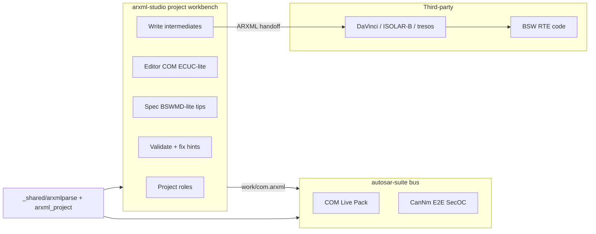

# AUTOSAR Studio vs DaVinci / tresos

> Research date: 2026-09-22  
> Goal: make **AUTOSAR Studio** (`autosar-suite`) the unified Classic Platform workbench — BSW module configuration, project ARXML, and live COM/NM/E2E/SecOC — then hand off ARXML to third-party stacks for **code generation**. Former `arxml-studio` is merged and removed.  
> Related: [DBC_Studio_vs_CANdb.md](DBC_Studio_vs_CANdb.md), [EDS_Studio_vs_CANeds.md](EDS_Studio_vs_CANeds.md), [Domain_Suite_Competitive_Requirements.md](Domain_Suite_Competitive_Requirements.md).

---

## 0. Product boundary (hard)

| In scope (upstream) | Out of scope (downstream) |
|---------------------|---------------------------|
| System Description / ECU Extract / Communication ARXML authoring | BSW / RTE / OS **source code generation** |
| ECUC parameter tree when present in ARXML | Vendor protocol-stack build (MICROSAR, RTA-BSW, …) |
| Spec-aligned validate, guided tips, Compare / Merge | Full multi-vendor BSWMD GCE (Phase 4+) |
| Project workspace + role-tagged ARXML + ECUC-lite intermediates | Vendor protocol-stack build / GenData C |
| Export DBC / HTML / CSV / SARIF; AI Attach; host notify | HIL, restbus, live COM TX/RX (→ `autosar-suite`) |

**One-line pitch:** *Configure and prove the ARXML project; let Vector / ETAS / EB generate the stack.*

---

## 1. Industry Top2 (configuration / validation layer)

| # | Product | Why it is Top2 for *our* slice |
|---|---------|--------------------------------|
| 1 | **[Vector DaVinci Configurator Classic](https://www.vector.com/en/product/microsar-classic/davinci-configurator-classic/)** (+ EcuXPro) | Fact standard for ECU-C workflows: live consistency checks, **recommended one-click fixes**, acknowledgeable findings, module UIs, ARXML in/out. We **do not** compete on MICROSAR codegen — we compete on **clarity of configure → validate → ARXML**. |
| 2 | **[Elektrobit EB tresos Studio](https://www.elektrobit.com/products/ecu/eb-tresos/studio/)** (alt: ETAS ISOLAR-A/B) | Meta-model–driven ECUC parameter editors: every parameter has **definition, range, multiplicity, description** from BSWMD / AUTOSAR meta. Industry reference for “user knows what this knob does.” |

**Open-source depth reference (not Top2):** ARXML / System Template tooling in AUTOSAR tools (e.g. community editors) — useful for schema subset ideas only.

### Pain points we attack (market reality)

| Pain | Typical mid tools | AUTOSAR Studio response |
|------|-------------------|------------------------|
| Ugly / non-VS-Code chrome | Nested panels, modal hell | Same workbench as DBC/EDS Studio |
| Weak / opaque validation | Dump “Error 0x…” | Navigable findings + **why** + **suggested fix** |
| No merge / compare | Manual XML diff | First-class Compare / Merge lite |
| Spec mismatch | Informal rules | AUTOSAR CP communication + ECUC consistency ruleset |
| Unknown parameters | Label-only forms | **Spec** page + inline tips from glossary / BSWMD-lite |
| Stack lock-in | Tool owns codegen | **ARXML-only deliverable**; vendor tools generate code |

---

## 2. Capability matrix

| Capability | DaVinci Configurator | EB tresos / ISOLAR | Phase 0–2 | Phase 3 target |
|------------|----------------------|--------------------|-----------|----------------|
| Open / save ARXML | yes | yes | COM file | **Project + role files** |
| Package / element tree | yes | yes | I-PDU tree | COM + **ECUC-lite** (Com/CanIf/PduR/CanNm) |
| Parameter help / meta | strong (BSWMD) | **strongest** | Spec glossary | Glossary + **BSWMD-lite** |
| Consistency check | **live + fixes** | module checks | COM deep | COM + **cross-artifact** |
| Project / multi-ARXML | yes | yes | no | **project.json + roles** |
| Intermediate write | GenData | GenData | single ARXML | `work/com` + `work/ecuc_com` |
| Compare / Merge | limited / EcuXPro | project | yes | yes (file peer) |
| Export DBC / docs | via toolchain | partial | DBC/HTML/CSV | + SARIF under `out/` |
| Codegen BSW/RTE | **yes** | **yes** | no | **Never** (by design) |
| Live COM / NM | CANoe | — | suite | Stay in `autosar-suite` |
| AI / host loop | weak | weak | yes | yes |

---

## 3. Requirements (PRD)

### Must-have (P0)

1. File workbench: New / Open / Save / Undo; OUTPUT collapsed by default.  
2. Editor: ARXML element tree (Packages → I-SIGNAL / I-SIGNAL-I-PDU / CAN-FRAME / TRIGGERING; ECUC modules when present).  
3. Property form with **inline Spec tip** (what / why / typical range).  
4. Validate: navigable findings; lint-on-save gate; CSV/JSON/SARIF.  
5. Round-trip serialize of the supported subset without destroying unknown sibling XML where practical (preserve-or-rebuild strategy documented).  
6. Shared parser `_shared/arxmlparse.py`; `autosar-suite` reuses it.

### Should-have (P1)

7. Spec browser: searchable glossary of AUTOSAR CP communication + common ECUC parameters.  
8. Suggested fixes (“Remove overlapping signal”, “Set LENGTH to cover mapping”).  
9. Compare two ARXML (structural + COM semantic).  
10. Library: starter templates (empty system, body CAN sample, ECU extract stub).  
11. Double-click finding → Editor.

### Could-have (P2)

12. Merge lite (take added SHORT-NAMEs from B).  
13. ECU Extract lens / filter by ECU instance.  
14. Analysis: unmapped signals, frames without triggering, DLC vs bit coverage.  
15. Export HTML configuration report; handoff path to DaVinci/tresos documented.  
16. Open-from / Apply-to `autosar-suite`.

### Explicit non-goals

- Generate Com.c / Rte.c / Os.c or any vendor BSW.  
- Full AUTOSAR metamodel / XSD validation of every schema version.  
- Replace PREEvision system design or DaVinci Developer SWC modeling wholesale (SWC ports may be Phase 3+ lite).

---

## 4. Product chrome & navigation

Workbench = `suite_chrome.build_workbench` (DBC/EDS parity).

| Key | Page | Job |
|-----|------|-----|
| `project` | Project | Roles, derive ECUC, write intermediates |
| `editor` | Editor | COM \| ECUC tree + properties + Spec tip |
| `spec` | Spec | Glossary + BSWMD-lite import |
| `validate` | Validate | Cross-artifact findings + recipe packs + SARIF |
| `compare` | Compare | A vs B |
| `merge` | Merge | Merge added / policy |
| `export` | Export | ARXML / DBC / HTML / CSV / project out |
| `library` | Library | File + **project** starters |
| `swc` | SWC | Port mapping lite (no RTE codegen) |
| `timing` | Analysis | Coverage & consistency stats |

---

## 5. Phased delivery

### Phase 0 — Baseline

- [x] Scaffold `plugins/arxml-studio/` + market entry  
- [x] `ArxmlDocument` (path / dirty / undo)  
- [x] `_shared/arxmlparse` lift from `arxml_min` + tests  
- [x] Editor tree + form + Save  
- [x] Validate minimal + lint-before-save  

### Phase 1 — Beat mid tools on clarity

- [x] Spec glossary + tip under every property  
- [x] Deep Validate (names, DLC, overlap, refs, CAN-ID) + suggested fix  
- [x] Compare  
- [x] Library starters  
- [x] Finding → Editor  

### Phase 2 — Upstream completeness

- [x] Merge lite  
- [x] Export DBC / HTML report / Extract lens  
- [x] Analysis page  
- [x] autosar-suite “Open in AUTOSAR Studio” handoff  
- [x] Host notify + AI Attach  

### Phase 3 — Project engineering + intermediate validate

- [x] `project.json` layout + Project page (roles, open/save)  
- [x] ECUC-lite derive/serialize (Com / CanIf / PduR / CanNm)  
- [x] Editor COM \| ECUC modes + BSWMD-lite Spec tips  
- [x] Cross-artifact Validate + safe fixes + write `out/` SARIF/HTML  
- [x] Library project templates + autosar handoff prefers `work/com.arxml`  

### Phase 4 — Intelligence

- [x] BSWMD-lite import (JSON tip pack + built-in Com/CanIf/PduR/CanNm)  
- [x] Auto-fix recipe packs (bump DLC / unique CAN IDs / re-derive ECUC)  
- [x] SWC / port mapping lite page (still no codegen)  
- [x] Full menu bar (File / Edit / Project / BSW / View / Tools / Help)  
- [x] Complete BSW module catalog (Os, Com, ComM, PduR, BswM, CanIf, CanSM, CanTp, Dcm, Dem, EthIf, Fee, Fim, MemIf, Nm, NvM, …) — one ARXML per module under `work/bsw/`  

### Phase 5 — Full BSW project + DBC import

- [x] Complete menubar: File / Edit / Import / Project / BSW / Validate / View / Help  
- [x] Import DBC → COM I-PDU/signals (`arxml_dbc.py`) + sync Com / CanIf / PduR / CanNm / EcuC  
- [x] Deeper Comm / Diag / Mem / System ECUC starter schemas + `validate_bsw_set`  
- [x] Remaining catalog modules (Lin* / Fr* / Eth* / SecOC / Wdg* …) richer starters  
- [x] Docs + DBC/project tests + market pack sync  

### Phase 6 — Schema-driven BSW configurator

- [x] Curated EcucDefs JSON packs under `_shared/ecuc_schemas/` (all catalog modules)  
- [x] BSW page: instance tree + Add/Remove/Duplicate + typed params (bool/enum/num/ref)  
- [x] Rich packs: Os, Com, ComM, PduR, BswM, Can*, Dcm, Dem, EthIf, Fee, FiM, MemIf, Nm, NvM, …  
- [x] ECUC-lite serialize by param kind; schema validate; export `work/bsw/<Module>.arxml`  

---

## 6. Decision log

- 2026-09-22: Top2 locked — **DaVinci Configurator Classic** (validate/fix UX) + **EB tresos** (meta-driven parameter help). ETAS ISOLAR as secondary reference.  
- 2026-09-22: Product = file-centric `arxml-studio`; live COM stays in `autosar-suite`.  
- 2026-09-22: **No protocol-stack code generation** — ARXML is the deliverable to third-party tools.  
- 2026-09-22: Parser lives in `_shared/arxmlparse.py` (same pattern as dbcparse / edsparse).  
- 2026-09-22: Shipped Phase 0–2 in `plugins/arxml-studio/` (Editor/Spec/Validate/Compare/Merge/Export/Library/Analysis).  
- 2026-09-22: Phase 3 — project workspace (`arxml_project.py`), ECUC-lite intermediates, BSWMD-lite tips, cross-artifact validate.  
- 2026-09-22: Phase 4 — BSWMD import, fix recipe packs, SWC/port mapping lite (still no stack codegen).  
- 2026-09-22: Phase 5 — full menu + DBC import → COM/BSW sync; deep ECUC starters; cross-module validate; still no codegen.  
- 2026-09-22: Phase 6 — schema-driven BSW configurator (`arxml_ecuc_schema` + multiplicity UI); curated CP EcucDefs packs; still no codegen.  

---

## 7. Implementation notes

- Clone chrome from `eds-studio` (document controls, recent, chrome_tabs pattern).  
- Project root = folder with `project.json`; roles point at `input/` and `work/`.  
- Shared: `_shared/arxmlparse.py` + `_shared/arxml_project.py` + `_shared/arxml_bsw.py` + `_shared/arxml_dbc.py` + `_shared/arxml_ecuc_schema.py` + `ecuc_schemas/*.json`.  
- Preserve English-only in non-`.md` sources.  
- After each phase: update this checklist and `Domain_Suite_Competitive_Requirements.md` §1c.  
